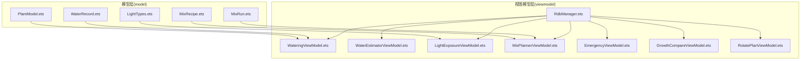
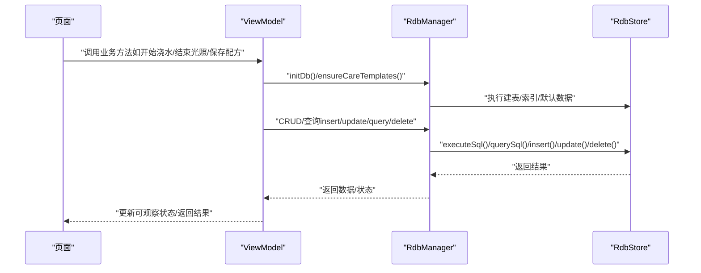
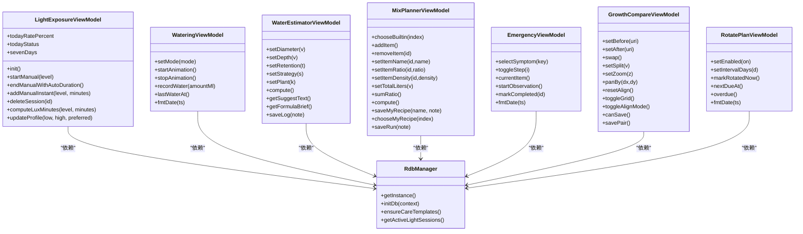
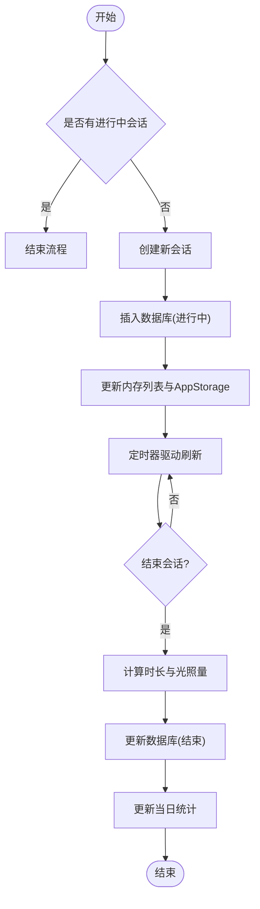

# API参考

<cite>
**本文引用的文件**
- [entry/src/main/ets/viewmodel/RdbManager.ets](file://entry/src/main/ets/viewmodel/RdbManager.ets)
- [entry/src/main/ets/viewmodel/WateringViewModel.ets](file://entry/src/main/ets/viewmodel/WateringViewModel.ets)
- [entry/src/main/ets/viewmodel/WaterEstimatorViewModel.ets](file://entry/src/main/ets/viewmodel/WaterEstimatorViewModel.ets)
- [entry/src/main/ets/viewmodel/LightExposureViewModel.ets](file://entry/src/main/ets/viewmodel/LightExposureViewModel.ets)
- [entry/src/main/ets/viewmodel/MixPlannerViewModel.ets](file://entry/src/main/ets/viewmodel/MixPlannerViewModel.ets)
- [entry/src/main/ets/viewmodel/EmergencyViewModel.ets](file://entry/src/main/ets/viewmodel/EmergencyViewModel.ets)
- [entry/src/main/ets/viewmodel/GrowthCompareViewModel.ets](file://entry/src/main/ets/viewmodel/GrowthCompareViewModel.ets)
- [entry/src/main/ets/viewmodel/RotatePlanViewModel.ets](file://entry/src/main/ets/viewmodel/RotatePlanViewModel.ets)
- [entry/src/main/ets/model/PlantModel.ets](file://entry/src/main/ets/model/PlantModel.ets)
- [entry/src/main/ets/model/WaterRecord.ets](file://entry/src/main/ets/model/WaterRecord.ets)
- [entry/src/main/ets/model/LightTypes.ets](file://entry/src/main/ets/model/LightTypes.ets)
- [entry/src/main/ets/model/MixRecipe.ets](file://entry/src/main/ets/model/MixRecipe.ets)
- [entry/src/main/ets/model/MixRun.ets](file://entry/src/main/ets/model/MixRun.ets)
- [entry/src/main/ets/viewmodel/err.ets](file://entry/src/main/ets/viewmodel/err.ets)
</cite>

## 目录
1. [简介](#简介)
2. [项目结构](#项目结构)
3. [核心组件](#核心组件)
4. [架构总览](#架构总览)
5. [详细组件分析](#详细组件分析)
6. [依赖分析](#依赖分析)
7. [性能考量](#性能考量)
8. [故障排查指南](#故障排查指南)
9. [结论](#结论)
10. [附录](#附录)

## 简介
本API参考面向植物日记项目的前端ViewModel与数据模型，覆盖以下方面：
- 数据模型属性定义与用途
- ViewModel层业务接口（CRUD、查询、状态管理）
- 组件API的属性配置、事件回调与生命周期要点
- 错误处理机制、异常类型与返回值说明
- TypeScript类型与接口规范
- 每个API的实际使用示例与集成指导

## 项目结构
项目采用按功能域划分的目录组织方式，核心代码位于 entry/src/main/ets 下，分为 model（数据模型）、viewmodel（业务逻辑与状态）、pages（页面）、view（组件）等子目录。

**图表来源**
- [entry/src/main/ets/viewmodel/RdbManager.ets:1-296](file://entry/src/main/ets/viewmodel/RdbManager.ets#L1-L296)
- [entry/src/main/ets/viewmodel/WateringViewModel.ets:1-102](file://entry/src/main/ets/viewmodel/WateringViewModel.ets#L1-L102)
- [entry/src/main/ets/viewmodel/WaterEstimatorViewModel.ets:1-130](file://entry/src/main/ets/viewmodel/WaterEstimatorViewModel.ets#L1-L130)
- [entry/src/main/ets/viewmodel/LightExposureViewModel.ets:1-554](file://entry/src/main/ets/viewmodel/LightExposureViewModel.ets#L1-L554)
- [entry/src/main/ets/viewmodel/MixPlannerViewModel.ets:1-228](file://entry/src/main/ets/viewmodel/MixPlannerViewModel.ets#L1-L228)
- [entry/src/main/ets/viewmodel/EmergencyViewModel.ets:1-115](file://entry/src/main/ets/viewmodel/EmergencyViewModel.ets#L1-L115)
- [entry/src/main/ets/viewmodel/GrowthCompareViewModel.ets:1-109](file://entry/src/main/ets/viewmodel/GrowthCompareViewModel.ets#L1-L109)
- [entry/src/main/ets/viewmodel/RotatePlanViewModel.ets:1-88](file://entry/src/main/ets/viewmodel/RotatePlanViewModel.ets#L1-L88)
- [entry/src/main/ets/model/PlantModel.ets:1-166](file://entry/src/main/ets/model/PlantModel.ets#L1-L166)
- [entry/src/main/ets/model/WaterRecord.ets:1-18](file://entry/src/main/ets/model/WaterRecord.ets#L1-L18)
- [entry/src/main/ets/model/LightTypes.ets:1-124](file://entry/src/main/ets/model/LightTypes.ets#L1-L124)
- [entry/src/main/ets/model/MixRecipe.ets:1-33](file://entry/src/main/ets/model/MixRecipe.ets#L1-L33)
- [entry/src/main/ets/model/MixRun.ets:1-31](file://entry/src/main/ets/model/MixRun.ets#L1-L31)

**章节来源**
- [entry/src/main/ets/viewmodel/RdbManager.ets:1-296](file://entry/src/main/ets/viewmodel/RdbManager.ets#L1-L296)
- [entry/src/main/ets/viewmodel/WateringViewModel.ets:1-102](file://entry/src/main/ets/viewmodel/WateringViewModel.ets#L1-L102)
- [entry/src/main/ets/viewmodel/WaterEstimatorViewModel.ets:1-130](file://entry/src/main/ets/viewmodel/WaterEstimatorViewModel.ets#L1-L130)
- [entry/src/main/ets/viewmodel/LightExposureViewModel.ets:1-554](file://entry/src/main/ets/viewmodel/LightExposureViewModel.ets#L1-L554)
- [entry/src/main/ets/viewmodel/MixPlannerViewModel.ets:1-228](file://entry/src/main/ets/viewmodel/MixPlannerViewModel.ets#L1-L228)
- [entry/src/main/ets/viewmodel/EmergencyViewModel.ets:1-115](file://entry/src/main/ets/viewmodel/EmergencyViewModel.ets#L1-L115)
- [entry/src/main/ets/viewmodel/GrowthCompareViewModel.ets:1-109](file://entry/src/main/ets/viewmodel/GrowthCompareViewModel.ets#L1-L109)
- [entry/src/main/ets/viewmodel/RotatePlanViewModel.ets:1-88](file://entry/src/main/ets/viewmodel/RotatePlanViewModel.ets#L1-L88)
- [entry/src/main/ets/model/PlantModel.ets:1-166](file://entry/src/main/ets/model/PlantModel.ets#L1-L166)
- [entry/src/main/ets/model/WaterRecord.ets:1-18](file://entry/src/main/ets/model/WaterRecord.ets#L1-L18)
- [entry/src/main/ets/model/LightTypes.ets:1-124](file://entry/src/main/ets/model/LightTypes.ets#L1-L124)
- [entry/src/main/ets/model/MixRecipe.ets:1-33](file://entry/src/main/ets/model/MixRecipe.ets#L1-L33)
- [entry/src/main/ets/model/MixRun.ets:1-31](file://entry/src/main/ets/model/MixRun.ets#L1-L31)

## 核心组件
- 数据模型：Plant、PlanTpl、PlantTask、LogEntry、Metric、PlantMetric、CareTemplate、CareRule、WaterRecord、MixRecipe、MixRun、LightLevel、LightStatus、MixItem、MixResultItem、GrowthPair、RotatePlan、EmergencyLog、DailyLightStat、ExposureSession、LightProfile 等。
- 视图模型：RdbManager（数据库管理）、WateringViewModel、WaterEstimatorViewModel、LightExposureViewModel、MixPlannerViewModel、EmergencyViewModel、GrowthCompareViewModel、RotatePlanViewModel。
- 工具与类型：LightTypes（光照级别、状态、工具函数）、PlantModel（基础数据模型）、MixRecipe/MixRun（配土配方与运行记录）、WaterRecord（浇水记录）、PlantModel（Plant、PlanTpl、PlantTask、LogEntry、Metric、PlantMetric、CareTemplate、CareRule）。

**章节来源**
- [entry/src/main/ets/model/PlantModel.ets:1-166](file://entry/src/main/ets/model/PlantModel.ets#L1-L166)
- [entry/src/main/ets/model/WaterRecord.ets:1-18](file://entry/src/main/ets/model/WaterRecord.ets#L1-L18)
- [entry/src/main/ets/model/LightTypes.ets:1-124](file://entry/src/main/ets/model/LightTypes.ets#L1-L124)
- [entry/src/main/ets/model/MixRecipe.ets:1-33](file://entry/src/main/ets/model/MixRecipe.ets#L1-L33)
- [entry/src/main/ets/model/MixRun.ets:1-31](file://entry/src/main/ets/model/MixRun.ets#L1-L31)
- [entry/src/main/ets/viewmodel/RdbManager.ets:1-296](file://entry/src/main/ets/viewmodel/RdbManager.ets#L1-L296)
- [entry/src/main/ets/viewmodel/WateringViewModel.ets:1-102](file://entry/src/main/ets/viewmodel/WateringViewModel.ets#L1-L102)
- [entry/src/main/ets/viewmodel/WaterEstimatorViewModel.ets:1-130](file://entry/src/main/ets/viewmodel/WaterEstimatorViewModel.ets#L1-L130)
- [entry/src/main/ets/viewmodel/LightExposureViewModel.ets:1-554](file://entry/src/main/ets/viewmodel/LightExposureViewModel.ets#L1-L554)
- [entry/src/main/ets/viewmodel/MixPlannerViewModel.ets:1-228](file://entry/src/main/ets/viewmodel/MixPlannerViewModel.ets#L1-L228)
- [entry/src/main/ets/viewmodel/EmergencyViewModel.ets:1-115](file://entry/src/main/ets/viewmodel/EmergencyViewModel.ets#L1-L115)
- [entry/src/main/ets/viewmodel/GrowthCompareViewModel.ets:1-109](file://entry/src/main/ets/viewmodel/GrowthCompareViewModel.ets#L1-L109)
- [entry/src/main/ets/viewmodel/RotatePlanViewModel.ets:1-88](file://entry/src/main/ets/viewmodel/RotatePlanViewModel.ets#L1-L88)

## 架构总览
- ViewModel层负责业务状态与交互逻辑，通过RdbManager访问本地关系型数据库，实现数据持久化与查询。
- Model层提供轻量数据结构，便于页面与ViewModel共享。
- 组件通过ViewModel提供的可观察状态与方法进行绑定与交互。

**图表来源**
- [entry/src/main/ets/viewmodel/RdbManager.ets:27-170](file://entry/src/main/ets/viewmodel/RdbManager.ets#L27-L170)
- [entry/src/main/ets/viewmodel/LightExposureViewModel.ets:43-113](file://entry/src/main/ets/viewmodel/LightExposureViewModel.ets#L43-L113)
- [entry/src/main/ets/viewmodel/WateringViewModel.ets:44-57](file://entry/src/main/ets/viewmodel/WateringViewModel.ets#L44-L57)
- [entry/src/main/ets/viewmodel/MixPlannerViewModel.ets:170-181](file://entry/src/main/ets/viewmodel/MixPlannerViewModel.ets#L170-L181)

## 详细组件分析

### 数据模型 API
- Plant
  - 属性：id、name、species、location、createdAt
  - 用途：植物基本信息
- PlanTpl
  - 属性：id、name、type、everyDays、times、createdAt
  - 用途：周期模板
- PlantTask
  - 属性：id、plantId、type、planDate、done、doneAt
  - 用途：任务计划与完成状态
- LogEntry
  - 属性：id、plantId、note、createdAt
  - 用途：植物日志
- Metric / PlantMetric
  - 属性：id、plantId、height、width、score、createdAt
  - 用途：生长指标（身高、冠幅、健康分）
- CareTemplate / CareRule
  - 属性：id、name、desc；id、templateId、type、intervalDays、horizonDays
  - 用途：养护模板与规则
- WaterRecord
  - 属性：id、plantId、mode、amountMl、createdAt
  - 用途：浇水记录（内存态）
- MixRecipe / MixItem
  - 属性：id、name、items、note、createdAt、isBuiltin；id、name、ratio、density
  - 用途：配土配方与条目
- MixRun / MixResultItem
  - 属性：id、recipeName、totalLiters、result、note、createdAt；name、liters、kg
  - 用途：配土运行记录与结果
- LightTypes（枚举与工具）
  - 枚举：LightLevel（LOW/MID/HIGH）、LightStatus（INSUFF/OK/STRONG）
  - 工具：levelWeight、ymd、hm、clampRate、genId、lightLevelLabel、statusLabel、statusColor
- GrowthPair
  - 属性：id、plantId、beforeUri、afterUri、note、alignGrid
  - 用途：前后对比卡片
- RotatePlan
  - 属性：id、enabled、intervalDays、lastRotatedAt
  - 用途：转盆计划
- EmergencyLog
  - 属性：id、plantId、symptomKey、title、stepsChecked、note、reviewAt、completed
  - 用途：急救记录

**章节来源**
- [entry/src/main/ets/model/PlantModel.ets:6-166](file://entry/src/main/ets/model/PlantModel.ets#L6-L166)
- [entry/src/main/ets/model/WaterRecord.ets:3-17](file://entry/src/main/ets/model/WaterRecord.ets#L3-L17)
- [entry/src/main/ets/model/LightTypes.ets:9-124](file://entry/src/main/ets/model/LightTypes.ets#L9-L124)
- [entry/src/main/ets/model/MixRecipe.ets:4-32](file://entry/src/main/ets/model/MixRecipe.ets#L4-L32)
- [entry/src/main/ets/model/MixRun.ets:4-30](file://entry/src/main/ets/model/MixRun.ets#L4-L30)

### ViewModel API

#### RdbManager（数据库管理）
- 单例实例化：getInstance()
- 初始化数据库：initDb(context)
  - 创建表：plant、task、tpl、log、metric、log_photo、care_template、care_rule、light_profile、exposure_session
  - 创建索引：task(plantId, planDate)、log(plantId, createdAt)、log_photo(logId)、metric(plantId, createdAt)
- 默认数据：ensureCareTemplates()
- 查询活跃光照会话：getActiveLightSessions()

**章节来源**
- [entry/src/main/ets/viewmodel/RdbManager.ets:4-296](file://entry/src/main/ets/viewmodel/RdbManager.ets#L4-L296)

#### WateringViewModel（浇水）
- 属性：plantId、isAnimating、mode、defaultAmount、recentTimes[]、streakDays
- 方法：
  - setMode(mode)
  - startAnimation() / stopAnimation()
  - recordWater(amountMl) -> WaterRecord
  - lastWaterAt() -> number
  - fmtDate(ts) -> string

**章节来源**
- [entry/src/main/ets/viewmodel/WateringViewModel.ets:11-102](file://entry/src/main/ets/viewmodel/WateringViewModel.ets#L11-L102)

#### WaterEstimatorViewModel（浇水估算）
- 属性：plantId、diameterCm、depthCm、retention、strategy、plantKind、low/mid/high、logs[]
- 方法：
  - setDiameter(v)、setDepth(v)、setRetention(t)、setStrategy(s)、setPlant(k)
  - compute()（内部调用模型层估算函数）
  - getSuggestText()、getFormulaBrief()
  - saveLog(note) -> WaterEstimateLog

**章节来源**
- [entry/src/main/ets/viewmodel/WaterEstimatorViewModel.ets:16-130](file://entry/src/main/ets/viewmodel/WaterEstimatorViewModel.ets#L16-L130)

#### LightExposureViewModel（光照）
- 属性：plantId、profile(LightProfile)、sessions[]、dailyStats[]、hasActive、activeSession、tick
- 方法：
  - init()（加载配置/会话/统计）
  - refreshProgress()
  - startManual(level)
  - endManualWithAutoDuration()
  - addManualInstant(level, minutes)
  - deleteSession(id)
  - computeLuxMinutes(level, minutes)
  - todayRatePercent（getter）、todayStatus（getter）
  - sevenDays（getter）
  - updateProfile(low, high, preferred)

**章节来源**
- [entry/src/main/ets/viewmodel/LightExposureViewModel.ets:16-554](file://entry/src/main/ets/viewmodel/LightExposureViewModel.ets#L16-L554)

#### MixPlannerViewModel（配土）
- 属性：plantId、recipeName、items[]、totalLiters、builtinRecipes[]、myRecipes[]、runs[]
- 方法：
  - chooseBuiltin(index)
  - addItem()、removeItem(id)、setItemName(id,name)、setItemRatio(id,ratio)、setItemDensity(id,density)
  - setTotalLiters(v)
  - sumRatio()、compute() -> MixResultItem[]
  - saveMyRecipe(name, note) -> MixRecipe
  - chooseMyRecipe(index)
  - saveRun(note) -> MixRun

**章节来源**
- [entry/src/main/ets/viewmodel/MixPlannerViewModel.ets:17-228](file://entry/src/main/ets/viewmodel/MixPlannerViewModel.ets#L17-L228)

#### EmergencyViewModel（急救）
- 属性：plantId、playbook[]、selectedKey、stepChecked[]、note、logs[]
- 方法：
  - ensureStepArray()
  - selectSymptom(key)
  - toggleStep(i)
  - currentItem() -> PlaybookItem
  - startObservation() -> EmergencyLog
  - markCompleted(id)
  - fmtDate(ts) -> string

**章节来源**
- [entry/src/main/ets/viewmodel/EmergencyViewModel.ets:13-115](file://entry/src/main/ets/viewmodel/EmergencyViewModel.ets#L13-L115)

#### GrowthCompareViewModel（前后对比）
- 属性：plantId、beforeUri、afterUri、note、split、zoom、offsetX、offsetY、showGrid、alignMode、pairs[]
- 方法：
  - setBefore(uri)、setAfter(uri)、swap()
  - setSplit(v)、setZoom(z)、panBy(dx,dy)、resetAlign()
  - toggleGrid()、toggleAlignMode()
  - canSave() -> boolean
  - savePair() -> GrowthPair

**章节来源**
- [entry/src/main/ets/viewmodel/GrowthCompareViewModel.ets:12-109](file://entry/src/main/ets/viewmodel/GrowthCompareViewModel.ets#L12-L109)

#### RotatePlanViewModel（转盆计划）
- 属性：plantId、plan(RotatePlan)、enabled、intervalDays、lastRotatedAt、logs[]
- 方法：
  - setEnabled(on)、setIntervalDays(d)
  - markRotatedNow()
  - nextDueAt() -> number
  - overdue() -> boolean
  - fmtDate(ts) -> string

**章节来源**
- [entry/src/main/ets/viewmodel/RotatePlanViewModel.ets:18-88](file://entry/src/main/ets/viewmodel/RotatePlanViewModel.ets#L18-L88)

### 组件API与生命周期
- 组件通过ViewModel的可观察属性与方法进行绑定：
  - ViewModel属性变更触发UI响应式更新
  - 页面在需要时调用ViewModel方法（如startAnimation、startManual、saveRun等）
- 生命周期要点：
  - 页面onAppear/onInit中调用ViewModel.init()加载数据
  - 定时器驱动refreshProgress以刷新UI
  - 页面销毁时注意释放资源与取消定时器

**章节来源**
- [entry/src/main/ets/viewmodel/LightExposureViewModel.ets:119-122](file://entry/src/main/ets/viewmodel/LightExposureViewModel.ets#L119-L122)
- [entry/src/main/ets/viewmodel/WateringViewModel.ets:36-41](file://entry/src/main/ets/viewmodel/WateringViewModel.ets#L36-L41)

### 错误处理机制
- 数据库异常降级：getActiveLightSessions()在查询失败时返回空Map
- 输入参数边界保护：各ViewModel对数值范围进行约束（如setIntervalDays、setDiameter等）
- UI友好提示：ViewModel内部通过banner或日志提示用户（参考err.ets中的注释示例）

**章节来源**
- [entry/src/main/ets/viewmodel/RdbManager.ets:277-294](file://entry/src/main/ets/viewmodel/RdbManager.ets#L277-L294)
- [entry/src/main/ets/viewmodel/RotatePlanViewModel.ets:45-51](file://entry/src/main/ets/viewmodel/RotatePlanViewModel.ets#L45-L51)
- [entry/src/main/ets/viewmodel/WaterEstimatorViewModel.ets:41-55](file://entry/src/main/ets/viewmodel/WaterEstimatorViewModel.ets#L41-L55)
- [entry/src/main/ets/viewmodel/MixPlannerViewModel.ets:154-159](file://entry/src/main/ets/viewmodel/MixPlannerViewModel.ets#L154-L159)
- [entry/src/main/ets/viewmodel/GrowthCompareViewModel.ets:48-52](file://entry/src/main/ets/viewmodel/GrowthCompareViewModel.ets#L48-L52)
- [entry/src/main/ets/viewmodel/err.ets:1-169](file://entry/src/main/ets/viewmodel/err.ets#L1-L169)

### 使用示例与集成指导
- 初始化数据库与模板
  - 在应用启动时调用RdbManager.getInstance().initDb(context)
  - 首次使用前调用ensureCareTemplates()
- 光照会话管理
  - 页面onInit中调用LightExposureViewModel.init()
  - 用户点击“开始补光”调用startManual(level)
  - 定时器周期调用refreshProgress
  - 结束时调用endManualWithAutoDuration()
- 浇水记录
  - 用户点击“浇水”调用recordWater(amountMl)，得到WaterRecord后决定是否持久化
- 配方计算
  - 用户调整配方参数后自动触发compute()
  - 保存为“我的配方”或一次运行记录
- 急救流程
  - 选择症状、勾选步骤、填写备注后生成EmergencyLog
- 前后对比
  - 选择前后图片，调整分割、缩放与偏移，保存GrowthPair
- 转盆计划
  - 设置周期与启用状态，完成打卡后更新历史

**章节来源**
- [entry/src/main/ets/viewmodel/RdbManager.ets:27-170](file://entry/src/main/ets/viewmodel/RdbManager.ets#L27-L170)
- [entry/src/main/ets/viewmodel/LightExposureViewModel.ets:43-113](file://entry/src/main/ets/viewmodel/LightExposureViewModel.ets#L43-L113)
- [entry/src/main/ets/viewmodel/WateringViewModel.ets:44-57](file://entry/src/main/ets/viewmodel/WateringViewModel.ets#L44-L57)
- [entry/src/main/ets/viewmodel/MixPlannerViewModel.ets:170-228](file://entry/src/main/ets/viewmodel/MixPlannerViewModel.ets#L170-L228)
- [entry/src/main/ets/viewmodel/EmergencyViewModel.ets:60-75](file://entry/src/main/ets/viewmodel/EmergencyViewModel.ets#L60-L75)
- [entry/src/main/ets/viewmodel/GrowthCompareViewModel.ets:94-107](file://entry/src/main/ets/viewmodel/GrowthCompareViewModel.ets#L94-L107)
- [entry/src/main/ets/viewmodel/RotatePlanViewModel.ets:54-62](file://entry/src/main/ets/viewmodel/RotatePlanViewModel.ets#L54-L62)

## 依赖分析
- ViewModel对Model的依赖：ViewModel持有Model实例或调用其工具函数（如WaterRecord、MixRun、LightProfile等）
- ViewModel对RdbManager的依赖：通过单例访问数据库，执行建表、索引、CRUD与查询
- 组件对ViewModel的依赖：组件通过绑定ViewModel的可观察属性与方法进行交互

**图表来源**
- [entry/src/main/ets/viewmodel/RdbManager.ets:4-296](file://entry/src/main/ets/viewmodel/RdbManager.ets#L4-L296)
- [entry/src/main/ets/viewmodel/LightExposureViewModel.ets:16-554](file://entry/src/main/ets/viewmodel/LightExposureViewModel.ets#L16-L554)
- [entry/src/main/ets/viewmodel/WateringViewModel.ets:11-102](file://entry/src/main/ets/viewmodel/WateringViewModel.ets#L11-L102)
- [entry/src/main/ets/viewmodel/WaterEstimatorViewModel.ets:16-130](file://entry/src/main/ets/viewmodel/WaterEstimatorViewModel.ets#L16-L130)
- [entry/src/main/ets/viewmodel/MixPlannerViewModel.ets:17-228](file://entry/src/main/ets/viewmodel/MixPlannerViewModel.ets#L17-L228)
- [entry/src/main/ets/viewmodel/EmergencyViewModel.ets:13-115](file://entry/src/main/ets/viewmodel/EmergencyViewModel.ets#L13-L115)
- [entry/src/main/ets/viewmodel/GrowthCompareViewModel.ets:12-109](file://entry/src/main/ets/viewmodel/GrowthCompareViewModel.ets#L12-L109)
- [entry/src/main/ets/viewmodel/RotatePlanViewModel.ets:18-88](file://entry/src/main/ets/viewmodel/RotatePlanViewModel.ets#L18-L88)

**章节来源**
- [entry/src/main/ets/viewmodel/RdbManager.ets:4-296](file://entry/src/main/ets/viewmodel/RdbManager.ets#L4-L296)
- [entry/src/main/ets/viewmodel/LightExposureViewModel.ets:16-554](file://entry/src/main/ets/viewmodel/LightExposureViewModel.ets#L16-L554)
- [entry/src/main/ets/viewmodel/WateringViewModel.ets:11-102](file://entry/src/main/ets/viewmodel/WateringViewModel.ets#L11-L102)
- [entry/src/main/ets/viewmodel/WaterEstimatorViewModel.ets:16-130](file://entry/src/main/ets/viewmodel/WaterEstimatorViewModel.ets#L16-L130)
- [entry/src/main/ets/viewmodel/MixPlannerViewModel.ets:17-228](file://entry/src/main/ets/viewmodel/MixPlannerViewModel.ets#L17-L228)
- [entry/src/main/ets/viewmodel/EmergencyViewModel.ets:13-115](file://entry/src/main/ets/viewmodel/EmergencyViewModel.ets#L13-L115)
- [entry/src/main/ets/viewmodel/GrowthCompareViewModel.ets:12-109](file://entry/src/main/ets/viewmodel/GrowthCompareViewModel.ets#L12-L109)
- [entry/src/main/ets/viewmodel/RotatePlanViewModel.ets:18-88](file://entry/src/main/ets/viewmodel/RotatePlanViewModel.ets#L18-L88)

## 性能考量
- 数据库层面：
  - 为高频查询建立复合索引（task、log、log_photo、metric），减少全表扫描
  - 使用唯一索引避免重复任务插入冲突
- ViewModel层面：
  - 仅在必要时重建统计（rebuildDailyStats vs updateDailyStatFor），降低计算开销
  - 使用增量更新策略，避免每次结束会话都重扫全部历史
- UI层面：
  - 通过tick驱动刷新，避免频繁不必要的重绘
  - 对输入参数设置合理边界，减少无效计算

**章节来源**
- [entry/src/main/ets/viewmodel/RdbManager.ets:134-169](file://entry/src/main/ets/viewmodel/RdbManager.ets#L134-L169)
- [entry/src/main/ets/viewmodel/LightExposureViewModel.ets:298-365](file://entry/src/main/ets/viewmodel/LightExposureViewModel.ets#L298-L365)

## 故障排查指南
- 数据库初始化失败
  - 现象：页面无法加载数据
  - 排查：确认initDb(context)已成功执行，检查表与索引是否存在
  - 参考：[RdbManager.initDb:27-170](file://entry/src/main/ets/viewmodel/RdbManager.ets#L27-L170)
- 光照会话异常
  - 现象：存在多个进行中会话
  - 排查：调用forceCloseAbnormalSession清理异常会话，检查endAt字段
  - 参考：[LightExposureViewModel.forceCloseAbnormalSession:227-251](file://entry/src/main/ets/viewmodel/LightExposureViewModel.ets#L227-L251)
- 输入参数越界
  - 现象：设置失败或UI无响应
  - 排查：检查setIntervalDays、setDiameter、setTotalLiters等边界条件
  - 参考：[RotatePlanViewModel:45-51](file://entry/src/main/ets/viewmodel/RotatePlanViewModel.ets#L45-L51)、[WaterEstimatorViewModel:41-55](file://entry/src/main/ets/viewmodel/WaterEstimatorViewModel.ets#L41-L55)、[MixPlannerViewModel:154-159](file://entry/src/main/ets/viewmodel/MixPlannerViewModel.ets#L154-L159)
- UI未刷新
  - 现象：状态变更后界面不变
  - 排查：确认调用refreshProgress或依赖@Trace/@ObservedV2的响应式更新
  - 参考：[LightExposureViewModel.refreshProgress:120-122](file://entry/src/main/ets/viewmodel/LightExposureViewModel.ets#L120-L122)

**章节来源**
- [entry/src/main/ets/viewmodel/RdbManager.ets:27-170](file://entry/src/main/ets/viewmodel/RdbManager.ets#L27-L170)
- [entry/src/main/ets/viewmodel/LightExposureViewModel.ets:90-110](file://entry/src/main/ets/viewmodel/LightExposureViewModel.ets#L90-L110)
- [entry/src/main/ets/viewmodel/RotatePlanViewModel.ets:45-51](file://entry/src/main/ets/viewmodel/RotatePlanViewModel.ets#L45-L51)
- [entry/src/main/ets/viewmodel/WaterEstimatorViewModel.ets:41-55](file://entry/src/main/ets/viewmodel/WaterEstimatorViewModel.ets#L41-L55)
- [entry/src/main/ets/viewmodel/MixPlannerViewModel.ets:154-159](file://entry/src/main/ets/viewmodel/MixPlannerViewModel.ets#L154-L159)
- [entry/src/main/ets/viewmodel/LightExposureViewModel.ets:120-122](file://entry/src/main/ets/viewmodel/LightExposureViewModel.ets#L120-L122)

## 结论
本API参考系统梳理了植物日记项目的模型与ViewModel层接口，明确了数据结构、业务方法、状态管理与错误处理策略。通过RdbManager统一管理数据库，ViewModel负责业务逻辑与UI交互，组件通过绑定可观察状态实现响应式更新。建议在集成时遵循参数边界与索引设计原则，确保性能与稳定性。

## 附录
- 类型与接口规范
  - 枚举：LightLevel、LightStatus
  - 工具函数：levelWeight、ymd、hm、clampRate、genId、lightLevelLabel、statusLabel、statusColor
  - 接口：CareTemplate、CareRule
- 示例流程图（光照会话）

**图表来源**
- [entry/src/main/ets/viewmodel/LightExposureViewModel.ets:129-192](file://entry/src/main/ets/viewmodel/LightExposureViewModel.ets#L129-L192)