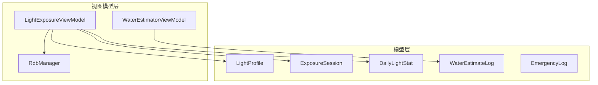
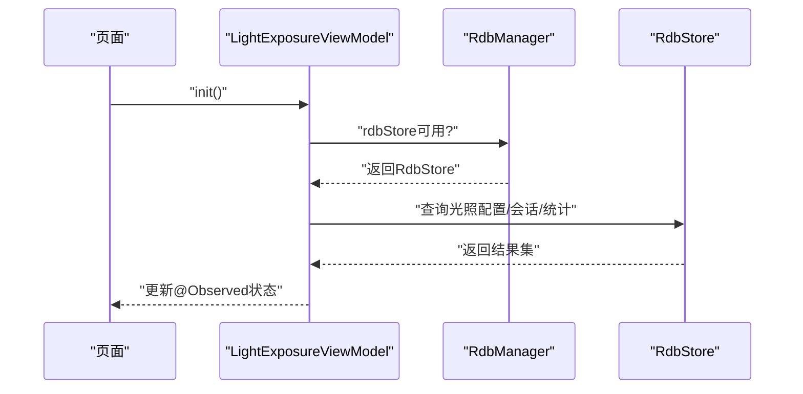
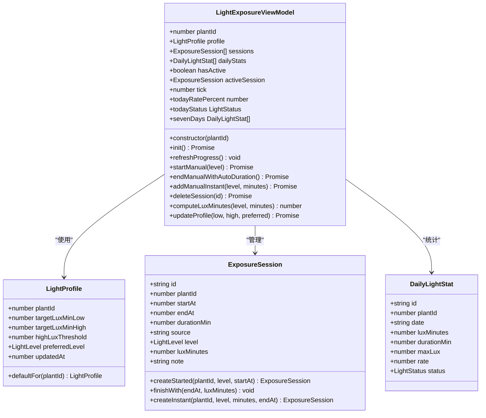
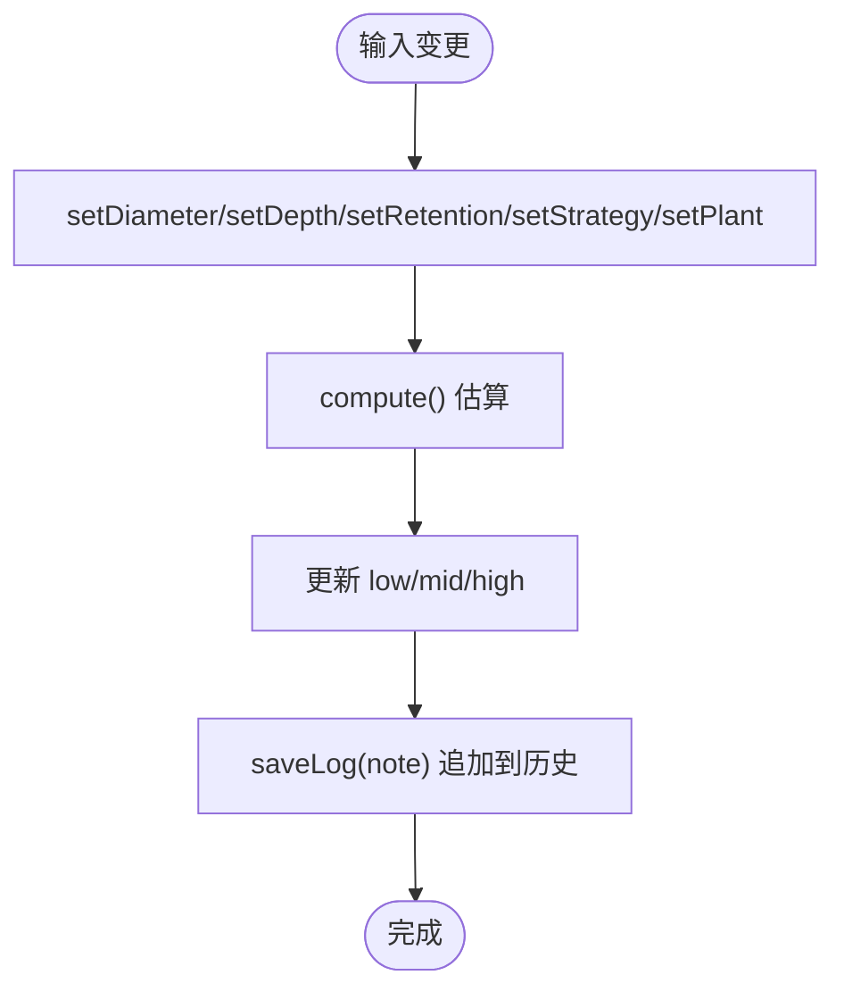
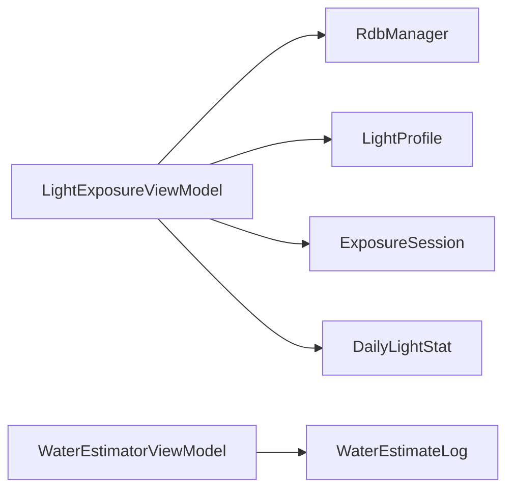

# 业务逻辑API

<cite>
**本文档引用的文件**
- [RdbManager.ets](file://entry/src/main/ets/viewmodel/RdbManager.ets)
- [LightExposureViewModel.ets](file://entry/src/main/ets/viewmodel/LightExposureViewModel.ets)
- [WaterEstimatorViewModel.ets](file://entry/src/main/ets/viewmodel/WaterEstimatorViewModel.ets)
- [LightProfile.ets](file://entry/src/main/ets/model/LightProfile.ets)
- [ExposureSession.ets](file://entry/src/main/ets/model/ExposureSession.ets)
- [DailyLightStat.ets](file://entry/src/main/ets/model/DailyLightStat.ets)
- [WaterEstimateLog.ets](file://entry/src/main/ets/model/WaterEstimateLog.ets)
- [EmergencyLog.ets](file://entry/src/main/ets/model/EmergencyLog.ets)
</cite>

## 目录
1. [简介](#简介)
2. [项目结构](#项目结构)
3. [核心组件](#核心组件)
4. [架构总览](#架构总览)
5. [详细组件分析](#详细组件分析)
6. [依赖分析](#依赖分析)
7. [性能考量](#性能考量)
8. [故障排查指南](#故障排查指南)
9. [结论](#结论)
10. [附录](#附录)

## 简介
本文件面向植物日记项目的业务逻辑API，聚焦ViewModel类与数据库管理器的公共方法、属性与事件接口，涵盖：
- RdbManager数据库管理器：数据库初始化、表结构与索引、模板数据注入、活跃光照会话查询等
- LightExposureViewModel光照业务逻辑：光照会话管理、配置更新、统计计算、图表数据生成等
- WaterEstimatorViewModel浇水估算：输入参数变更、估算计算、建议文案、历史记录保存等

文档提供每个API的参数说明、返回值类型、异常处理机制、状态管理与数据流转接口，并给出实际调用示例与最佳实践。

## 项目结构
- 视图模型位于 entry/src/main/ets/viewmodel
- 模型位于 entry/src/main/ets/model
- 数据库管理器与业务VM共同构成数据持久化与业务逻辑层

**图表来源**
- [RdbManager.ets:1-296](file://entry/src/main/ets/viewmodel/RdbManager.ets#L1-L296)
- [LightExposureViewModel.ets:1-554](file://entry/src/main/ets/viewmodel/LightExposureViewModel.ets#L1-L554)
- [WaterEstimatorViewModel.ets:1-130](file://entry/src/main/ets/viewmodel/WaterEstimatorViewModel.ets#L1-L130)
- [LightProfile.ets:1-41](file://entry/src/main/ets/model/LightProfile.ets#L1-L41)
- [ExposureSession.ets:1-84](file://entry/src/main/ets/model/ExposureSession.ets#L1-L84)
- [DailyLightStat.ets:1-30](file://entry/src/main/ets/model/DailyLightStat.ets#L1-L30)
- [WaterEstimateLog.ets:1-25](file://entry/src/main/ets/model/WaterEstimateLog.ets#L1-L25)
- [EmergencyLog.ets:1-20](file://entry/src/main/ets/model/EmergencyLog.ets#L1-L20)

**章节来源**
- [RdbManager.ets:1-296](file://entry/src/main/ets/viewmodel/RdbManager.ets#L1-L296)
- [LightExposureViewModel.ets:1-554](file://entry/src/main/ets/viewmodel/LightExposureViewModel.ets#L1-L554)
- [WaterEstimatorViewModel.ets:1-130](file://entry/src/main/ets/viewmodel/WaterEstimatorViewModel.ets#L1-L130)

## 核心组件
- RdbManager：单例数据库管理器，负责数据库初始化、建表与索引、默认模板注入、活跃光照会话查询
- LightExposureViewModel：光照业务VM，负责配置加载/更新、会话生命周期、统计与图表数据
- WaterEstimatorViewModel：浇水估算VM，负责输入参数约束、估算计算、建议文案与历史记录

**章节来源**
- [RdbManager.ets:19-296](file://entry/src/main/ets/viewmodel/RdbManager.ets#L19-L296)
- [LightExposureViewModel.ets:16-554](file://entry/src/main/ets/viewmodel/LightExposureViewModel.ets#L16-L554)
- [WaterEstimatorViewModel.ets:16-130](file://entry/src/main/ets/viewmodel/WaterEstimatorViewModel.ets#L16-L130)

## 架构总览
- 数据持久化：RdbManager集中管理数据库连接、建表与索引、默认模板注入
- 业务VM：各VM通过RdbManager访问数据库，维护自身状态并通过可观察装饰器驱动UI
- 模型：LightProfile、ExposureSession、DailyLightStat等承载业务数据结构

**图表来源**
- [LightExposureViewModel.ets:43-113](file://entry/src/main/ets/viewmodel/LightExposureViewModel.ets#L43-L113)
- [RdbManager.ets:27-170](file://entry/src/main/ets/viewmodel/RdbManager.ets#L27-L170)

## 详细组件分析

### RdbManager 数据库管理器 API
- 单例获取
  - 方法：getInstance()
  - 返回：RdbManager实例
  - 异常：无显式抛出，若上下文无效可能导致初始化失败
- 数据库初始化
  - 方法：initDb(context)
  - 参数：context（应用上下文）
  - 行为：创建数据库与表、索引、默认模板
  - 异常：初始化失败时捕获并降级（不中断流程）
- 模板数据注入
  - 方法：ensureCareTemplates()
  - 行为：空库时插入默认养护模板与规则
  - 异常：查询/插入失败时捕获并降级
- 活跃光照会话查询
  - 方法：getActiveLightSessions()
  - 返回：Map<number, boolean>（plantId -> 是否活跃）
  - 异常：查询失败时返回空Map

最佳实践
- 在应用启动阶段调用initDb，确保数据库与表结构就绪
- 使用ensureCareTemplates保证首次使用时具备默认模板
- getActiveLightSessions用于首页状态同步，注意异常降级

**章节来源**
- [RdbManager.ets:19-296](file://entry/src/main/ets/viewmodel/RdbManager.ets#L19-L296)

### LightExposureViewModel 光照业务逻辑 API
- 构造与初始化
  - 构造：constructor(plantId)
  - 初始化：async init()（加载配置、会话、重建统计）
- 状态属性
  - @Trace plantId: number
  - @Trace profile: LightProfile
  - @Trace sessions: ExposureSession[]
  - @Trace dailyStats: DailyLightStat[]
  - @Trace hasActive: boolean
  - @Trace activeSession: ExposureSession | undefined
  - @Trace tick: number
- 会话管理
  - startManual(level: LightLevel): Promise<void>（开始手动会话）
  - endManualWithAutoDuration(): Promise<void>（结束并自动计算时长/光照量）
  - addManualInstant(level: LightLevel, minutes: number): Promise<void>（补记即时会话）
  - deleteSession(id: string): Promise<void>（删除会话）
- 统计与图表
  - computeLuxMinutes(level: LightLevel, minutes: number): number（计算lux-min）
  - todayRatePercent: number（今日达标率百分比）
  - todayStatus: LightStatus（今日光照状态）
  - sevenDays: DailyLightStat[]（最近7日统计，含实时增量）
- 配置管理
  - updateProfile(low: number, high: number, preferred: LightLevel): Promise<void>（更新目标配置）
- 辅助
  - refreshProgress(): void（驱动UI刷新）

异常处理
- init中对数据库查询/插入异常进行捕获并降级
- getActiveLightSessions查询失败返回空Map
- startManual/endManual等操作均在hasActive检查后执行，避免并发异常

最佳实践
- 页面定时调用refreshProgress以驱动实时更新
- 使用sevenDays展示图表时，注意今天可能包含active会话的实时增量
- updateProfile后会自动触发当日统计刷新

**图表来源**
- [LightExposureViewModel.ets:16-554](file://entry/src/main/ets/viewmodel/LightExposureViewModel.ets#L16-L554)
- [LightProfile.ets:11-41](file://entry/src/main/ets/model/LightProfile.ets#L11-L41)
- [ExposureSession.ets:14-84](file://entry/src/main/ets/model/ExposureSession.ets#L14-L84)
- [DailyLightStat.ets:11-30](file://entry/src/main/ets/model/DailyLightStat.ets#L11-L30)

**章节来源**
- [LightExposureViewModel.ets:16-554](file://entry/src/main/ets/viewmodel/LightExposureViewModel.ets#L16-L554)
- [LightProfile.ets:11-41](file://entry/src/main/ets/model/LightProfile.ets#L11-L41)
- [ExposureSession.ets:14-84](file://entry/src/main/ets/model/ExposureSession.ets#L14-L84)
- [DailyLightStat.ets:11-30](file://entry/src/main/ets/model/DailyLightStat.ets#L11-L30)

### WaterEstimatorViewModel 浇水估算 API
- 构造与初始化
  - 构造：constructor(plantId)
  - 初始化后立即执行compute
- 输入属性（@Trace）
  - @Trace diameterCm: number（盆径cm，默认14，范围6-60）
  - @Trace depthCm: number（深度cm，默认12，范围6-60）
  - @Trace retention: RetentionType（介质保水性）
  - @Trace strategy: StrategyType（浇水策略）
  - @Trace plantKind: PlantKind（植物类型）
- 结果属性（@Trace）
  - @Trace low: number
  - @Trace mid: number
  - @Trace high: number
- 历史记录
  - @Trace logs: Array<WaterEstimateLog>
- 输入设置（自动重算）
  - setDiameter(v: number): void
  - setDepth(v: number): void
  - setRetention(t: RetentionType): void
  - setStrategy(s: StrategyType): void
  - setPlant(k: PlantKind): void
- 计算
  - compute(): void（调用模型层估算函数，更新low/mid/high）
- 文案与建议
  - getSuggestText(): string（基于策略与植物类型的建议文案）
  - getFormulaBrief(): string（简要公式说明）
- 历史记录
  - saveLog(note: string): WaterEstimateLog（保存当前快照到logs头部）

异常处理
- 输入设置中对越界值进行约束与四舍五入
- compute内部委托模型层估算，异常由模型层处理

最佳实践
- 输入设置后无需手动点击“计算”，VM会自动重算
- 建议文案仅作操作提示，不替代专业园艺建议

**图表来源**
- [WaterEstimatorViewModel.ets:16-130](file://entry/src/main/ets/viewmodel/WaterEstimatorViewModel.ets#L16-L130)
- [WaterEstimateLog.ets:6-25](file://entry/src/main/ets/model/WaterEstimateLog.ets#L6-L25)

**章节来源**
- [WaterEstimatorViewModel.ets:16-130](file://entry/src/main/ets/viewmodel/WaterEstimatorViewModel.ets#L16-L130)
- [WaterEstimateLog.ets:6-25](file://entry/src/main/ets/model/WaterEstimateLog.ets#L6-L25)

### 其他相关模型（用于理解API上下文）
- LightProfile：光照配置档案，包含目标范围、偏好级别、更新时间
- ExposureSession：光照会话记录，支持开始/结束与即时补记
- DailyLightStat：每日光照统计，包含达标率与状态
- WaterEstimateLog：浇水估算历史记录（内存版）
- EmergencyLog：急救记录（内存版）

**章节来源**
- [LightProfile.ets:11-41](file://entry/src/main/ets/model/LightProfile.ets#L11-L41)
- [ExposureSession.ets:14-84](file://entry/src/main/ets/model/ExposureSession.ets#L14-L84)
- [DailyLightStat.ets:11-30](file://entry/src/main/ets/model/DailyLightStat.ets#L11-L30)
- [WaterEstimateLog.ets:6-25](file://entry/src/main/ets/model/WaterEstimateLog.ets#L6-L25)
- [EmergencyLog.ets:4-20](file://entry/src/main/ets/model/EmergencyLog.ets#L4-L20)

## 依赖分析
- LightExposureViewModel依赖RdbManager进行数据库访问，依赖LightProfile、ExposureSession、DailyLightStat模型进行状态与数据管理
- WaterEstimatorViewModel依赖模型层估算函数，输出WaterEstimateLog供历史记录

**图表来源**
- [LightExposureViewModel.ets:16-554](file://entry/src/main/ets/viewmodel/LightExposureViewModel.ets#L16-L554)
- [RdbManager.ets:19-296](file://entry/src/main/ets/viewmodel/RdbManager.ets#L19-L296)
- [WaterEstimatorViewModel.ets:16-130](file://entry/src/main/ets/viewmodel/WaterEstimatorViewModel.ets#L16-L130)

**章节来源**
- [LightExposureViewModel.ets:16-554](file://entry/src/main/ets/viewmodel/LightExposureViewModel.ets#L16-L554)
- [RdbManager.ets:19-296](file://entry/src/main/ets/viewmodel/RdbManager.ets#L19-L296)
- [WaterEstimatorViewModel.ets:16-130](file://entry/src/main/ets/viewmodel/WaterEstimatorViewModel.ets#L16-L130)

## 性能考量
- LightExposureViewModel
  - sevenDays在今天存在active会话时会临时叠加实时值，建议在图表渲染时避免频繁全量重算
  - updateDailyStatFor按日增量更新，避免全量扫描
- WaterEstimatorViewModel
  - 输入变更即重算，建议在高频输入场景中合并更新或节流
- RdbManager
  - 建表与索引在initDb中一次性完成，避免运行时重复DDL
  - getActiveLightSessions查询活跃会话用于首页状态同步，注意异常降级

[本节为通用性能建议，不直接分析具体文件]

## 故障排查指南
- 数据库初始化失败
  - 现象：initDb未创建表或索引
  - 排查：确认context有效、权限正常；检查SQL执行结果
  - 参考：[RdbManager.ets:27-170](file://entry/src/main/ets/viewmodel/RdbManager.ets#L27-L170)
- 光照会话异常
  - 现象：多个进行中会话
  - 排查：init中会清理多余活跃会话；检查startManual与endManual调用顺序
  - 参考：[LightExposureViewModel.ets:90-113](file://entry/src/main/ets/viewmodel/LightExposureViewModel.ets#L90-L113)
- getActiveLightSessions返回空
  - 现象：首页无法同步“正在补光”状态
  - 排查：确认数据库连接与查询成功；该方法已异常降级
  - 参考：[RdbManager.ets:277-294](file://entry/src/main/ets/viewmodel/RdbManager.ets#L277-L294)
- 浇水估算结果异常
  - 现象：low/mid/high不符合预期
  - 排查：检查输入参数范围与策略/植物类型；确认compute被调用
  - 参考：[WaterEstimatorViewModel.ets:41-79](file://entry/src/main/ets/viewmodel/WaterEstimatorViewModel.ets#L41-L79)

**章节来源**
- [RdbManager.ets:27-170](file://entry/src/main/ets/viewmodel/RdbManager.ets#L27-L170)
- [LightExposureViewModel.ets:90-113](file://entry/src/main/ets/viewmodel/LightExposureViewModel.ets#L90-L113)
- [RdbManager.ets:277-294](file://entry/src/main/ets/viewmodel/RdbManager.ets#L277-L294)
- [WaterEstimatorViewModel.ets:41-79](file://entry/src/main/ets/viewmodel/WaterEstimatorViewModel.ets#L41-L79)

## 结论
本文档梳理了植物日记项目中数据库管理器与两大核心业务VM的API规范，明确了状态属性、方法签名、异常处理与最佳实践。通过统一的数据库初始化与模型化的数据结构，业务VM能够稳定地驱动UI并提供可靠的业务能力。

[本节为总结性内容，不直接分析具体文件]

## 附录
- 调用示例与最佳实践
  - 初始化数据库：在应用启动时调用RdbManager.getInstance().initDb(context)
  - 加载光照数据：LightExposureViewModel.init()，随后读取sevenDays/todayRatePercent/todayStatus
  - 设置浇水参数：WaterEstimatorViewModel.setDiameter/setDepth/setRetention/setStrategy/setPlant，无需手动点击计算
  - 删除会话：LightExposureViewModel.deleteSession(id)，会自动修正统计与活跃状态

[本节为通用指导，不直接分析具体文件]