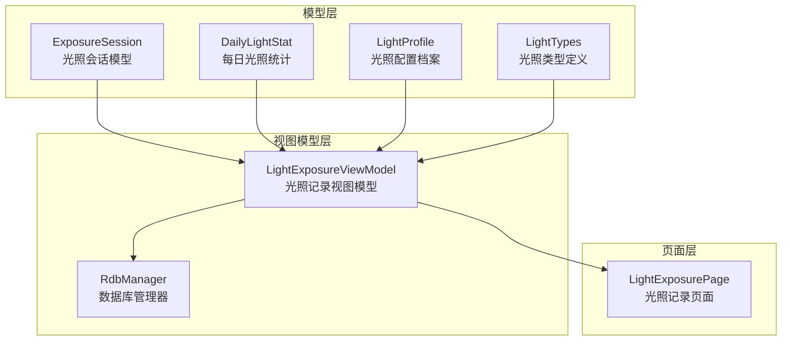
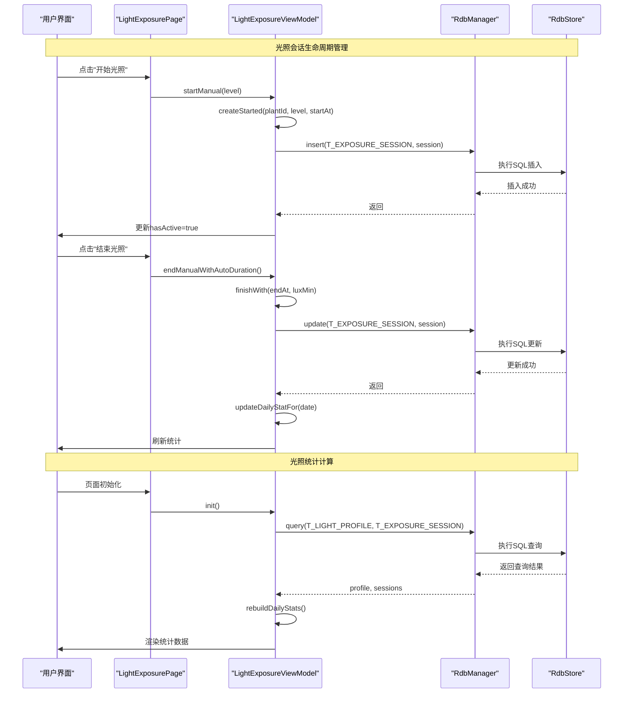
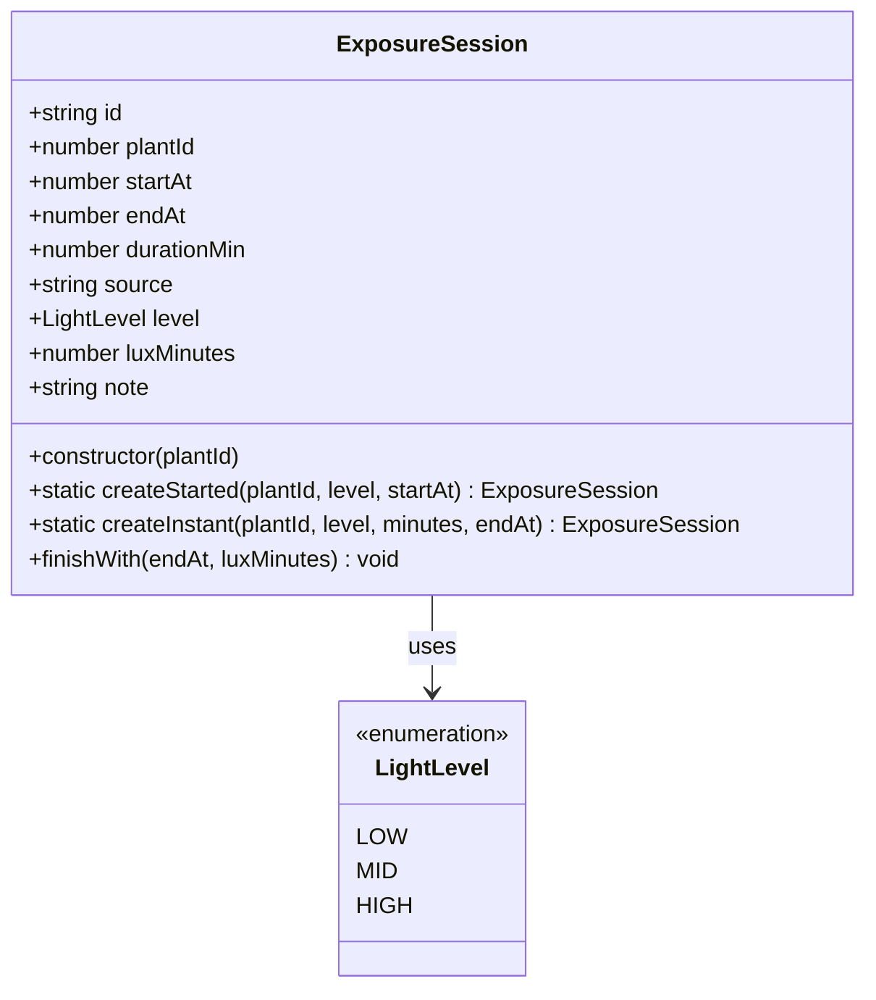
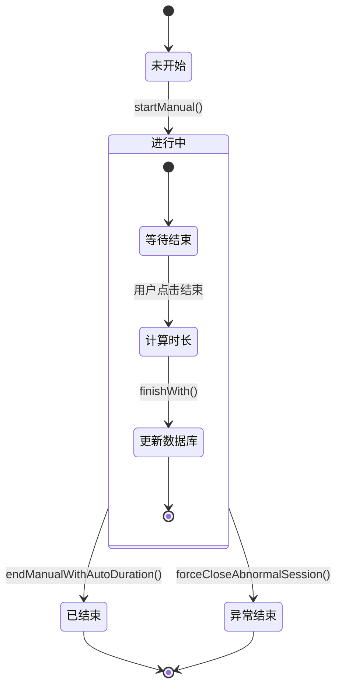
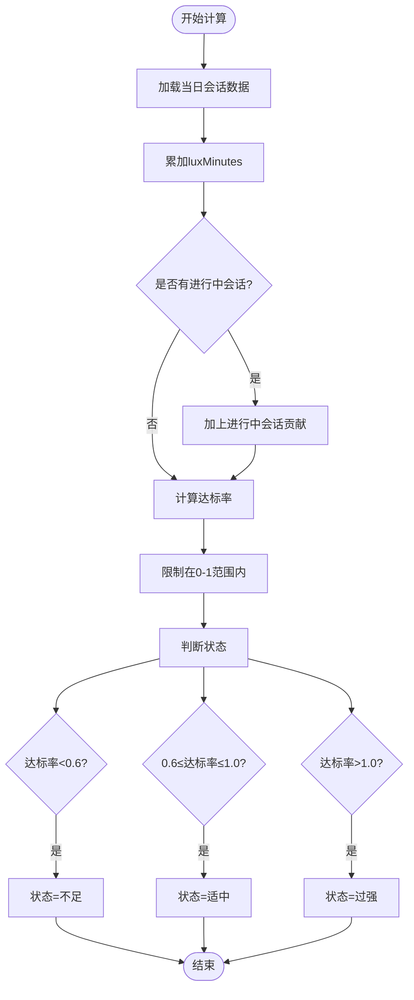
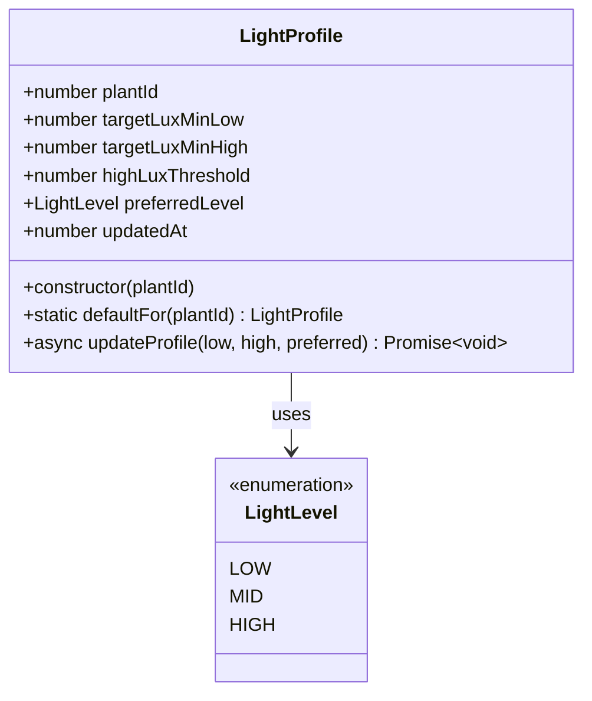
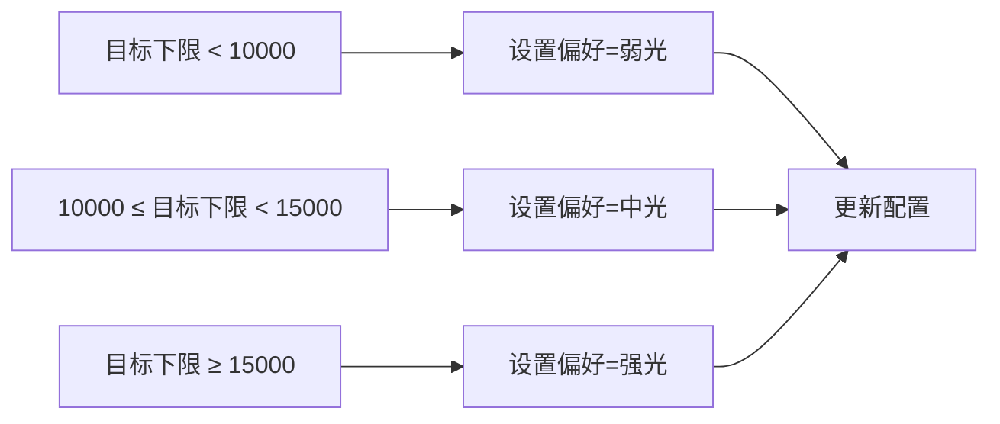
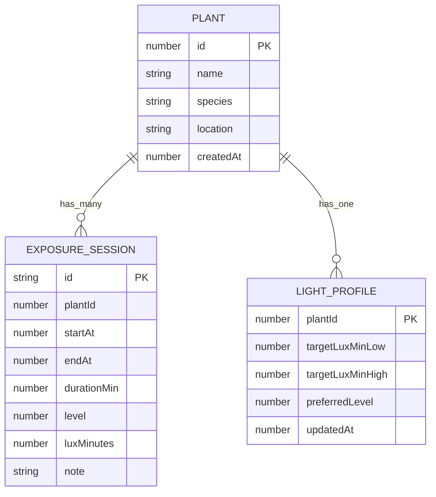
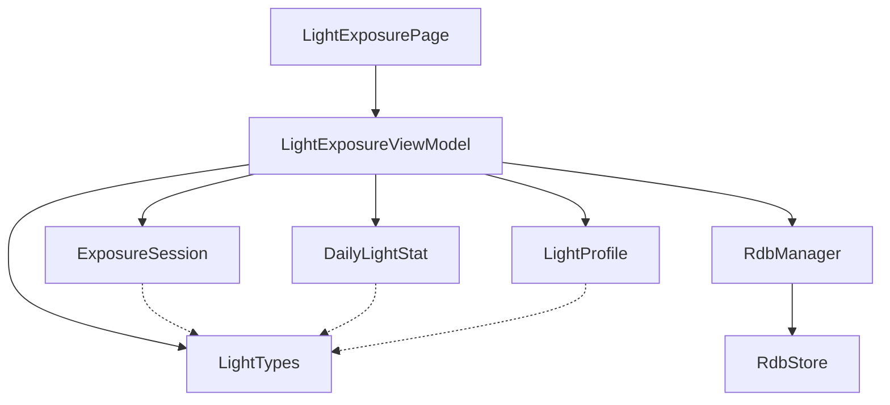

# 光照监控API

<cite>
**本文档引用的文件**
- [ExposureSession.ets](file://entry/src/main/ets/model/ExposureSession.ets)
- [DailyLightStat.ets](file://entry/src/main/ets/model/DailyLightStat.ets)
- [LightProfile.ets](file://entry/src/main/ets/model/LightProfile.ets)
- [LightTypes.ets](file://entry/src/main/ets/model/LightTypes.ets)
- [LightExposureViewModel.ets](file://entry/src/main/ets/viewmodel/LightExposureViewModel.ets)
- [LightExposurePage.ets](file://entry/src/main/ets/pages/LightExposurePage.ets)
- [RdbManager.ets](file://entry/src/main/ets/viewmodel/RdbManager.ets)
- [DbUtils.ets](file://entry/src/main/ets/model/DbUtils.ets)
- [PlantModel.ets](file://entry/src/main/ets/model/PlantModel.ets)
</cite>

## 目录
1. [简介](#简介)
2. [项目结构](#项目结构)
3. [核心组件](#核心组件)
4. [架构概览](#架构概览)
5. [详细组件分析](#详细组件分析)
6. [依赖关系分析](#依赖关系分析)
7. [性能考量](#性能考量)
8. [故障排除指南](#故障排除指南)
9. [结论](#结论)
10. [附录](#附录)

## 简介
本文件为光照监控业务逻辑的详细API文档，涵盖ExposureSession光照会话管理、DailyLightStat每日光照统计、LightProfile光照配置等核心业务逻辑的完整接口规范。文档详细说明了光照会话的创建、更新、结束状态管理方法，光照统计计算接口，光照偏好设置和查询接口，并提供光照数据模型定义、会话生命周期管理和统计算法实现。同时包含光照监控的实际调用示例和性能优化建议，帮助开发者快速理解和集成光照监控功能。

## 项目结构
光照监控功能主要分布在以下目录结构中：
- model：数据模型定义（ExposureSession、DailyLightStat、LightProfile、LightTypes）
- viewmodel：业务逻辑处理（LightExposureViewModel、RdbManager）
- pages：页面组件（LightExposurePage）
- model：工具类（DbUtils、PlantModel）



**图表来源**
- [ExposureSession.ets:1-84](file://entry/src/main/ets/model/ExposureSession.ets#L1-L84)
- [DailyLightStat.ets:1-30](file://entry/src/main/ets/model/DailyLightStat.ets#L1-L30)
- [LightProfile.ets:1-41](file://entry/src/main/ets/model/LightProfile.ets#L1-L41)
- [LightTypes.ets:1-124](file://entry/src/main/ets/model/LightTypes.ets#L1-L124)
- [LightExposureViewModel.ets:1-554](file://entry/src/main/ets/viewmodel/LightExposureViewModel.ets#L1-L554)
- [RdbManager.ets:1-296](file://entry/src/main/ets/viewmodel/RdbManager.ets#L1-L296)
- [LightExposurePage.ets:1-806](file://entry/src/main/ets/pages/LightExposurePage.ets#L1-L806)

**章节来源**
- [ExposureSession.ets:1-84](file://entry/src/main/ets/model/ExposureSession.ets#L1-L84)
- [DailyLightStat.ets:1-30](file://entry/src/main/ets/model/DailyLightStat.ets#L1-L30)
- [LightProfile.ets:1-41](file://entry/src/main/ets/model/LightProfile.ets#L1-L41)
- [LightTypes.ets:1-124](file://entry/src/main/ets/model/LightTypes.ets#L1-L124)
- [LightExposureViewModel.ets:1-554](file://entry/src/main/ets/viewmodel/LightExposureViewModel.ets#L1-L554)
- [RdbManager.ets:1-296](file://entry/src/main/ets/viewmodel/RdbManager.ets#L1-L296)
- [LightExposurePage.ets:1-806](file://entry/src/main/ets/pages/LightExposurePage.ets#L1-L806)

## 核心组件
光照监控系统由四个核心组件构成，每个组件都有明确的职责分工：

### ExposureSession光照会话模型
ExposureSession类负责记录单次完整的光照过程，支持两种记录模式：
- 开始/结束模式：用户点击开始和结束按钮
- 即时记录模式：用户直接输入时长

关键特性：
- 唯一标识符生成（genId函数）
- 自动时长计算（至少1分钟）
- 等效光照量计算（lux-min）
- 两种创建工厂方法

### DailyLightStat每日统计模型
DailyLightStat类记录植物每日的光照情况，包含：
- 累积光照量（lux-min）
- 总光照时长（分钟）
- 达标率（0-1之间）
- 光照状态（不足/适中/过强）

### LightProfile光照配置档案
LightProfile类管理植物的光照偏好和目标设置：
- 目标下限和上限（lux-min）
- 偏好光照级别
- 更新时间戳
- 默认配置工厂方法

### LightTypes光照类型定义
LightTypes模块提供光照相关的枚举、工具函数：
- LightLevel枚举（LOW/MID/HIGH）
- LightStatus枚举（INSUFF/OK/STRONG）
- 标签转换函数
- 权重计算函数
- 日期格式化工具

**章节来源**
- [ExposureSession.ets:14-84](file://entry/src/main/ets/model/ExposureSession.ets#L14-L84)
- [DailyLightStat.ets:11-30](file://entry/src/main/ets/model/DailyLightStat.ets#L11-L30)
- [LightProfile.ets:11-41](file://entry/src/main/ets/model/LightProfile.ets#L11-L41)
- [LightTypes.ets:5-124](file://entry/src/main/ets/model/LightTypes.ets#L5-L124)

## 架构概览
光照监控采用MVVM架构模式，通过视图模型统一管理业务逻辑和数据持久化。



**图表来源**
- [LightExposureViewModel.ets:129-192](file://entry/src/main/ets/viewmodel/LightExposureViewModel.ets#L129-L192)
- [LightExposureViewModel.ets:298-385](file://entry/src/main/ets/viewmodel/LightExposureViewModel.ets#L298-L385)
- [RdbManager.ets:27-170](file://entry/src/main/ets/viewmodel/RdbManager.ets#L27-L170)

## 详细组件分析

### ExposureSession光照会话管理API

#### 会话创建接口
ExposureSession提供三种创建方式：

**createStarted静态方法**
- 参数：plantId（植物ID）、level（光照级别）、startAt（开始时间戳）
- 返回：新的ExposureSession实例
- 特点：设置endAt为0表示进行中状态

**createInstant静态方法**
- 参数：plantId、level、minutes（时长）、endAt（结束时间戳）
- 返回：即时记录的ExposureSession实例
- 特点：根据结束时间和时长反推开始时间

**finishWith实例方法**
- 参数：endAt（结束时间戳）、luxMinutes（等效光照量）
- 功能：计算持续时间并更新会话状态
- 特点：持续时间至少为1分钟



**图表来源**
- [ExposureSession.ets:14-84](file://entry/src/main/ets/model/ExposureSession.ets#L14-L84)
- [LightTypes.ets:9-13](file://entry/src/main/ets/model/LightTypes.ets#L9-L13)

#### 会话状态管理流程


**图表来源**
- [LightExposureViewModel.ets:129-192](file://entry/src/main/ets/viewmodel/LightExposureViewModel.ets#L129-L192)
- [LightExposureViewModel.ets:227-251](file://entry/src/main/ets/viewmodel/LightExposureViewModel.ets#L227-L251)

**章节来源**
- [ExposureSession.ets:26-82](file://entry/src/main/ets/model/ExposureSession.ets#L26-L82)
- [LightExposureViewModel.ets:129-192](file://entry/src/main/ets/viewmodel/LightExposureViewModel.ets#L129-L192)

### DailyLightStat每日统计API

#### 统计计算算法
DailyLightStat的计算基于以下算法：

**达标率计算**
```
达标率 = 当日累计光照量 / 目标上限
状态判断：
- 达标率 < 0.6：日照不足
- 0.6 ≤ 达标率 ≤ 1.0：日照适中  
- 达标率 > 1.0：日照过强
```

**实时统计更新**
- 今日达标率包含已完成历史记录和进行中会话的实时贡献
- 七日图表显示包含今日进行中会话的临时叠加值



**图表来源**
- [LightExposureViewModel.ets:372-385](file://entry/src/main/ets/viewmodel/LightExposureViewModel.ets#L372-L385)
- [LightExposureViewModel.ets:392-444](file://entry/src/main/ets/viewmodel/LightExposureViewModel.ets#L392-L444)

#### 七日统计展示
七日统计采用动态生成策略：
- 今天有进行中会话时，临时叠加实时光照贡献
- 无数据日期显示为"日照不足"状态
- 图表高度按最大值比例缩放

**章节来源**
- [DailyLightStat.ets:11-30](file://entry/src/main/ets/model/DailyLightStat.ets#L11-L30)
- [LightExposureViewModel.ets:372-506](file://entry/src/main/ets/viewmodel/LightExposureViewModel.ets#L372-L506)

### LightProfile光照配置API

#### 配置管理接口
LightProfile提供完整的光照配置管理：

**defaultFor工厂方法**
- 自动生成默认配置：中光偏好，目标范围12000-20000 lux-min
- 设置当前时间戳作为更新时间

**updateProfile方法**
- 支持批量更新：目标下限、目标上限、偏好级别
- 自动偏好级别调整：根据目标下限自动切换到相应强度级别
- 数据库同步：更新后自动持久化到数据库



**图表来源**
- [LightProfile.ets:11-41](file://entry/src/main/ets/model/LightProfile.ets#L11-L41)
- [LightTypes.ets:9-13](file://entry/src/main/ets/model/LightTypes.ets#L9-L13)

#### 自动偏好调整机制


**图表来源**
- [LightExposureViewModel.ets:515-525](file://entry/src/main/ets/viewmodel/LightExposureViewModel.ets#L515-L525)

**章节来源**
- [LightProfile.ets:20-40](file://entry/src/main/ets/model/LightProfile.ets#L20-L40)
- [LightExposureViewModel.ets:515-552](file://entry/src/main/ets/viewmodel/LightExposureViewModel.ets#L515-L552)

### LightExposureViewModel业务逻辑API

#### 初始化流程
LightExposureViewModel的init方法执行完整的数据加载和状态重建：

1. **加载光照配置**：查询或创建默认配置
2. **加载历史会话**：按开始时间倒序加载所有会话
3. **检查异常状态**：清理多个进行中会话的异常情况
4. **重建统计**：从历史数据重新计算每日统计

#### 数据持久化接口
所有数据库操作通过RdbManager统一管理，支持：
- 异常事务封装（runInTransaction）
- 批量写入保证一致性
- 唯一索引约束防止重复数据

**章节来源**
- [LightExposureViewModel.ets:43-113](file://entry/src/main/ets/viewmodel/LightExposureViewModel.ets#L43-L113)
- [DbUtils.ets:12-22](file://entry/src/main/ets/model/DbUtils.ets#L12-L22)

## 依赖关系分析

### 数据库表结构设计
光照监控涉及两张核心表的设计：



**图表来源**
- [RdbManager.ets:108-129](file://entry/src/main/ets/viewmodel/RdbManager.ets#L108-L129)

### 组件耦合关系
各组件间的依赖关系清晰明确：



**图表来源**
- [LightExposurePage.ets:5-10](file://entry/src/main/ets/pages/LightExposurePage.ets#L5-L10)
- [LightExposureViewModel.ets:5-10](file://entry/src/main/ets/viewmodel/LightExposureViewModel.ets#L5-L10)

**章节来源**
- [RdbManager.ets:105-129](file://entry/src/main/ets/viewmodel/RdbManager.ets#L105-L129)
- [LightExposureViewModel.ets:16-36](file://entry/src/main/ets/viewmodel/LightExposureViewModel.ets#L16-L36)

## 性能考量

### 优化策略
1. **增量统计更新**：updateDailyStatFor方法仅更新指定日期，避免全量重算
2. **实时刷新控制**：通过tick变量控制UI刷新频率，减少不必要的重绘
3. **异常状态清理**：forceCloseAbnormalSession处理多个进行中会话的异常情况
4. **索引优化**：数据库表建立适当的索引提高查询性能

### 性能建议
- **UI刷新频率**：建议1秒刷新一次，平衡实时性和性能
- **批量操作**：使用runInTransaction确保批量写入的一致性
- **内存管理**：及时清理异常会话，避免内存泄漏
- **数据库查询**：使用索引优化常用查询（plantId、date等）

## 故障排除指南

### 常见问题及解决方案

#### 会话状态异常
**问题**：出现多个进行中会话
**解决方案**：系统会自动检测并清理异常会话，保留最新会话

#### 统计数据不准确
**问题**：当日统计与实际不符
**解决方案**：调用rebuildDailyStats重新计算所有统计数据

#### 数据库连接失败
**问题**：初始化时无法连接数据库
**解决方案**：检查数据库初始化流程，确保表结构正确创建

**章节来源**
- [LightExposureViewModel.ets:90-113](file://entry/src/main/ets/viewmodel/LightExposureViewModel.ets#L90-L113)
- [LightExposureViewModel.ets:227-251](file://entry/src/main/ets/viewmodel/LightExposureViewModel.ets#L227-L251)

## 结论
光照监控API提供了完整的光照会话管理、统计计算和配置管理功能。通过清晰的MVVM架构设计，实现了数据模型、业务逻辑和用户界面的有效分离。系统支持多种光照记录模式，提供实时统计更新和异常状态处理机制，能够满足植物光照管理的各种需求。建议在实际应用中重点关注性能优化和错误处理，确保系统的稳定性和用户体验。

## 附录

### API调用示例

#### 开始光照会话
```typescript
// 在页面中调用
vm.startManual(LightLevel.MID);

// 在视图模型中处理
await vm.startManual(level);
```

#### 结束光照会话
```typescript
// 在页面中调用
vm.endManualWithAutoDuration();

// 在视图模型中处理
await vm.endManualWithAutoDuration();
```

#### 更新光照配置
```typescript
// 在页面中调用
vm.updateProfile(12000, 20000, LightLevel.MID);

// 在视图模型中处理
await vm.updateProfile(low, high, preferred);
```

### 数据模型定义
- **ExposureSession**：光照会话记录，包含开始时间、结束时间、时长、光照强度等
- **DailyLightStat**：每日统计，包含累积光照量、达标率、状态等
- **LightProfile**：光照配置，包含目标范围、偏好级别、更新时间等
- **LightTypes**：光照相关枚举和工具函数