# 应急轮换API

<cite>
**本文引用的文件**
- [EmergencyViewModel.ets](file://entry/src/main/ets/viewmodel/EmergencyViewModel.ets)
- [RotatePlanViewModel.ets](file://entry/src/main/ets/viewmodel/RotatePlanViewModel.ets)
- [EmergencyLog.ets](file://entry/src/main/ets/model/EmergencyLog.ets)
- [EmergencyPlaybook.ets](file://entry/src/main/ets/model/EmergencyPlaybook.ets)
- [RotatePlan.ets](file://entry/src/main/ets/model/RotatePlan.ets)
- [EmergencyAndRotatePage.ets](file://entry/src/main/ets/pages/EmergencyAndRotatePage.ets)
- [RdbManager.ets](file://entry/src/main/ets/viewmodel/RdbManager.ets)
- [PlantLogModel.ets](file://entry/src/main/ets/model/PlantLogModel.ets)
</cite>

## 目录
1. [简介](#简介)
2. [项目结构](#项目结构)
3. [核心组件](#核心组件)
4. [架构概览](#架构概览)
5. [详细组件分析](#详细组件分析)
6. [依赖关系分析](#依赖关系分析)
7. [性能考量](#性能考量)
8. [故障排除指南](#故障排除指南)
9. [结论](#结论)
10. [附录](#附录)

## 简介
本文件为PlantDiary应用中的应急轮换业务逻辑提供详细的API文档。该系统包含两大核心功能模块：
- 应急处理模块：基于症状识别的植物急救流程管理
- 轮换计划模块：植物转盆周期提醒和执行监控

系统采用MVVM架构模式，通过ViewModel封装业务逻辑，Page负责UI展示，Model提供数据结构。支持植物应急状态判断、处理方案推荐和应急效果评估的完整API说明。

## 项目结构
应急轮换功能主要分布在以下目录结构中：

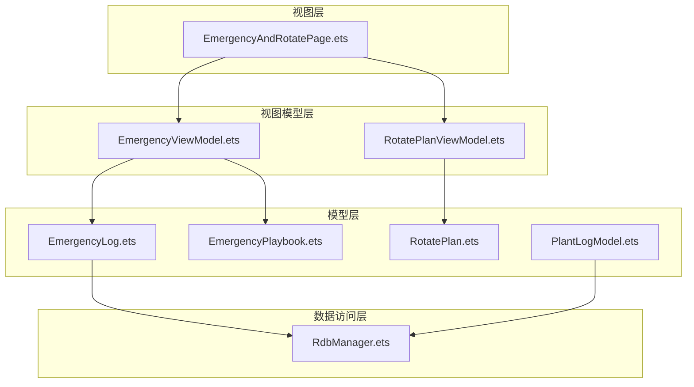

**图表来源**
- [EmergencyAndRotatePage.ets:1-557](file://entry/src/main/ets/pages/EmergencyAndRotatePage.ets#L1-L557)
- [EmergencyViewModel.ets:1-115](file://entry/src/main/ets/viewmodel/EmergencyViewModel.ets#L1-L115)
- [RotatePlanViewModel.ets:1-88](file://entry/src/main/ets/viewmodel/RotatePlanViewModel.ets#L1-L88)

**章节来源**
- [EmergencyAndRotatePage.ets:1-557](file://entry/src/main/ets/pages/EmergencyAndRotatePage.ets#L1-L557)
- [EmergencyViewModel.ets:1-115](file://entry/src/main/ets/viewmodel/EmergencyViewModel.ets#L1-L115)
- [RotatePlanViewModel.ets:1-88](file://entry/src/main/ets/viewmodel/RotatePlanViewModel.ets#L1-L88)

## 核心组件
系统由四个核心组件构成，每个组件都有明确的职责分工：

### 应急处理组件
- **EmergencyViewModel**：应急处理流程的核心控制器
- **EmergencyLog**：应急记录实体模型
- **EmergencyPlaybook**：应急处理方案清单

### 轮换计划组件
- **RotatePlanViewModel**：转盆计划管理器
- **RotatePlan**：转盆计划计算引擎
- **RotateLog**：转盆历史记录

**章节来源**
- [EmergencyViewModel.ets:14-115](file://entry/src/main/ets/viewmodel/EmergencyViewModel.ets#L14-L115)
- [EmergencyLog.ets:4-20](file://entry/src/main/ets/model/EmergencyLog.ets#L4-L20)
- [EmergencyPlaybook.ets:4-81](file://entry/src/main/ets/model/EmergencyPlaybook.ets#L4-L81)
- [RotatePlanViewModel.ets:18-88](file://entry/src/main/ets/viewmodel/RotatePlanViewModel.ets#L18-L88)
- [RotatePlan.ets:4-25](file://entry/src/main/ets/model/RotatePlan.ets#L4-L25)

## 架构概览
系统采用MVVM架构模式，实现了清晰的关注点分离：

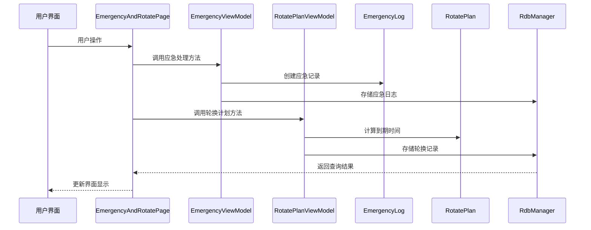

**图表来源**
- [EmergencyAndRotatePage.ets:17-22](file://entry/src/main/ets/pages/EmergencyAndRotatePage.ets#L17-L22)
- [EmergencyViewModel.ets:60-75](file://entry/src/main/ets/viewmodel/EmergencyViewModel.ets#L60-L75)
- [RotatePlanViewModel.ets:54-62](file://entry/src/main/ets/viewmodel/RotatePlanViewModel.ets#L54-L62)

## 详细组件分析

### EmergencyViewModel 应急处理API

EmergencyViewModel是应急处理流程的核心控制器，提供完整的植物急救管理功能。

#### 主要属性
- `plantId`: 植物标识符
- `playbook`: 应急处理方案列表
- `selectedKey`: 当前选择的症状标识
- `stepChecked`: 步骤勾选状态数组
- `note`: 备注信息
- `logs`: 应急记录列表

#### 核心方法

##### 症状选择方法
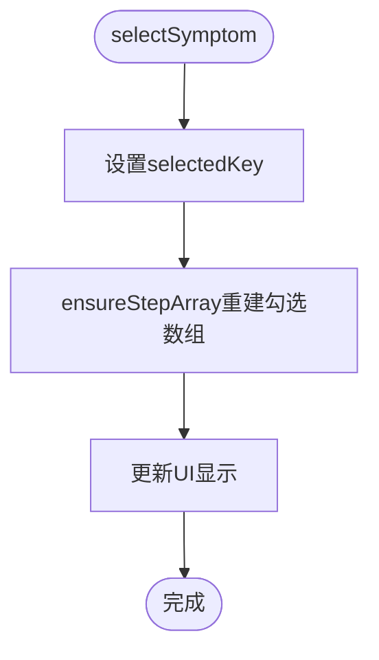

**图表来源**
- [EmergencyViewModel.ets:40-43](file://entry/src/main/ets/viewmodel/EmergencyViewModel.ets#L40-L43)
- [EmergencyViewModel.ets:32-38](file://entry/src/main/ets/viewmodel/EmergencyViewModel.ets#L32-L38)

##### 步骤勾选控制
- `toggleStep(index: number)`: 切换指定步骤的勾选状态
- `ensureStepArray()`: 根据当前症状重建勾选数组

##### 应急记录管理
- `startObservation()`: 开始观察，生成应急记录
- `markCompleted(id: string)`: 标记应急记录为已完成

##### 辅助方法
- `currentItem()`: 获取当前症状对应的处理方案
- `fmtDate(timestamp)`: 格式化时间显示

**章节来源**
- [EmergencyViewModel.ets:14-115](file://entry/src/main/ets/viewmodel/EmergencyViewModel.ets#L14-L115)

### EmergencyLog 应急日志模型

EmergencyLog是应急处理的持久化实体，包含完整的应急处理信息。

#### 数据结构
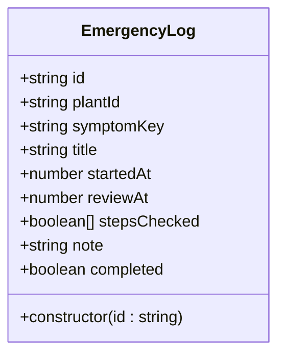

**图表来源**
- [EmergencyLog.ets:4-20](file://entry/src/main/ets/model/EmergencyLog.ets#L4-L20)

#### 字段说明
- `id`: 记录唯一标识符
- `plantId`: 关联的植物标识
- `symptomKey`: 症状类型标识
- `title`: 症状名称
- `startedAt`: 开始处理时间
- `reviewAt`: 建议复查时间
- `stepsChecked`: 处理步骤完成状态
- `note`: 处理备注
- `completed`: 完成状态标志

**章节来源**
- [EmergencyLog.ets:4-20](file://entry/src/main/ets/model/EmergencyLog.ets#L4-L20)

### EmergencyPlaybook 应急手册API

EmergencyPlaybook提供内置的植物应急处理方案清单。

#### 方案类型定义
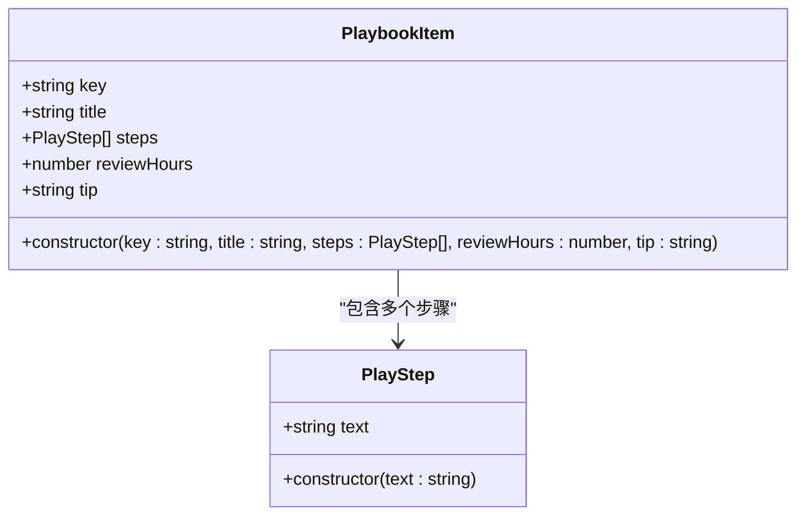

**图表来源**
- [EmergencyPlaybook.ets:4-23](file://entry/src/main/ets/model/EmergencyPlaybook.ets#L4-L23)

#### 内置应急方案
系统提供五种常见植物应急症状的处理方案：

| 症状标识 | 症状名称 | 处理步骤数量 | 建议复查间隔 |
|---------|----------|-------------|-------------|
| SCORCH | 疑似日灼 | 3步 | 72小时 |
| WILT | 急性萎蔫 | 3步 | 48小时 |
| YELLOW | 黄化发黄 | 3步 | 96小时 |
| SPOT | 叶片黑斑/斑点 | 3步 | 72小时 |
| ROOTROT | 疑似烂根 | 3步 | 48小时 |

**章节来源**
- [EmergencyPlaybook.ets:25-81](file://entry/src/main/ets/model/EmergencyPlaybook.ets#L25-L81)

### RotatePlanViewModel 轮换计划API

RotatePlanViewModel管理植物转盆提醒功能，提供完整的周期管理和历史记录功能。

#### 核心属性
- `plantId`: 植物标识符
- `plan`: RotatePlan实例
- `enabled`: 计划启用状态
- `intervalDays`: 转盆周期（天）
- `lastRotatedAt`: 上次转盆时间
- `logs`: 转盆历史记录列表

#### 主要方法

##### 计划管理
- `setEnabled(on: boolean)`: 启用/禁用转盆计划
- `setIntervalDays(d: number)`: 设置转盆周期（3-60天）

##### 历史记录管理
- `markRotatedNow()`: 记录当前转盆操作
- `nextDueAt()`: 计算下次转盆到期时间
- `overdue()`: 检查是否已到期

##### 辅助功能
- `fmtDate(timestamp)`: 格式化时间显示

**章节来源**
- [RotatePlanViewModel.ets:18-88](file://entry/src/main/ets/viewmodel/RotatePlanViewModel.ets#L18-L88)

### RotatePlan 轮换计划引擎

RotatePlan提供转盆计划的核心计算逻辑。

#### 核心算法
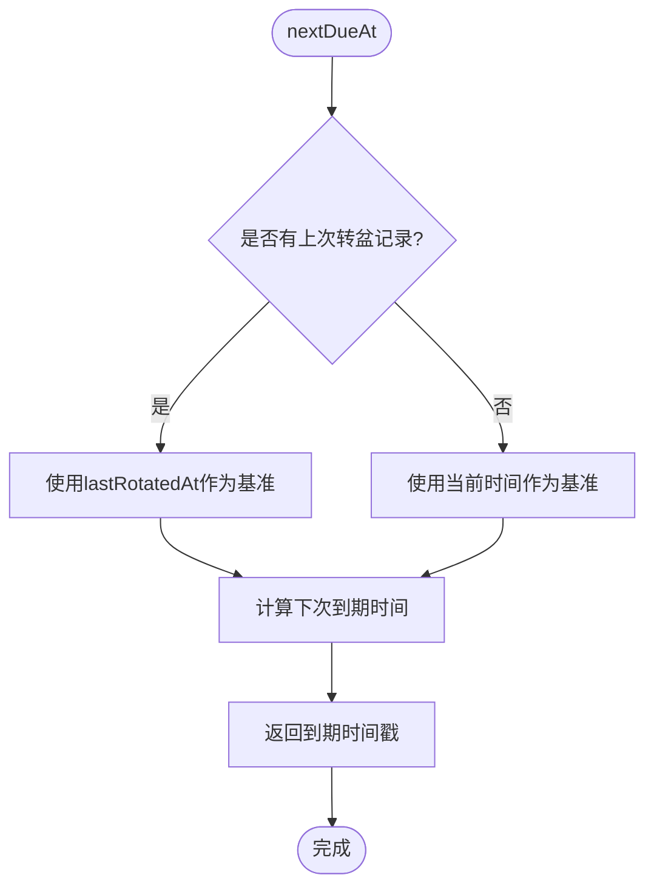

**图表来源**
- [RotatePlan.ets:14-19](file://entry/src/main/ets/model/RotatePlan.ets#L14-L19)

**章节来源**
- [RotatePlan.ets:4-25](file://entry/src/main/ets/model/RotatePlan.ets#L4-L25)

### 页面集成与交互

EmergencyAndRotatePage作为统一入口，整合了应急处理和轮换计划两大功能模块。

#### 功能布局
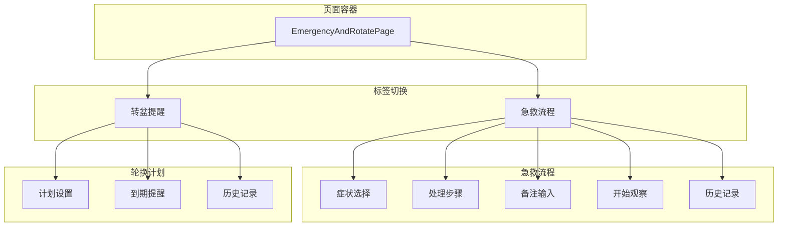

**图表来源**
- [EmergencyAndRotatePage.ets:24-557](file://entry/src/main/ets/pages/EmergencyAndRotatePage.ets#L24-L557)

**章节来源**
- [EmergencyAndRotatePage.ets:100-557](file://entry/src/main/ets/pages/EmergencyAndRotatePage.ets#L100-L557)

## 依赖关系分析

系统采用松耦合设计，各组件间通过清晰的接口进行通信：

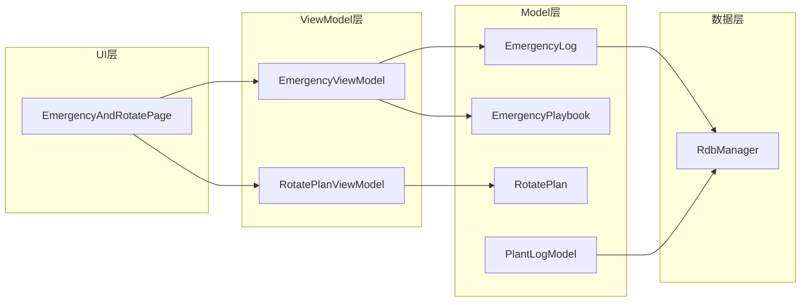

**图表来源**
- [EmergencyViewModel.ets:4-5](file://entry/src/main/ets/viewmodel/EmergencyViewModel.ets#L4-L5)
- [EmergencyAndRotatePage.ets:4-7](file://entry/src/main/ets/pages/EmergencyAndRotatePage.ets#L4-L7)

### 数据流分析

系统遵循单向数据流原则，确保状态管理的可预测性：

1. **用户操作** → **Page组件** → **ViewModel方法** → **Model更新** → **UI重新渲染**

2. **异步数据** → **RdbManager** → **ViewModel** → **Page** → **用户显示**

**章节来源**
- [EmergencyViewModel.ets:77-98](file://entry/src/main/ets/viewmodel/EmergencyViewModel.ets#L77-L98)
- [RdbManager.ets:19-24](file://entry/src/main/ets/viewmodel/RdbManager.ets#L19-L24)

## 性能考量

### 内存管理
- 使用不可变更新策略：通过创建新数组替代原地修改，确保UI正确响应
- 合理的数据结构选择：使用数组存储步骤状态，便于快速遍历和更新

### 计算优化
- 轮换计划计算采用简单的时间戳运算，避免复杂的日期计算
- 应急处理方案查找使用线性搜索，考虑到方案数量有限（≤5），性能影响可忽略

### UI渲染优化
- 采用条件渲染：根据enabled状态动态显示相关内容
- 使用虚拟列表：历史记录采用列表渲染，支持大数据量场景

## 故障排除指南

### 常见问题及解决方案

#### 应急处理相关问题
1. **症状选择无效**
   - 检查selectedKey是否正确设置
   - 确认ensureStepArray方法被调用

2. **应急记录无法保存**
   - 验证plantId是否有效
   - 检查RdbManager连接状态

#### 轮换计划相关问题
1. **到期提醒不准确**
   - 确认lastRotatedAt时间戳正确
   - 检查intervalDays设置范围（3-60天）

2. **历史记录显示异常**
   - 验证RotateLog构造函数参数
   - 检查fmtDate方法的时间格式化

**章节来源**
- [EmergencyViewModel.ets:77-98](file://entry/src/main/ets/viewmodel/EmergencyViewModel.ets#L77-L98)
- [RotatePlanViewModel.ets:54-62](file://entry/src/main/ets/viewmodel/RotatePlanViewModel.ets#L54-L62)

## 结论

PlantDiary的应急轮换系统通过清晰的MVVM架构实现了植物健康管理和周期提醒的完整功能。系统具有以下特点：

1. **模块化设计**：应急处理和轮换计划功能相对独立，便于维护和扩展
2. **用户体验友好**：直观的操作界面和及时的状态反馈
3. **数据持久化**：完整的应急记录和轮换历史保存机制
4. **可扩展性**：基于接口的设计允许添加新的症状类型和处理方案

该系统为植物爱好者提供了专业级的健康管理工具，通过科学的应急处理和规律的轮换管理，帮助用户更好地照顾植物健康。

## 附录

### API调用示例

#### 应急处理流程示例
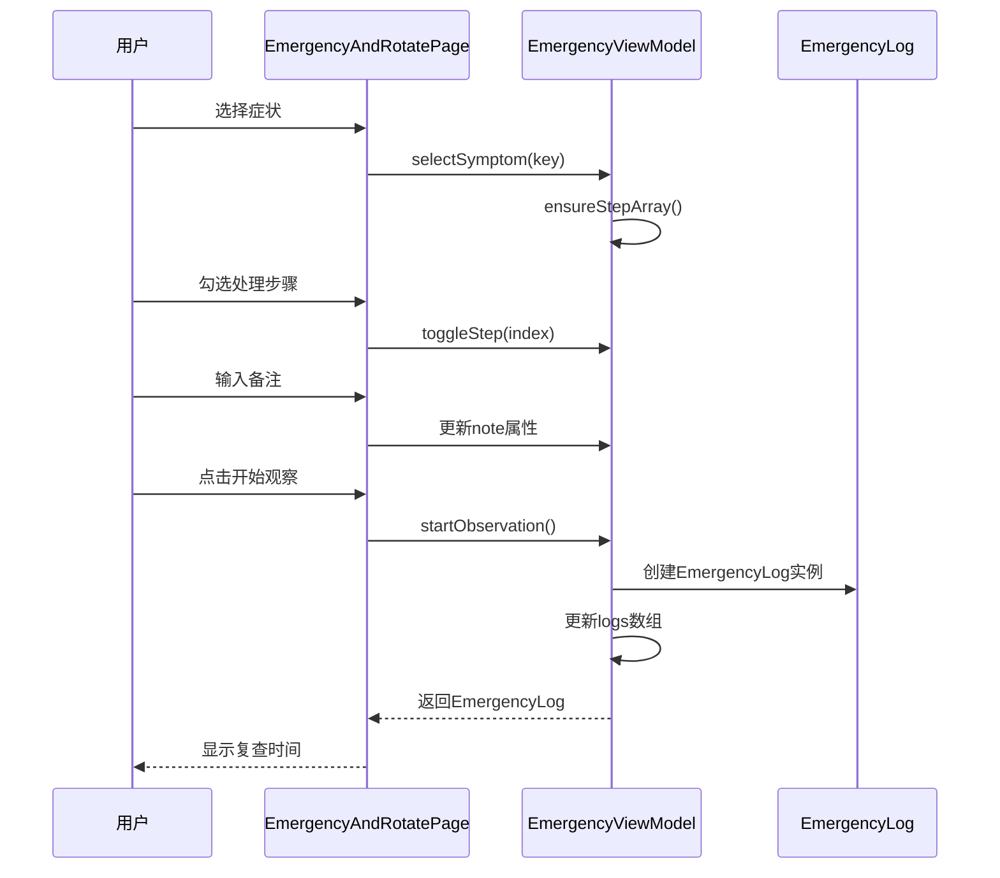

**图表来源**
- [EmergencyAndRotatePage.ets:235-243](file://entry/src/main/ets/pages/EmergencyAndRotatePage.ets#L235-L243)
- [EmergencyViewModel.ets:60-75](file://entry/src/main/ets/viewmodel/EmergencyViewModel.ets#L60-L75)

#### 轮换计划流程示例
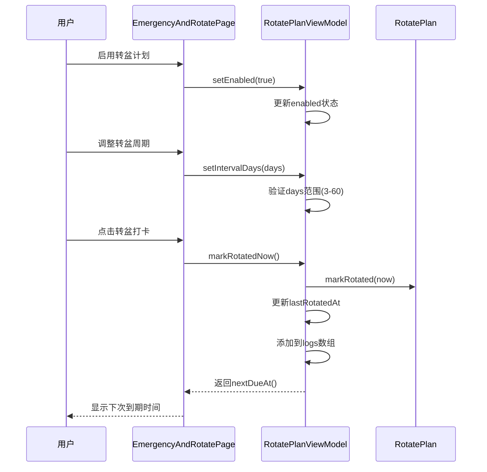

**图表来源**
- [EmergencyAndRotatePage.ets:405-411](file://entry/src/main/ets/pages/EmergencyAndRotatePage.ets#L405-L411)
- [RotatePlanViewModel.ets:54-62](file://entry/src/main/ets/viewmodel/RotatePlanViewModel.ets#L54-L62)

### 数据模型关系图

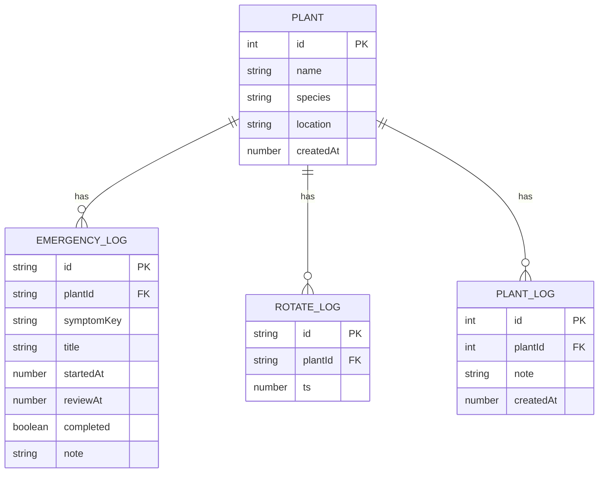

**图表来源**
- [EmergencyLog.ets:4-20](file://entry/src/main/ets/model/EmergencyLog.ets#L4-L20)
- [PlantLogModel.ets:8-28](file://entry/src/main/ets/model/PlantLogModel.ets#L8-L28)