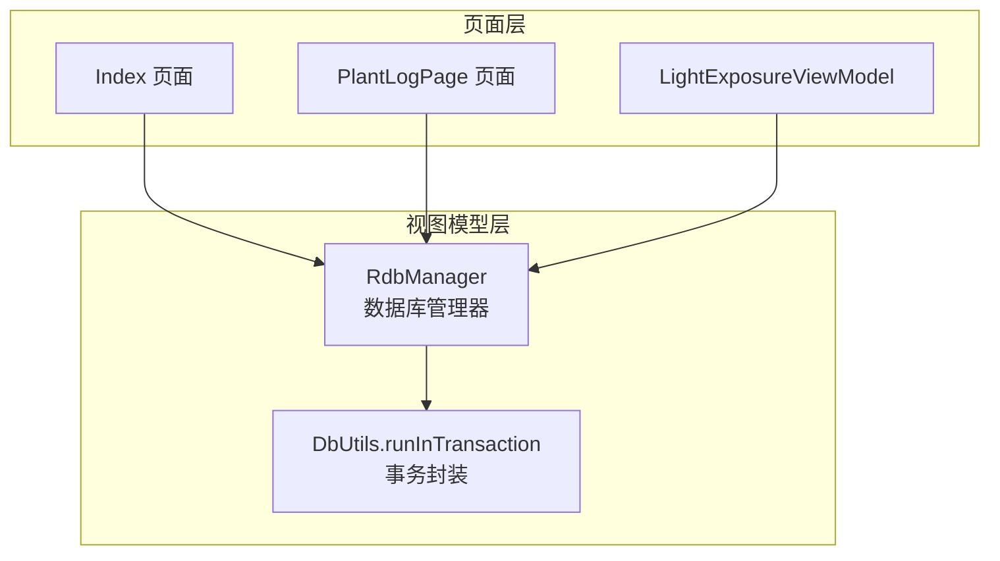
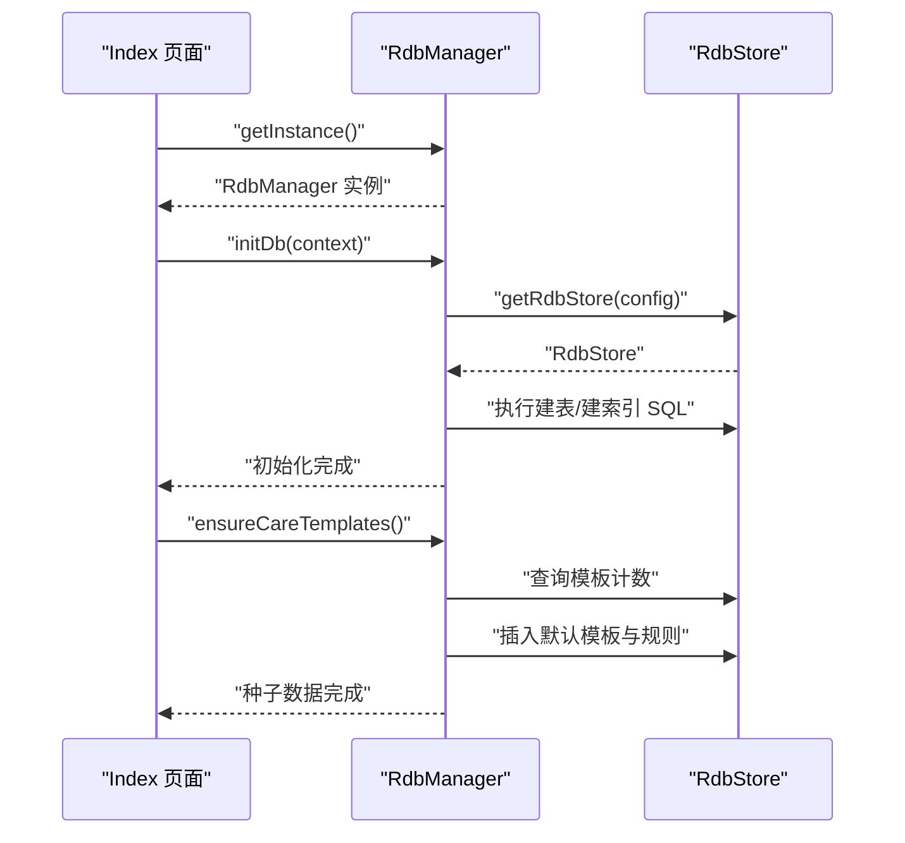
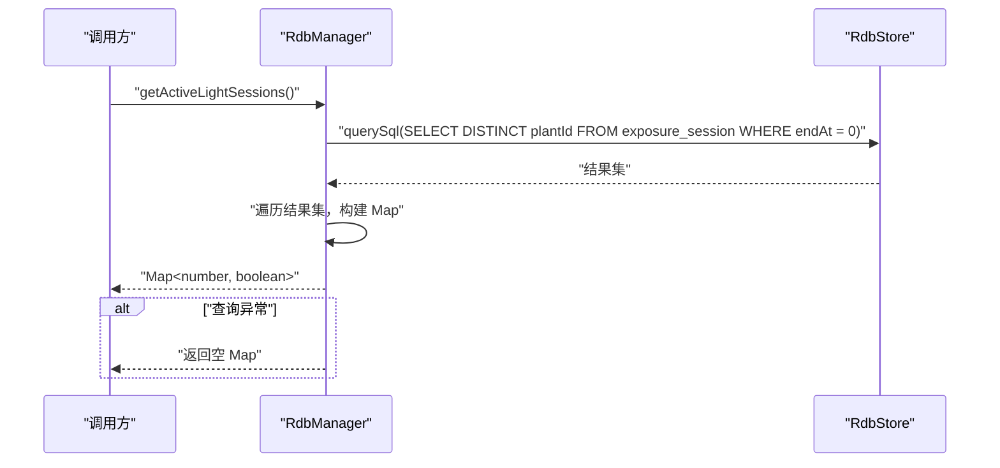

# 数据库管理API

<cite>
**本文引用的文件**
- [RdbManager.ets](file://entry/src/main/ets/viewmodel/RdbManager.ets)
- [DbUtils.ets](file://entry/src/main/ets/model/DbUtils.ets)
- [Index.ets](file://entry/src/main/ets/pages/Index.ets)
- [PlantLogPage.ets](file://entry/src/main/ets/pages/PlantLogPage.ets)
- [LightExposureViewModel.ets](file://entry/src/main/ets/viewmodel/LightExposureViewModel.ets)
- [err.ets](file://entry/src/main/ets/viewmodel/err.ets)
- [PlantModel.ets](file://entry/src/main/ets/model/PlantModel.ets)
</cite>

## 目录
1. [简介](#简介)
2. [项目结构](#项目结构)
3. [核心组件](#核心组件)
4. [架构总览](#架构总览)
5. [详细组件分析](#详细组件分析)
6. [依赖分析](#依赖分析)
7. [性能考虑](#性能考虑)
8. [故障排查指南](#故障排查指南)
9. [结论](#结论)
10. [附录](#附录)

## 简介
本文件为 PlantDiary 应用中的数据库管理器 RdbManager 的详细 API 文档，覆盖数据库初始化、表结构管理、索引优化与数据种子填充的完整接口规范。重点包括：
- 单例获取方法 getInstance()
- 数据库初始化 initDb(context)
- 种子数据 ensureCareTemplates()
- 常用查询方法 getActiveLightSessions()
- 事务封装 runInTransaction()

同时提供数据库表结构定义、索引设计原理与查询优化策略，并给出实际操作示例与最佳实践。

## 项目结构
RdbManager 位于视图模型目录，作为应用内统一的数据库入口，负责：
- 数据库连接与初始化
- 表结构与索引的创建
- 默认数据种子的注入
- 常用查询的封装

**图表来源**
- [Index.ets:128-131](file://entry/src/main/ets/pages/Index.ets#L128-L131)
- [PlantLogPage.ets](file://entry/src/main/ets/pages/PlantLogPage.ets#L16)
- [LightExposureViewModel.ets](file://entry/src/main/ets/viewmodel/LightExposureViewModel.ets#L26)
- [RdbManager.ets:19-24](file://entry/src/main/ets/viewmodel/RdbManager.ets#L19-L24)
- [DbUtils.ets:12-21](file://entry/src/main/ets/model/DbUtils.ets#L12-L21)

**章节来源**
- [RdbManager.ets:1-296](file://entry/src/main/ets/viewmodel/RdbManager.ets#L1-L296)
- [Index.ets:116-131](file://entry/src/main/ets/pages/Index.ets#L116-L131)
- [PlantLogPage.ets](file://entry/src/main/ets/pages/PlantLogPage.ets#L16)
- [LightExposureViewModel.ets](file://entry/src/main/ets/viewmodel/LightExposureViewModel.ets#L26)
- [DbUtils.ets:1-22](file://entry/src/main/ets/model/DbUtils.ets#L1-L22)

## 核心组件
- RdbManager：ArkTS 关系型数据库管理器，提供单例访问、数据库初始化、表与索引创建、种子数据注入与常用查询。
- DbUtils：提供统一事务封装 runInTransaction，确保批量写入的原子性。

**章节来源**
- [RdbManager.ets:4-24](file://entry/src/main/ets/viewmodel/RdbManager.ets#L4-L24)
- [DbUtils.ets:12-21](file://entry/src/main/ets/model/DbUtils.ets#L12-L21)

## 架构总览
RdbManager 通过单例模式对外提供数据库实例，页面与视图模型通过 getInstance() 获取实例并调用其方法。初始化流程通常在应用启动阶段执行，随后注入默认数据种子，保证新用户有可用的初始数据。

**图表来源**
- [Index.ets:128-131](file://entry/src/main/ets/pages/Index.ets#L128-L131)
- [RdbManager.ets:27-170](file://entry/src/main/ets/viewmodel/RdbManager.ets#L27-L170)
- [RdbManager.ets:173-276](file://entry/src/main/ets/viewmodel/RdbManager.ets#L173-L276)

## 详细组件分析

### RdbManager 类 API 规范
- 单例获取
  - 方法：getInstance()
  - 参数：无
  - 返回：RdbManager 实例
  - 异常：无显式抛出；内部通过静态变量缓存实例
  - 使用场景：页面与视图模型统一获取数据库管理器
  - 参考路径：[RdbManager.ets:19-24](file://entry/src/main/ets/viewmodel/RdbManager.ets#L19-L24)

- 数据库初始化
  - 方法：initDb(context: common.Context)
  - 参数：
    - context: 应用上下文，用于获取 RdbStore
  - 返回：Promise<void>
  - 异常：初始化过程中可能因权限或存储不可用导致失败；建议在页面层捕获并提示
  - 行为：
    - 创建数据库配置并获取 RdbStore
    - 执行建表 SQL（植物、任务、周期模板、日志、指标、日志图片、养护模板、规则、光照配置、光照会话）
    - 创建索引（任务唯一索引、按日期/植物查询索引；日志、指标、日志图片常用查询索引）
  - 参考路径：[RdbManager.ets:27-170](file://entry/src/main/ets/viewmodel/RdbManager.ets#L27-L170)

- 种子数据注入
  - 方法：ensureCareTemplates(): Promise<void>
  - 参数：无
  - 返回：Promise<void>
  - 异常：若数据库未初始化或查询失败，函数提前返回；失败时不会抛出异常
  - 行为：
    - 检查模板表是否已有数据，若有则直接返回
    - 若为空库，则插入多个默认模板及对应的规则（间隔天数与生成范围）
  - 参考路径：[RdbManager.ets:173-276](file://entry/src/main/ets/viewmodel/RdbManager.ets#L173-L276)

- 常用查询
  - 方法：getActiveLightSessions(): Promise<Map<number, boolean>>
  - 参数：无
  - 返回：Promise<Map<number, boolean>>（植物ID -> 是否存在进行中的光照会话）
  - 异常：查询失败时返回空 Map，不抛出异常
  - 参考路径：[RdbManager.ets:278-294](file://entry/src/main/ets/viewmodel/RdbManager.ets#L278-L294)

- 数据库表结构与索引
  - 表与字段概览（字段类型为 SQLite 常用类型映射）：
    - plant：id（主键，自增）、name、species、location、createdAt
    - task：id（主键，自增）、plantId、type、planDate、done、doneAt
    - tpl：id（主键，自增）、name、type、everyDays、times、createdAt
    - log：id（主键，自增）、plantId、note、createdAt
    - metric：id（主键，自增）、plantId、height、width、score、createdAt
    - log_photo：id（主键，自增）、logId、path、thumbPath、createdAt
    - care_template：id（主键，自增）、name、desc
    - care_rule：id（主键，自增）、templateId、type、intervalDays、horizonDays
    - light_profile：plantId（主键）、targetLuxMinLow、targetLuxMinHigh、preferredLevel、updatedAt
    - exposure_session：id（主键）、plantId、startAt、endAt、durationMin、level、luxMinutes、note
  - 索引设计原则：
    - 任务表：唯一索引约束（plantId, type, planDate）以避免重复；按 planDate 与 plantId 建立索引，支持常用查询与排序
    - 日志表：按（plantId, createdAt）建立组合索引，满足按植物检索并按时间倒序展示的需求
    - 指标表：按（plantId, createdAt）建立组合索引，支撑按植物与时间范围的查询
    - 日志图片表：按 logId 建立索引，支持按日志 ID 查询图片
  - 参考路径：
    - [RdbManager.ets:36-129](file://entry/src/main/ets/viewmodel/RdbManager.ets#L36-L129)
    - [RdbManager.ets:134-169](file://entry/src/main/ets/viewmodel/RdbManager.ets#L134-L169)

- 事务封装
  - 方法：runInTransaction(store: RdbStore, fn: () => Promise<void>): Promise<void>
  - 参数：
    - store: RdbStore 实例
    - fn: 包含一系列数据库操作的异步函数
  - 返回：Promise<void>
  - 异常：捕获 fn 抛出的异常并回滚事务，随后重新抛出异常
  - 使用场景：批量写入（插入/更新/删除）时确保原子性
  - 参考路径：[DbUtils.ets:12-21](file://entry/src/main/ets/model/DbUtils.ets#L12-L21)

**章节来源**
- [RdbManager.ets:19-294](file://entry/src/main/ets/viewmodel/RdbManager.ets#L19-L294)
- [DbUtils.ets:12-21](file://entry/src/main/ets/model/DbUtils.ets#L12-L21)

### 初始化与使用流程
- 页面初始化顺序（示例）：
  1) 获取单例：RdbManager.getInstance()
  2) 初始化数据库：initDb(context)
  3) 注入种子数据：ensureCareTemplates()
  4) 后续页面/视图模型直接使用 getInstance() 获取实例进行查询与写入
- 示例参考路径：
  - [Index.ets:116-131](file://entry/src/main/ets/pages/Index.ets#L116-L131)
  - [PlantLogPage.ets](file://entry/src/main/ets/pages/PlantLogPage.ets#L16)
  - [LightExposureViewModel.ets](file://entry/src/main/ets/viewmodel/LightExposureViewModel.ets#L26)

**章节来源**
- [Index.ets:116-131](file://entry/src/main/ets/pages/Index.ets#L116-L131)
- [PlantLogPage.ets](file://entry/src/main/ets/pages/PlantLogPage.ets#L16)
- [LightExposureViewModel.ets](file://entry/src/main/ets/viewmodel/LightExposureViewModel.ets#L26)

### 查询流程示意（获取进行中的光照会话）

**图表来源**
- [RdbManager.ets:278-294](file://entry/src/main/ets/viewmodel/RdbManager.ets#L278-L294)

## 依赖分析
- 组件耦合关系：
  - 页面层依赖 RdbManager 单例进行数据库操作
  - 视图模型层通过 RdbManager 访问数据库，必要时使用事务封装
  - RdbManager 依赖 ArkTS 关系型数据库能力进行建表、索引与查询
- 外部依赖：
  - @kit.ArkData.relationalStore：提供 RdbStore 获取与 SQL 执行能力
  - @kit.AbilityKit.common：提供应用上下文 context

**图表来源**
- [RdbManager.ets:1-3](file://entry/src/main/ets/viewmodel/RdbManager.ets#L1-L3)
- [Index.ets:128-131](file://entry/src/main/ets/pages/Index.ets#L128-L131)

**章节来源**
- [RdbManager.ets:1-3](file://entry/src/main/ets/viewmodel/RdbManager.ets#L1-L3)
- [Index.ets:128-131](file://entry/src/main/ets/pages/Index.ets#L128-L131)

## 性能考虑
- 索引设计与查询优化：
  - 任务表：唯一索引避免重复任务，按 planDate 排序与按 plantId 过滤的查询均受益于索引
  - 日志与指标：按（plantId, createdAt）的组合索引可避免额外排序成本
  - 日志图片：按 logId 建立索引，减少关联查询成本
- 事务批处理：
  - 使用事务封装确保批量写入的原子性，减少频繁提交带来的性能损耗
- 建议：
  - 避免在高频路径上执行全表扫描，优先使用带索引的 WHERE 子句
  - 对于大量写入，合并为事务块执行，降低磁盘 IO 压力

[本节为通用性能建议，无需特定文件引用]

## 故障排查指南
- 初始化失败
  - 现象：initDb() 未创建表或索引
  - 排查：确认 context 是否有效；检查数据库安全级别与加密配置；查看页面层是否正确调用 initDb()
  - 参考路径：[Index.ets:128-131](file://entry/src/main/ets/pages/Index.ets#L128-L131)
- 种子数据未注入
  - 现象：care_template/care_rule 表为空
  - 排查：确认 ensureCareTemplates() 是否在 initDb() 之后调用；检查模板表计数查询逻辑
  - 参考路径：[RdbManager.ets:173-185](file://entry/src/main/ets/viewmodel/RdbManager.ets#L173-L185)
- 查询异常降级
  - 现象：getActiveLightSessions() 返回空 Map
  - 排查：确认 exposure_session 表是否存在；检查查询语句与权限
  - 参考路径：[RdbManager.ets:282-292](file://entry/src/main/ets/viewmodel/RdbManager.ets#L282-L292)
- 事务异常
  - 现象：批量写入部分成功
  - 排查：使用 runInTransaction 封装批量操作；捕获异常并确认回滚是否生效
  - 参考路径：[DbUtils.ets:12-21](file://entry/src/main/ets/model/DbUtils.ets#L12-L21)

**章节来源**
- [Index.ets:128-131](file://entry/src/main/ets/pages/Index.ets#L128-L131)
- [RdbManager.ets:173-185](file://entry/src/main/ets/viewmodel/RdbManager.ets#L173-L185)
- [RdbManager.ets:282-292](file://entry/src/main/ets/viewmodel/RdbManager.ets#L282-L292)
- [DbUtils.ets:12-21](file://entry/src/main/ets/model/DbUtils.ets#L12-L21)

## 结论
RdbManager 提供了统一、可复用的数据库管理能力，涵盖初始化、表结构与索引管理、种子数据注入与常用查询。配合事务封装，能够保障批量操作的可靠性。建议在应用启动阶段完成初始化与种子注入，并在页面与视图模型中通过单例访问数据库，遵循索引设计原则进行查询优化。

[本节为总结性内容，无需特定文件引用]

## 附录

### 数据库表结构与索引设计要点
- 表与字段
  - plant：植物基本信息
  - task：任务计划与完成状态
  - tpl：周期模板
  - log：日志
  - metric：成长指标
  - log_photo：日志图片
  - care_template：养护模板
  - care_rule：模板规则
  - light_profile：光照配置
  - exposure_session：光照会话
- 索引
  - 任务：唯一索引（plantId, type, planDate），普通索引（planDate）、（plantId）
  - 日志：索引（plantId, createdAt）
  - 指标：索引（plantId, createdAt）
  - 日志图片：索引（logId）

**章节来源**
- [RdbManager.ets:36-169](file://entry/src/main/ets/viewmodel/RdbManager.ets#L36-L169)

### 实际使用示例与最佳实践
- 页面初始化
  - 在应用启动页中调用 RdbManager.getInstance().initDb(context)，随后调用 ensureCareTemplates()
  - 参考路径：[Index.ets:116-131](file://entry/src/main/ets/pages/Index.ets#L116-L131)
- 查询与写入
  - 页面与视图模型通过 getInstance() 获取实例，直接使用 store 的 insert/querySql 等方法
  - 对于批量写入，使用 runInTransaction 封装
  - 参考路径：
    - [PlantLogPage.ets](file://entry/src/main/ets/pages/PlantLogPage.ets#L16)
    - [LightExposureViewModel.ets](file://entry/src/main/ets/viewmodel/LightExposureViewModel.ets#L26)
    - [DbUtils.ets:12-21](file://entry/src/main/ets/model/DbUtils.ets#L12-L21)
- 数据模型参考
  - 植物、任务、日志、指标等模型定义，便于前后端字段一致性
  - 参考路径：[PlantModel.ets:1-166](file://entry/src/main/ets/model/PlantModel.ets#L1-L166)

**章节来源**
- [Index.ets:116-131](file://entry/src/main/ets/pages/Index.ets#L116-L131)
- [PlantLogPage.ets](file://entry/src/main/ets/pages/PlantLogPage.ets#L16)
- [LightExposureViewModel.ets](file://entry/src/main/ets/viewmodel/LightExposureViewModel.ets#L26)
- [DbUtils.ets:12-21](file://entry/src/main/ets/model/DbUtils.ets#L12-L21)
- [PlantModel.ets:1-166](file://entry/src/main/ets/model/PlantModel.ets#L1-L166)