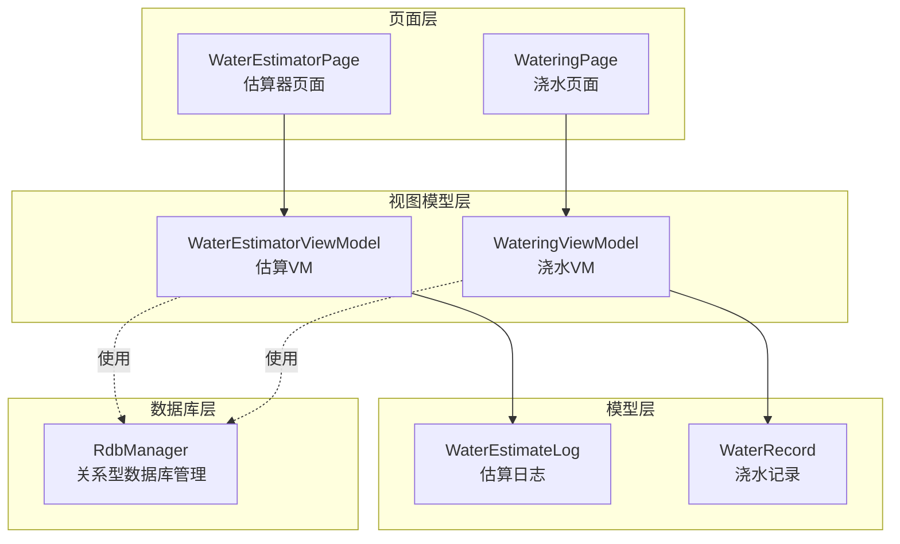
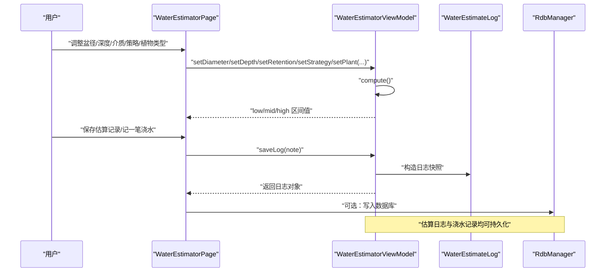
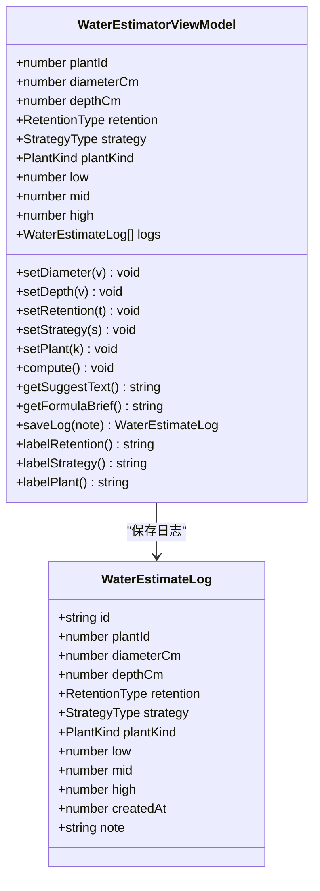
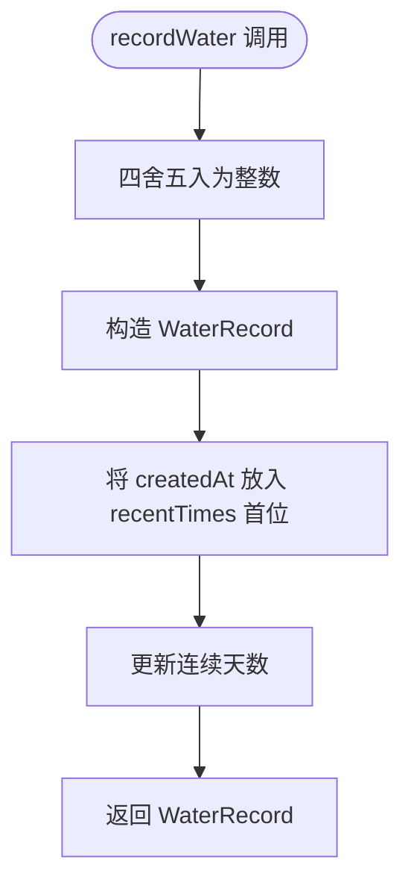
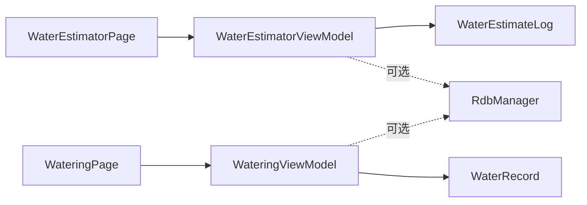

# 浇水估算API

<cite>
**本文引用的文件**
- [WaterEstimatorViewModel.ets](file://entry/src/main/ets/viewmodel/WaterEstimatorViewModel.ets)
- [WaterEstimateLog.ets](file://entry/src/main/ets/model/WaterEstimateLog.ets)
- [WaterRecord.ets](file://entry/src/main/ets/model/WaterRecord.ets)
- [WaterEstimatorPage.ets](file://entry/src/main/ets/pages/WaterEstimatorPage.ets)
- [WateringViewModel.ets](file://entry/src/main/ets/viewmodel/WateringViewModel.ets)
- [RdbManager.ets](file://entry/src/main/ets/viewmodel/RdbManager.ets)
- [WateringPage.ets](file://entry/src/main/ets/pages/WateringPage.ets)
</cite>

## 目录
1. [简介](#简介)
2. [项目结构](#项目结构)
3. [核心组件](#核心组件)
4. [架构总览](#架构总览)
5. [详细组件分析](#详细组件分析)
6. [依赖关系分析](#依赖关系分析)
7. [性能考虑](#性能考虑)
8. [故障排查指南](#故障排查指南)
9. [结论](#结论)
10. [附录](#附录)

## 简介
本文件面向“浇水估算”业务，提供基于植物特性的水量估算算法接口、历史浇水记录查询与统计接口、估算准确性评估方法的完整API说明。内容涵盖：
- WaterEstimatorViewModel：浇水估算核心逻辑与界面交互
- WaterEstimateLog：估算日志记录模型
- WaterRecord：浇水记录管理模型
- 环境因素与植物需求量计算的参数配置
- 实际调用示例与算法优化指导

## 项目结构
围绕“浇水估算”的关键文件组织如下：
- 视图模型层：WaterEstimatorViewModel（估算VM）、WateringViewModel（浇水VM）
- 模型层：WaterEstimateLog（估算日志）、WaterRecord（浇水记录）
- 页面层：WaterEstimatorPage（估算器页面）、WateringPage（浇水页面）
- 数据库层：RdbManager（关系型数据库管理）

**图表来源**
- [WaterEstimatorViewModel.ets:17-129](file://entry/src/main/ets/viewmodel/WaterEstimatorViewModel.ets#L17-L129)
- [WateringViewModel.ets:11-101](file://entry/src/main/ets/viewmodel/WateringViewModel.ets#L11-L101)
- [WaterEstimateLog.ets:6-24](file://entry/src/main/ets/model/WaterEstimateLog.ets#L6-L24)
- [WaterRecord.ets:3-17](file://entry/src/main/ets/model/WaterRecord.ets#L3-L17)
- [WaterEstimatorPage.ets:9-54](file://entry/src/main/ets/pages/WaterEstimatorPage.ets#L9-L54)
- [WateringPage.ets:7-77](file://entry/src/main/ets/pages/WateringPage.ets#L7-L77)
- [RdbManager.ets:4-295](file://entry/src/main/ets/viewmodel/RdbManager.ets#L4-L295)

**章节来源**
- [WaterEstimatorViewModel.ets:17-129](file://entry/src/main/ets/viewmodel/WaterEstimatorViewModel.ets#L17-L129)
- [WaterEstimatorPage.ets:9-54](file://entry/src/main/ets/pages/WaterEstimatorPage.ets#L9-L54)

## 核心组件
- WaterEstimatorViewModel：负责接收输入参数（盆径、深度、介质、策略、植物类型），执行估算并输出区间值，同时生成估算日志。
- WaterEstimateLog：估算日志实体，包含输入参数快照与估算结果，便于回溯与统计。
- WaterRecord：浇水记录实体，用于记录一次浇水行为（模式、用量、时间）。
- WateringViewModel：管理浇水动画状态、历史记录、连续天数等，生成WaterRecord供持久化或展示。

**章节来源**
- [WaterEstimatorViewModel.ets:17-129](file://entry/src/main/ets/viewmodel/WaterEstimatorViewModel.ets#L17-L129)
- [WaterEstimateLog.ets:6-24](file://entry/src/main/ets/model/WaterEstimateLog.ets#L6-L24)
- [WaterRecord.ets:3-17](file://entry/src/main/ets/model/WaterRecord.ets#L3-L17)
- [WateringViewModel.ets:11-101](file://entry/src/main/ets/viewmodel/WateringViewModel.ets#L11-L101)

## 架构总览
估算流程从页面输入开始，经由VM计算得到区间值，再通过日志记录与建议文案反馈给用户；浇水记录由另一个VM管理，二者通过数据库层统一存储。

**图表来源**
- [WaterEstimatorPage.ets:15-54](file://entry/src/main/ets/pages/WaterEstimatorPage.ets#L15-L54)
- [WaterEstimatorViewModel.ets:41-123](file://entry/src/main/ets/viewmodel/WaterEstimatorViewModel.ets#L41-L123)
- [WaterEstimateLog.ets:20-23](file://entry/src/main/ets/model/WaterEstimateLog.ets#L20-L23)
- [RdbManager.ets:27-170](file://entry/src/main/ets/viewmodel/RdbManager.ets#L27-L170)

## 详细组件分析

### WaterEstimatorViewModel（浇水估算核心逻辑）
- 输入参数
  - 盆径（厘米）、深度（厘米）
  - 介质类型（RetentionType）
  - 浇水策略（StrategyType）
  - 植物类型（PlantKind）
- 输出结果
  - low（下限）、mid（推荐）、high（上限，毫升）
- 关键方法
  - setDiameter(v)、setDepth(v)：设置并触发重新计算
  - setRetention(t)、setStrategy(s)、setPlant(k)：切换参数并重新计算
  - compute()：调用底层估算函数，填充low/mid/high
  - getSuggestText()：根据策略与植物类型生成建议文案
  - getFormulaBrief()：返回简要公式说明
  - saveLog(note)：保存估算日志，返回日志对象
  - labelRetention()/labelStrategy()/labelPlant()：参数标签化显示
- 设计要点
  - 任一输入变化自动重算，无需额外“计算”按钮
  - 保存日志时将当前输入与结果打包为快照，便于追溯

**图表来源**
- [WaterEstimatorViewModel.ets:17-129](file://entry/src/main/ets/viewmodel/WaterEstimatorViewModel.ets#L17-L129)
- [WaterEstimateLog.ets:6-24](file://entry/src/main/ets/model/WaterEstimateLog.ets#L6-L24)

**章节来源**
- [WaterEstimatorViewModel.ets:17-129](file://entry/src/main/ets/viewmodel/WaterEstimatorViewModel.ets#L17-L129)

### WaterEstimateLog（估算日志记录）
- 字段说明
  - id：日志标识
  - plantId：关联植物
  - diameterCm、depthCm：输入参数快照
  - retention、strategy、plantKind：输入参数快照
  - low、mid、high：估算结果快照
  - createdAt：创建时间
  - note：用户备注
- 用途
  - 作为估算历史的内存快照，支持后续持久化到数据库

**章节来源**
- [WaterEstimateLog.ets:6-24](file://entry/src/main/ets/model/WaterEstimateLog.ets#L6-L24)

### WaterRecord（浇水记录管理）
- 字段说明
  - id：记录标识
  - plantId：关联植物
  - mode：浇水模式（light/deep）
  - amountMl：用量（毫升，可选）
  - createdAt：创建时间
- 用途
  - 页面调用VM生成记录，由调用方决定是否写入数据库

**章节来源**
- [WaterRecord.ets:3-17](file://entry/src/main/ets/model/WaterRecord.ets#L3-L17)

### WateringViewModel（浇水记录管理）
- 字段说明
  - plantId：植物标识
  - isAnimating：动画状态
  - mode：当前模式（light/deep）
  - defaultAmount：默认用量
  - recentTimes：最近10次浇水时间戳（降序）
  - streakDays：连续天数
- 关键方法
  - setMode(m)：切换模式
  - startAnimation()/stopAnimation()：控制动画
  - recordWater(amountMl)：生成WaterRecord并更新历史与连续天数
  - lastWaterAt()：最近浇水时间
  - fmtDate(ts)：格式化时间

**图表来源**
- [WateringViewModel.ets:44-88](file://entry/src/main/ets/viewmodel/WateringViewModel.ets#L44-L88)

**章节来源**
- [WateringViewModel.ets:11-101](file://entry/src/main/ets/viewmodel/WateringViewModel.ets#L11-L101)

### WaterEstimatorPage（估算器页面）
- 功能概览
  - 输入：盆径、深度滑块与快捷按钮
  - 参数：介质类型、浇水策略、植物类型（Chip选择）
  - 结果：low/mid/high 区间与建议文案
  - 行为：保存估算记录、以“推荐”记一笔浇水
  - 历史：展示估算日志列表
- 交互流程
  - 用户调整参数 → VM自动计算 → 页面渲染结果 → 用户保存日志或记录浇水

**章节来源**
- [WaterEstimatorPage.ets:9-54](file://entry/src/main/ets/pages/WaterEstimatorPage.ets#L9-L54)
- [WaterEstimatorPage.ets:113-154](file://entry/src/main/ets/pages/WaterEstimatorPage.ets#L113-L154)
- [WaterEstimatorPage.ets:203-219](file://entry/src/main/ets/pages/WaterEstimatorPage.ets#L203-L219)
- [WaterEstimatorPage.ets:232-239](file://entry/src/main/ets/pages/WaterEstimatorPage.ets#L232-L239)
- [WaterEstimatorPage.ets:252-268](file://entry/src/main/ets/pages/WaterEstimatorPage.ets#L252-L268)
- [WaterEstimatorPage.ets:380-410](file://entry/src/main/ets/pages/WaterEstimatorPage.ets#L380-L410)
- [WaterEstimatorPage.ets:416-488](file://entry/src/main/ets/pages/WaterEstimatorPage.ets#L416-L488)

### WateringPage（浇水页面）
- 说明
  - 示例页面，演示媒体资源加载与保存到相册流程，与浇水记录API无直接耦合
- 适用性
  - 可作为集成图片/附件功能的参考示例

**章节来源**
- [WateringPage.ets:7-77](file://entry/src/main/ets/pages/WateringPage.ets#L7-L77)

## 依赖关系分析
- WaterEstimatorViewModel 依赖 WaterEstimateLog 生成日志
- WateringViewModel 依赖 WaterRecord 生成记录
- 页面层通过VM与模型交互，VM可进一步与数据库层协作（RdbManager）
- 估算日志与浇水记录均可持久化，形成闭环的数据流

**图表来源**
- [WaterEstimatorPage.ets:9-54](file://entry/src/main/ets/pages/WaterEstimatorPage.ets#L9-L54)
- [WateringPage.ets:7-77](file://entry/src/main/ets/pages/WateringPage.ets#L7-L77)
- [WaterEstimatorViewModel.ets:17-129](file://entry/src/main/ets/viewmodel/WaterEstimatorViewModel.ets#L17-L129)
- [WateringViewModel.ets:11-101](file://entry/src/main/ets/viewmodel/WateringViewModel.ets#L11-L101)
- [RdbManager.ets:4-295](file://entry/src/main/ets/viewmodel/RdbManager.ets#L4-L295)

**章节来源**
- [WaterEstimatorViewModel.ets:17-129](file://entry/src/main/ets/viewmodel/WaterEstimatorViewModel.ets#L17-L129)
- [WateringViewModel.ets:11-101](file://entry/src/main/ets/viewmodel/WateringViewModel.ets#L11-L101)
- [RdbManager.ets:27-170](file://entry/src/main/ets/viewmodel/RdbManager.ets#L27-L170)

## 性能考虑
- 自动重算策略
  - 输入变化即刻重算，避免额外按钮，但应避免在高频滑动时产生过多重算抖动
- 建议
  - 对滑动事件使用节流/防抖
  - 将compute()结果缓存于本地，仅在必要时更新UI
- 内存与持久化
  - 估算日志与浇水记录采用内存数组，建议在合适时机批量写入数据库
  - 控制历史记录长度，避免无限增长导致内存压力

[本节为通用性能建议，不直接分析具体文件]

## 故障排查指南
- 估算结果异常
  - 检查输入参数范围（盆径/深度）是否在有效区间内
  - 确认介质类型、策略、植物类型的枚举值正确
- 日志未保存
  - 确认saveLog调用成功并返回日志对象
  - 如需持久化，请检查数据库写入流程
- 连续天数不准确
  - 检查recentTimes顺序与时间差阈值设置
  - 注意跨天边界容错逻辑

**章节来源**
- [WaterEstimatorViewModel.ets:41-79](file://entry/src/main/ets/viewmodel/WaterEstimatorViewModel.ets#L41-L79)
- [WateringViewModel.ets:66-88](file://entry/src/main/ets/viewmodel/WateringViewModel.ets#L66-L88)

## 结论
本文档梳理了浇水估算与浇水记录的完整API与交互流程，明确了参数配置、算法接口、日志与记录模型以及页面交互方式。通过VM与模型的清晰分离，系统具备良好的可扩展性与可维护性，便于后续接入数据库与增强统计分析能力。

[本节为总结性内容，不直接分析具体文件]

## 附录

### API清单与说明

- WaterEstimatorViewModel
  - setDiameter(v: number): void
    - 设置盆径并触发重算
  - setDepth(v: number): void
    - 设置深度并触发重算
  - setRetention(t: RetentionType): void
    - 设置介质类型并触发重算
  - setStrategy(s: StrategyType): void
    - 设置浇水策略并触发重算
  - setPlant(k: PlantKind): void
    - 设置植物类型并触发重算
  - compute(): void
    - 执行估算并将结果写入low/mid/high
  - getSuggestText(): string
    - 获取建议文案
  - getFormulaBrief(): string
    - 获取公式简述
  - saveLog(note: string): WaterEstimateLog
    - 保存估算日志并返回日志对象
  - labelRetention()/labelStrategy()/labelPlant(): string
    - 参数标签化显示

- WaterEstimateLog
  - 字段：id、plantId、diameterCm、depthCm、retention、strategy、plantKind、low、mid、high、createdAt、note
  - 用途：估算历史快照

- WaterRecord
  - 字段：id、plantId、mode、amountMl、createdAt
  - 用途：一次浇水记录

- WateringViewModel
  - recordWater(amountMl: number): WaterRecord
    - 生成记录并更新历史与连续天数
  - lastWaterAt(): number
    - 获取最近浇水时间
  - fmtDate(ts: number): string
    - 格式化时间

**章节来源**
- [WaterEstimatorViewModel.ets:41-129](file://entry/src/main/ets/viewmodel/WaterEstimatorViewModel.ets#L41-L129)
- [WaterEstimateLog.ets:6-24](file://entry/src/main/ets/model/WaterEstimateLog.ets#L6-L24)
- [WaterRecord.ets:3-17](file://entry/src/main/ets/model/WaterRecord.ets#L3-L17)
- [WateringViewModel.ets:44-95](file://entry/src/main/ets/viewmodel/WateringViewModel.ets#L44-L95)

### 实际调用示例（步骤说明）
- 在估算器页面中调整参数（盆径/深度/介质/策略/植物类型）
- VM自动计算并展示low/mid/high区间与建议文案
- 点击“保存估算记录”或“用‘推荐’记一笔浇水”
- 保存后的日志可在历史列表查看

**章节来源**
- [WaterEstimatorPage.ets:15-54](file://entry/src/main/ets/pages/WaterEstimatorPage.ets#L15-L54)
- [WaterEstimatorPage.ets:380-410](file://entry/src/main/ets/pages/WaterEstimatorPage.ets#L380-L410)
- [WaterEstimatorPage.ets:416-488](file://entry/src/main/ets/pages/WaterEstimatorPage.ets#L416-L488)

### 算法优化指导
- 输入校验与边界处理
  - 对盆径/深度设置合理上下限，避免极端值引发不切实际的估算
- 计算缓存
  - 对相同输入的估算结果进行缓存，减少重复计算
- UI交互
  - 滑动时采用节流/防抖，降低频繁重算对性能的影响
- 数据持久化
  - 将估算日志与浇水记录定期批量写入数据库，避免主线程阻塞

[本节为通用优化建议，不直接分析具体文件]