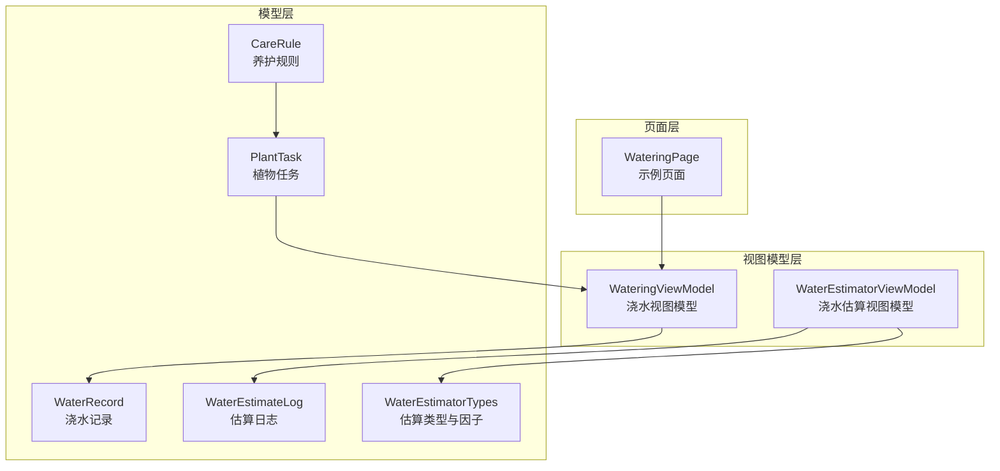
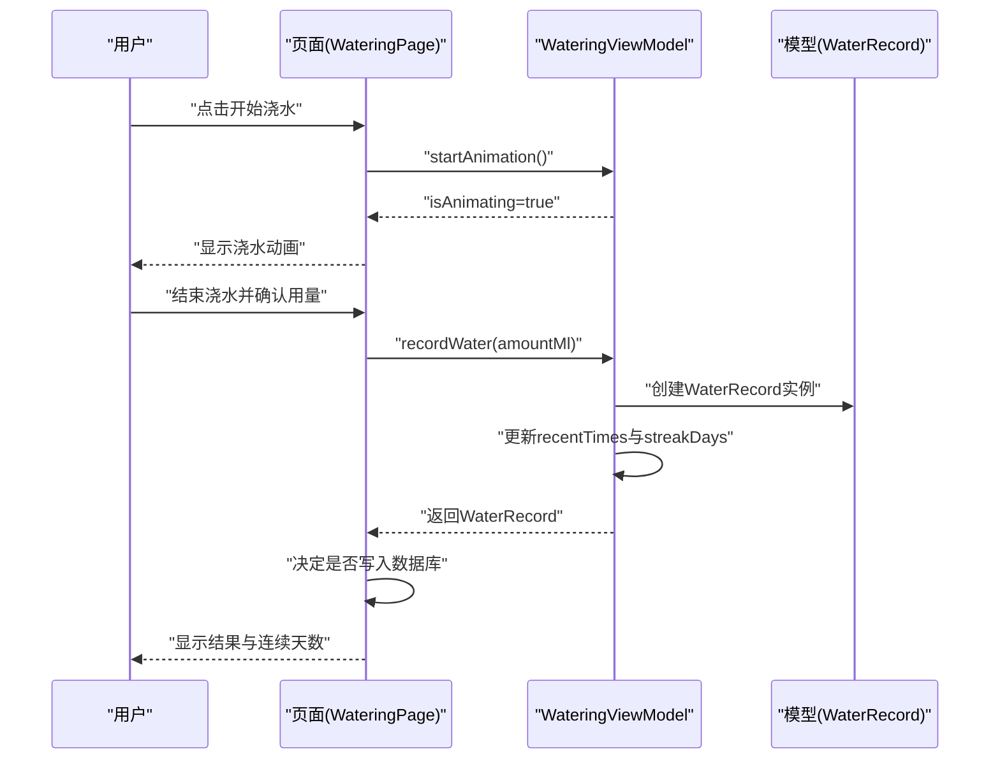
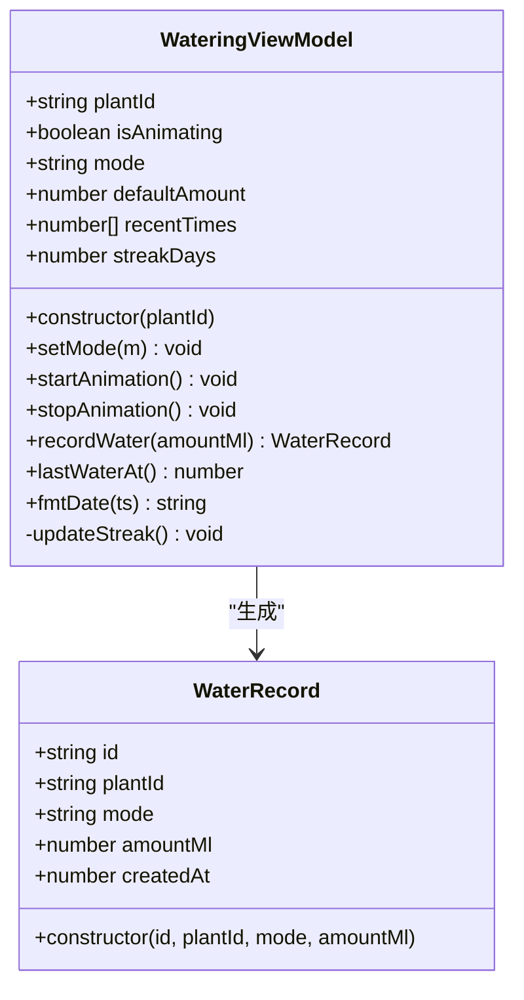
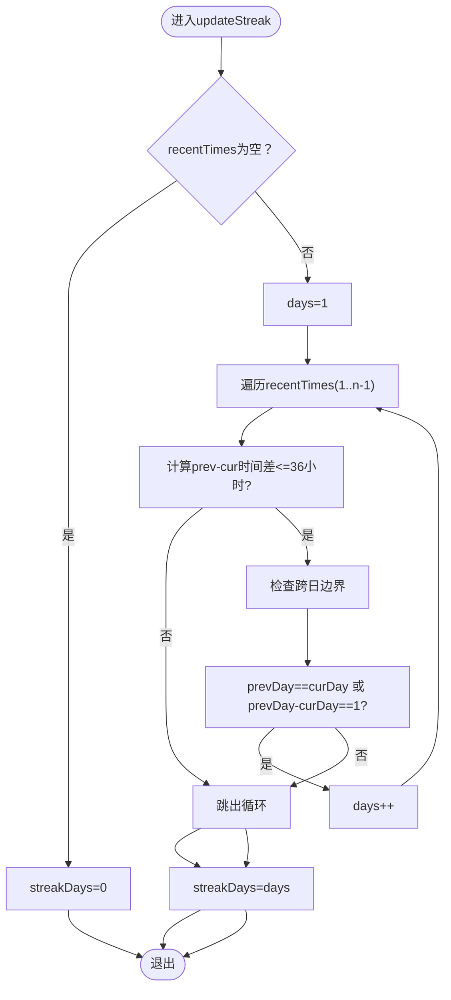
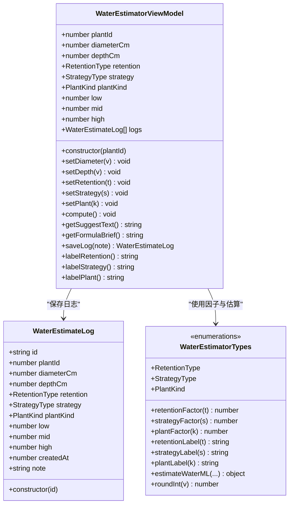
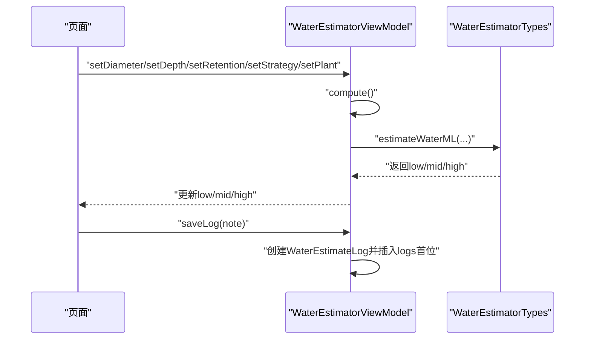
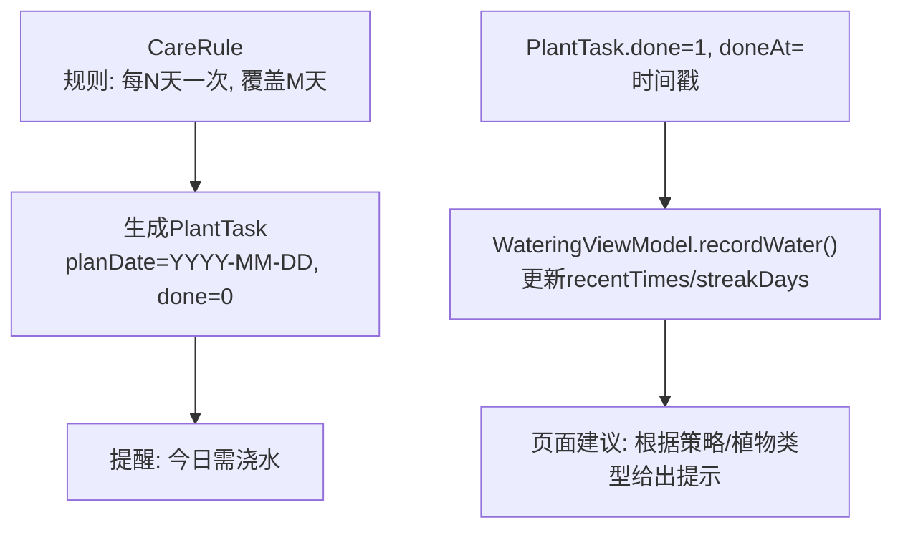
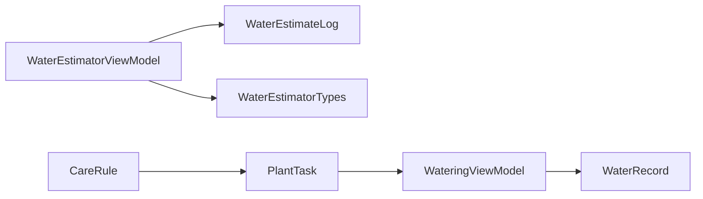

# 浇水管理API

<cite>
**本文档引用的文件**
- [WateringViewModel.ets](file://entry/src/main/ets/viewmodel/WateringViewModel.ets)
- [WaterRecord.ets](file://entry/src/main/ets/model/WaterRecord.ets)
- [WaterEstimatorViewModel.ets](file://entry/src/main/ets/viewmodel/WaterEstimatorViewModel.ets)
- [WaterEstimateLog.ets](file://entry/src/main/ets/model/WaterEstimateLog.ets)
- [WaterEstimatorTypes.ets](file://entry/src/main/ets/model/WaterEstimatorTypes.ets)
- [PlantModel.ets](file://entry/src/main/ets/model/PlantModel.ets)
- [WateringPage.ets](file://entry/src/main/ets/pages/WateringPage.ets)
</cite>

## 目录
1. [简介](#简介)
2. [项目结构](#项目结构)
3. [核心组件](#核心组件)
4. [架构总览](#架构总览)
5. [详细组件分析](#详细组件分析)
6. [依赖关系分析](#依赖关系分析)
7. [性能考虑](#性能考虑)
8. [故障排除指南](#故障排除指南)
9. [结论](#结论)
10. [附录](#附录)

## 简介
本文件面向浇水管理业务逻辑，聚焦 WateringViewModel 的核心接口规范，涵盖以下能力：
- 浇水任务生成：通过记录一次浇水行为，生成可持久化的记录对象
- 浇水执行监控：提供动画状态控制与最近浇水时间查询
- 浇水效果评估：基于最近浇水时间推断连续天数，辅助效果评估
- 浇水计划制定：结合 PlantTask/CareRule 等模型，支持周期性任务生成
- 浇水记录管理：记录对象 WaterRecord 的结构与生命周期
- 浇水提醒通知：基于 PlantTask 的计划日期与完成状态进行提醒

本API文档以实际代码实现为依据，提供接口定义、调用流程、最佳实践与常见问题排查建议。

## 项目结构
围绕浇水管理的相关模块组织如下：
- 视图模型层：WateringViewModel（浇水动画与记录）、WaterEstimatorViewModel（估算）
- 模型层：WaterRecord（记录实体）、WaterEstimateLog（估算日志）、PlantTask/CareRule（计划与规则）
- 页面层：WateringPage（示例页面，展示媒体保存流程）

**图表来源**
- [WateringViewModel.ets:11-102](file://entry/src/main/ets/viewmodel/WateringViewModel.ets#L11-L102)
- [WaterEstimatorViewModel.ets:16-130](file://entry/src/main/ets/viewmodel/WaterEstimatorViewModel.ets#L16-L130)
- [WaterRecord.ets:3-18](file://entry/src/main/ets/model/WaterRecord.ets#L3-L18)
- [WaterEstimateLog.ets:6-25](file://entry/src/main/ets/model/WaterEstimateLog.ets#L6-L25)
- [PlantModel.ets:43-59](file://entry/src/main/ets/model/PlantModel.ets#L43-L59)
- [WateringPage.ets:7-78](file://entry/src/main/ets/pages/WateringPage.ets#L7-L78)

**章节来源**
- [WateringViewModel.ets:11-102](file://entry/src/main/ets/viewmodel/WateringViewModel.ets#L11-L102)
- [WaterEstimatorViewModel.ets:16-130](file://entry/src/main/ets/viewmodel/WaterEstimatorViewModel.ets#L16-L130)
- [WaterRecord.ets:3-18](file://entry/src/main/ets/model/WaterRecord.ets#L3-L18)
- [WaterEstimateLog.ets:6-25](file://entry/src/main/ets/model/WaterEstimateLog.ets#L6-L25)
- [PlantModel.ets:43-59](file://entry/src/main/ets/model/PlantModel.ets#L43-L59)
- [WateringPage.ets:7-78](file://entry/src/main/ets/pages/WateringPage.ets#L7-L78)

## 核心组件
本节对关键组件进行深入解析，包括类结构、属性、方法与职责边界。

- WateringViewModel（浇水视图模型）
  - 负责：动画状态管理、浇水模式切换、记录生成、最近时间与连续天数统计、时间格式化
  - 关键属性：plantId、isAnimating、mode、defaultAmount、recentTimes、streakDays
  - 关键方法：setMode、startAnimation、stopAnimation、recordWater、lastWaterAt、fmtDate

- WaterRecord（浇水记录）
  - 负责：承载单次浇水的标识、植物标识、模式、用量与创建时间
  - 关键字段：id、plantId、mode、amountMl、createdAt

- WaterEstimatorViewModel（浇水估算视图模型）
  - 负责：接收输入参数、计算区间值、生成建议文案、保存估算日志
  - 关键属性：plantId、diameterCm、depthCm、retention、strategy、plantKind、low/mid/high、logs
  - 关键方法：setDiameter、setDepth、setRetention、setStrategy、setPlant、compute、getSuggestText、getFormulaBrief、saveLog、labelRetention、labelStrategy、labelPlant

- WaterEstimateLog（估算日志）
  - 负责：保存估算快照（输入参数与结果），支持追加到历史列表
  - 关键字段：id、plantId、diameterCm、depthCm、retention、strategy、plantKind、low/mid/high、createdAt、note

- PlantTask/CareRule（计划与规则）
  - 负责：描述养护行为的生成节奏与计划日期，支撑浇水提醒与周期性任务
  - 关键字段：PlantTask（id、plantId、type、planDate、done、doneAt）、CareRule（id、templateId、type、intervalDays、horizonDays）

**章节来源**
- [WateringViewModel.ets:11-102](file://entry/src/main/ets/viewmodel/WateringViewModel.ets#L11-L102)
- [WaterRecord.ets:3-18](file://entry/src/main/ets/model/WaterRecord.ets#L3-L18)
- [WaterEstimatorViewModel.ets:16-130](file://entry/src/main/ets/viewmodel/WaterEstimatorViewModel.ets#L16-L130)
- [WaterEstimateLog.ets:6-25](file://entry/src/main/ets/model/WaterEstimateLog.ets#L6-L25)
- [PlantModel.ets:43-59](file://entry/src/main/ets/model/PlantModel.ets#L43-L59)

## 架构总览
浇水管理的端到端流程包括：用户触发浇水动画 → 生成记录 → 更新内存状态与连续天数 → 页面决定是否持久化 → 与计划系统联动进行提醒。

**图表来源**
- [WateringViewModel.ets:35-63](file://entry/src/main/ets/viewmodel/WateringViewModel.ets#L35-L63)
- [WaterRecord.ets:10-16](file://entry/src/main/ets/model/WaterRecord.ets#L10-L16)
- [WateringPage.ets:7-78](file://entry/src/main/ets/pages/WateringPage.ets#L7-L78)

## 详细组件分析

### WateringViewModel 组件分析
- 类图概览

- 方法说明
  - setMode(m: string): 切换浇水模式（'light' | 'deep'），非法值忽略
  - startAnimation()/stopAnimation(): 控制动画状态
  - recordWater(amountMl: number): 生成记录并更新最近时间与连续天数
  - lastWaterAt(): 获取最近一次浇水时间戳（0表示无）
  - fmtDate(ts: number): 格式化时间字符串
  - updateStreak(): 基于最近时间推断连续天数，容忍跨天边界误差

- 连续天数算法流程

**图表来源**
- [WateringViewModel.ets:66-88](file://entry/src/main/ets/viewmodel/WateringViewModel.ets#L66-L88)

**章节来源**
- [WateringViewModel.ets:11-102](file://entry/src/main/ets/viewmodel/WateringViewModel.ets#L11-L102)
- [WaterRecord.ets:3-18](file://entry/src/main/ets/model/WaterRecord.ets#L3-L18)

### WaterEstimatorViewModel 组件分析
- 类图概览

- 方法说明
  - 输入设置：setDiameter/setDepth/setRetention/setStrategy/setPlant，均在设置后自动重新计算
  - compute(): 调用模型层估算函数，更新low/mid/high
  - getSuggestText()/getFormulaBrief(): 生成建议文案与简要公式说明
  - saveLog(note: string): 将当前输入与结果打包为快照，插入到日志列表首位
  - 标签方法：labelRetention/labelStrategy/labelPlant

- 估算流程序列

**图表来源**
- [WaterEstimatorViewModel.ets:74-123](file://entry/src/main/ets/viewmodel/WaterEstimatorViewModel.ets#L74-L123)
- [WaterEstimatorTypes.ets:8-130](file://entry/src/main/ets/model/WaterEstimatorTypes.ets#L8-L130)

**章节来源**
- [WaterEstimatorViewModel.ets:16-130](file://entry/src/main/ets/viewmodel/WaterEstimatorViewModel.ets#L16-L130)
- [WaterEstimateLog.ets:6-25](file://entry/src/main/ets/model/WaterEstimateLog.ets#L6-L25)
- [WaterEstimatorTypes.ets:8-130](file://entry/src/main/ets/model/WaterEstimatorTypes.ets#L8-L130)

### 计划与提醒联动分析
- PlantTask/CareRule 描述了周期性任务的生成节奏，可用于驱动浇水提醒
- WateringViewModel 提供 lastWaterAt 与 streakDays，可作为提醒策略的输入

**图表来源**
- [PlantModel.ets:43-59](file://entry/src/main/ets/model/PlantModel.ets#L43-L59)
- [WateringViewModel.ets:44-88](file://entry/src/main/ets/viewmodel/WateringViewModel.ets#L44-L88)

**章节来源**
- [PlantModel.ets:43-59](file://entry/src/main/ets/model/PlantModel.ets#L43-L59)
- [WateringViewModel.ets:44-88](file://entry/src/main/ets/viewmodel/WateringViewModel.ets#L44-L88)

## 依赖关系分析
- WateringViewModel 依赖 WaterRecord（生成记录）
- WaterEstimatorViewModel 依赖 WaterEstimateLog 与 WaterEstimatorTypes（估算与标签）
- PlantTask/CareRule 与 WateringViewModel 协作，形成提醒与记录闭环

**图表来源**
- [WateringViewModel.ets:3,44-57](file://entry/src/main/ets/viewmodel/WateringViewModel.ets#L3,L44-L57)
- [WaterEstimatorViewModel.ets:4,74-123](file://entry/src/main/ets/viewmodel/WaterEstimatorViewModel.ets#L4,L74-L123)
- [PlantModel.ets:43-59](file://entry/src/main/ets/model/PlantModel.ets#L43-L59)

**章节来源**
- [WateringViewModel.ets:3,44-57](file://entry/src/main/ets/viewmodel/WateringViewModel.ets#L3,L44-L57)
- [WaterEstimatorViewModel.ets:4,74-123](file://entry/src/main/ets/viewmodel/WaterEstimatorViewModel.ets#L4,L74-L123)
- [PlantModel.ets:43-59](file://entry/src/main/ets/model/PlantModel.ets#L43-L59)

## 性能考虑
- 记录数组长度限制：recentTimes 最多保留10条，避免无限增长导致内存压力
- 连续天数计算：仅遍历最近记录，时间复杂度 O(n)，n≤10
- 估算计算：每次输入变更即重算，适合小规模输入集，避免频繁IO
- 建议：在页面层对频繁调用进行节流或防抖，减少不必要的重绘

## 故障排除指南
- 模式切换无效
  - 现象：调用 setMode 后模式未变化
  - 排查：确认传入值为 'light' 或 'deep'
  - 参考：[WateringViewModel.ets:30-33](file://entry/src/main/ets/viewmodel/WateringViewModel.ets#L30-L33)

- 连续天数异常
  - 现象：streakDays 不符合预期
  - 排查：检查 recentTimes 是否正确更新；确认跨日边界判断逻辑
  - 参考：[WateringViewModel.ets:66-88](file://entry/src/main/ets/viewmodel/WateringViewModel.ets#L66-L88)

- 估算结果不准确
  - 现象：low/mid/high 与预期不符
  - 排查：核对输入参数范围与因子映射；确认估算函数实现
  - 参考：[WaterEstimatorViewModel.ets:74-79](file://entry/src/main/ets/viewmodel/WaterEstimatorViewModel.ets#L74-L79), [WaterEstimatorTypes.ets:44-84](file://entry/src/main/ets/model/WaterEstimatorTypes.ets#L44-L84)

- 日志保存失败
  - 现象：saveLog 后日志未追加
  - 排查：确认 logs 首位插入逻辑；检查对象拷贝与数组更新
  - 参考：[WaterEstimatorViewModel.ets:118-123](file://entry/src/main/ets/viewmodel/WaterEstimatorViewModel.ets#L118-L123)

**章节来源**
- [WateringViewModel.ets:30-33](file://entry/src/main/ets/viewmodel/WateringViewModel.ets#L30-L33)
- [WateringViewModel.ets:66-88](file://entry/src/main/ets/viewmodel/WateringViewModel.ets#L66-L88)
- [WaterEstimatorViewModel.ets:74-79](file://entry/src/main/ets/viewmodel/WaterEstimatorViewModel.ets#L74-L79)
- [WaterEstimatorViewModel.ets:118-123](file://entry/src/main/ets/viewmodel/WaterEstimatorViewModel.ets#L118-L123)
- [WaterEstimatorTypes.ets:44-84](file://entry/src/main/ets/model/WaterEstimatorTypes.ets#L44-L84)

## 结论
WateringViewModel 与 WaterEstimatorViewModel 构成了浇水管理的核心API体系：前者负责动画与记录的即时状态管理，后者负责估算与日志的可追溯性。二者配合 PlantTask/CareRule 实现了从“执行”到“提醒”的闭环。建议在实际集成中：
- 明确记录持久化时机，避免频繁写库
- 使用估算建议作为提醒策略的参考，但结合植物实际状态
- 对高频输入进行节流，提升交互流畅度

## 附录

### API 定义与调用示例（路径指引）
- 浇水模式切换
  - 方法：setMode(m: string)
  - 示例路径：[WateringViewModel.ets:30-33](file://entry/src/main/ets/viewmodel/WateringViewModel.ets#L30-L33)

- 开始/停止动画
  - 方法：startAnimation(), stopAnimation()
  - 示例路径：[WateringViewModel.ets:36-41](file://entry/src/main/ets/viewmodel/WateringViewModel.ets#L36-L41)

- 记录一次浇水
  - 方法：recordWater(amountMl: number) → WaterRecord
  - 示例路径：[WateringViewModel.ets:44-57](file://entry/src/main/ets/viewmodel/WateringViewModel.ets#L44-L57), [WaterRecord.ets:10-16](file://entry/src/main/ets/model/WaterRecord.ets#L10-L16)

- 查询最近浇水时间
  - 方法：lastWaterAt() → number
  - 示例路径：[WateringViewModel.ets:60-63](file://entry/src/main/ets/viewmodel/WateringViewModel.ets#L60-L63)

- 连续天数推断
  - 方法：updateStreak()（内部调用）
  - 示例路径：[WateringViewModel.ets:66-88](file://entry/src/main/ets/viewmodel/WateringViewModel.ets#L66-L88)

- 估算输入设置与计算
  - 方法：setDiameter/setDepth/setRetention/setStrategy/setPlant → compute()
  - 示例路径：[WaterEstimatorViewModel.ets:41-70, 74-79](file://entry/src/main/ets/viewmodel/WaterEstimatorViewModel.ets#L41-L70,L74-L79)

- 生成建议与公式说明
  - 方法：getSuggestText(), getFormulaBrief()
  - 示例路径：[WaterEstimatorViewModel.ets:83-101](file://entry/src/main/ets/viewmodel/WaterEstimatorViewModel.ets#L83-L101)

- 保存估算日志
  - 方法：saveLog(note: string) → WaterEstimateLog
  - 示例路径：[WaterEstimatorViewModel.ets:105-123](file://entry/src/main/ets/viewmodel/WaterEstimatorViewModel.ets#L105-L123), [WaterEstimateLog.ets:20-23](file://entry/src/main/ets/model/WaterEstimateLog.ets#L20-L23)

- 计划与提醒联动
  - 模型：PlantTask/CareRule
  - 示例路径：[PlantModel.ets:43-59](file://entry/src/main/ets/model/PlantModel.ets#L43-L59)

### 最佳实践
- 在页面层统一处理记录持久化，避免 ViewModel 直接耦合存储
- 使用 getSuggestText 作为提醒策略的参考，结合 lastWaterAt 与 streakDays 增强用户体验
- 对估算输入进行范围约束与四舍五入，确保结果稳定
- 估算日志应包含 note 以便后续回溯与对比