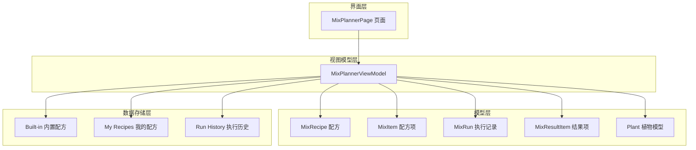
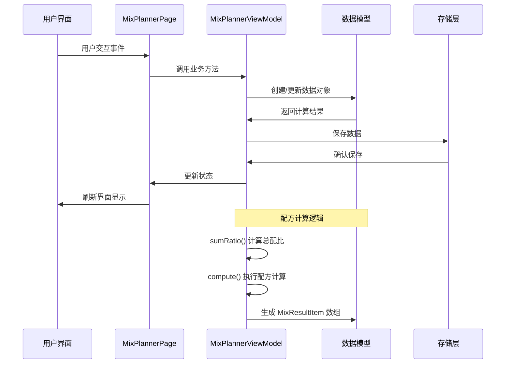
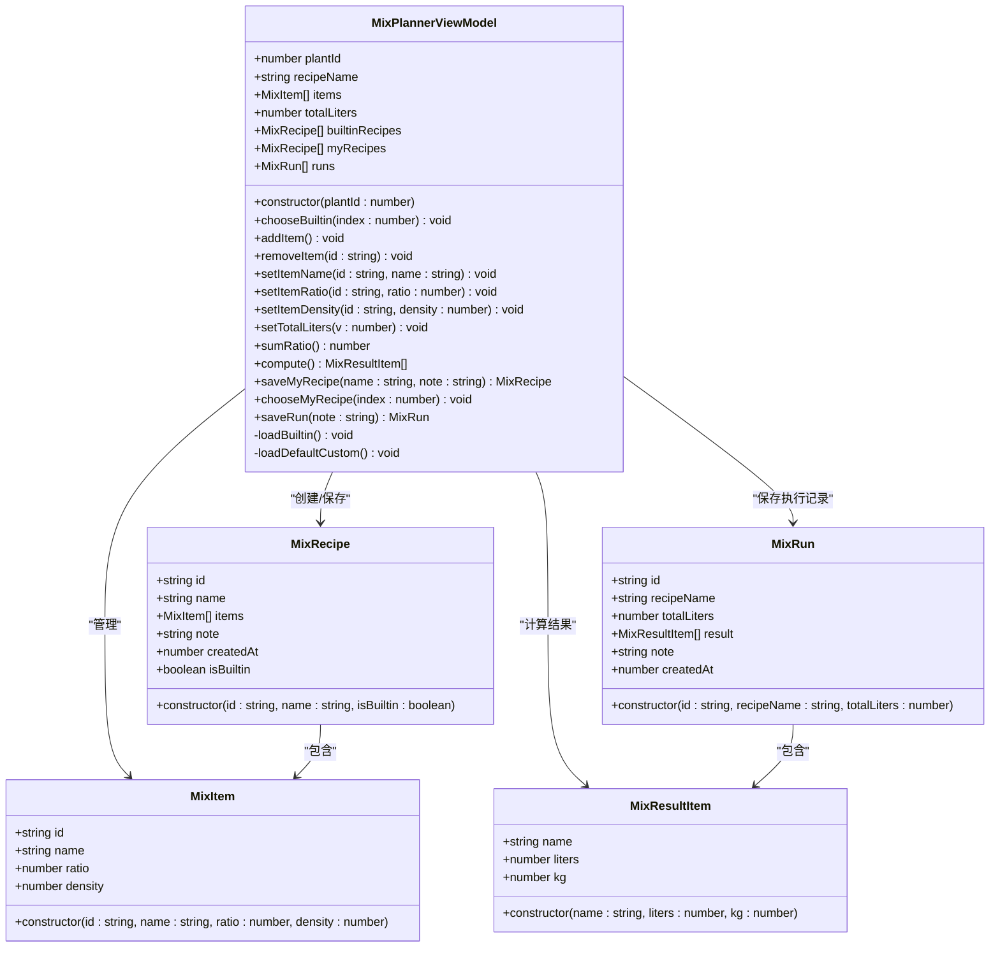
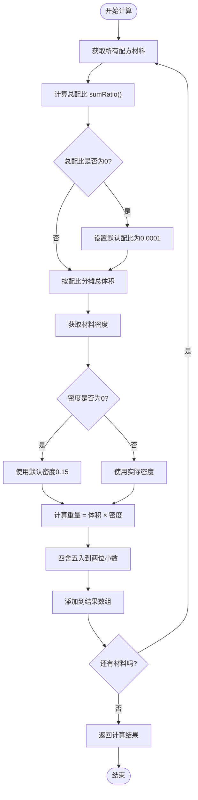
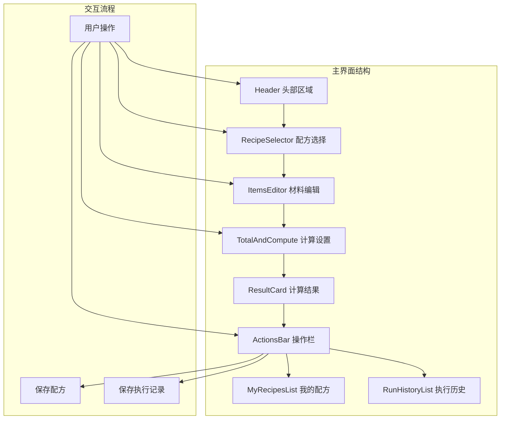

# 混合配方案API

<cite>
**本文档引用的文件**
- [MixPlannerViewModel.ets](file://entry/src/main/ets/viewmodel/MixPlannerViewModel.ets)
- [MixRecipe.ets](file://entry/src/main/ets/model/MixRecipe.ets)
- [MixRun.ets](file://entry/src/main/ets/model/MixRun.ets)
- [MixPlannerPage.ets](file://entry/src/main/ets/pages/MixPlannerPage.ets)
- [PlantModel.ets](file://entry/src/main/ets/model/PlantModel.ets)
</cite>

## 目录
1. [简介](#简介)
2. [项目结构](#项目结构)
3. [核心组件](#核心组件)
4. [架构概览](#架构概览)
5. [详细组件分析](#详细组件分析)
6. [配方管理API](#配方管理api)
7. [配方执行API](#配方执行api)
8. [数据模型API](#数据模型api)
9. [性能考虑](#性能考虑)
10. [故障排除指南](#故障排除指南)
11. [结论](#结论)

## 简介

混合配方案API是一套专为植物营养需求设计的土壤配方管理系统。该系统提供了完整的配方创建、编辑、执行和监控功能，支持植物营养需求分析、肥料配比计算和配方优化建议。系统采用MVVM架构模式，通过MixPlannerViewModel作为核心控制器，管理配方的生命周期和计算逻辑。

该API特别适用于：
- 植物营养需求分析和配方定制
- 土壤混合配方案的自动化计算
- 配方执行过程的实时监控
- 历史配方和执行记录的管理
- 植物特定需求的个性化配方优化

## 项目结构

混合配方案系统采用清晰的分层架构，主要包含以下组件：

**图表来源**
- [MixPlannerPage.ets:39-90](file://entry/src/main/ets/pages/MixPlannerPage.ets#L39-L90)
- [MixPlannerViewModel.ets:17-39](file://entry/src/main/ets/viewmodel/MixPlannerViewModel.ets#L17-L39)

**章节来源**
- [MixPlannerPage.ets:1-366](file://entry/src/main/ets/pages/MixPlannerPage.ets#L1-L366)
- [MixPlannerViewModel.ets:1-228](file://entry/src/main/ets/viewmodel/MixPlannerViewModel.ets#L1-L228)

## 核心组件

系统的核心组件包括三个主要的数据模型和一个视图模型控制器：

### 主要组件概述

| 组件 | 类型 | 描述 | 主要职责 |
|------|------|------|----------|
| MixPlannerViewModel | 视图模型 | 配方管理控制器 | 配方创建、编辑、计算、保存 |
| MixRecipe | 数据模型 | 配方实体 | 存储配方基本信息和材料列表 |
| MixItem | 数据模型 | 配方材料项 | 存储单个材料的属性和配比 |
| MixRun | 数据模型 | 执行记录 | 存储配方执行结果和历史 |
| MixResultItem | 数据模型 | 计算结果项 | 存储单个材料的计算结果 |

**章节来源**
- [MixPlannerViewModel.ets:18-39](file://entry/src/main/ets/viewmodel/MixPlannerViewModel.ets#L18-L39)
- [MixRecipe.ets:18-32](file://entry/src/main/ets/model/MixRecipe.ets#L18-L32)
- [MixRun.ets:16-30](file://entry/src/main/ets/model/MixRun.ets#L16-L30)

## 架构概览

混合配方案系统采用MVVM架构模式，实现了清晰的关注点分离：

**图表来源**
- [MixPlannerPage.ets:109-142](file://entry/src/main/ets/pages/MixPlannerPage.ets#L109-L142)
- [MixPlannerViewModel.ets:168-181](file://entry/src/main/ets/viewmodel/MixPlannerViewModel.ets#L168-L181)

## 详细组件分析

### MixPlannerViewModel - 核心控制器

MixPlannerViewModel是整个混合配方案系统的核心控制器，负责管理配方的完整生命周期。

#### 类结构图

**图表来源**
- [MixPlannerViewModel.ets:18-227](file://entry/src/main/ets/viewmodel/MixPlannerViewModel.ets#L18-L227)
- [MixRecipe.ets:4-16](file://entry/src/main/ets/model/MixRecipe.ets#L4-L16)
- [MixRun.ets:4-14](file://entry/src/main/ets/model/MixRun.ets#L4-L14)

#### 核心方法分类

##### 配方选择方法
- `chooseBuiltin(index: number)` - 选择内置配方
- `chooseMyRecipe(index: number)` - 选择我的配方
- `loadDefaultCustom()` - 加载默认自定义配方

##### 配方编辑方法
- `addItem()` - 添加新材料项
- `removeItem(id: string)` - 删除指定材料项
- `setItemName(id: string, name: string)` - 设置材料名称
- `setItemRatio(id: string, ratio: number)` - 设置材料配比
- `setItemDensity(id: string, density: number)` - 设置材料密度
- `setTotalLiters(v: number)` - 设置总配比

##### 计算和保存方法
- `sumRatio(): number` - 计算总配比
- `compute(): Array<MixResultItem>` - 执行配方计算
- `saveMyRecipe(name: string, note: string): MixRecipe` - 保存为我的配方
- `saveRun(note: string): MixRun` - 保存执行记录

**章节来源**
- [MixPlannerViewModel.ets:43-94](file://entry/src/main/ets/viewmodel/MixPlannerViewModel.ets#L43-L94)
- [MixPlannerViewModel.ets:97-159](file://entry/src/main/ets/viewmodel/MixPlannerViewModel.ets#L97-L159)
- [MixPlannerViewModel.ets:168-226](file://entry/src/main/ets/viewmodel/MixPlannerViewModel.ets#L168-L226)

### 配方计算算法

配方计算是系统的核心功能，实现了精确的配比分配和重量估算。

#### 计算流程图

**图表来源**
- [MixPlannerViewModel.ets:168-181](file://entry/src/main/ets/viewmodel/MixPlannerViewModel.ets#L168-L181)

#### 计算参数说明

| 参数 | 类型 | 默认值 | 有效范围 | 描述 |
|------|------|--------|----------|------|
| ratio | number | 1 | 0.1 - 99 | 材料配比权重 |
| density | number | 0.15 | 0 - 3 | 材料密度 kg/L |
| totalLiters | number | 10 | 1 - 200 | 总配制体积(L) |
| liters | number | 0 | 0 - ∞ | 单项体积(L) |
| kg | number | 0 | 0 - ∞ | 单项重量(kg) |

**章节来源**
- [MixPlannerViewModel.ets:168-181](file://entry/src/main/ets/viewmodel/MixPlannerViewModel.ets#L168-L181)

### 界面集成

MixPlannerPage实现了完整的用户界面，提供了直观的配方管理体验。

#### 界面组件结构

**图表来源**
- [MixPlannerPage.ets:62-90](file://entry/src/main/ets/pages/MixPlannerPage.ets#L62-L90)
- [MixPlannerPage.ets:109-142](file://entry/src/main/ets/pages/MixPlannerPage.ets#L109-L142)

**章节来源**
- [MixPlannerPage.ets:39-90](file://entry/src/main/ets/pages/MixPlannerPage.ets#L39-L90)
- [MixPlannerPage.ets:109-364](file://entry/src/main/ets/pages/MixPlannerPage.ets#L109-L364)

## 配方管理API

### 配方创建和编辑接口

#### 配方选择接口

| 接口名称 | 参数类型 | 返回类型 | 描述 |
|----------|----------|----------|------|
| chooseBuiltin | number | void | 选择内置配方，深拷贝材料列表 |
| chooseMyRecipe | number | void | 选择我的配方，深拷贝材料列表 |
| loadDefaultCustom | void | void | 加载默认自定义配方 |

#### 材料编辑接口

| 接口名称 | 参数类型 | 返回类型 | 描述 |
|----------|----------|----------|------|
| addItem | void | void | 添加新材料项，默认密度0.15 |
| removeItem | string | void | 删除指定ID的材料项 |
| setItemName | string, string | void | 设置材料名称 |
| setItemRatio | string, number | void | 设置材料配比(0.1-99) |
| setItemDensity | string, number | void | 设置材料密度(0-3) |

#### 配置设置接口

| 接口名称 | 参数类型 | 返回类型 | 描述 |
|----------|----------|----------|------|
| setTotalLiters | number | void | 设置总配制体积(1-200L) |
| sumRatio | void | number | 计算总配比权重 |

**章节来源**
- [MixPlannerViewModel.ets:81-94](file://entry/src/main/ets/viewmodel/MixPlannerViewModel.ets#L81-L94)
- [MixPlannerViewModel.ets:97-159](file://entry/src/main/ets/viewmodel/MixPlannerViewModel.ets#L97-L159)
- [MixPlannerViewModel.ets:154-166](file://entry/src/main/ets/viewmodel/MixPlannerViewModel.ets#L154-L166)

### 配方保存和管理

#### 配方保存接口

| 接口名称 | 参数类型 | 返回类型 | 描述 |
|----------|----------|----------|------|
| saveMyRecipe | string, string | MixRecipe \| undefined | 保存为我的配方，返回保存结果 |
| saveRun | string | MixRun | 保存本次执行记录 |

#### 配方管理特性

- **深拷贝机制**：选择内置或我的配方时自动深拷贝，避免编辑态污染
- **版本控制**：每个配方包含创建时间戳，支持历史追踪
- **模板复用**：保存的配方可重复使用和微调
- **数据持久化**：支持内置配方、我的配方和执行历史的长期保存

**章节来源**
- [MixPlannerViewModel.ets:185-226](file://entry/src/main/ets/viewmodel/MixPlannerViewModel.ets#L185-L226)

## 配方执行API

### 实时计算接口

#### 核心计算方法

| 接口名称 | 参数类型 | 返回类型 | 描述 |
|----------|----------|----------|------|
| compute | void | Array<MixResultItem> | 执行配方计算，返回实时结果 |

#### 计算结果数据结构

| 字段名称 | 类型 | 描述 |
|----------|------|------|
| name | string | 材料名称 |
| liters | number | 计算体积(L)，保留两位小数 |
| kg | number | 计算重量(kg)，保留两位小数 |

#### 计算精度控制

系统使用`round2`函数确保计算结果的精度一致性：
- 体积计算结果：四舍五入到小数点后两位
- 重量计算结果：四舍五入到小数点后两位
- 配比权重：支持一位小数精度

**章节来源**
- [MixPlannerViewModel.ets:170-181](file://entry/src/main/ets/viewmodel/MixPlannerViewModel.ets#L170-L181)
- [MixPlannerViewModel.ets:13-15](file://entry/src/main/ets/viewmodel/MixPlannerViewModel.ets#L13-L15)

### 执行监控和历史记录

#### 历史记录管理

| 接口名称 | 参数类型 | 返回类型 | 描述 |
|----------|----------|----------|------|
| saveRun | string | MixRun | 保存当前执行记录 |
| runs | Array<MixRun> | 只读 | 获取执行历史列表 |

#### 历史记录特性

- **快照保存**：执行记录保存计算结果的快照
- **独立追踪**：历史记录不依赖当前编辑状态
- **时间追踪**：每个记录包含创建时间戳
- **摘要展示**：历史记录显示前两项结果摘要

**章节来源**
- [MixPlannerViewModel.ets:217-226](file://entry/src/main/ets/viewmodel/MixPlannerViewModel.ets#L217-L226)
- [MixRun.ets:16-30](file://entry/src/main/ets/model/MixRun.ets#L16-L30)

## 数据模型API

### MixRecipe - 配方实体

#### 配方基础属性

| 属性名称 | 类型 | 默认值 | 描述 |
|----------|------|--------|------|
| id | string | '' | 配方唯一标识符 |
| name | string | '' | 配方名称 |
| items | Array<MixItem> | [] | 配方材料列表 |
| note | string | '' | 配方备注说明 |
| createdAt | number | 0 | 创建时间戳(ms) |
| isBuiltin | boolean | false | 是否为内置配方 |

#### 内置配方预设

系统预置了三种常用植物类型的配方：

| 配方名称 | 适用植物 | 材料组成 | 特殊说明 |
|----------|----------|----------|----------|
| 多肉·排水型(2:2:1) | 多肉植物 | 泥炭:珍珠岩:树皮 = 2:2:1 | 重点考虑排水性 |
| 观叶·通用(2:2:1) | 观叶植物 | 椰糠:泥炭:珍珠岩 = 2:2:1 | 通用型配方 |
| 兰科·透气(3:2) | 兰科植物 | 树皮:轻石 = 3:2 | 强调透气性 |

**章节来源**
- [MixRecipe.ets:18-32](file://entry/src/main/ets/model/MixRecipe.ets#L18-L32)
- [MixPlannerViewModel.ets:44-67](file://entry/src/main/ets/viewmodel/MixPlannerViewModel.ets#L44-L67)

### MixItem - 配方材料项

#### 材料属性定义

| 属性名称 | 类型 | 默认值 | 有效范围 | 描述 |
|----------|------|--------|----------|------|
| id | string | '' | 自动生成 | 材料唯一标识符 |
| name | string | '' | 任意字符串 | 材料名称 |
| ratio | number | 1 | 0.1 - 99 | 配比权重 |
| density | number | 0.15 | 0 - 3 | 材料密度(kg/L) |

#### 密度使用规则

- **密度为0**：使用系统默认密度0.15 kg/L
- **密度>0**：使用实际输入的密度值
- **密度限制**：最大支持3.0 kg/L的合理上限

**章节来源**
- [MixRecipe.ets:4-16](file://entry/src/main/ets/model/MixRecipe.ets#L4-L16)
- [MixPlannerViewModel.ets:139-152](file://entry/src/main/ets/viewmodel/MixPlannerViewModel.ets#L139-L152)

### MixRun - 执行记录

#### 执行记录属性

| 属性名称 | 类型 | 描述 |
|----------|------|------|
| id | string | 执行记录唯一标识符 |
| recipeName | string | 使用的配方名称 |
| totalLiters | number | 总配制体积(L) |
| result | Array<MixResultItem> | 计算结果列表 |
| note | string | 执行备注 |
| createdAt | number | 创建时间戳(ms) |

#### MixResultItem - 结果项

| 属性名称 | 类型 | 描述 |
|----------|------|------|
| name | string | 材料名称 |
| liters | number | 体积(L) |
| kg | number | 重量(kg) |

**章节来源**
- [MixRun.ets:16-30](file://entry/src/main/ets/model/MixRun.ets#L16-L30)
- [MixRun.ets:4-14](file://entry/src/main/ets/model/MixRun.ets#L4-L14)

## 性能考虑

### 计算性能优化

系统在配方计算方面采用了多项性能优化策略：

#### 计算效率优化
- **一次性计算**：每次UI刷新时重新计算，确保数据一致性
- **数值精度控制**：使用固定精度避免浮点运算误差累积
- **边界值处理**：对极值进行预处理，提高计算稳定性

#### 内存管理
- **深拷贝机制**：避免编辑态污染，但增加内存使用
- **数据结构优化**：使用简单数组结构，减少对象创建开销
- **状态管理**：通过@ObservedV2装饰器实现高效的响应式更新

### 用户体验优化

#### 实时反馈
- **即时计算**：材料调整后立即反映在计算结果中
- **滑块控制**：提供直观的数值调节方式
- **快速预设**：内置常见密度值的快速选择

#### 错误处理
- **输入验证**：自动过滤无效输入
- **范围限制**：防止超出合理范围的数值
- **容错机制**：空输入自动转换为默认值

## 故障排除指南

### 常见问题和解决方案

#### 配方计算异常

**问题现象**：计算结果显示为0或异常值
**可能原因**：
- 配比权重设置过小(小于0.1)
- 密度设置为负值
- 总配制体积设置为0

**解决方法**：
- 确保配比权重在0.1-99范围内
- 密度值应为非负数
- 总配制体积至少为1L

#### 数据保存失败

**问题现象**：无法保存配方或执行记录
**可能原因**：
- 配方名称为空
- 内存不足导致对象创建失败

**解决方法**：
- 确保配方名称非空
- 清理不必要的配方或执行记录

#### 界面更新延迟

**问题现象**：界面未及时反映数据变化
**可能原因**：
- 响应式状态更新机制未触发
- UI组件未正确绑定到VM状态

**解决方法**：
- 确保通过VM方法修改状态
- 检查@ObservedV2装饰器的正确使用

**章节来源**
- [MixPlannerViewModel.ets:124-128](file://entry/src/main/ets/viewmodel/MixPlannerViewModel.ets#L124-L128)
- [MixPlannerViewModel.ets:140-143](file://entry/src/main/ets/viewmodel/MixPlannerViewModel.ets#L140-L143)
- [MixPlannerViewModel.ets:155-158](file://entry/src/main/ets/viewmodel/MixPlannerViewModel.ets#L155-L158)

## 结论

混合配方案API提供了一套完整、高效且用户友好的植物营养配方案管理系统。通过清晰的MVVM架构设计和精心优化的计算算法，系统能够满足从初学者到专业园艺师的各种需求。

### 系统优势

1. **易用性强**：直观的界面设计和实时反馈机制
2. **功能完整**：涵盖配方创建、编辑、执行、监控的全流程
3. **计算准确**：精确的配比分配和重量估算算法
4. **扩展灵活**：支持自定义配方和植物特定优化
5. **数据安全**：完善的备份和历史记录机制

### 应用场景

- **家庭园艺**：为不同植物类型提供精确的配方案
- **商业种植**：批量生产标准化的培养基配方
- **教育用途**：植物营养学教学和实验
- **研究应用**：植物生长条件优化和实验设计

该API为植物营养管理提供了坚实的技术基础，通过持续的功能完善和用户体验优化，将成为植物护理领域的重要工具。