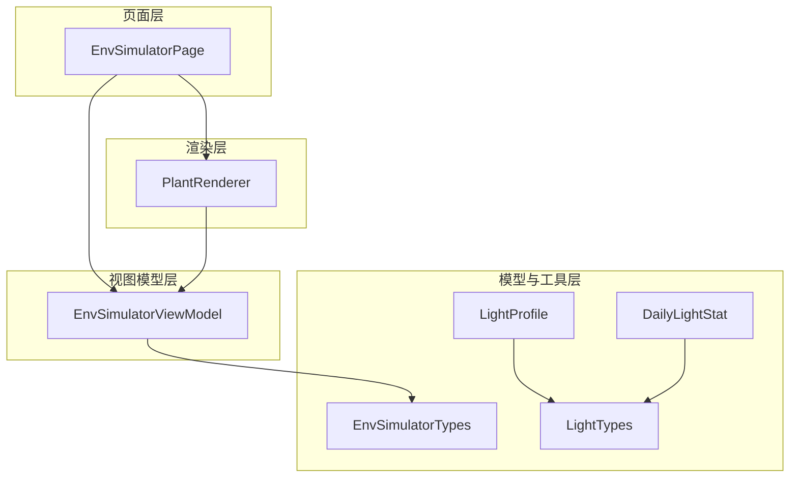
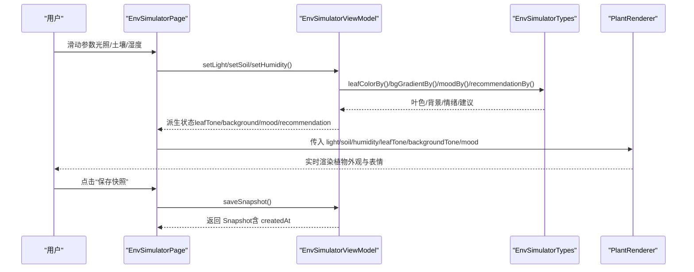
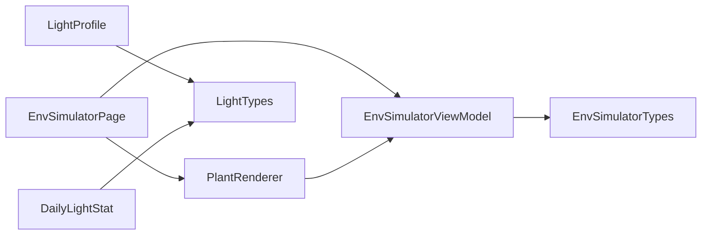
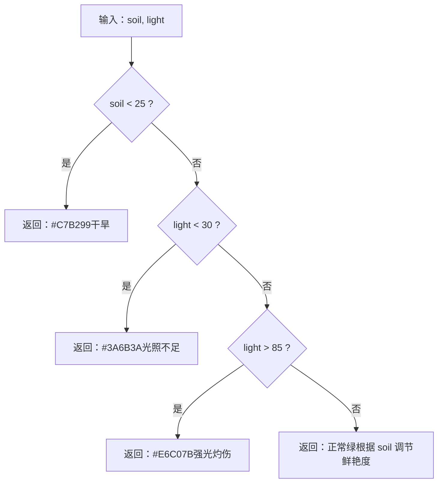
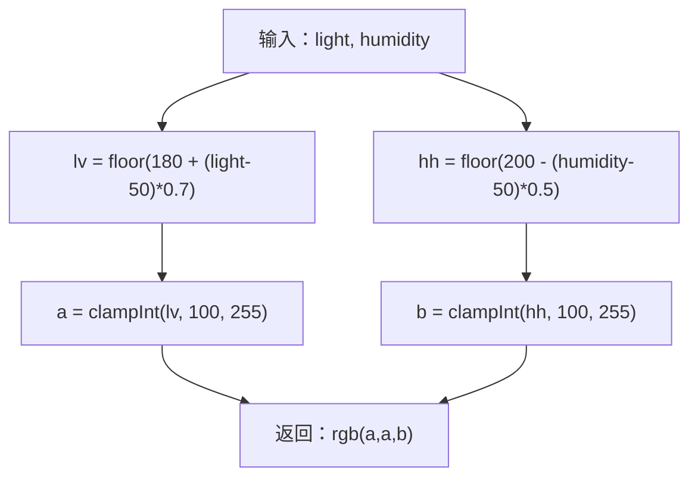
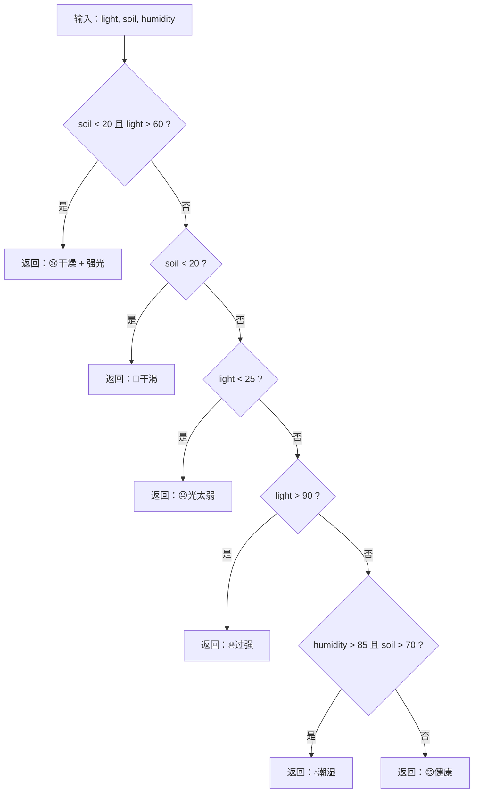

# 环境模拟API

<cite>
**本文引用的文件**
- [EnvSimulatorViewModel.ets](file://entry/src/main/ets/viewmodel/EnvSimulatorViewModel.ets)
- [EnvSimulatorTypes.ets](file://entry/src/main/ets/model/EnvSimulatorTypes.ets)
- [EnvSimulatorPage.ets](file://entry/src/main/ets/pages/EnvSimulatorPage.ets)
- [PlantRenderer.ets](file://entry/src/main/ets/component/PlantRenderer.ets)
- [LightProfile.ets](file://entry/src/main/ets/model/LightProfile.ets)
- [DailyLightStat.ets](file://entry/src/main/ets/model/DailyLightStat.ets)
- [LightTypes.ets](file://entry/src/main/ets/model/LightTypes.ets)
</cite>

## 目录
1. [简介](#简介)
2. [项目结构](#项目结构)
3. [核心组件](#核心组件)
4. [架构总览](#架构总览)
5. [详细组件分析](#详细组件分析)
6. [依赖关系分析](#依赖关系分析)
7. [性能考虑](#性能考虑)
8. [故障排查指南](#故障排查指南)
9. [结论](#结论)
10. [附录](#附录)

## 简介
本文件面向环境模拟业务逻辑，聚焦以下接口与规范：
- EnvSimulatorViewModel：环境模拟核心逻辑与状态管理，提供光照、土壤湿度、空气湿度三因子的设置、派生状态计算与快照导出。
- EnvSimulatorTypes：环境参数类型定义与派生状态计算函数（叶色、背景色调、情绪、建议）。
- PlantRenderer：基于模拟状态的可视化渲染组件。
- 相关光照模型：LightProfile、DailyLightStat、LightTypes，用于光照目标与状态评估。

本API文档涵盖环境条件模拟算法、植物需求预测（情绪与建议）、环境变化影响评估等核心方法，并提供温度、湿度、光照强度等环境因子的模拟接口与预测模型说明，以及实际调用示例与模拟精度优化指导。

## 项目结构
围绕环境模拟的相关文件组织如下：
- 页面层：EnvSimulatorPage 负责参数滑杆输入与状态展示。
- 视图模型层：EnvSimulatorViewModel 管理三因子与派生状态，提供快照导出。
- 模型与工具层：EnvSimulatorTypes 定义类型与派生函数；LightProfile/DailyLightStat/LightTypes 提供光照目标与状态评估。
- 渲染层：PlantRenderer 接收派生状态并渲染植物外观与表情。

图表来源
- [EnvSimulatorPage.ets:1-123](file://entry/src/main/ets/pages/EnvSimulatorPage.ets#L1-L123)
- [EnvSimulatorViewModel.ets:1-108](file://entry/src/main/ets/viewmodel/EnvSimulatorViewModel.ets#L1-L108)
- [EnvSimulatorTypes.ets:1-96](file://entry/src/main/ets/model/EnvSimulatorTypes.ets#L1-L96)
- [PlantRenderer.ets:1-169](file://entry/src/main/ets/component/PlantRenderer.ets#L1-L169)
- [LightProfile.ets:1-41](file://entry/src/main/ets/model/LightProfile.ets#L1-L41)
- [DailyLightStat.ets:1-30](file://entry/src/main/ets/model/DailyLightStat.ets#L1-L30)
- [LightTypes.ets:1-124](file://entry/src/main/ets/model/LightTypes.ets#L1-L124)

章节来源
- [EnvSimulatorPage.ets:1-123](file://entry/src/main/ets/pages/EnvSimulatorPage.ets#L1-L123)
- [EnvSimulatorViewModel.ets:1-108](file://entry/src/main/ets/viewmodel/EnvSimulatorViewModel.ets#L1-L108)
- [EnvSimulatorTypes.ets:1-96](file://entry/src/main/ets/model/EnvSimulatorTypes.ets#L1-L96)
- [PlantRenderer.ets:1-169](file://entry/src/main/ets/component/PlantRenderer.ets#L1-L169)
- [LightProfile.ets:1-41](file://entry/src/main/ets/model/LightProfile.ets#L1-L41)
- [DailyLightStat.ets:1-30](file://entry/src/main/ets/model/DailyLightStat.ets#L1-L30)
- [LightTypes.ets:1-124](file://entry/src/main/ets/model/LightTypes.ets#L1-L124)

## 核心组件
- EnvSimulatorViewModel
  - 负责三因子（光照、土壤湿度、空气湿度）的设置与约束、派生状态计算、快照导出与动画状态控制。
  - 关键方法与属性：setLight/setSoil/setHumidity/reset/saveSnapshot/snapshotToNote/isAnimating/lastSnapshot。
- EnvSimulatorTypes
  - 定义环境参数枚举与快照接口；提供派生状态函数：leafColorBy、bgGradientBy、moodBy、recommendationBy。
- PlantRenderer
  - 接收光照、土壤湿度、空气湿度、叶色、背景色调、情绪等参数，渲染植物外观与表情。
- 光照模型
  - LightProfile：植物光照目标配置（最低/最高达标值、过强阈值、偏好级别）。
  - DailyLightStat：每日光照统计（累计光照量、时长、达标率、状态）。
  - LightTypes：光照级别与状态枚举及常用工具函数。

章节来源
- [EnvSimulatorViewModel.ets:10-108](file://entry/src/main/ets/viewmodel/EnvSimulatorViewModel.ets#L10-L108)
- [EnvSimulatorTypes.ets:4-96](file://entry/src/main/ets/model/EnvSimulatorTypes.ets#L4-L96)
- [PlantRenderer.ets:7-169](file://entry/src/main/ets/component/PlantRenderer.ets#L7-L169)
- [LightProfile.ets:11-41](file://entry/src/main/ets/model/LightProfile.ets#L11-L41)
- [DailyLightStat.ets:11-30](file://entry/src/main/ets/model/DailyLightStat.ets#L11-L30)
- [LightTypes.ets:9-124](file://entry/src/main/ets/model/LightTypes.ets#L9-L124)

## 架构总览
环境模拟从页面输入到渲染输出的端到端流程如下：

图表来源
- [EnvSimulatorPage.ets:22-121](file://entry/src/main/ets/pages/EnvSimulatorPage.ets#L22-L121)
- [EnvSimulatorViewModel.ets:28-101](file://entry/src/main/ets/viewmodel/EnvSimulatorViewModel.ets#L28-L101)
- [EnvSimulatorTypes.ets:22-81](file://entry/src/main/ets/model/EnvSimulatorTypes.ets#L22-L81)
- [PlantRenderer.ets:23-101](file://entry/src/main/ets/component/PlantRenderer.ets#L23-L101)

## 详细组件分析

### EnvSimulatorViewModel（环境模拟视图模型）
职责与接口
- 参数设置：setLight(v)/setSoil(v)/setHumidity(v)，均约束在 0..100 区间。
- 状态复位：reset() 将三因子恢复至默认值。
- 派生状态：leafTone（叶色）、backgroundTone（背景）、mood（情绪）、recommendation（建议）。
- 快照导出：saveSnapshot() 返回 Snapshot；snapshotToNote() 序列化为便于记录的字符串。
- 动画控制：startAnim()/stopAnim() 控制 isAnimating，用于禁用交互。

关键实现要点
- 派生状态均为纯函数计算，不依赖数据库，保证可测试性与可移植性。
- 快照包含时间戳，便于后续日志或备注字段使用。

章节来源
- [EnvSimulatorViewModel.ets:10-108](file://entry/src/main/ets/viewmodel/EnvSimulatorViewModel.ets#L10-L108)

### EnvSimulatorTypes（环境参数类型与派生函数）
类型定义
- EnvParam：环境参数枚举（LIGHT/SOIL/HUMID）。
- Snapshot：快照接口，包含植物ID、三因子数值、派生状态与创建时间。

派生函数
- leafColorBy(light, soil)：根据光照与土壤湿度返回叶色（十六进制）。
- bgGradientBy(light, humidity)：根据光照与空气湿度返回背景色调（rgb）。
- moodBy(light, soil, humidity)：综合判断返回情绪（Emoji/短语）。
- recommendationBy(light, soil, humidity)：给出养护建议文本。

工具函数
- toHex(n)、clampInt(v, lo, hi)：颜色与数值处理工具。

章节来源
- [EnvSimulatorTypes.ets:4-96](file://entry/src/main/ets/model/EnvSimulatorTypes.ets#L4-L96)

### PlantRenderer（植物渲染组件）
职责与输入
- 输入参数：light、soil、humidity、leafTone、backgroundTone、mood、isAnimating、onTap。
- 渲染内容：背景层（太阳光晕/线性块）、植物主体（左右叶片椭圆渐变）、花盆与土壤表面、表情与数值提示。
- 动画控制：通过 isAnimating 控制渲染表现。

内部逻辑要点
- 叶片渐变：左右叶采用轻微明暗差异，增强立体感。
- 土壤表面颜色：随湿度升高而加深。
- 叶片缩放：土壤湿度越低，叶片越下垂，体现植物状态。

章节来源
- [PlantRenderer.ets:7-169](file://entry/src/main/ets/component/PlantRenderer.ets#L7-L169)

### 页面集成（EnvSimulatorPage）
职责与流程
- 生命周期：aboutToAppear() 根据 plantId 初始化 VM（无 plantId 时使用演示模式）。
- 用户交互：三个滑杆分别绑定 VM 的 setLight/setSoil/setHumidity，禁用动画期间的交互。
- 展示：顶部标题与说明、植物渲染区、参数滑杆区、模拟状态区（情绪+建议）、保存快照提示。

章节来源
- [EnvSimulatorPage.ets:7-123](file://entry/src/main/ets/pages/EnvSimulatorPage.ets#L7-L123)

### 光照模型（LightProfile、DailyLightStat、LightTypes）
- LightProfile：记录植物光照目标（达标下限/上限、过强阈值、偏好级别），支持默认配置工厂方法。
- DailyLightStat：记录每日光照统计（累计光照量、总时长、达标率、状态）。
- LightTypes：光照级别与状态枚举，以及中文标签、颜色、权重、日期格式化、比率钳制、ID生成等工具。

章节来源
- [LightProfile.ets:11-41](file://entry/src/main/ets/model/LightProfile.ets#L11-L41)
- [DailyLightStat.ets:11-30](file://entry/src/main/ets/model/DailyLightStat.ets#L11-L30)
- [LightTypes.ets:9-124](file://entry/src/main/ets/model/LightTypes.ets#L9-L124)

## 依赖关系分析
- EnvSimulatorPage 依赖 EnvSimulatorViewModel 与 PlantRenderer。
- EnvSimulatorViewModel 依赖 EnvSimulatorTypes 的派生函数。
- PlantRenderer 依赖 EnvSimulatorViewModel 的派生状态。
- 光照相关模型（LightProfile、DailyLightStat、LightTypes）相互独立，但共同服务于光照目标与状态评估。

图表来源
- [EnvSimulatorPage.ets:4-10](file://entry/src/main/ets/pages/EnvSimulatorPage.ets#L4-L10)
- [EnvSimulatorViewModel.ets:5-8](file://entry/src/main/ets/viewmodel/EnvSimulatorViewModel.ets#L5-L8)
- [PlantRenderer.ets:4-5](file://entry/src/main/ets/component/PlantRenderer.ets#L4-L5)
- [LightProfile.ets:5](file://entry/src/main/ets/model/LightProfile.ets#L5)
- [DailyLightStat.ets:5](file://entry/src/main/ets/model/DailyLightStat.ets#L5)
- [LightTypes.ets:5](file://entry/src/main/ets/model/LightTypes.ets#L5)

章节来源
- [EnvSimulatorPage.ets:4-10](file://entry/src/main/ets/pages/EnvSimulatorPage.ets#L4-L10)
- [EnvSimulatorViewModel.ets:5-8](file://entry/src/main/ets/viewmodel/EnvSimulatorViewModel.ets#L5-L8)
- [PlantRenderer.ets:4-5](file://entry/src/main/ets/component/PlantRenderer.ets#L4-L5)
- [LightProfile.ets:5](file://entry/src/main/ets/model/LightProfile.ets#L5)
- [DailyLightStat.ets:5](file://entry/src/main/ets/model/DailyLightStat.ets#L5)
- [LightTypes.ets:5](file://entry/src/main/ets/model/LightTypes.ets#L5)

## 性能考虑
- 纯计算与无副作用：EnvSimulatorViewModel 的派生状态均为纯函数，避免不必要的状态同步与重绘。
- 数值约束与取整：参数在设置时进行范围约束与取整，减少渲染层的额外处理成本。
- 动画期间交互禁用：isAnimating 开关可避免高频参数变更引发的抖动与重绘。
- 渲染优化：PlantRenderer 使用基础图形与固定渐变，避免外部资源加载与复杂布局计算。
- 快照序列化：snapshotToNote 使用 JSON 序列化，便于日志与备注字段存储，注意避免频繁调用以降低 GC 压力。

## 故障排查指南
常见问题与定位
- 参数越界：若传入值不在 0..100，将被自动约束到边界。检查调用方是否期望异常或需要额外校验。
- 情绪与建议不符预期：确认输入参数组合是否落入特定分支（如土壤过低、光照过强、湿度过高等），必要时调整阈值策略。
- 渲染异常：检查 leafTone/backgroundTone 是否为合法颜色字符串；确认 isAnimating 状态是否正确传递。
- 快照缺失：确认 saveSnapshot() 是否被调用；createdAt 是否为有效时间戳；note 字段是否按需序列化。

章节来源
- [EnvSimulatorViewModel.ets:28-45](file://entry/src/main/ets/viewmodel/EnvSimulatorViewModel.ets#L28-L45)
- [EnvSimulatorTypes.ets:22-81](file://entry/src/main/ets/model/EnvSimulatorTypes.ets#L22-L81)
- [PlantRenderer.ets:137-153](file://entry/src/main/ets/component/PlantRenderer.ets#L137-L153)

## 结论
本API以轻量、纯函数与组件解耦为核心设计原则，将环境模拟的计算逻辑集中在 EnvSimulatorViewModel 与 EnvSimulatorTypes 中，通过 PlantRenderer 实现直观的可视化反馈。结合光照模型（LightProfile、DailyLightStat、LightTypes），可进一步扩展光照目标与状态评估能力。建议在实际应用中：
- 明确阈值与权重策略，确保情绪与建议符合植物实际需求。
- 在高频交互场景下启用 isAnimating 以提升用户体验。
- 对快照导出与日志记录进行统一规范，便于后续追踪与分析。

## 附录

### API清单与调用示例

- 设置环境因子
  - setLight(v: number): void
  - setSoil(v: number): void
  - setHumidity(v: number): void
  - 示例路径：[EnvSimulatorPage.ets:62-95](file://entry/src/main/ets/pages/EnvSimulatorPage.ets#L62-L95)

- 复位与导出
  - reset(): void
  - saveSnapshot(): Snapshot
  - snapshotToNote(snapshot: Snapshot): string
  - 示例路径：[EnvSimulatorPage.ets:32-40](file://entry/src/main/ets/pages/EnvSimulatorPage.ets#L32-L40)

- 派生状态
  - leafTone: string
  - backgroundTone: string
  - mood: string
  - recommendation: string
  - 示例路径：[EnvSimulatorPage.ets:44-53](file://entry/src/main/ets/pages/EnvSimulatorPage.ets#L44-L53)

- 类型与工具
  - EnvParam: 枚举（LIGHT/SOIL/HUMID）
  - Snapshot: 接口（包含 plantId、三因子、派生状态、createdAt）
  - leafColorBy(light, soil): string
  - bgGradientBy(light, humidity): string
  - moodBy(light, soil, humidity): string
  - recommendationBy(light, soil, humidity): string
  - 示例路径：[EnvSimulatorTypes.ets:4-96](file://entry/src/main/ets/model/EnvSimulatorTypes.ets#L4-L96)

- 光照模型
  - LightProfile：targetLuxMinLow/targetLuxMinHigh/highLuxThreshold/preferredLevel/updatedAt
  - DailyLightStat：luxMinutes/durationMin/maxLux/rate/status
  - LightTypes：LightLevel/LightStatus、label/color/weight/date工具、clampRate/genId
  - 示例路径：[LightProfile.ets:11-41](file://entry/src/main/ets/model/LightProfile.ets#L11-L41), [DailyLightStat.ets:11-30](file://entry/src/main/ets/model/DailyLightStat.ets#L11-L30), [LightTypes.ets:9-124](file://entry/src/main/ets/model/LightTypes.ets#L9-L124)

### 环境因子模拟算法与预测模型

- 叶色模拟（leafColorBy）
  - 依据土壤湿度与光照强度判断：干旱、光照不足、强光灼伤、正常绿等状态，返回对应十六进制颜色。
  - 算法流程

图表来源
- [EnvSimulatorTypes.ets:23-43](file://entry/src/main/ets/model/EnvSimulatorTypes.ets#L23-L43)

- 背景色调（bgGradientBy）
  - 依据光照与空气湿度生成 rgb 背景色，用于界面氛围表达。
  - 算法流程

图表来源
- [EnvSimulatorTypes.ets:45-53](file://entry/src/main/ets/model/EnvSimulatorTypes.ets#L45-L53)

- 情绪与建议（moodBy/recommendationBy）
  - 综合光照、土壤湿度、空气湿度判断情绪与建议，覆盖干渴、光照不足、强光、过湿等典型状态。
  - 算法流程

图表来源
- [EnvSimulatorTypes.ets:55-81](file://entry/src/main/ets/model/EnvSimulatorTypes.ets#L55-L81)

### 实际调用示例（步骤说明）
- 初始化页面与视图模型
  - 在页面生命周期中根据 plantId 创建 VM；若无 plantId，则使用演示模式。
  - 示例路径：[EnvSimulatorPage.ets:13-20](file://entry/src/main/ets/pages/EnvSimulatorPage.ets#L13-L20)

- 参数调整与状态更新
  - 三个滑杆 onChange 中分别调用 setLight/setSoil/setHumidity，并在动画期间禁用交互。
  - 示例路径：[EnvSimulatorPage.ets:62-95](file://entry/src/main/ets/pages/EnvSimulatorPage.ets#L62-L95)

- 保存快照与记录
  - 点击“保存快照”后调用 saveSnapshot()，并将 createdAt 转换为本地时间显示。
  - 示例路径：[EnvSimulatorPage.ets:35-40](file://entry/src/main/ets/pages/EnvSimulatorPage.ets#L35-L40)

- 导出为备注字段
  - 使用 snapshotToNote() 将快照序列化为字符串，便于写入日志或备注字段。
  - 示例路径：[EnvSimulatorViewModel.ets:91-100](file://entry/src/main/ets/viewmodel/EnvSimulatorViewModel.ets#L91-L100)

### 模拟精度优化指导
- 阈值微调：针对不同植物品类，建议在 leafColorBy、moodBy/recommendationBy 中引入可配置阈值，以提升预测准确性。
- 权重融合：在情绪与建议中引入加权评分，综合光照、土壤、湿度对植物状态的影响程度。
- 动画与交互：在高频参数变更时启用 isAnimating，避免过度重绘与交互冲突。
- 可视化一致性：确保 leafTone 与 backgroundTone 与 PlantRenderer 的颜色处理一致，避免视觉偏差。
- 日志与追踪：对快照中的 createdAt 与 note 字段进行规范化，便于后续统计与回溯。