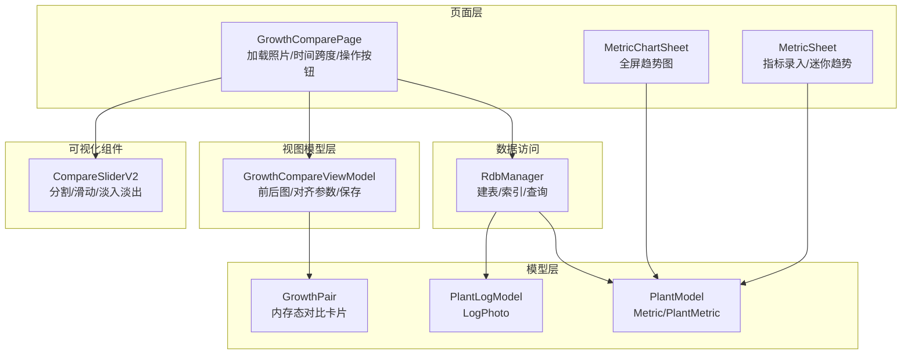
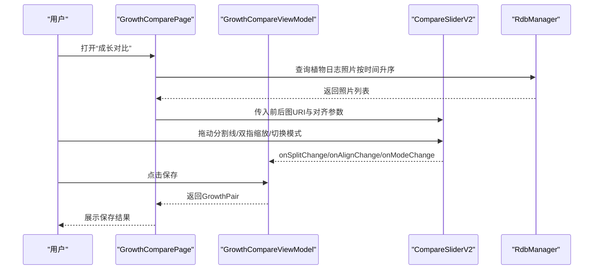
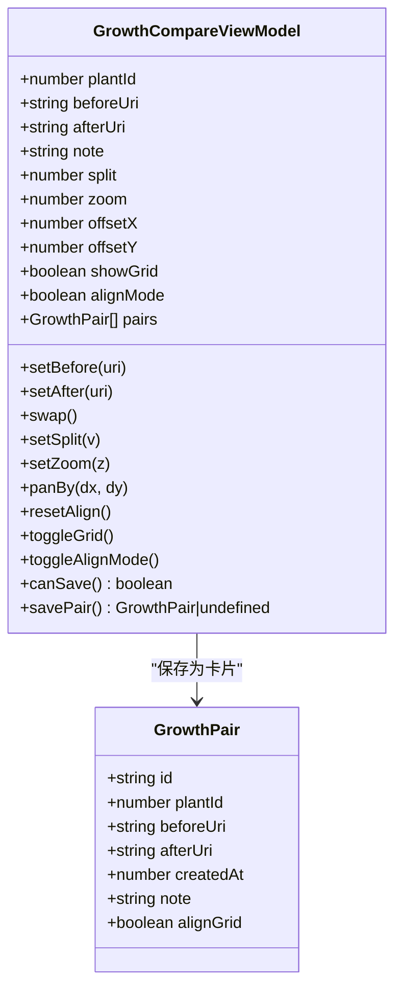
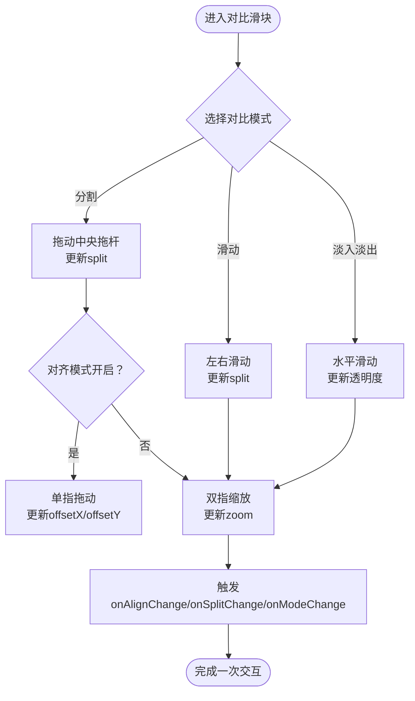
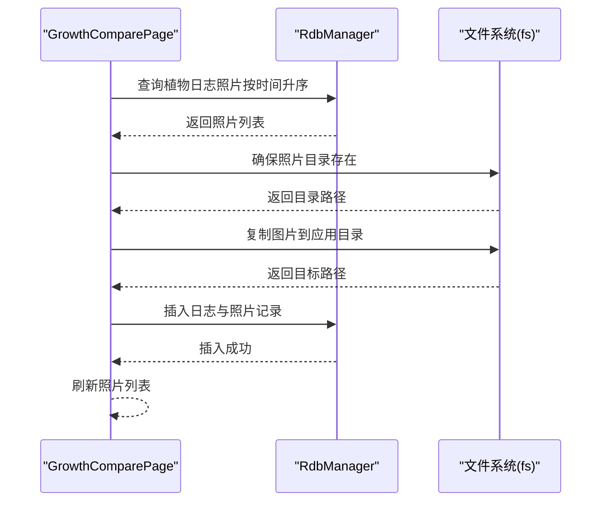
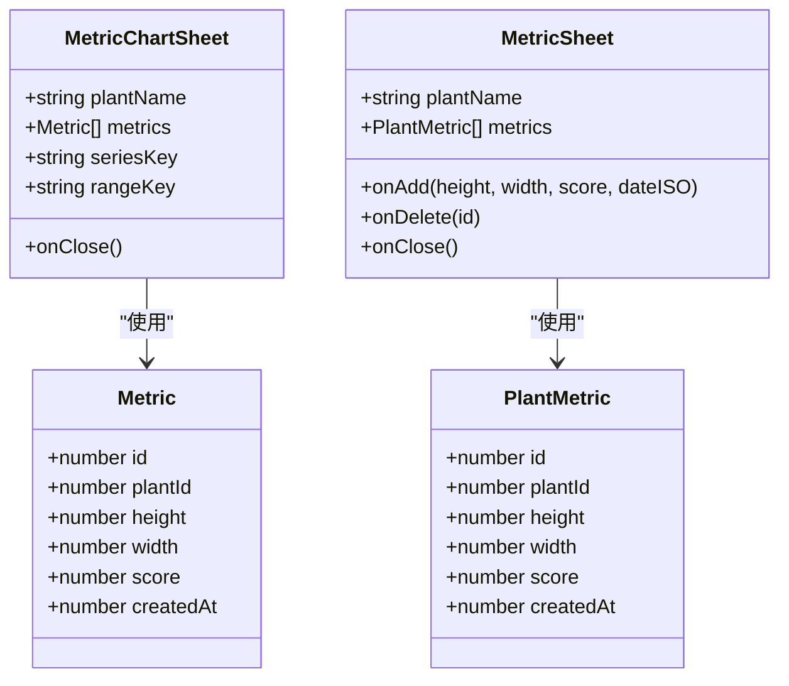
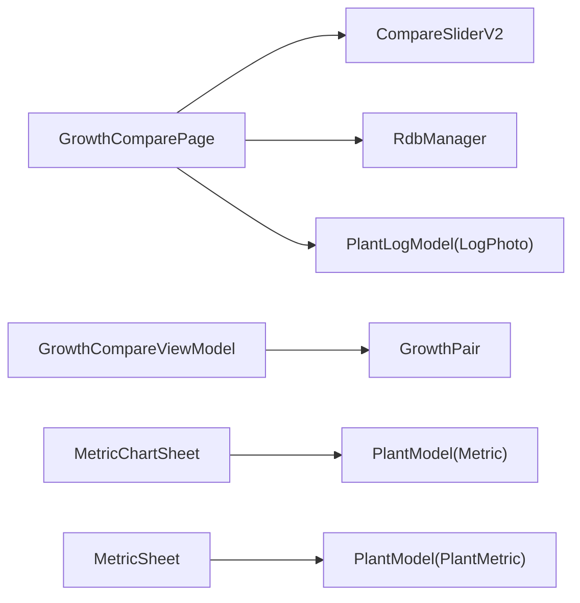

# 生长比较API

<cite>
**本文引用的文件**
- [GrowthCompareViewModel.ets](file://entry/src/main/ets/viewmodel/GrowthCompareViewModel.ets)
- [GrowthComparePage.ets](file://entry/src/main/ets/pages/GrowthComparePage.ets)
- [CompareSliderV2.ets](file://entry/src/main/ets/pages/CompareSliderV2.ets)
- [GrowthPair.ets](file://entry/src/main/ets/model/GrowthPair.ets)
- [PlantModel.ets](file://entry/src/main/ets/model/PlantModel.ets)
- [PlantLogModel.ets](file://entry/src/main/ets/model/PlantLogModel.ets)
- [MetricChartSheet.ets](file://entry/src/main/ets/view/MetricChartSheet.ets)
- [MetricSheet.ets](file://entry/src/main/ets/view/MetricSheet.ets)
- [RdbManager.ets](file://entry/src/main/ets/viewmodel/RdbManager.ets)
</cite>

## 目录
1. [简介](#简介)
2. [项目结构](#项目结构)
3. [核心组件](#核心组件)
4. [架构总览](#架构总览)
5. [详细组件分析](#详细组件分析)
6. [依赖分析](#依赖分析)
7. [性能考虑](#性能考虑)
8. [故障排查指南](#故障排查指南)
9. [结论](#结论)
10. [附录](#附录)

## 简介
本文件面向“生长比较”业务场景，聚焦于植物间生长指标对比分析与可视化展示的API说明。围绕身高、冠幅、健康评分等多维指标，提供时间范围选择、对比结果展示、生长趋势分析、差异显著性检验以及对比图表生成的完整接口规范与调用示例。

本项目采用ArkTS框架，数据模型与视图组件清晰分离：页面负责时间序列照片浏览与对比卡片管理；视图模型负责对齐参数与保存流程；图表组件负责趋势可视化；数据库管理负责指标与日志数据持久化。

## 项目结构
- 页面层
  - 生长比较页：负责加载植物日志照片，提供滑动浏览与时间跨度提示，并承载对比滑块组件。
  - 指标抽屉与趋势图：负责指标录入、排序、迷你趋势与全屏折线图。
- 视图模型层
  - 生长比较视图模型：管理前后图选择、对齐参数、网格与模式切换、保存对比卡片。
- 模型层
  - 生长对（GrowthPair）：内存态的前后对比实体。
  - 植物与指标模型：身高、冠幅、健康分等指标数据结构。
  - 日志与照片模型：支撑“同一植物时间序列”的照片集合。
- 可视化组件
  - 对比滑块组件：提供分割、滑动、淡入淡出三种对比模式，支持手势交互与网格叠加。
  - 指标趋势图：基于第三方图表库渲染多指标折线图，支持时间范围筛选。

**图表来源**
- [GrowthComparePage.ets](file://entry/src/main/ets/pages/GrowthComparePage.ets)
- [GrowthCompareViewModel.ets](file://entry/src/main/ets/viewmodel/GrowthCompareViewModel.ets)
- [CompareSliderV2.ets](file://entry/src/main/ets/pages/CompareSliderV2.ets)
- [GrowthPair.ets](file://entry/src/main/ets/model/GrowthPair.ets)
- [PlantModel.ets](file://entry/src/main/ets/model/PlantModel.ets)
- [PlantLogModel.ets](file://entry/src/main/ets/model/PlantLogModel.ets)
- [MetricChartSheet.ets](file://entry/src/main/ets/view/MetricChartSheet.ets)
- [MetricSheet.ets](file://entry/src/main/ets/view/MetricSheet.ets)
- [RdbManager.ets](file://entry/src/main/ets/viewmodel/RdbManager.ets)

**章节来源**
- [GrowthComparePage.ets](file://entry/src/main/ets/pages/GrowthComparePage.ets)
- [GrowthCompareViewModel.ets](file://entry/src/main/ets/viewmodel/GrowthCompareViewModel.ets)
- [CompareSliderV2.ets](file://entry/src/main/ets/pages/CompareSliderV2.ets)
- [GrowthPair.ets](file://entry/src/main/ets/model/GrowthPair.ets)
- [PlantModel.ets](file://entry/src/main/ets/model/PlantModel.ets)
- [PlantLogModel.ets](file://entry/src/main/ets/model/PlantLogModel.ets)
- [MetricChartSheet.ets](file://entry/src/main/ets/view/MetricChartSheet.ets)
- [MetricSheet.ets](file://entry/src/main/ets/view/MetricSheet.ets)
- [RdbManager.ets](file://entry/src/main/ets/viewmodel/RdbManager.ets)

## 核心组件
- 生长比较视图模型（GrowthCompareViewModel）
  - 负责前后图选择、对齐参数（分割比例、缩放、偏移）、网格与对齐模式开关、保存对比卡片。
  - 提供交换前后图、设置分割比例、设置缩放、平移、重置对齐、切换网格与对齐模式、判断可保存、保存为对比卡片等接口。
- 对比滑块组件（CompareSliderV2）
  - 支持分割、滑动、淡入淡出三种模式；提供手势交互（拖动分割线、双指缩放、对齐模式下的平移）与网格叠加。
  - 暴露分割比例变化、对齐参数变化、模式切换等事件回调。
- 生长对（GrowthPair）
  - 内存态的前后对比实体，包含植物ID、前后图URI、创建时间、备注、对齐网格开关等。
- 指标模型（Metric/PlantMetric）
  - 身高（cm）、冠幅（cm）、健康分（0~100）、时间戳等字段，支撑趋势分析与对比图表。
- 日志与照片模型（LogPhoto）
  - 支撑“同一植物时间序列”的照片集合，用于生长比较页的滑动浏览与时间跨度展示。
- 指标趋势图（MetricChartSheet）
  - 基于第三方图表库渲染多指标折线图，支持时间范围筛选（近30天/近90天/全部）。
- 指标抽屉（MetricSheet）
  - 支持快速录入身高、冠幅、健康分，提供迷你趋势与历史记录列表，支持排序与删除。

**章节来源**
- [GrowthCompareViewModel.ets](file://entry/src/main/ets/viewmodel/GrowthCompareViewModel.ets)
- [CompareSliderV2.ets](file://entry/src/main/ets/pages/CompareSliderV2.ets)
- [GrowthPair.ets](file://entry/src/main/ets/model/GrowthPair.ets)
- [PlantModel.ets](file://entry/src/main/ets/model/PlantModel.ets)
- [PlantLogModel.ets](file://entry/src/main/ets/model/PlantLogModel.ets)
- [MetricChartSheet.ets](file://entry/src/main/ets/view/MetricChartSheet.ets)
- [MetricSheet.ets](file://entry/src/main/ets/view/MetricSheet.ets)

## 架构总览
生长比较业务遵循“页面-视图模型-组件-模型-数据访问”的分层设计：
- 页面（GrowthComparePage）负责组织UI与数据加载，调用数据库管理器查询日志照片，驱动对比滑块组件展示。
- 视图模型（GrowthCompareViewModel）管理对齐参数与保存流程，输出对比卡片（GrowthPair）。
- 组件（CompareSliderV2）提供多种对比模式与手势交互，向上游传递参数变化事件。
- 模型（Metric/PlantMetric、LogPhoto）承载指标与照片数据，支撑趋势分析与可视化。
- 数据访问（RdbManager）负责建表、索引与查询，确保指标与日志数据的高效检索。

**图表来源**
- [GrowthComparePage.ets](file://entry/src/main/ets/pages/GrowthComparePage.ets)
- [GrowthCompareViewModel.ets](file://entry/src/main/ets/viewmodel/GrowthCompareViewModel.ets)
- [CompareSliderV2.ets](file://entry/src/main/ets/pages/CompareSliderV2.ets)
- [RdbManager.ets](file://entry/src/main/ets/viewmodel/RdbManager.ets)

## 详细组件分析

### 生长比较视图模型（GrowthCompareViewModel）
- 责任边界
  - 管理当前工作区（前后图URI、备注）与对齐参数（分割比例、缩放、偏移、网格、对齐模式）。
  - 维护已保存的对比卡片数组，提供保存与交换前后图能力。
- 关键接口
  - setBefore(uri: string): 设置前图URI
  - setAfter(uri: string): 设置后图URI
  - swap(): 交换前后图
  - setSplit(v: number): 设置分割比例（0.02..0.98）
  - setZoom(z: number): 设置缩放（0.5..4.0）
  - panBy(dx: number, dy: number): 在限定范围内平移
  - resetAlign(): 重置对齐参数
  - toggleGrid(): 切换网格
  - toggleAlignMode(): 切换对齐模式
  - canSave(): 判断是否可保存
  - savePair(): 保存为GrowthPair并加入卡片数组
- 设计要点
  - 使用可观察对象追踪状态变更，确保UI响应式更新。
  - 对外暴露最小化接口，内部封装参数范围限制与默认值。

**图表来源**
- [GrowthCompareViewModel.ets](file://entry/src/main/ets/viewmodel/GrowthCompareViewModel.ets)
- [GrowthPair.ets](file://entry/src/main/ets/model/GrowthPair.ets)

**章节来源**
- [GrowthCompareViewModel.ets](file://entry/src/main/ets/viewmodel/GrowthCompareViewModel.ets)
- [GrowthPair.ets](file://entry/src/main/ets/model/GrowthPair.ets)

### 对比滑块组件（CompareSliderV2）
- 功能特性
  - 三种对比模式：分割（中央拖杆）、滑动（左右滑动）、淡入淡出（透明度渐变）。
  - 手势交互：拖动分割线、双指缩放、对齐模式下的单指平移。
  - 网格叠加：可选显示九宫格辅助对齐。
- 关键参数与事件
  - 参数：beforeUri、afterUri、split、zoom、offsetX、offsetY、showGrid、alignMode、compareMode
  - 事件：onSplitChange(v)、onAlignChange(zoom, offsetX, offsetY)、onModeChange(mode)
- 交互流程
  - 分割模式：拖动中央拖杆更新split；对齐模式下拖动平移offsetX/offsetY；双指缩放更新zoom。
  - 滑动/淡入淡出模式：通过手势更新split或透明度，同时联动缩放与平移。

**图表来源**
- [CompareSliderV2.ets](file://entry/src/main/ets/pages/CompareSliderV2.ets)

**章节来源**
- [CompareSliderV2.ets](file://entry/src/main/ets/pages/CompareSliderV2.ets)

### 生长比较页（GrowthComparePage）
- 职责
  - 加载植物日志照片（按时间升序），提供主滑块浏览、全部照片网格、时间跨度提示。
  - 支持添加照片：自动创建占位日志并插入照片，刷新照片列表。
- 关键流程
  - 加载：通过RdbManager查询日志照片并组装LogPhoto列表。
  - 添加：选择图片→复制至应用目录→插入日志与照片→刷新UI。
  - 导航：从植物详情页传入Plant对象，作为照片筛选条件。

**图表来源**
- [GrowthComparePage.ets](file://entry/src/main/ets/pages/GrowthComparePage.ets)
- [RdbManager.ets](file://entry/src/main/ets/viewmodel/RdbManager.ets)

**章节来源**
- [GrowthComparePage.ets](file://entry/src/main/ets/pages/GrowthComparePage.ets)
- [RdbManager.ets](file://entry/src/main/ets/viewmodel/RdbManager.ets)

### 指标趋势分析与可视化（MetricChartSheet / MetricSheet）
- 指标模型
  - Metric/PlantMetric：身高、冠幅、健康分、时间戳。
- 指标趋势图（MetricChartSheet）
  - 输入：植物名、指标数组。
  - 输出：全屏折线图，支持时间范围筛选（近30天/近90天/全部）。
- 指标抽屉（MetricSheet）
  - 支持快速录入身高、冠幅、健康分，提供迷你趋势与历史记录列表，支持排序与删除。

**图表来源**
- [PlantModel.ets](file://entry/src/main/ets/model/PlantModel.ets)
- [MetricChartSheet.ets](file://entry/src/main/ets/view/MetricChartSheet.ets)
- [MetricSheet.ets](file://entry/src/main/ets/view/MetricSheet.ets)

**章节来源**
- [PlantModel.ets](file://entry/src/main/ets/model/PlantModel.ets)
- [MetricChartSheet.ets](file://entry/src/main/ets/view/MetricChartSheet.ets)
- [MetricSheet.ets](file://entry/src/main/ets/view/MetricSheet.ets)

## 依赖分析
- 组件耦合
  - GrowthComparePage依赖RdbManager进行照片查询与插入；依赖CompareSliderV2进行对比展示。
  - GrowthCompareViewModel依赖GrowthPair进行卡片保存；对外暴露简化的状态与事件接口。
  - 指标组件（MetricChartSheet/MetricSheet）依赖PlantModel中的指标模型。
- 外部依赖
  - 图表库：用于趋势图渲染。
  - 文件系统：用于图片复制与存储。
  - 关系型数据库：用于日志与指标持久化。

**图表来源**
- [GrowthComparePage.ets](file://entry/src/main/ets/pages/GrowthComparePage.ets)
- [GrowthCompareViewModel.ets](file://entry/src/main/ets/viewmodel/GrowthCompareViewModel.ets)
- [CompareSliderV2.ets](file://entry/src/main/ets/pages/CompareSliderV2.ets)
- [GrowthPair.ets](file://entry/src/main/ets/model/GrowthPair.ets)
- [PlantModel.ets](file://entry/src/main/ets/model/PlantModel.ets)
- [PlantLogModel.ets](file://entry/src/main/ets/model/PlantLogModel.ets)
- [MetricChartSheet.ets](file://entry/src/main/ets/view/MetricChartSheet.ets)
- [MetricSheet.ets](file://entry/src/main/ets/view/MetricSheet.ets)
- [RdbManager.ets](file://entry/src/main/ets/viewmodel/RdbManager.ets)

**章节来源**
- [GrowthComparePage.ets](file://entry/src/main/ets/pages/GrowthComparePage.ets)
- [GrowthCompareViewModel.ets](file://entry/src/main/ets/viewmodel/GrowthCompareViewModel.ets)
- [CompareSliderV2.ets](file://entry/src/main/ets/pages/CompareSliderV2.ets)
- [GrowthPair.ets](file://entry/src/main/ets/model/GrowthPair.ets)
- [PlantModel.ets](file://entry/src/main/ets/model/PlantModel.ets)
- [PlantLogModel.ets](file://entry/src/main/ets/model/PlantLogModel.ets)
- [MetricChartSheet.ets](file://entry/src/main/ets/view/MetricChartSheet.ets)
- [MetricSheet.ets](file://entry/src/main/ets/view/MetricSheet.ets)
- [RdbManager.ets](file://entry/src/main/ets/viewmodel/RdbManager.ets)

## 性能考虑
- 图片加载与缓存
  - 对比滑块组件对图片进行裁剪与缩放，建议在页面层控制图片尺寸与格式，减少渲染压力。
- 手势交互
  - 对齐模式下的平移与缩放应限制范围，避免过度偏移导致回退困难。
- 数据查询
  - 指标与日志查询使用组合索引（plantId, createdAt），确保时间序列数据的高效检索。
- 图表渲染
  - 指标趋势图支持区域缩放与图例切换，建议在大数据量时启用数据采样或分页加载。

## 故障排查指南
- 照片无法加载
  - 检查数据库连接与表结构初始化是否完成；确认植物ID正确传入查询条件。
- 对齐参数异常
  - 确认分割比例与缩放在允许范围内；检查对齐模式是否启用。
- 保存失败
  - 确认前后图URI均非空；检查保存逻辑是否被调用。
- 图表显示异常
  - 检查指标数组是否为空；确认时间戳格式与排序是否正确。

**章节来源**
- [GrowthComparePage.ets](file://entry/src/main/ets/pages/GrowthComparePage.ets)
- [GrowthCompareViewModel.ets](file://entry/src/main/ets/viewmodel/GrowthCompareViewModel.ets)
- [RdbManager.ets](file://entry/src/main/ets/viewmodel/RdbManager.ets)

## 结论
本文档梳理了生长比较业务的端到端API与组件职责，明确了前后图对比、对齐参数、保存卡片、时间序列照片浏览与指标趋势可视化的接口规范。通过分层设计与清晰的组件边界，系统具备良好的扩展性与可维护性。建议在实际集成时，优先完善差异显著性检验与统计分析模块，以进一步提升对比分析的科学性与可解释性。

## 附录

### API清单与调用示例

- 生长比较视图模型（GrowthCompareViewModel）
  - setBefore(uri: string): 设置前图URI
  - setAfter(uri: string): 设置后图URI
  - swap(): 交换前后图
  - setSplit(v: number): 设置分割比例（0.02..0.98）
  - setZoom(z: number): 设置缩放（0.5..4.0）
  - panBy(dx: number, dy: number): 平移（限定范围）
  - resetAlign(): 重置对齐参数
  - toggleGrid(): 切换网格
  - toggleAlignMode(): 切换对齐模式
  - canSave(): 判断是否可保存
  - savePair(): 保存为GrowthPair并加入卡片数组

- 对比滑块组件（CompareSliderV2）
  - 参数：beforeUri、afterUri、split、zoom、offsetX、offsetY、showGrid、alignMode、compareMode
  - 事件：onSplitChange(v)、onAlignChange(zoom, offsetX, offsetY)、onModeChange(mode)

- 生长对（GrowthPair）
  - 字段：id、plantId、beforeUri、afterUri、createdAt、note、alignGrid

- 指标模型（Metric/PlantMetric）
  - 字段：id、plantId、height、width、score、createdAt

- 日志与照片模型（LogPhoto）
  - 字段：id、logId、path、thumbPath、createdAt

- 指标趋势图（MetricChartSheet）
  - 输入：plantName、metrics
  - 选项：seriesKey（height/width/score）、rangeKey（30/90/all）

- 指标抽屉（MetricSheet）
  - 事件：onAdd(height, width, score, dateISO)、onDelete(id)、onClose()

- 数据访问（RdbManager）
  - 初始化：建表与索引
  - 查询：按plantId+createdAt排序的日志照片

**章节来源**
- [GrowthCompareViewModel.ets](file://entry/src/main/ets/viewmodel/GrowthCompareViewModel.ets)
- [CompareSliderV2.ets](file://entry/src/main/ets/pages/CompareSliderV2.ets)
- [GrowthPair.ets](file://entry/src/main/ets/model/GrowthPair.ets)
- [PlantModel.ets](file://entry/src/main/ets/model/PlantModel.ets)
- [PlantLogModel.ets](file://entry/src/main/ets/model/PlantLogModel.ets)
- [MetricChartSheet.ets](file://entry/src/main/ets/view/MetricChartSheet.ets)
- [MetricSheet.ets](file://entry/src/main/ets/view/MetricSheet.ets)
- [RdbManager.ets](file://entry/src/main/ets/viewmodel/RdbManager.ets)