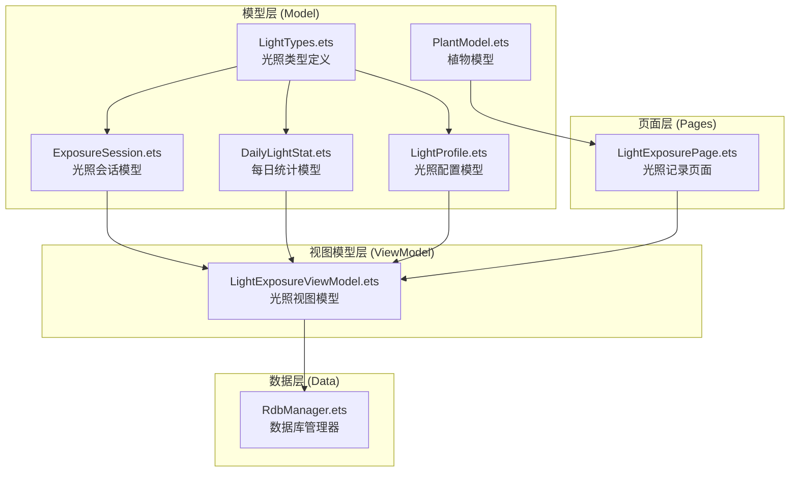
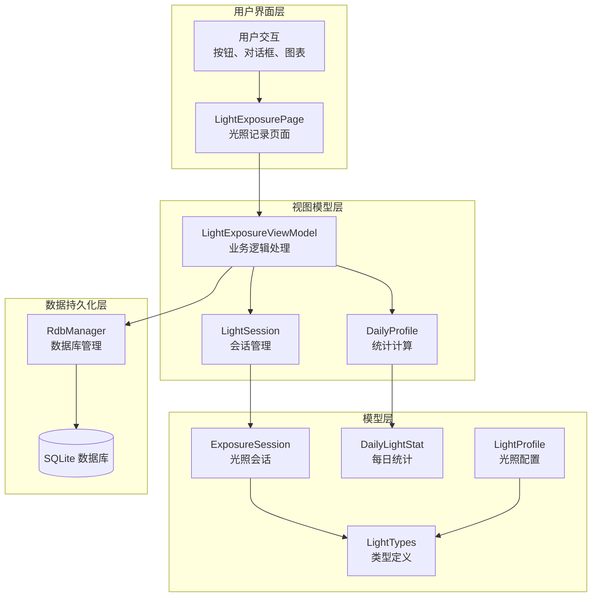
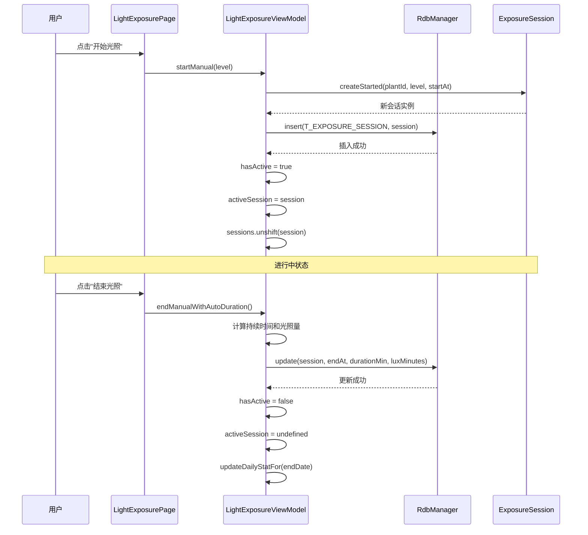
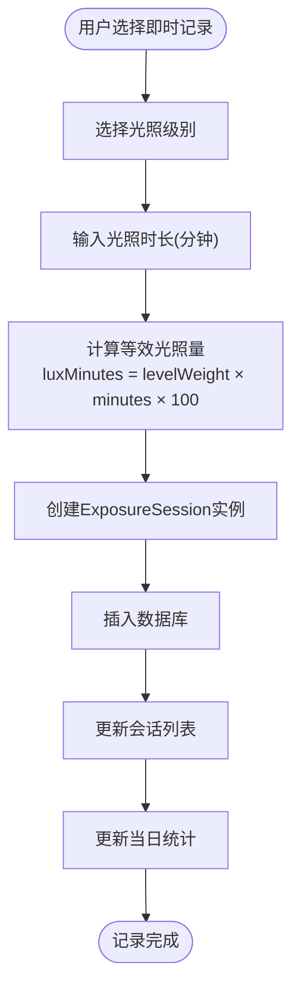
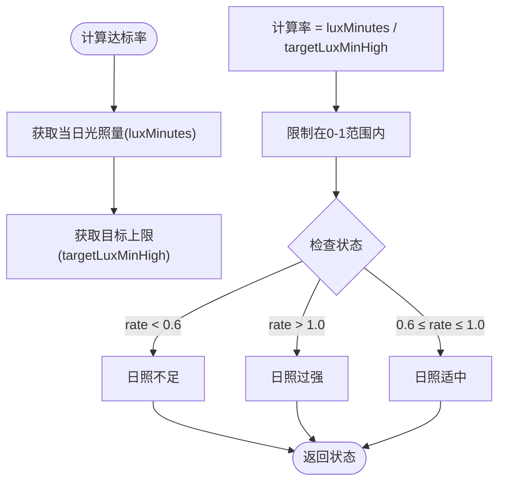
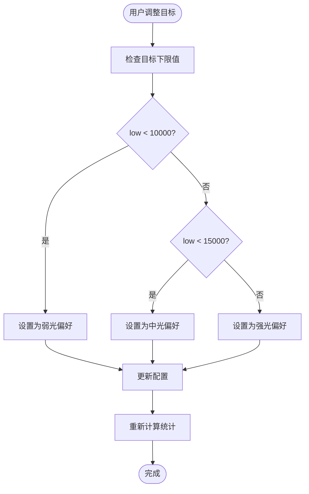
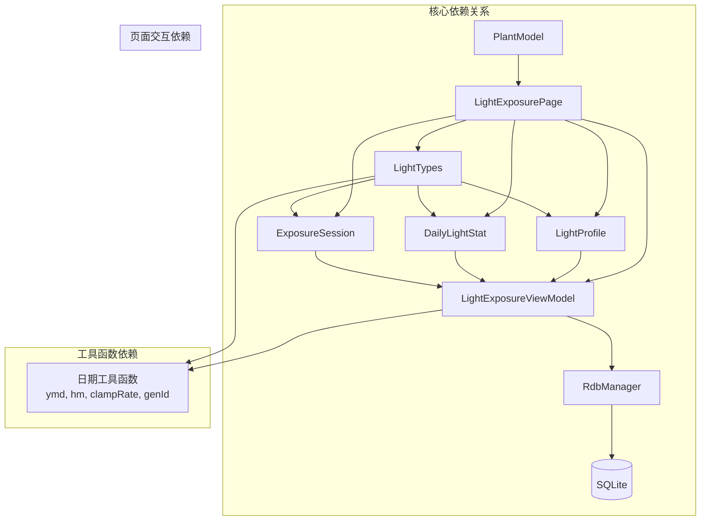

# 光照模型API

<cite>
**本文档引用的文件**
- [LightTypes.ets](file://entry/src/main/ets/model/LightTypes.ets)
- [ExposureSession.ets](file://entry/src/main/ets/model/ExposureSession.ets)
- [DailyLightStat.ets](file://entry/src/main/ets/model/DailyLightStat.ets)
- [LightProfile.ets](file://entry/src/main/ets/model/LightProfile.ets)
- [LightExposurePage.ets](file://entry/src/main/ets/pages/LightExposurePage.ets)
- [LightExposureViewModel.ets](file://entry/src/main/ets/viewmodel/LightExposureViewModel.ets)
- [RdbManager.ets](file://entry/src/main/ets/viewmodel/RdbManager.ets)
- [PlantModel.ets](file://entry/src/main/ets/model/PlantModel.ets)
</cite>

## 目录
1. [简介](#简介)
2. [项目结构](#项目结构)
3. [核心组件](#核心组件)
4. [架构概览](#架构概览)
5. [详细组件分析](#详细组件分析)
6. [依赖关系分析](#依赖关系分析)
7. [性能考量](#性能考量)
8. [故障排除指南](#故障排除指南)
9. [结论](#结论)

## 简介

植物日记项目的光照监控系统提供了完整的光照数据模型和API接口，用于记录、管理和分析植物的光照暴露情况。该系统包含四个核心数据模型：光照类型枚举、光照会话类、每日光照统计类和光照配置类，以及相应的页面和视图模型来处理用户交互和数据持久化。

光照监控系统支持两种主要的记录模式：
- **开始/结束模式**：用户点击开始和结束按钮来记录完整的光照过程
- **即时记录模式**：用户直接输入时长来补录历史光照记录

系统还提供了实时的光照进度跟踪、7天光照趋势图表和智能的光照偏好设置功能。

## 项目结构

光照相关代码主要分布在以下目录结构中：

**图表来源**
- [LightTypes.ets:1-124](file://entry/src/main/ets/model/LightTypes.ets#L1-L124)
- [ExposureSession.ets:1-84](file://entry/src/main/ets/model/ExposureSession.ets#L1-L84)
- [DailyLightStat.ets:1-30](file://entry/src/main/ets/model/DailyLightStat.ets#L1-L30)
- [LightProfile.ets:1-41](file://entry/src/main/ets/model/LightProfile.ets#L1-L41)
- [LightExposurePage.ets:1-806](file://entry/src/main/ets/pages/LightExposurePage.ets#L1-L806)
- [LightExposureViewModel.ets:1-554](file://entry/src/main/ets/viewmodel/LightExposureViewModel.ets#L1-L554)
- [RdbManager.ets:1-296](file://entry/src/main/ets/viewmodel/RdbManager.ets#L1-L296)

**章节来源**
- [LightTypes.ets:1-124](file://entry/src/main/ets/model/LightTypes.ets#L1-L124)
- [ExposureSession.ets:1-84](file://entry/src/main/ets/model/ExposureSession.ets#L1-L84)
- [DailyLightStat.ets:1-30](file://entry/src/main/ets/model/DailyLightStat.ets#L1-L30)
- [LightProfile.ets:1-41](file://entry/src/main/ets/model/LightProfile.ets#L1-L41)

## 核心组件

### 光照类型枚举 (LightTypes)

光照类型系统包含三个核心枚举和相关的工具函数：

#### 光照级别枚举 (LightLevel)
- **LOW (0)**：弱光 - 适合耐阴植物
- **MID (1)**：中光 - 适合大多数室内植物  
- **HIGH (2)**：强光 - 适合喜阳植物

#### 光照状态枚举 (LightStatus)
- **INSUFF (0)**：日照不足 - 光照时间未达到目标下限
- **OK (1)**：日照适中 - 光照时间在目标范围内
- **STRONG (2)**：日照过强 - 光照时间超过目标上限

#### 工具函数
- `lightLevelLabel(level: LightLevel)`: 将光照级别转换为中文标签
- `statusLabel(status: LightStatus)`: 将光照状态转换为中文标签
- `statusColor(status: LightStatus)`: 获取光照状态对应的颜色值
- `levelWeight(level: LightLevel)`: 获取光照级别的权重系数
- `ymd(date: Date)`: 将日期转换为 YYYY-MM-DD 格式
- `hm(date: Date)`: 将日期转换为 HH:mm 格式
- `clampRate(v: number)`: 将比率限制在 0-1 之间
- `genId(prefix: string)`: 生成唯一 ID

**章节来源**
- [LightTypes.ets:9-70](file://entry/src/main/ets/model/LightTypes.ets#L9-L70)
- [LightTypes.ets:72-124](file://entry/src/main/ets/model/LightTypes.ets#L72-L124)

### 光照会话类 (ExposureSession)

ExposureSession 类用于记录一次完整的光照过程，支持两种记录模式：

#### 属性
- `id: string`: 会话唯一标识
- `plantId: number`: 关联的植物 ID
- `startAt: number`: 开始时间戳（毫秒）
- `endAt: number`: 结束时间戳（毫秒）
- `durationMin: number`: 持续时间（分钟）
- `source: string`: 记录来源（默认 MANUAL）
- `level: LightLevel`: 光照级别
- `luxMinutes: number`: 等效光照量（lux-min）
- `note: string`: 用户备注

#### 静态工厂方法
- `createStarted(plantId, level, startAt)`: 创建已开始的会话
- `createInstant(plantId, level, minutes, endAt)`: 创建即时记录的会话

#### 实例方法
- `finishWith(endAt, luxMinutes)`: 结束会话并计算持续时间

**章节来源**
- [ExposureSession.ets:14-84](file://entry/src/main/ets/model/ExposureSession.ets#L14-L84)

### 每日光照统计类 (DailyLightStat)

DailyLightStat 类记录植物每日的光照情况：

#### 属性
- `id: string`: 统计记录的唯一标识
- `plantId: number`: 关联的植物 ID
- `date: string`: 日期（YYYY-MM-DD格式）
- `luxMinutes: number`: 当日累积光照量（lux-min）
- `durationMin: number`: 当日总光照时长（分钟）
- `maxLux: number`: 最大光照强度
- `rate: number`: 达标率（0-1之间）
- `status: LightStatus`: 光照状态

**章节来源**
- [DailyLightStat.ets:11-30](file://entry/src/main/ets/model/DailyLightStat.ets#L11-L30)

### 光照配置类 (LightProfile)

LightProfile 类记录植物的光照偏好和目标设置：

#### 属性
- `plantId: number`: 关联的植物 ID
- `targetLuxMinLow: number`: 达标下限（lux-minutes）
- `targetLuxMinHigh: number`: 达标上限（满分参考值）
- `highLuxThreshold: number`: 视为"过强"的阈值
- `preferredLevel: LightLevel`: 偏好的光照级别
- `updatedAt: number`: 更新时间戳

#### 静态工厂方法
- `defaultFor(plantId)`: 创建默认的光照配置

**章节来源**
- [LightProfile.ets:11-41](file://entry/src/main/ets/model/LightProfile.ets#L11-L41)

## 架构概览

光照系统的整体架构采用MVVM模式，实现了清晰的分层设计：

**图表来源**
- [LightExposurePage.ets:210-806](file://entry/src/main/ets/pages/LightExposurePage.ets#L210-L806)
- [LightExposureViewModel.ets:16-554](file://entry/src/main/ets/viewmodel/LightExposureViewModel.ets#L16-L554)
- [RdbManager.ets:4-296](file://entry/src/main/ets/viewmodel/RdbManager.ets#L4-L296)

## 详细组件分析

### 光照会话生命周期管理

光照会话的生命周期管理是整个系统的核心功能之一，支持完整的会话创建、更新和删除流程：

**图表来源**
- [LightExposurePage.ets:458-481](file://entry/src/main/ets/pages/LightExposurePage.ets#L458-L481)
- [LightExposureViewModel.ets:129-192](file://entry/src/main/ets/viewmodel/LightExposureViewModel.ets#L129-L192)

#### 即时记录模式

即时记录模式允许用户补录历史光照记录，无需进行完整的开始/结束流程：

**图表来源**
- [LightExposureViewModel.ets:200-220](file://entry/src/main/ets/viewmodel/LightExposureViewModel.ets#L200-L220)

**章节来源**
- [ExposureSession.ets:43-82](file://entry/src/main/ets/model/ExposureSession.ets#L43-L82)
- [LightExposureViewModel.ets:129-220](file://entry/src/main/ets/viewmodel/LightExposureViewModel.ets#L129-L220)

### 光照统计计算方法

系统提供了多种统计计算方法来分析光照数据：

#### 达标率计算

**图表来源**
- [LightExposureViewModel.ets:372-385](file://entry/src/main/ets/viewmodel/LightExposureViewModel.ets#L372-L385)

#### 等效光照量计算

系统使用基础光照强度和权重系数来计算等效光照量：

| 光照级别 | 权重系数 | 计算公式 |
|---------|---------|---------|
| 弱光(Low) | 1.0 | lux-min = minutes × 100 × 1.0 |
| 中光(Mid) | 1.5 | lux-min = minutes × 100 × 1.5 |
| 强光(High) | 2.0 | lux-min = minutes × 100 × 2.0 |

**章节来源**
- [LightExposureViewModel.ets:287-291](file://entry/src/main/ets/viewmodel/LightExposureViewModel.ets#L287-L291)
- [LightTypes.ets:64-70](file://entry/src/main/ets/model/LightTypes.ets#L64-L70)

### 光照偏好设置

光照偏好设置功能允许用户根据植物类型调整光照目标：

#### 自动偏好切换

系统根据目标下限值自动建议合适的光照偏好级别：

**图表来源**
- [LightExposureViewModel.ets:515-552](file://entry/src/main/ets/viewmodel/LightExposureViewModel.ets#L515-L552)

**章节来源**
- [LightProfile.ets:24-39](file://entry/src/main/ets/model/LightProfile.ets#L24-L39)
- [LightExposureViewModel.ets:515-552](file://entry/src/main/ets/viewmodel/LightExposureViewModel.ets#L515-L552)

## 依赖关系分析

光照系统各组件之间的依赖关系如下：

**图表来源**
- [LightTypes.ets:5-124](file://entry/src/main/ets/model/LightTypes.ets#L5-L124)
- [ExposureSession.ets:5-84](file://entry/src/main/ets/model/ExposureSession.ets#L5-L84)
- [DailyLightStat.ets:5-30](file://entry/src/main/ets/model/DailyLightStat.ets#L5-L30)
- [LightProfile.ets:5-41](file://entry/src/main/ets/model/LightProfile.ets#L5-L41)
- [LightExposureViewModel.ets:5-11](file://entry/src/main/ets/viewmodel/LightExposureViewModel.ets#L5-L11)

### 数据库表结构

系统使用SQLite数据库存储光照相关数据，包含两张核心表：

#### 光照配置表 (light_profile)
- `plantId` (INTEGER, 主键): 植物ID
- `targetLuxMinLow` (INTEGER): 目标下限
- `targetLuxMinHigh` (INTEGER): 目标上限
- `preferredLevel` (INTEGER): 偏好级别
- `updatedAt` (INTEGER): 更新时间

#### 光照会话表 (exposure_session)
- `id` (TEXT, 主键): 会话ID
- `plantId` (INTEGER): 植物ID
- `startAt` (INTEGER): 开始时间
- `endAt` (INTEGER): 结束时间 (0表示进行中)
- `durationMin` (INTEGER): 持续时间(分钟)
- `level` (INTEGER): 光照级别
- `luxMinutes` (INTEGER): 等效光照量
- `note` (TEXT): 备注

**章节来源**
- [RdbManager.ets:108-129](file://entry/src/main/ets/viewmodel/RdbManager.ets#L108-L129)

## 性能考量

### 数据计算优化

系统采用了多种性能优化策略：

1. **增量更新**: `updateDailyStatFor()` 方法只更新指定日期的统计数据，避免每次都扫描全部历史数据
2. **实时计算**: `todayRatePercent` 和 `todayStatus` 属性依赖 `tick` 时钟信号，确保每秒更新一次
3. **内存缓存**: 所有会话和统计数据都存储在内存中，减少数据库查询次数
4. **异常处理**: `forceCloseAbnormalSession()` 方法自动清理异常的进行中会话

### 内存管理

- 使用 `@ObservedV2` 装饰器实现响应式更新
- 通过数组替换而非原地修改来触发UI更新
- 合理的垃圾回收策略，及时释放不再使用的会话对象

## 故障排除指南

### 常见问题及解决方案

#### 会话状态异常
**问题**: 多个进行中的光照会话同时存在
**解决方案**: 系统会自动检测并清理异常会话，保留最新的会话，其他会话会被强制结束

#### 数据同步问题
**问题**: UI显示与数据库状态不一致
**解决方案**: 确保所有数据库操作都在 `RdbManager` 中执行，避免直接操作数据库

#### 性能问题
**问题**: 页面加载缓慢或UI更新卡顿
**解决方案**: 检查 `refreshProgress()` 方法的调用频率，确保每秒更新一次即可

**章节来源**
- [LightExposureViewModel.ets:90-113](file://entry/src/main/ets/viewmodel/LightExposureViewModel.ets#L90-L113)
- [LightExposureViewModel.ets:227-251](file://entry/src/main/ets/viewmodel/LightExposureViewModel.ets#L227-L251)

## 结论

植物日记项目的光照监控系统提供了一个完整、健壮且用户友好的光照数据管理解决方案。系统通过清晰的分层架构、完善的API设计和高效的性能优化，实现了从光照记录到数据分析的全流程管理。

核心优势包括：
- **完整的生命周期管理**: 支持开始/结束和即时记录两种模式
- **智能统计分析**: 提供实时达标率计算和7天趋势图表
- **灵活的配置系统**: 支持光照偏好的自动切换和手动调整
- **高性能实现**: 采用增量更新和响应式设计确保流畅体验

该系统为植物爱好者提供了科学的光照管理工具，有助于提高植物养护的成功率和观赏效果。