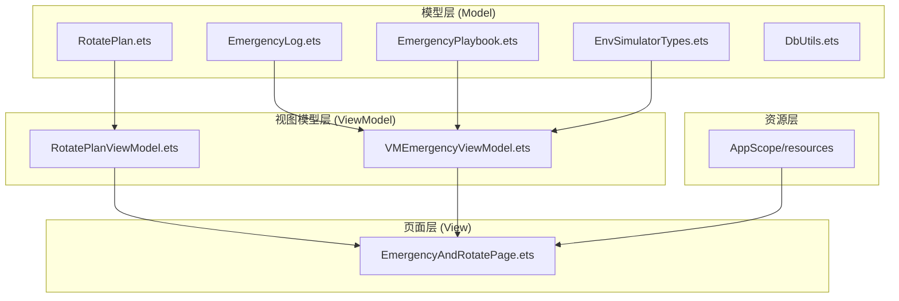
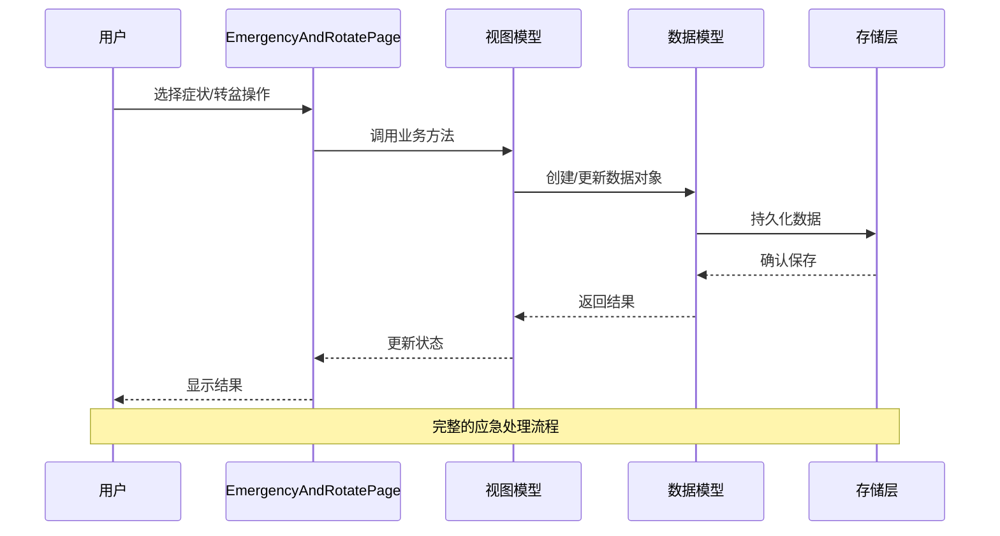
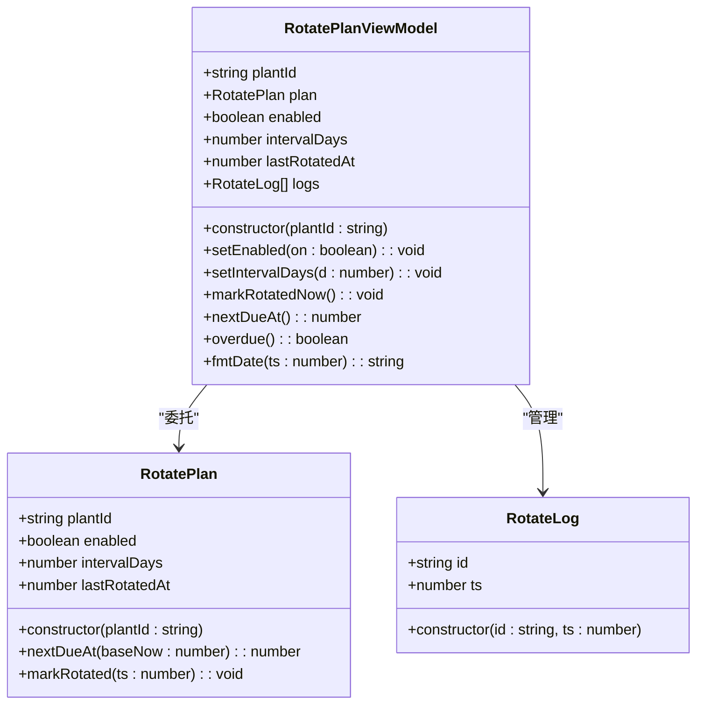
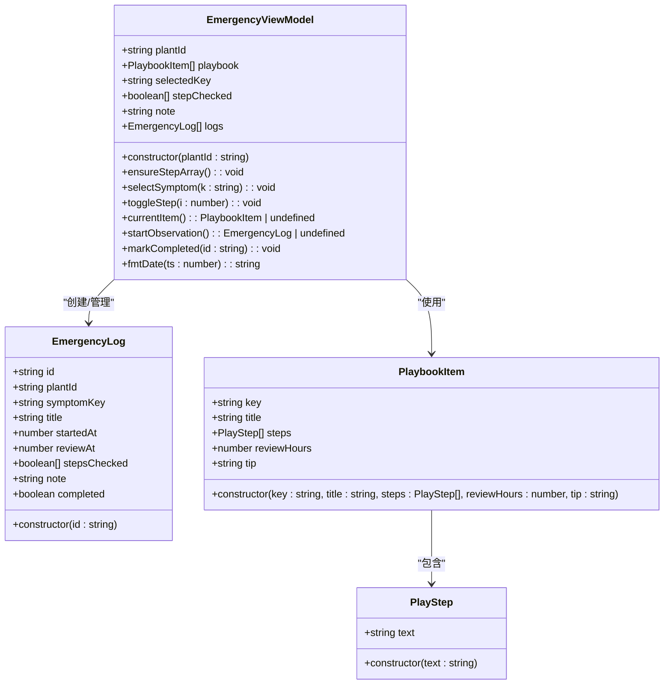
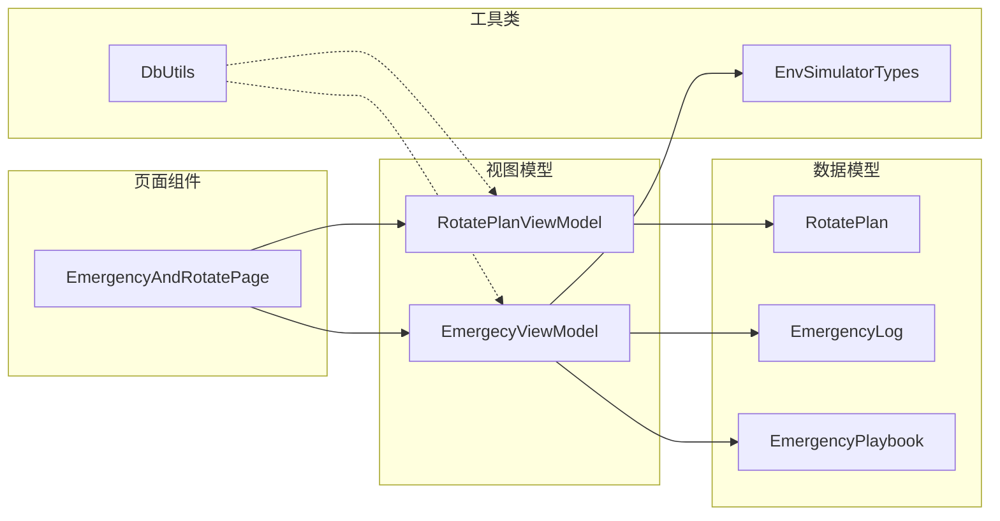

# 应急旋转模型API

<cite>
**本文档引用的文件**
- [RotatePlan.ets](file://entry/src/main/ets/model/RotatePlan.ets)
- [EmergencyLog.ets](file://entry/src/main/ets/model/EmergencyLog.ets)
- [EmergencyPlaybook.ets](file://entry/src/main/ets/model/EmergencyPlaybook.ets)
- [RotatePlanViewModel.ets](file://entry/src/main/ets/viewmodel/RotatePlanViewModel.ets)
- [EmergencyViewModel.ets](file://entry/src/main/ets/viewmodel/EmergencyViewModel.ets)
- [EmergencyAndRotatePage.ets](file://entry/src/main/ets/pages/EmergencyAndRotatePage.ets)
- [EnvSimulatorTypes.ets](file://entry/src/main/ets/model/EnvSimulatorTypes.ets)
- [DbUtils.ets](file://entry/src/main/ets/model/DbUtils.ets)
</cite>

## 目录
1. [简介](#简介)
2. [项目结构](#项目结构)
3. [核心组件](#核心组件)
4. [架构概览](#架构概览)
5. [详细组件分析](#详细组件分析)
6. [依赖关系分析](#依赖关系分析)
7. [性能考虑](#性能考虑)
8. [故障排除指南](#故障排除指南)
9. [结论](#结论)

## 简介

植物日记项目的应急旋转模型API为植物养护提供了完整的应急处理和旋转管理功能。该系统包含三个核心数据模型：`RotatePlan`旋转计划类、`EmergencyLog`应急日志类和`EmergencyPlaybook`应急手册类，以及相应的视图模型和页面组件。

系统设计采用MVVM架构模式，通过独立的视图模型管理业务逻辑，页面组件负责用户交互展示。所有数据模型均以TypeScript类型定义为基础，确保类型安全和代码可维护性。

## 项目结构

应急旋转模型位于项目的`entry/src/main/ets/`目录结构中，采用清晰的分层组织：



**图表来源**
- [EmergencyAndRotatePage.ets:1-557](file://entry/src/main/ets/pages/EmergencyAndRotatePage.ets#L1-L557)
- [RotatePlanViewModel.ets:1-88](file://entry/src/main/ets/viewmodel/RotatePlanViewModel.ets#L1-L88)
- [EmergencyViewModel.ets:1-115](file://entry/src/main/ets/viewmodel/EmergencyViewModel.ets#L1-L115)

**章节来源**
- [EmergencyAndRotatePage.ets:1-557](file://entry/src/main/ets/pages/EmergencyAndRotatePage.ets#L1-L557)
- [RotatePlan.ets:1-25](file://entry/src/main/ets/model/RotatePlan.ets#L1-L25)
- [EmergencyLog.ets:1-20](file://entry/src/main/ets/model/EmergencyLog.ets#L1-L20)
- [EmergencyPlaybook.ets:1-81](file://entry/src/main/ets/model/EmergencyPlaybook.ets#L1-L81)

## 核心组件

### 数据模型概述

系统的核心数据模型包括以下三个主要类：

1. **RotatePlan** - 转盆计划管理
2. **EmergencyLog** - 应急处理日志记录
3. **EmergencyPlaybook** - 应急处理手册清单

每个模型都遵循TypeScript最佳实践，提供明确的属性定义、构造函数和方法接口。

**章节来源**
- [RotatePlan.ets:4-24](file://entry/src/main/ets/model/RotatePlan.ets#L4-L24)
- [EmergencyLog.ets:4-19](file://entry/src/main/ets/model/EmergencyLog.ets#L4-L19)
- [EmergencyPlaybook.ets:4-23](file://entry/src/main/ets/model/EmergencyPlaybook.ets#L4-L23)

## 架构概览

系统采用MVVM架构模式，实现了清晰的关注点分离：



**图表来源**
- [EmergencyAndRotatePage.ets:17-22](file://entry/src/main/ets/pages/EmergencyAndRotatePage.ets#L17-L22)
- [EmergencyViewModel.ets:60-75](file://entry/src/main/ets/viewmodel/EmergencyViewModel.ets#L60-L75)
- [RotatePlanViewModel.ets:54-62](file://entry/src/main/ets/viewmodel/RotatePlanViewModel.ets#L54-L62)

**章节来源**
- [EmergencyAndRotatePage.ets:100-358](file://entry/src/main/ets/pages/EmergencyAndRotatePage.ets#L100-L358)
- [EmergencyViewModel.ets:13-114](file://entry/src/main/ets/viewmodel/EmergencyViewModel.ets#L13-L114)
- [RotatePlanViewModel.ets:18-87](file://entry/src/main/ets/viewmodel/RotatePlanViewModel.ets#L18-L87)

## 详细组件分析

### RotatePlan 旋转计划类

`RotatePlan`类是转盆计划的核心数据模型，负责管理植物的转盆周期和执行状态。

#### 属性定义

| 属性名 | 类型 | 默认值 | 描述 |
|--------|------|--------|------|
| plantId | string | '' | 植物唯一标识符 |
| enabled | boolean | false | 是否启用转盆计划 |
| intervalDays | number | 14 | 转盆周期（天） |
| lastRotatedAt | number | 0 | 最近一次转盆的时间戳 |

#### 核心方法

**构造函数**
```typescript
constructor(plantId: string)
```
初始化旋转计划实例，设置植物ID。

**nextDueAt(baseNow: number): number**
计算下一次转盆到期时间戳。

**markRotated(ts: number): void**
标记植物已完成转盆操作，更新最后转盆时间。



**图表来源**
- [RotatePlan.ets:4-24](file://entry/src/main/ets/model/RotatePlan.ets#L4-L24)
- [RotatePlanViewModel.ets:12-31](file://entry/src/main/ets/viewmodel/RotatePlanViewModel.ets#L12-L31)

**章节来源**
- [RotatePlan.ets:4-24](file://entry/src/main/ets/model/RotatePlan.ets#L4-L24)
- [RotatePlanViewModel.ets:18-87](file://entry/src/main/ets/viewmodel/RotatePlanViewModel.ets#L18-L87)

### EmergencyLog 应急日志类

`EmergencyLog`类用于记录植物应急处理的详细信息和执行状态。

#### 属性定义

| 属性名 | 类型 | 默认值 | 描述 |
|--------|------|--------|------|
| id | string | '' | 日志唯一标识符 |
| plantId | string | '' | 关联的植物ID |
| symptomKey | string | '' | 症状类型标识符 |
| title | string | '' | 症状标题 |
| startedAt | number | 0 | 应急处理开始时间戳 |
| reviewAt | number | 0 | 建议复查时间戳 |
| stepsChecked | boolean[] | [] | 三个处理步骤的完成状态 |
| note | string | '' | 处理备注信息 |
| completed | boolean | false | 是否已完成处理 |

#### 核心方法

**构造函数**
```typescript
constructor(id: string)
```
初始化应急日志实例，自动设置创建时间。



**图表来源**
- [EmergencyLog.ets:4-19](file://entry/src/main/ets/model/EmergencyLog.ets#L4-L19)
- [EmergencyPlaybook.ets:9-23](file://entry/src/main/ets/model/EmergencyPlaybook.ets#L9-L23)
- [EmergencyViewModel.ets:13-114](file://entry/src/main/ets/viewmodel/EmergencyViewModel.ets#L13-L114)

**章节来源**
- [EmergencyLog.ets:4-19](file://entry/src/main/ets/model/EmergencyLog.ets#L4-L19)
- [EmergencyViewModel.ets:13-114](file://entry/src/main/ets/viewmodel/EmergencyViewModel.ets#L13-L114)

### EmergencyPlaybook 应急手册类

`EmergencyPlaybook`模块提供了预定义的植物应急处理方案，包含症状识别、处理步骤和专家建议。

#### PlaybookItem 结构

| 字段名 | 类型 | 描述 |
|--------|------|------|
| key | string | 症状标识符（如 'SCORCH', 'WILT'） |
| title | string | 症状名称（如 '疑似日灼', '急性萎蔫'） |
| steps | PlayStep[] | 处理步骤数组（固定3步） |
| reviewHours | number | 建议复查间隔（小时） |
| tip | string | 专家补充建议 |

#### PlayStep 结构

| 字段名 | 类型 | 描述 |
|--------|------|------|
| text | string | 步骤描述文本 |

#### 内置症状方案

系统预定义了5种常见植物应急症状的处理方案：

1. **SCORCH (日灼)** - 建议复查72小时
   - 移至散射光处
   - 剪除严重灼伤叶片
   - 减少浇水量

2. **WILT (萎蔫)** - 建议复查48小时
   - 检查介质含水情况
   - 移至阴凉处观察
   - 确认无根系损伤后恢复

3. **YELLOW (黄化)** - 建议复查96小时
   - 检查光照充足性
   - 薄肥勤施
   - 排查盆土过湿情况

4. **SPOT (斑点)** - 建议复查72小时
   - 剪除感染叶片
   - 加强通风
   - 必要时使用杀菌剂

5. **ROOTROT (烂根)** - 建议复查48小时
   - 立即停水，移至通风阴凉
   - 轻脱盆检查，剪除腐烂根系
   - 更换新介质，少量补水

**章节来源**
- [EmergencyPlaybook.ets:4-81](file://entry/src/main/ets/model/EmergencyPlaybook.ets#L4-L81)

### 视图模型组件

#### RotatePlanViewModel

负责转盆计划的业务逻辑管理，提供以下功能：

- 计划启用/禁用控制
- 转盆周期设置（3-60天）
- 下次到期时间计算
- 转盆历史记录管理
- 到期状态检测

#### EmergencyViewModel

负责应急处理流程的业务逻辑管理，提供以下功能：

- 症状选择和切换
- 处理步骤勾选状态管理
- 应急记录创建和管理
- 复查时间安排
- 历史记录展示

**章节来源**
- [RotatePlanViewModel.ets:18-87](file://entry/src/main/ets/viewmodel/RotatePlanViewModel.ets#L18-L87)
- [EmergencyViewModel.ets:13-114](file://entry/src/main/ets/viewmodel/EmergencyViewModel.ets#L13-L114)

## 依赖关系分析

系统采用松耦合的设计，各组件间通过清晰的接口进行通信：



**图表来源**
- [EmergencyAndRotatePage.ets:4-7](file://entry/src/main/ets/pages/EmergencyAndRotatePage.ets#L4-L7)
- [EmergencyViewModel.ets:4-5](file://entry/src/main/ets/viewmodel/EmergencyViewModel.ets#L4-L5)
- [RotatePlanViewModel.ets:4](file://entry/src/main/ets/viewmodel/RotatePlanViewModel.ets#L4)

### 数据流分析

系统的数据流遵循单向数据绑定原则：

1. **用户交互** → 页面组件 → 视图模型
2. **视图模型** → 数据模型 → 存储层
3. **存储层** → 数据模型 → 视图模型 → 页面组件

这种设计确保了：
- 状态管理的确定性
- 数据一致性
- 易于测试和调试

**章节来源**
- [EmergencyAndRotatePage.ets:100-557](file://entry/src/main/ets/pages/EmergencyAndRotatePage.ets#L100-L557)
- [EmergencyViewModel.ets:60-98](file://entry/src/main/ets/viewmodel/EmergencyViewModel.ets#L60-L98)
- [RotatePlanViewModel.ets:54-72](file://entry/src/main/ets/viewmodel/RotatePlanViewModel.ets#L54-L72)

## 性能考虑

### 内存管理

- 所有数据模型均为轻量级对象，适合频繁创建和销毁
- 使用数组管理历史记录，支持动态增长
- 时间戳使用毫秒精度，确保精确的时间计算

### 计算优化

- 转盆到期计算采用简单数学运算，时间复杂度O(1)
- 应急记录创建使用工厂模式，避免重复初始化
- 步骤勾选状态使用布尔数组，内存占用最小化

### UI响应性

- 使用ArkUI的响应式机制，自动更新界面
- 大量数据使用虚拟列表渲染，提升滚动性能
- 图片和图标使用懒加载策略

## 故障排除指南

### 常见问题及解决方案

**问题1：转盆计划不生效**
- 检查enabled属性是否为true
- 验证intervalDays设置范围(3-60天)
- 确认lastRotatedAt是否正确更新

**问题2：应急记录无法保存**
- 检查plantId是否有效
- 验证symptomKey是否在内置清单中
- 确认reviewHours计算是否合理

**问题3：界面不更新**
- 确保使用@ObservedV2装饰器
- 检查数组更新是否使用新对象
- 验证数据绑定语法是否正确

### 调试技巧

1. **日志输出**：在关键方法中添加console.log语句
2. **断点调试**：使用开发者工具设置断点
3. **状态检查**：定期打印关键属性值
4. **边界测试**：测试极端输入值

**章节来源**
- [EmergencyViewModel.ets:78-98](file://entry/src/main/ets/viewmodel/EmergencyViewModel.ets#L78-L98)
- [RotatePlanViewModel.ets:54-62](file://entry/src/main/ets/viewmodel/RotatePlanViewModel.ets#L54-L62)

## 结论

植物日记项目的应急旋转模型API提供了一个完整、健壮且易于扩展的植物养护管理系统。通过清晰的分层架构、严格的类型定义和完善的业务逻辑，系统能够有效帮助用户管理植物的日常护理和应急处理。

### 主要优势

1. **模块化设计**：各组件职责明确，便于维护和测试
2. **类型安全**：完整的TypeScript定义确保编译时错误检测
3. **用户体验**：直观的界面设计和流畅的交互体验
4. **扩展性强**：模块化架构支持功能扩展和定制

### 未来改进方向

1. **持久化存储**：从内存存储迁移到RDB数据库
2. **通知系统**：集成系统通知提醒功能
3. **数据分析**：添加历史数据统计和趋势分析
4. **多平台支持**：扩展到Web和桌面平台

该API为植物爱好者和专业用户提供了一个可靠的植物养护助手，通过科学的管理和及时的应急处理，帮助植物健康成长。