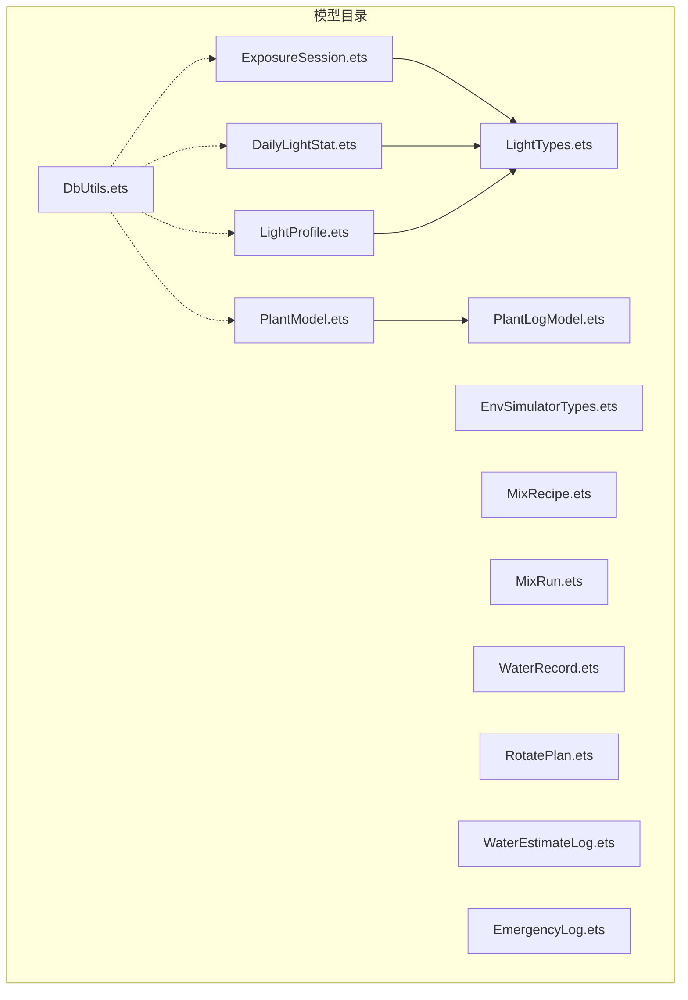
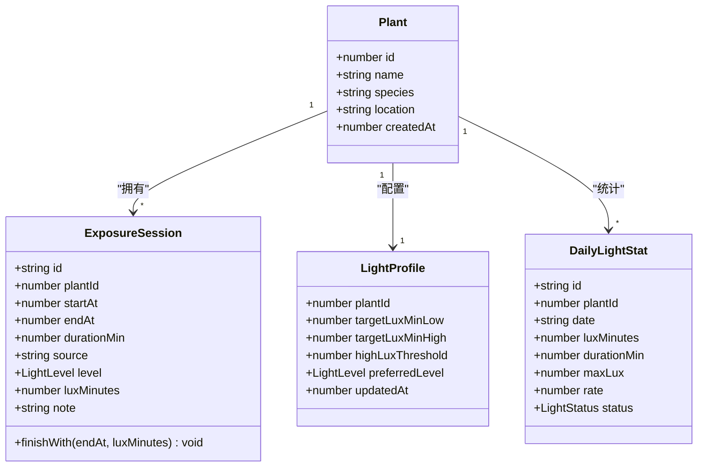
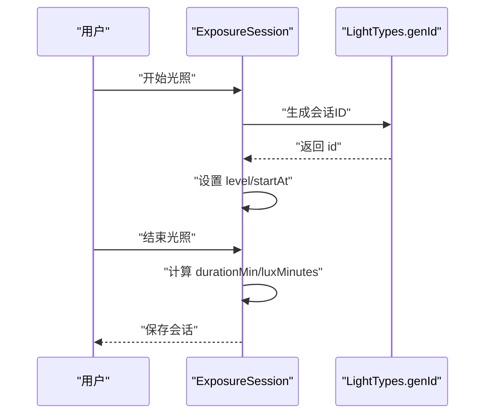
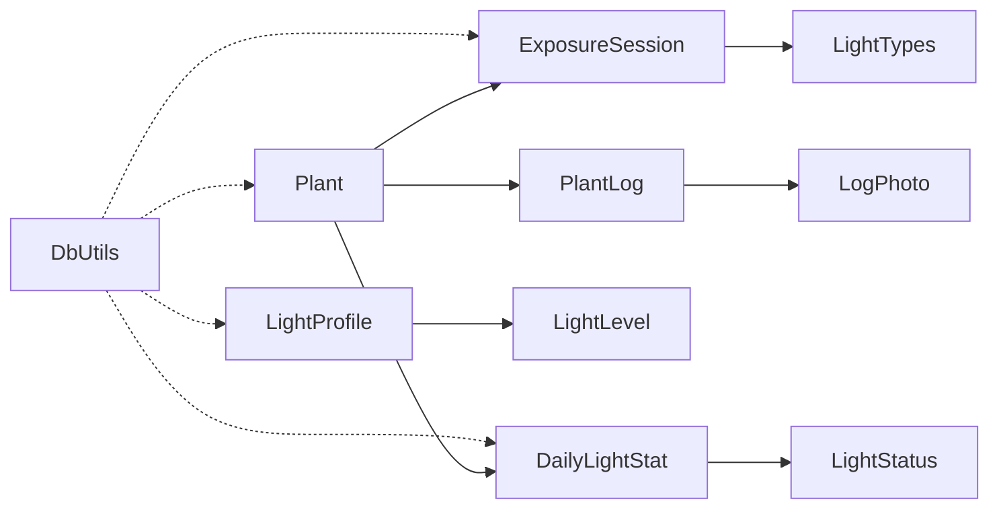

# 数据模型API

<cite>
**本文引用的文件**
- [PlantModel.ets](file://entry/src/main/ets/model/PlantModel.ets)
- [LightTypes.ets](file://entry/src/main/ets/model/LightTypes.ets)
- [ExposureSession.ets](file://entry/src/main/ets/model/ExposureSession.ets)
- [DailyLightStat.ets](file://entry/src/main/ets/model/DailyLightStat.ets)
- [LightProfile.ets](file://entry/src/main/ets/model/LightProfile.ets)
- [DbUtils.ets](file://entry/src/main/ets/model/DbUtils.ets)
- [PlantLogModel.ets](file://entry/src/main/ets/model/PlantLogModel.ets)
- [EnvSimulatorTypes.ets](file://entry/src/main/ets/model/EnvSimulatorTypes.ets)
- [MixRecipe.ets](file://entry/src/main/ets/model/MixRecipe.ets)
- [MixRun.ets](file://entry/src/main/ets/model/MixRun.ets)
- [WaterRecord.ets](file://entry/src/main/ets/model/WaterRecord.ets)
- [RotatePlan.ets](file://entry/src/main/ets/model/RotatePlan.ets)
- [WaterEstimateLog.ets](file://entry/src/main/ets/model/WaterEstimateLog.ets)
- [EmergencyLog.ets](file://entry/src/main/ets/model/EmergencyLog.ets)
</cite>

## 目录
1. [简介](#简介)
2. [项目结构](#项目结构)
3. [核心数据模型](#核心数据模型)
4. [架构概览](#架构概览)
5. [详细组件分析](#详细组件分析)
6. [依赖分析](#依赖分析)
7. [性能考虑](#性能考虑)
8. [故障排查指南](#故障排查指南)
9. [结论](#结论)
10. [附录](#附录)

## 简介
本文件为植物日记项目的数据模型API规范，聚焦于光照相关的核心模型：PlantModel（植物模型）、LightTypes（光照类型枚举与工具）、ExposureSession（光照会话）、DailyLightStat（每日光照统计）。文档提供每个模型的字段定义、类型、约束与业务含义，并说明模型间的关系与外键约束。同时给出TypeScript风格的类型定义与使用示例，帮助开发者正确创建、更新、查询与删除这些数据模型。

## 项目结构
数据模型主要位于 entry/src/main/ets/model 目录下，按功能域划分：
- 植物与日志：PlantModel.ets、PlantLogModel.ets
- 光照系统：LightTypes.ets、ExposureSession.ets、DailyLightStat.ets、LightProfile.ets
- 环境模拟与辅助：EnvSimulatorTypes.ets
- 其他业务模型：MixRecipe.ets、MixRun.ets、WaterRecord.ets、RotatePlan.ets、WaterEstimateLog.ets、EmergencyLog.ets
- 数据库事务工具：DbUtils.ets



图表来源
- [PlantModel.ets:1-166](file://entry/src/main/ets/model/PlantModel.ets#L1-L166)
- [LightTypes.ets:1-124](file://entry/src/main/ets/model/LightTypes.ets#L1-L124)
- [ExposureSession.ets:1-84](file://entry/src/main/ets/model/ExposureSession.ets#L1-L84)
- [DailyLightStat.ets:1-30](file://entry/src/main/ets/model/DailyLightStat.ets#L1-L30)
- [LightProfile.ets:1-41](file://entry/src/main/ets/model/LightProfile.ets#L1-L41)
- [DbUtils.ets:1-22](file://entry/src/main/ets/model/DbUtils.ets#L1-L22)

章节来源
- [PlantModel.ets:1-166](file://entry/src/main/ets/model/PlantModel.ets#L1-L166)
- [LightTypes.ets:1-124](file://entry/src/main/ets/model/LightTypes.ets#L1-L124)
- [ExposureSession.ets:1-84](file://entry/src/main/ets/model/ExposureSession.ets#L1-L84)
- [DailyLightStat.ets:1-30](file://entry/src/main/ets/model/DailyLightStat.ets#L1-L30)
- [LightProfile.ets:1-41](file://entry/src/main/ets/model/LightProfile.ets#L1-L41)
- [DbUtils.ets:1-22](file://entry/src/main/ets/model/DbUtils.ets#L1-L22)

## 核心数据模型
本节聚焦光照相关的核心模型：Plant、LightLevel、LightStatus、ExposureSession、DailyLightStat、LightProfile。

- Plant（植物）
  - 字段
    - id: number（主键）
    - name: string（名称）
    - species: string（种类）
    - location: string（摆放位置）
    - createdAt: number（时间戳ms）
  - 约束与含义
    - id 唯一标识植物；createdAt 用于排序与归档
    - name、species、location 为业务展示字段
  - TypeScript 类型定义
    ```ts
    interface Plant {
      id: number;
      name: string;
      species: string;
      location: string;
      createdAt: number;
    }
    ```
  - 使用示例
    - 创建：通过构造函数初始化字段
    - 查询：按 id/name/species/location/createdAt 过滤
    - 更新：修改 name/species/location 后持久化
    - 删除：级联删除植物相关的光照会话、日志、统计等

- LightLevel（光照级别枚举）
  - 值
    - LOW: 0（弱光）
    - MID: 1（中光）
    - HIGH: 2（强光）
  - 工具函数
    - lightLevelLabel(level): string → 中文标签
    - levelWeight(level): number → 权重系数
  - TypeScript 类型定义
    ```ts
    enum LightLevel {
      LOW = 0,
      MID = 1,
      HIGH = 2
    }
    ```

- LightStatus（光照状态枚举）
  - 值
    - INSUFF: 0（不足）
    - OK: 1（适中）
    - STRONG: 2（过强）
  - 工具函数
    - statusLabel(status): string → 中文标签
    - statusColor(status): string → 颜色值
  - TypeScript 类型定义
    ```ts
    enum LightStatus {
      INSUFF = 0,
      OK = 1,
      STRONG = 2
    }
    ```

- ExposureSession（光照会话）
  - 字段
    - id: string（主键，唯一标识）
    - plantId: number（外键，关联 Plant.id）
    - startAt: number（开始时间戳ms）
    - endAt: number（结束时间戳ms）
    - durationMin: number（持续时间min，至少1）
    - source: string（记录来源，默认 MANUAL）
    - level: LightLevel（光照级别）
    - luxMinutes: number（等效光照量 lux-min）
    - note: string（备注）
  - 方法
    - constructor(plantId: number) → 初始化 id 与 plantId
    - static createStarted(plantId, level, startAt): ExposureSession → 创建已开始会话
    - finishWith(endAt, luxMinutes): void → 结束会话并计算 durationMin、luxMinutes
    - static createInstant(plantId, level, minutes, endAt): ExposureSession → 即时记录会话
  - 约束与含义
    - id 通过 genId('SES') 生成；plantId 必须指向有效 Plant
    - startAt ≤ endAt；durationMin ≥ 1
    - luxMinutes 由外部计算后赋值（即时模式可为0）
  - TypeScript 类型定义
    ```ts
    interface ExposureSession {
      id: string;
      plantId: number;
      startAt: number;
      endAt: number;
      durationMin: number;
      source: string;
      level: LightLevel;
      luxMinutes: number;
      note: string;
    }
    ```

- DailyLightStat（每日光照统计）
  - 字段
    - id: string（主键）
    - plantId: number（外键，关联 Plant.id）
    - date: string（日期 YYYY-MM-DD）
    - luxMinutes: number（当日累计 lux-min）
    - durationMin: number（当日总时长 min）
    - maxLux: number（最大光照强度，手动模式恒为0）
    - rate: number（达标率 0~1）
    - status: LightStatus（光照状态）
  - 约束与含义
    - id 唯一；date 唯一定位某日统计
    - rate 通过目标范围与实际累计计算
    - status 依据 rate 与阈值判定
  - TypeScript 类型定义
    ```ts
    interface DailyLightStat {
      id: string;
      plantId: number;
      date: string;
      luxMinutes: number;
      durationMin: number;
      maxLux: number;
      rate: number;
      status: LightStatus;
    }
    ```

- LightProfile（光照目标配置）
  - 字段
    - plantId: number（主键，外键，关联 Plant.id）
    - targetLuxMinLow: number（达标下限 lux-min）
    - targetLuxMinHigh: number（达标上限 lux-min）
    - highLuxThreshold: number（过强阈值 lux-min）
    - preferredLevel: LightLevel（偏好光照级别）
    - updatedAt: number（更新时间戳ms）
  - 方法
    - constructor(plantId: number) → 初始化 updatedAt
    - static defaultFor(plantId: number): LightProfile → 默认配置
  - 约束与含义
    - 默认偏好中光，目标范围与阈值为系统预设
  - TypeScript 类型定义
    ```ts
    interface LightProfile {
      plantId: number;
      targetLuxMinLow: number;
      targetLuxMinHigh: number;
      highLuxThreshold: number;
      preferredLevel: LightLevel;
      updatedAt: number;
    }
    ```

章节来源
- [PlantModel.ets:7-21](file://entry/src/main/ets/model/PlantModel.ets#L7-L21)
- [LightTypes.ets:9-23](file://entry/src/main/ets/model/LightTypes.ets#L9-L23)
- [ExposureSession.ets:14-83](file://entry/src/main/ets/model/ExposureSession.ets#L14-L83)
- [DailyLightStat.ets:11-29](file://entry/src/main/ets/model/DailyLightStat.ets#L11-L29)
- [LightProfile.ets:11-40](file://entry/src/main/ets/model/LightProfile.ets#L11-L40)

## 架构概览
光照模块围绕 Plant、ExposureSession、DailyLightStat、LightProfile 四个核心实体协作，形成“会话采集—统计汇总—目标配置”的闭环。



图表来源
- [PlantModel.ets:7-21](file://entry/src/main/ets/model/PlantModel.ets#L7-L21)
- [ExposureSession.ets:14-83](file://entry/src/main/ets/model/ExposureSession.ets#L14-L83)
- [DailyLightStat.ets:11-29](file://entry/src/main/ets/model/DailyLightStat.ets#L11-L29)
- [LightProfile.ets:11-40](file://entry/src/main/ets/model/LightProfile.ets#L11-L40)

## 详细组件分析

### 模型：Plant（植物）
- 字段与类型
  - id: number（主键）
  - name: string
  - species: string
  - location: string
  - createdAt: number（时间戳ms）
- 约束与业务含义
  - id 唯一；createdAt 用于排序与归档
  - name/species/location 为展示字段
- TypeScript 类型定义
  ```ts
  interface Plant {
    id: number;
    name: string;
    species: string;
    location: string;
    createdAt: number;
  }
  ```
- 使用示例
  - 创建：new Plant(id, name, species, location, createdAt)
  - 查询：按 id/name/species/location/createdAt 过滤
  - 更新：修改 name/species/location
  - 删除：级联删除其 ExposureSession、DailyLightStat、PlantLog 等

章节来源
- [PlantModel.ets:7-21](file://entry/src/main/ets/model/PlantModel.ets#L7-L21)

### 模型：LightTypes（光照类型与工具）
- 枚举
  - LightLevel: LOW(0), MID(1), HIGH(2)
  - LightStatus: INSUFF(0), OK(1), STRONG(2)
- 工具函数
  - lightLevelLabel(level): string
  - statusLabel(status): string
  - statusColor(status): string
  - levelWeight(level): number
  - ymd(d: Date): string
  - hm(d: Date): string
  - clampRate(v: number): number
  - genId(prefix: string): string
- TypeScript 类型定义
  ```ts
  enum LightLevel { LOW = 0, MID = 1, HIGH = 2 }
  enum LightStatus { INSUFF = 0, OK = 1, STRONG = 2 }
  ```

章节来源
- [LightTypes.ets:9-23](file://entry/src/main/ets/model/LightTypes.ets#L9-L23)
- [LightTypes.ets:30-123](file://entry/src/main/ets/model/LightTypes.ets#L30-L123)

### 模型：ExposureSession（光照会话）
- 字段与类型
  - id: string（主键）
  - plantId: number（外键）
  - startAt/endAt: number（时间戳ms）
  - durationMin: number（至少1）
  - source: string（默认 MANUAL）
  - level: LightLevel
  - luxMinutes: number（等效光照量）
  - note: string
- 方法
  - constructor(plantId)
  - static createStarted(plantId, level, startAt)
  - finishWith(endAt, luxMinutes)
  - static createInstant(plantId, level, minutes, endAt)
- 约束与业务含义
  - startAt ≤ endAt；durationMin ≥ 1
  - luxMinutes 由外部计算后赋值
- TypeScript 类型定义
  ```ts
  interface ExposureSession {
    id: string;
    plantId: number;
    startAt: number;
    endAt: number;
    durationMin: number;
    source: string;
    level: LightLevel;
    luxMinutes: number;
    note: string;
  }
  ```



图表来源
- [ExposureSession.ets:14-83](file://entry/src/main/ets/model/ExposureSession.ets#L14-L83)
- [LightTypes.ets:119-123](file://entry/src/main/ets/model/LightTypes.ets#L119-L123)

章节来源
- [ExposureSession.ets:14-83](file://entry/src/main/ets/model/ExposureSession.ets#L14-L83)
- [LightTypes.ets:119-123](file://entry/src/main/ets/model/LightTypes.ets#L119-L123)

### 模型：DailyLightStat（每日光照统计）
- 字段与类型
  - id: string（主键）
  - plantId: number（外键）
  - date: string（YYYY-MM-DD）
  - luxMinutes: number
  - durationMin: number
  - maxLux: number（手动模式恒为0）
  - rate: number（0~1）
  - status: LightStatus
- 约束与业务含义
  - 以 date 唯一定位某日统计
  - rate 由目标范围与累计量计算
- TypeScript 类型定义
  ```ts
  interface DailyLightStat {
    id: string;
    plantId: number;
    date: string;
    luxMinutes: number;
    durationMin: number;
    maxLux: number;
    rate: number;
    status: LightStatus;
  }
  ```

章节来源
- [DailyLightStat.ets:11-29](file://entry/src/main/ets/model/DailyLightStat.ets#L11-L29)

### 模型：LightProfile（光照目标配置）
- 字段与类型
  - plantId: number（主键，外键）
  - targetLuxMinLow/High: number
  - highLuxThreshold: number
  - preferredLevel: LightLevel
  - updatedAt: number
- 方法
  - constructor(plantId)
  - static defaultFor(plantId)
- 约束与业务含义
  - 默认偏好中光，目标范围与阈值为系统预设
- TypeScript 类型定义
  ```ts
  interface LightProfile {
    plantId: number;
    targetLuxMinLow: number;
    targetLuxMinHigh: number;
    highLuxThreshold: number;
    preferredLevel: LightLevel;
    updatedAt: number;
  }
  ```

章节来源
- [LightProfile.ets:11-40](file://entry/src/main/ets/model/LightProfile.ets#L11-L40)

### 模型：PlantLog 与 LogPhoto（植物日志与照片）
- PlantLog
  - 字段：id, plantId, note, createdAt
  - 约束：plantId 外键，createdAt 排序
- LogPhoto
  - 字段：id, logId, path, thumbPath, createdAt
  - 约束：logId 外键
- TypeScript 类型定义
  ```ts
  interface PlantLog {
    id: number;
    plantId: number;
    note: string;
    createdAt: number;
  }
  interface LogPhoto {
    id: number;
    logId: number;
    path: string;
    thumbPath: string;
    createdAt: number;
  }
  ```

章节来源
- [PlantLogModel.ets:8-57](file://entry/src/main/ets/model/PlantLogModel.ets#L8-L57)

### 模型：WaterRecord（浇水记录）
- 字段：id, plantId, mode, amountMl, createdAt
- 约束：mode 为 'light' | 'deep'，amountMl 可选
- TypeScript 类型定义
  ```ts
  interface WaterRecord {
    id: string;
    plantId: string;
    mode: string;
    amountMl: number;
    createdAt: number;
  }
  ```

章节来源
- [WaterRecord.ets:3-17](file://entry/src/main/ets/model/WaterRecord.ets#L3-L17)

### 模型：环境模拟与辅助（EnvSimulatorTypes）
- 枚举与接口
  - EnvParam: LIGHT, SOIL, HUMID
  - Snapshot: 包含 light, soil, humidity, mood, leafTone, background, recommend, createdAt
- 工具函数
  - leafColorBy(light, soil): string
  - bgGradientBy(light, humidity): string
  - moodBy(light, soil, humidity): string
  - recommendationBy(light, soil, humidity): string
- TypeScript 类型定义
  ```ts
  enum EnvParam { LIGHT, SOIL, HUMID }
  interface Snapshot {
    plantId: string;
    light: number;
    soil: number;
    humidity: number;
    mood: string;
    leafTone: string;
    background: string;
    recommend: string;
    createdAt: number;
  }
  ```

章节来源
- [EnvSimulatorTypes.ets:4-95](file://entry/src/main/ets/model/EnvSimulatorTypes.ets#L4-L95)

### 其他模型（简要）
- MixRecipe 与 MixRun：土壤配方与调配结果
- RotatePlan：转盆计划
- WaterEstimateLog：浇水估算记录
- EmergencyLog：急救记录
- DbUtils：数据库事务封装

章节来源
- [MixRecipe.ets:4-32](file://entry/src/main/ets/model/MixRecipe.ets#L4-L32)
- [MixRun.ets:4-30](file://entry/src/main/ets/model/MixRun.ets#L4-L30)
- [RotatePlan.ets:4-24](file://entry/src/main/ets/model/RotatePlan.ets#L4-L24)
- [WaterEstimateLog.ets:6-24](file://entry/src/main/ets/model/WaterEstimateLog.ets#L6-L24)
- [EmergencyLog.ets:4-19](file://entry/src/main/ets/model/EmergencyLog.ets#L4-L19)
- [DbUtils.ets:12-21](file://entry/src/main/ets/model/DbUtils.ets#L12-L21)

## 依赖分析
- ExposureSession 依赖 LightTypes（枚举与 genId）
- DailyLightStat 依赖 LightStatus
- LightProfile 依赖 LightLevel
- PlantLog 与 LogPhoto 依赖 Plant
- DbUtils 为所有模型提供事务支持



图表来源
- [ExposureSession.ets:5-33](file://entry/src/main/ets/model/ExposureSession.ets#L5-L33)
- [DailyLightStat.ets:5-28](file://entry/src/main/ets/model/DailyLightStat.ets#L5-L28)
- [LightProfile.ets:5-26](file://entry/src/main/ets/model/LightProfile.ets#L5-L26)
- [PlantLogModel.ets:8-57](file://entry/src/main/ets/model/PlantLogModel.ets#L8-L57)
- [DbUtils.ets:12-21](file://entry/src/main/ets/model/DbUtils.ets#L12-L21)

章节来源
- [ExposureSession.ets:5-33](file://entry/src/main/ets/model/ExposureSession.ets#L5-L33)
- [DailyLightStat.ets:5-28](file://entry/src/main/ets/model/DailyLightStat.ets#L5-L28)
- [LightProfile.ets:5-26](file://entry/src/main/ets/model/LightProfile.ets#L5-L26)
- [PlantLogModel.ets:8-57](file://entry/src/main/ets/model/PlantLogModel.ets#L8-L57)
- [DbUtils.ets:12-21](file://entry/src/main/ets/model/DbUtils.ets#L12-L21)

## 性能考虑
- 持续时间计算：ExposureSession.finishWith 中对 durationMin 取整并保证最小值，避免无效记录影响统计。
- 达标率计算：DailyLightStat.rate 建议在批量统计时使用聚合查询，减少多次IO。
- 事务写入：使用 DbUtils.runInTransaction 确保批量插入/更新的一致性，降低失败回滚成本。
- 字段索引：建议在 PlantLog.logId、ExposureSession.plantId、DailyLightStat.plantId+date 上建立索引以优化查询。

## 故障排查指南
- 会话时长异常
  - 现象：durationMin 为0或极小
  - 排查：确认 startAt ≤ endAt；finishWith 是否被调用
- 等效光照量缺失
  - 现象：luxMinutes 为0
  - 排查：即时记录模式需在创建后显式赋值；开始/结束模式由外部计算后传入
- 统计状态不符预期
  - 现象：rate/status 与预期不一致
  - 排查：核对 LightProfile.targetLuxMinLow/High/highLuxThreshold；检查日期与累计值
- 事务失败
  - 现象：批量写入部分成功
  - 排查：使用 DbUtils.runInTransaction 包裹写入逻辑，捕获异常并回滚

章节来源
- [ExposureSession.ets:56-62](file://entry/src/main/ets/model/ExposureSession.ets#L56-L62)
- [DailyLightStat.ets:16-20](file://entry/src/main/ets/model/DailyLightStat.ets#L16-L20)
- [LightProfile.ets:14-18](file://entry/src/main/ets/model/LightProfile.ets#L14-L18)
- [DbUtils.ets:12-21](file://entry/src/main/ets/model/DbUtils.ets#L12-L21)

## 结论
本文档梳理了植物日记项目中光照相关的核心数据模型及其API规范，明确了字段、类型、约束与业务含义，并给出了模型间关系与外键约束。结合事务工具与常用工具函数，开发者可安全地实现创建、更新、查询与删除操作，并在性能与一致性方面获得保障。

## 附录
- 常用工具函数
  - ymd(Date): string → "YYYY-MM-DD"
  - hm(Date): string → "HH:mm"
  - clampRate(number): number → 限制在[0,1]
  - genId(prefix: string): string → 唯一ID
- 示例流程（概念）
  - 创建植物 → 新增光照会话 → 计算并更新每日统计 → 根据 LightProfile 判定状态