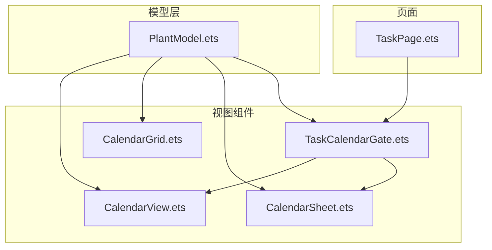
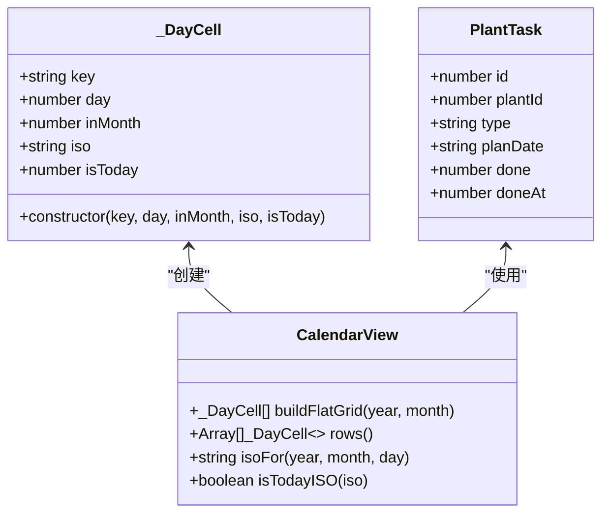
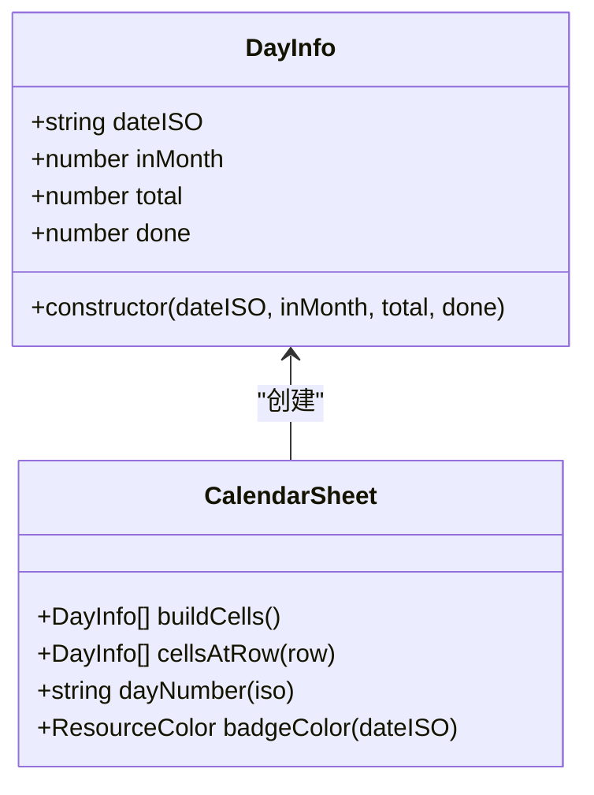
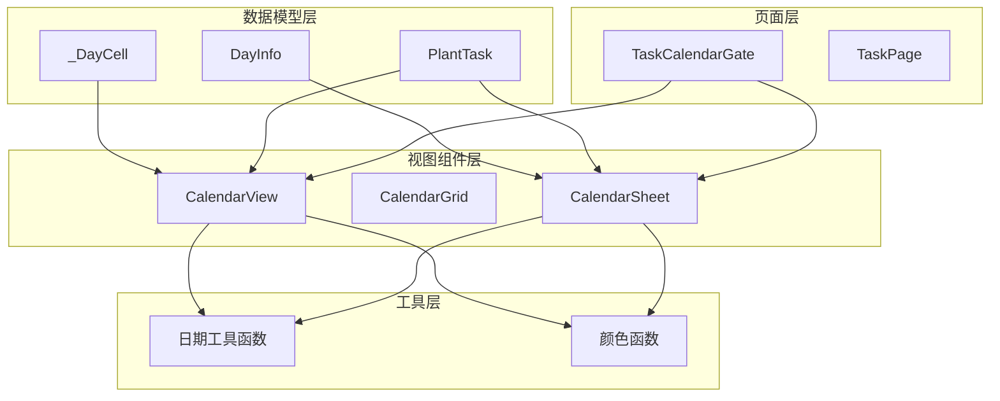
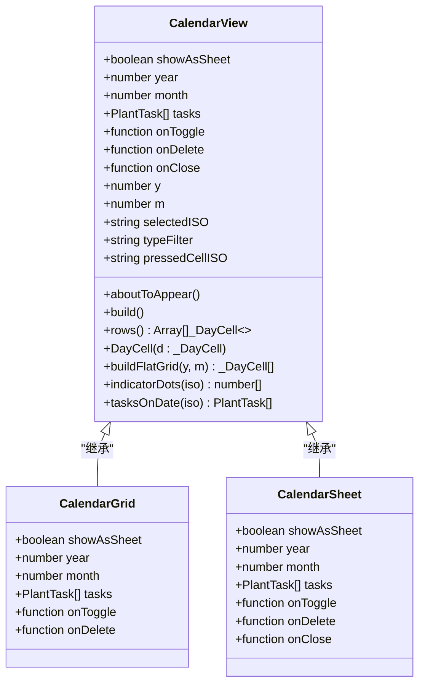
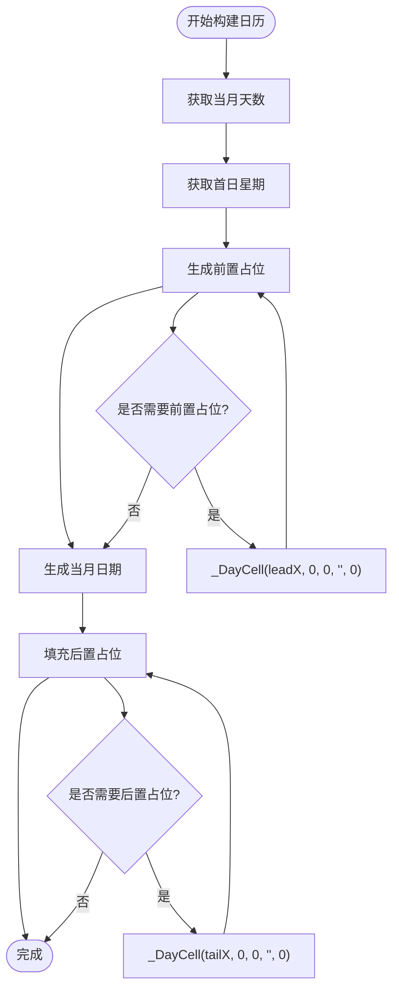
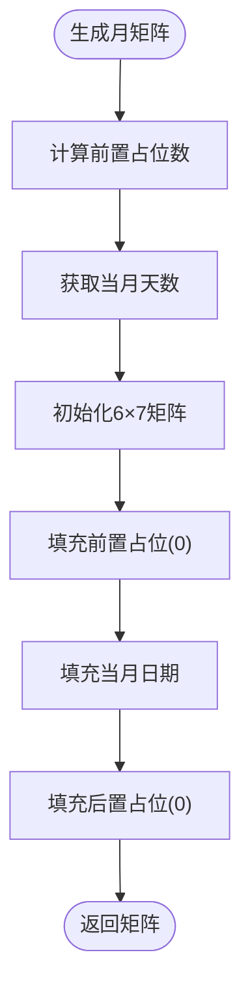
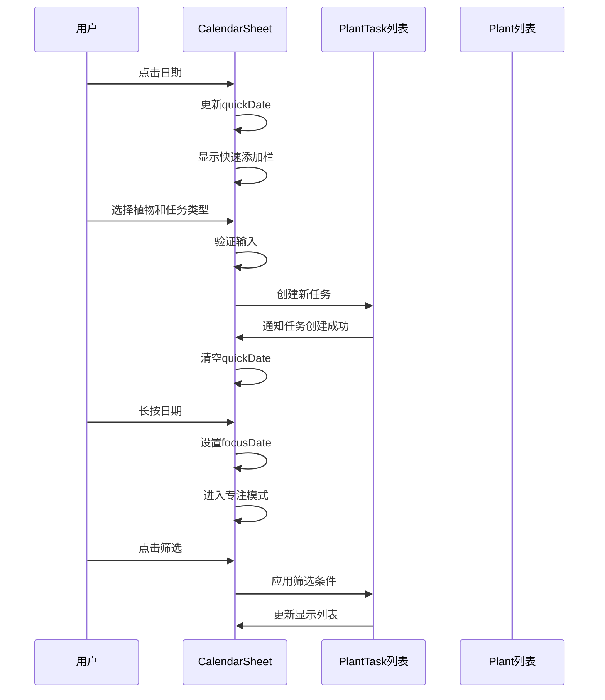
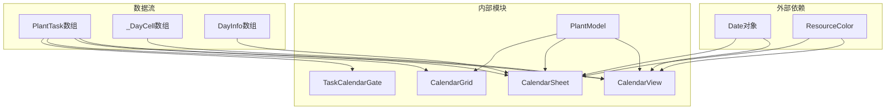

# 日历模型API

<cite>
**本文档引用的文件**
- [PlantModel.ets](file://entry/src/main/ets/model/PlantModel.ets)
- [CalendarView.ets](file://entry/src/main/ets/view/CalendarView.ets)
- [CalendarGrid.ets](file://entry/src/main/ets/view/CalendarGrid.ets)
- [CalendarSheet.ets](file://entry/src/main/ets/pages/CalendarSheet.ets)
- [TaskCalendarGate.ets](file://entry/src/main/ets/view/TaskCalendarGate.ets)
</cite>

## 目录
1. [简介](#简介)
2. [项目结构](#项目结构)
3. [核心组件](#核心组件)
4. [架构概览](#架构概览)
5. [详细组件分析](#详细组件分析)
6. [依赖关系分析](#依赖关系分析)
7. [性能考虑](#性能考虑)
8. [故障排除指南](#故障排除指南)
9. [结论](#结论)

## 简介

植物日记项目中的日历系统提供了完整的植物养护任务管理功能。该系统包含多个日历组件，支持月视图、日视图和抽屉式日历面板，能够显示植物养护任务的完成状态、跨月显示以及日期格式化等功能。

本API文档专注于_DayCell日历单元格类等日历显示模型的完整API规范，详细说明日历渲染所需的日期信息、月份标识、今日标记等属性定义和数据类型说明。

## 项目结构

植物日记项目的日历相关代码主要分布在以下目录结构中：



**图表来源**
- [PlantModel.ets:92-106](file://entry/src/main/ets/model/PlantModel.ets#L92-L106)
- [CalendarView.ets:1-566](file://entry/src/main/ets/view/CalendarView.ets#L1-L566)
- [CalendarGrid.ets:1-351](file://entry/src/main/ets/view/CalendarGrid.ets#L1-L351)
- [CalendarSheet.ets:1-504](file://entry/src/main/ets/pages/CalendarSheet.ets#L1-L504)

**章节来源**
- [PlantModel.ets:1-166](file://entry/src/main/ets/model/PlantModel.ets#L1-L166)
- [CalendarView.ets:1-566](file://entry/src/main/ets/view/CalendarView.ets#L1-L566)

## 核心组件

### _DayCell日历单元格类

_DayCell是日历组件的核心数据模型，专门用于日历渲染的单元格表示。

#### 类定义



**图表来源**
- [PlantModel.ets:92-106](file://entry/src/main/ets/model/PlantModel.ets#L92-L106)
- [CalendarView.ets:390-409](file://entry/src/main/ets/view/CalendarView.ets#L390-L409)

#### 属性定义

| 属性名 | 类型 | 描述 | 默认值 |
|--------|------|------|--------|
| key | string | 唯一键标识符 | "" |
| day | number | 日期号（1-31，0表示占位） | 0 |
| inMonth | number | 是否为当前月（1: 是，0: 否） | 0 |
| iso | string | ISO格式日期（YYYY-MM-DD，占位为空串） | "" |
| isToday | number | 是否为今日（1: 是，0: 否） | 0 |

#### 构造方法

_DayCell类提供了一个构造函数，用于创建日历单元格实例：

```typescript
constructor(key: string, day: number, inMonth: number, iso: string, isToday: number)
```

**章节来源**
- [PlantModel.ets:92-106](file://entry/src/main/ets/model/PlantModel.ets#L92-L106)
- [CalendarView.ets:396](file://entry/src/main/ets/view/CalendarView.ets#L396)

### 日信息模型（DayInfo）

在CalendarSheet组件中，使用DayInfo类作为日历单元格的数据模型：

#### 类定义



**图表来源**
- [CalendarSheet.ets:6-14](file://entry/src/main/ets/pages/CalendarSheet.ets#L6-L14)
- [CalendarSheet.ets:418-453](file://entry/src/main/ets/pages/CalendarSheet.ets#L418-L453)

#### 属性定义

| 属性名 | 类型 | 描述 | 默认值 |
|--------|------|------|--------|
| dateISO | string | ISO格式日期（YYYY-MM-DD） | "" |
| inMonth | number | 是否为当前月（1: 是，0: 否） | 0 |
| total | number | 该日任务总数 | 0 |
| done | number | 该日已完成任务数 | 0 |

**章节来源**
- [CalendarSheet.ets:6-14](file://entry/src/main/ets/pages/CalendarSheet.ets#L6-L14)

## 架构概览

植物日记的日历系统采用分层架构设计，包含模型层、视图层和页面层：



**图表来源**
- [PlantModel.ets:92-106](file://entry/src/main/ets/model/PlantModel.ets#L92-L106)
- [CalendarView.ets:1-566](file://entry/src/main/ets/view/CalendarView.ets#L1-L566)
- [CalendarSheet.ets:1-504](file://entry/src/main/ets/pages/CalendarSheet.ets#L1-L504)

## 详细组件分析

### CalendarView组件

CalendarView是日历系统的核心组件，提供完整的日历渲染功能。

#### 组件结构



**图表来源**
- [CalendarView.ets:5-566](file://entry/src/main/ets/view/CalendarView.ets#L5-L566)
- [CalendarGrid.ets:513-536](file://entry/src/main/ets/view/CalendarGrid.ets#L513-L536)
- [CalendarSheet.ets:538-565](file://entry/src/main/ets/view/CalendarSheet.ets#L538-L565)

#### 关键方法

##### 日期生成算法



**图表来源**
- [CalendarView.ets:390-409](file://entry/src/main/ets/view/CalendarView.ets#L390-L409)

##### 日期格式化

CalendarView提供多种日期格式化方法：

| 方法名 | 参数 | 返回值 | 描述 |
|--------|------|--------|------|
| monthTitle | y: number, m: number | string | 格式化月标题（YYYY 年 MM 月） |
| isoFor | y: number, m: number, d: number | string | 生成ISO日期字符串（YYYY-MM-DD） |
| todayISO | 无 | string | 获取今日ISO日期 |
| isTodayISO | iso: string | boolean | 判断是否为今日 |

**章节来源**
- [CalendarView.ets:347-435](file://entry/src/main/ets/view/CalendarView.ets#L347-L435)

### CalendarGrid组件

CalendarGrid提供内嵌式的月历网格显示，支持任务徽章统计。

#### 核心特性

- **6×7网格布局**：固定生成42个日历格子
- **任务徽章**：显示当日任务总数和完成状态
- **筛选功能**：支持按完成状态和任务类型筛选
- **统计功能**：计算每日任务完成率

#### 月矩阵生成



**图表来源**
- [CalendarGrid.ets:88-109](file://entry/src/main/ets/view/CalendarGrid.ets#L88-L109)

**章节来源**
- [CalendarGrid.ets:87-137](file://entry/src/main/ets/view/CalendarGrid.ets#L87-L137)

### CalendarSheet组件

CalendarSheet提供完整的日历面板，包含月视图、快速添加和当日任务列表。

#### 主要功能

- **月视图概览**：显示完整的月历网格
- **快速添加**：支持快速创建任务
- **当日任务列表**：显示选定日期的任务详情
- **筛选功能**：支持按完成状态和任务类型筛选

#### 交互流程



**图表来源**
- [CalendarSheet.ets:235-261](file://entry/src/main/ets/pages/CalendarSheet.ets#L235-L261)
- [CalendarSheet.ets:476-492](file://entry/src/main/ets/pages/CalendarSheet.ets#L476-L492)

**章节来源**
- [CalendarSheet.ets:177-340](file://entry/src/main/ets/pages/CalendarSheet.ets#L177-L340)

### TaskCalendarGate组件

TaskCalendarGate作为任务页面的日历入口组件，提供统一的日历访问接口。

#### 功能特性

- **入口按钮**：提供"📅 日历"按钮
- **状态管理**：控制日历抽屉的显示/隐藏
- **日期初始化**：自动设置为当前日期
- **事件转发**：将日历事件转发给父组件

**章节来源**
- [TaskCalendarGate.ets:6-81](file://entry/src/main/ets/view/TaskCalendarGate.ets#L6-L81)

## 依赖关系分析

植物日记日历系统的依赖关系呈现清晰的层次结构：



**图表来源**
- [PlantModel.ets:1-166](file://entry/src/main/ets/model/PlantModel.ets#L1-L166)
- [CalendarView.ets:1-566](file://entry/src/main/ets/view/CalendarView.ets#L1-L566)
- [CalendarSheet.ets:1-504](file://entry/src/main/ets/pages/CalendarSheet.ets#L1-L504)

### 组件耦合度分析

| 组件 | 内聚性 | 耦合度 | 说明 |
|------|--------|--------|------|
| _DayCell | 高 | 低 | 专注于日历单元格数据表示 |
| CalendarView | 高 | 中等 | 集成日历渲染和交互逻辑 |
| CalendarGrid | 中等 | 低 | 专注于网格显示 |
| CalendarSheet | 中等 | 中等 | 集成完整日历功能 |
| TaskCalendarGate | 高 | 低 | 提供统一入口 |

**章节来源**
- [PlantModel.ets:92-106](file://entry/src/main/ets/model/PlantModel.ets#L92-L106)
- [CalendarView.ets:1-566](file://entry/src/main/ets/view/CalendarView.ets#L1-L566)

## 性能考虑

### 渲染优化

1. **虚拟滚动**：CalendarGrid使用固定42个格子的预分配策略，避免动态DOM操作
2. **状态缓存**：CalendarView缓存当前年月状态，减少重复计算
3. **事件节流**：触摸事件使用防抖处理，提升响应性能

### 内存管理

1. **对象池**：_DayCell实例在网格生成时一次性创建
2. **引用传递**：PlantTask对象通过引用传递，避免数据复制
3. **生命周期管理**：组件销毁时自动清理事件监听器

### 计算优化

1. **日期计算缓存**：首日星期计算结果缓存到组件状态
2. **任务统计缓存**：每日任务统计结果缓存到组件状态
3. **颜色计算缓存**：徽章颜色根据完成状态预计算

## 故障排除指南

### 常见问题及解决方案

#### 日期显示异常

**问题**：日历显示的日期不正确
**原因**：
- 月份参数范围错误（应为1-12）
- 日期格式不符合ISO标准
- 时区设置问题

**解决方案**：
1. 验证月份参数范围
2. 使用内置的isoFor方法生成日期
3. 检查系统时区设置

#### 任务显示问题

**问题**：任务无法正确显示在日历上
**原因**：
- 任务日期格式不匹配
- 任务状态字段值错误
- 数据过滤条件配置不当

**解决方案**：
1. 确保任务planDate字段符合YYYY-MM-DD格式
2. 验证done字段值为0或1
3. 检查筛选条件配置

#### 性能问题

**问题**：日历渲染缓慢
**原因**：
- 任务数据量过大
- 组件重新渲染频繁
- DOM操作过多

**解决方案**：
1. 实施数据分页加载
2. 优化组件更新策略
3. 减少不必要的DOM操作

**章节来源**
- [CalendarView.ets:347-435](file://entry/src/main/ets/view/CalendarView.ets#L347-L435)
- [CalendarSheet.ets:388-401](file://entry/src/main/ets/pages/CalendarSheet.ets#L388-L401)

## 结论

植物日记项目的日历系统通过精心设计的数据模型和组件架构，实现了功能完整、性能优良的日历显示功能。_DayCell日历单元格类作为核心数据模型，为日历渲染提供了稳定可靠的基础。

系统的主要优势包括：

1. **清晰的架构设计**：分层架构确保了代码的可维护性和可扩展性
2. **完善的数据模型**：_DayCell和DayInfo类提供了丰富的日历单元格信息
3. **灵活的组件设计**：支持多种日历显示模式和交互方式
4. **优秀的性能表现**：通过缓存和优化策略确保流畅的用户体验

未来可以考虑的改进方向：
- 添加更多日历视图模式（年视图、周视图）
- 实现日历数据的本地存储和同步
- 增强日历主题定制功能
- 优化移动端的触摸交互体验