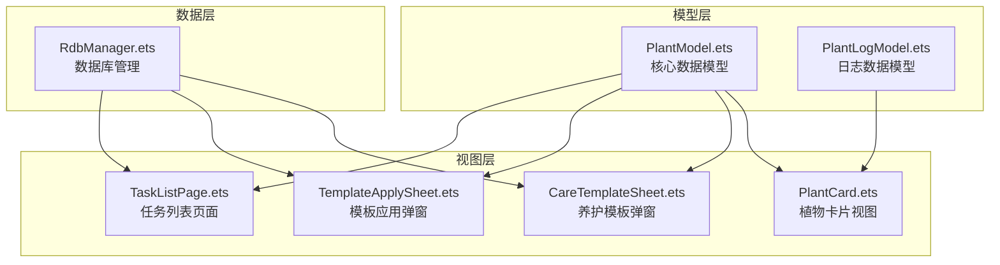
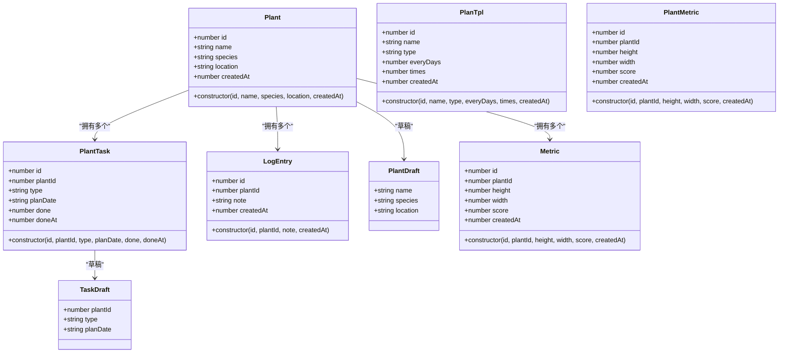
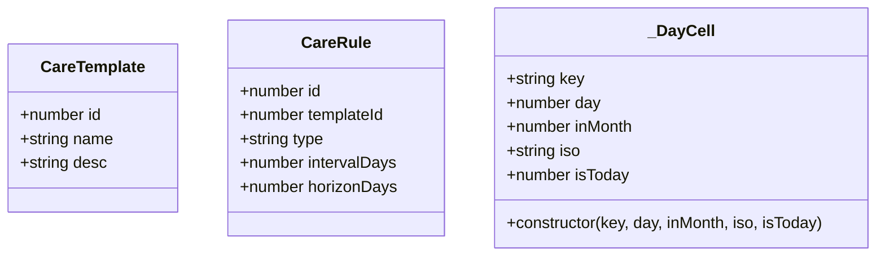
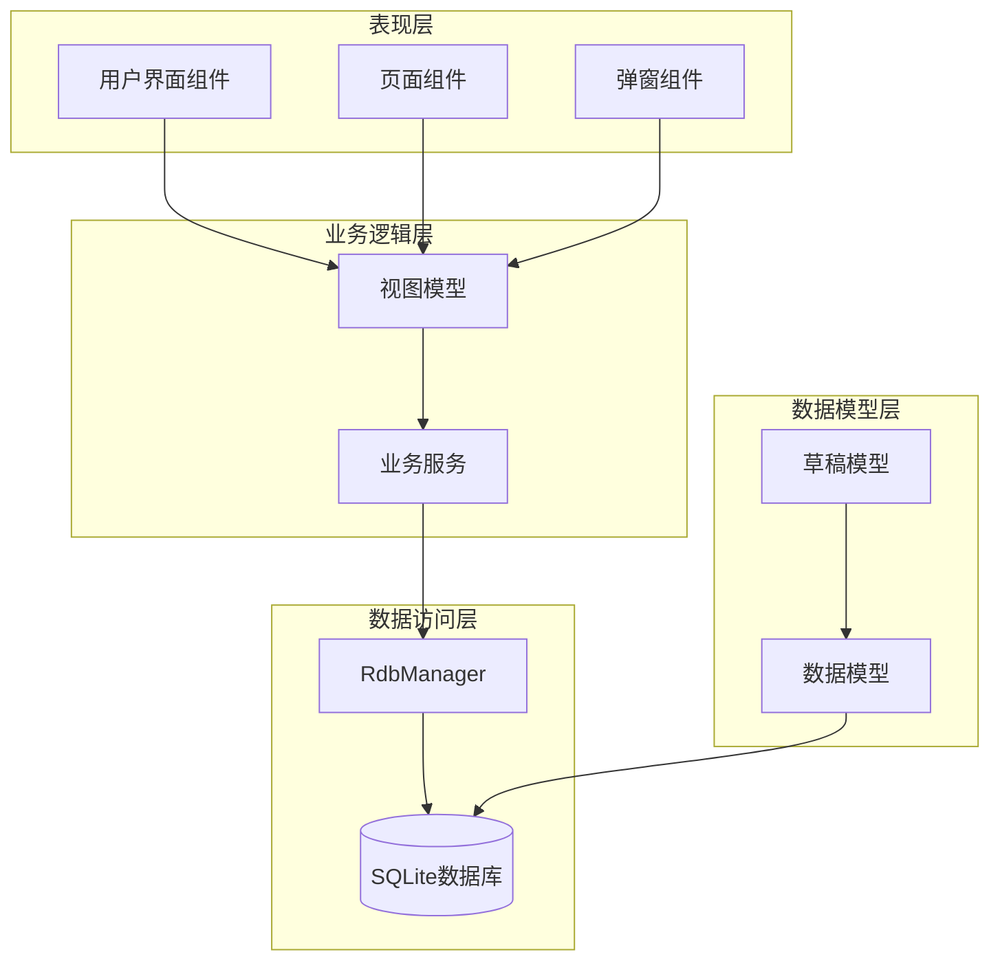
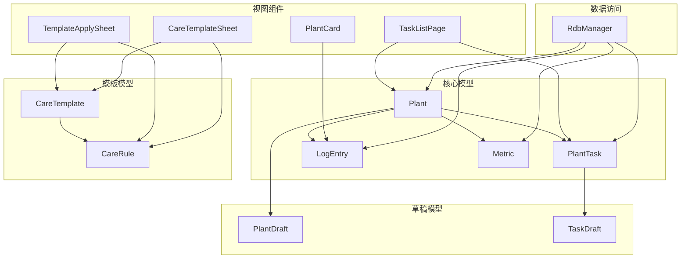

# 植物模型API

<cite>
**本文档引用的文件**
- [PlantModel.ets](file://entry/src/main/ets/model/PlantModel.ets)
- [PlantLogModel.ets](file://entry/src/main/ets/model/PlantLogModel.ets)
- [RdbManager.ets](file://entry/src/main/ets/viewmodel/RdbManager.ets)
- [TaskListPage.ets](file://entry/src/main/ets/pages/TaskListPage.ets)
- [TemplateApplySheet.ets](file://entry/src/main/ets/view/TemplateApplySheet.ets)
- [CareTemplateSheet.ets](file://entry/src/main/ets/view/CareTemplateSheet.ets)
- [PlantCard.ets](file://entry/src/main/ets/view/PlantCard.ets)
</cite>

## 目录
1. [简介](#简介)
2. [项目结构](#项目结构)
3. [核心组件](#核心组件)
4. [架构概览](#架构概览)
5. [详细组件分析](#详细组件分析)
6. [依赖分析](#依赖分析)
7. [性能考虑](#性能考虑)
8. [故障排除指南](#故障排除指南)
9. [结论](#结论)

## 简介

植物日记项目是一个基于ArkTS的植物养护管理应用，提供了完整的植物信息管理、任务生成、日志记录和生长指标跟踪功能。本API文档详细介绍了植物相关数据模型的完整规范，包括Plant植物类、PlanTpl植物模板类、PlantTask植物任务类、LogEntry植物日志类等核心模型。

该项目采用轻量级数据模型设计，通过ObservedV2装饰器实现响应式更新，支持植物基本信息管理、模板化任务生成、日志记录和生长指标跟踪等核心功能。

## 项目结构

植物模型相关文件主要位于以下目录结构中：



**图表来源**
- [PlantModel.ets:1-166](file://entry/src/main/ets/model/PlantModel.ets#L1-L166)
- [RdbManager.ets:1-296](file://entry/src/main/ets/viewmodel/RdbManager.ets#L1-L296)

**章节来源**
- [PlantModel.ets:1-166](file://entry/src/main/ets/model/PlantModel.ets#L1-L166)
- [RdbManager.ets:1-296](file://entry/src/main/ets/viewmodel/RdbManager.ets#L1-L296)

## 核心组件

植物日记项目的核心数据模型由以下主要组件构成：

### 数据模型层次结构



**图表来源**
- [PlantModel.ets:6-147](file://entry/src/main/ets/model/PlantModel.ets#L6-L147)

### 接口定义



**图表来源**
- [PlantModel.ets:149-106](file://entry/src/main/ets/model/PlantModel.ets#L149-L106)

**章节来源**
- [PlantModel.ets:6-147](file://entry/src/main/ets/model/PlantModel.ets#L6-L147)

## 架构概览

植物日记项目的整体架构采用分层设计，各层职责明确：



**图表来源**
- [RdbManager.ets:4-296](file://entry/src/main/ets/viewmodel/RdbManager.ets#L4-L296)
- [TaskListPage.ets:1-463](file://entry/src/main/ets/pages/TaskListPage.ets#L1-L463)

## 详细组件分析

### Plant植物类

Plant类是植物信息的核心数据模型，用于存储植物的基本信息。

#### 属性定义

| 属性名 | 类型 | 必填 | 默认值 | 业务含义 |
|--------|------|------|--------|----------|
| id | number | 是 | - | 植物唯一标识符 |
| name | string | 是 | - | 植物名称 |
| species | string | 否 | - | 物种信息 |
| location | string | 否 | - | 放置位置 |
| createdAt | number | 是 | - | 创建时间戳 |

#### 构造函数参数

```typescript
constructor(id: number, name: string, species: string, location: string, createdAt: number)
```

- **id**: 植物唯一标识符
- **name**: 植物名称
- **species**: 物种信息
- **location**: 放置位置
- **createdAt**: 创建时间戳

#### 使用示例

```typescript
// 创建新植物实例
const plant = new Plant(1, "绿萝", "绿萝属", "客厅", Date.now());
```

**章节来源**
- [PlantModel.ets:7-21](file://entry/src/main/ets/model/PlantModel.ets#L7-L21)

### PlanTpl植物模板类

PlanTpl类定义了植物养护模板的基本信息，支持模板化任务生成。

#### 属性定义

| 属性名 | 类型 | 必填 | 默认值 | 业务含义 |
|--------|------|------|--------|----------|
| id | number | 是 | - | 模板唯一标识符 |
| name | string | 是 | - | 模板名称 |
| type | string | 是 | - | 模板类型 |
| everyDays | number | 是 | - | 间隔天数 |
| times | number | 是 | - | 生成次数 |
| createdAt | number | 是 | - | 创建时间戳 |

#### 构造函数参数

```typescript
constructor(id: number, name: string, type: string, everyDays: number, times: number, createdAt: number)
```

- **id**: 模板唯一标识符
- **name**: 模板名称
- **type**: 模板类型
- **everyDays**: 间隔天数
- **times**: 生成次数
- **createdAt**: 创建时间戳

**章节来源**
- [PlantModel.ets:24-40](file://entry/src/main/ets/model/PlantModel.ets#L24-L40)

### PlantTask植物任务类

PlantTask类表示植物的养护任务，支持任务的计划、完成状态管理。

#### 属性定义

| 属性名 | 类型 | 必填 | 默认值 | 业务含义 |
|--------|------|------|--------|----------|
| id | number | 是 | - | 任务唯一标识符 |
| plantId | number | 是 | - | 关联植物ID |
| type | string | 是 | - | 任务类型（如浇水、施肥、修剪） |
| planDate | string | 是 | - | 计划执行日期（YYYY-MM-DD格式） |
| done | number | 是 | 0 | 完成状态（0=未完成，1=已完成） |
| doneAt | number | 否 | 0 | 完成时间戳 |

#### 构造函数参数

```typescript
constructor(id: number, plantId: number, type: string, planDate: string, done: number, doneAt: number)
```

- **id**: 任务唯一标识符
- **plantId**: 关联植物ID
- **type**: 任务类型
- **planDate**: 计划执行日期
- **done**: 完成状态
- **doneAt**: 完成时间戳

#### 任务类型枚举

系统支持以下任务类型：
- 浇水
- 施肥  
- 修剪

**章节来源**
- [PlantModel.ets:43-59](file://entry/src/main/ets/model/PlantModel.ets#L43-L59)

### LogEntry植物日志类

LogEntry类记录植物的养护记录和观察笔记。

#### 属性定义

| 属性名 | 类型 | 必填 | 默认值 | 业务含义 |
|--------|------|------|--------|----------|
| id | number | 是 | - | 日志唯一标识符 |
| plantId | number | 是 | - | 关联植物ID |
| note | string | 是 | - | 日志内容/备注 |
| createdAt | number | 是 | - | 创建时间戳 |

#### 构造函数参数

```typescript
constructor(id: number, plantId: number, note: string, createdAt: number)
```

- **id**: 日志唯一标识符
- **plantId**: 关联植物ID
- **note**: 日志内容/备注
- **createdAt**: 创建时间戳

**章节来源**
- [PlantModel.ets:78-90](file://entry/src/main/ets/model/PlantModel.ets#L78-L90)

### 植物草稿PlantDraft

PlantDraft类用于表单编辑态，避免直接修改列表中的实体对象。

#### 设计目的

- **隔离编辑状态**: 将编辑态与持久态分离
- **防误操作**: 避免直接修改现有植物对象
- **统一校验**: 在提交时进行统一的数据验证

#### 属性定义

| 属性名 | 类型 | 默认值 | 业务含义 |
|--------|------|--------|----------|
| name | string | '' | 植物名称 |
| species | string | '' | 物种信息 |
| location | string | '' | 放置位置 |

**章节来源**
- [PlantModel.ets:62-67](file://entry/src/main/ets/model/PlantModel.ets#L62-L67)

### 任务草稿TaskDraft

TaskDraft类用于新建任务的草稿组装，支持统一校验和落库。

#### 设计目的

- **草稿组装**: 先拼装草稿，再进行统一校验
- **数据完整性**: 确保任务创建前的数据完整性
- **用户体验**: 提供更好的编辑体验

#### 属性定义

| 属性名 | 类型 | 默认值 | 业务含义 |
|--------|------|--------|----------|
| plantId | number | 0 | 关联植物ID |
| type | string | '浇水' | 任务类型 |
| planDate | string | '' | 计划执行日期 |

**章节来源**
- [PlantModel.ets:70-75](file://entry/src/main/ets/model/PlantModel.ets#L70-L75)

### 成长指标Metric类

Metric类记录植物的生长指标数据。

#### 属性定义

| 属性名 | 类型 | 必填 | 默认值 | 单位 | 业务含义 |
|--------|------|------|--------|------|----------|
| id | number | 是 | - | - | 指标记录唯一标识符 |
| plantId | number | 是 | - | - | 关联植物ID |
| height | number | 是 | - | cm | 植物高度 |
| width | number | 是 | - | cm | 植物冠幅 |
| score | number | 是 | - | 0-100 | 健康评分 |
| createdAt | number | 是 | - | - | 创建时间戳 |

#### 构造函数参数

```typescript
constructor(id: number, plantId: number, height: number, width: number, score: number, createdAt: number)
```

**章节来源**
- [PlantModel.ets:109-125](file://entry/src/main/ets/model/PlantModel.ets#L109-L125)

### 养护模板接口

#### CareTemplate接口

```typescript
interface CareTemplate {
  id: number;
  name: string;
  desc: string;
}
```

#### CareRule接口

```typescript
interface CareRule {
  id: number;
  templateId: number;
  type: string;
  intervalDays: number;
  horizonDays: number;
}
```

**章节来源**
- [PlantModel.ets:150-163](file://entry/src/main/ets/model/PlantModel.ets#L150-L163)

## 依赖分析

植物模型之间的依赖关系如下：



**图表来源**
- [PlantModel.ets:6-147](file://entry/src/main/ets/model/PlantModel.ets#L6-L147)
- [TaskListPage.ets:1-463](file://entry/src/main/ets/pages/TaskListPage.ets#L1-L463)
- [TemplateApplySheet.ets:1-145](file://entry/src/main/ets/view/TemplateApplySheet.ets#L1-L145)
- [CareTemplateSheet.ets:1-217](file://entry/src/main/ets/view/CareTemplateSheet.ets#L1-L217)
- [PlantCard.ets:85-111](file://entry/src/main/ets/view/PlantCard.ets#L85-L111)

**章节来源**
- [RdbManager.ets:4-296](file://entry/src/main/ets/viewmodel/RdbManager.ets#L4-L296)

## 性能考虑

### 数据库优化

1. **索引策略**
   - 任务表：唯一索引 `(plantId, type, planDate)` 防止重复任务
   - 任务表：复合索引 `(planDate)` 和 `(plantId)` 支持常用查询
   - 日志表：复合索引 `(plantId, createdAt)` 支持按植物查询日志

2. **查询优化**
   - 使用组合索引避免重复索引
   - 支持批量任务生成时的唯一性检查
   - 优化日志查询性能

### 内存管理

1. **响应式更新**
   - 使用 `@ObservedV2` 装饰器实现高效的状态更新
   - 避免不必要的组件重新渲染

2. **草稿模式**
   - 通过草稿对象隔离编辑状态
   - 减少对主数据模型的直接修改

### 数据一致性

1. **事务处理**
   - 模板应用时使用数据库事务确保原子性
   - 支持批量任务生成的错误回滚

2. **唯一性约束**
   - 通过数据库唯一索引防止重复任务
   - 自动跳过已存在的任务项

## 故障排除指南

### 常见问题及解决方案

#### 1. 任务重复生成

**问题现象**: 同一植物的同类型任务重复出现

**解决方案**:
- 检查唯一索引是否正确创建
- 确认模板应用时的错误处理逻辑
- 验证任务生成的时间计算

#### 2. 日志查询性能问题

**问题现象**: 按植物查询日志时响应缓慢

**解决方案**:
- 确认 `(plantId, createdAt)` 复合索引是否存在
- 检查查询语句是否使用了正确的索引
- 优化日志表的查询条件

#### 3. 草稿数据丢失

**问题现象**: 编辑过程中草稿数据意外丢失

**解决方案**:
- 确认草稿对象的生命周期管理
- 检查组件状态的正确绑定
- 验证草稿数据的持久化机制

**章节来源**
- [RdbManager.ets:131-169](file://entry/src/main/ets/viewmodel/RdbManager.ets#L131-L169)

## 结论

植物日记项目的植物模型API设计合理，具有以下特点：

1. **清晰的层次结构**: 从基础数据模型到草稿模式，再到业务逻辑，层次分明
2. **完善的约束机制**: 通过数据库索引和唯一性约束保证数据一致性
3. **良好的扩展性**: 支持新的任务类型和模板类型
4. **高效的性能**: 通过索引优化和响应式更新提升用户体验

该API为植物养护管理提供了坚实的数据基础，支持从植物信息管理到任务生成、日志记录的完整业务流程。通过草稿模式和模板化设计，系统既保证了数据的一致性，又提供了灵活的用户体验。