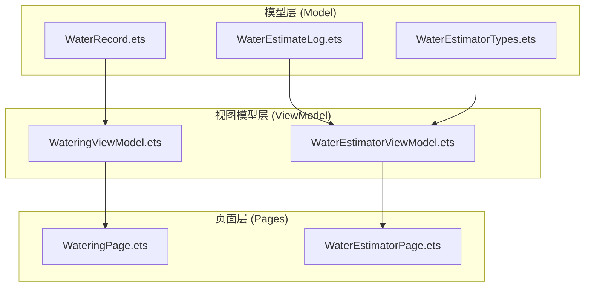
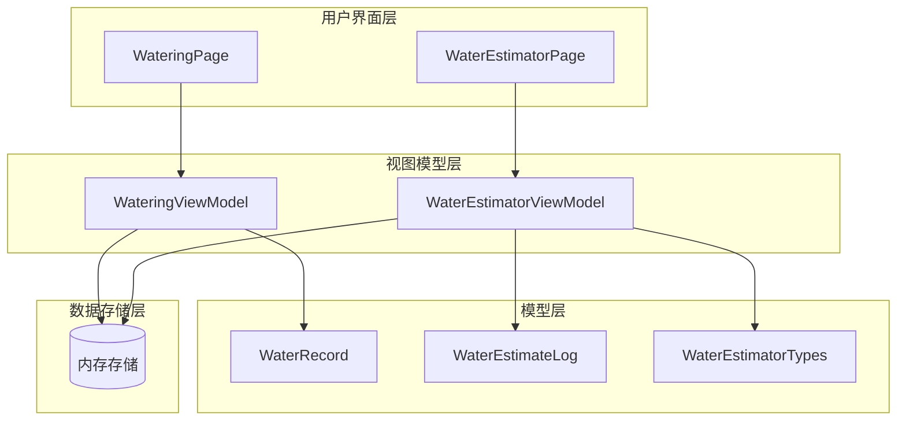
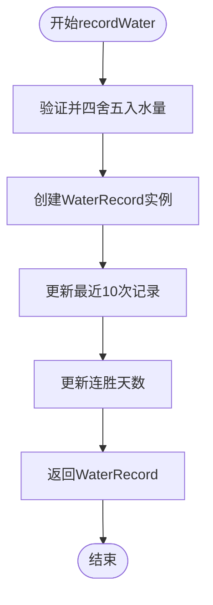
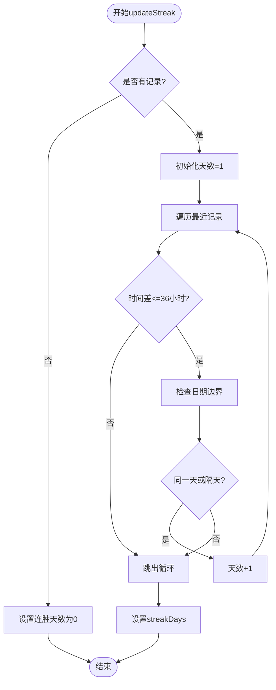
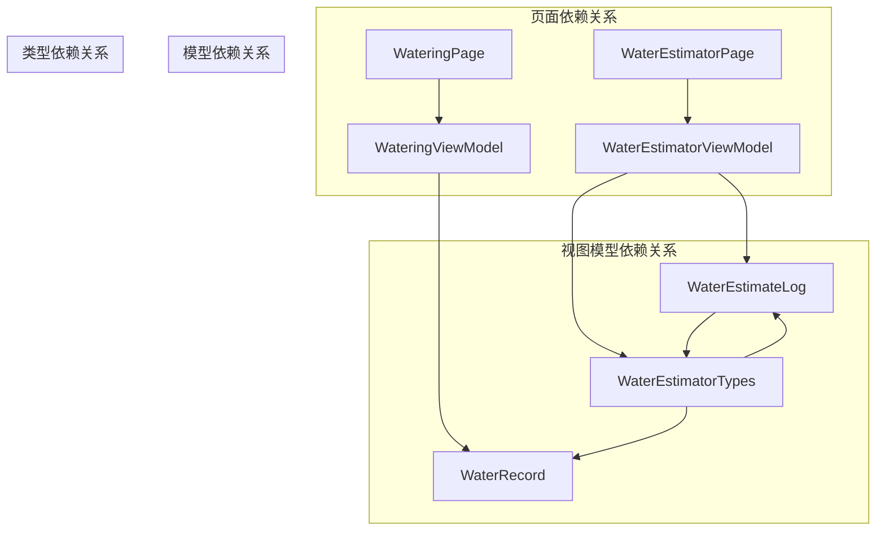

# 浇水模型API

<cite>
**本文档引用的文件**
- [WaterRecord.ets](file://entry/src/main/ets/model/WaterRecord.ets)
- [WaterEstimateLog.ets](file://entry/src/main/ets/model/WaterEstimateLog.ets)
- [WaterEstimatorTypes.ets](file://entry/src/main/ets/model/WaterEstimatorTypes.ets)
- [WateringViewModel.ets](file://entry/src/main/ets/viewmodel/WateringViewModel.ets)
- [WaterEstimatorViewModel.ets](file://entry/src/main/ets/viewmodel/WaterEstimatorViewModel.ets)
- [WateringPage.ets](file://entry/src/main/ets/pages/WateringPage.ets)
- [WaterEstimatorPage.ets](file://entry/src/main/ets/pages/WaterEstimatorPage.ets)
</cite>

## 目录
1. [简介](#简介)
2. [项目结构](#项目结构)
3. [核心组件](#核心组件)
4. [架构概览](#架构概览)
5. [详细组件分析](#详细组件分析)
6. [依赖关系分析](#依赖关系分析)
7. [性能考虑](#性能考虑)
8. [故障排除指南](#故障排除指南)
9. [结论](#结论)

## 简介

植物日记项目的浇水管理系统提供了完整的浇水记录和估算功能。本API文档详细描述了浇水相关的数据模型、业务逻辑和用户界面组件，包括WaterRecord浇水记录类、WaterEstimateLog浇水估算日志类以及相关的TypeScript类型定义。

系统采用MVVM架构模式，通过视图模型管理浇水动画状态、历史记录和统计数据，同时提供直观的用户界面进行浇水操作和估算计算。

## 项目结构

浇水模块主要分布在以下目录结构中：



**图表来源**
- [WaterRecord.ets:1-18](file://entry/src/main/ets/model/WaterRecord.ets#L1-L18)
- [WaterEstimateLog.ets:1-25](file://entry/src/main/ets/model/WaterEstimateLog.ets#L1-L25)
- [WaterEstimatorViewModel.ets:1-130](file://entry/src/main/ets/viewmodel/WaterEstimatorViewModel.ets#L1-L130)

**章节来源**
- [WaterRecord.ets:1-18](file://entry/src/main/ets/model/WaterRecord.ets#L1-L18)
- [WaterEstimateLog.ets:1-25](file://entry/src/main/ets/model/WaterEstimateLog.ets#L1-L25)
- [WateringViewModel.ets:1-102](file://entry/src/main/ets/viewmodel/WateringViewModel.ets#L1-L102)
- [WaterEstimatorViewModel.ets:1-130](file://entry/src/main/ets/viewmodel/WaterEstimatorViewModel.ets#L1-L130)

## 核心组件

### 数据模型概述

浇水系统包含两个核心数据模型：

1. **WaterRecord**: 轻量级浇水记录实体
2. **WaterEstimateLog**: 估算记录实体（内存版）

### 类型定义

系统使用枚举类型来定义浇水相关的配置选项：

- **RetentionType**: 介质类型枚举
- **StrategyType**: 浇水策略枚举  
- **PlantKind**: 植物类型枚举

**章节来源**
- [WaterEstimatorTypes.ets:8-89](file://entry/src/main/ets/model/WaterEstimatorTypes.ets#L8-L89)

## 架构概览

浇水系统的整体架构采用MVVM设计模式：



**图表来源**
- [WateringViewModel.ets:11-96](file://entry/src/main/ets/viewmodel/WateringViewModel.ets#L11-L96)
- [WaterEstimatorViewModel.ets:16-129](file://entry/src/main/ets/viewmodel/WaterEstimatorViewModel.ets#L16-L129)

## 详细组件分析

### WaterRecord 浇水记录类

WaterRecord是轻量级的浇水记录实体，用于表示单次浇水操作的基本信息。

#### 属性定义

| 属性名 | 类型 | 默认值 | 描述 |
|--------|------|--------|------|
| id | string | '' | 记录唯一标识符 |
| plantId | string | '' | 植物标识符 |
| mode | string | '' | 浇水模式 ('light' | 'deep') |
| amountMl | number | 0 | 浇水量（毫升） |
| createdAt | number | 0 | 创建时间戳 |

#### 构造函数

```typescript
constructor(id: string, plantId: string, mode: string, amountMl: number)
```

#### 方法

- **构造函数**: 初始化WaterRecord实例，设置默认创建时间为当前时间

**章节来源**
- [WaterRecord.ets:3-16](file://entry/src/main/ets/model/WaterRecord.ets#L3-L16)

### WaterEstimateLog 浇水估算日志类

WaterEstimateLog用于保存浇水估算的历史记录，包含详细的估算参数和结果。

#### 属性定义

| 属性名 | 类型 | 默认值 | 描述 |
|--------|------|--------|------|
| id | string | '' | 日志唯一标识符 |
| plantId | number | 0 | 植物标识符 |
| diameterCm | number | 0 | 盆径（厘米） |
| depthCm | number | 0 | 深度（厘米） |
| retention | RetentionType | RetentionType.GENERAL | 介质类型 |
| strategy | StrategyType | StrategyType.MAINT | 浇水策略 |
| plantKind | PlantKind | PlantKind.FOLIAGE | 植物类型 |
| low | number | 0 | 低估算值（毫升） |
| mid | number | 0 | 中估算值（毫升） |
| high | number | 0 | 高估算值（毫升） |
| createdAt | number | 0 | 创建时间戳 |
| note | string | '' | 备注说明 |

#### 构造函数

```typescript
constructor(id: string)
```

**章节来源**
- [WaterEstimateLog.ets:6-23](file://entry/src/main/ets/model/WaterEstimateLog.ets#L6-L23)

### WateringViewModel 浇水视图模型

WateringViewModel管理浇水动画状态、历史记录和连胜天数逻辑。

#### 核心属性

| 属性名 | 类型 | 默认值 | 描述 |
|--------|------|--------|------|
| plantId | string | '' | 植物标识符 |
| isAnimating | boolean | false | 是否正在播放动画 |
| mode | string | 'light' | 当前浇水模式 |
| defaultAmount | number | 100 | 默认浇水量（毫升） |
| recentTimes | Array<number> | [] | 最近10次浇水时间戳（降序） |
| streakDays | number | 0 | 连续浇水天数 |

#### 关键方法

##### recordWater(amountMl: number): WaterRecord
创建并返回一个新的WaterRecord实例，同时更新内存历史记录和连胜天数。

**算法流程**：


**图表来源**
- [WateringViewModel.ets:44-57](file://entry/src/main/ets/viewmodel/WateringViewModel.ets#L44-L57)

##### updateStreak(): void
计算连续浇水天数，考虑跨天边界和时间误差容限。

**算法流程**：


**图表来源**
- [WateringViewModel.ets:66-88](file://entry/src/main/ets/viewmodel/WateringViewModel.ets#L66-L88)

**章节来源**
- [WateringViewModel.ets:11-96](file://entry/src/main/ets/viewmodel/WateringViewModel.ets#L11-L96)

### WaterEstimatorViewModel 浇水估算视图模型

WaterEstimatorViewModel处理浇水估算的所有逻辑，包括参数输入、计算和历史记录管理。

#### 核心属性

| 属性名 | 类型 | 默认值 | 描述 |
|--------|------|--------|------|
| plantId | number | 0 | 植物标识符 |
| diameterCm | number | 14 | 盆径（厘米） |
| depthCm | number | 12 | 深度（厘米） |
| retention | RetentionType | RetentionType.GENERAL | 介质类型 |
| strategy | StrategyType | StrategyType.MAINT | 浇水策略 |
| plantKind | PlantKind | PlantKind.FOLIAGE | 植物类型 |
| low | number | 0 | 低估算值（毫升） |
| mid | number | 0 | 中估算值（毫升） |
| high | number | 0 | 高估算值（毫升） |
| logs | Array<WaterEstimateLog> | [] | 估算历史记录 |

#### 关键方法

##### setDiameter(v: number): void
设置盆径并自动重新计算，具有6-60cm的有效范围限制。

##### setDepth(v: number): void  
设置深度并自动重新计算，具有6-60cm的有效范围限制。

##### setRetention(t: RetentionType): void
设置介质类型并触发重新计算。

##### setStrategy(s: StrategyType): void
设置浇水策略并触发重新计算。

##### setPlant(k: PlantKind): void
设置植物类型并触发重新计算。

##### compute(): void
执行核心估算计算，调用模型层的estimateWaterML函数。

##### saveLog(note: string): WaterEstimateLog
保存当前估算结果为日志记录，包含完整的参数和结果快照。

**章节来源**
- [WaterEstimatorViewModel.ets:16-129](file://entry/src/main/ets/viewmodel/WaterEstimatorViewModel.ets#L16-L129)

### WaterEstimatorTypes 类型定义

系统定义了完整的类型体系来支持浇水估算功能。

#### 枚举类型

##### RetentionType 介质类型
- SANDY: 砂砾/透水
- GENERAL: 通用介质  
- PEATY: 泥炭/保水
- ORCHID: 兰花介质
- COCO: 椰糠

##### StrategyType 浇水策略
- FULL: 彻底浸润
- MAINT: 日常保养

##### PlantKind 植物类型
- SUCC: 多肉
- FOLIAGE: 观叶
- FLOWER: 开花植物
- ORCHID: 兰花
- FRUIT: 果类植物

#### 函数定义

##### estimateWaterML(diameterCm: number, depthCm: number, retention: RetentionType, strategy: StrategyType, plantKind: PlantKind): WaterEstimateResult
核心估算函数，返回包含low、mid、high三个估算值的对象。

##### retentionFactor(t: RetentionType): number
介质因子计算函数。

##### strategyFactor(s: StrategyType): number  
策略因子计算函数。

##### plantFactor(k: PlantKind): number
植物类型因子计算函数。

##### retentionLabel(t: RetentionType): string
介质类型的标签显示函数。

##### strategyLabel(s: StrategyType): string
策略类型的标签显示函数。

##### plantLabel(k: PlantKind): string
植物类型的标签显示函数。

**章节来源**
- [WaterEstimatorTypes.ets:8-129](file://entry/src/main/ets/model/WaterEstimatorTypes.ets#L8-L129)

## 依赖关系分析

浇水系统的依赖关系清晰明确：



**图表来源**
- [WateringPage.ets:1-78](file://entry/src/main/ets/pages/WateringPage.ets#L1-L78)
- [WaterEstimatorPage.ets:1-490](file://entry/src/main/ets/pages/WaterEstimatorPage.ets#L1-L490)

**章节来源**
- [WateringPage.ets:1-78](file://entry/src/main/ets/pages/WateringPage.ets#L1-L78)
- [WaterEstimatorPage.ets:1-490](file://entry/src/main/ets/pages/WaterEstimatorPage.ets#L1-L490)

## 性能考虑

### 内存管理
- WaterRecord和WaterEstimateLog都是轻量级对象，适合频繁创建和销毁
- WateringViewModel维护最近10条记录，限制内存占用
- WaterEstimatorViewModel的logs数组同样有内存控制机制

### 计算优化
- estimateWaterML函数在模型层实现，避免重复计算
- 视图模型自动响应参数变化，减少手动触发计算的需求
- 使用roundInt函数确保计算结果的整数性

### 用户体验优化
- 动画状态管理避免不必要的UI重绘
- 时间格式化函数提供一致的显示格式
- 建议文案根据策略和植物类型动态生成

## 故障排除指南

### 常见问题及解决方案

#### 浇水记录无法保存
- 检查plantId是否有效
- 确认amountMl为非负数
- 验证mode参数是否为'light'或'deep'

#### 估算结果异常
- 确认盆径和深度在6-60cm范围内
- 检查介质类型、策略和植物类型的正确性
- 验证estimateWaterML函数的输入参数

#### 连续天数计算错误
- 检查recentTimes数组的时间戳顺序
- 确认时间差计算逻辑（36小时容差）
- 验证日期边界检查逻辑

**章节来源**
- [WateringViewModel.ets:66-88](file://entry/src/main/ets/viewmodel/WateringViewModel.ets#L66-L88)
- [WaterEstimatorViewModel.ets:74-79](file://entry/src/main/ets/viewmodel/WaterEstimatorViewModel.ets#L74-L79)

## 结论

植物日记项目的浇水管理系统提供了完整而高效的浇水记录和估算功能。通过清晰的数据模型设计、合理的MVVM架构和完善的类型系统，系统能够满足用户对植物浇水管理的各种需求。

关键特性包括：
- 实时的浇水记录创建和管理
- 基于多种因素的智能估算算法
- 直观的用户界面和流畅的交互体验
- 完善的历史记录追踪和统计分析能力

系统的设计充分考虑了性能和用户体验，在保证功能完整性的同时实现了良好的可维护性和扩展性。