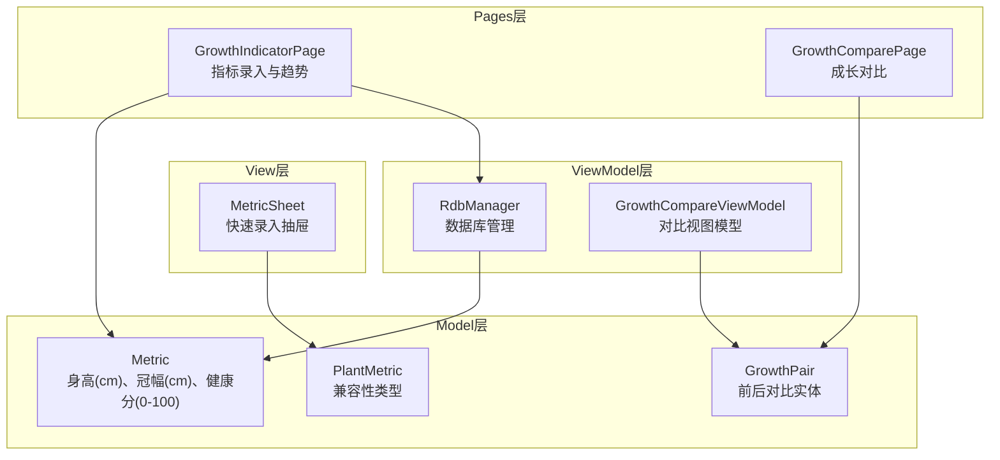
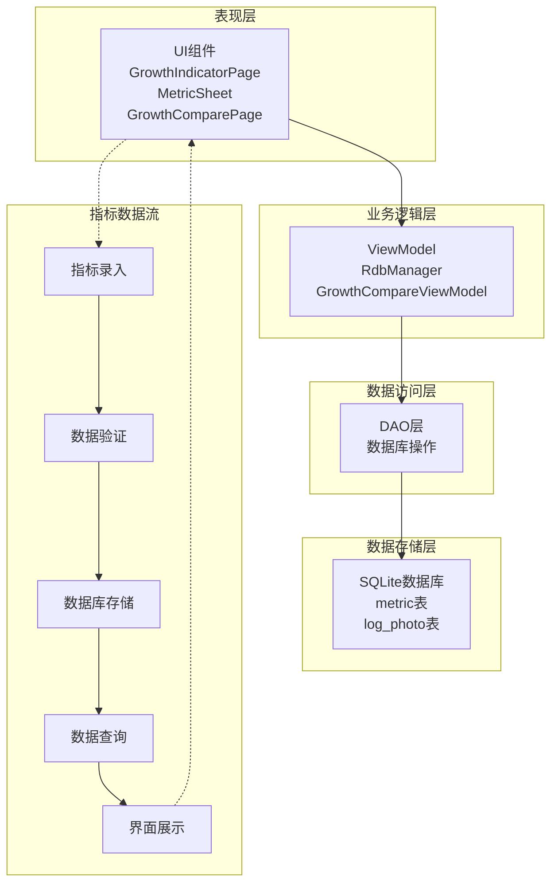
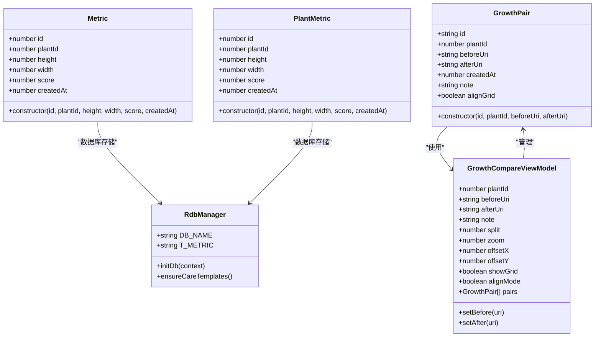
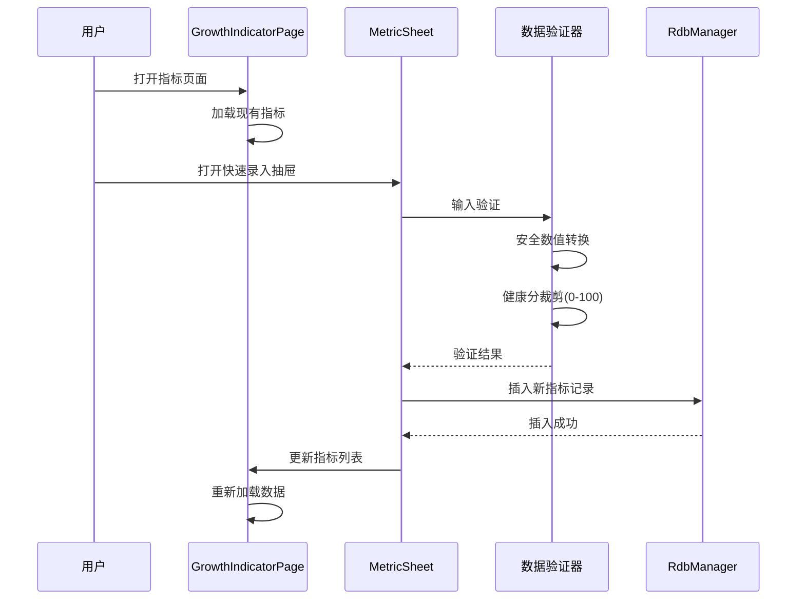
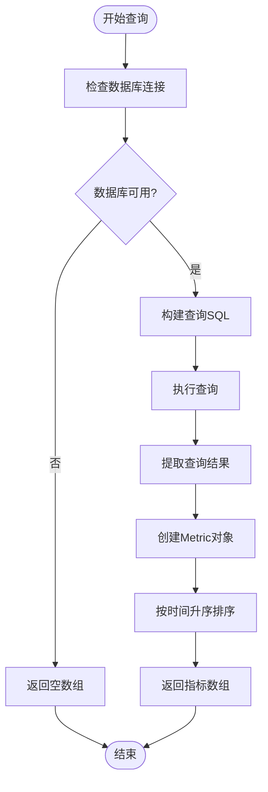
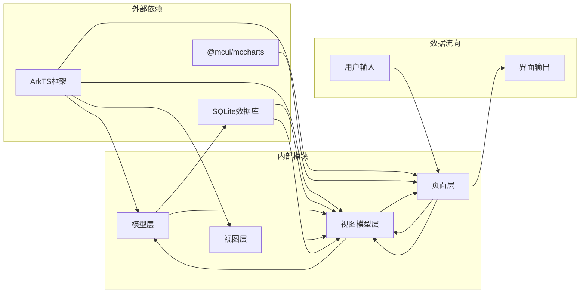

# 生长指标模型API

<cite>
**本文档引用的文件**
- [GrowthPair.ets](file://entry/src/main/ets/model/GrowthPair.ets)
- [PlantModel.ets](file://entry/src/main/ets/model/PlantModel.ets)
- [GrowthIndicatorPage.ets](file://entry/src/main/ets/pages/GrowthIndicatorPage.ets)
- [MetricSheet.ets](file://entry/src/main/ets/view/MetricSheet.ets)
- [RdbManager.ets](file://entry/src/main/ets/viewmodel/RdbManager.ets)
- [GrowthCompareViewModel.ets](file://entry/src/main/ets/viewmodel/GrowthCompareViewModel.ets)
- [GrowthComparePage.ets](file://entry/src/main/ets/pages/GrowthComparePage.ets)
</cite>

## 目录
1. [简介](#简介)
2. [项目结构](#项目结构)
3. [核心组件](#核心组件)
4. [架构概览](#架构概览)
5. [详细组件分析](#详细组件分析)
6. [依赖关系分析](#依赖关系分析)
7. [性能考量](#性能考量)
8. [故障排除指南](#故障排除指南)
9. [结论](#结论)

## 简介
本文件为植物日记项目的生长指标相关数据模型API文档，重点涵盖Metric生长指标类、GrowthPair生长配对类等生长追踪模型的完整API规范。文档详细记录身高、冠幅、健康评分等指标的属性定义、数据类型和单位说明，说明生长指标记录的创建、更新和查询API接口，提供TypeScript类型定义、指标计算方法和数据验证规则，并包含PlantMetric与Metric的区别说明和兼容性考虑。

## 项目结构
植物日记项目采用基于功能模块的组织方式，生长指标相关功能分布在以下模块：
- model层：数据模型定义（Metric、PlantMetric、GrowthPair）
- pages层：页面组件（GrowthIndicatorPage、GrowthComparePage）
- view层：视图组件（MetricSheet）
- viewmodel层：业务逻辑（RdbManager、GrowthCompareViewModel）



**图表来源**
- [PlantModel.ets:108-147](file://entry/src/main/ets/model/PlantModel.ets#L108-L147)
- [GrowthPair.ets:4-21](file://entry/src/main/ets/model/GrowthPair.ets#L4-L21)
- [GrowthIndicatorPage.ets:56-100](file://entry/src/main/ets/pages/GrowthIndicatorPage.ets#L56-L100)
- [GrowthComparePage.ets:10-60](file://entry/src/main/ets/pages/GrowthComparePage.ets#L10-L60)

**章节来源**
- [PlantModel.ets:1-166](file://entry/src/main/ets/model/PlantModel.ets#L1-L166)
- [GrowthPair.ets:1-22](file://entry/src/main/ets/model/GrowthPair.ets#L1-L22)

## 核心组件
本节详细介绍生长指标相关的三个核心数据模型及其属性定义。

### Metric类（主要指标模型）
Metric类是生长指标的主要数据模型，用于存储植物的身高、冠幅和健康评分信息。

**属性定义：**
- id: number - 指标记录唯一标识符
- plantId: number - 关联植物标识符
- height: number - 身高，单位：厘米(cm)
- width: number - 冠幅，单位：厘米(cm)
- score: number - 健康评分，范围：0-100分
- createdAt: number - 创建时间戳（毫秒）

**数据类型与单位：**
- 数值类型：number（浮点数）
- 身高/冠幅：厘米(cm)，支持小数精度
- 健康评分：0-100整数范围
- 时间戳：Unix毫秒时间戳

**构造函数：**
```typescript
constructor(id: number, plantId: number, height: number, width: number, score: number, createdAt: number)
```

### PlantMetric类（兼容性模型）
PlantMetric类与Metric类字段几乎完全一致，主要用于兼容不同页面中已有的命名约定。

**属性定义：**
- id: number - 指标记录唯一标识符
- plantId: number - 关联植物标识符
- height: number - 身高（cm）
- width: number - 冠幅（cm）
- score: number - 健康分（0~100）
- createdAt: number - 时间戳 ms

**兼容性说明：**
- 与Metric类字段完全对应
- 主要用于页面间的类型兼容
- 支持相同的验证规则和计算方法

### GrowthPair类（生长配对模型）
GrowthPair类用于存储植物前后对比的照片对信息。

**属性定义：**
- id: string - 对比记录唯一标识符
- plantId: number - 关联植物标识符
- beforeUri: string - 对比前照片URI
- afterUri: string - 对比后照片URI
- createdAt: number - 创建时间戳
- note: string - 对比说明
- alignGrid: boolean - 是否显示对齐网格

**构造函数：**
```typescript
constructor(id: string, plantId: number, beforeUri: string, afterUri: string)
```

**章节来源**
- [PlantModel.ets:108-147](file://entry/src/main/ets/model/PlantModel.ets#L108-L147)
- [GrowthPair.ets:4-21](file://entry/src/main/ets/model/GrowthPair.ets#L4-L21)

## 架构概览
生长指标系统的整体架构采用分层设计，各层职责明确，耦合度低。



**图表来源**
- [GrowthIndicatorPage.ets:400-445](file://entry/src/main/ets/pages/GrowthIndicatorPage.ets#L400-L445)
- [RdbManager.ets:70-78](file://entry/src/main/ets/viewmodel/RdbManager.ets#L70-L78)

## 详细组件分析

### 数据模型类图


**图表来源**
- [PlantModel.ets:108-147](file://entry/src/main/ets/model/PlantModel.ets#L108-L147)
- [GrowthPair.ets:4-21](file://entry/src/main/ets/model/GrowthPair.ets#L4-L21)
- [RdbManager.ets:4-24](file://entry/src/main/ets/viewmodel/RdbManager.ets#L4-L24)
- [GrowthCompareViewModel.ets:12-39](file://entry/src/main/ets/viewmodel/GrowthCompareViewModel.ets#L12-L39)

### 指标录入流程


**图表来源**
- [GrowthIndicatorPage.ets:423-445](file://entry/src/main/ets/pages/GrowthIndicatorPage.ets#L423-L445)
- [MetricSheet.ets:149-159](file://entry/src/main/ets/view/MetricSheet.ets#L149-L159)

### 指标查询流程


**图表来源**
- [GrowthIndicatorPage.ets:400-420](file://entry/src/main/ets/pages/GrowthIndicatorPage.ets#L400-L420)

### 数据验证规则
系统实现了完整的数据验证机制，确保指标数据的准确性和一致性：

**数值验证：**
- 安全数值转换：将字符串转换为数字，无效值转换为0
- 健康分裁剪：确保0-100范围内的整数值
- 身高/冠幅：支持小数，单位为厘米

**输入验证：**
- 日期格式验证：YYYY-MM-DD格式
- 数字输入限制：仅允许数字字符
- 空值处理：自动填充默认值

**章节来源**
- [GrowthIndicatorPage.ets:552-558](file://entry/src/main/ets/pages/GrowthIndicatorPage.ets#L552-L558)
- [MetricSheet.ets:468-490](file://entry/src/main/ets/view/MetricSheet.ets#L468-L490)

## 依赖关系分析
生长指标系统的关键依赖关系如下：



**图表来源**
- [RdbManager.ets:1-3](file://entry/src/main/ets/viewmodel/RdbManager.ets#L1-L3)
- [GrowthIndicatorPage.ets:1-10](file://entry/src/main/ets/pages/GrowthIndicatorPage.ets#L1-L10)

**章节来源**
- [RdbManager.ets:19-24](file://entry/src/main/ets/viewmodel/RdbManager.ets#L19-L24)
- [GrowthCompareViewModel.ets:4-39](file://entry/src/main/ets/viewmodel/GrowthCompareViewModel.ets#L4-L39)

## 性能考量
系统在性能方面采用了多项优化策略：

**数据库优化：**
- 索引优化：为`metric`表建立`(plantId, createdAt)`复合索引
- 查询优化：按时间升序查询，减少排序开销
- 批量操作：支持批量插入和查询

**内存优化：**
- 懒加载：图表数据仅在需要时构建
- 对象池：重用Metric对象实例
- 内存回收：及时清理不再使用的数据

**网络优化：**
- 数据缓存：本地缓存常用指标数据
- 异步操作：数据库操作异步执行
- 错误恢复：网络异常时的数据恢复机制

## 故障排除指南

### 常见问题及解决方案

**指标无法保存：**
1. 检查数据库连接状态
2. 验证输入数据格式
3. 确认权限设置

**查询结果异常：**
1. 检查索引是否正常
2. 验证时间戳格式
3. 确认植物ID有效性

**图表显示错误：**
1. 检查数据完整性
2. 验证数值范围
3. 确认图表配置

**章节来源**
- [GrowthIndicatorPage.ets:447-455](file://entry/src/main/ets/pages/GrowthIndicatorPage.ets#L447-L455)
- [RdbManager.ets:163-169](file://entry/src/main/ets/viewmodel/RdbManager.ets#L163-L169)

## 结论
植物日记项目的生长指标模型API设计合理，具有以下特点：

**设计优势：**
- 清晰的分层架构，职责分离明确
- 完善的数据验证机制，确保数据质量
- 灵活的扩展性，支持未来功能扩展
- 良好的性能优化，满足实际使用需求

**技术特色：**
- 使用ArkTS框架，充分利用平台特性
- 采用观察者模式，实现响应式数据绑定
- 集成图表组件，提供丰富的可视化体验
- 支持前后对比功能，增强用户体验

该API为植物日记应用提供了完整的生长指标管理能力，能够有效支撑植物养护过程中的数据记录、分析和展示需求。