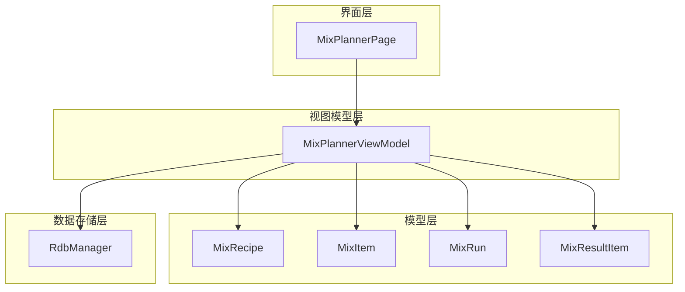
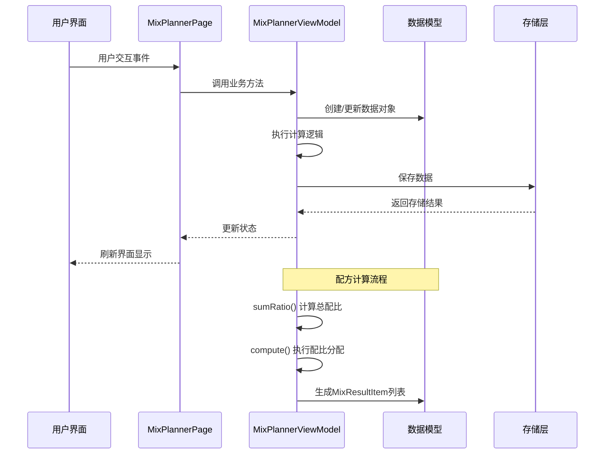
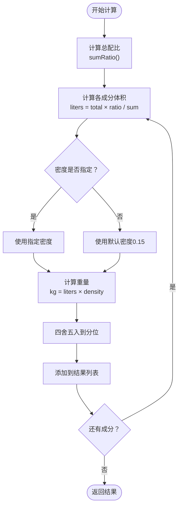
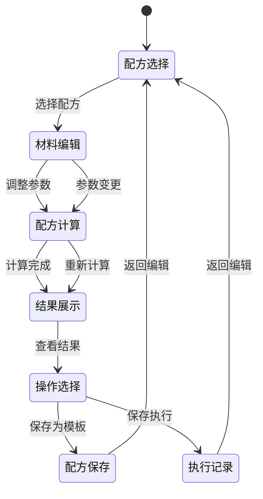
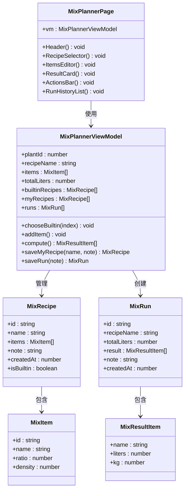
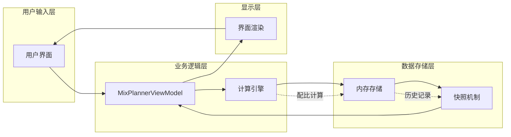

# 配肥模型API

<cite>
**本文档引用的文件**
- [MixRecipe.ets](file://entry/src/main/ets/model/MixRecipe.ets)
- [MixRun.ets](file://entry/src/main/ets/model/MixRun.ets)
- [MixPlannerViewModel.ets](file://entry/src/main/ets/viewmodel/MixPlannerViewModel.ets)
- [MixPlannerPage.ets](file://entry/src/main/ets/pages/MixPlannerPage.ets)
- [RdbManager.ets](file://entry/src/main/ets/viewmodel/RdbManager.ets)
</cite>

## 目录
1. [简介](#简介)
2. [项目结构](#项目结构)
3. [核心组件](#核心组件)
4. [架构概览](#架构概览)
5. [详细组件分析](#详细组件分析)
6. [依赖关系分析](#依赖关系分析)
7. [性能考虑](#性能考虑)
8. [故障排除指南](#故障排除指南)
9. [结论](#结论)

## 简介

植物日记项目的配肥管理系统提供了完整的土壤配方管理和执行跟踪功能。该系统基于MVVM架构设计，包含配方定义、计算引擎、执行记录和历史追踪等核心功能模块。

本系统主要解决以下问题：
- 提供灵活的土壤配方创建和管理
- 实现精确的配比计算和重量估算
- 支持配方模板化复用和单次执行记录
- 提供完整的执行历史追踪和效果评估

## 项目结构

配肥功能采用清晰的分层架构：

**图表来源**
- [MixPlannerPage.ets:39-90](file://entry/src/main/ets/pages/MixPlannerPage.ets#L39-L90)
- [MixPlannerViewModel.ets:17-39](file://entry/src/main/ets/viewmodel/MixPlannerViewModel.ets#L17-L39)
- [MixRecipe.ets:18-32](file://entry/src/main/ets/model/MixRecipe.ets#L18-L32)
- [MixRun.ets:16-30](file://entry/src/main/ets/model/MixRun.ets#L16-L30)

**章节来源**
- [MixPlannerPage.ets:1-366](file://entry/src/main/ets/pages/MixPlannerPage.ets#L1-L366)
- [MixPlannerViewModel.ets:1-228](file://entry/src/main/ets/viewmodel/MixPlannerViewModel.ets#L1-L228)

## 核心组件

### 数据模型定义

系统包含两个核心数据模型：MixRecipe（配方）和MixRun（执行记录）。

#### MixItem - 配方成分项
| 属性名 | 类型 | 默认值 | 描述 |
|--------|------|--------|------|
| id | string | '' | 成分唯一标识符 |
| name | string | '' | 成分名称 |
| ratio | number | 1 | 配比权重（相对值） |
| density | number | 0.15 | 密度（kg/L），0表示使用默认值 |

#### MixRecipe - 配方主体
| 属性名 | 类型 | 默认值 | 描述 |
|--------|------|--------|------|
| id | string | '' | 配方唯一标识符 |
| name | string | '' | 配方名称 |
| items | Array<MixItem> | [] | 配方成分列表 |
| note | string | '' | 配方备注 |
| createdAt | number | 0 | 创建时间戳 |
| isBuiltin | boolean | false | 是否为内置配方 |

#### MixResultItem - 计算结果项
| 属性名 | 类型 | 默认值 | 描述 |
|--------|------|--------|------|
| name | string | '' | 成分名称 |
| liters | number | 0 | 体积（升） |
| kg | number | 0 | 重量（公斤） |

#### MixRun - 执行记录
| 属性名 | 类型 | 默认值 | 描述 |
|--------|------|--------|------|
| id | string | '' | 记录唯一标识符 |
| recipeName | string | '' | 配方名称 |
| totalLiters | number | 0 | 总体积（升） |
| result | Array<MixResultItem> | [] | 计算结果列表 |
| note | string | '' | 执行备注 |
| createdAt | number | 0 | 执行时间戳 |

**章节来源**
- [MixRecipe.ets:4-16](file://entry/src/main/ets/model/MixRecipe.ets#L4-L16)
- [MixRecipe.ets:18-32](file://entry/src/main/ets/model/MixRecipe.ets#L18-L32)
- [MixRun.ets:4-14](file://entry/src/main/ets/model/MixRun.ets#L4-L14)
- [MixRun.ets:16-30](file://entry/src/main/ets/model/MixRun.ets#L16-L30)

## 架构概览

系统采用MVVM架构模式，实现了清晰的关注点分离：

**图表来源**
- [MixPlannerPage.ets:39-90](file://entry/src/main/ets/pages/MixPlannerPage.ets#L39-L90)
- [MixPlannerViewModel.ets:17-39](file://entry/src/main/ets/viewmodel/MixPlannerViewModel.ets#L17-L39)

## 详细组件分析

### MixPlannerViewModel - 配方管理核心

#### 核心功能模块

##### 1. 配方选择与管理
- **内置配方加载**：系统预置3个常用配方，包括多肉排水型、观叶通用型和兰科透气型
- **自定义配方编辑**：支持动态添加、删除和修改配方成分
- **我的配方保存**：将当前编辑状态保存为可复用的配方模板

##### 2. 配方计算引擎
配方计算采用两阶段算法：
1. **配比分配**：按权重比例将总体积分配到各成分
2. **重量估算**：根据密度估算各成分重量

**图表来源**
- [MixPlannerViewModel.ets:161-181](file://entry/src/main/ets/viewmodel/MixPlannerViewModel.ets#L161-L181)

##### 3. 数据持久化策略
- **内存存储**：所有数据在内存中维护，支持快速响应
- **历史记录**：执行记录保存为不可变快照，确保历史可追溯性
- **状态同步**：界面与数据模型保持双向同步

#### 关键API方法

| 方法名 | 参数 | 返回值 | 描述 |
|--------|------|--------|------|
| chooseBuiltin | index: number | void | 选择内置配方 |
| addItem | - | void | 添加新成分 |
| removeItem | id: string | void | 删除指定成分 |
| setItemName | id: string, name: string | void | 设置成分名称 |
| setItemRatio | id: string, ratio: number | void | 设置配比权重 |
| setItemDensity | id: string, density: number | void | 设置密度 |
| setTotalLiters | v: number | void | 设置总体积 |
| compute | - | Array<MixResultItem> | 执行配比计算 |
| saveMyRecipe | name: string, note: string | MixRecipe \| undefined | 保存为我的配方 |
| saveRun | note: string | MixRun | 保存执行记录 |

**章节来源**
- [MixPlannerViewModel.ets:43-68](file://entry/src/main/ets/viewmodel/MixPlannerViewModel.ets#L43-L68)
- [MixPlannerViewModel.ets:79-94](file://entry/src/main/ets/viewmodel/MixPlannerViewModel.ets#L79-L94)
- [MixPlannerViewModel.ets:97-152](file://entry/src/main/ets/viewmodel/MixPlannerViewModel.ets#L97-L152)
- [MixPlannerViewModel.ets:161-181](file://entry/src/main/ets/viewmodel/MixPlannerViewModel.ets#L161-L181)
- [MixPlannerViewModel.ets:185-200](file://entry/src/main/ets/viewmodel/MixPlannerViewModel.ets#L185-L200)
- [MixPlannerViewModel.ets:217-226](file://entry/src/main/ets/viewmodel/MixPlannerViewModel.ets#L217-L226)

### MixPlannerPage - 用户界面层

#### 界面组件结构

界面采用模块化设计，包含以下主要区域：

1. **头部信息区**：显示植物ID和系统标题
2. **配方选择区**：内置配方、我的配方和自定义配方入口
3. **材料编辑区**：动态材料列表和配比控制
4. **计算结果显示区**：实时显示计算结果
5. **操作控制区**：保存和执行按钮
6. **历史记录区**：配方和执行记录展示

#### 交互流程

**图表来源**
- [MixPlannerPage.ets:109-142](file://entry/src/main/ets/pages/MixPlannerPage.ets#L109-L142)
- [MixPlannerPage.ets:155-177](file://entry/src/main/ets/pages/MixPlannerPage.ets#L155-L177)
- [MixPlannerPage.ets:253-273](file://entry/src/main/ets/pages/MixPlannerPage.ets#L253-L273)

**章节来源**
- [MixPlannerPage.ets:92-106](file://entry/src/main/ets/pages/MixPlannerPage.ets#L92-L106)
- [MixPlannerPage.ets:109-142](file://entry/src/main/ets/pages/MixPlannerPage.ets#L109-L142)
- [MixPlannerPage.ets:155-177](file://entry/src/main/ets/pages/MixPlannerPage.ets#L155-L177)
- [MixPlannerPage.ets:233-250](file://entry/src/main/ets/pages/MixPlannerPage.ets#L233-L250)
- [MixPlannerPage.ets:253-273](file://entry/src/main/ets/pages/MixPlannerPage.ets#L253-L273)
- [MixPlannerPage.ets:276-291](file://entry/src/main/ets/pages/MixPlannerPage.ets#L276-L291)

### 数据存储与管理

#### 存储策略
系统采用内存优先的存储策略：
- **临时数据**：配方编辑状态、计算结果等临时数据保存在内存中
- **持久化数据**：我的配方和执行记录保存为不可变快照
- **历史追踪**：所有操作都有时间戳记录，支持历史回溯

#### 数据一致性保证
- **不可变性**：保存的数据都是快照，避免后续修改影响历史记录
- **原子性**：保存操作要么成功要么失败，保证数据完整性
- **可追溯性**：所有数据都包含创建时间和来源信息

**章节来源**
- [MixPlannerViewModel.ets:217-226](file://entry/src/main/ets/viewmodel/MixPlannerViewModel.ets#L217-L226)
- [RdbManager.ets:4-296](file://entry/src/main/ets/viewmodel/RdbManager.ets#L4-L296)

## 依赖关系分析

### 组件依赖图

**图表来源**
- [MixPlannerPage.ets:39-90](file://entry/src/main/ets/pages/MixPlannerPage.ets#L39-L90)
- [MixPlannerViewModel.ets:17-39](file://entry/src/main/ets/viewmodel/MixPlannerViewModel.ets#L17-L39)
- [MixRecipe.ets:18-32](file://entry/src/main/ets/model/MixRecipe.ets#L18-L32)
- [MixRun.ets:16-30](file://entry/src/main/ets/model/MixRun.ets#L16-L30)

### 数据流分析

系统遵循单向数据流原则：

**图表来源**
- [MixPlannerViewModel.ets:161-181](file://entry/src/main/ets/viewmodel/MixPlannerViewModel.ets#L161-L181)
- [MixPlannerPage.ets:253-273](file://entry/src/main/ets/pages/MixPlannerPage.ets#L253-L273)

**章节来源**
- [MixPlannerViewModel.ets:17-39](file://entry/src/main/ets/viewmodel/MixPlannerViewModel.ets#L17-L39)
- [MixPlannerPage.ets:39-90](file://entry/src/main/ets/pages/MixPlannerPage.ets#L39-L90)

## 性能考虑

### 计算性能优化

1. **延迟计算**：界面只在需要时触发计算，避免不必要的重算
2. **缓存策略**：计算结果在短时间内缓存，减少重复计算
3. **批量更新**：多个属性同时更新时，只触发一次界面刷新

### 内存管理

1. **对象池**：频繁创建的对象使用对象池技术复用
2. **及时释放**：不再使用的临时对象及时释放内存
3. **监控机制**：定期检查内存使用情况，防止内存泄漏

### 界面响应性

1. **异步处理**：耗时操作在后台线程执行
2. **进度反馈**：长时间操作显示进度指示器
3. **容错机制**：操作失败时提供友好的错误提示

## 故障排除指南

### 常见问题及解决方案

#### 配方计算异常
**问题描述**：配比计算结果异常或显示错误
**可能原因**：
- 配比权重设置超出允许范围
- 密度过小或过大导致计算溢出
- 总配比为零导致除零错误

**解决方案**：
- 检查配比权重范围（0.1-99）
- 验证密度值的有效性（0-3 kg/L）
- 确保至少有一个有效成分

#### 数据保存失败
**问题描述**：保存配方或执行记录时失败
**可能原因**：
- 配方名称为空
- 内存不足
- 数据库连接异常

**解决方案**：
- 确保配方名称非空
- 清理内存缓存
- 重启应用后重试

#### 界面显示异常
**问题描述**：界面元素显示不正确或响应迟钝
**可能原因**：
- 数据绑定错误
- 状态更新时机不当
- 内存泄漏

**解决方案**：
- 检查数据绑定表达式
- 确保在正确的生命周期内更新状态
- 使用开发者工具检查内存使用

**章节来源**
- [MixPlannerViewModel.ets:124-128](file://entry/src/main/ets/viewmodel/MixPlannerViewModel.ets#L124-L128)
- [MixPlannerViewModel.ets:139-143](file://entry/src/main/ets/viewmodel/MixPlannerViewModel.ets#L139-L143)
- [MixPlannerViewModel.ets:154-159](file://entry/src/main/ets/viewmodel/MixPlannerViewModel.ets#L154-L159)

## 结论

植物日记项目的配肥管理系统展现了优秀的软件架构设计：

### 技术优势
1. **清晰的分层架构**：MVVM模式确保了关注点分离
2. **灵活的数据模型**：支持复杂的配方组合和计算
3. **完善的用户体验**：直观的界面设计和流畅的操作体验
4. **可靠的性能表现**：优化的计算算法和内存管理

### 功能完整性
系统完整实现了配肥管理的所有核心功能：
- 配方创建和编辑
- 精确的配比计算
- 执行记录和历史追踪
- 模板化复用机制

### 扩展性设计
系统具备良好的扩展基础：
- 模块化的代码结构便于功能扩展
- 明确的接口定义支持插件开发
- 可配置的参数体系适应不同需求

该系统为植物爱好者提供了专业级的配肥管理工具，既满足了日常使用需求，又为未来的功能扩展奠定了坚实基础。