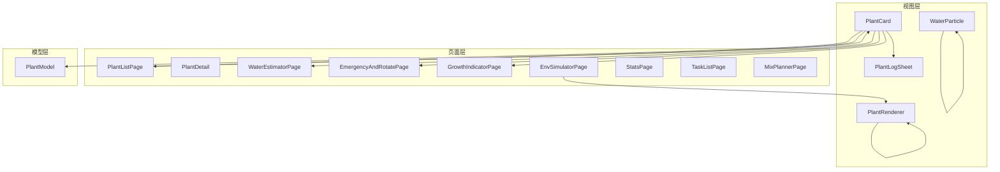
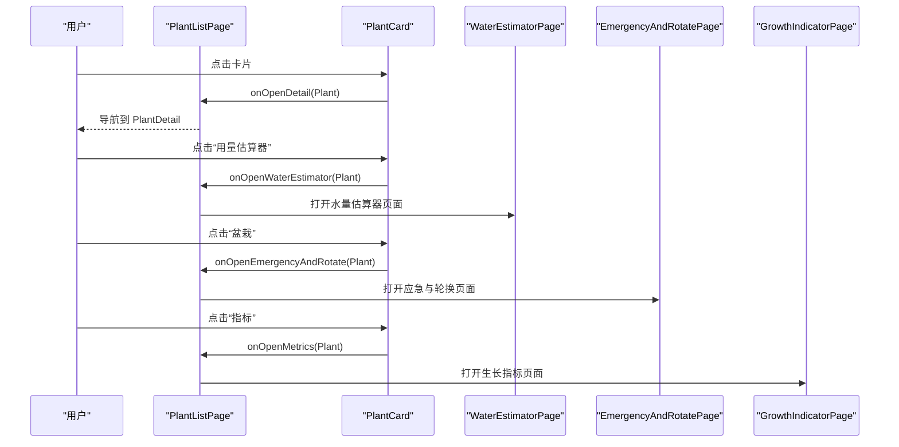
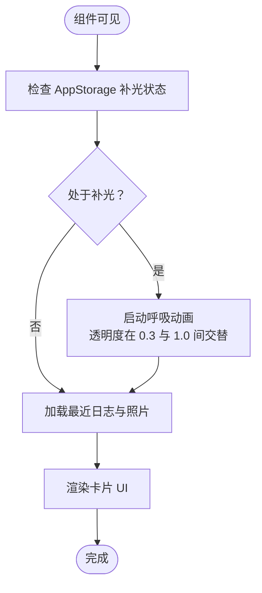
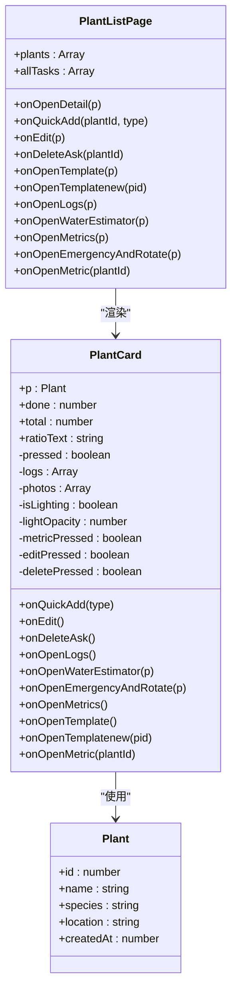

# PlantCard 植物卡片组件

<cite>
**本文档引用的文件**
- [PlantCard.ets](file://entry/src/main/ets/view/PlantCard.ets)
- [PlantModel.ets](file://entry/src/main/ets/model/PlantModel.ets)
- [PlantListPage.ets](file://entry/src/main/ets/pages/PlantListPage.ets)
- [PlantDetail.ets](file://entry/src/main/ets/pages/PlantDetail.ets)
- [PlantLogSheet.ets](file://entry/src/main/ets/view/PlantLogSheet.ets)
- [WaterEstimatorPage.ets](file://entry/src/main/ets/pages/WaterEstimatorPage.ets)
- [EmergencyAndRotatePage.ets](file://entry/src/main/ets/pages/EmergencyAndRotatePage.ets)
- [GrowthIndicatorPage.ets](file://entry/src/main/ets/pages/GrowthIndicatorPage.ets)
- [WateringPage.ets](file://entry/src/main/ets/pages/WateringPage.ets)
- [PlantRenderer.ets](file://entry/src/main/ets/component/PlantRenderer.ets)
- [WaterParticle.ets](file://entry/src/main/ets/component/WaterParticle.ets)
- [EnvSimulatorPage.ets](file://entry/src/main/ets/pages/EnvSimulatorPage.ets)
- [StatsPage.ets](file://entry/src/main/ets/pages/StatsPage.ets)
- [TaskListPage.ets](file://entry/src/main/ets/pages/TaskListPage.ets)
- [MixPlannerPage.ets](file://entry/src/main/ets/pages/MixPlannerPage.ets)
</cite>

## 目录
1. [简介](#简介)
2. [项目结构](#项目结构)
3. [核心组件](#核心组件)
4. [架构总览](#架构总览)
5. [详细组件分析](#详细组件分析)
6. [依赖关系分析](#依赖关系分析)
7. [性能考虑](#性能考虑)
8. [故障排除指南](#故障排除指南)
9. [结论](#结论)
10. [附录](#附录)

## 简介
PlantCard 是 PlantDiary 应用中的植物卡片组件，作为植物概览与功能入口的聚合节点，承担以下职责：
- 展示植物基础信息（名称、种类、位置、首字母头像或日志封面图）
- 显示光照状态（边框/阴影/呼吸动画）
- 展示任务完成进度（完成数/总数/百分比）
- 提供快捷操作入口（日志、指标、模板、新模板、盆栽、用量估算器）
- 提供快速添加任务的快捷按钮
- 管理内部状态（按压反馈、光照动画、图标按压状态）

该组件通过事件回调将用户操作传递至上层页面，实现“展示与交互分离”的设计。

## 项目结构
PlantCard 位于视图层，与页面层、模型层、视图模型层协同工作：
- 视图层：PlantCard、PlantLogSheet、PlantRenderer、WaterParticle
- 页面层：PlantListPage、PlantDetail、WaterEstimatorPage、EmergencyAndRotatePage、GrowthIndicatorPage、EnvSimulatorPage、StatsPage、TaskListPage、MixPlannerPage
- 模型层：Plant、PlantTask、Metric 等数据模型
- 视图模型层：RdbManager、WaterEstimatorViewModel、EmergencyViewModel、RotatePlanViewModel、EnvSimulatorViewModel、MixPlannerViewModel 等

**图表来源**
- [PlantCard.ets](file://entry/src/main/ets/view/PlantCard.ets)
- [PlantListPage.ets](file://entry/src/main/ets/pages/PlantListPage.ets)
- [PlantLogSheet.ets](file://entry/src/main/ets/view/PlantLogSheet.ets)
- [PlantModel.ets](file://entry/src/main/ets/model/PlantModel.ets)
- [EnvSimulatorPage.ets](file://entry/src/main/ets/pages/EnvSimulatorPage.ets)
- [PlantRenderer.ets](file://entry/src/main/ets/component/PlantRenderer.ets)
- [WaterParticle.ets](file://entry/src/main/ets/component/WaterParticle.ets)

**章节来源**
- [PlantCard.ets:1-326](file://entry/src/main/ets/view/PlantCard.ets#L1-L326)
- [PlantListPage.ets:1-228](file://entry/src/main/ets/pages/PlantListPage.ets#L1-L228)

## 核心组件
PlantCard 作为结构化组件，具备以下关键特性：
- 参数化输入：接收 Plant 对象、完成数、总数、比率文本
- 事件回调：提供 onQuickAdd、onEdit、onDeleteAsk、onOpenLogs、onOpenWaterEstimator、onOpenEmergencyAndRotate、onOpenMetrics、onOpenTemplate、onOpenTemplatenew、onOpenMetric 等回调
- 内部状态：按压状态、光照状态、动画效果、图标按压状态
- 构建方法：build 函数生成卡片 UI，包含封面图、名称、种类、进度条、快捷操作区、快速添加按钮等
- 样式定制：支持背景色、圆角、阴影、渐变、动画等外观配置

**章节来源**
- [PlantCard.ets:8-326](file://entry/src/main/ets/view/PlantCard.ets#L8-L326)

## 架构总览
PlantCard 的调用链路如下：
- 上层页面（如 PlantListPage）计算完成数、总数、比率文本，将数据与事件回调传递给 PlantCard
- PlantCard 根据传入数据渲染 UI，并在用户交互时触发相应事件回调
- 事件回调由上层页面处理，打开对应的功能页面或执行业务逻辑

**图表来源**
- [PlantListPage.ets:157-178](file://entry/src/main/ets/pages/PlantListPage.ets#L157-L178)
- [PlantCard.ets:13-22](file://entry/src/main/ets/view/PlantCard.ets#L13-L22)

**章节来源**
- [PlantListPage.ets:157-178](file://entry/src/main/ets/pages/PlantListPage.ets#L157-L178)
- [PlantCard.ets:13-22](file://entry/src/main/ets/view/PlantCard.ets#L13-L22)

## 详细组件分析

### 组件属性与事件

- 属性参数（@Param）
  - p: Plant（必需）- 植物对象，包含 id、name、species、location、createdAt 等字段
  - done: number（必需）- 当前植物已完成的任务数
  - total: number（必需）- 当前植物总任务数
  - ratioText: string（必需）- 完成率字符串（如 "xx%"）

- 事件回调（@Event）
  - onQuickAdd(type: string) => void - 快速添加任务，type 为任务类型（如 "浇水"、"施肥"、"修剪"）
  - onEdit() => void - 编辑植物信息
  - onDeleteAsk() => void - 删除植物确认
  - onOpenLogs() => void - 打开日志页面
  - onOpenWaterEstimator(p: Plant) => void - 打开用量估算器页面
  - onOpenEmergencyAndRotate(p: Plant) => void - 打开应急与轮换页面
  - onOpenMetrics() => void - 打开生长指标页面
  - onOpenTemplate() => void - 打开模板页面
  - onOpenTemplatenew(pid: number) => void - 打开新模板页面
  - onOpenMetric(plantId: number) => void - 打开指标页面

- 内部状态
  - pressed: boolean - 卡片整体按压状态
  - logs: Array<PlantLog> - 最近日志列表
  - photos: Array<LogPhoto> - 日志照片列表
  - isLighting: boolean - 是否处于补光状态
  - lightOpacity: number - 补光呼吸动画透明度
  - metricPressed: boolean - 指标图标按压状态
  - editPressed: boolean - 编辑图标按压状态
  - deletePressed: boolean - 删除图标按压状态

- 样式与动画
  - 卡片按压缩放动画
  - 指标/编辑/删除图标按压缩放动画
  - 补光状态下的呼吸动画（透明度交替变化）
  - 进度条动画与颜色配置

**章节来源**
- [PlantCard.ets:9-33](file://entry/src/main/ets/view/PlantCard.ets#L9-L33)
- [PlantCard.ets:13-22](file://entry/src/main/ets/view/PlantCard.ets#L13-L22)
- [PlantCard.ets:25-33](file://entry/src/main/ets/view/PlantCard.ets#L25-L33)
- [PlantCard.ets:293-302](file://entry/src/main/ets/view/PlantCard.ets#L293-L302)
- [PlantCard.ets:157-168](file://entry/src/main/ets/view/PlantCard.ets#L157-L168)

### 内部状态管理与动画

- 补光状态检查
  - 组件在可见时检查 AppStorage 中的补光状态，若处于补光状态则启动呼吸动画
  - 呼吸动画通过 animateTo 实现透明度在 0.3 与 1.0 之间交替变化

- 按压状态
  - 卡片整体与图标均维护按压状态，在触摸按下时置为 true，抬起或取消时置为 false
  - 按压时触发动画与缩放效果，提升交互反馈

- 日志与照片加载
  - 组件在可见时异步加载最近日志与照片，用于封面图与补光状态展示
  - 使用 RdbStore 查询日志与照片，填充内部数组

**图表来源**
- [PlantCard.ets:35-47](file://entry/src/main/ets/view/PlantCard.ets#L35-L47)
- [PlantCard.ets:49-53](file://entry/src/main/ets/view/PlantCard.ets#L49-L53)
- [PlantCard.ets:80-111](file://entry/src/main/ets/view/PlantCard.ets#L80-L111)

**章节来源**
- [PlantCard.ets:35-47](file://entry/src/main/ets/view/PlantCard.ets#L35-L47)
- [PlantCard.ets:49-53](file://entry/src/main/ets/view/PlantCard.ets#L49-L53)
- [PlantCard.ets:80-111](file://entry/src/main/ets/view/PlantCard.ets#L80-L111)

### 构建方法与样式定制

- 构建方法
  - build 函数生成卡片主体，包含头像/封面、名称与种类、光照徽章、进度条、快捷操作区、快速添加按钮等
  - 支持点击事件与触摸事件，实现导航与按压反馈

- 样式定制
  - 背景色、圆角、阴影、线性渐变
  - 进度条颜色与背景色
  - 图标按压缩放与动画
  - 呼吸动画与边框/阴影强调补光状态

**章节来源**
- [PlantCard.ets:113-303](file://entry/src/main/ets/view/PlantCard.ets#L113-L303)

### 事件回调与触发条件

- onQuickAdd(type: string)
  - 触发条件：点击快速添加按钮（浇水/施肥/修剪）
  - 参数：任务类型字符串
  - 用途：帮助用户快速创建今日任务

- onEdit()
  - 触发条件：点击编辑图标
  - 用途：打开编辑植物信息的弹层或页面

- onDeleteAsk()
  - 触发条件：点击删除图标
  - 用途：触发删除确认流程

- onOpenLogs()
  - 触发条件：点击“日志”标签
  - 用途：打开植物日志页面

- onOpenWaterEstimator(p: Plant)
  - 触发条件：点击“用量估算器”标签
  - 用途：打开水估算器页面

- onOpenEmergencyAndRotate(p: Plant)
  - 触发条件：点击“盆栽”标签
  - 用途：打开应急与轮换页面

- onOpenMetrics()
  - 触发条件：点击“指标”标签
  - 用途：打开生长指标页面

- onOpenTemplate()
  - 触发条件：点击“模板”标签
  - 用途：打开模板页面

- onOpenTemplatenew(pid: number)
  - 触发条件：点击“新模板”标签
  - 用途：打开新模板页面

- onOpenMetric(plantId: number)
  - 触发条件：点击“📱”图标
  - 用途：打开指标页面

**章节来源**
- [PlantCard.ets:13-22](file://entry/src/main/ets/view/PlantCard.ets#L13-L22)
- [PlantCard.ets:157-168](file://entry/src/main/ets/view/PlantCard.ets#L157-L168)

### 使用示例

- 在植物列表中使用 PlantCard
  - PlantListPage 计算每个植物的完成数、总数与比率文本
  - 将 Plant 对象与事件回调传递给 PlantCard
  - 点击卡片导航到植物详情页，点击各功能标签打开对应页面

- 与其他组件的组合使用
  - PlantCard 与 PlantLogSheet 组合：点击“日志”打开日志弹层
  - PlantCard 与 WaterEstimatorPage 组合：点击“用量估算器”打开估算器
  - PlantCard 与 EmergencyAndRotatePage 组合：点击“盆栽”打开应急与轮换
  - PlantCard 与 GrowthIndicatorPage 组合：点击“指标”打开生长指标

**章节来源**
- [PlantListPage.ets:157-178](file://entry/src/main/ets/pages/PlantListPage.ets#L157-L178)
- [PlantCard.ets:13-22](file://entry/src/main/ets/view/PlantCard.ets#L13-L22)

## 依赖关系分析

**图表来源**
- [PlantCard.ets:9-33](file://entry/src/main/ets/view/PlantCard.ets#L9-L33)
- [PlantModel.ets:7-21](file://entry/src/main/ets/model/PlantModel.ets#L7-L21)
- [PlantListPage.ets:6-19](file://entry/src/main/ets/pages/PlantListPage.ets#L6-L19)

**章节来源**
- [PlantCard.ets:9-33](file://entry/src/main/ets/view/PlantCard.ets#L9-L33)
- [PlantModel.ets:7-21](file://entry/src/main/ets/model/PlantModel.ets#L7-L21)
- [PlantListPage.ets:6-19](file://entry/src/main/ets/pages/PlantListPage.ets#L6-L19)

## 性能考虑
- 数据计算集中于上层页面：PlantListPage 计算完成数、总数与比率文本，避免每个 PlantCard 单独查询数据库
- 异步加载日志与照片：在组件可见时异步加载，减少首屏渲染压力
- 动画与状态：按压动画与呼吸动画采用轻量级实现，避免过度消耗资源
- 列表渲染优化：使用 ForEach 渲染植物列表，配合动画与滚动条优化用户体验

[本节为通用指导，无需特定文件引用]

## 故障排除指南
- 补光状态不生效
  - 检查 AppStorage 中是否存在 lighting_{plantId} 键
  - 确认组件在可见时调用了补光状态检查逻辑

- 封面图不显示
  - 确认日志与照片查询成功，logs 与 photos 数组非空
  - 检查数据库连接与查询语句

- 按压反馈异常
  - 确认 onTouch 事件正确设置 pressed 与图标按压状态
  - 检查动画配置与缩放参数

**章节来源**
- [PlantCard.ets:42-47](file://entry/src/main/ets/view/PlantCard.ets#L42-L47)
- [PlantCard.ets:80-111](file://entry/src/main/ets/view/PlantCard.ets#L80-L111)
- [PlantCard.ets:294-302](file://entry/src/main/ets/view/PlantCard.ets#L294-L302)

## 结论
PlantCard 作为植物卡片组件，实现了清晰的职责划分与良好的扩展性。通过事件回调与上层页面协作，既能满足展示需求，又能提供丰富的功能入口。其内部状态管理与动画效果提升了交互体验，而数据计算下沉到页面层则保证了性能与一致性。

[本节为总结性内容，无需特定文件引用]

## 附录

### API 定义与参数说明

- 组件属性（@Param）
  - p: Plant（必需）- 植物对象
  - done: number（必需）- 完成数
  - total: number（必需）- 总数
  - ratioText: string（必需）- 比率文本（如 "xx%"）

- 事件回调（@Event）
  - onQuickAdd(type: string) => void
  - onEdit() => void
  - onDeleteAsk() => void
  - onOpenLogs() => void
  - onOpenWaterEstimator(p: Plant) => void
  - onOpenEmergencyAndRotate(p: Plant) => void
  - onOpenMetrics() => void
  - onOpenTemplate() => void
  - onOpenTemplatenew(pid: number) => void
  - onOpenMetric(plantId: number) => void

- 内部状态
  - pressed: boolean
  - logs: Array<PlantLog>
  - photos: Array<LogPhoto>
  - isLighting: boolean
  - lightOpacity: number
  - metricPressed: boolean
  - editPressed: boolean
  - deletePressed: boolean

**章节来源**
- [PlantCard.ets:9-33](file://entry/src/main/ets/view/PlantCard.ets#L9-L33)
- [PlantCard.ets:13-22](file://entry/src/main/ets/view/PlantCard.ets#L13-L22)
- [PlantCard.ets:25-33](file://entry/src/main/ets/view/PlantCard.ets#L25-L33)