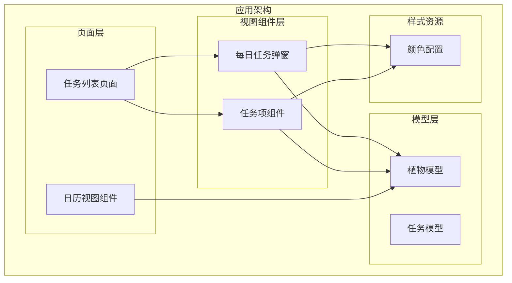
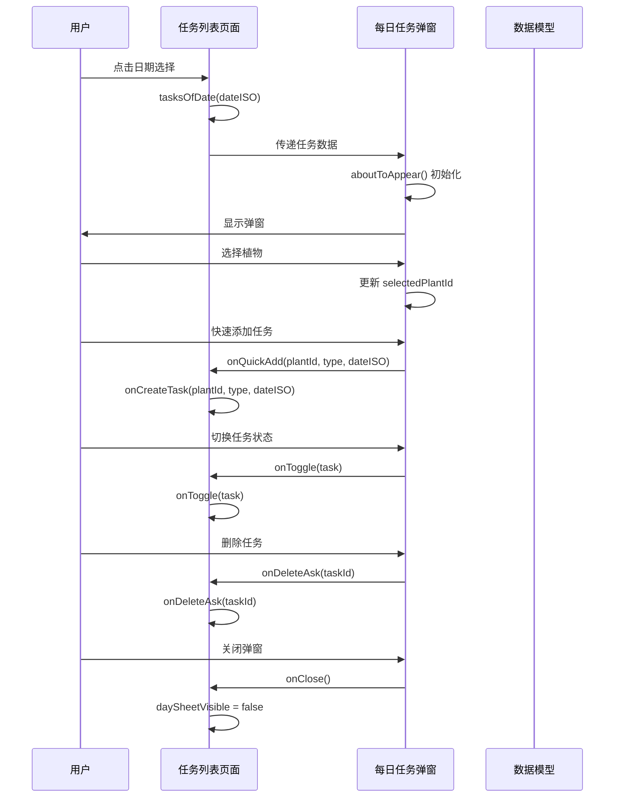
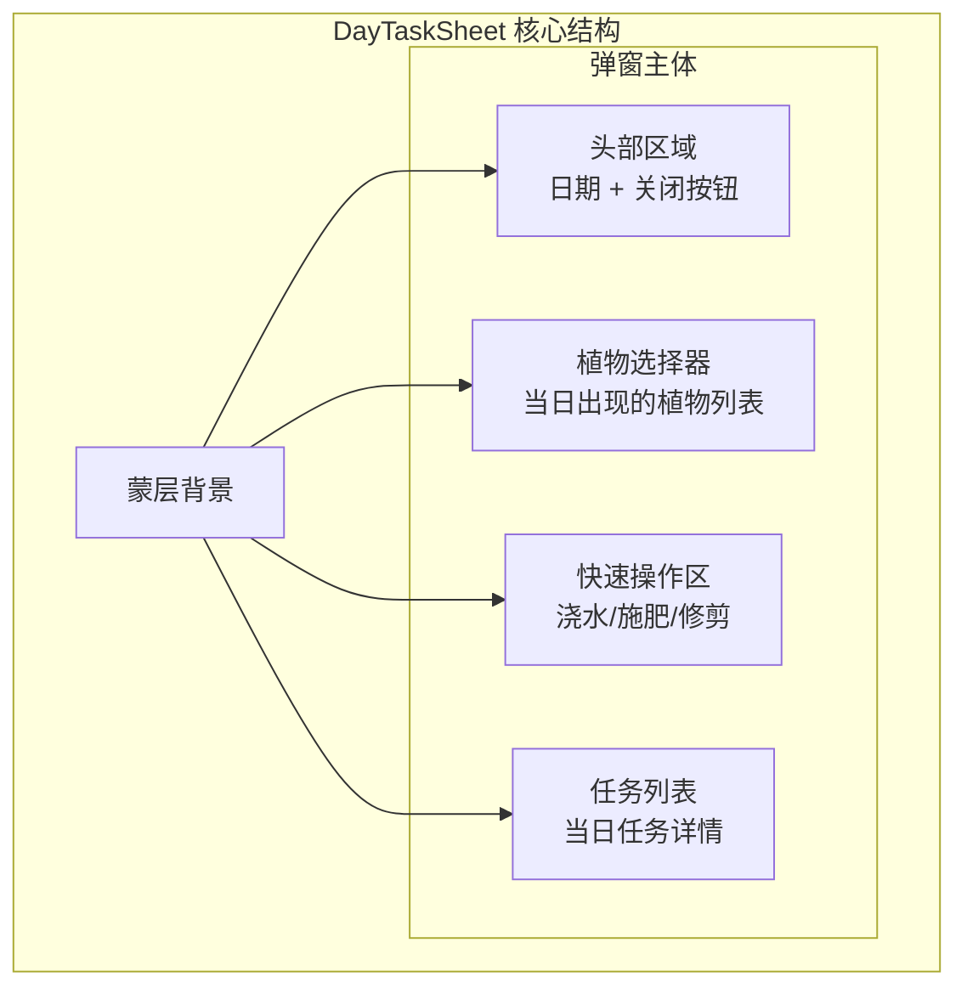
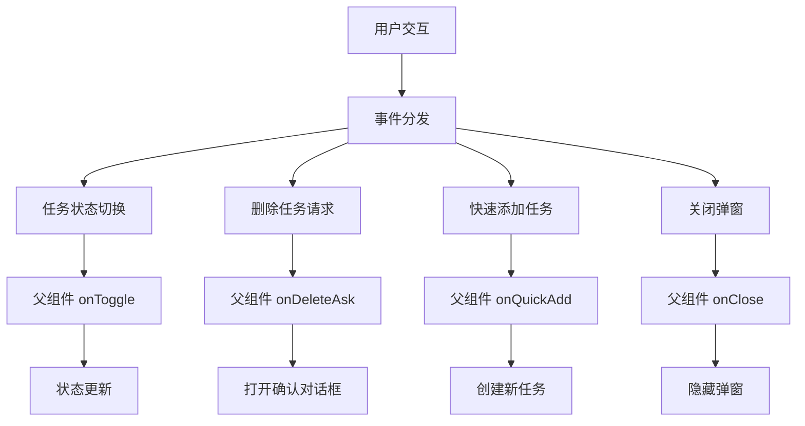
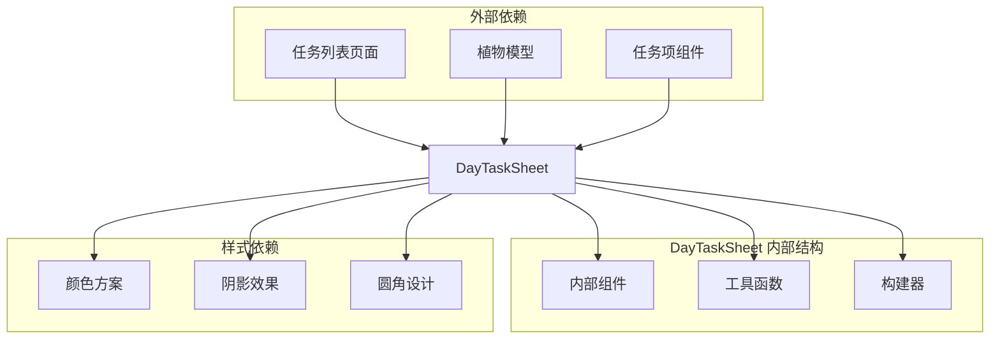

# DayTaskSheet 每日任务弹窗

<cite>
**本文档引用的文件**
- [DayTaskSheet.ets](file://entry/src/main/ets/view/DayTaskSheet.ets)
- [TaskListPage.ets](file://entry/src/main/ets/pages/TaskListPage.ets)
- [PlantModel.ets](file://entry/src/main/ets/model/PlantModel.ets)
- [TaskItem.ets](file://entry/src/main/ets/view/TaskItem.ets)
- [CalendarView.ets](file://entry/src/main/ets/view/CalendarView.ets)
</cite>

## 目录
1. [简介](#简介)
2. [项目结构](#项目结构)
3. [核心组件](#核心组件)
4. [架构概览](#架构概览)
5. [详细组件分析](#详细组件分析)
6. [依赖关系分析](#依赖关系分析)
7. [性能考虑](#性能考虑)
8. [故障排除指南](#故障排除指南)
9. [结论](#结论)
10. [附录](#附录)

## 简介
DayTaskSheet 是 PlantDiary 应用中的每日任务弹窗组件，用于展示指定日期的所有植物养护任务。该组件提供了完整的任务查看、筛选和操作功能，包括任务状态切换、快速新建任务、任务删除确认以及植物选择等功能。组件采用抽屉式弹窗设计，支持蒙层点击关闭和滑动关闭等交互方式。

## 项目结构
DayTaskSheet 组件位于应用的视图层，与任务列表页面紧密集成，形成完整的任务管理界面体系。



**图表来源**
- [DayTaskSheet.ets:1-228](file://entry/src/main/ets/view/DayTaskSheet.ets#L1-L228)
- [TaskListPage.ets:1-463](file://entry/src/main/ets/pages/TaskListPage.ets#L1-L463)
- [PlantModel.ets:1-166](file://entry/src/main/ets/model/PlantModel.ets#L1-L166)

**章节来源**
- [DayTaskSheet.ets:1-228](file://entry/src/main/ets/view/DayTaskSheet.ets#L1-L228)
- [TaskListPage.ets:1-463](file://entry/src/main/ets/pages/TaskListPage.ets#L1-L463)

## 核心组件
DayTaskSheet 组件是一个基于 ArkTS 的自定义组件，具有以下核心特性：

### 主要功能模块
- **任务显示**：展示指定日期的所有植物养护任务
- **植物筛选**：按植物类型筛选当日任务
- **快速操作**：提供一键添加不同类型任务的功能
- **状态管理**：维护选中植物状态和任务状态
- **交互控制**：支持多种用户交互方式

### 组件属性参数
组件通过参数接收外部数据，所有参数均为必需参数：

| 参数名称 | 类型 | 描述 | 必需性 |
|---------|------|------|--------|
| dateISO | string | 目标日期的 ISO 格式字符串（YYYY-MM-DD） | ✅ |
| tasks | Array<PlantTask> | 当日所有任务的数组 | ✅ |
| plants | Array<Plant> | 所有植物的数组 | ✅ |
| onToggle | (t: PlantTask) => void | 任务状态切换回调函数 | ✅ |
| onDeleteAsk | (taskId: number) => void | 删除任务请求回调函数 | ✅ |
| onQuickAdd | (plantId: number, type: string, dateISO: string) => void | 快速添加任务回调函数 | ✅ |
| onClose | () => void | 弹窗关闭回调函数 | ✅ |

### 内部状态管理
组件维护以下内部状态：

| 状态名称 | 类型 | 默认值 | 描述 |
|---------|------|--------|------|
| selectedPlantId | number | 0 | 当前选中的植物 ID |
| aboutToAppear | 生命周期钩子 | - | 组件出现时的初始化逻辑 |

**章节来源**
- [DayTaskSheet.ets:5-11](file://entry/src/main/ets/view/DayTaskSheet.ets#L5-L11)
- [DayTaskSheet.ets:12](file://entry/src/main/ets/view/DayTaskSheet.ets#L12)

## 架构概览
DayTaskSheet 组件采用分层架构设计，与任务列表页面形成清晰的职责分离。



**图表来源**
- [TaskListPage.ets:41-52](file://entry/src/main/ets/pages/TaskListPage.ets#L41-L52)
- [TaskListPage.ets:316-334](file://entry/src/main/ets/pages/TaskListPage.ets#L316-L334)
- [DayTaskSheet.ets:14-21](file://entry/src/main/ets/view/DayTaskSheet.ets#L14-L21)

## 详细组件分析

### 组件结构设计
DayTaskSheet 采用卡片式抽屉设计，具有以下层次结构：



**图表来源**
- [DayTaskSheet.ets:73-158](file://entry/src/main/ets/view/DayTaskSheet.ets#L73-L158)

### 任务显示功能
组件的核心功能是展示指定日期的任务列表，采用以下设计原则：

#### 任务列表渲染
- 使用 List 组件实现滚动列表
- 支持 EdgeEffect 弹性效果
- 每个任务项包含状态标记、任务类型、植物名称和计划日期

#### 任务状态管理
- 支持任务完成状态切换（✅/⬜）
- 实时更新任务状态并在父组件中同步
- 提供视觉反馈动画效果

**章节来源**
- [DayTaskSheet.ets:125-139](file://entry/src/main/ets/view/DayTaskSheet.ets#L125-L139)
- [DayTaskSheet.ets:200-226](file://entry/src/main/ets/view/DayTaskSheet.ets#L200-L226)

### 日期选择机制
组件通过外部传入的 dateISO 参数确定目标日期，无需内部日期选择器：

#### 日期显示
- 直接显示传入的日期字符串
- 格式为 ISO 8601 标准（YYYY-MM-DD）

#### 日期验证
- 通过外部页面确保传入的有效性
- 支持任意有效日期的选择

**章节来源**
- [DayTaskSheet.ets:5](file://entry/src/main/ets/view/DayTaskSheet.ets#L5)
- [DayTaskSheet.ets:84](file://entry/src/main/ets/view/DayTaskSheet.ets#L84)

### 任务筛选逻辑
组件实现了多维度的任务筛选和组织功能：

#### 植物筛选
- 自动提取当日出现的不同植物 ID
- 生成植物选择芯片（Chip）进行筛选
- 支持单选模式，选中状态有明确视觉标识

#### 快速添加功能
- 提供三种快速添加按钮（浇水、施肥、修剪）
- 根据选中植物自动填充添加信息
- 禁用状态下提供友好的用户提示

**章节来源**
- [DayTaskSheet.ets:35-57](file://entry/src/main/ets/view/DayTaskSheet.ets#L35-L57)
- [DayTaskSheet.ets:160-177](file://entry/src/main/ets/view/DayTaskSheet.ets#L160-L177)
- [DayTaskSheet.ets:179-198](file://entry/src/main/ets/view/DayTaskSheet.ets#L179-L198)

### 事件处理机制
组件通过回调函数与父组件进行通信，实现完整的事件处理链路：



**图表来源**
- [DayTaskSheet.ets:203-205](file://entry/src/main/ets/view/DayTaskSheet.ets#L203-L205)
- [DayTaskSheet.ets:215-217](file://entry/src/main/ets/view/DayTaskSheet.ets#L215-L217)
- [DayTaskSheet.ets:193-197](file://entry/src/main/ets/view/DayTaskSheet.ets#L193-L197)
- [DayTaskSheet.ets:86-88](file://entry/src/main/ets/view/DayTaskSheet.ets#L86-L88)

### 状态管理
组件采用最小化状态设计，仅维护必要的交互状态：

#### 初始化逻辑
- 在组件出现时自动选择第一个任务对应的植物
- 若无任务则保持默认状态（selectedPlantId = 0）

#### 状态更新
- 植物选择状态实时更新
- 任务状态切换通过回调函数通知父组件

**章节来源**
- [DayTaskSheet.ets:14-21](file://entry/src/main/ets/view/DayTaskSheet.ets#L14-L21)
- [DayTaskSheet.ets:174-176](file://entry/src/main/ets/view/DayTaskSheet.ets#L174-L176)

### 动画与交互流程
组件实现了丰富的动画效果和交互体验：

#### 打开关闭动画
- 抽屉式弹出效果，从底部向上滑入
- 蒙层淡入显示，提供视觉焦点
- 支持点击蒙层区域关闭弹窗

#### 任务状态切换动画
- 完成状态切换时的图标缩放动画
- 文本装饰线的平滑过渡效果
- 整体布局的弹性动画

#### 交互反馈
- 按钮点击的触摸反馈效果
- 选中状态的颜色变化
- 阴影和圆角的视觉层次

**章节来源**
- [DayTaskSheet.ets:149](file://entry/src/main/ets/view/DayTaskSheet.ets#L149)
- [DayTaskSheet.ets:203-205](file://entry/src/main/ets/view/DayTaskSheet.ets#L203-L205)
- [DayTaskSheet.ets:21-21](file://entry/src/main/ets/view/DayTaskSheet.ets#L21)

### 内容布局与样式
组件采用现代化的卡片式设计，具有以下布局特点：

#### 布局结构
- 顶部：日期显示 + 关闭按钮
- 中部：植物选择芯片组
- 底部：快速添加按钮 + 任务列表
- 蒙层背景 + 半透明弹窗主体

#### 样式特征
- 圆角设计（顶部圆角，底部直角）
- 阴影效果增强立体感
- 渐变色彩方案
- 响应式间距设计

**章节来源**
- [DayTaskSheet.ets:143-148](file://entry/src/main/ets/view/DayTaskSheet.ets#L143-L148)
- [DayTaskSheet.ets:150-155](file://entry/src/main/ets/view/DayTaskSheet.ets#L150-L155)

## 依赖关系分析

### 组件间依赖
DayTaskSheet 与其他组件形成了清晰的依赖关系：



**图表来源**
- [DayTaskSheet.ets:1-1](file://entry/src/main/ets/view/DayTaskSheet.ets#L1-L1)
- [TaskListPage.ets:4-4](file://entry/src/main/ets/pages/TaskListPage.ets#L4-L4)

### 数据流分析
组件的数据流遵循单向数据绑定原则：

#### 输入数据流
- 外部页面传递的日期、任务和植物数据
- 回调函数作为事件处理器

#### 输出数据流
- 用户交互产生的事件
- 状态变化的通知

#### 状态流
- 组件内部状态的局部更新
- 通过回调函数传播到父组件

**章节来源**
- [DayTaskSheet.ets:5-11](file://entry/src/main/ets/view/DayTaskSheet.ets#L5-L11)
- [TaskListPage.ets:316-334](file://entry/src/main/ets/pages/TaskListPage.ets#L316-L334)

## 性能考虑
DayTaskSheet 组件在设计时充分考虑了性能优化：

### 渲染优化
- 使用 @Builder 装饰器优化构建器函数
- 合理的组件层级深度，避免过度嵌套
- 条件渲染减少不必要的 DOM 结构

### 内存管理
- 最小化内部状态存储
- 及时释放不需要的变量
- 避免内存泄漏的事件监听器

### 动画性能
- 使用硬件加速的动画属性
- 控制动画数量和复杂度
- 合理设置动画持续时间和缓动函数

## 故障排除指南

### 常见问题及解决方案

#### 问题：任务列表为空时显示异常
**症状**：当指定日期没有任务时，界面显示不正确
**解决方案**：
- 检查外部页面是否正确过滤任务
- 确认 dateISO 格式是否为 ISO 8601 标准
- 验证 tasks 数组是否包含正确的任务数据

#### 问题：植物选择功能失效
**症状**：植物芯片无法点击或状态不更新
**解决方案**：
- 检查 plants 参数是否正确传入
- 确认 selectedPlantId 状态更新逻辑
- 验证 onClick 事件绑定是否正常

#### 问题：快速添加功能不可用
**症状**：快速添加按钮灰色不可点击
**解决方案**：
- 确认 selectedPlantId 是否为 0
- 检查 onQuickAdd 回调函数是否正确实现
- 验证植物选择状态与按钮状态的关联

**章节来源**
- [DayTaskSheet.ets:120-124](file://entry/src/main/ets/view/DayTaskSheet.ets#L120-L124)
- [DayTaskSheet.ets:113-117](file://entry/src/main/ets/view/DayTaskSheet.ets#L113-L117)

## 结论
DayTaskSheet 每日任务弹窗组件是一个设计精良的任务管理组件，具有以下优势：

### 设计亮点
- **清晰的职责分离**：与任务列表页面形成良好的协作关系
- **直观的用户界面**：卡片式设计符合移动端使用习惯
- **完整的功能覆盖**：从任务查看到操作执行的一站式解决方案
- **优秀的用户体验**：丰富的动画效果和交互反馈

### 技术特色
- **类型安全**：完整的 TypeScript 类型定义
- **性能优化**：合理的渲染策略和状态管理
- **可扩展性**：清晰的接口设计便于功能扩展
- **可维护性**：模块化的代码结构便于维护

该组件为 PlantDiary 应用提供了可靠的每日任务管理能力，是应用界面设计的优秀范例。

## 附录

### 组件使用示例
在任务列表页面中集成 DayTaskSheet 的完整示例：

```typescript
// 在任务列表页面中使用
if (this.daySheetVisible) {
  DayTaskSheet({
    dateISO: this.selectedDateISO,
    tasks: this.tasksOfDate(this.selectedDateISO),
    plants: this.plants,
    onToggle: (t: PlantTask) => {
      this.onToggle(t)
    },
    onDeleteAsk: (id: number) => {
      this.onDeleteAsk(id)
    },
    onQuickAdd: (plantId: number, type: string, dateISO: string) => {
      this.onCreateTask(plantId, type, dateISO)
    },
    onClose: () => {
      this.daySheetVisible = false
    }
  })
}
```

### 样式定制选项
组件支持以下样式定制：

| 样式属性 | 默认值 | 可定制性 | 说明 |
|---------|--------|----------|------|
| 背景色 | 白色 (#FFFFFF) | ✅ | 可根据主题调整 |
| 圆角半径 | 顶部 20px | ✅ | 支持完全自定义 |
| 阴影效果 | 半透明阴影 | ✅ | 可调整强度和方向 |
| 字体颜色 | 深灰 (#FF263238) | ✅ | 支持主题色系 |
| 按钮样式 | 圆角矩形 | ✅ | 可调整尺寸和形状 |

### 响应式设计考虑
组件具备良好的响应式特性：

- **屏幕适配**：宽度固定为 100%，高度自适应
- **触摸交互**：支持触摸反馈和手势操作
- **动画适配**：根据设备性能调整动画复杂度
- **字体缩放**：支持系统字体大小设置