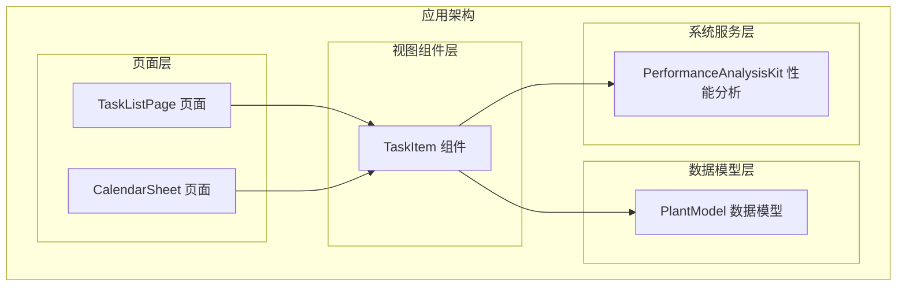
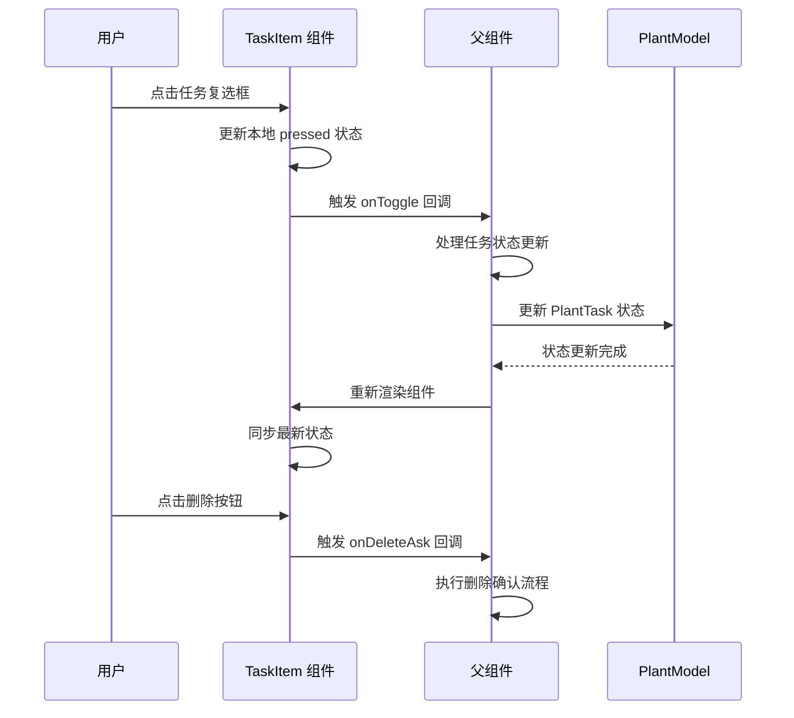
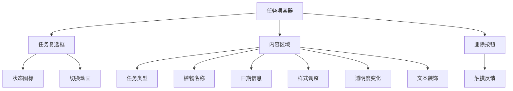
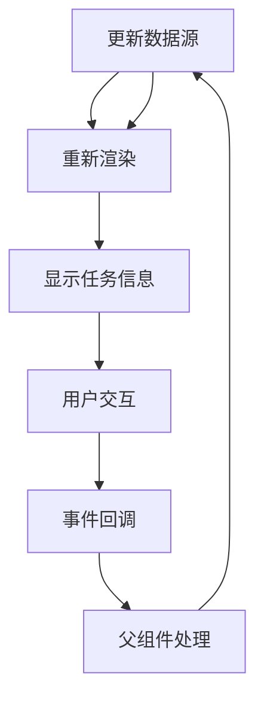
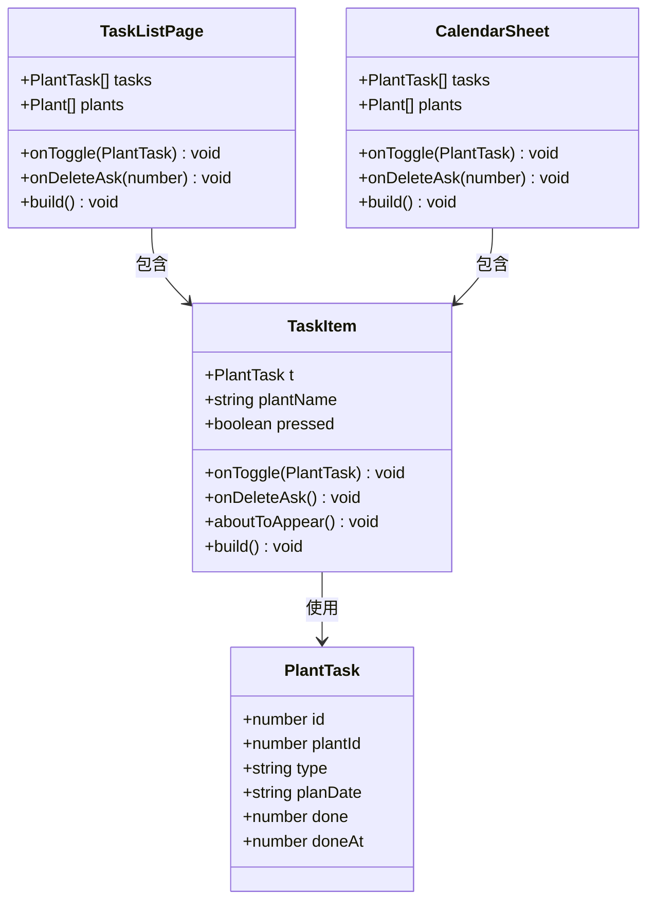
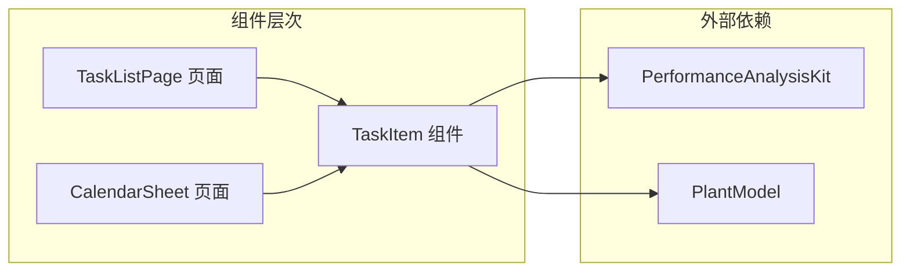

# TaskItem 任务项组件

<cite>
**本文档引用的文件**
- [TaskItem.ets](file://entry/src/main/ets/view/TaskItem.ets)
- [TaskListPage.ets](file://entry/src/main/ets/pages/TaskListPage.ets)
- [CalendarSheet.ets](file://entry/src/main/ets/pages/CalendarSheet.ets)
- [PlantModel.ets](file://entry/src/main/ets/model/PlantModel.ets)
</cite>

## 目录
1. [简介](#简介)
2. [项目结构](#项目结构)
3. [核心组件](#核心组件)
4. [架构概览](#架构概览)
5. [详细组件分析](#详细组件分析)
6. [依赖关系分析](#依赖关系分析)
7. [性能考虑](#性能考虑)
8. [故障排除指南](#故障排除指南)
9. [结论](#结论)

## 简介

TaskItem 是 PlantDiary 应用中的一个核心任务项展示组件，采用 ArkTS 构建。该组件负责显示单个植物养护任务的状态、类型、计划日期和关联植物名称，并提供用户交互功能，如任务完成状态切换和删除操作。

该组件设计遵循"轻量级展示组件"的理念，主要承担数据展示和交互回调职责，真正的状态管理由父组件负责。组件支持动画效果、触摸反馈和响应式设计，为用户提供流畅的交互体验。

## 项目结构

TaskItem 组件位于应用的视图层，与页面组件和数据模型形成清晰的分层架构：

**图表来源**
- [TaskItem.ets:1-67](file://entry/src/main/ets/view/TaskItem.ets#L1-L67)
- [TaskListPage.ets:1-463](file://entry/src/main/ets/pages/TaskListPage.ets#L1-L463)
- [CalendarSheet.ets:1-504](file://entry/src/main/ets/pages/CalendarSheet.ets#L1-L504)

**章节来源**
- [TaskItem.ets:1-67](file://entry/src/main/ets/view/TaskItem.ets#L1-L67)
- [PlantModel.ets:42-59](file://entry/src/main/ets/model/PlantModel.ets#L42-L59)

## 核心组件

### 组件属性定义

TaskItem 组件通过装饰器语法定义了以下核心属性：

| 属性 | 类型 | 必需性 | 描述 |
|------|------|--------|------|
| `t` | `PlantTask` | 必需 | 任务数据对象，包含任务的基本信息和状态 |
| `plantName` | `string` | 必需 | 关联植物的名称，用于显示任务与植物的对应关系 |

**章节来源**
- [TaskItem.ets:7-8](file://entry/src/main/ets/view/TaskItem.ets#L7-L8)

### 事件回调接口

组件定义了两个事件回调接口，用于与父组件进行数据传递：

| 事件 | 参数类型 | 返回值 | 描述 |
|------|----------|--------|------|
| `onToggle` | `(pt: PlantTask) => void` | `void` | 任务状态切换事件回调，通知父组件任务完成状态的变更 |
| `onDeleteAsk` | `() => void` | `void` | 删除确认事件回调，请求父组件执行删除操作 |

**章节来源**
- [TaskItem.ets:9-10](file://entry/src/main/ets/view/TaskItem.ets#L9-L10)

### 本地状态管理

组件内部维护了一个本地状态变量：

| 状态 | 类型 | 默认值 | 描述 |
|------|------|--------|------|
| `pressed` | `boolean` | `false` | 触摸状态标志，用于控制按钮按下时的视觉反馈效果 |

**章节来源**
- [TaskItem.ets:11](file://entry/src/main/ets/view/TaskItem.ets#L11)

## 架构概览

TaskItem 组件在整个应用架构中扮演着重要的角色，它作为视图层的核心组件，连接着页面组件和数据模型层：

**图表来源**
- [TaskItem.ets:17-65](file://entry/src/main/ets/view/TaskItem.ets#L17-L65)
- [TaskListPage.ets:217-227](file://entry/src/main/ets/pages/TaskListPage.ets#L217-L227)

## 详细组件分析

### UI 结构设计

TaskItem 组件采用简洁而直观的布局结构，主要包含以下元素：

**图表来源**
- [TaskItem.ets:17-65](file://entry/src/main/ets/view/TaskItem.ets#L17-L65)

### 交互行为实现

#### 任务完成状态切换

组件实现了完整的任务状态切换交互流程：

1. **状态切换逻辑**：点击复选框时，组件立即更新本地状态以提供即时反馈
2. **回调触发**：同时向父组件发送状态变更通知
3. **状态同步**：最终以父组件的重载结果为准进行状态校正

#### 触摸反馈效果

组件通过本地状态管理实现了丰富的触摸反馈：

- **按下效果**：触摸按下时缩小 2% 的视觉效果
- **释放效果**：触摸释放时恢复原始尺寸
- **平滑过渡**：使用 250ms 的缓动曲线确保动画流畅

#### 文本样式变化

组件根据任务完成状态动态调整文本样式：

- **完成状态**：文本采用 0.6 透明度和删除线装饰
- **未完成状态**：文本保持 1.0 透明度和常规样式
- **字体大小**：主标题 15px，副标题 12px，图标 20px

**章节来源**
- [TaskItem.ets:17-65](file://entry/src/main/ets/view/TaskItem.ets#L17-L65)

### 数据流管理

TaskItem 组件采用"单向数据流"的设计原则：

**图表来源**
- [TaskItem.ets:17-27](file://entry/src/main/ets/view/TaskItem.ets#L17-L27)
- [TaskListPage.ets:217-227](file://entry/src/main/ets/pages/TaskListPage.ets#L217-L227)

**章节来源**
- [TaskItem.ets:17-27](file://entry/src/main/ets/view/TaskItem.ets#L17-L27)
- [TaskListPage.ets:217-227](file://entry/src/main/ets/pages/TaskListPage.ets#L217-L227)

### 组件类图

**图表来源**
- [TaskItem.ets:5-11](file://entry/src/main/ets/view/TaskItem.ets#L5-L11)
- [PlantModel.ets:42-59](file://entry/src/main/ets/model/PlantModel.ets#L42-L59)
- [TaskListPage.ets:6-12](file://entry/src/main/ets/pages/TaskListPage.ets#L6-L12)
- [CalendarSheet.ets:17-31](file://entry/src/main/ets/pages/CalendarSheet.ets#L17-L31)

## 依赖关系分析

### 组件间依赖关系

TaskItem 组件与页面组件和数据模型之间的依赖关系如下：

**图表来源**
- [TaskItem.ets:1-2](file://entry/src/main/ets/view/TaskItem.ets#L1-L2)
- [TaskListPage.ets:1-2](file://entry/src/main/ets/pages/TaskListPage.ets#L1-L2)
- [CalendarSheet.ets:1-2](file://entry/src/main/ets/pages/CalendarSheet.ets#L1-L2)

### 数据模型依赖

PlantTask 数据模型为 TaskItem 提供了完整的信息支撑：

| 字段 | 类型 | 描述 |
|------|------|------|
| `id` | `number` | 任务唯一标识符 |
| `plantId` | `number` | 关联植物的标识符 |
| `type` | `string` | 任务类型（如：浇水、施肥、修剪） |
| `planDate` | `string` | 任务计划日期（ISO格式：YYYY-MM-DD） |
| `done` | `number` | 完成状态（0：未完成，1：已完成） |
| `doneAt` | `number` | 完成时间戳 |

**章节来源**
- [PlantModel.ets:42-59](file://entry/src/main/ets/model/PlantModel.ets#L42-L59)

## 性能考虑

### 动画优化

TaskItem 组件在性能方面采用了多项优化措施：

- **局部动画**：仅对必要的 UI 元素应用动画效果，避免全局重绘
- **缓动曲线**：使用合适的缓动函数确保动画流畅性
- **状态同步**：通过本地状态提供即时反馈，减少用户等待感

### 内存管理

组件遵循轻量级设计原则：
- **无复杂状态树**：仅维护必要的本地状态
- **及时清理**：组件生命周期结束时自动清理资源
- **最小化依赖**：仅依赖必要的外部模块

## 故障排除指南

### 常见问题及解决方案

#### 任务状态不同步问题

**问题描述**：点击任务复选框后，状态切换但很快恢复原状

**可能原因**：
- 父组件未正确处理状态更新
- 数据源未同步更新

**解决方案**：
1. 检查父组件的 `onToggle` 回调实现
2. 确认 `PlantTask` 对象的引用是否正确传递
3. 验证数据源的响应式更新机制

#### 触摸反馈失效

**问题描述**：点击按钮时没有缩放效果

**可能原因**：
- `pressed` 状态未正确更新
- 触摸事件监听器未正确绑定

**解决方案**：
1. 检查 `onTouch` 事件处理器的实现
2. 验证本地状态更新逻辑
3. 确认动画配置参数

#### 文本样式异常

**问题描述**：完成状态下的文本样式不符合预期

**可能原因**：
- `done` 字段值不是 0 或 1
- 样式计算逻辑错误

**解决方案**：
1. 验证 `PlantTask.done` 字段的取值范围
2. 检查条件判断逻辑
3. 确认样式属性的正确应用

**章节来源**
- [TaskItem.ets:13-15](file://entry/src/main/ets/view/TaskItem.ets#L13-L15)
- [TaskItem.ets:56-63](file://entry/src/main/ets/view/TaskItem.ets#L56-L63)

## 结论

TaskItem 任务项组件是一个设计精良的轻量级视图组件，成功实现了以下目标：

### 设计优势

1. **清晰的职责分离**：组件专注于展示和交互，状态管理交由父组件处理
2. **优秀的用户体验**：提供了流畅的动画效果和即时的触摸反馈
3. **良好的可维护性**：简洁的代码结构和明确的接口定义
4. **高效的性能表现**：合理的动画优化和内存管理策略

### 最佳实践建议

1. **状态管理**：始终确保父组件正确处理状态更新和同步
2. **事件处理**：在父组件中实现健壮的回调处理逻辑
3. **数据验证**：确保传入的 `PlantTask` 对象数据完整性
4. **性能监控**：利用内置的性能分析工具监控组件表现

TaskItem 组件为 PlantDiary 应用提供了可靠的基础设施，支持用户高效地管理和跟踪植物养护任务。其设计原则和实现模式可以作为其他类似组件开发的参考模板。