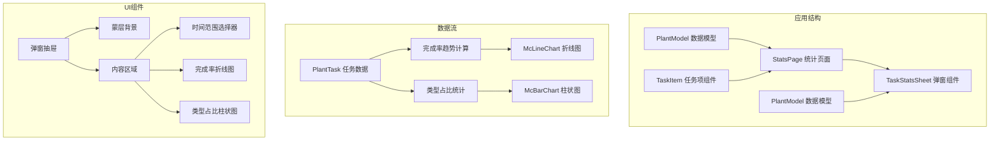
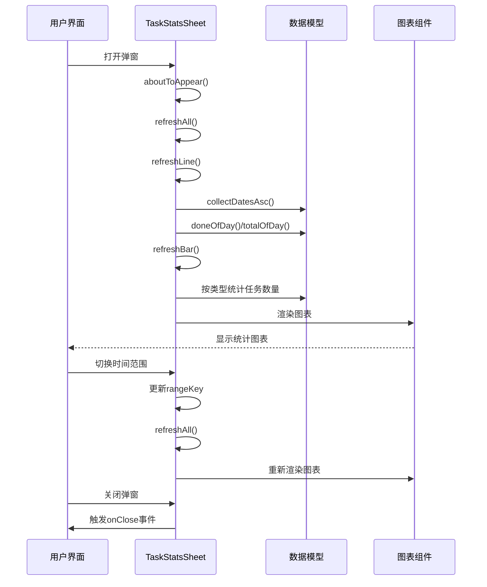
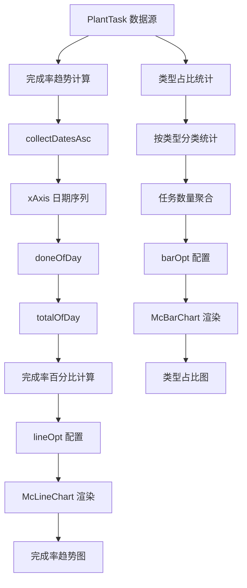
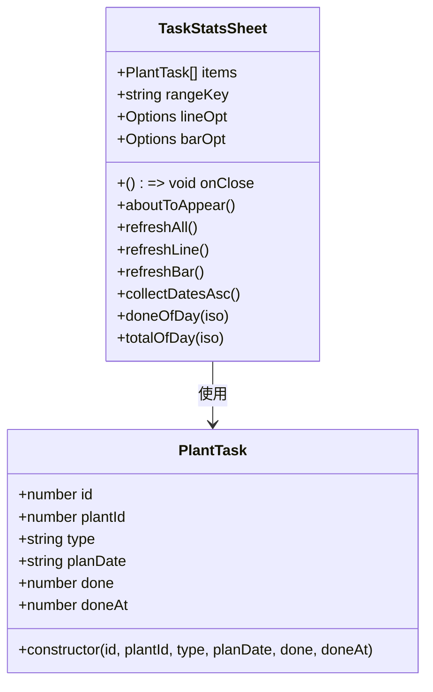
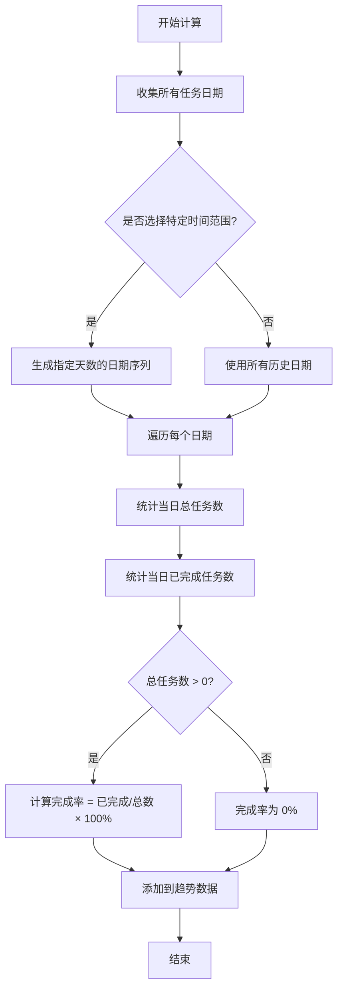
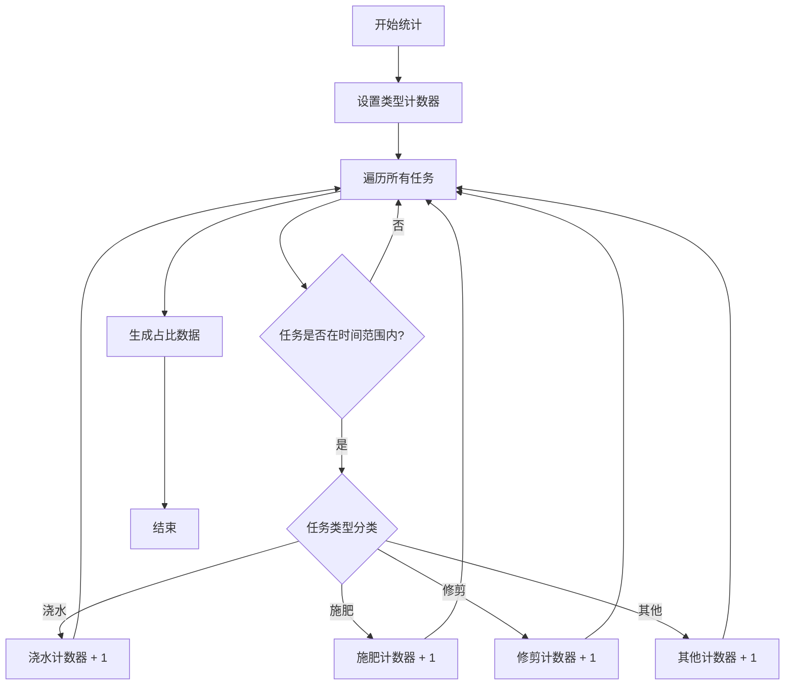
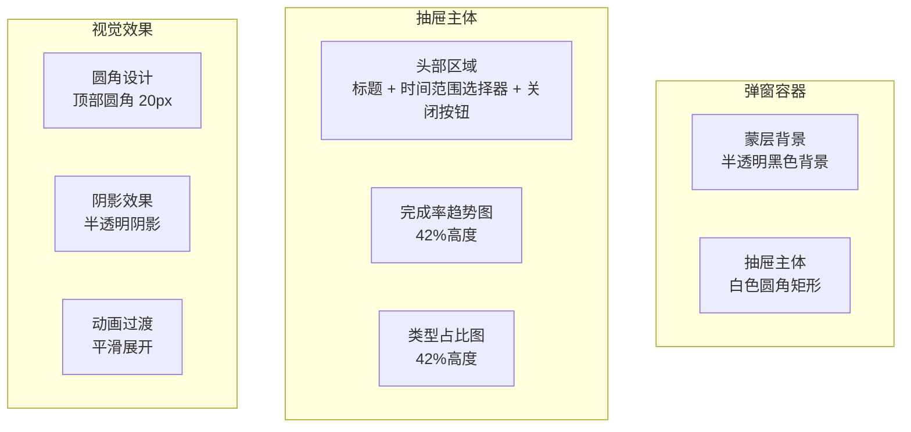
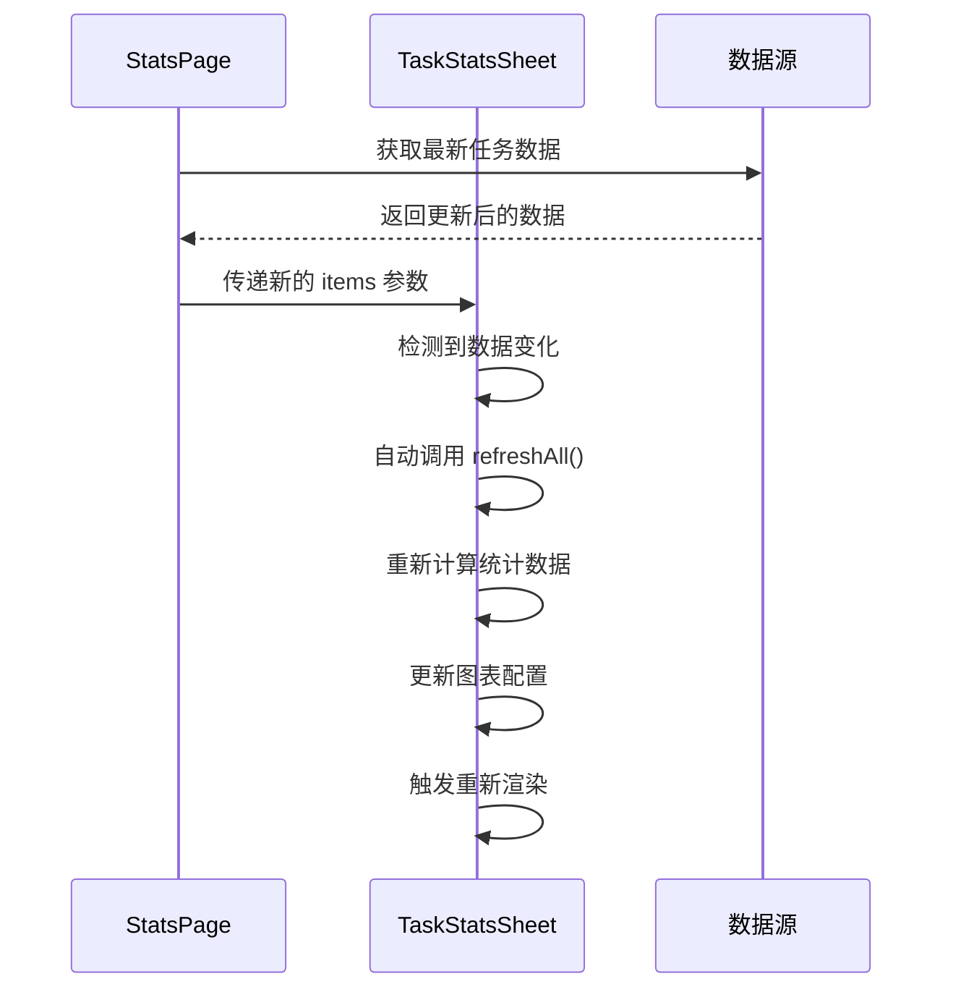

# TaskStatsSheet 任务统计弹窗

<cite>
**本文档引用的文件**
- [TaskStatsSheet.ets](file://entry/src/main/ets/view/TaskStatsSheet.ets)
- [PlantModel.ets](file://entry/src/main/ets/model/PlantModel.ets)
- [StatsPage.ets](file://entry/src/main/ets/pages/StatsPage.ets)
- [TaskItem.ets](file://entry/src/main/ets/view/TaskItem.ets)
- [color.json](file://entry/src/main/resources/base/element/color.json)
</cite>

## 目录
1. [简介](#简介)
2. [项目结构](#项目结构)
3. [核心组件](#核心组件)
4. [架构概览](#架构概览)
5. [详细组件分析](#详细组件分析)
6. [依赖关系分析](#依赖关系分析)
7. [性能考虑](#性能考虑)
8. [故障排除指南](#故障排除指南)
9. [结论](#结论)
10. [附录](#附录)

## 简介

TaskStatsSheet 是 PlantDiary 应用中的一个专门用于展示任务统计信息的弹窗组件。该组件提供了两个核心统计图表：完成率趋势折线图和任务类型占比柱状图，帮助用户直观地了解植物养护任务的执行情况和分布特征。

该组件采用弹窗抽屉式设计，支持时间范围选择（近30天、近90天、全部），并集成了完整的数据聚合算法和图表渲染功能。组件完全基于内存中的 PlantTask 数据进行实时计算，无需额外的数据持久化操作。

## 项目结构

TaskStatsSheet 组件位于应用的视图层，与 PlantModel 数据模型紧密集成，同时与 StatsPage 统计页面形成完整的统计功能体系。



**图表来源**
- [TaskStatsSheet.ets:1-273](file://entry/src/main/ets/view/TaskStatsSheet.ets#L1-L273)
- [PlantModel.ets:43-59](file://entry/src/main/ets/model/PlantModel.ets#L43-L59)
- [StatsPage.ets:1-442](file://entry/src/main/ets/pages/StatsPage.ets#L1-L442)

**章节来源**
- [TaskStatsSheet.ets:1-273](file://entry/src/main/ets/view/TaskStatsSheet.ets#L1-L273)
- [PlantModel.ets:1-166](file://entry/src/main/ets/model/PlantModel.ets#L1-L166)

## 核心组件

### 组件概述

TaskStatsSheet 是一个基于 ArkTS 的组件，采用结构体组件（struct Component）设计模式，具有以下核心特性：

- **弹窗抽屉式布局**：采用底部上拉抽屉的设计，提供沉浸式的统计查看体验
- **双图表展示**：同时显示完成率趋势和任务类型占比两个维度的统计信息
- **动态时间范围**：支持近30天、近90天、全部三个时间窗口的切换
- **实时数据聚合**：基于传入的 PlantTask 数组进行实时统计计算

### 主要属性和事件

| 属性名称 | 类型 | 必填 | 默认值 | 描述 |
|---------|------|------|--------|------|
| items | Array<PlantTask> | 是 | - | 任务数据数组，支持全量或筛选后的任务集合 |
| onClose | () => void | 是 | - | 弹窗关闭事件回调 |

### 内部状态管理

| 状态名称 | 类型 | 默认值 | 描述 |
|---------|------|--------|------|
| rangeKey | string | '30' | 时间范围选择键值，支持 '30' | '90' | 'all' |
| lineOpt | Options | - | 完成率趋势图表配置对象 |
| barOpt | Options | - | 类型占比图表配置对象 |

**章节来源**
- [TaskStatsSheet.ets:6-8](file://entry/src/main/ets/view/TaskStatsSheet.ets#L6-L8)
- [TaskStatsSheet.ets:9-46](file://entry/src/main/ets/view/TaskStatsSheet.ets#L9-L46)

## 架构概览

TaskStatsSheet 组件采用 MVVM 架构模式，结合了数据驱动的 UI 更新机制和高效的图表渲染系统。



**图表来源**
- [TaskStatsSheet.ets:48-189](file://entry/src/main/ets/view/TaskStatsSheet.ets#L48-L189)

### 数据流架构



**图表来源**
- [TaskStatsSheet.ets:84-184](file://entry/src/main/ets/view/TaskStatsSheet.ets#L84-L184)

## 详细组件分析

### 数据模型定义

TaskStatsSheet 依赖于 PlantModel 中的 PlantTask 数据结构，该结构定义了任务的核心属性：



**图表来源**
- [PlantModel.ets:43-59](file://entry/src/main/ets/model/PlantModel.ets#L43-L59)
- [TaskStatsSheet.ets:5-46](file://entry/src/main/ets/view/TaskStatsSheet.ets#L5-L46)

### 统计算法实现

#### 完成率趋势计算算法

完成率趋势图采用时间序列分析方法，通过以下步骤计算每日完成率：

1. **日期序列生成**：根据选择的时间范围生成连续的日期序列
2. **每日任务统计**：计算每一天的总任务数和已完成任务数
3. **完成率计算**：使用公式 `完成率 = (已完成任务数 / 总任务数) × 100%`



**图表来源**
- [TaskStatsSheet.ets:84-148](file://entry/src/main/ets/view/TaskStatsSheet.ets#L84-L148)

#### 任务类型占比统计算法

类型占比图采用分类统计方法，将任务按照类型进行分组统计：



**图表来源**
- [TaskStatsSheet.ets:151-184](file://entry/src/main/ets/view/TaskStatsSheet.ets#L151-L184)

### 图表配置和渲染

#### 折线图配置（完成率趋势）

完成率趋势图采用 McLineChart 组件，配置包括：

- **标题**：完成率趋势
- **坐标轴**：X轴为日期序列，Y轴为完成率百分比
- **网格**：合理的边距配置确保标签清晰显示
- **工具提示**：启用交互式数据提示
- **系列数据**：完成率百分比序列

#### 柱状图配置（类型占比）

类型占比图采用 McBarChart 组件，配置包括：

- **标题**：类型占比
- **X轴数据**：固定四种类别 ['浇水', '施肥', '修剪', '其他']
- **Y轴**：次数统计
- **系列数据**：各类型的任务数量
- **样式**：简洁的配色方案

### UI布局设计

TaskStatsSheet 采用弹窗抽屉式布局，具有以下设计特点：



**图表来源**
- [TaskStatsSheet.ets:192-252](file://entry/src/main/ets/view/TaskStatsSheet.ets#L192-L252)

#### 颜色方案

组件采用统一的色彩设计：

- **背景色**：白色 (#FFFFFF) 用于抽屉主体
- **文字色**：深灰色 (#FF263238) 用于主要文本
- **辅助色**：浅灰色 (#FFECEFF1) 用于按钮和标签
- **蒙层色**：半透明黑色 (0x66000000) 用于背景遮罩
- **阴影色**：半透明黑色 (0x33000000) 用于立体感

#### 交互功能

- **时间范围切换**：三种预设时间窗口的快速切换
- **点击外部关闭**：点击蒙层背景自动关闭弹窗
- **动画过渡**：平滑的弹出和收起动画效果
- **响应式布局**：自适应不同屏幕尺寸

**章节来源**
- [TaskStatsSheet.ets:192-273](file://entry/src/main/ets/view/TaskStatsSheet.ets#L192-L273)

## 依赖关系分析

### 组件间依赖关系

```mermaid
graph LR
subgraph "外部依赖"
A[@mcui/mccharts<br/>图表组件库]
end
subgraph "内部依赖"
B[PlantModel<br/>数据模型]
C[TaskItem<br/>任务项组件]
end
subgraph "TaskStatsSheet"
D[主组件]
E[日期工具函数]
F[统计计算函数]
G[图表渲染]
end
A --> D
B --> D
C --> D
D --> E
D --> F
D --> G
```

**图表来源**
- [TaskStatsSheet.ets:1-2](file://entry/src/main/ets/view/TaskStatsSheet.ets#L1-L2)

### 数据依赖分析

TaskStatsSheet 对 PlantTask 数据模型的依赖关系：

| 数据字段 | 用途 | 计算方式 |
|---------|------|----------|
| planDate | 日期索引 | 用于时间序列生成和过滤 |
| type | 类型分类 | 用于任务类型统计 |
| done | 完成状态 | 用于完成率计算 |
| doneAt | 完成时间 | 用于时间范围验证 |

### 外部库依赖

组件依赖 @mcui/mccharts 图表库，提供：

- **McLineChart**：折线图组件
- **McBarChart**：柱状图组件  
- **Options**：图表配置选项类

**章节来源**
- [TaskStatsSheet.ets:1-2](file://entry/src/main/ets/view/TaskStatsSheet.ets#L1-L2)
- [PlantModel.ets:43-59](file://entry/src/main/ets/model/PlantModel.ets#L43-L59)

## 性能考虑

### 时间复杂度分析

| 函数 | 时间复杂度 | 空间复杂度 | 说明 |
|------|------------|------------|------|
| collectDatesAsc | O(n log n) | O(n) | n为任务数量，排序为主要开销 |
| doneOfDay | O(n) | O(1) | 线性扫描任务数组 |
| totalOfDay | O(n) | O(1) | 线性扫描任务数组 |
| refreshLine | O(n log n + n×d) | O(n + d) | n为任务数，d为日期天数 |
| refreshBar | O(n) | O(1) | 单次线性扫描 |

### 性能优化建议

1. **数据预处理优化**
   - 在组件外部对任务数据按日期进行预排序
   - 缓存日期序列生成结果，避免重复计算

2. **图表渲染优化**
   - 使用虚拟滚动技术处理大量数据点
   - 实现图表数据的增量更新，避免全量重绘

3. **内存管理**
   - 及时清理不再使用的临时数组和对象
   - 避免在渲染过程中创建新的对象实例

4. **异步处理**
   - 对于大数据集，考虑使用 Web Workers 进行后台计算
   - 实现分批渲染策略，避免主线程阻塞

### 数据更新机制

组件采用响应式数据绑定机制：



**图表来源**
- [TaskStatsSheet.ets:48-50](file://entry/src/main/ets/view/TaskStatsSheet.ets#L48-L50)

## 故障排除指南

### 常见问题及解决方案

#### 问题1：图表数据显示异常

**症状**：完成率趋势图显示错误的数值或空数据

**可能原因**：
- 任务数据格式不正确
- 日期格式不符合 ISO 标准
- 任务状态字段值异常

**解决方法**：
1. 验证 PlantTask 数据结构的完整性
2. 检查 planDate 字段是否为有效的 ISO 日期格式
3. 确认 done 字段只能为 0 或 1

#### 问题2：时间范围选择无效

**症状**：切换时间范围后图表没有更新

**可能原因**：
- rangeKey 状态未正确更新
- refreshAll 方法未被调用
- 日期计算逻辑错误

**解决方法**：
1. 确保点击事件正确更新 rangeKey 状态
2. 验证 refreshAll 方法在状态变更后被调用
3. 检查日期计算函数的边界条件

#### 问题3：内存泄漏问题

**症状**：长时间使用后应用内存占用持续增长

**可能原因**：
- 事件监听器未正确清理
- 大量临时对象未释放
- 图表实例未正确销毁

**解决方法**：
1. 在组件卸载时清理所有事件监听器
2. 及时释放大对象引用
3. 确保图表组件正确销毁

### 调试技巧

1. **日志调试**：在关键计算步骤添加日志输出
2. **数据验证**：在数据进入组件时进行格式验证
3. **边界测试**：测试空数据、极端数据等边界情况
4. **性能监控**：使用性能分析工具监控组件性能

**章节来源**
- [TaskStatsSheet.ets:48-189](file://entry/src/main/ets/view/TaskStatsSheet.ets#L48-L189)

## 结论

TaskStatsSheet 任务统计弹窗组件是一个功能完整、设计精良的统计可视化组件。它成功地将复杂的统计计算逻辑与直观的图表展示相结合，为用户提供了清晰的任务执行情况概览。

组件的主要优势包括：

1. **完整的统计功能**：涵盖时间趋势和类型分布两个重要维度
2. **灵活的时间范围**：支持多种时间窗口的快速切换
3. **优雅的用户体验**：弹窗抽屉式设计提供了良好的交互体验
4. **高效的性能表现**：经过优化的算法确保了良好的响应速度

通过合理的架构设计和严格的代码组织，TaskStatsSheet 为 PlantDiary 应用的统计功能奠定了坚实的基础，同时也为类似的数据可视化需求提供了优秀的参考实现。

## 附录

### API 参考

#### 组件属性

| 属性名 | 类型 | 必填 | 描述 |
|--------|------|------|------|
| items | Array<PlantTask> | 是 | 任务数据数组 |
| onClose | () => void | 是 | 弹窗关闭回调 |

#### 事件处理

| 事件名 | 参数 | 描述 |
|--------|------|------|
| onClose | - | 弹窗关闭事件 |

#### 方法接口

| 方法名 | 参数 | 返回值 | 描述 |
|--------|------|--------|------|
| aboutToAppear | - | void | 组件即将出现时的生命周期钩子 |
| refreshAll | - | void | 刷新所有统计数据 |
| refreshLine | - | void | 刷新完成率趋势数据 |
| refreshBar | - | void | 刷新类型占比数据 |

### 使用示例

```typescript
// 在 StatsPage 中使用 TaskStatsSheet
<TaskStatsSheet
  items={this.filteredTasks}
  onClose={() => this.hideStatsSheet()}
/>
```

### 集成指南

1. **数据准备**：确保传入的 PlantTask 数组格式正确
2. **事件处理**：实现 onClose 回调以控制弹窗显示状态
3. **样式定制**：根据应用主题调整颜色和布局
4. **性能监控**：定期检查组件性能表现