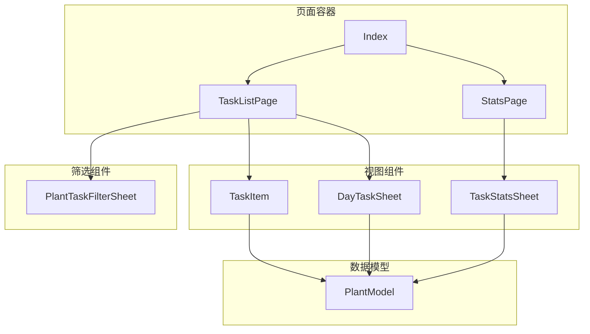
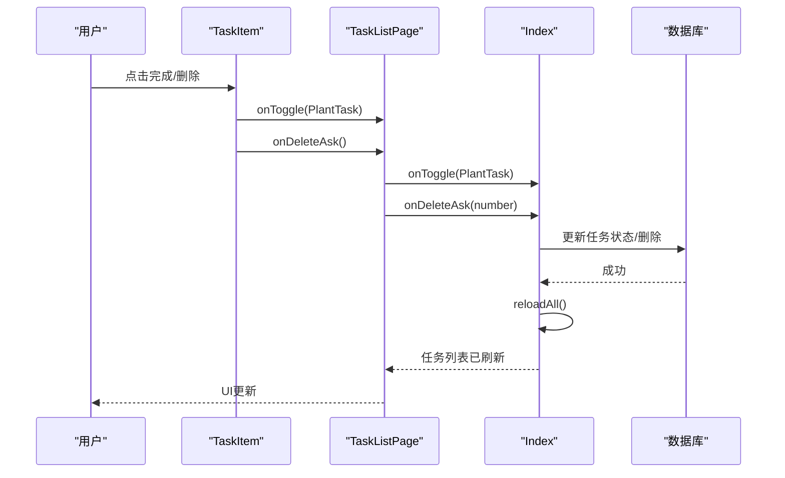
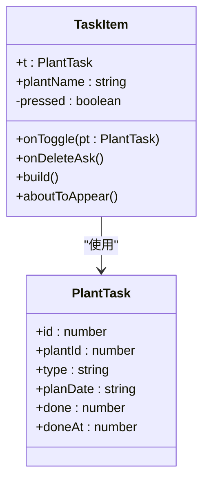
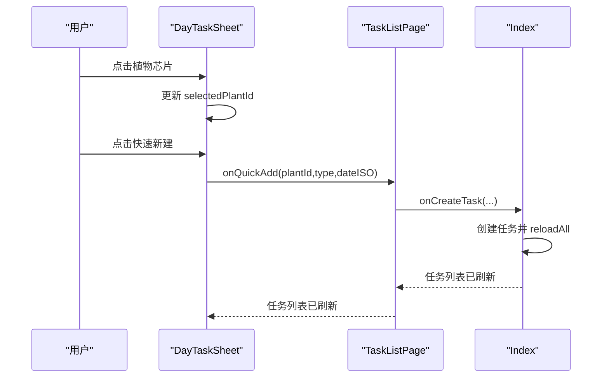
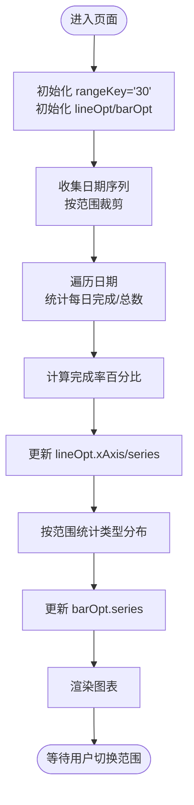
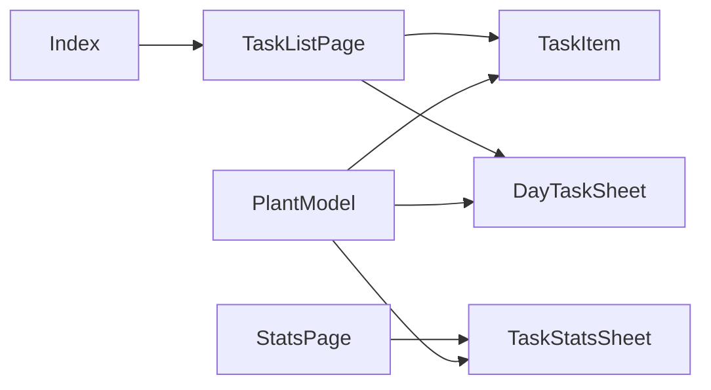

# 任务组件系列

<cite>
**本文档引用的文件**
- [TaskItem.ets](file://entry/src/main/ets/view/TaskItem.ets)
- [DayTaskSheet.ets](file://entry/src/main/ets/view/DayTaskSheet.ets)
- [TaskStatsSheet.ets](file://entry/src/main/ets/view/TaskStatsSheet.ets)
- [TaskListPage.ets](file://entry/src/main/ets/pages/TaskListPage.ets)
- [PlantModel.ets](file://entry/src/main/ets/model/PlantModel.ets)
- [Index.ets](file://entry/src/main/ets/pages/Index.ets)
- [StatsPage.ets](file://entry/src/main/ets/pages/StatsPage.ets)
- [PlantTaskFilterSheet.ets](file://entry/src/main/ets/view/PlantTaskFilterSheet.ets)
</cite>

## 目录
1. [简介](#简介)
2. [项目结构](#项目结构)
3. [核心组件](#核心组件)
4. [架构总览](#架构总览)
5. [详细组件分析](#详细组件分析)
6. [依赖关系分析](#依赖关系分析)
7. [性能考量](#性能考量)
8. [故障排查指南](#故障排查指南)
9. [结论](#结论)
10. [附录](#附录)

## 简介
本文件聚焦于PlantDiary项目中的任务相关组件，系统性梳理以下组件的API定义、状态管理与交互行为：
- TaskItem：单条任务项展示与交互
- DayTaskSheet：每日任务弹窗，支持任务列表、快速新建与删除
- TaskStatsSheet：任务统计弹窗，提供完成率趋势与类型占比分析

同时，文档阐述组件间的状态同步机制、事件传递链路，以及在不同页面中的使用模式与最佳实践，帮助开发者高效集成与扩展任务体系。

## 项目结构
任务组件主要分布在以下模块：
- 视图组件：TaskItem、DayTaskSheet、TaskStatsSheet
- 页面容器：TaskListPage、Index、StatsPage
- 数据模型：Plant、PlantTask、TaskDraft 等
- 筛选组件：PlantTaskFilterSheet

**图表来源**
- [TaskItem.ets:1-67](file://entry/src/main/ets/view/TaskItem.ets#L1-L67)
- [DayTaskSheet.ets:1-228](file://entry/src/main/ets/view/DayTaskSheet.ets#L1-L228)
- [TaskStatsSheet.ets:1-273](file://entry/src/main/ets/view/TaskStatsSheet.ets#L1-L273)
- [TaskListPage.ets:1-463](file://entry/src/main/ets/pages/TaskListPage.ets#L1-L463)
- [Index.ets:1-1382](file://entry/src/main/ets/pages/Index.ets#L1-L1382)
- [StatsPage.ets:1-442](file://entry/src/main/ets/pages/StatsPage.ets#L1-L442)
- [PlantModel.ets:1-166](file://entry/src/main/ets/model/PlantModel.ets#L1-L166)
- [PlantTaskFilterSheet.ets:1-374](file://entry/src/main/ets/view/PlantTaskFilterSheet.ets#L1-L374)

**章节来源**
- [TaskItem.ets:1-67](file://entry/src/main/ets/view/TaskItem.ets#L1-L67)
- [DayTaskSheet.ets:1-228](file://entry/src/main/ets/view/DayTaskSheet.ets#L1-L228)
- [TaskStatsSheet.ets:1-273](file://entry/src/main/ets/view/TaskStatsSheet.ets#L1-L273)
- [TaskListPage.ets:1-463](file://entry/src/main/ets/pages/TaskListPage.ets#L1-L463)
- [Index.ets:1-1382](file://entry/src/main/ets/pages/Index.ets#L1-L1382)
- [StatsPage.ets:1-442](file://entry/src/main/ets/pages/StatsPage.ets#L1-L442)
- [PlantModel.ets:1-166](file://entry/src/main/ets/model/PlantModel.ets#L1-L166)
- [PlantTaskFilterSheet.ets:1-374](file://entry/src/main/ets/view/PlantTaskFilterSheet.ets#L1-L374)

## 核心组件
本节概述三大组件的职责与关键API。

- TaskItem
  - 作用：展示单条任务，提供完成状态切换与删除询问的交互回调
  - 关键属性：t（PlantTask）、plantName（字符串）
  - 关键事件：onToggle(PlantTask)、onDeleteAsk()
  - 本地状态：pressed（触摸反馈）

- DayTaskSheet
  - 作用：按日期聚合展示任务，支持植物筛选、快速新建、删除确认与关闭
  - 关键属性：dateISO（字符串）、tasks（PlantTask[]）、plants（Plant[]）
  - 关键事件：onToggle(PlantTask)、onDeleteAsk(number)、onQuickAdd(number,string,string)、onClose()
  - 本地状态：selectedPlantId（number）

- TaskStatsSheet
  - 作用：展示任务完成率趋势与类型占比，支持时间范围切换
  - 关键属性：items（PlantTask[]）
  - 关键事件：onClose()
  - 本地状态：rangeKey（'30'|'90'|'all'）、lineOpt（Options）、barOpt（Options）

**章节来源**
- [TaskItem.ets:4-11](file://entry/src/main/ets/view/TaskItem.ets#L4-L11)
- [DayTaskSheet.ets:3-11](file://entry/src/main/ets/view/DayTaskSheet.ets#L3-L11)
- [TaskStatsSheet.ets:4-8](file://entry/src/main/ets/view/TaskStatsSheet.ets#L4-L8)

## 架构总览
任务组件围绕“数据驱动 + 事件向上”的模式组织，页面负责状态与筛选，子组件仅负责展示与交互回调，最终由页面统一落库与刷新。

**图表来源**
- [TaskItem.ets:17-65](file://entry/src/main/ets/view/TaskItem.ets#L17-L65)
- [TaskListPage.ets:214-245](file://entry/src/main/ets/pages/TaskListPage.ets#L214-L245)
- [Index.ets:427-437](file://entry/src/main/ets/pages/Index.ets#L427-L437)

## 详细组件分析

### TaskItem 组件
- 属性定义
  - t: PlantTask（必填）
  - plantName: string（必填）
  - onToggle: (pt: PlantTask) => void（必填）
  - onDeleteAsk: () => void（必填）
- 状态管理
  - 本地状态 pressed 控制触摸反馈
  - 组件内部对 done 状态做即时切换以提升交互体验，最终以父层 reload 校正为准
- 交互行为
  - 点击复选框触发 onToggle
  - 点击删除图标触发 onDeleteAsk
  - TouchDown/Up 控制缩放与透明度动画
- 视觉呈现
  - 完成态与未完成态的样式差异（字体装饰、颜色、透明度）
  - 圆角背景、阴影与过渡动画增强触控反馈

**图表来源**
- [TaskItem.ets:5-11](file://entry/src/main/ets/view/TaskItem.ets#L5-L11)
- [PlantModel.ets:43-59](file://entry/src/main/ets/model/PlantModel.ets#L43-L59)

**章节来源**
- [TaskItem.ets:13-65](file://entry/src/main/ets/view/TaskItem.ets#L13-L65)
- [PlantModel.ets:43-59](file://entry/src/main/ets/model/PlantModel.ets#L43-L59)

### DayTaskSheet 组件
- 属性定义
  - dateISO: string（必填）
  - tasks: PlantTask[]（必填，当日任务）
  - plants: Plant[]
  - onToggle: (t: PlantTask) => void
  - onDeleteAsk: (taskId: number) => void
  - onQuickAdd: (plantId: number, type: string, dateISO: string) => void
  - onClose: () => void
- 状态管理
  - aboutToAppear 中根据当日任务首个植物 ID 设置默认选中
  - selectedPlantId 作为快速新建的上下文
- 交互行为
  - 植物芯片点击切换选中植物
  - 快速新建按钮在选中植物后可用
  - 任务行点击切换完成状态
  - 删除图标触发删除确认
- 视图结构
  - 顶部日期与关闭按钮
  - 植物筛选芯片组
  - 快速新建区域
  - 任务列表（含空态提示）

**图表来源**
- [DayTaskSheet.ets:14-21](file://entry/src/main/ets/view/DayTaskSheet.ets#L14-L21)
- [DayTaskSheet.ets:161-177](file://entry/src/main/ets/view/DayTaskSheet.ets#L161-L177)
- [DayTaskSheet.ets:180-198](file://entry/src/main/ets/view/DayTaskSheet.ets#L180-L198)
- [TaskListPage.ets:316-334](file://entry/src/main/ets/pages/TaskListPage.ets#L316-L334)
- [Index.ets:405-425](file://entry/src/main/ets/pages/Index.ets#L405-L425)

**章节来源**
- [DayTaskSheet.ets:14-158](file://entry/src/main/ets/view/DayTaskSheet.ets#L14-L158)
- [DayTaskSheet.ets:160-227](file://entry/src/main/ets/view/DayTaskSheet.ets#L160-L227)
- [TaskListPage.ets:316-334](file://entry/src/main/ets/pages/TaskListPage.ets#L316-L334)

### TaskStatsSheet 组件
- 属性定义
  - items: PlantTask[]（必填，全量或筛选后的任务）
  - onClose: () => void
- 本地状态
  - rangeKey: '30'|'90'|'all'
  - lineOpt: Options（完成率趋势）
  - barOpt: Options（类型占比）
- 数据聚合
  - 收集日期序列（支持近30/90天或全部）
  - 计算每日完成率与类型分布
- 视图结构
  - 顶部筛选区（近30天/近90天/全部）
  - 完成率折线图
  - 类型占比柱状图

**图表来源**
- [TaskStatsSheet.ets:48-50](file://entry/src/main/ets/view/TaskStatsSheet.ets#L48-L50)
- [TaskStatsSheet.ets:84-109](file://entry/src/main/ets/view/TaskStatsSheet.ets#L84-L109)
- [TaskStatsSheet.ets:111-148](file://entry/src/main/ets/view/TaskStatsSheet.ets#L111-L148)
- [TaskStatsSheet.ets:151-184](file://entry/src/main/ets/view/TaskStatsSheet.ets#L151-L184)

**章节来源**
- [TaskStatsSheet.ets:48-189](file://entry/src/main/ets/view/TaskStatsSheet.ets#L48-L189)
- [TaskStatsSheet.ets:192-252](file://entry/src/main/ets/view/TaskStatsSheet.ets#L192-L252)

## 依赖关系分析
- 组件依赖
  - TaskItem 依赖 PlantTask 模型
  - DayTaskSheet 依赖 Plant 与 PlantTask 模型
  - TaskStatsSheet 依赖 PlantTask 模型
- 页面耦合
  - TaskListPage 同时持有 TaskItem 与 DayTaskSheet，并通过事件桥接 Index 的数据库操作
  - StatsPage 通过 TaskStatsSheet 引入统计能力，二者通过 onClose 事件解耦

**图表来源**
- [PlantModel.ets:43-59](file://entry/src/main/ets/model/PlantModel.ets#L43-L59)
- [TaskItem.ets:1-2](file://entry/src/main/ets/view/TaskItem.ets#L1-L2)
- [DayTaskSheet.ets:1](file://entry/src/main/ets/view/DayTaskSheet.ets#L1)
- [TaskStatsSheet.ets:2](file://entry/src/main/ets/view/TaskStatsSheet.ets#L2)
- [TaskListPage.ets:1-5](file://entry/src/main/ets/pages/TaskListPage.ets#L1-L5)
- [Index.ets:1-12](file://entry/src/main/ets/pages/Index.ets#L1-L12)
- [StatsPage.ets:1-3](file://entry/src/main/ets/pages/StatsPage.ets#L1-L3)

**章节来源**
- [PlantModel.ets:1-166](file://entry/src/main/ets/model/PlantModel.ets#L1-L166)
- [TaskListPage.ets:1-5](file://entry/src/main/ets/pages/TaskListPage.ets#L1-L5)
- [Index.ets:1-12](file://entry/src/main/ets/pages/Index.ets#L1-L12)
- [StatsPage.ets:1-3](file://entry/src/main/ets/pages/StatsPage.ets#L1-L3)

## 性能考量
- 列表渲染
  - TaskListPage 使用 ForEach 渲染任务列表，建议确保 key 唯一（已按 PlantTask.id 提供），避免不必要的重建
- 事件回调
  - TaskItem 在本地立即切换 done 状态以提升反馈，随后由父层 reload 校正，减少闪烁
- 图表渲染
  - TaskStatsSheet 在 aboutToAppear 中一次性刷新 lineOpt 与 barOpt，避免在 Builder 内频繁计算
- 数据加载
  - Index 作为状态中枢，统一加载 plants 与 tasks，避免多处状态不一致

[本节为通用指导，无需特定文件来源]

## 故障排查指南
- 任务状态不同步
  - 现象：点击完成未持久化或 UI 不更新
  - 排查：确认 TaskItem 的 onToggle 是否正确传递至 TaskListPage，再由 Index 的 toggleTaskDone 更新数据库并 reloadAll
  - 参考路径：[TaskItem.ets:23-27](file://entry/src/main/ets/view/TaskItem.ets#L23-L27)、[TaskListPage.ets:221-227](file://entry/src/main/ets/pages/TaskListPage.ets#L221-L227)、[Index.ets:427-437](file://entry/src/main/ets/pages/Index.ets#L427-L437)
- 删除确认未触发
  - 现象：点击删除图标无反应
  - 排查：确认 onDeleteAsk 回调链路是否到达 TaskListPage 并进一步传递至 Index 的 deleteTask
  - 参考路径：[TaskItem.ets:45-47](file://entry/src/main/ets/view/TaskItem.ets#L45-L47)、[TaskListPage.ets:224-226](file://entry/src/main/ets/pages/TaskListPage.ets#L224-L226)、[Index.ets:548-557](file://entry/src/main/ets/pages/Index.ets#L548-L557)
- 每日弹窗无任务显示
  - 现象：选择某日无任务
  - 排查：确认 TaskListPage 的 tasksOfDate 过滤逻辑与当日 planDate 匹配
  - 参考路径：[TaskListPage.ets:41-52](file://entry/src/main/ets/pages/TaskListPage.ets#L41-L52)
- 统计图表不更新
  - 现象：切换时间范围后图表未刷新
  - 排查：确认 TaskStatsSheet 的 rangeKey 变更后调用 refreshAll 并更新 Options
  - 参考路径：[TaskStatsSheet.ets:203-214](file://entry/src/main/ets/view/TaskStatsSheet.ets#L203-L214)、[TaskStatsSheet.ets:186-189](file://entry/src/main/ets/view/TaskStatsSheet.ets#L186-L189)

**章节来源**
- [TaskItem.ets:23-27](file://entry/src/main/ets/view/TaskItem.ets#L23-L27)
- [TaskListPage.ets:221-227](file://entry/src/main/ets/pages/TaskListPage.ets#L221-L227)
- [Index.ets:427-437](file://entry/src/main/ets/pages/Index.ets#L427-L437)
- [TaskItem.ets:45-47](file://entry/src/main/ets/view/TaskItem.ets#L45-L47)
- [TaskListPage.ets:224-226](file://entry/src/main/ets/pages/TaskListPage.ets#L224-L226)
- [Index.ets:548-557](file://entry/src/main/ets/pages/Index.ets#L548-L557)
- [TaskListPage.ets:41-52](file://entry/src/main/ets/pages/TaskListPage.ets#L41-L52)
- [TaskStatsSheet.ets:203-214](file://entry/src/main/ets/view/TaskStatsSheet.ets#L203-L214)
- [TaskStatsSheet.ets:186-189](file://entry/src/main/ets/view/TaskStatsSheet.ets#L186-L189)

## 结论
任务组件系列采用“轻展示、重交互回调”的设计，通过清晰的事件链路与统一的状态中枢实现稳定的状态同步。TaskItem 负责基础交互，DayTaskSheet 提供日常任务管理入口，TaskStatsSheet 则以可视化方式呈现任务健康度。配合 TaskListPage 的筛选与排序能力，形成完整的任务管理闭环。

[本节为总结性内容，无需特定文件来源]

## 附录

### 任务组件在不同页面中的使用模式
- 任务列表页（TaskListPage）
  - 使用 TaskItem 渲染任务列表
  - 通过 PlantTaskFilterSheet 实现多维筛选与排序
  - 支持搜索任务类型与植物名称
  - 通过 DayTaskSheet 查看某日任务
- 首页（Index）
  - 作为状态中枢，统一加载与刷新 plants/tasks
  - 处理任务创建、切换完成状态与删除
- 统计页（StatsPage）
  - 通过 TaskStatsSheet 展示任务完成率与类型分布
  - 提供刷新入口，统一回调首页重载

**章节来源**
- [TaskListPage.ets:190-337](file://entry/src/main/ets/pages/TaskListPage.ets#L190-L337)
- [Index.ets:128-141](file://entry/src/main/ets/pages/Index.ets#L128-L141)
- [Index.ets:405-437](file://entry/src/main/ets/pages/Index.ets#L405-L437)
- [StatsPage.ets:292-338](file://entry/src/main/ets/pages/StatsPage.ets#L292-L338)

### 最佳实践
- 事件传递
  - 子组件仅暴露回调，不直接操作数据库，由页面统一处理
- 状态同步
  - 子组件本地状态仅用于即时反馈，最终以父层 reload 校正
- 性能优化
  - 列表渲染使用唯一 key
  - 图表在生命周期内一次性计算并更新 Options
- 可维护性
  - 将筛选条件集中管理，避免多处状态不一致
  - 统一的日期格式与范围处理逻辑

[本节为通用指导，无需特定文件来源]