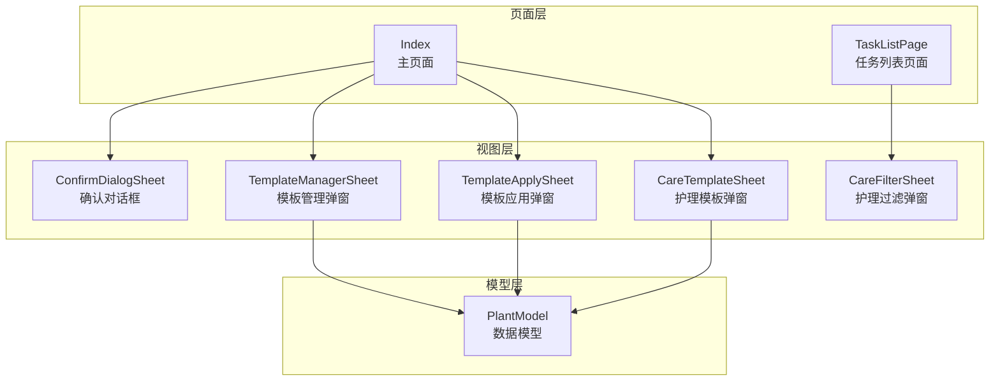
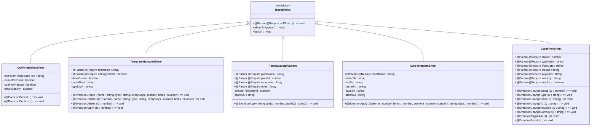
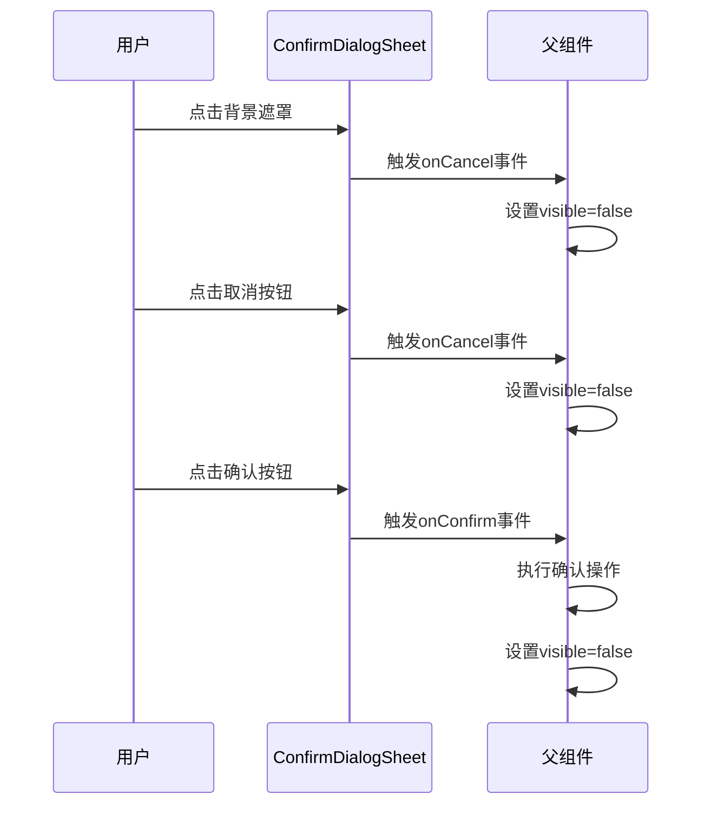
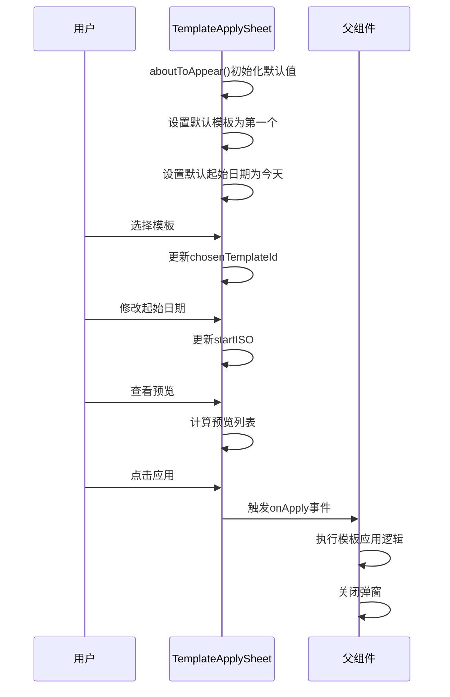
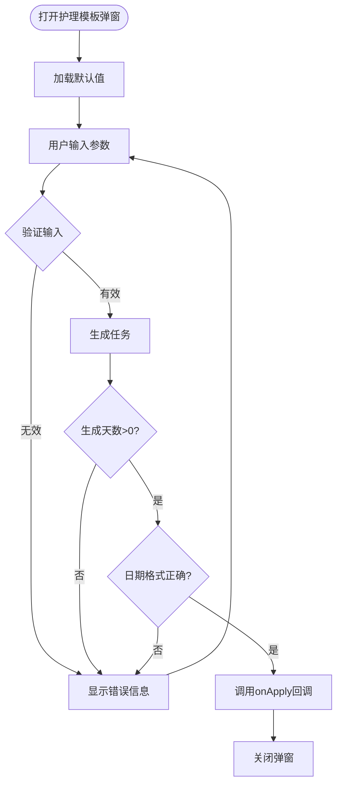
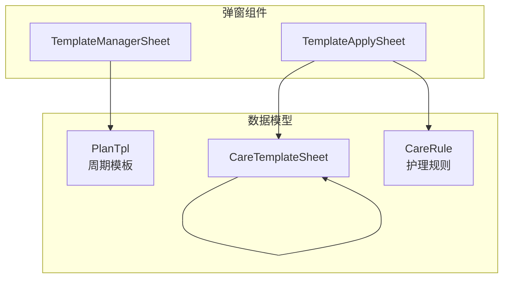
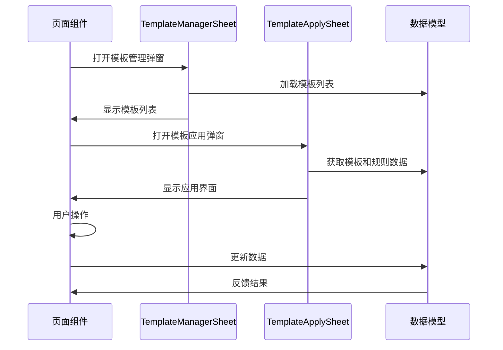

# 对话框弹窗组件系列

<cite>
**本文档引用的文件**
- [ConfirmDialogSheet.ets](file://entry/src/main/ets/view/ConfirmDialogSheet.ets)
- [TemplateManagerSheet.ets](file://entry/src/main/ets/view/TemplateManagerSheet.ets)
- [TemplateApplySheet.ets](file://entry/src/main/ets/view/TemplateApplySheet.ets)
- [CareTemplateSheet.ets](file://entry/src/main/ets/view/CareTemplateSheet.ets)
- [CareFilterSheet.ets](file://entry/src/main/ets/view/CareFilterSheet.ets)
- [PlantModel.ets](file://entry/src/main/ets/model/PlantModel.ets)
- [Index.ets](file://entry/src/main/ets/pages/Index.ets)
- [TaskListPage.ets](file://entry/src/main/ets/pages/TaskListPage.ets)
</cite>

## 目录
1. [简介](#简介)
2. [项目结构](#项目结构)
3. [核心组件](#核心组件)
4. [架构概览](#架构概览)
5. [详细组件分析](#详细组件分析)
6. [依赖关系分析](#依赖关系分析)
7. [性能考虑](#性能考虑)
8. [故障排除指南](#故障排除指南)
9. [结论](#结论)
10. [附录](#附录)

## 简介

本文档为PlantDiary应用中的对话框和弹窗组件系列提供完整的API文档。该系列包含五个核心组件：ConfirmDialogSheet确认对话框、TemplateManagerSheet模板管理弹窗、TemplateApplySheet模板应用弹窗、CareTemplateSheet护理模板弹窗和CareFilterSheet护理过滤弹窗。这些组件构成了应用中重要的用户交互界面，提供了确认操作、模板管理、模板应用、护理计划制定和数据过滤等功能。

## 项目结构

对话框弹窗组件位于应用的视图层，采用ArkTS框架开发，遵循组件化设计原则。每个组件都是独立的UI组件，通过参数传递实现数据绑定，通过事件回调实现与父组件的通信。



**图表来源**
- [ConfirmDialogSheet.ets:1-103](file://entry/src/main/ets/view/ConfirmDialogSheet.ets#L1-L103)
- [TemplateManagerSheet.ets:1-249](file://entry/src/main/ets/view/TemplateManagerSheet.ets#L1-L249)
- [TemplateApplySheet.ets:1-145](file://entry/src/main/ets/view/TemplateApplySheet.ets#L1-L145)
- [CareTemplateSheet.ets:1-217](file://entry/src/main/ets/view/CareTemplateSheet.ets#L1-L217)
- [CareFilterSheet.ets:1-212](file://entry/src/main/ets/view/CareFilterSheet.ets#L1-L212)

**章节来源**
- [ConfirmDialogSheet.ets:1-103](file://entry/src/main/ets/view/ConfirmDialogSheet.ets#L1-L103)
- [TemplateManagerSheet.ets:1-249](file://entry/src/main/ets/view/TemplateManagerSheet.ets#L1-L249)
- [TemplateApplySheet.ets:1-145](file://entry/src/main/ets/view/TemplateApplySheet.ets#L1-L145)
- [CareTemplateSheet.ets:1-217](file://entry/src/main/ets/view/CareTemplateSheet.ets#L1-L217)
- [CareFilterSheet.ets:1-212](file://entry/src/main/ets/view/CareFilterSheet.ets#L1-L212)

## 核心组件

### 组件分类与职责

| 组件名称 | 组件类型 | 主要职责 | 使用场景 |
|---------|---------|---------|---------|
| ConfirmDialogSheet | 确认对话框 | 提供确认/取消操作确认 | 删除确认、危险操作确认 |
| TemplateManagerSheet | 模板管理弹窗 | 模板的增删改查和应用 | 周期性任务模板管理 |
| TemplateApplySheet | 模板应用弹窗 | 模板选择、起始日期设置、预览应用 | 将模板应用到具体植物 |
| CareTemplateSheet | 护理模板弹窗 | 护理计划制定和生成 | 创建个性化护理模板 |
| CareFilterSheet | 护理过滤弹窗 | 数据筛选和排序 | 任务列表数据过滤 |

**章节来源**
- [ConfirmDialogSheet.ets:1-103](file://entry/src/main/ets/view/ConfirmDialogSheet.ets#L1-L103)
- [TemplateManagerSheet.ets:1-249](file://entry/src/main/ets/view/TemplateManagerSheet.ets#L1-L249)
- [TemplateApplySheet.ets:1-145](file://entry/src/main/ets/view/TemplateApplySheet.ets#L1-L145)
- [CareTemplateSheet.ets:1-217](file://entry/src/main/ets/view/CareTemplateSheet.ets#L1-L217)
- [CareFilterSheet.ets:1-212](file://entry/src/main/ets/view/CareFilterSheet.ets#L1-L212)

## 架构概览

对话框弹窗组件采用统一的架构模式，具有相似的设计模式和交互流程。



**图表来源**
- [ConfirmDialogSheet.ets:1-103](file://entry/src/main/ets/view/ConfirmDialogSheet.ets#L1-L103)
- [TemplateManagerSheet.ets:1-249](file://entry/src/main/ets/view/TemplateManagerSheet.ets#L1-L249)
- [TemplateApplySheet.ets:1-145](file://entry/src/main/ets/view/TemplateApplySheet.ets#L1-L145)
- [CareTemplateSheet.ets:1-217](file://entry/src/main/ets/view/CareTemplateSheet.ets#L1-L217)
- [CareFilterSheet.ets:1-212](file://entry/src/main/ets/view/CareFilterSheet.ets#L1-L212)

## 详细组件分析

### ConfirmDialogSheet 确认对话框组件

ConfirmDialogSheet是一个覆盖式的确认对话框，用于处理用户的重要操作确认。

#### API定义

| 属性 | 类型 | 必填 | 描述 |
|------|------|------|------|
| text | string | 是 | 对话框显示的确认文本内容 |
| onCancel | () => void | 是 | 用户点击取消按钮时触发的回调函数 |
| onConfirm | () => void | 是 | 用户点击确认按钮时触发的回调函数 |

#### 事件处理机制



**图表来源**
- [ConfirmDialogSheet.ets:27-82](file://entry/src/main/ets/view/ConfirmDialogSheet.ets#L27-L82)

#### 交互特性

- **动画效果**：背景遮罩渐显动画，对话框弹出动画
- **触摸反馈**：按钮按下时的缩放动画效果
- **键盘导航**：支持点击背景关闭的交互方式

**章节来源**
- [ConfirmDialogSheet.ets:1-103](file://entry/src/main/ets/view/ConfirmDialogSheet.ets#L1-L103)

### TemplateManagerSheet 模板管理弹窗组件

TemplateManagerSheet提供模板的完整生命周期管理功能，包括创建、编辑、删除和应用操作。

#### API定义

| 属性 | 类型 | 必填 | 描述 |
|------|------|------|------|
| templates | Array<PlanTpl> | 是 | 模板列表数据 |
| editingPlantId | number | 是 | 当前编辑的植物ID |
| onClose | () => void | 是 | 关闭弹窗时的回调函数 |
| onCreate | (name: string, type: string, everyDays: number, times: number) => void | 是 | 创建新模板时的回调函数 |
| onUpdate | (id: number, name: string, type: string, everyDays: number, times: number) => void | 是 | 更新模板时的回调函数 |
| onDelete | (id: number) => void | 是 | 删除模板时的回调函数 |
| onApply | (id: number) => void | 是 | 应用模板时的回调函数 |

#### 模板管理流程

```mermaid
flowchart TD
Start([打开模板管理弹窗]) --> CheckTemplates{是否有模板?}
CheckTemplates --> |否| ShowEmpty[显示"暂无模板"提示]
CheckTemplates --> |是| ShowList[显示模板列表]
ShowList --> Action{用户操作}
ShowEmpty --> Action
Action --> |新建| ToggleCreate[切换到新建表单]
Action --> |编辑| StartEdit[进入编辑模式]
Action --> |删除| DeleteTemplate[删除模板]
Action --> |应用| ApplyTemplate[应用模板到植物]
ToggleCreate --> CreateForm[显示新建表单]
CreateForm --> CreateTemplate[创建模板]
CreateTemplate --> CloseCreate[关闭新建表单]
StartEdit --> EditForm[显示编辑表单]
EditForm --> SaveTemplate[保存模板]
SaveTemplate --> ExitEdit[退出编辑模式]
DeleteTemplate --> CloseList[刷新列表]
ApplyTemplate --> CloseList
CloseCreate --> ShowList
CloseList --> ShowList
ExitEdit --> ShowList
```

**图表来源**
- [TemplateManagerSheet.ets:77-229](file://entry/src/main/ets/view/TemplateManagerSheet.ets#L77-L229)

#### 数据绑定机制

- **草稿模式**：使用独立的草稿变量避免直接修改列表数据
- **状态分离**：编辑态和展示态分离，避免状态混乱
- **实时验证**：输入验证确保数据有效性

**章节来源**
- [TemplateManagerSheet.ets:1-249](file://entry/src/main/ets/view/TemplateManagerSheet.ets#L1-L249)

### TemplateApplySheet 模板应用弹窗组件

TemplateApplySheet专注于模板应用功能，提供模板选择、起始日期设置和应用预览。

#### API定义

| 属性 | 类型 | 必填 | 描述 |
|------|------|------|------|
| plantName | string | 是 | 目标植物名称 |
| plantId | number | 是 | 目标植物ID |
| templates | Array<CareTemplate> | 是 | 可用模板列表 |
| rules | Array<CareRule> | 是 | 模板规则列表 |
| onApply | (templateId: number, startISO: string) => void | 是 | 应用模板时的回调函数 |
| onClose | () => void | 是 | 关闭弹窗时的回调函数 |

#### 应用逻辑流程



**图表来源**
- [TemplateApplySheet.ets:14-60](file://entry/src/main/ets/view/TemplateApplySheet.ets#L14-L60)
- [TemplateApplySheet.ets:134-137](file://entry/src/main/ets/view/TemplateApplySheet.ets#L134-L137)

#### 预览算法

模板应用弹窗实现了智能的预览功能，根据模板规则计算将生成的任务列表。

**章节来源**
- [TemplateApplySheet.ets:1-145](file://entry/src/main/ets/view/TemplateApplySheet.ets#L1-L145)

### CareTemplateSheet 护理模板弹窗组件

CareTemplateSheet允许用户创建个性化的护理模板，支持多种预设配置。

#### API定义

| 属性 | 类型 | 必填 | 描述 |
|------|------|------|------|
| plantName | string | 是 | 目标植物名称 |
| onApply | (waterInt: number, fertInt: number, pruneInt: number, startISO: string, days: number) => void | 是 | 生成任务时的回调函数 |
| onClose | () => void | 是 | 关闭弹窗时的回调函数 |

#### 预设模板配置

| 预设名称 | 浇水间隔(天) | 施肥间隔(天) | 修剪间隔(天) | 适用植物类型 |
|---------|-------------|-------------|-------------|-------------|
| 绿植常规 | 3 | 14 | 30 | 一般绿叶植物 |
| 多肉 | 7 | 30 | 60 | 多肉植物 |
| 观花 | 2 | 10 | 30 | 开花植物 |

#### 生成流程



**图表来源**
- [CareTemplateSheet.ets:105-117](file://entry/src/main/ets/view/CareTemplateSheet.ets#L105-L117)

**章节来源**
- [CareTemplateSheet.ets:1-217](file://entry/src/main/ets/view/CareTemplateSheet.ets#L1-L217)

### CareFilterSheet 护理过滤弹窗组件

CareFilterSheet提供全面的数据筛选和排序功能，支持多维度的条件过滤。

#### API定义

| 属性 | 类型 | 必填 | 描述 |
|------|------|------|------|
| status | number | 是 | 状态筛选条件 |
| typeValue | string | 是 | 类型筛选条件 |
| fromDate | string | 是 | 起始日期筛选条件 |
| toDate | string | 是 | 结束日期筛选条件 |
| keyword | string | 是 | 关键词搜索条件 |
| sortKey | string | 是 | 排序字段 |
| sortAsc | boolean | 是 | 排序方向 |
| onChangeStatus | (v: number) => void | 是 | 状态变更回调 |
| onChangeType | (v: string) => void | 是 | 类型变更回调 |
| onChangeFrom | (v: string) => void | 是 | 起始日期变更回调 |
| onChangeTo | (v: string) => void | 是 | 结束日期变更回调 |
| onChangeKeyword | (v: string) => void | 是 | 关键词变更回调 |
| onChangeSortKey | (k: string) => void | 是 | 排序字段变更回调 |
| onToggleAsc | () => void | 是 | 排序方向切换回调 |
| onReset | () => void | 是 | 重置所有条件回调 |
| onClose | () => void | 是 | 关闭弹窗回调 |

#### 过滤条件

| 条件类型 | 可选值 | 描述 |
|---------|--------|------|
| 状态 | 0(全部), 1(未完成), 2(已完成) | 任务完成状态筛选 |
| 类型 | 空(全部), 浇水, 施肥, 修剪 | 护理类型筛选 |
| 日期范围 | ISO格式日期字符串 | 任务日期范围筛选 |
| 关键词 | 任意字符串 | 搜索任务类型或植物名称 |
| 排序字段 | date, type, status, plant | 排序依据字段 |
| 排序方向 | true(升序), false(降序) | 排序方向 |

**章节来源**
- [CareFilterSheet.ets:1-212](file://entry/src/main/ets/view/CareFilterSheet.ets#L1-L212)

## 依赖关系分析

对话框弹窗组件之间的依赖关系相对简单，主要通过数据模型进行关联。



**图表来源**
- [PlantModel.ets:24-40](file://entry/src/main/ets/model/PlantModel.ets#L24-L40)
- [PlantModel.ets:150-163](file://entry/src/main/ets/model/PlantModel.ets#L150-L163)

### 组件间协作



**图表来源**
- [Index.ets:1149-1184](file://entry/src/main/ets/pages/Index.ets#L1149-L1184)

**章节来源**
- [PlantModel.ets:1-166](file://entry/src/main/ets/model/PlantModel.ets#L1-L166)
- [Index.ets:1149-1184](file://entry/src/main/ets/pages/Index.ets#L1149-L1184)

## 性能考虑

### 渲染优化

1. **条件渲染**：所有弹窗组件都采用条件渲染模式，仅在需要时创建和销毁DOM元素
2. **局部状态管理**：每个组件维护独立的状态，避免全局状态污染
3. **动画性能**：使用系统级动画API，确保流畅的用户体验

### 内存管理

1. **组件卸载**：弹窗关闭时自动清理相关状态和事件监听器
2. **数据缓存**：模板数据采用懒加载策略，减少不必要的数据传输
3. **垃圾回收**：及时释放不再使用的对象引用

### 交互响应

1. **触摸反馈**：按钮状态变化提供即时视觉反馈
2. **防抖处理**：输入验证采用防抖机制，避免频繁的无效计算
3. **异步操作**：网络请求和数据库操作采用异步处理，保持界面响应性

## 故障排除指南

### 常见问题及解决方案

#### 弹窗无法关闭

**问题描述**：用户点击关闭按钮或背景遮罩后弹窗仍然显示

**可能原因**：
1. 事件回调未正确传递给父组件
2. 父组件状态管理逻辑错误
3. 组件生命周期管理问题

**解决方案**：
1. 检查onClose回调函数的实现
2. 确保父组件正确更新显示状态
3. 验证组件的aboutToAppear和aboutToDisappear生命周期

#### 模板应用失败

**问题描述**：模板应用后没有生成预期的任务

**可能原因**：
1. 模板规则配置错误
2. 起始日期格式不正确
3. 模板ID传递错误

**解决方案**：
1. 验证模板规则的intervalDays和horizonDays配置
2. 检查ISO日期格式的正确性
3. 确认模板ID的有效性

#### 数据验证错误

**问题描述**：输入验证导致用户无法提交数据

**可能原因**：
1. 数字输入验证过于严格
2. 日期格式验证不兼容
3. 空值检查逻辑错误

**解决方案**：
1. 调整数字输入的最小值限制
2. 支持多种日期格式输入
3. 完善空值和边界值的处理逻辑

**章节来源**
- [TemplateManagerSheet.ets:23-29](file://entry/src/main/ets/view/TemplateManagerSheet.ets#L23-L29)
- [TemplateApplySheet.ets:26-32](file://entry/src/main/ets/view/TemplateApplySheet.ets#L26-L32)
- [CareTemplateSheet.ets:209-215](file://entry/src/main/ets/view/CareTemplateSheet.ets#L209-L215)

## 结论

对话框弹窗组件系列为PlantDiary应用提供了完整的用户交互解决方案。每个组件都遵循统一的设计原则，具有清晰的API接口和良好的扩展性。通过合理的状态管理和事件处理机制，这些组件能够满足复杂的业务需求，同时保持良好的性能表现。

组件设计充分考虑了用户体验，在交互反馈、动画效果和数据验证方面都有精心的处理。同时，组件间的协作关系清晰明确，便于维护和扩展。

## 附录

### 使用场景示例

#### 确认对话框使用场景
- 删除植物确认
- 批量操作确认
- 危险操作提醒

#### 模板管理使用场景
- 周期性任务模板创建
- 护理计划模板维护
- 模板批量应用

#### 模板应用使用场景
- 将标准模板应用到特定植物
- 自定义起始日期和生成周期
- 预览应用结果

#### 护理模板使用场景
- 创建个性化护理计划
- 快速应用预设模板
- 生成指定周期的任务

#### 过滤弹窗使用场景
- 任务列表筛选
- 数据排序调整
- 多条件组合查询

### 最佳实践

1. **状态管理**：使用条件渲染控制组件显示，避免不必要的DOM创建
2. **事件处理**：确保所有回调函数都有正确的参数传递
3. **数据验证**：在用户输入时提供即时的验证反馈
4. **错误处理**：为异步操作提供完善的错误处理机制
5. **性能优化**：合理使用动画和过渡效果，避免过度消耗系统资源