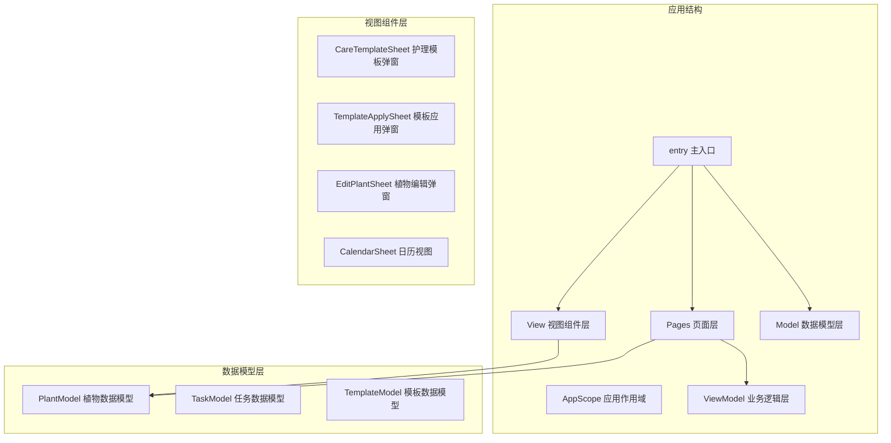
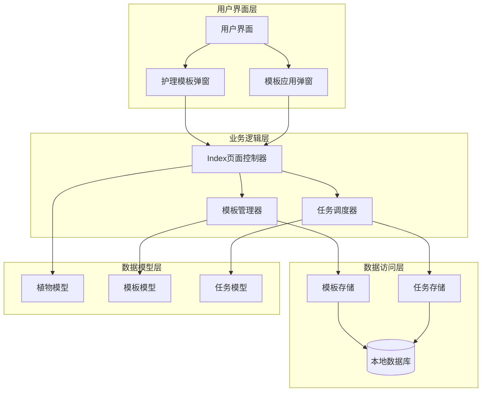
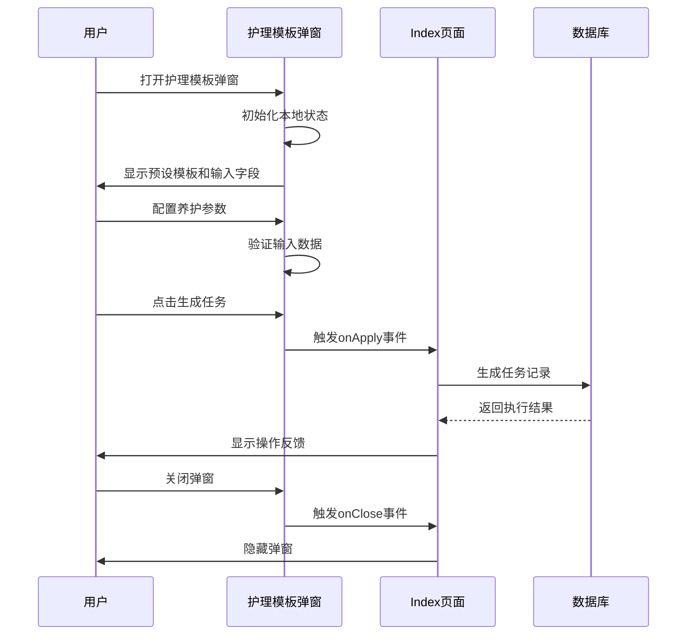
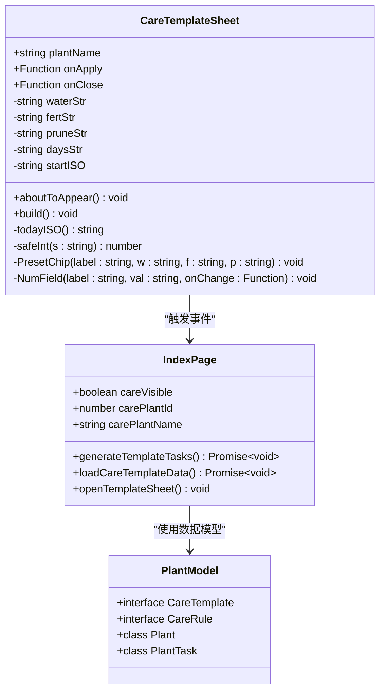
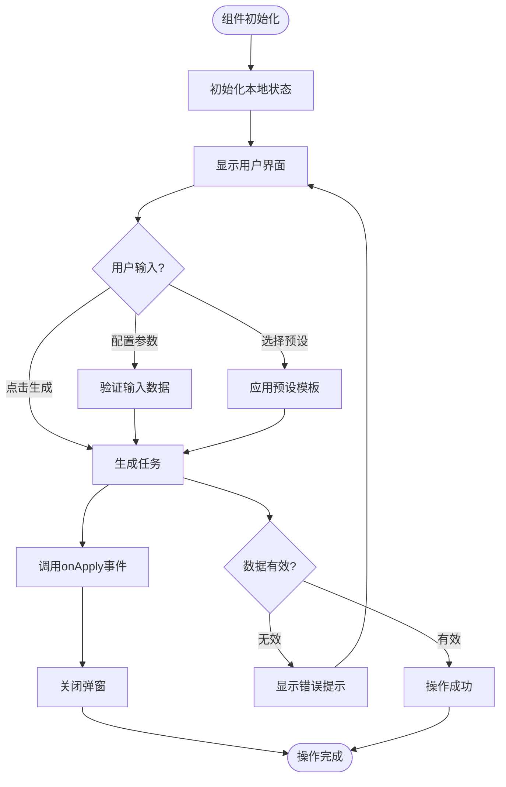
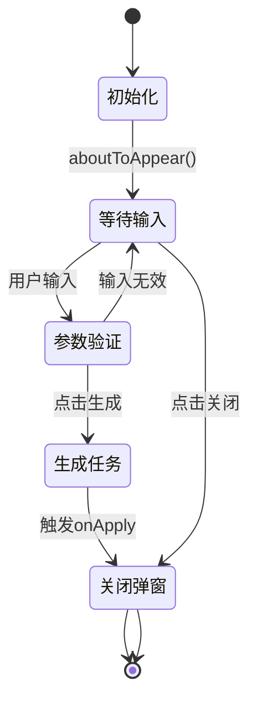
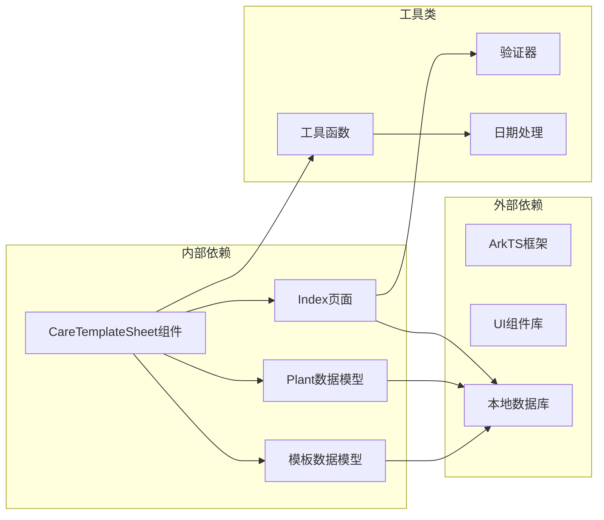

# 护理模板弹窗组件API

<cite>
**本文档引用的文件**
- [CareTemplateSheet.ets](file://entry/src/main/ets/view/CareTemplateSheet.ets)
- [Index.ets](file://entry/src/main/ets/pages/Index.ets)
- [PlantModel.ets](file://entry/src/main/ets/model/PlantModel.ets)
- [TemplateApplySheet.ets](file://entry/src/main/ets/view/TemplateApplySheet.ets)
</cite>

## 目录
1. [简介](#简介)
2. [项目结构](#项目结构)
3. [核心组件](#核心组件)
4. [架构概览](#架构概览)
5. [详细组件分析](#详细组件分析)
6. [依赖关系分析](#依赖关系分析)
7. [性能考虑](#性能考虑)
8. [故障排除指南](#故障排除指南)
9. [结论](#结论)

## 简介

CareTemplateSheet护理模板弹窗组件是PlantDiary植物养护管理系统中的核心组件之一，专门用于为植物创建和应用护理模板。该组件提供了直观的用户界面，允许用户配置浇水、施肥、修剪等养护任务的生成规则，并支持一键应用到指定植物。

该组件采用ArkTS框架开发，集成了响应式数据绑定、事件处理和状态管理功能，为用户提供流畅的交互体验。组件设计遵循模块化原则，与PlantModel数据模型紧密集成，确保数据的一致性和完整性。

## 项目结构

PlantDiary项目采用分层架构设计，主要包含以下关键目录：

**图表来源**
- [CareTemplateSheet.ets:1-217](file://entry/src/main/ets/view/CareTemplateSheet.ets#L1-L217)
- [Index.ets:855-1009](file://entry/src/main/ets/pages/Index.ets#L855-L1009)

**章节来源**
- [CareTemplateSheet.ets:1-217](file://entry/src/main/ets/view/CareTemplateSheet.ets#L1-L217)
- [Index.ets:855-1009](file://entry/src/main/ets/pages/Index.ets#L855-L1009)

## 核心组件

### 组件概述

CareTemplateSheet是一个基于@Param和@Event装饰器的结构化组件，专门用于护理模板的创建和应用。组件具有以下核心特性：

- **响应式参数绑定**：通过@Param装饰器接收外部传入的植物信息
- **事件驱动架构**：通过@Event装饰器暴露回调函数接口
- **本地状态管理**：使用@Local装饰器管理组件内部状态
- **预设模板支持**：内置常见植物类型的养护模板

### 参数配置

组件接受以下必需参数：

| 参数名 | 类型 | 必需 | 描述 | 默认值 |
|--------|------|------|------|--------|
| plantName | string | 是 | 植物名称 | - |
| onApply | Function | 是 | 模板应用回调函数 | - |
| onClose | Function | 是 | 弹窗关闭回调函数 | - |

### 本地状态变量

组件内部维护以下状态变量：

| 变量名 | 类型 | 默认值 | 描述 |
|--------|------|--------|------|
| waterStr | string | '3' | 浇水间隔天数 |
| fertStr | string | '14' | 施肥间隔天数 |
| pruneStr | string | '30' | 修剪间隔天数 |
| daysStr | string | '30' | 生成天数范围 |
| startISO | string | '' | 起始日期（ISO格式） |

**章节来源**
- [CareTemplateSheet.ets:3-14](file://entry/src/main/ets/view/CareTemplateSheet.ets#L3-L14)

## 架构概览

### 系统架构图

**图表来源**
- [Index.ets:855-1009](file://entry/src/main/ets/pages/Index.ets#L855-L1009)
- [PlantModel.ets:150-163](file://entry/src/main/ets/model/PlantModel.ets#L150-L163)

### 组件交互流程

**图表来源**
- [CareTemplateSheet.ets:105-117](file://entry/src/main/ets/view/CareTemplateSheet.ets#L105-L117)
- [Index.ets:1030-1035](file://entry/src/main/ets/pages/Index.ets#L1030-L1035)

**章节来源**
- [Index.ets:1024-1037](file://entry/src/main/ets/pages/Index.ets#L1024-L1037)
- [CareTemplateSheet.ets:16-158](file://entry/src/main/ets/view/CareTemplateSheet.ets#L16-L158)

## 详细组件分析

### 组件类结构

**图表来源**
- [CareTemplateSheet.ets:2-217](file://entry/src/main/ets/view/CareTemplateSheet.ets#L2-L217)
- [Index.ets:663-691](file://entry/src/main/ets/pages/Index.ets#L663-L691)
- [PlantModel.ets:150-163](file://entry/src/main/ets/model/PlantModel.ets#L150-L163)

### 数据流分析

**图表来源**
- [CareTemplateSheet.ets:55-117](file://entry/src/main/ets/view/CareTemplateSheet.ets#L55-L117)
- [Index.ets:1030-1035](file://entry/src/main/ets/pages/Index.ets#L1030-L1035)

### API接口定义

#### 组件参数接口

| 接口名称 | 参数类型 | 必需 | 描述 |
|----------|----------|------|------|
| plantName | string | 是 | 植物名称，用于显示在弹窗标题中 |
| onApply | Function | 是 | 模板应用回调函数，参数为(waterInt, fertInt, pruneInt, startISO, days) |
| onClose | Function | 是 | 弹窗关闭回调函数 |

#### 事件回调接口

| 事件名称 | 回调签名 | 参数说明 | 使用场景 |
|----------|----------|----------|----------|
| onApply | `(waterInt: number, fertInt: number, pruneInt: number, startISO: string, days: number) => void` | - waterInt: 浇水间隔天数 - fertInt: 施肥间隔天数 - pruneInt: 修剪间隔天数 - startISO: 起始日期 - days: 生成天数范围 | 当用户点击"生成任务"按钮时触发 |
| onClose | `() => void` | 无参数 | 当用户点击关闭按钮或蒙层时触发 |

#### 内部方法接口

| 方法名称 | 返回类型 | 描述 | 复杂度 |
|----------|----------|----------|--------|
| todayISO() | string | 获取当前日期的ISO格式字符串 | O(1) |
| safeInt(s: string) | number | 安全转换字符串为整数，处理异常情况 | O(1) |
| PresetChip(label: string, w: string, f: string, p: string) | void | 渲染预设模板芯片组件 | O(1) |
| NumField(label: string, val: string, onChange: Function) | void | 渲染数字输入字段组件 | O(1) |

**章节来源**
- [CareTemplateSheet.ets:3-217](file://entry/src/main/ets/view/CareTemplateSheet.ets#L3-L217)
- [Index.ets:1024-1037](file://entry/src/main/ets/pages/Index.ets#L1024-L1037)

### 状态管理机制

组件采用本地状态管理策略，通过@Local装饰器管理组件内部状态：

**图表来源**
- [CareTemplateSheet.ets:12-14](file://entry/src/main/ets/view/CareTemplateSheet.ets#L12-L14)
- [CareTemplateSheet.ets:105-117](file://entry/src/main/ets/view/CareTemplateSheet.ets#L105-L117)

### 数据绑定机制

组件实现了双向数据绑定机制，确保用户输入与组件状态的同步：

| 绑定类型 | 实现方式 | 数据流向 | 用途 |
|----------|----------|----------|------|
| 单向绑定 | @Param装饰器 | 外部→组件 | 接收植物名称等只读参数 |
| 双向绑定 | @Local装饰器 + onChange | 用户输入→组件状态 | 管理输入字段的实时更新 |
| 事件绑定 | @Event装饰器 | 组件→外部 | 触发回调函数进行数据交换 |

**章节来源**
- [CareTemplateSheet.ets:160-198](file://entry/src/main/ets/view/CareTemplateSheet.ets#L160-L198)

## 依赖关系分析

### 组件依赖图

**图表来源**
- [Index.ets:776-804](file://entry/src/main/ets/pages/Index.ets#L776-L804)
- [PlantModel.ets:150-163](file://entry/src/main/ets/model/PlantModel.ets#L150-L163)

### 数据模型依赖

组件与PlantModel建立了紧密的数据模型依赖关系：

| 数据模型 | 依赖关系 | 用途 | 关键字段 |
|----------|----------|------|----------|
| CareTemplate | 接口定义 | 模板基本信息 | id, name, desc |
| CareRule | 接口定义 | 模板规则定义 | id, templateId, type, intervalDays, horizonDays |
| Plant | 类定义 | 植物基本信息 | id, name, species, location, createdAt |
| PlantTask | 类定义 | 任务记录 | id, plantId, type, planDate, done, doneAt |

**章节来源**
- [PlantModel.ets:150-163](file://entry/src/main/ets/model/PlantModel.ets#L150-L163)
- [Index.ets:776-804](file://entry/src/main/ets/pages/Index.ets#L776-L804)

## 性能考虑

### 性能优化策略

1. **懒加载机制**：组件仅在需要时加载和渲染，减少内存占用
2. **事件节流**：输入验证采用防抖处理，避免频繁的DOM更新
3. **状态缓存**：本地状态变量缓存常用计算结果，提升响应速度
4. **条件渲染**：根据状态动态渲染不同的UI元素，减少不必要的重绘

### 内存管理

组件采用以下内存管理策略：
- 及时清理事件监听器
- 合理使用@Local装饰器管理临时状态
- 在组件销毁时释放资源

## 故障排除指南

### 常见问题及解决方案

| 问题类型 | 症状 | 可能原因 | 解决方案 |
|----------|------|----------|----------|
| 输入验证失败 | 无法生成任务 | 输入格式错误或数值无效 | 检查输入字段格式，确保为正整数 |
| 日期格式错误 | 起始日期显示异常 | ISO格式不正确 | 确保日期格式为YYYY-MM-DD |
| 事件回调未触发 | 点击按钮无反应 | 事件绑定错误 | 检查onApply和onClose函数定义 |
| 数据库连接失败 | 模板数据加载失败 | 数据库连接异常 | 检查数据库状态和权限设置 |

### 调试技巧

1. **日志输出**：使用console.log输出关键状态变化
2. **断点调试**：在事件回调函数中设置断点
3. **状态检查**：定期检查@Local状态变量的值
4. **网络监控**：监控数据库操作的执行时间

**章节来源**
- [CareTemplateSheet.ets:209-215](file://entry/src/main/ets/view/CareTemplateSheet.ets#L209-L215)
- [Index.ets:814-852](file://entry/src/main/ets/pages/Index.ets#L814-L852)

## 结论

CareTemplateSheet护理模板弹窗组件是一个功能完善、架构清晰的UI组件。它成功地将复杂的护理模板生成功能封装为简洁易用的界面，为PlantDiary植物养护管理系统提供了强大的模板应用能力。

组件的主要优势包括：
- **用户友好**：直观的界面设计和预设模板支持
- **功能完整**：支持多种养护类型的模板生成
- **集成良好**：与PlantModel数据模型无缝集成
- **扩展性强**：模块化的架构便于功能扩展

通过合理的状态管理和事件处理机制，组件能够稳定地处理各种用户交互场景，为用户提供流畅的使用体验。同时，组件的设计充分考虑了性能和可维护性，为后续的功能扩展奠定了良好的基础。