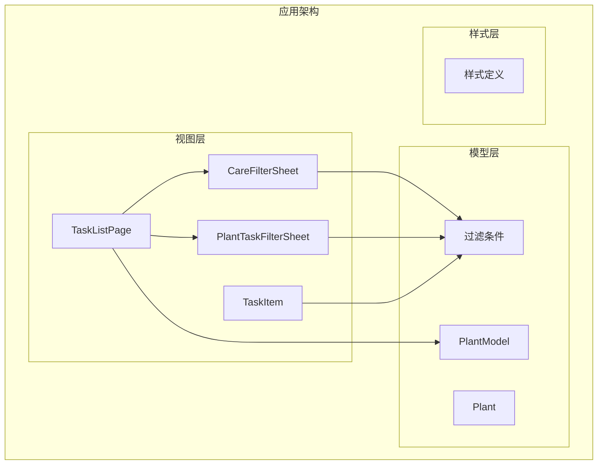
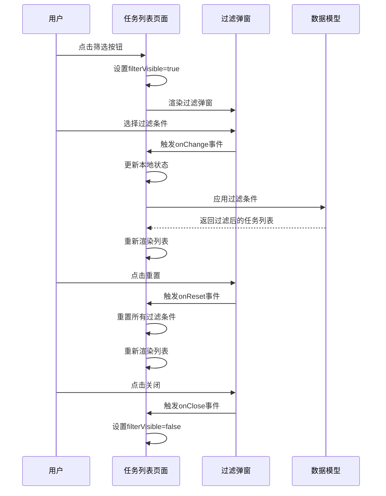
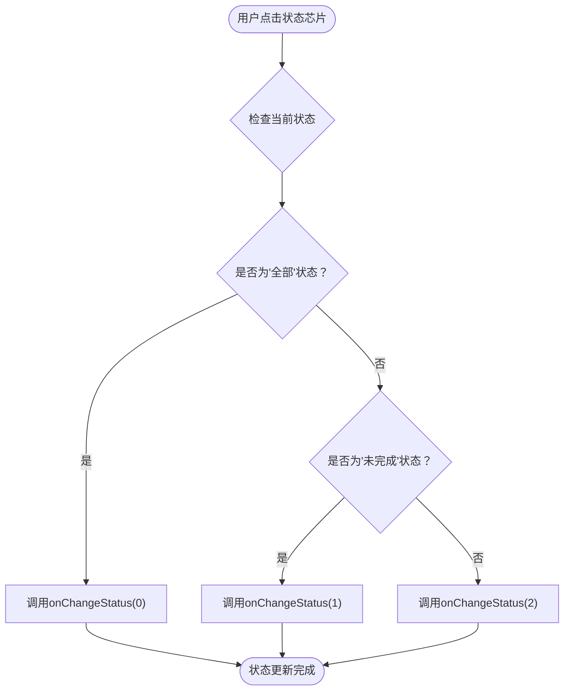
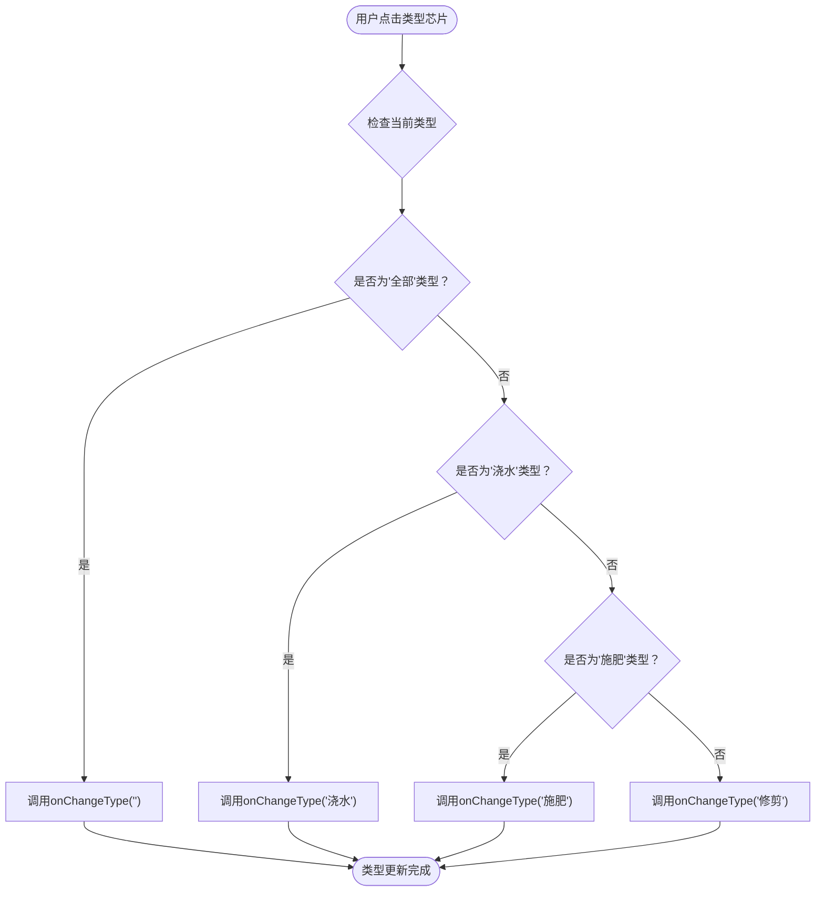
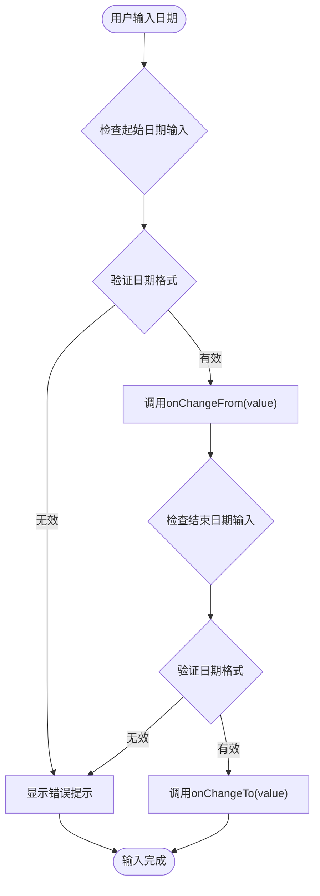
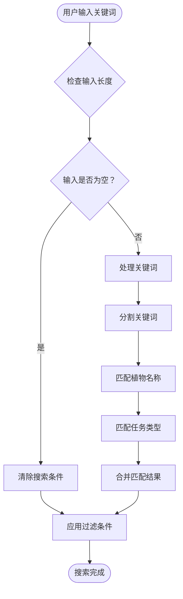
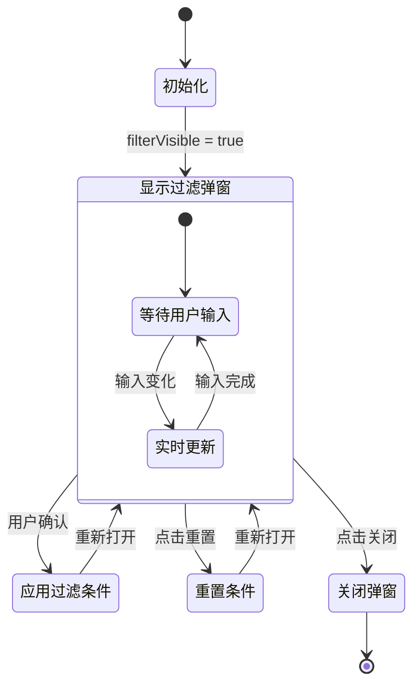
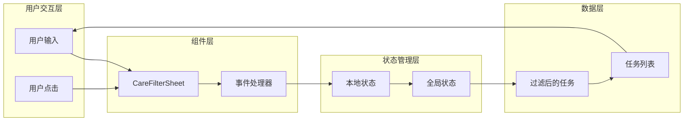
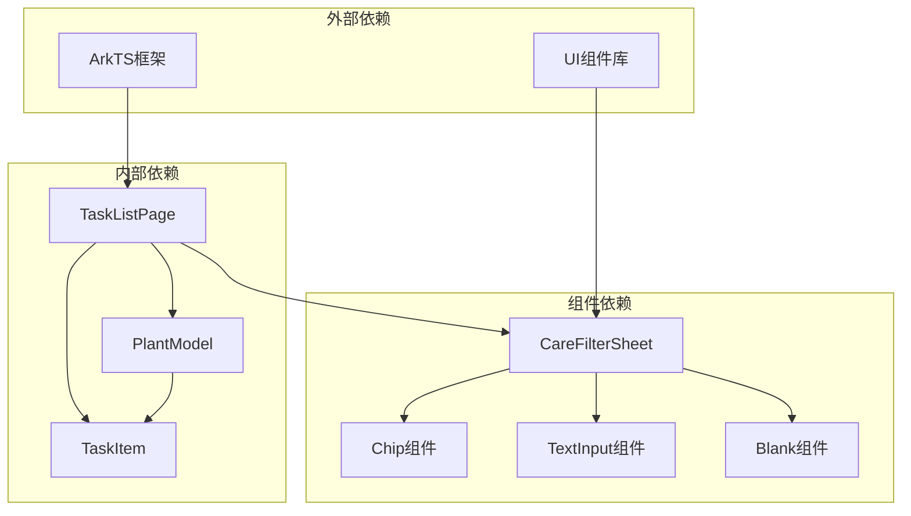

# 护理过滤弹窗组件API

<cite>
**本文档引用的文件**
- [CareFilterSheet.ets](file://entry/src/main/ets/view/CareFilterSheet.ets)
- [PlantTaskFilterSheet.ets](file://entry/src/main/ets/view/PlantTaskFilterSheet.ets)
- [TaskListPage.ets](file://entry/src/main/ets/pages/TaskListPage.ets)
- [PlantModel.ets](file://entry/src/main/ets/model/PlantModel.ets)
- [TaskItem.ets](file://entry/src/main/ets/view/TaskItem.ets)
</cite>

## 目录
1. [简介](#简介)
2. [项目结构](#项目结构)
3. [核心组件](#核心组件)
4. [架构概览](#架构概览)
5. [详细组件分析](#详细组件分析)
6. [依赖关系分析](#依赖关系分析)
7. [性能考虑](#性能考虑)
8. [故障排除指南](#故障排除指南)
9. [结论](#结论)

## 简介

CareFilterSheet是一个专门用于植物护理任务过滤的弹窗组件，为PlantDiary植物养护应用提供强大的任务筛选和排序功能。该组件支持多种过滤条件，包括任务状态、类型、日期范围和关键词搜索，并提供直观的用户界面来管理和应用这些过滤条件。

该组件采用抽屉式设计，通过半透明蒙层背景和圆角设计提供良好的用户体验。组件支持实时过滤和排序，能够与任务列表系统无缝集成，为用户提供灵活的任务管理能力。

## 项目结构

PlantDiary项目采用模块化架构，CareFilterSheet作为视图层组件位于`entry/src/main/ets/view/`目录下，与页面组件和模型层分离，遵循了清晰的分层设计原则。

**图表来源**
- [CareFilterSheet.ets:1-212](file://entry/src/main/ets/view/CareFilterSheet.ets#L1-L212)
- [TaskListPage.ets:1-463](file://entry/src/main/ets/pages/TaskListPage.ets#L1-L463)

**章节来源**
- [CareFilterSheet.ets:1-212](file://entry/src/main/ets/view/CareFilterSheet.ets#L1-L212)
- [TaskListPage.ets:1-463](file://entry/src/main/ets/pages/TaskListPage.ets#L1-L463)

## 核心组件

CareFilterSheet组件提供了完整的护理任务过滤功能，包含以下核心特性：

### 组件概述
- **组件类型**: 结构体组件（struct Component）
- **设计模式**: 参数化组件（@Param @Require）
- **事件驱动**: 完整的事件处理器系统
- **响应式设计**: 支持实时状态更新

### 主要功能模块
1. **状态过滤**: 全部、未完成、已完成三种状态
2. **类型过滤**: 浇水、施肥、修剪等任务类型
3. **日期范围**: 自定义起始和结束日期
4. **关键词搜索**: 支持植物名称和任务类型的模糊匹配
5. **排序控制**: 按日期、类型、状态、植物名称排序

**章节来源**
- [CareFilterSheet.ets:20-178](file://entry/src/main/ets/view/CareFilterSheet.ets#L20-L178)

## 架构概览

CareFilterSheet组件在整个应用架构中扮演着关键角色，作为任务过滤的前端界面，与任务列表页面紧密协作。

**图表来源**
- [TaskListPage.ets:271-314](file://entry/src/main/ets/pages/TaskListPage.ets#L271-L314)
- [CareFilterSheet.ets:20-178](file://entry/src/main/ets/view/CareFilterSheet.ets#L20-L178)

## 详细组件分析

### 组件参数配置

CareFilterSheet组件通过参数化设计实现了高度的灵活性和复用性：

| 参数名称 | 类型 | 必需 | 描述 | 默认值 |
|---------|------|------|------|--------|
| status | number | 是 | 任务状态过滤器 | 0（全部） |
| typeValue | string | 是 | 任务类型过滤器 | ""（全部） |
| fromDate | string | 是 | 起始日期过滤器 | ""（无限制） |
| toDate | string | 是 | 结束日期过滤器 | ""（无限制） |
| keyword | string | 是 | 关键词搜索过滤器 | ""（无限制） |
| sortKey | string | 是 | 排序键 | "date" |
| sortAsc | boolean | 是 | 排序方向 | false（降序） |

**章节来源**
- [CareFilterSheet.ets:3-9](file://entry/src/main/ets/view/CareFilterSheet.ets#L3-L9)

### 事件处理器接口

组件提供了完整的事件处理系统，支持所有过滤条件的动态更新：

#### 状态过滤事件
- `onChangeStatus(v: number) => void`: 更新任务状态过滤器
- 支持值: 0（全部）、1（未完成）、2（已完成）

#### 类型过滤事件
- `onChangeType(v: string) => void`: 更新任务类型过滤器
- 支持值: ""（全部）、"浇水"、"施肥"、"修剪"

#### 日期范围事件
- `onChangeFrom(v: string) => void`: 更新起始日期
- `onChangeTo(v: string) => void`: 更新结束日期

#### 搜索事件
- `onChangeKeyword(v: string) => void`: 更新关键词搜索

#### 排序事件
- `onChangeSortKey(k: string) => void`: 更新排序键
- 支持值: "date"、"type"、"status"、"plant"
- `onToggleAsc() => void`: 切换排序方向

#### 管理事件
- `onReset() => void`: 重置所有过滤条件
- `onClose() => void`: 关闭过滤弹窗

**章节来源**
- [CareFilterSheet.ets:10-18](file://entry/src/main/ets/view/CareFilterSheet.ets#L10-L18)

### 过滤条件实现机制

#### 状态过滤实现
组件通过状态芯片（Chip）提供直观的选择界面，支持一键切换不同的过滤状态：

**图表来源**
- [CareFilterSheet.ets:58-69](file://entry/src/main/ets/view/CareFilterSheet.ets#L58-L69)

#### 类型过滤实现
类型过滤支持多选模式，通过布尔值控制不同类型任务的显示：

**图表来源**
- [CareFilterSheet.ets:71-86](file://entry/src/main/ets/view/CareFilterSheet.ets#L71-L86)

#### 日期范围过滤实现
日期范围过滤通过两个文本输入框实现，支持ISO格式的日期输入：

**图表来源**
- [CareFilterSheet.ets:90-113](file://entry/src/main/ets/view/CareFilterSheet.ets#L90-L113)

#### 关键词搜索实现
关键词搜索支持模糊匹配，同时匹配植物名称和任务类型：

**图表来源**
- [CareFilterSheet.ets:115-128](file://entry/src/main/ets/view/CareFilterSheet.ets#L115-L128)

### 排序逻辑接口

组件提供了灵活的排序控制系统，支持多种排序键和排序方向：

#### 排序键支持
- `date`: 按计划日期排序
- `type`: 按任务类型排序
- `status`: 按完成状态排序
- `plant`: 按植物名称排序

#### 排序方向控制
- `sortAsc: boolean`: 控制排序方向
- `onToggleAsc()`: 切换升序/降序状态

**章节来源**
- [CareFilterSheet.ets:130-159](file://entry/src/main/ets/view/CareFilterSheet.ets#L130-L159)

### 状态管理机制

CareFilterSheet组件采用双向数据绑定机制，确保UI状态与业务逻辑的同步：

**图表来源**
- [TaskListPage.ets:271-314](file://entry/src/main/ets/pages/TaskListPage.ets#L271-L314)

**章节来源**
- [TaskListPage.ets:20-27](file://entry/src/main/ets/pages/TaskListPage.ets#L20-L27)

### 数据交互机制

组件与任务列表系统的数据交互通过事件驱动的方式实现：

#### 组件间通信
- **从子组件到父组件**: 通过事件处理器传递状态变化
- **从父组件到子组件**: 通过参数传递当前过滤状态
- **双向绑定**: 父组件更新状态，子组件实时反映变化

#### 数据流设计

**图表来源**
- [TaskListPage.ets:271-314](file://entry/src/main/ets/pages/TaskListPage.ets#L271-L314)

**章节来源**
- [TaskListPage.ets:271-314](file://entry/src/main/ets/pages/TaskListPage.ets#L271-L314)

### 实时更新和界面反馈

组件提供了丰富的实时反馈机制，确保用户能够清楚地了解当前的过滤状态：

#### 界面反馈元素
1. **选中状态指示**: 使用勾选符号显示当前选中的过滤条件
2. **颜色编码**: 不同的视觉样式区分当前状态和可选状态
3. **动画效果**: 平滑的状态切换动画提升用户体验
4. **重置功能**: 一键清除所有过滤条件

#### 实时更新机制
- **即时响应**: 用户操作后立即触发状态更新
- **防抖处理**: 避免频繁的重复更新操作
- **状态同步**: 确保所有相关组件的状态保持一致

**章节来源**
- [CareFilterSheet.ets:58-159](file://entry/src/main/ets/view/CareFilterSheet.ets#L58-L159)

## 依赖关系分析

CareFilterSheet组件与整个应用的依赖关系体现了清晰的架构层次：

**图表来源**
- [CareFilterSheet.ets:1-212](file://entry/src/main/ets/view/CareFilterSheet.ets#L1-L212)
- [TaskListPage.ets:1-463](file://entry/src/main/ets/pages/TaskListPage.ets#L1-L463)

### 组件耦合度分析

- **低耦合**: CareFilterSheet与TaskListPage通过事件接口解耦
- **高内聚**: 组件内部功能模块职责明确
- **可扩展性**: 支持新的过滤条件和排序方式的添加

**章节来源**
- [CareFilterSheet.ets:1-212](file://entry/src/main/ets/view/CareFilterSheet.ets#L1-L212)

## 性能考虑

### 渲染优化
- **虚拟滚动**: 对于大量任务数据，建议实现虚拟滚动以提高渲染性能
- **懒加载**: 过滤条件面板采用延迟加载，仅在需要时渲染
- **状态缓存**: 缓存过滤结果，避免重复计算

### 内存管理
- **事件清理**: 及时清理不再使用的事件监听器
- **状态回收**: 合理管理组件状态，避免内存泄漏
- **资源释放**: 在组件卸载时释放相关资源

### 用户体验优化
- **响应式设计**: 支持不同屏幕尺寸的适配
- **加载状态**: 提供适当的加载指示器
- **错误处理**: 完善的错误边界和降级策略

## 故障排除指南

### 常见问题及解决方案

#### 过滤条件不生效
**问题描述**: 更改过滤条件后任务列表没有更新
**可能原因**:
- 事件处理器未正确绑定
- 父组件状态未更新
- 数据类型不匹配

**解决步骤**:
1. 检查事件处理器的参数类型
2. 验证父组件的状态更新逻辑
3. 确认数据格式的正确性

#### 日期格式错误
**问题描述**: 日期输入框无法识别用户输入
**可能原因**:
- 日期格式不符合ISO标准
- 输入验证逻辑错误

**解决步骤**:
1. 确保输入格式为YYYY-MM-DD
2. 添加日期有效性验证
3. 提供格式化的输入提示

#### 排序功能异常
**问题描述**: 排序结果不符合预期
**可能原因**:
- 排序键值不正确
- 排序方向设置错误
- 数据类型比较问题

**解决步骤**:
1. 验证排序键的有效性
2. 检查排序方向的状态
3. 确保数据类型的一致性

**章节来源**
- [CareFilterSheet.ets:93-127](file://entry/src/main/ets/view/CareFilterSheet.ets#L93-L127)

## 结论

CareFilterSheet护理过滤弹窗组件为PlantDiary应用提供了强大而灵活的任务过滤功能。通过参数化设计和事件驱动架构，组件实现了与任务列表系统的无缝集成，为用户提供了直观、高效的植物护理任务管理体验。

组件的主要优势包括：
- **直观的用户界面**: 清晰的过滤条件分类和视觉反馈
- **灵活的过滤选项**: 支持多种过滤条件的组合使用
- **实时响应**: 即时的状态更新和界面反馈
- **良好的可扩展性**: 易于添加新的过滤条件和排序方式

在未来的发展中，可以考虑进一步优化性能表现，增强错误处理机制，并扩展更多的过滤和排序选项，以满足用户不断增长的需求。