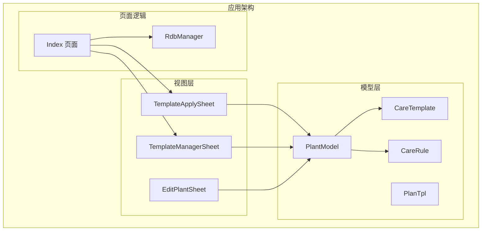
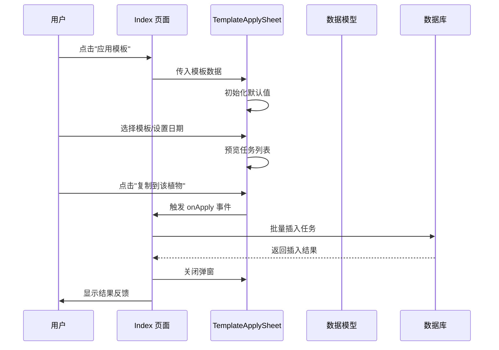
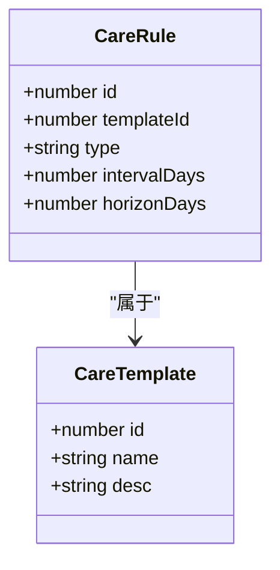
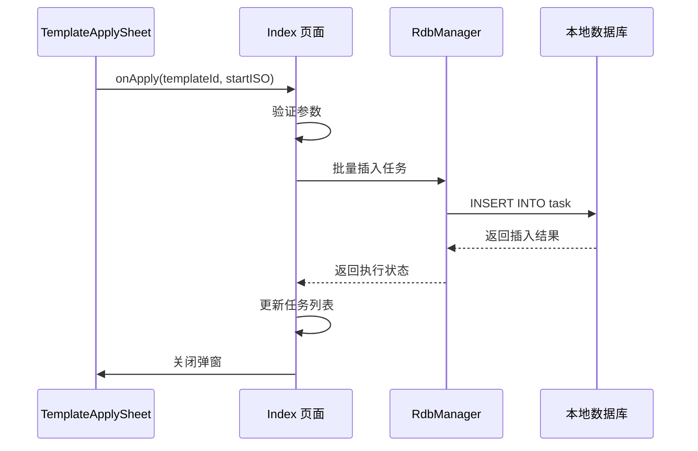
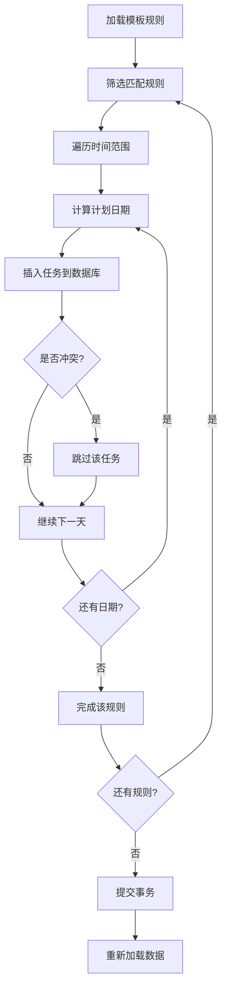
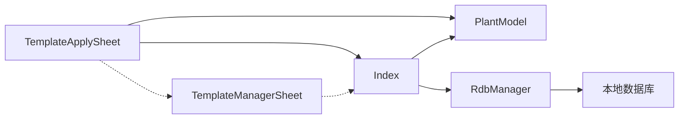

# 模板应用弹窗组件API

<cite>
**本文档引用的文件**
- [TemplateApplySheet.ets](file://entry/src/main/ets/view/TemplateApplySheet.ets)
- [PlantModel.ets](file://entry/src/main/ets/model/PlantModel.ets)
- [Index.ets](file://entry/src/main/ets/pages/Index.ets)
- [RdbManager.ets](file://entry/src/main/ets/viewmodel/RdbManager.ets)
- [TemplateManagerSheet.ets](file://entry/src/main/ets/view/TemplateManagerSheet.ets)
</cite>

## 目录
1. [简介](#简介)
2. [项目结构](#项目结构)
3. [核心组件](#核心组件)
4. [架构概览](#架构概览)
5. [详细组件分析](#详细组件分析)
6. [依赖关系分析](#依赖关系分析)
7. [性能考虑](#性能考虑)
8. [故障排除指南](#故障排除指南)
9. [结论](#结论)
10. [附录](#附录)

## 简介
TemplateApplySheet 是 PlantDiary 应用中的模板应用弹窗组件，用于将养护模板复制到指定植物。该组件提供模板选择、开始日期设置、任务预览和确认应用等功能，是植物管理流程中的关键交互组件。

## 项目结构
TemplateApplySheet 组件位于应用的视图层，与数据模型和页面逻辑紧密协作：



**图表来源**
- [TemplateApplySheet.ets:1-145](file://entry/src/main/ets/view/TemplateApplySheet.ets#L1-L145)
- [PlantModel.ets:150-163](file://entry/src/main/ets/model/PlantModel.ets#L150-L163)
- [Index.ets:1170-1184](file://entry/src/main/ets/pages/Index.ets#L1170-L1184)

**章节来源**
- [TemplateApplySheet.ets:1-145](file://entry/src/main/ets/view/TemplateApplySheet.ets#L1-L145)
- [PlantModel.ets:1-166](file://entry/src/main/ets/model/PlantModel.ets#L1-L166)
- [Index.ets:854-1199](file://entry/src/main/ets/pages/Index.ets#L854-L1199)

## 核心组件

### 组件概述
TemplateApplySheet 是一个基于 ArkTS 的组件，采用结构体组件模式，专注于单一职责：模板应用操作。

### 主要特性
- **模板选择**：支持多个养护模板的可视化选择
- **日期配置**：允许自定义任务开始日期
- **实时预览**：本地计算并展示即将生成的任务列表
- **确认应用**：通过事件回调将操作结果传递给父组件

**章节来源**
- [TemplateApplySheet.ets:3-145](file://entry/src/main/ets/view/TemplateApplySheet.ets#L3-L145)

## 架构概览

TemplateApplySheet 在 PlantDiary 应用中的位置和交互关系：



**图表来源**
- [Index.ets:1170-1184](file://entry/src/main/ets/pages/Index.ets#L1170-L1184)
- [TemplateApplySheet.ets:9-137](file://entry/src/main/ets/view/TemplateApplySheet.ets#L9-L137)
- [Index.ets:814-852](file://entry/src/main/ets/pages/Index.ets#L814-L852)

## 详细组件分析

### 组件参数配置

#### 必需参数
| 参数名 | 类型 | 描述 | 默认值 |
|--------|------|------|--------|
| plantName | string | 植物名称 | 必填 |
| plantId | number | 植物ID | 必填 |
| templates | Array<CareTemplate> | 可用模板列表 | 必填 |
| rules | Array<CareRule> | 模板规则列表 | 必填 |

#### 事件处理器
| 事件名 | 参数 | 描述 | 触发时机 |
|--------|------|------|----------|
| onApply | (templateId: number, startISO: string) => void | 模板应用确认事件 | 用户点击"复制到该植物"时 |
| onClose | () => void | 弹窗关闭事件 | 用户点击背景遮罩或右上角"✕"时 |

**章节来源**
- [TemplateApplySheet.ets:5-10](file://entry/src/main/ets/view/TemplateApplySheet.ets#L5-L10)

### 数据结构定义

#### CareTemplate 接口


**图表来源**
- [PlantModel.ets:150-163](file://entry/src/main/ets/model/PlantModel.ets#L150-L163)

#### 数据验证规则
- 模板ID必须为正整数
- 开始日期格式必须为 YYYY-MM-DD
- 预览列表基于规则动态生成

**章节来源**
- [PlantModel.ets:150-163](file://entry/src/main/ets/model/PlantModel.ets#L150-L163)

### 事件处理器和确认逻辑

#### 应用确认流程
```mermaid
flowchart TD
Start([用户点击"复制到该植物"]) --> Validate[验证输入参数]
Validate --> ParamValid{参数有效?}
ParamValid --> |否| ShowError[显示错误提示]
ParamValid --> |是| CallParent[调用 onApply 事件]
CallParent --> ParentHandler[父组件处理应用逻辑]
ParentHandler --> InsertTasks[批量插入任务到数据库]
InsertTasks --> UpdateUI[更新界面状态]
UpdateUI --> CloseSheet[关闭弹窗]
ShowError --> End([结束])
CloseSheet --> End
```

**图表来源**
- [TemplateApplySheet.ets:134-137](file://entry/src/main/ets/view/TemplateApplySheet.ets#L134-L137)
- [Index.ets:1176-1179](file://entry/src/main/ets/pages/Index.ets#L1176-L1179)

#### 取消逻辑
- 点击背景遮罩：触发 onClose 事件
- 点击右上角"✕"按钮：触发 onClose 事件
- 父组件收到事件后关闭弹窗

**章节来源**
- [TemplateApplySheet.ets:66-77](file://entry/src/main/ets/view/TemplateApplySheet.ets#L66-L77)
- [TemplateApplySheet.ets:134-137](file://entry/src/main/ets/view/TemplateApplySheet.ets#L134-L137)

### 数据交互机制

#### 模板应用数据流


**图表来源**
- [Index.ets:814-852](file://entry/src/main/ets/pages/Index.ets#L814-L852)
- [RdbManager.ets:172-276](file://entry/src/main/ets/viewmodel/RdbManager.ets#L172-L276)

#### 数据验证和错误处理
- **唯一索引冲突**：使用数据库唯一约束防止重复任务生成
- **事务处理**：应用模板时使用数据库事务确保数据一致性
- **异常捕获**：对数据库操作进行 try-catch 包装

**章节来源**
- [Index.ets:814-852](file://entry/src/main/ets/pages/Index.ets#L814-L852)
- [RdbManager.ets:134-146](file://entry/src/main/ets/viewmodel/RdbManager.ets#L134-L146)

### 状态管理

#### 组件内部状态
| 状态名 | 类型 | 描述 | 初始化值 |
|--------|------|------|----------|
| chosenTemplateId | number | 当前选中的模板ID | 0 |
| startISO | string | 任务开始日期 | 空字符串 |

#### 应用进度显示
- **预览列表**：实时显示即将生成的任务
- **结果反馈**：应用完成后显示新增和跳过的任务数量
- **界面刷新**：自动重新加载任务列表

**章节来源**
- [TemplateApplySheet.ets:11-12](file://entry/src/main/ets/view/TemplateApplySheet.ets#L11-L12)
- [TemplateApplySheet.ets:44-60](file://entry/src/main/ets/view/TemplateApplySheet.ets#L44-L60)
- [Index.ets:850-851](file://entry/src/main/ets/pages/Index.ets#L850-L851)

### 模板应用过程

#### 任务生成算法


**图表来源**
- [Index.ets:814-852](file://entry/src/main/ets/pages/Index.ets#L814-L852)

**章节来源**
- [Index.ets:814-852](file://entry/src/main/ets/pages/Index.ets#L814-L852)

## 依赖关系分析

### 组件间依赖


**图表来源**
- [TemplateApplySheet.ets:1](file://entry/src/main/ets/view/TemplateApplySheet.ets#L1)
- [Index.ets:1170-1184](file://entry/src/main/ets/pages/Index.ets#L1170-L1184)

### 外部依赖
- **ArkTS 框架**：组件开发框架
- **数据库引擎**：本地关系型数据库
- **UI 组件库**：基础 UI 控件

**章节来源**
- [TemplateApplySheet.ets:1-145](file://entry/src/main/ets/view/TemplateApplySheet.ets#L1-L145)
- [RdbManager.ets:1-296](file://entry/src/main/ets/viewmodel/RdbManager.ets#L1-L296)

## 性能考虑

### 优化策略
1. **本地预览**：预览列表仅在前端计算，不涉及数据库操作
2. **批量插入**：使用数据库事务批量处理任务插入
3. **唯一索引**：利用数据库唯一索引避免重复插入
4. **内存管理**：组件销毁时自动清理状态变量

### 性能指标
- **预览计算**：O(n*m) 时间复杂度，其中 n 为规则数量，m 为时间跨度
- **数据库操作**：使用事务批处理，减少数据库往返
- **UI 响应**：组件状态变化触发局部重渲染

## 故障排除指南

### 常见问题及解决方案

#### 模板应用失败
**症状**：应用模板后没有生成任何任务
**可能原因**：
- 模板规则配置错误
- 数据库连接异常
- 日期格式不正确

**解决步骤**：
1. 检查模板规则的 horizonDays 和 intervalDays 设置
2. 验证数据库连接状态
3. 确认开始日期格式为 YYYY-MM-DD

#### 重复任务生成
**症状**：应用模板后出现重复任务
**解决方法**：
- 系统自动使用数据库唯一索引避免重复
- 如仍有问题，检查现有任务数据

#### 界面无响应
**症状**：点击应用按钮无反应
**解决方法**：
- 检查 onApply 事件绑定
- 验证父组件的处理逻辑

**章节来源**
- [Index.ets:814-852](file://entry/src/main/ets/pages/Index.ets#L814-L852)

## 结论
TemplateApplySheet 组件设计简洁明确，职责单一，通过清晰的事件驱动模式与父组件协作。组件实现了完整的模板应用功能，包括数据验证、本地预览、数据库操作和结果反馈。其架构设计充分考虑了性能和用户体验，在 PlantDiary 应用的植物管理流程中发挥着重要作用。

## 附录

### 使用示例

#### 基本使用
```typescript
// 在 Index 页面中使用
if (this.tplVisible) {
  TemplateApplySheet({
    plantId: this.tplTargetPlantId,
    plantName: this.tplTargetPlantName,
    templates: this.tplList,
    rules: this.ruleList,
    onApply: async (templateId, startISO) => {
      await this.applyTemplateToPlant(templateId, startISO)
      this.tplVisible = false
    },
    onClose: () => {
      this.tplVisible = false
    }
  })
}
```

#### 集成指南
1. **数据准备**：确保 templates 和 rules 数据完整
2. **事件处理**：实现 onApply 和 onClose 事件处理器
3. **状态管理**：控制 tplVisible 状态变量
4. **错误处理**：在父组件中处理应用结果

**章节来源**
- [Index.ets:1170-1184](file://entry/src/main/ets/pages/Index.ets#L1170-L1184)