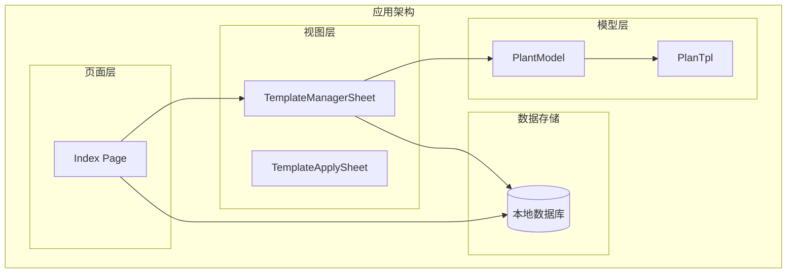
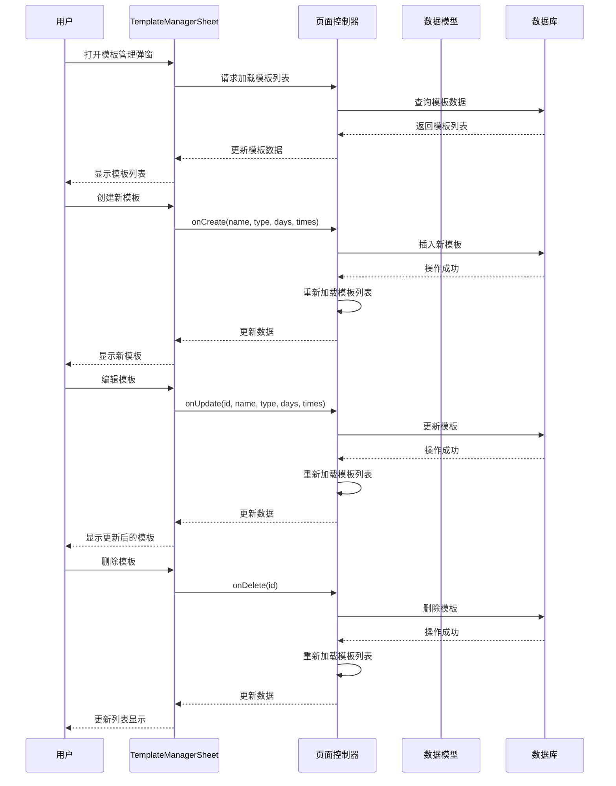
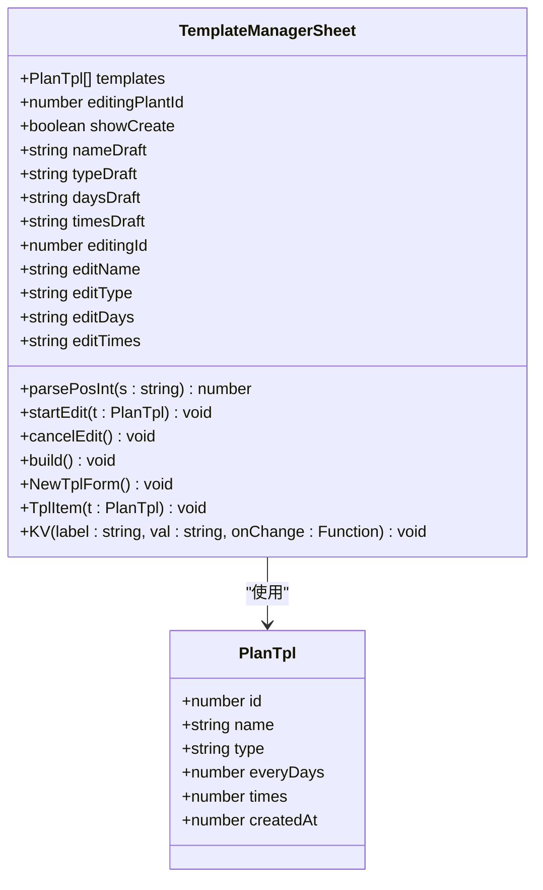
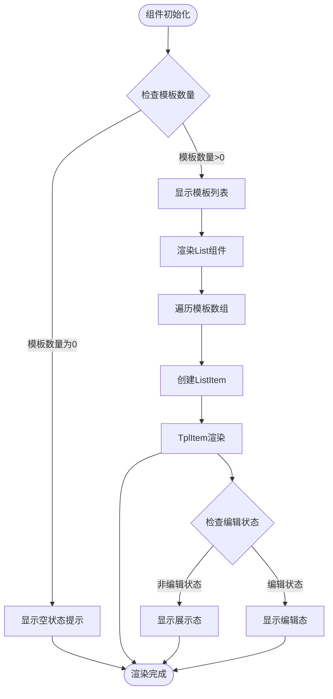
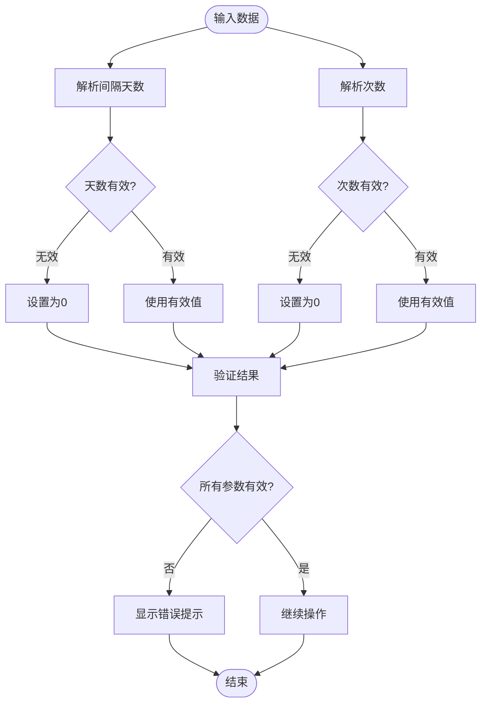
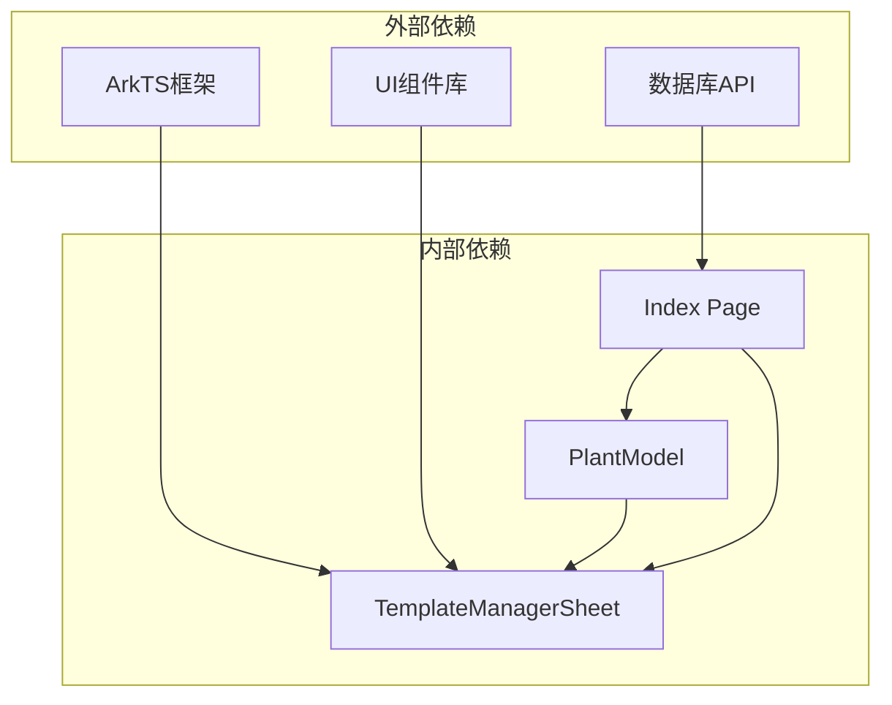

# 模板管理弹窗组件API

<cite>
**本文档引用的文件**
- [TemplateManagerSheet.ets](file://entry/src/main/ets/view/TemplateManagerSheet.ets)
- [PlantModel.ets](file://entry/src/main/ets/model/PlantModel.ets)
- [Index.ets](file://entry/src/main/ets/pages/Index.ets)
</cite>

## 目录
1. [简介](#简介)
2. [项目结构](#项目结构)
3. [核心组件](#核心组件)
4. [架构概览](#架构概览)
5. [详细组件分析](#详细组件分析)
6. [依赖关系分析](#依赖关系分析)
7. [性能考虑](#性能考虑)
8. [故障排除指南](#故障排除指南)
9. [结论](#结论)

## 简介

TemplateManagerSheet 是 PlantDiary 应用中的模板管理弹窗组件，用于管理植物养护周期模板。该组件提供了模板的创建、编辑、删除和应用功能，支持用户通过弹窗界面进行模板管理操作。组件采用 ArkTS 框架开发，实现了响应式数据绑定和事件处理机制。

## 项目结构

TemplateManagerSheet 组件位于应用的视图层，与数据模型和页面控制器协同工作：

**图表来源**
- [TemplateManagerSheet.ets:1-249](file://entry/src/main/ets/view/TemplateManagerSheet.ets#L1-L249)
- [PlantModel.ets:23-40](file://entry/src/main/ets/model/PlantModel.ets#L23-L40)
- [Index.ets:1148-1169](file://entry/src/main/ets/pages/Index.ets#L1148-L1169)

**章节来源**
- [TemplateManagerSheet.ets:1-249](file://entry/src/main/ets/view/TemplateManagerSheet.ets#L1-L249)
- [PlantModel.ets:1-166](file://entry/src/main/ets/model/PlantModel.ets#L1-L166)
- [Index.ets:1148-1169](file://entry/src/main/ets/pages/Index.ets#L1148-L1169)

## 核心组件

TemplateManagerSheet 是一个基于 ArkTS 的组件，具有以下核心特性：

### 组件结构
- **组件类型**: `@ComponentV2` 结构体组件
- **数据绑定**: 使用 `@Param`、`@Local` 和 `@Event` 装饰器
- **状态管理**: 内置本地状态变量
- **事件处理**: 支持多种回调事件

### 主要功能模块
1. **模板列表展示**: 显示现有模板列表
2. **模板创建**: 提供新建模板的表单界面
3. **模板编辑**: 支持对现有模板进行编辑
4. **模板删除**: 提供删除模板的功能
5. **模板应用**: 将模板应用到指定植物

**章节来源**
- [TemplateManagerSheet.ets:3-249](file://entry/src/main/ets/view/TemplateManagerSheet.ets#L3-L249)

## 架构概览

TemplateManagerSheet 采用 MVVM 架构模式，与页面控制器协同工作：

**图表来源**
- [TemplateManagerSheet.ets:8-11](file://entry/src/main/ets/view/TemplateManagerSheet.ets#L8-L11)
- [Index.ets:1156-1167](file://entry/src/main/ets/pages/Index.ets#L1156-L1167)

## 详细组件分析

### 参数配置和属性定义

TemplateManagerSheet 组件接受以下参数：

| 参数名 | 类型 | 必需 | 默认值 | 描述 |
|--------|------|------|--------|------|
| `templates` | `Array<PlanTpl>` | 是 | - | 模板列表数据数组 |
| `editingPlantId` | `number` | 是 | - | 当前编辑的植物ID |

**章节来源**
- [TemplateManagerSheet.ets:5-6](file://entry/src/main/ets/view/TemplateManagerSheet.ets#L5-L6)

### 事件处理器和回调函数

组件定义了以下事件处理器：

| 事件名 | 参数 | 返回值 | 描述 |
|--------|------|--------|------|
| `onClose` | `() => void` | `void` | 关闭弹窗事件 |
| `onCreate` | `(name: string, type: string, everyDays: number, times: number) => void` | `void` | 创建模板事件 |
| `onUpdate` | `(id: number, name: string, type: string, everyDays: number, times: number) => void` | `void` | 更新模板事件 |
| `onDelete` | `(id: number) => void` | `void` | 删除模板事件 |
| `onApply` | `(id: number) => void` | `void` | 应用模板事件 |

**章节来源**
- [TemplateManagerSheet.ets:7-11](file://entry/src/main/ets/view/TemplateManagerSheet.ets#L7-L11)

### 数据绑定机制

组件使用 ArkTS 的响应式数据绑定机制：

**图表来源**
- [TemplateManagerSheet.ets:12-21](file://entry/src/main/ets/view/TemplateManagerSheet.ets#L12-L21)
- [PlantModel.ets:24-39](file://entry/src/main/ets/model/PlantModel.ets#L24-L39)

### 模板列表展示逻辑

组件采用条件渲染的方式展示模板列表：

**图表来源**
- [TemplateManagerSheet.ets:84-101](file://entry/src/main/ets/view/TemplateManagerSheet.ets#L84-L101)
- [TemplateManagerSheet.ets:158-229](file://entry/src/main/ets/view/TemplateManagerSheet.ets#L158-L229)

### 模板增删改查操作接口

#### 创建模板
- **触发方式**: 点击"新建模板"按钮
- **数据验证**: 验证模板名称、间隔天数、次数的有效性
- **数据传递**: 通过 `onCreate` 事件回调传递模板数据
- **数据格式**: `{ name, type, everyDays, times }`

#### 更新模板
- **触发方式**: 在模板编辑状态下点击"保存"
- **数据验证**: 验证模板ID、名称、间隔天数、次数的有效性
- **数据传递**: 通过 `onUpdate` 事件回调传递更新数据
- **数据格式**: `{ id, name, type, everyDays, times }`

#### 删除模板
- **触发方式**: 点击模板项的"删除"按钮
- **数据传递**: 通过 `onDelete` 事件回调传递模板ID
- **数据格式**: `{ id }`

#### 应用模板
- **触发方式**: 点击模板项的"应用"按钮
- **数据传递**: 通过 `onApply` 事件回调传递模板ID
- **数据格式**: `{ id }`

**章节来源**
- [TemplateManagerSheet.ets:128-150](file://entry/src/main/ets/view/TemplateManagerSheet.ets#L128-L150)
- [TemplateManagerSheet.ets:195-218](file://entry/src/main/ets/view/TemplateManagerSheet.ets#L195-L218)
- [TemplateManagerSheet.ets:169-177](file://entry/src/main/ets/view/TemplateManagerSheet.ets#L169-L177)

### 状态管理和用户交互处理

组件维护以下状态变量：

| 状态变量 | 类型 | 默认值 | 用途 |
|----------|------|--------|------|
| `showCreate` | `boolean` | `false` | 控制新建表单的显示/隐藏 |
| `nameDraft` | `string` | `''` | 新建模板的名称草稿 |
| `typeDraft` | `string` | `'浇水'` | 新建模板的类型草稿 |
| `daysDraft` | `string` | `'7'` | 新建模板的间隔天数草稿 |
| `timesDraft` | `string` | `'4'` | 新建模板的次数草稿 |
| `editingId` | `number` | `0` | 当前编辑模板的ID |
| `editName` | `string` | `''` | 编辑模板的名称草稿 |
| `editType` | `string` | `'浇水'` | 编辑模板的类型草稿 |
| `editDays` | `string` | `'7'` | 编辑模板的间隔天数草稿 |
| `editTimes` | `string` | `'4'` | 编辑模板的次数草稿 |

**章节来源**
- [TemplateManagerSheet.ets:12-21](file://entry/src/main/ets/view/TemplateManagerSheet.ets#L12-L21)

### 数据验证机制

组件实现了输入数据的验证逻辑：

**图表来源**
- [TemplateManagerSheet.ets:23-29](file://entry/src/main/ets/view/TemplateManagerSheet.ets#L23-L29)

**章节来源**
- [TemplateManagerSheet.ets:23-29](file://entry/src/main/ets/view/TemplateManagerSheet.ets#L23-L29)

## 依赖关系分析

### 组件间依赖关系

**图表来源**
- [TemplateManagerSheet.ets:1](file://entry/src/main/ets/view/TemplateManagerSheet.ets#L1)
- [PlantModel.ets:1](file://entry/src/main/ets/model/PlantModel.ets#L1)

### 数据模型依赖

TemplateManagerSheet 依赖于 PlantModel 中的 PlanTpl 数据模型：

| PlanTpl 字段 | 类型 | 描述 |
|-------------|------|------|
| `id` | `number` | 模板唯一标识符 |
| `name` | `string` | 模板名称 |
| `type` | `string` | 模板类型（如"浇水"） |
| `everyDays` | `number` | 间隔天数 |
| `times` | `number` | 重复次数 |
| `createdAt` | `number` | 创建时间戳 |

**章节来源**
- [PlantModel.ets:24-39](file://entry/src/main/ets/model/PlantModel.ets#L24-L39)

## 性能考虑

### 渲染优化
- 使用 `ForEach` 组件进行模板列表渲染，支持高效的列表更新
- 采用条件渲染减少不必要的DOM节点创建
- 使用 `@Local` 装饰器管理局部状态，避免全局状态污染

### 内存管理
- 编辑状态独立存储，避免直接修改原始数据对象
- 及时清理编辑状态，防止内存泄漏
- 合理使用 `@Builder` 装饰器优化组件构建过程

### 数据绑定优化
- 使用响应式数据绑定机制，自动更新UI
- 避免在渲染过程中进行昂贵的操作
- 合理使用 `@Param` 和 `@Local` 装饰器区分不同类型的属性

## 故障排除指南

### 常见问题及解决方案

#### 模板创建失败
**问题**: 创建模板时出现"模板参数不合法"提示
**原因**: 输入的模板名称为空，或间隔天数/次数小于等于0
**解决方案**: 
1. 确保模板名称非空
2. 确保间隔天数和次数都大于0
3. 检查输入框的数值格式

#### 模板更新失败
**问题**: 更新模板时出现"模板参数不合法"提示
**原因**: 模板ID为0，或更新参数无效
**解决方案**:
1. 确保选择了正确的模板进行编辑
2. 检查所有必填字段的输入
3. 验证数值输入的有效性

#### 模板应用失败
**问题**: 应用模板时提示"请先选择/保存植物"
**原因**: 当前没有选中的植物
**解决方案**:
1. 先选择或创建一个植物
2. 确保 `editingPlantId` 不为0
3. 重新尝试应用模板

#### 模板列表为空
**问题**: 模板管理弹窗显示"暂无模板"
**原因**: 数据库中没有模板记录
**解决方案**:
1. 点击"新建模板"按钮创建第一个模板
2. 检查数据库连接是否正常
3. 确认模板数据加载逻辑

**章节来源**
- [Index.ets:583](file://entry/src/main/ets/pages/Index.ets#L583)
- [Index.ets:603](file://entry/src/main/ets/pages/Index.ets#L603)
- [Index.ets:632](file://entry/src/main/ets/pages/Index.ets#L632)

## 结论

TemplateManagerSheet 模板管理弹窗组件是一个功能完整、设计合理的组件，具有以下特点：

### 设计优势
- **清晰的职责分离**: 组件专注于模板管理功能，与其他组件解耦
- **响应式数据绑定**: 使用 ArkTS 的现代数据绑定机制
- **完善的事件处理**: 支持完整的 CRUD 操作和应用功能
- **良好的用户体验**: 提供直观的弹窗界面和状态反馈

### 技术特色
- **MVVM 架构**: 与页面控制器协同工作，实现数据驱动的UI更新
- **类型安全**: 使用 TypeScript 风格的类型定义确保代码质量
- **性能优化**: 采用多种优化策略提升渲染性能和内存使用效率

### 扩展性
组件设计具有良好扩展性，可以轻松添加新的模板类型、自定义验证规则或集成其他数据源。同时，组件的事件驱动架构使得与不同页面控制器的集成变得简单直接。

该组件为 PlantDiary 应用提供了强大的模板管理能力，是应用功能的重要组成部分。