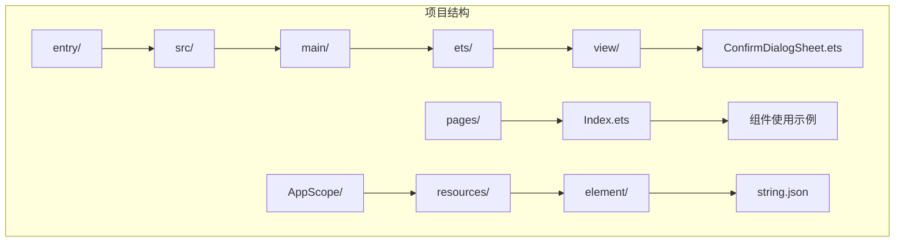
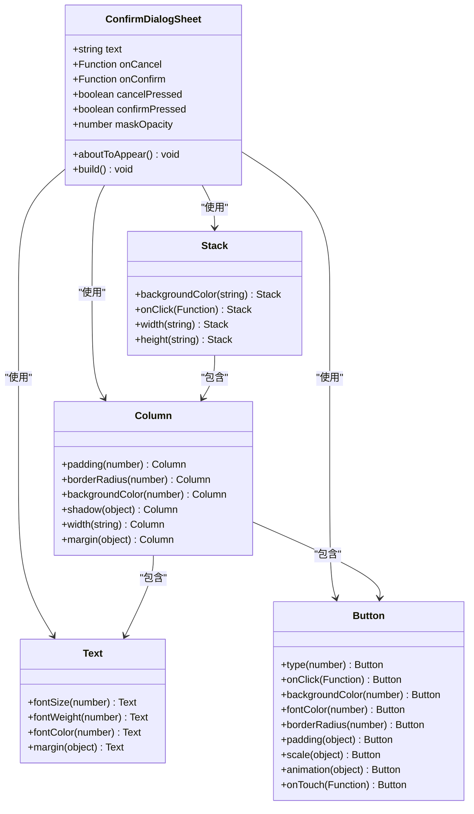
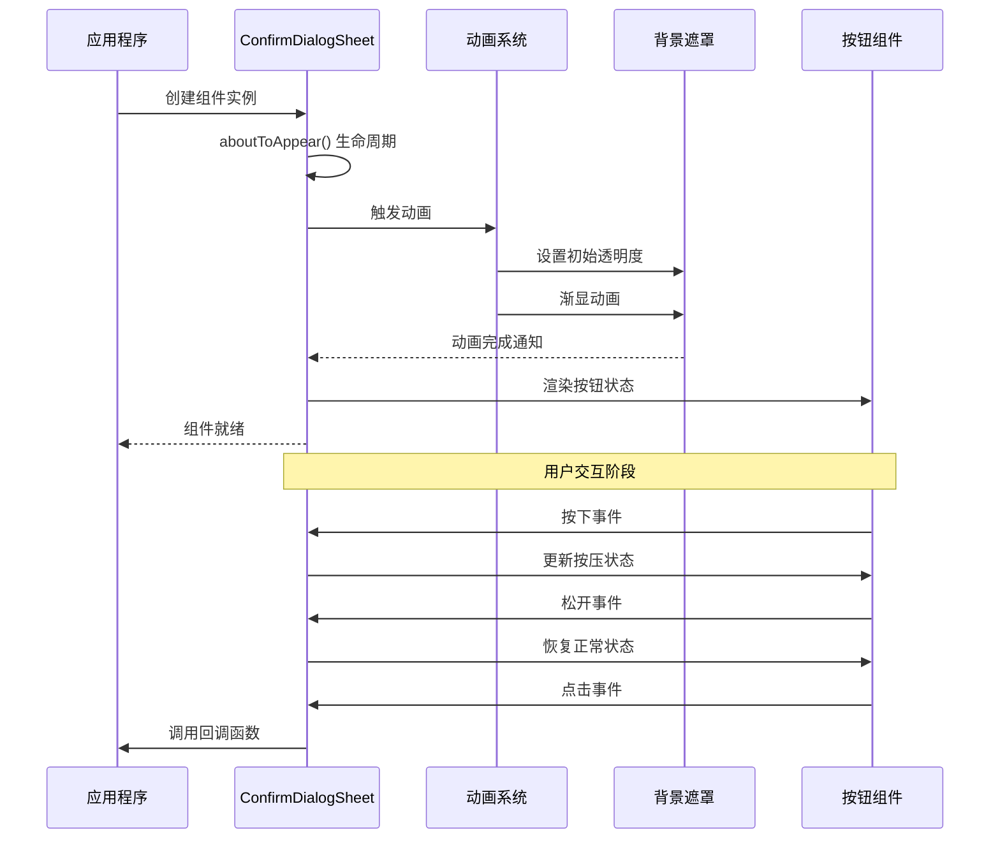
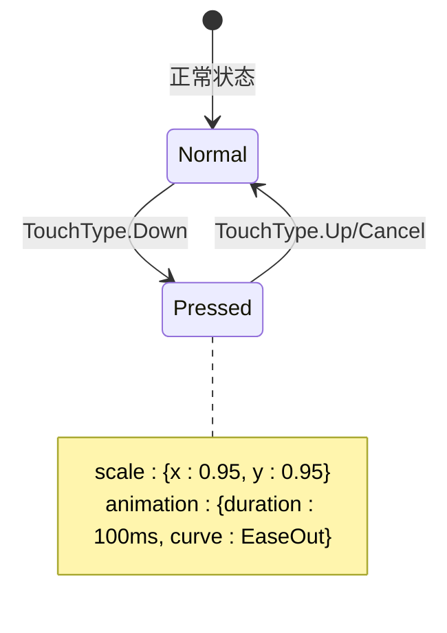
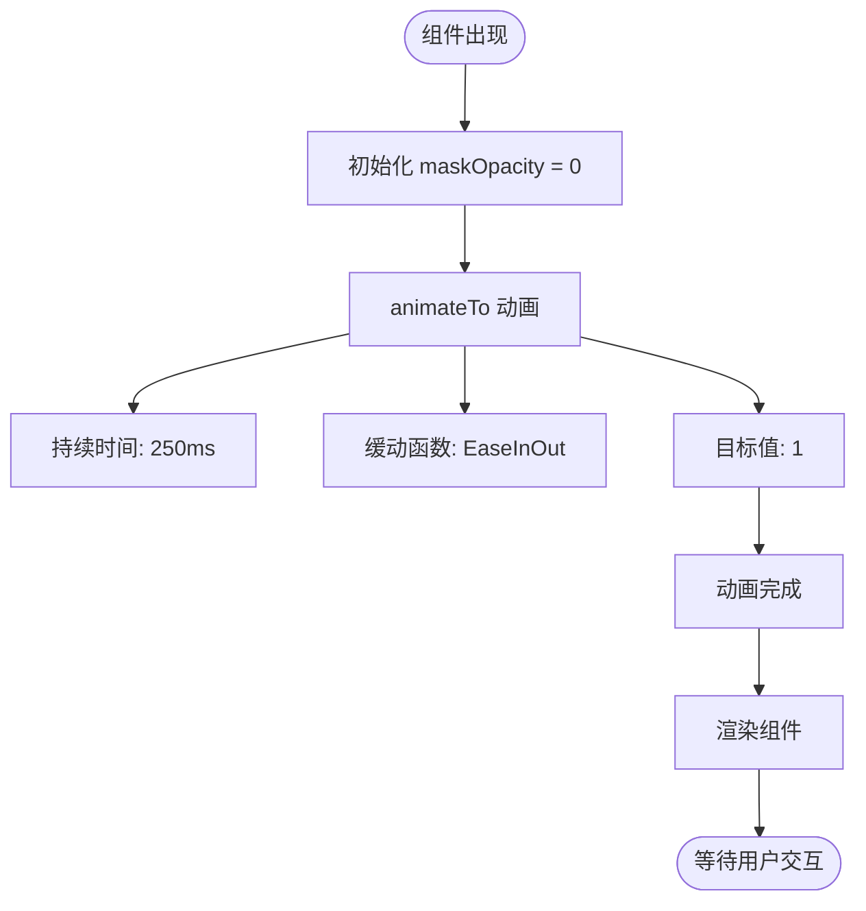
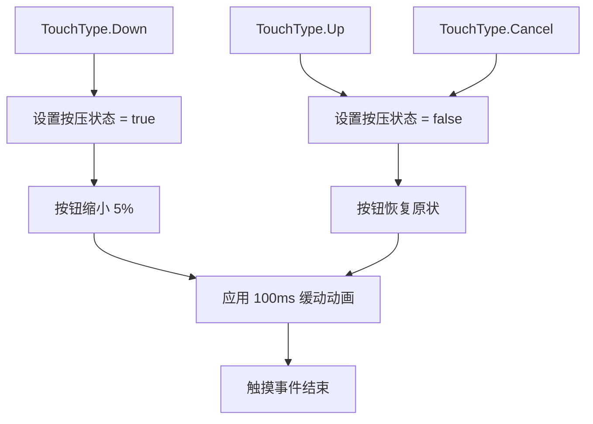
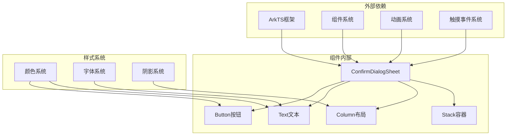
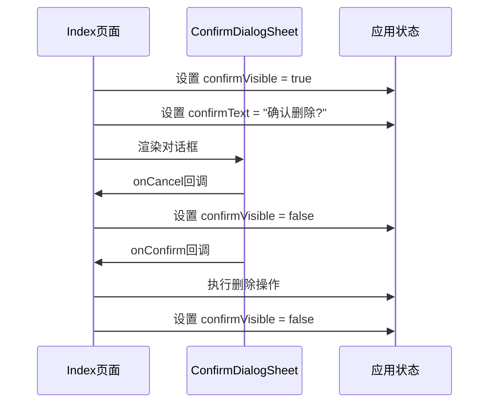

# 确认对话框组件API

<cite>
**本文档引用的文件**
- [ConfirmDialogSheet.ets](file://entry/src/main/ets/view/ConfirmDialogSheet.ets)
- [Index.ets](file://entry/src/main/ets/pages/Index.ets)
</cite>

## 目录
1. [简介](#简介)
2. [项目结构](#项目结构)
3. [核心组件](#核心组件)
4. [架构概览](#架构概览)
5. [详细组件分析](#详细组件分析)
6. [依赖关系分析](#依赖关系分析)
7. [性能考虑](#性能考虑)
8. [故障排除指南](#故障排除指南)
9. [结论](#结论)

## 简介

ConfirmDialogSheet是一个自定义的覆盖式确认对话框组件，用于在应用程序中提供标准的确认操作界面。该组件实现了现代化的用户界面设计，包含背景遮罩动画、按钮按压反馈效果和流畅的过渡动画。

## 项目结构

ConfirmDialogSheet组件位于项目的视图层，采用模块化的架构设计：

**图表来源**
- [ConfirmDialogSheet.ets:1-103](file://entry/src/main/ets/view/ConfirmDialogSheet.ets#L1-L103)
- [Index.ets:1-50](file://entry/src/main/ets/pages/Index.ets#L1-L50)

**章节来源**
- [ConfirmDialogSheet.ets:1-103](file://entry/src/main/ets/view/ConfirmDialogSheet.ets#L1-L103)
- [Index.ets:1-50](file://entry/src/main/ets/pages/Index.ets#L1-L50)

## 核心组件

### 组件定义

ConfirmDialogSheet是一个基于ArkTS框架的自定义组件，具有以下核心特性：

- **覆盖式设计**：完全覆盖屏幕，提供沉浸式的确认体验
- **动画支持**：内置背景遮罩渐显动画和按钮按压反馈
- **响应式交互**：支持触摸事件和点击事件
- **可定制文本**：通过text属性动态显示确认内容

### 主要属性

| 属性名 | 类型 | 必需 | 默认值 | 描述 |
|--------|------|------|--------|------|
| text | string | 是 | - | 对话框中显示的确认文本内容 |
| onCancel | () => void | 是 | - | 取消按钮的回调函数 |
| onConfirm | () => void | 是 | - | 确认按钮的回调函数 |

### 本地状态管理

组件内部维护以下本地状态：

| 状态名 | 类型 | 默认值 | 描述 |
|--------|------|--------|------|
| cancelPressed | boolean | false | 取消按钮的按压状态 |
| confirmPressed | boolean | false | 确认按钮的按压状态 |
| maskOpacity | number | 0 | 背景遮罩的透明度值 |

**章节来源**
- [ConfirmDialogSheet.ets:3-11](file://entry/src/main/ets/view/ConfirmDialogSheet.ets#L3-L11)

## 架构概览

### 组件架构图

**图表来源**
- [ConfirmDialogSheet.ets:20-101](file://entry/src/main/ets/view/ConfirmDialogSheet.ets#L20-L101)

### 组件生命周期

**图表来源**
- [ConfirmDialogSheet.ets:13-18](file://entry/src/main/ets/view/ConfirmDialogSheet.ets#L13-L18)
- [ConfirmDialogSheet.ets:52-58](file://entry/src/main/ets/view/ConfirmDialogSheet.ets#L52-L58)
- [ConfirmDialogSheet.ets:76-82](file://entry/src/main/ets/view/ConfirmDialogSheet.ets#L76-L82)

## 详细组件分析

### 参数配置详解

#### 文本内容属性 (text)

text属性是组件的核心配置项，用于动态显示确认对话框的内容：

- **类型**：string
- **必需性**：是
- **作用**：控制对话框中显示的确认文本
- **使用方式**：通过组件构造函数传递

#### 事件处理器

组件提供了两个重要的事件处理器：

##### onCancel 回调函数
- **签名**：`() => void`
- **触发时机**：当用户点击取消按钮或点击背景遮罩区域时
- **默认行为**：关闭对话框
- **自定义用途**：执行取消操作后的清理逻辑

##### onConfirm 回调函数
- **签名**：`() => void`
- **触发时机**：当用户点击确认按钮时
- **默认行为**：执行确认操作并关闭对话框
- **自定义用途**：执行删除、保存或其他确认操作

**章节来源**
- [ConfirmDialogSheet.ets:4-6](file://entry/src/main/ets/view/ConfirmDialogSheet.ets#L4-L6)

### 本地状态管理

#### 按钮按压状态

组件实现了精细的按钮按压反馈机制：

**图表来源**
- [ConfirmDialogSheet.ets:50-51](file://entry/src/main/ets/view/ConfirmDialogSheet.ets#L50-L51)
- [ConfirmDialogSheet.ets:74-75](file://entry/src/main/ets/view/ConfirmDialogSheet.ets#L74-L75)

#### 背景遮罩透明度动画

背景遮罩实现了平滑的渐显动画效果：

- **初始状态**：maskOpacity = 0（完全透明）
- **目标状态**：maskOpacity = 1（完全不透明）
- **动画时长**：250ms
- **缓动函数**：EaseInOut
- **计算公式**：`rgba(0,0,0,${0.6 * this.maskOpacity})`

**章节来源**
- [ConfirmDialogSheet.ets:13-18](file://entry/src/main/ets/view/ConfirmDialogSheet.ets#L13-L18)
- [ConfirmDialogSheet.ets:26](file://entry/src/main/ets/view/ConfirmDialogSheet.ets#L26)

### 生命周期方法

#### aboutToAppear 方法

aboutToAppear是组件的生命周期钩子，负责初始化动画：

**图表来源**
- [ConfirmDialogSheet.ets:13-18](file://entry/src/main/ets/view/ConfirmDialogSheet.ets#L13-L18)

**章节来源**
- [ConfirmDialogSheet.ets:13-18](file://entry/src/main/ets/view/ConfirmDialogSheet.ets#L13-L18)

### UI结构构建

#### Stack布局

Stack作为根容器提供了全屏覆盖能力：

- **宽度**：100%
- **高度**：100%
- **功能**：作为背景遮罩和对话框的容器

#### Column容器

组件使用了两层Column布局：

1. **第一层Column**：背景遮罩层
   - 占满全屏
   - 黑色半透明背景
   - 点击事件触发取消操作

2. **第二层Column**：对话框主体层
   - 圆角矩形设计
   - 白色背景
   - 投影效果增强立体感
   - 内部包含文本和按钮

#### Text文本显示

组件包含两个层级的文本内容：

1. **标题文本**："请确认"
   - 字体大小：16px
   - 字体粗细：Medium
   - 字体颜色：#FF263238
   - 底部间距：6px

2. **内容文本**：动态内容
   - 字体大小：14px
   - 字体颜色：#FF607D8B

#### Button按钮样式

按钮组件实现了胶囊形状的设计：

1. **取消按钮**：
   - 背景色：#FFE0E0E0
   - 字体颜色：#FF263238
   - 圆角半径：18px
   - 内边距：18px左右，8px上下
   - 按压时缩小5%

2. **确认按钮**：
   - 背景色：#FF2E7D32
   - 字体颜色：#FFFFFFFF
   - 圆角半径：18px
   - 内边距：18px左右，8px上下
   - 按压时缩小5%
   - 左侧外边距：12px

**章节来源**
- [ConfirmDialogSheet.ets:20-101](file://entry/src/main/ets/view/ConfirmDialogSheet.ets#L20-L101)

### 触摸事件处理

#### onTouch实现细节

组件为两个按钮都实现了完整的触摸事件处理：

**图表来源**
- [ConfirmDialogSheet.ets:52-58](file://entry/src/main/ets/view/ConfirmDialogSheet.ets#L52-L58)
- [ConfirmDialogSheet.ets:76-82](file://entry/src/main/ets/view/ConfirmDialogSheet.ets#L76-L82)

#### 事件处理流程

1. **按下阶段**：
   - 检测TouchType.Down事件
   - 更新对应按钮的按压状态
   - 应用缩放动画效果

2. **释放阶段**：
   - 检测TouchType.Up或TouchType.Cancel事件
   - 恢复按钮的正常状态
   - 移除缩放效果

3. **动画配置**：
   - 持续时间：100ms
   - 缓动函数：EaseOut
   - 缩放比例：0.95

**章节来源**
- [ConfirmDialogSheet.ets:52-82](file://entry/src/main/ets/view/ConfirmDialogSheet.ets#L52-L82)

## 依赖关系分析

### 组件依赖图

**图表来源**
- [ConfirmDialogSheet.ets:1-103](file://entry/src/main/ets/view/ConfirmDialogSheet.ets#L1-L103)

### 使用场景

#### 在Index页面中的集成

ConfirmDialogSheet在Index页面中被广泛使用：

**图表来源**
- [Index.ets:1067-1083](file://entry/src/main/ets/pages/Index.ets#L1067-L1083)

**章节来源**
- [Index.ets:1067-1083](file://entry/src/main/ets/pages/Index.ets#L1067-L1083)

## 性能考虑

### 动画性能优化

1. **动画时长控制**：
   - 背景遮罩动画：250ms（视觉舒适度平衡）
   - 按钮按压动画：100ms（即时反馈）

2. **缓动函数选择**：
   - 背景遮罩：EaseInOut（自然开始和结束）
   - 按钮按压：EaseOut（快速响应）

3. **状态更新优化**：
   - 使用局部状态管理减少全局重渲染
   - 按需更新按钮状态避免不必要的重绘

### 内存管理

- 组件状态都是轻量级数据类型
- 事件处理器使用箭头函数避免this绑定问题
- 动画资源在组件销毁时自动清理

## 故障排除指南

### 常见问题及解决方案

#### 问题1：对话框无法显示

**症状**：组件创建后不显示任何内容

**可能原因**：
- text属性未正确设置
- 父组件未正确渲染组件
- 样式配置错误

**解决方法**：
1. 确保text属性为非空字符串
2. 检查父组件的条件渲染逻辑
3. 验证CSS样式配置

#### 问题2：按钮无响应

**症状**：点击按钮没有反应

**可能原因**：
- onClick事件未正确绑定
- onTouch事件处理异常
- 父组件阻止了事件传播

**解决方法**：
1. 检查onCancel和onConfirm回调函数的实现
2. 验证触摸事件的事件类型判断
3. 确认事件冒泡和捕获机制

#### 问题3：动画效果异常

**症状**：背景遮罩或按钮动画不流畅

**可能原因**：
- 动画时长设置不合理
- 缓动函数选择不当
- 设备性能不足

**解决方法**：
1. 调整动画时长参数
2. 更换合适的缓动函数
3. 优化设备性能或降低动画复杂度

**章节来源**
- [ConfirmDialogSheet.ets:13-18](file://entry/src/main/ets/view/ConfirmDialogSheet.ets#L13-L18)
- [ConfirmDialogSheet.ets:52-82](file://entry/src/main/ets/view/ConfirmDialogSheet.ets#L52-L82)

## 结论

ConfirmDialogSheet确认对话框组件是一个功能完整、设计精良的UI组件。它成功地结合了现代移动应用的设计理念和ArkTS框架的技术特性，提供了：

1. **直观的用户界面**：清晰的文本内容和按钮布局
2. **流畅的交互体验**：平滑的动画效果和即时的反馈
3. **良好的可扩展性**：模块化的架构便于功能扩展
4. **完善的事件处理**：全面的触摸和点击事件支持

该组件为开发者提供了一个可靠的确认对话框解决方案，可以轻松集成到各种应用场景中，满足现代移动应用的用户体验需求。