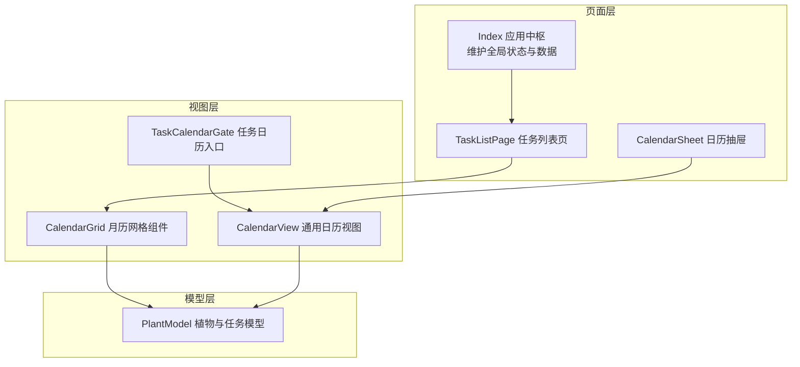
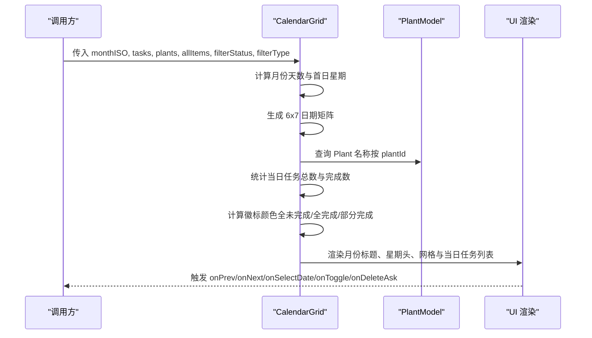
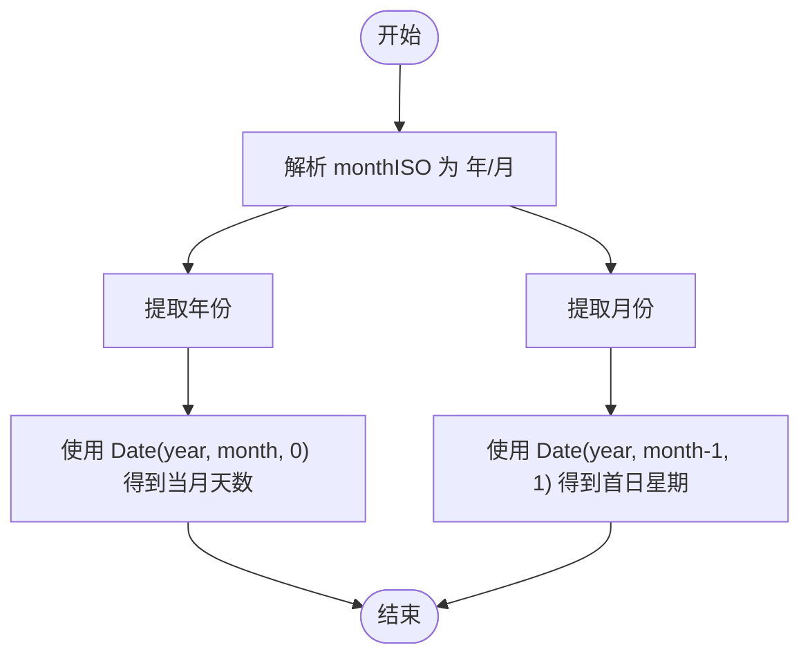
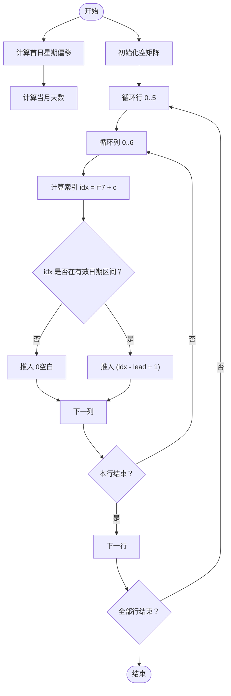
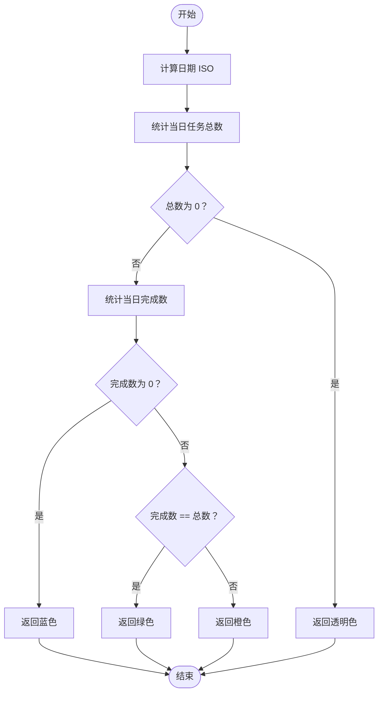
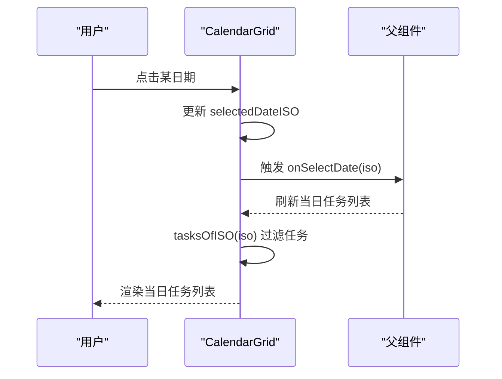
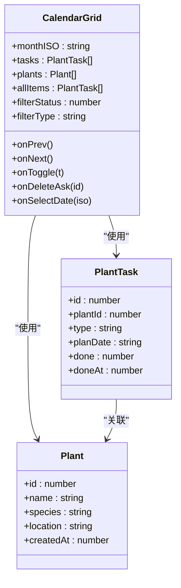

# CalendarGrid 日历网格组件

<cite>
**本文档引用的文件**
- [CalendarGrid.ets](file://entry/src/main/ets/view/CalendarGrid.ets)
- [PlantModel.ets](file://entry/src/main/ets/model/PlantModel.ets)
- [CalendarSheet.ets](file://entry/src/main/ets/pages/CalendarSheet.ets)
- [TaskCalendarGate.ets](file://entry/src/main/ets/view/TaskCalendarGate.ets)
- [CalendarView.ets](file://entry/src/main/ets/view/CalendarView.ets)
- [Index.ets](file://entry/src/main/ets/pages/Index.ets)
</cite>

## 目录
1. [简介](#简介)
2. [项目结构](#项目结构)
3. [核心组件](#核心组件)
4. [架构总览](#架构总览)
5. [详细组件分析](#详细组件分析)
6. [依赖关系分析](#依赖关系分析)
7. [性能考虑](#性能考虑)
8. [故障排除指南](#故障排除指南)
9. [结论](#结论)
10. [附录](#附录)

## 简介
CalendarGrid 是一个轻量级的月度日历网格组件，采用结构化组件（struct ComponentV2）实现，支持月份导航、日期选择、任务统计与徽标展示，并提供与任务切换、删除确认、日期选择等事件的回调接口。组件内部通过固定 6×7 的网格布局生成器，结合筛选条件（完成状态与任务类型）进行任务统计与视觉反馈，适用于植物管理、任务安排与光照记录等场景。

## 项目结构
该组件位于视图层，依赖于数据模型 Plant 与 PlantTask，并在页面层被多个入口组件复用：
- 视图层：CalendarGrid（结构化组件）
- 页面层：Index（应用状态中枢）、TaskListPage（任务列表页）、CalendarSheet（日历抽屉）
- 门面层：TaskCalendarGate（任务页入口）、CalendarView（通用日历视图包装）

**图表来源**
- [CalendarGrid.ets:1-351](file://entry/src/main/ets/view/CalendarGrid.ets#L1-L351)
- [CalendarView.ets:512-566](file://entry/src/main/ets/view/CalendarView.ets#L512-L566)
- [CalendarSheet.ets:1-504](file://entry/src/main/ets/pages/CalendarSheet.ets#L1-L504)
- [TaskCalendarGate.ets:1-81](file://entry/src/main/ets/view/TaskCalendarGate.ets#L1-L81)
- [Index.ets:1-200](file://entry/src/main/ets/pages/Index.ets#L1-L200)

**章节来源**
- [CalendarGrid.ets:1-351](file://entry/src/main/ets/view/CalendarGrid.ets#L1-L351)
- [CalendarView.ets:512-566](file://entry/src/main/ets/view/CalendarView.ets#L512-L566)
- [CalendarSheet.ets:1-504](file://entry/src/main/ets/pages/CalendarSheet.ets#L1-L504)
- [TaskCalendarGate.ets:1-81](file://entry/src/main/ets/view/TaskCalendarGate.ets#L1-L81)
- [Index.ets:1-200](file://entry/src/main/ets/pages/Index.ets#L1-L200)

## 核心组件
- 组件名称：CalendarGrid（结构化组件）
- 组件类型：struct ComponentV2
- 作用域：视图层，作为轻量月历网格，支持 master-detail（日期选择与当日任务列表）的组合交互

**章节来源**
- [CalendarGrid.ets:4-30](file://entry/src/main/ets/view/CalendarGrid.ets#L4-L30)

## 架构总览
CalendarGrid 以 monthISO（YYYY-MM）为输入，结合 tasks（PlantTask 数组）、plants（Plant 数组）与 allItems（全部任务用于徽标统计），在组件内部生成 6×7 的日期矩阵，并根据筛选条件（filterStatus、filterType）进行任务统计与徽标颜色逻辑，最终渲染出带任务数量与完成度徽标的日期格。

**图表来源**
- [CalendarGrid.ets:166-351](file://entry/src/main/ets/view/CalendarGrid.ets#L166-L351)
- [PlantModel.ets:43-59](file://entry/src/main/ets/model/PlantModel.ets#L43-L59)

**章节来源**
- [CalendarGrid.ets:166-351](file://entry/src/main/ets/view/CalendarGrid.ets#L166-L351)
- [PlantModel.ets:43-59](file://entry/src/main/ets/model/PlantModel.ets#L43-L59)

## 详细组件分析

### 参数配置
- monthISO: string（必填）- 月份标识，格式为 YYYY-MM
- tasks: Array<PlantTask>（必填）- 任务数组，按 planDate 与 plantId 关联植物
- plants: Array<Plant>（必填）- 植物数组，用于根据 plantId 显示植物名称
- allItems: Array<PlantTask>（必填）- 全部任务集合，用于徽标统计（按日期与筛选条件统计）
- filterStatus: number（必填）- 筛选状态：0=全部，1=未完成，2=已完成
- filterType: string（必填）- 筛选类型：'' 或具体类型（如 '浇水'、'施肥'、'修剪'）

上述参数均通过 @Param/@Require 注解声明，确保在组件构建时必须提供。

**章节来源**
- [CalendarGrid.ets:6-17](file://entry/src/main/ets/view/CalendarGrid.ets#L6-L17)

### 事件接口
- onPrev: () => void - 切换至上一月
- onNext: () => void - 切换至下一月
- onToggle: (t: PlantTask) => void - 切换任务完成状态
- onDeleteAsk: (taskId: number) => void - 请求删除任务（由父组件处理确认）
- onSelectDate: (iso: string) => void - 选中某日期（触发下方当日任务列表更新）

这些事件通过 @Event 注解声明，供父组件绑定处理逻辑。

**章节来源**
- [CalendarGrid.ets:9-13](file://entry/src/main/ets/view/CalendarGrid.ets#L9-L13)

### 核心功能实现

#### 1) 月份计算与星期偏移
- daysInMonth(): number - 依据 monthISO 计算当月天数
- weekdayOfFirst(): number - 计算当月第一天是星期几（0~6）

**图表来源**
- [CalendarGrid.ets:72-84](file://entry/src/main/ets/view/CalendarGrid.ets#L72-L84)

**章节来源**
- [CalendarGrid.ets:72-84](file://entry/src/main/ets/view/CalendarGrid.ets#L72-L84)

#### 2) 6×7 网格生成
- monthMatrix(): Array<Array<number>> - 生成固定 6×7 的日期矩阵，空白位用 0 占位
- 生成策略：根据首日星期与当月天数，计算前导空位与日期填充

**图表来源**
- [CalendarGrid.ets:88-109](file://entry/src/main/ets/view/CalendarGrid.ets#L88-L109)

**章节来源**
- [CalendarGrid.ets:88-109](file://entry/src/main/ets/view/CalendarGrid.ets#L88-L109)

#### 3) 任务统计与徽标颜色逻辑
- totalByDate(iso: string): number - 统计指定日期的任务总数（受筛选影响）
- doneByDate(iso: string): number - 统计指定日期已完成的任务数（受筛选影响）
- badgeColor(day: number): ResourceColor - 根据当日完成情况返回徽标颜色
  - 全未完成：蓝色
  - 全完成：绿色
  - 部分完成：橙色
  - 无任务：透明

**图表来源**
- [CalendarGrid.ets:45-69](file://entry/src/main/ets/view/CalendarGrid.ets#L45-L69)
- [CalendarGrid.ets:150-163](file://entry/src/main/ets/view/CalendarGrid.ets#L150-L163)

**章节来源**
- [CalendarGrid.ets:45-69](file://entry/src/main/ets/view/CalendarGrid.ets#L45-L69)
- [CalendarGrid.ets:150-163](file://entry/src/main/ets/view/CalendarGrid.ets#L150-L163)

#### 4) 日期选择与当日任务列表
- selectedDateISO: string - 当前选中日期（ISO）
- onSelectDate(iso: string) - 更新选中日期并通知父组件
- tasksOfISO(iso: string): Array<PlantTask> - 返回指定日期的任务列表
- countTasksAtDayISO(iso: string): number - 统计指定日期任务数量

**图表来源**
- [CalendarGrid.ets:248-270](file://entry/src/main/ets/view/CalendarGrid.ets#L248-L270)
- [CalendarGrid.ets:343-348](file://entry/src/main/ets/view/CalendarGrid.ets#L343-L348)

**章节来源**
- [CalendarGrid.ets:248-270](file://entry/src/main/ets/view/CalendarGrid.ets#L248-L270)
- [CalendarGrid.ets:343-348](file://entry/src/main/ets/view/CalendarGrid.ets#L343-L348)

#### 5) 筛选逻辑
- matchFilter(it: PlantTask): boolean - 组合 filterStatus 与 filterType 进行筛选
  - filterStatus=1：排除已完成
  - filterStatus=2：排除未完成
  - filterType 非空：仅保留对应类型

**章节来源**
- [CalendarGrid.ets:32-43](file://entry/src/main/ets/view/CalendarGrid.ets#L32-L43)

### 使用示例

#### 示例一：在任务列表页集成
- 将 CalendarGrid 作为任务列表页的月视图入口，传入 currentMonthISO、tasks、plants、allItems、filterStatus、filterType，并绑定 onPrev、onNext、onSelectDate、onToggle、onDeleteAsk 事件。

参考路径：
- [TaskListPage.ets:247-269](file://entry/src/main/ets/pages/TaskListPage.ets#L247-L269)

#### 示例二：通过门面组件 TaskCalendarGate 打开日历抽屉
- TaskCalendarGate 提供“📅 日历”入口，打开 CalendarSheet（抽屉式日历），传入 tasks、onToggle、onDelete、onClose。

参考路径：
- [TaskCalendarGate.ets:39-59](file://entry/src/main/ets/view/TaskCalendarGate.ets#L39-L59)

#### 示例三：在 Index 页面中使用
- Index 维护全局 plants 与 tasks，并可作为 CalendarGrid 的数据源，结合筛选状态（filterStatus、filterType）控制任务显示。

参考路径：
- [Index.ets:58-101](file://entry/src/main/ets/pages/Index.ets#L58-L101)

**章节来源**
- [TaskCalendarGate.ets:39-59](file://entry/src/main/ets/view/TaskCalendarGate.ets#L39-L59)
- [Index.ets:58-101](file://entry/src/main/ets/pages/Index.ets#L58-L101)

## 依赖关系分析
- 组件依赖 PlantModel 中的 Plant 与 PlantTask 类型，用于任务与植物信息的关联与展示
- CalendarGrid 依赖 CalendarView（在 CalendarView.ets 中提供通用日历视图包装）
- CalendarSheet 作为抽屉式日历，与 CalendarView 解耦，便于在不同页面复用

**图表来源**
- [CalendarGrid.ets:6-17](file://entry/src/main/ets/view/CalendarGrid.ets#L6-L17)
- [PlantModel.ets:7-21](file://entry/src/main/ets/model/PlantModel.ets#L7-L21)
- [PlantModel.ets:43-59](file://entry/src/main/ets/model/PlantModel.ets#L43-L59)

**章节来源**
- [CalendarGrid.ets:6-17](file://entry/src/main/ets/view/CalendarGrid.ets#L6-L17)
- [PlantModel.ets:7-21](file://entry/src/main/ets/model/PlantModel.ets#L7-L21)
- [PlantModel.ets:43-59](file://entry/src/main/ets/model/PlantModel.ets#L43-L59)

## 性能考虑
- 日期矩阵生成为纯计算，避免在 Builder 中进行循环与条件判断，降低渲染成本
- 统计逻辑采用线性扫描 allItems，建议在数据量较大时：
  - 对 allItems 按日期建立索引（如 Map<date, PlantTask[]>）
  - 在筛选条件变化时仅更新受影响的日期格
- 任务列表渲染使用 ForEach 与键值函数，确保列表更新最小化
- 选中日期变更仅触发局部重绘（selectedDateISO 与当日任务列表）

## 故障排除指南
- 问题：首次进入无选中日期
  - 现象：当日任务列表为空
  - 处理：组件在 aboutToAppear 中默认选中当月 1 日，确保传入有效的 monthISO
  - 参考：[CalendarGrid.ets:19-30](file://entry/src/main/ets/view/CalendarGrid.ets#L19-L30)

- 问题：徽标颜色不显示
  - 现象：日期格无徽标
  - 处理：确认 allItems 中存在对应日期的任务且筛选条件未排除该任务
  - 参考：[CalendarGrid.ets:150-163](file://entry/src/main/ets/view/CalendarGrid.ets#L150-L163)

- 问题：点击日期无响应
  - 现象：onSelectDate 未触发
  - 处理：检查父组件是否正确绑定 onSelectDate；确认日期格 onClick 事件未被遮挡
  - 参考：[CalendarGrid.ets:343-348](file://entry/src/main/ets/view/CalendarGrid.ets#L343-L348)

- 问题：任务切换无效
  - 现象：点击任务完成状态无变化
  - 处理：检查父组件 onToggle 逻辑是否更新任务 done 状态并重新渲染
  - 参考：[CalendarGrid.ets:211-213](file://entry/src/main/ets/view/CalendarGrid.ets#L211-L213)

**章节来源**
- [CalendarGrid.ets:19-30](file://entry/src/main/ets/view/CalendarGrid.ets#L19-L30)
- [CalendarGrid.ets:150-163](file://entry/src/main/ets/view/CalendarGrid.ets#L150-L163)
- [CalendarGrid.ets:343-348](file://entry/src/main/ets/view/CalendarGrid.ets#L343-L348)
- [CalendarGrid.ets:211-213](file://entry/src/main/ets/view/CalendarGrid.ets#L211-L213)

## 结论
CalendarGrid 通过清晰的参数与事件接口、稳定的 6×7 网格生成与高效的筛选统计逻辑，提供了简洁而强大的月历视图能力。其与 PlantModel 的松耦合设计使其易于在植物管理、任务安排与光照记录等场景中复用与扩展。建议在大数据量场景下引入索引与增量更新策略，进一步提升性能与用户体验。

## 附录

### API 定义总览
- 参数
  - monthISO: string（必填）- 月份标识（YYYY-MM）
  - tasks: Array<PlantTask>（必填）- 任务数组
  - plants: Array<Plant>（必填）- 植物数组
  - allItems: Array<PlantTask>（必填）- 全部任务集合（用于徽标统计）
  - filterStatus: number（必填）- 筛选状态（0=全部，1=未完成，2=已完成）
  - filterType: string（必填）- 筛选类型（'' 或具体类型）
- 事件
  - onPrev: () => void
  - onNext: () => void
  - onToggle: (t: PlantTask) => void
  - onDeleteAsk: (taskId: number) => void
  - onSelectDate: (iso: string) => void

**章节来源**
- [CalendarGrid.ets:6-17](file://entry/src/main/ets/view/CalendarGrid.ets#L6-L17)
- [CalendarGrid.ets:9-13](file://entry/src/main/ets/view/CalendarGrid.ets#L9-L13)