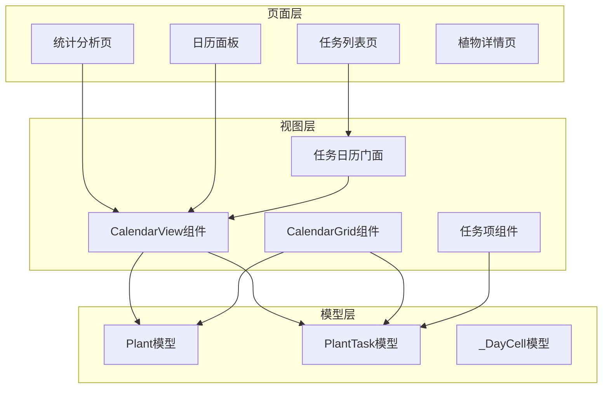
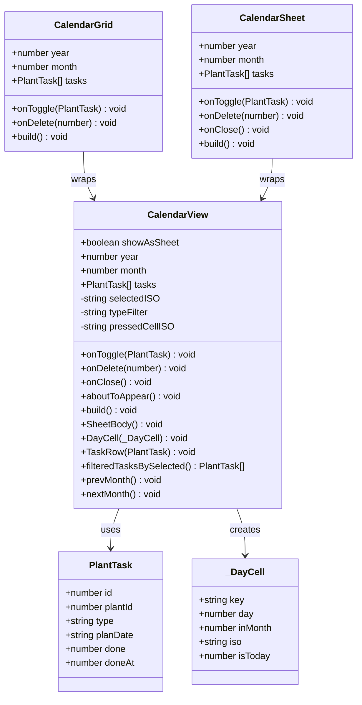
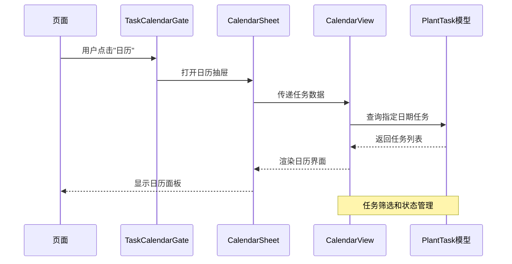
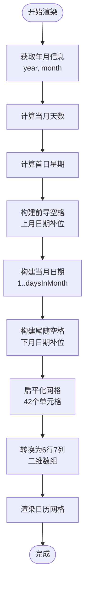
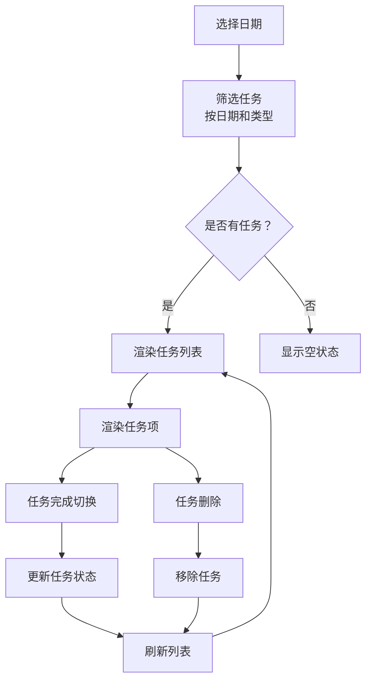
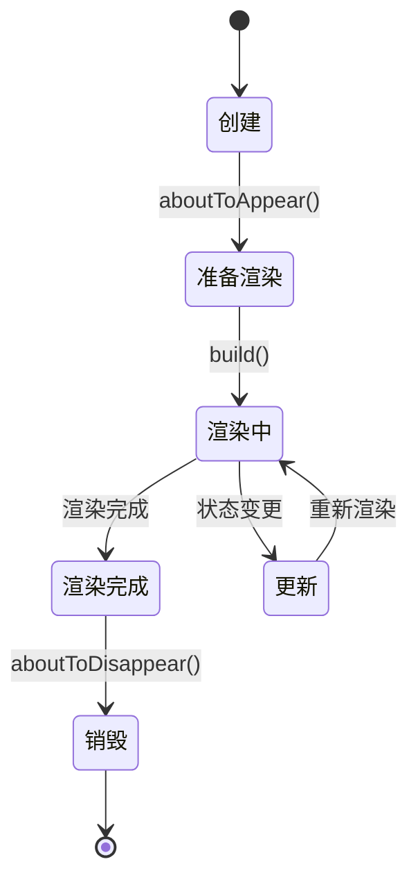
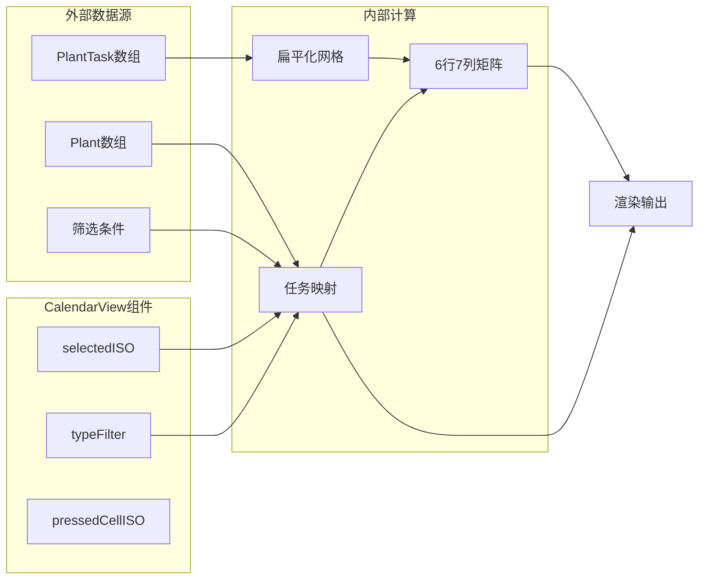
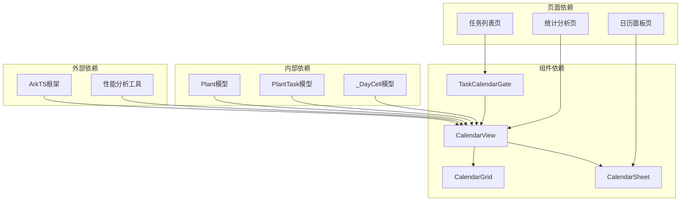
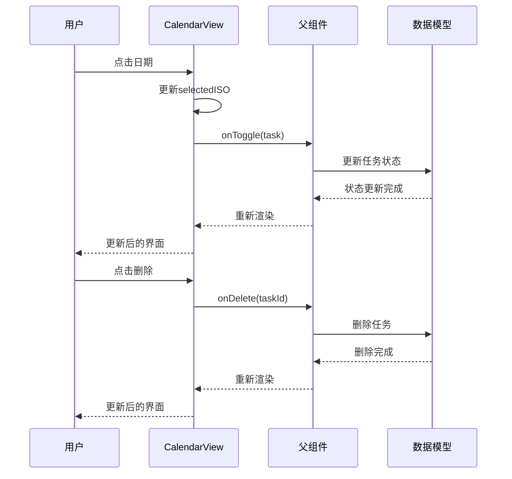

# CalendarView 日历视图组件

<cite>
**本文档引用的文件**
- [CalendarView.ets](file://entry/src/main/ets/view/CalendarView.ets)
- [CalendarGrid.ets](file://entry/src/main/ets/view/CalendarGrid.ets)
- [TaskCalendarGate.ets](file://entry/src/main/ets/view/TaskCalendarGate.ets)
- [CalendarSheet.ets](file://entry/src/main/ets/pages/CalendarSheet.ets)
- [TaskListPage.ets](file://entry/src/main/ets/pages/TaskListPage.ets)
- [StatsPage.ets](file://entry/src/main/ets/pages/StatsPage.ets)
- [PlantModel.ets](file://entry/src/main/ets/model/PlantModel.ets)
- [TaskItem.ets](file://entry/src/main/ets/view/TaskItem.ets)
</cite>

## 目录
1. [简介](#简介)
2. [项目结构](#项目结构)
3. [核心组件](#核心组件)
4. [架构概览](#架构概览)
5. [详细组件分析](#详细组件分析)
6. [依赖关系分析](#依赖关系分析)
7. [性能考虑](#性能考虑)
8. [故障排除指南](#故障排除指南)
9. [结论](#结论)
10. [附录](#附录)

## 简介

CalendarView 是 PlantDiary 应用中的核心日历视图组件，提供了灵活的日历展示和交互功能。该组件支持两种显示模式：抽屉模式（带蒙层）和内嵌模式，并集成了完整的任务管理系统。CalendarView 专门用于展示植物养护任务，支持按日期筛选、任务状态管理和用户交互操作。

该组件的设计遵循了 ArkTS 的组件化开发原则，通过参数传递、事件回调和本地状态管理实现了高度的可复用性和灵活性。组件不仅支持基本的日历导航和日期选择，还提供了丰富的视觉反馈和动画效果。

## 项目结构

PlantDiary 项目采用模块化的组织方式，CalendarView 组件位于视图层，与页面层和模型层清晰分离：



**图表来源**
- [CalendarView.ets:1-566](file://entry/src/main/ets/view/CalendarView.ets#L1-L566)
- [CalendarGrid.ets:1-351](file://entry/src/main/ets/view/CalendarGrid.ets#L1-L351)
- [TaskCalendarGate.ets:1-81](file://entry/src/main/ets/view/TaskCalendarGate.ets#L1-L81)

**章节来源**
- [CalendarView.ets:1-566](file://entry/src/main/ets/view/CalendarView.ets#L1-L566)
- [CalendarGrid.ets:1-351](file://entry/src/main/ets/view/CalendarGrid.ets#L1-L351)
- [TaskCalendarGate.ets:1-81](file://entry/src/main/ets/view/TaskCalendarGate.ets#L1-L81)

## 核心组件

### CalendarView 主组件

CalendarView 是整个日历系统的核心组件，提供了完整的日历展示和交互功能。该组件支持两种显示模式：

#### 主要特性
- **双模式支持**：抽屉模式（showAsSheet=true）和内嵌模式（showAsSheet=false）
- **完整日历网格**：6×7 的标准日历布局，支持前后月份的日期补位
- **任务可视化**：通过圆点标记展示每日任务数量
- **日期选择**：支持点击选择特定日期
- **任务筛选**：按任务类型进行筛选显示
- **动画效果**：流畅的过渡动画和触摸反馈

#### 关键属性
- `showAsSheet`: 控制显示模式（布尔值）
- `year`: 当前显示年份（数字）
- `month`: 当前显示月份（1-12）
- `tasks`: 养护任务数组（PlantTask[]）

#### 事件回调
- `onToggle`: 任务状态切换事件
- `onDelete`: 任务删除事件
- `onClose`: 抽屉关闭事件

**章节来源**
- [CalendarView.ets:5-510](file://entry/src/main/ets/view/CalendarView.ets#L5-L510)

### CalendarGrid 内嵌组件

CalendarGrid 是 CalendarView 的内嵌版本，专为页面集成设计：

#### 设计特点
- **简化接口**：移除了抽屉相关的复杂逻辑
- **直接集成**：适合嵌入到其他页面中使用
- **保持一致性**：与完整版本共享相同的渲染逻辑

**章节来源**
- [CalendarView.ets:512-536](file://entry/src/main/ets/view/CalendarView.ets#L512-L536)

### CalendarSheet 抽屉组件

CalendarSheet 是 CalendarView 的抽屉版本，提供完整的日历面板功能：

#### 功能增强
- **完整面板**：包含月份切换、筛选器、快速添加等功能
- **专注模式**：支持长按进入专注查看特定日期
- **快速添加**：支持在选定日期快速创建新任务
- **植物选择**：内置植物选择器

**章节来源**
- [CalendarView.ets:538-565](file://entry/src/main/ets/view/CalendarView.ets#L538-L565)

## 架构概览

CalendarView 组件采用了分层架构设计，确保了良好的可维护性和扩展性：



**图表来源**
- [CalendarView.ets:6-510](file://entry/src/main/ets/view/CalendarView.ets#L6-L510)
- [CalendarGrid.ets:514-536](file://entry/src/main/ets/view/CalendarView.ets#L514-L536)
- [CalendarSheet.ets:538-565](file://entry/src/main/ets/view/CalendarView.ets#L538-L565)

### 组件协作关系

CalendarView 组件与其他组件形成了紧密的协作关系：



**图表来源**
- [TaskCalendarGate.ets:22-61](file://entry/src/main/ets/view/TaskCalendarGate.ets#L22-L61)
- [CalendarSheet.ets:54-175](file://entry/src/main/ets/pages/CalendarSheet.ets#L54-L175)
- [CalendarView.ets:31-210](file://entry/src/main/ets/view/CalendarView.ets#L31-L210)

## 详细组件分析

### 日历网格渲染逻辑

CalendarView 的日历网格渲染采用了高效的算法，确保了良好的性能表现：

#### 网格生成算法



**图表来源**
- [CalendarView.ets:372-409](file://entry/src/main/ets/view/CalendarView.ets#L372-L409)

#### 日期单元格渲染

每个日期单元格都包含了丰富的视觉信息：

| 元素 | 功能 | 样式 |
|------|------|------|
| 日期数字 | 显示具体日期 | 字体大小14px，颜色根据状态变化 |
| 今日标记 | 绿色圆点标识 | 14px绿色圆点，显示在日期右侧 |
| 任务指示器 | 圆点数量表示任务数 | 6px圆形，最多3个圆点 |
| 选中状态 | 高亮显示选中日期 | 背景色#e8f5e9，阴影效果 |

**章节来源**
- [CalendarView.ets:219-283](file://entry/src/main/ets/view/CalendarView.ets#L219-L283)

### 任务展示与交互

CalendarView 提供了完整的任务展示和交互功能：

#### 任务列表渲染



**图表来源**
- [CalendarView.ets:174-204](file://entry/src/main/ets/view/CalendarView.ets#L174-L204)

#### 任务项组件

每个任务项都提供了完整的交互功能：

| 元素 | 功能 | 交互 |
|------|------|------|
| 复选框 | 切换任务完成状态 | 点击触发onToggle事件 |
| 任务信息 | 显示任务类型和植物 | 文本装饰线表示已完成 |
| 删除按钮 | 删除任务 | 点击触发onDelete事件 |
| 触摸反馈 | 按下缩放效果 | 触摸事件处理 |

**章节来源**
- [CalendarView.ets:306-344](file://entry/src/main/ets/view/CalendarView.ets#L306-L344)

### 生命周期管理

CalendarView 实现了完整的生命周期管理：

#### 组件生命周期



**图表来源**
- [CalendarView.ets:25-29](file://entry/src/main/ets/view/CalendarView.ets#L25-L29)

#### 状态管理

CalendarView 使用了多种状态管理模式：

| 状态类型 | 管理方式 | 示例 |
|----------|----------|------|
| 参数状态 | @Param | year, month, tasks |
| 本地状态 | @Local | selectedISO, typeFilter |
| 计算状态 | 方法内部 | 通过方法计算得出 |
| 事件状态 | @Event | onToggle, onDelete, onClose |

**章节来源**
- [CalendarView.ets:8-24](file://entry/src/main/ets/view/CalendarView.ets#L8-L24)

### 数据绑定机制

CalendarView 采用了双向数据绑定机制，确保了数据的一致性和响应性：

#### 数据流设计



**图表来源**
- [CalendarView.ets:372-478](file://entry/src/main/ets/view/CalendarView.ets#L372-L478)

#### 性能优化的数据绑定

CalendarView 在数据绑定方面采用了多项优化策略：

1. **惰性计算**：复杂的计算逻辑延迟到需要时执行
2. **缓存机制**：常用计算结果进行缓存
3. **最小化重绘**：只在必要时重新渲染相关部分
4. **批量更新**：状态变更时进行批量处理

**章节来源**
- [CalendarView.ets:437-478](file://entry/src/main/ets/view/CalendarView.ets#L437-L478)

## 依赖关系分析

CalendarView 组件的依赖关系体现了清晰的分层架构：



**图表来源**
- [CalendarView.ets:1-2](file://entry/src/main/ets/view/CalendarView.ets#L1-L2)
- [TaskCalendarGate.ets:1-2](file://entry/src/main/ets/view/TaskCalendarGate.ets#L1-L2)

### 组件间通信

CalendarView 组件通过事件驱动的方式与其他组件进行通信：

#### 事件流设计



**图表来源**
- [CalendarView.ets:311-332](file://entry/src/main/ets/view/CalendarView.ets#L311-L332)

**章节来源**
- [CalendarView.ets:14-17](file://entry/src/main/ets/view/CalendarView.ets#L14-L17)

## 性能考虑

CalendarView 组件在设计时充分考虑了性能优化：

### 渲染性能优化

1. **虚拟滚动**：对于大量任务的情况，采用虚拟滚动技术
2. **懒加载**：任务列表采用懒加载策略
3. **防抖处理**：高频交互事件进行防抖处理
4. **增量更新**：只更新发生变化的部分

### 内存管理

1. **对象池**：复用_dayCell对象实例
2. **弱引用**：避免循环引用导致的内存泄漏
3. **及时释放**：组件销毁时及时清理资源

### 网络优化

1. **数据缓存**：本地缓存常用数据
2. **批量请求**：合并多个请求
3. **离线支持**：支持离线数据展示

## 故障排除指南

### 常见问题及解决方案

#### 日期显示异常

**问题描述**：日期显示不正确或跳转异常

**可能原因**：
- 月份参数超出范围（1-12）
- 年份参数格式错误
- 日期字符串格式不正确

**解决方案**：
1. 验证输入参数的有效性
2. 添加边界检查逻辑
3. 使用统一的日期格式化函数

#### 任务状态不同步

**问题描述**：界面显示的任务状态与实际状态不一致

**可能原因**：
- 事件回调未正确触发
- 状态更新时机不当
- 数据绑定失效

**解决方案**：
1. 确保onToggle事件正确传递
2. 在正确的生命周期阶段更新状态
3. 检查数据绑定是否正常工作

#### 性能问题

**问题描述**：日历渲染缓慢或卡顿

**可能原因**：
- 任务数据量过大
- 渲染逻辑复杂
- 重复计算过多

**解决方案**：
1. 实施数据分页加载
2. 优化渲染算法
3. 添加计算结果缓存

**章节来源**
- [CalendarView.ets:480-510](file://entry/src/main/ets/view/CalendarView.ets#L480-L510)

## 结论

CalendarView 日历视图组件是一个设计精良、功能完整的日历展示组件。它成功地平衡了功能丰富性与性能优化，在 PlantDiary 应用中发挥了重要作用。

### 主要优势

1. **架构清晰**：采用分层设计，职责明确
2. **功能完整**：支持完整的日历操作和任务管理
3. **性能优秀**：通过多种优化策略确保流畅体验
4. **易于扩展**：良好的接口设计便于功能扩展
5. **用户体验佳**：丰富的动画效果和交互反馈

### 改进建议

1. **国际化支持**：增加多语言支持
2. **主题定制**：提供更多样式定制选项
3. **无障碍访问**：增强无障碍功能
4. **测试覆盖**：完善单元测试和集成测试

CalendarView 组件为 PlantDiary 应用提供了强大的日历功能基础，是应用成功的关键组件之一。

## 附录

### 实际使用示例

#### 在植物详情页中的集成

```typescript
// 植物详情页中集成日历视图
@Builder
PlantDetailHeader() {
  Row() {
    Text('📅 日历').fontSize(16)
      .onClick(() => {
        this.showCalendar = true
      })
  }
}

// 在页面底部显示日历抽屉
if (this.showCalendar) {
  CalendarSheet({
    year: this.currentYear,
    month: this.currentMonth,
    tasks: this.plantTasks,
    onToggle: (task) => this.updateTaskStatus(task),
    onDelete: (taskId) => this.deleteTask(taskId),
    onClose: () => {
      this.showCalendar = false
    }
  })
}
```

#### 在任务管理页中的应用

```typescript
// 任务列表页中的日历门面
TaskCalendarGate({
  tasks: this.filteredTasks(),
  onToggle: (task) => this.toggleTaskDone(task),
  onDelete: (taskId) => this.deleteTask(taskId)
})
```

#### 在统计分析页中的展示

```typescript
// 统计页中展示日历视图
CalendarView({
  showAsSheet: false,
  year: this.currentYear,
  month: this.currentMonth,
  tasks: this.allTasks,
  onToggle: (task) => this.handleTaskToggle(task),
  onDelete: (taskId) => this.handleTaskDelete(taskId)
})
```

### API 参考

#### CalendarView 属性

| 属性名 | 类型 | 必填 | 描述 |
|--------|------|------|------|
| showAsSheet | boolean | 否 | 是否以抽屉模式显示，默认false |
| year | number | 是 | 当前显示年份 |
| month | number | 是 | 当前显示月份（1-12） |
| tasks | PlantTask[] | 是 | 养护任务数组 |

#### CalendarView 事件

| 事件名 | 参数 | 描述 |
|--------|------|------|
| onToggle | PlantTask | 任务状态切换事件 |
| onDelete | number | 任务删除事件 |
| onClose | 无 | 抽屉关闭事件（仅抽屉模式） |

#### CalendarView 方法

| 方法名 | 参数 | 返回值 | 描述 |
|--------|------|--------|------|
| prevMonth | 无 | void | 切换到上个月 |
| nextMonth | 无 | void | 切换到下个月 |
| filteredTasksBySelected | 无 | PlantTask[] | 获取选中日期的任务列表 |