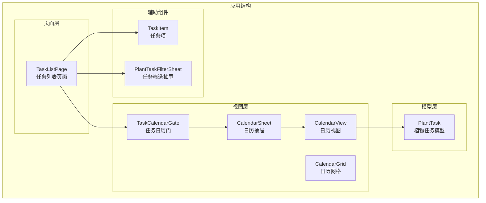
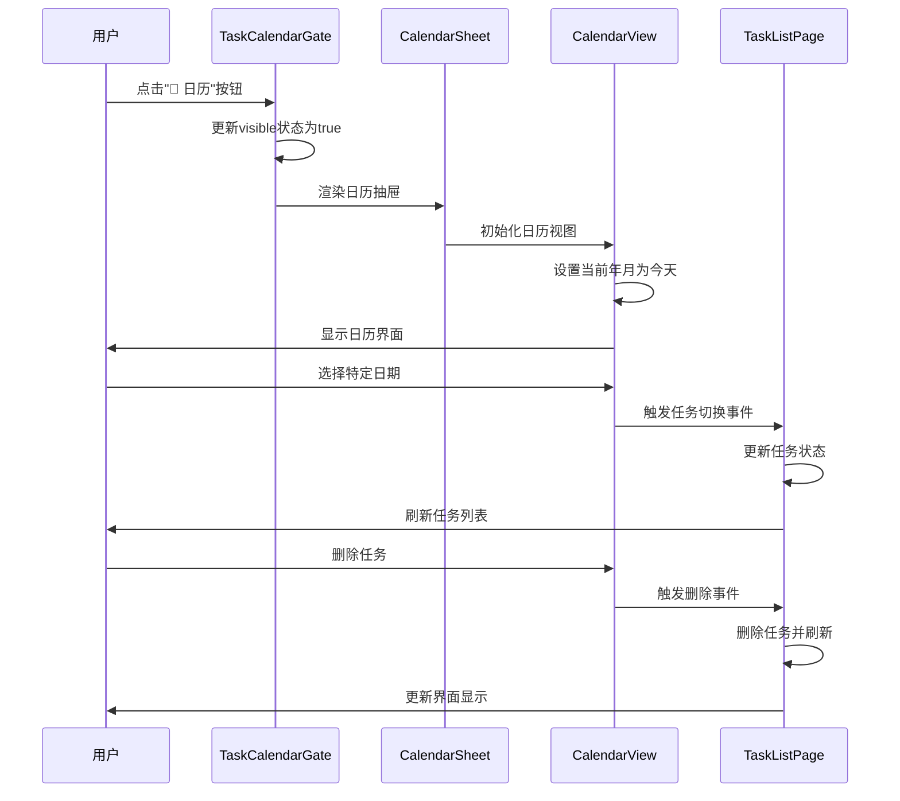
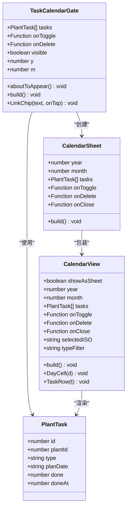
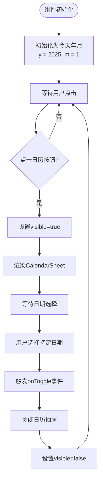
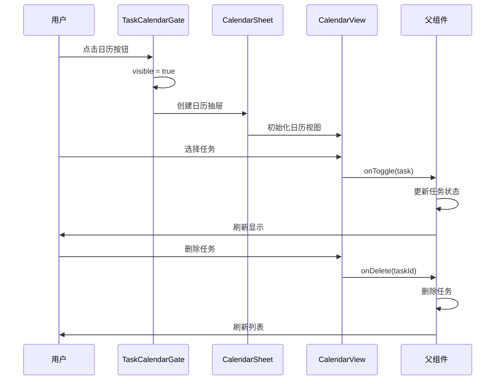
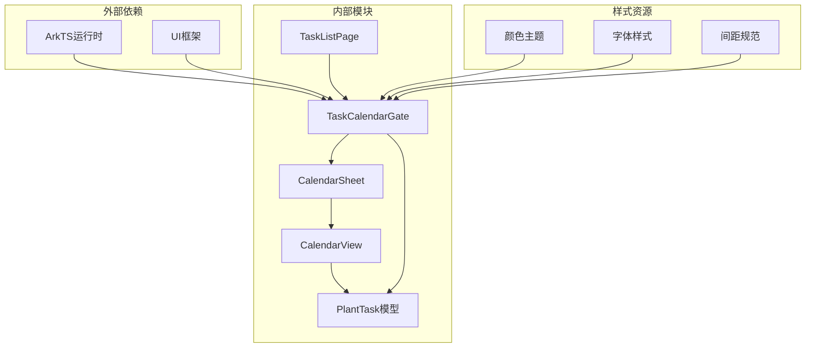
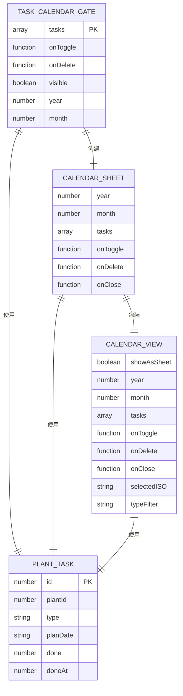

# TaskCalendarGate 任务日历门组件

<cite>
**本文档引用的文件**
- [TaskCalendarGate.ets](file://entry/src/main/ets/view/TaskCalendarGate.ets)
- [TaskListPage.ets](file://entry/src/main/ets/pages/TaskListPage.ets)
- [CalendarView.ets](file://entry/src/main/ets/view/CalendarView.ets)
- [PlantModel.ets](file://entry/src/main/ets/model/PlantModel.ets)
- [TaskItem.ets](file://entry/src/main/ets/view/TaskItem.ets)
- [PlantTaskFilterSheet.ets](file://entry/src/main/ets/view/PlantTaskFilterSheet.ets)
</cite>

## 目录
1. [简介](#简介)
2. [项目结构](#项目结构)
3. [核心组件](#核心组件)
4. [架构概览](#架构概览)
5. [详细组件分析](#详细组件分析)
6. [依赖关系分析](#依赖关系分析)
7. [性能考虑](#性能考虑)
8. [故障排除指南](#故障排除指南)
9. [结论](#结论)
10. [使用示例](#使用示例)

## 简介

TaskCalendarGate 是 PlantDiary 应用中的一个关键组件，它为任务列表页面提供了便捷的日历导航入口。该组件允许用户通过点击"📅 日历"按钮快速打开日历视图，从而实现对特定日期或日期范围内任务的快速定位和管理。

该组件采用轻量级设计，专注于提供简洁直观的日历访问入口，同时与整个任务管理系统无缝集成，支持任务类型过滤、完成状态筛选和日期范围选择等功能。

## 项目结构

TaskCalendarGate 组件位于应用的视图层，与任务列表页面紧密协作，形成完整的任务管理体验。



**图表来源**
- [TaskCalendarGate.ets:1-81](file://entry/src/main/ets/view/TaskCalendarGate.ets#L1-L81)
- [TaskListPage.ets:1-463](file://entry/src/main/ets/pages/TaskListPage.ets#L1-L463)
- [CalendarView.ets:1-566](file://entry/src/main/ets/view/CalendarView.ets#L1-L566)

**章节来源**
- [TaskCalendarGate.ets:1-81](file://entry/src/main/ets/view/TaskCalendarGate.ets#L1-L81)
- [TaskListPage.ets:1-463](file://entry/src/main/ets/pages/TaskListPage.ets#L1-L463)

## 核心组件

### TaskCalendarGate 组件

TaskCalendarGate 是一个轻量级的导航组件，主要负责提供日历访问入口和状态管理。

#### 主要特性
- **简洁导航入口**：提供"📅 日历"按钮作为日历访问入口
- **状态管理**：维护日历显示状态和当前年月信息
- **事件处理**：处理任务切换和删除事件
- **响应式初始化**：自动设置为当前日期所在年月

#### 关键属性
- `tasks`: Array<PlantTask> - 传入的任务数组
- `onToggle`: (t: PlantTask) => void - 任务切换事件处理器
- `onDelete`: (id: number) => void - 任务删除事件处理器

**章节来源**
- [TaskCalendarGate.ets:6-14](file://entry/src/main/ets/view/TaskCalendarGate.ets#L6-L14)

## 架构概览

TaskCalendarGate 组件在整个任务管理系统中扮演着桥梁角色，连接任务列表页面和日历视图系统。



**图表来源**
- [TaskCalendarGate.ets:22-50](file://entry/src/main/ets/view/TaskCalendarGate.ets#L22-L50)
- [CalendarView.ets:32-80](file://entry/src/main/ets/view/CalendarView.ets#L32-L80)
- [TaskListPage.ets:210-245](file://entry/src/main/ets/pages/TaskListPage.ets#L210-L245)

## 详细组件分析

### TaskCalendarGate 类结构



**图表来源**
- [TaskCalendarGate.ets:6-80](file://entry/src/main/ets/view/TaskCalendarGate.ets#L6-L80)
- [CalendarView.ets:5-566](file://entry/src/main/ets/view/CalendarView.ets#L5-L566)
- [PlantModel.ets:43-59](file://entry/src/main/ets/model/PlantModel.ets#L43-L59)

### 日历导航机制

TaskCalendarGate 实现了简洁而高效的日历导航机制：

#### 状态管理流程


**图表来源**
- [TaskCalendarGate.ets:15-20](file://entry/src/main/ets/view/TaskCalendarGate.ets#L15-L20)
- [TaskCalendarGate.ets:27-29](file://entry/src/main/ets/view/TaskCalendarGate.ets#L27-L29)
- [TaskCalendarGate.ets:46-48](file://entry/src/main/ets/view/TaskCalendarGate.ets#L46-L48)

#### 事件处理流程


**图表来源**
- [TaskCalendarGate.ets:44-45](file://entry/src/main/ets/view/TaskCalendarGate.ets#L44-L45)
- [TaskCalendarGate.ets:46-47](file://entry/src/main/ets/view/TaskCalendarGate.ets#L46-L47)

**章节来源**
- [TaskCalendarGate.ets:22-61](file://entry/src/main/ets/view/TaskCalendarGate.ets#L22-L61)

### 与任务系统的集成

TaskCalendarGate 与 PlantDiary 的任务系统深度集成，通过以下方式实现：

#### 数据流集成
- **任务数据传递**：通过 `tasks` 参数接收完整的任务数组
- **事件回调**：通过 `onToggle` 和 `onDelete` 事件与父组件通信
- **状态同步**：确保日历视图与任务列表状态保持一致

#### 界面集成点
- **位置集成**：位于任务列表页面顶部，作为导航入口
- **样式集成**：采用统一的设计语言和颜色方案
- **交互集成**：与 TaskListPage 的筛选和排序功能协同工作

**章节来源**
- [TaskCalendarGate.ets:8-11](file://entry/src/main/ets/view/TaskCalendarGate.ets#L8-L11)
- [TaskListPage.ets:215-245](file://entry/src/main/ets/pages/TaskListPage.ets#L215-L245)

## 依赖关系分析

### 组件依赖图



**图表来源**
- [TaskCalendarGate.ets:1-2](file://entry/src/main/ets/view/TaskCalendarGate.ets#L1-L2)
- [CalendarView.ets:1-3](file://entry/src/main/ets/view/CalendarView.ets#L1-L3)
- [PlantModel.ets:1-1](file://entry/src/main/ets/model/PlantModel.ets#L1-L1)

### 数据依赖关系

TaskCalendarGate 依赖于 PlantTask 模型来正确显示和处理任务数据：



**图表来源**
- [TaskCalendarGate.ets:8](file://entry/src/main/ets/view/TaskCalendarGate.ets#L8)
- [PlantModel.ets:44-48](file://entry/src/main/ets/model/PlantModel.ets#L44-L48)
- [CalendarView.ets:10-17](file://entry/src/main/ets/view/CalendarView.ets#L10-L17)

**章节来源**
- [TaskCalendarGate.ets:1-81](file://entry/src/main/ets/view/TaskCalendarGate.ets#L1-L81)
- [CalendarView.ets:1-566](file://entry/src/main/ets/view/CalendarView.ets#L1-L566)
- [PlantModel.ets:1-166](file://entry/src/main/ets/model/PlantModel.ets#L1-L166)

## 性能考虑

### 渲染优化

TaskCalendarGate 采用了多项性能优化策略：

#### 条件渲染
- **延迟加载**：日历抽屉仅在用户点击时渲染，避免不必要的DOM节点创建
- **状态控制**：通过 `visible` 属性精确控制组件显示状态

#### 内存管理
- **最小化状态**：仅存储必要的本地状态（年、月、可见性）
- **事件委托**：通过事件回调减少直接状态绑定

### 交互性能

#### 动画优化
- **流畅过渡**：使用适当的动画曲线确保界面切换流畅
- **状态同步**：本地状态更新与父组件状态保持同步

**章节来源**
- [TaskCalendarGate.ets:39-50](file://entry/src/main/ets/view/TaskCalendarGate.ets#L39-L50)
- [TaskCalendarGate.ets:64-79](file://entry/src/main/ets/view/TaskCalendarGate.ets#L64-L79)

## 故障排除指南

### 常见问题及解决方案

#### 日历无法显示
**症状**：点击"📅 日历"按钮后无反应
**可能原因**：
- 任务数据未正确传递
- 事件处理器未正确绑定
- 样式冲突导致组件不可见

**解决步骤**：
1. 检查 `tasks` 参数是否正确传递
2. 验证 `onToggle` 和 `onDelete` 事件处理器
3. 确认组件样式配置正确

#### 日期显示异常
**症状**：日历显示的日期不正确
**可能原因**：
- 本地时间设置错误
- 日期格式处理问题

**解决步骤**：
1. 检查系统时间和时区设置
2. 验证日期格式转换逻辑

#### 事件处理失败
**症状**：点击任务无响应
**可能原因**：
- 事件回调函数未正确实现
- 父组件状态更新逻辑错误

**解决步骤**：
1. 检查事件处理器的实现
2. 验证父组件的状态管理逻辑

**章节来源**
- [TaskCalendarGate.ets:15-20](file://entry/src/main/ets/view/TaskCalendarGate.ets#L15-L20)
- [TaskCalendarGate.ets:44-47](file://entry/src/main/ets/view/TaskCalendarGate.ets#L44-L47)

## 结论

TaskCalendarGate 任务日历门组件是一个设计精良的导航组件，它成功地将复杂的日历功能封装在一个简洁易用的界面中。通过与其他组件的紧密协作，它为用户提供了高效的任务管理和导航体验。

该组件的主要优势包括：
- **简洁性**：专注于提供核心导航功能
- **集成性**：与整个任务系统无缝集成
- **可扩展性**：为未来的功能扩展预留空间
- **性能优化**：采用条件渲染和状态管理优化

在未来的发展中，可以考虑添加更多高级功能，如快速日期选择、任务统计显示等，以进一步提升用户体验。

## 使用示例

### 基本使用场景

#### 快速定位特定类型的养护任务

```typescript
// 在任务列表页面中使用 TaskCalendarGate
<TaskCalendarGate
  tasks={this.tasks}
  onToggle={(task) => this.toggleTaskDone(task)}
  onDelete={(taskId) => this.deleteTask(taskId)}
/>
```

#### 历史任务记录查看

```typescript
// 通过日历快速浏览历史任务
const historicalTasks = this.tasks.filter(task => 
  task.planDate <= this.todayISO()
);
```

#### 任务类型过滤结合

```typescript
// 结合任务类型筛选器使用
const filteredTasks = this.tasks.filter(task => 
  task.type === '浇水' && 
  task.planDate >= this.fromDate && 
  task.planDate <= this.toDate
);
```

### 高级使用技巧

#### 自定义事件处理

```typescript
// 实现自定义的任务状态管理
private handleTaskToggle = (task: PlantTask) => {
  // 自定义逻辑：更新本地状态
  const updatedTasks = this.tasks.map(t => 
    t.id === task.id ? {...t, done: 1 - t.done} : t
  );
  this.tasks = updatedTasks;
  
  // 触发父组件更新
  this.onToggle(task);
};
```

#### 集成到现有工作流

```typescript
// 将 TaskCalendarGate 集成到现有的任务管理流程中
@ComponentV2
export struct EnhancedTaskListPage {
  @Local tasks: Array<PlantTask> = []
  @Local selectedDate: string = this.todayISO()
  
  build() {
    Column() {
      // 顶部导航
      Row() {
        this.createTaskButton()
        this.calendarGate()
        this.searchBox()
      }
      
      // 任务列表
      this.taskListView()
      
      // 日历视图
      this.calendarView()
    }
  }
  
  @Builder
  calendarGate() {
    TaskCalendarGate({
      tasks: this.tasks,
      onToggle: (task) => this.updateTaskStatus(task),
      onDelete: (taskId) => this.removeTask(taskId)
    })
  }
}
```

这些使用示例展示了 TaskCalendarGate 组件如何在实际应用中发挥作用，帮助用户快速定位和管理特定的养护任务记录。