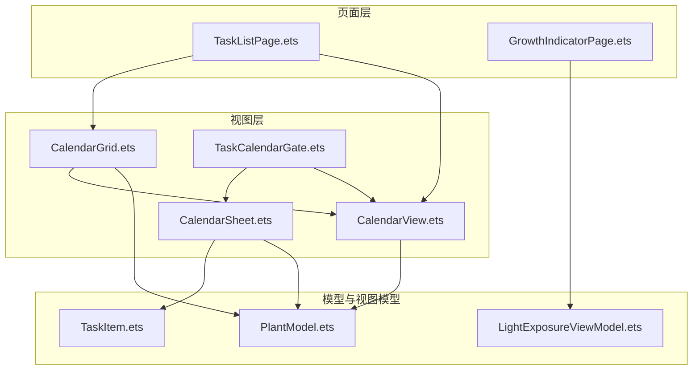
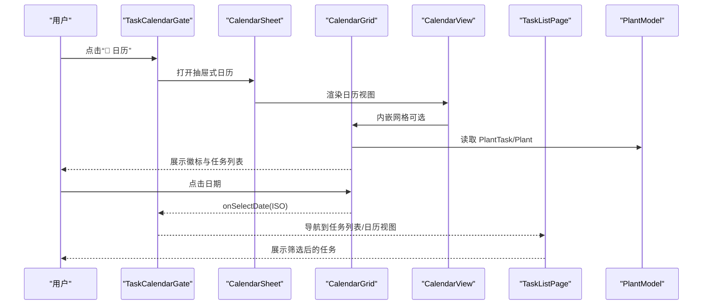
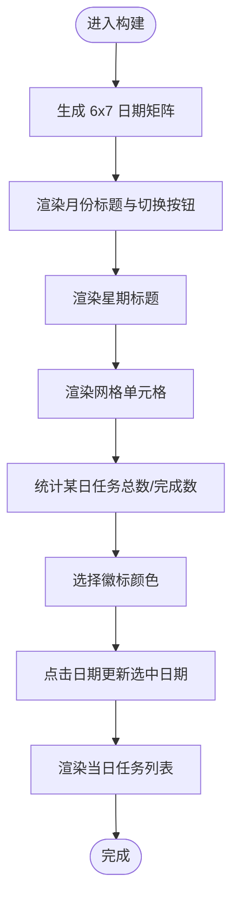
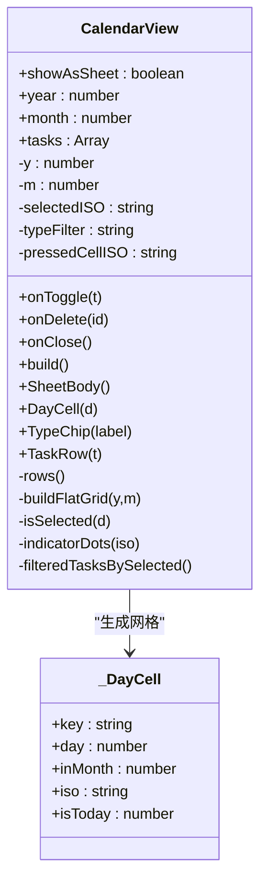
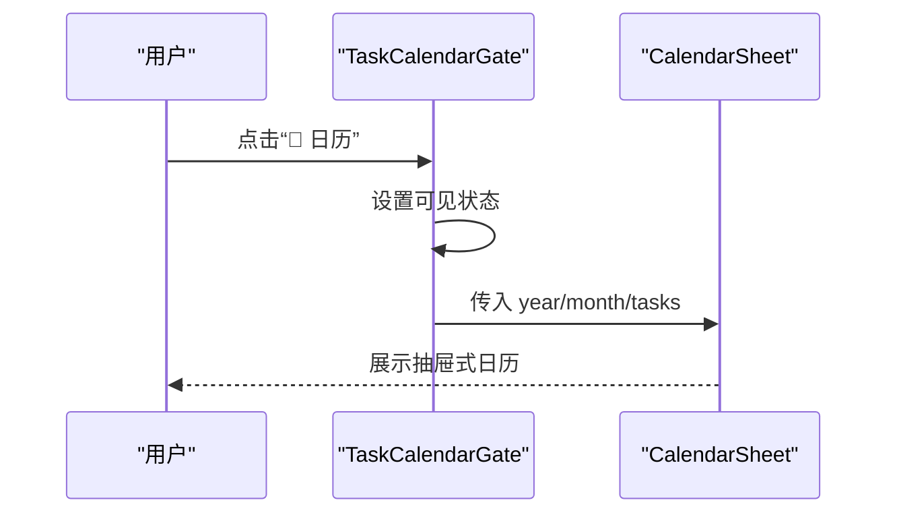
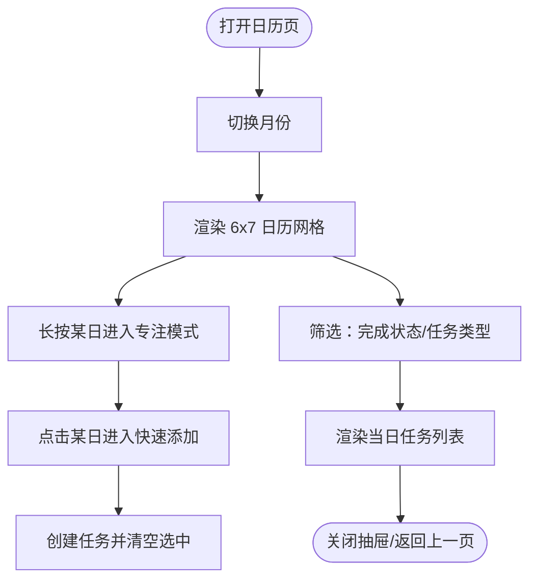
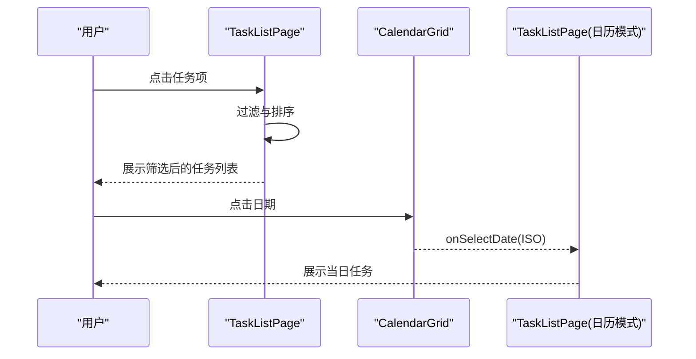
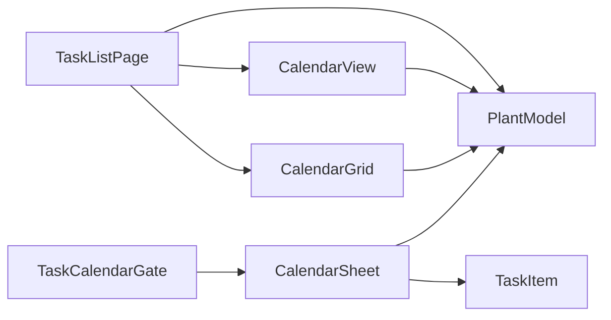

# 日历组件系列

<cite>
**本文档引用的文件**
- [CalendarGrid.ets](file://entry/src/main/ets/view/CalendarGrid.ets)
- [CalendarView.ets](file://entry/src/main/ets/view/CalendarView.ets)
- [TaskCalendarGate.ets](file://entry/src/main/ets/view/TaskCalendarGate.ets)
- [CalendarSheet.ets](file://entry/src/main/ets/pages/CalendarSheet.ets)
- [TaskListPage.ets](file://entry/src/main/ets/pages/TaskListPage.ets)
- [PlantModel.ets](file://entry/src/main/ets/model/PlantModel.ets)
- [TaskItem.ets](file://entry/src/main/ets/view/TaskItem.ets)
- [LightExposureViewModel.ets](file://entry/src/main/ets/viewmodel/LightExposureViewModel.ets)
- [GrowthIndicatorPage.ets](file://entry/src/main/ets/pages/GrowthIndicatorPage.ets)
</cite>

## 目录
1. [简介](#简介)
2. [项目结构](#项目结构)
3. [核心组件](#核心组件)
4. [架构总览](#架构总览)
5. [详细组件分析](#详细组件分析)
6. [依赖关系分析](#依赖关系分析)
7. [性能考量](#性能考量)
8. [故障排查指南](#故障排查指南)
9. [结论](#结论)
10. [附录](#附录)

## 简介
本文件面向日历相关组件的API与使用说明，涵盖：
- CalendarGrid 日历网格组件：属性配置、日期选择事件、徽标统计与样式定制
- CalendarView 日历视图组件：数据绑定、渲染逻辑与交互流程
- TaskCalendarGate 任务日历门组件：任务筛选与导航入口
- 组件协作关系与数据流
- 典型使用场景：任务安排、光照记录、生长指标记录

## 项目结构
日历组件主要位于 entry/src/main/ets/view 与 entry/src/main/ets/pages 目录，配合 model 与 viewmodel 层实现数据与状态管理。

**图表来源**
- [CalendarGrid.ets](file://entry/src/main/ets/view/CalendarGrid.ets)
- [CalendarView.ets](file://entry/src/main/ets/view/CalendarView.ets)
- [TaskCalendarGate.ets](file://entry/src/main/ets/view/TaskCalendarGate.ets)
- [CalendarSheet.ets](file://entry/src/main/ets/pages/CalendarSheet.ets)
- [TaskListPage.ets](file://entry/src/main/ets/pages/TaskListPage.ets)
- [PlantModel.ets](file://entry/src/main/ets/model/PlantModel.ets)
- [TaskItem.ets](file://entry/src/main/ets/view/TaskItem.ets)
- [LightExposureViewModel.ets](file://entry/src/main/ets/viewmodel/LightExposureViewModel.ets)
- [GrowthIndicatorPage.ets](file://entry/src/main/ets/pages/GrowthIndicatorPage.ets)

**章节来源**
- [CalendarGrid.ets](file://entry/src/main/ets/view/CalendarGrid.ets)
- [CalendarView.ets](file://entry/src/main/ets/view/CalendarView.ets)
- [TaskCalendarGate.ets](file://entry/src/main/ets/view/TaskCalendarGate.ets)
- [CalendarSheet.ets](file://entry/src/main/ets/pages/CalendarSheet.ets)
- [TaskListPage.ets](file://entry/src/main/ets/pages/TaskListPage.ets)
- [PlantModel.ets](file://entry/src/main/ets/model/PlantModel.ets)
- [TaskItem.ets](file://entry/src/main/ets/view/TaskItem.ets)
- [LightExposureViewModel.ets](file://entry/src/main/ets/viewmodel/LightExposureViewModel.ets)
- [GrowthIndicatorPage.ets](file://entry/src/main/ets/pages/GrowthIndicatorPage.ets)

## 核心组件
- CalendarGrid：内嵌月历网格，支持任务徽标统计、当日任务列表、日期选择事件与样式定制
- CalendarView：通用日历视图，支持抽屉/内嵌两种模式，提供类型筛选、任务列表与交互
- TaskCalendarGate：任务日历门，提供日历入口与抽屉式日历面板
- CalendarSheet：完整日历页，集成月视图、快速添加、筛选与当日任务列表
- TaskListPage：任务列表页，可与日历网格联动，支持筛选与导航
- PlantModel：任务与植物数据模型
- TaskItem：任务项子组件，用于日历面板中的任务展示

**章节来源**
- [CalendarGrid.ets](file://entry/src/main/ets/view/CalendarGrid.ets)
- [CalendarView.ets](file://entry/src/main/ets/view/CalendarView.ets)
- [TaskCalendarGate.ets](file://entry/src/main/ets/view/TaskCalendarGate.ets)
- [CalendarSheet.ets](file://entry/src/main/ets/pages/CalendarSheet.ets)
- [TaskListPage.ets](file://entry/src/main/ets/pages/TaskListPage.ets)
- [PlantModel.ets](file://entry/src/main/ets/model/PlantModel.ets)
- [TaskItem.ets](file://entry/src/main/ets/view/TaskItem.ets)

## 架构总览
日历组件采用“视图组件 + 页面容器 + 数据模型”的分层设计：
- 视图组件：CalendarGrid、CalendarView、TaskCalendarGate
- 页面容器：CalendarSheet、TaskListPage
- 数据模型：PlantModel（Plant、PlantTask、_DayCell）
- 交互事件：onToggle、onDelete、onSelectDate、onChangeMonth、onQuickAdd 等

**图表来源**
- [TaskCalendarGate.ets](file://entry/src/main/ets/view/TaskCalendarGate.ets)
- [CalendarSheet.ets](file://entry/src/main/ets/pages/CalendarSheet.ets)
- [CalendarGrid.ets](file://entry/src/main/ets/view/CalendarGrid.ets)
- [CalendarView.ets](file://entry/src/main/ets/view/CalendarView.ets)
- [TaskListPage.ets](file://entry/src/main/ets/pages/TaskListPage.ets)
- [PlantModel.ets](file://entry/src/main/ets/model/PlantModel.ets)

## 详细组件分析

### CalendarGrid 组件
- 功能定位：内嵌月历网格，支持任务徽标统计、当日任务列表、日期选择与样式定制
- 关键属性
  - monthISO: string（YYYY-MM）
  - tasks: Array<PlantTask>
  - plants: Array<Plant>
  - allItems: Array<PlantTask>（用于徽标统计）
  - filterStatus: number（0/1/2 对应全部/未完成/已完成）
  - filterType: string（'' 或具体类型）
- 关键事件
  - onPrev/onNext：切换月份
  - onToggle：切换任务完成状态
  - onDeleteAsk：请求删除任务
  - onSelectDate：选中日期回调
- 核心算法
  - 生成 6x7 日期矩阵（空白位用 0 占位）
  - 统计某日任务总数与完成数，生成徽标颜色
  - 根据选中日期渲染当日任务列表
- 样式定制
  - 选中日期背景色、阴影、圆角
  - 徽标颜色：全未完成（蓝色）、全完成（绿色）、部分完成（橙色）
  - 任务徽标数字与完成比例显示

**图表来源**
- [CalendarGrid.ets](file://entry/src/main/ets/view/CalendarGrid.ets)

**章节来源**
- [CalendarGrid.ets](file://entry/src/main/ets/view/CalendarGrid.ets)

### CalendarView 组件
- 功能定位：通用日历视图，支持抽屉/内嵌两种模式，提供类型筛选、任务列表与交互
- 关键属性
  - showAsSheet: boolean（true=抽屉，false=内嵌）
  - year: number, month: number（1~12）
  - tasks: Array<PlantTask>
- 关键事件
  - onToggle：切换任务完成状态
  - onDelete：删除任务
  - onClose：抽屉关闭
- 核心算法
  - 生成 6 行 7 列的日格数据（_DayCell）
  - 标识今日、当月/非当月、选中状态
  - 指示点（绿点）数量与任务数量一致
  - 类型筛选：全部/浇水/施肥/修剪
- 渲染逻辑
  - 标题与切月按钮
  - 周标题
  - 6x7 网格
  - 类型筛选条
  - 当日任务列表（支持滚动与弹簧效果）

**图表来源**
- [CalendarView.ets](file://entry/src/main/ets/view/CalendarView.ets)
- [PlantModel.ets](file://entry/src/main/ets/model/PlantModel.ets)

**章节来源**
- [CalendarView.ets](file://entry/src/main/ets/view/CalendarView.ets)
- [PlantModel.ets](file://entry/src/main/ets/model/PlantModel.ets)

### TaskCalendarGate 组件
- 功能定位：任务日历门，提供“📅 日历”入口，打开抽屉式日历面板
- 关键属性
  - tasks: Array<PlantTask>
  - onToggle、onDelete：透传事件
- 关键逻辑
  - 初始化为今天所在年月
  - 点击入口显示抽屉式日历
  - 支持关闭抽屉

**图表来源**
- [TaskCalendarGate.ets](file://entry/src/main/ets/view/TaskCalendarGate.ets)
- [CalendarSheet.ets](file://entry/src/main/ets/pages/CalendarSheet.ets)

**章节来源**
- [TaskCalendarGate.ets](file://entry/src/main/ets/view/TaskCalendarGate.ets)

### CalendarSheet 页面
- 功能定位：完整日历页，集成月视图、快速添加、筛选与当日任务列表
- 关键属性
  - year, month, tasks, plants
  - onChangeMonth, onQuickAdd, onToggle, onClose, onDeleteAsk
- 关键筛选
  - 完成状态筛选：全部/未完成/已完成
  - 任务类型筛选：全部/浇水/施肥/修剪
  - 长按进入“专注当天”模式
- 快速添加
  - 选中日期后显示快速添加栏
  - 选择植物与任务类型，创建任务
- 当日任务列表
  - 支持排序与过滤，与月视图筛选语义一致

**图表来源**
- [CalendarSheet.ets](file://entry/src/main/ets/pages/CalendarSheet.ets)

**章节来源**
- [CalendarSheet.ets](file://entry/src/main/ets/pages/CalendarSheet.ets)

### TaskListPage 与日历联动
- 功能定位：任务列表页，可与日历网格联动，统一筛选与排序
- 关键逻辑
  - 统一的筛选：tab（全部/今天/将来/已完成）、类型、关键字
  - 与日历视图共享筛选结果，避免两个入口看到的任务不一致
  - 支持打开“当日任务”弹层（DayTaskSheet）

**图表来源**
- [TaskListPage.ets](file://entry/src/main/ets/pages/TaskListPage.ets)
- [CalendarGrid.ets](file://entry/src/main/ets/view/CalendarGrid.ets)

**章节来源**
- [TaskListPage.ets](file://entry/src/main/ets/pages/TaskListPage.ets)

## 依赖关系分析
- 组件耦合
  - CalendarGrid 依赖 PlantModel（PlantTask、Plant）
  - CalendarView 依赖 PlantModel（_DayCell）
  - CalendarSheet 依赖 PlantModel（PlantTask、Plant）与 TaskItem
  - TaskCalendarGate 依赖 CalendarSheet/CalendarView
  - TaskListPage 依赖 PlantModel 与 TaskItem
- 数据流向
  - 页面层向视图层传递 tasks/plants/year/month
  - 视图层通过事件回调向上层传递 onToggle/onDelete/onSelectDate/onChangeMonth/onQuickAdd
  - 任务项子组件 TaskItem 负责展示与本地反馈

**图表来源**
- [TaskListPage.ets](file://entry/src/main/ets/pages/TaskListPage.ets)
- [CalendarGrid.ets](file://entry/src/main/ets/view/CalendarGrid.ets)
- [CalendarView.ets](file://entry/src/main/ets/view/CalendarView.ets)
- [TaskCalendarGate.ets](file://entry/src/main/ets/view/TaskCalendarGate.ets)
- [CalendarSheet.ets](file://entry/src/main/ets/pages/CalendarSheet.ets)
- [TaskItem.ets](file://entry/src/main/ets/view/TaskItem.ets)
- [PlantModel.ets](file://entry/src/main/ets/model/PlantModel.ets)

**章节来源**
- [PlantModel.ets](file://entry/src/main/ets/model/PlantModel.ets)
- [TaskItem.ets](file://entry/src/main/ets/view/TaskItem.ets)

## 性能考量
- 渲染优化
  - CalendarGrid 使用固定 6x7 网格矩阵，避免动态尺寸计算
  - CalendarView 将网格生成与 UI 渲染分离，Builder 内仅做渲染
- 事件处理
  - 通过事件回调减少跨层级状态提升
  - 本地状态（选中日期、筛选状态）尽量局部化
- 数据计算
  - 任务统计与筛选在非 Builder 方法中完成，避免在渲染过程中产生副作用

[本节为通用指导，无需特定文件来源]

## 故障排查指南
- 日期未选中
  - 检查 selectedDateISO 初始化逻辑与 onSelectDate 回调
  - 确认 monthISO 与日期格式一致（YYYY-MM-DD）
- 任务徽标不显示
  - 检查 allItems/filterStatus/filterType 是否正确传入
  - 确认 matchFilter 与 totalByDate/doneByDate 的计算逻辑
- 任务列表为空
  - 检查 tasksOfISO 与 filteredTasksBySelected 的筛选条件
  - 确认类型筛选与完成状态筛选的组合逻辑
- 抽屉无法关闭
  - 检查 onClose 事件是否正确传递至 CalendarSheet/CalendarView

**章节来源**
- [CalendarGrid.ets](file://entry/src/main/ets/view/CalendarGrid.ets)
- [CalendarView.ets](file://entry/src/main/ets/view/CalendarView.ets)
- [CalendarSheet.ets](file://entry/src/main/ets/pages/CalendarSheet.ets)

## 结论
日历组件系列通过清晰的职责划分与事件驱动的交互方式，实现了任务安排、光照记录与生长指标记录等多场景下的日期选择与任务管理。CalendarGrid 提供轻量内嵌网格，CalendarView 支持抽屉/内嵌两种模式，TaskCalendarGate 作为入口与导航枢纽，CalendarSheet 则整合了完整的日历体验。PlantModel 与 TaskItem 为数据与展示提供了基础支撑。

[本节为总结性内容，无需特定文件来源]

## 附录

### 使用场景示例

- 任务安排
  - 在 TaskListPage 中统一筛选与排序，结合日历网格查看某日任务
  - 通过 TaskCalendarGate 打开抽屉式日历，快速切换月份与查看当日任务
  - 在 CalendarSheet 中进行快速添加，创建浇水/施肥/修剪等任务

- 光照记录
  - 在 GrowthIndicatorPage 中记录与查看植物的生长指标
  - 在 LightExposureViewModel 中管理光照会话与统计，与日历结合查看历史记录
  - 通过日历选择日期，查看当日光照达标情况与历史会话

- 生长指标记录
  - 在 GrowthIndicatorPage 中添加身高、冠幅、健康分等指标
  - 通过日历选择日期，查看当日记录与趋势图表
  - 与光照记录联动，分析光照对生长指标的影响

**章节来源**
- [TaskListPage.ets](file://entry/src/main/ets/pages/TaskListPage.ets)
- [GrowthIndicatorPage.ets](file://entry/src/main/ets/pages/GrowthIndicatorPage.ets)
- [LightExposureViewModel.ets](file://entry/src/main/ets/viewmodel/LightExposureViewModel.ets)
- [CalendarSheet.ets](file://entry/src/main/ets/pages/CalendarSheet.ets)