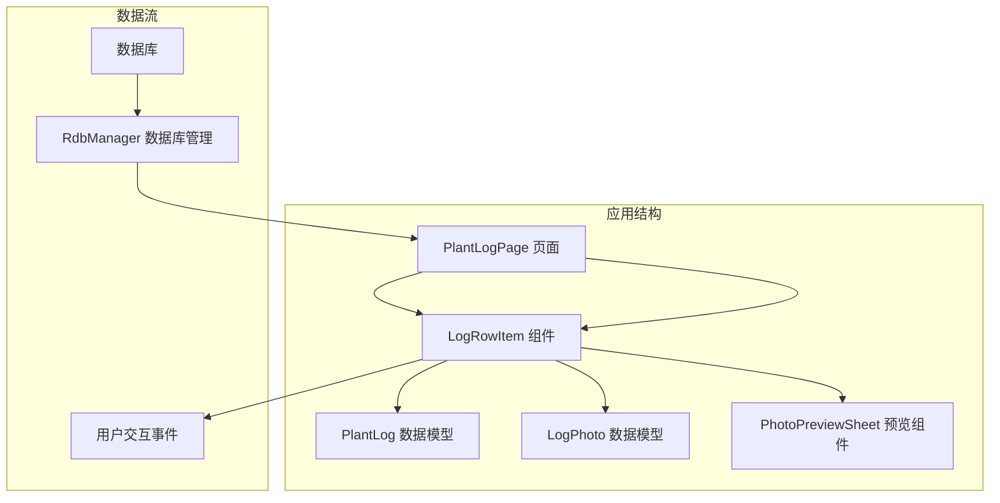
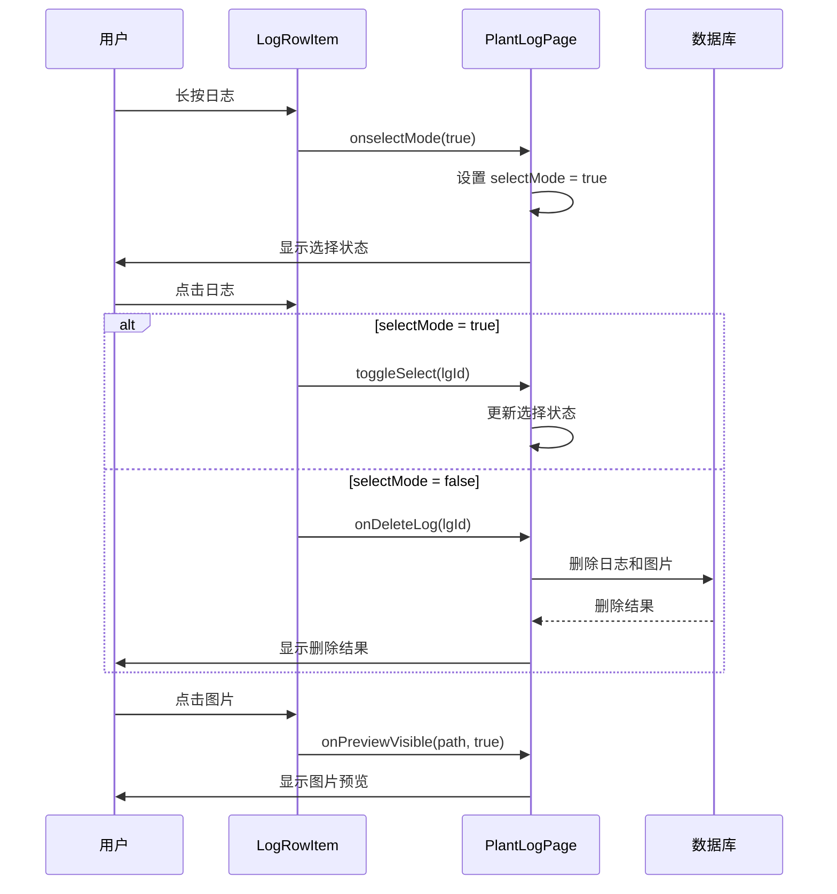
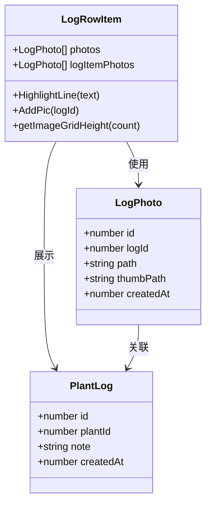
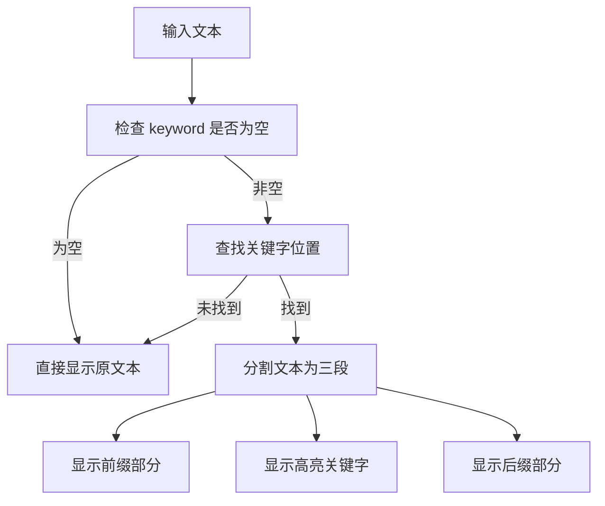
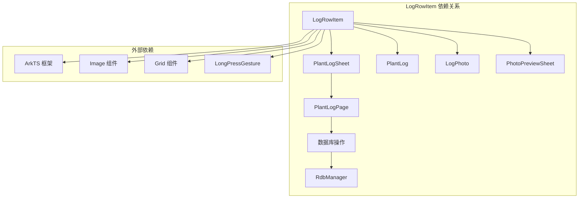

# LogRowItem 日志行项组件

<cite>
**本文档引用的文件**
- [LogRowItem.ets](file://entry/src/main/ets/view/LogRowItem.ets)
- [PlantLogSheet.ets](file://entry/src/main/ets/view/PlantLogSheet.ets)
- [PlantLogPage.ets](file://entry/src/main/ets/pages/PlantLogPage.ets)
- [PhotoPreviewSheet.ets](file://entry/src/main/ets/view/PhotoPreviewSheet.ets)
</cite>

## 目录
1. [简介](#简介)
2. [项目结构](#项目结构)
3. [核心组件](#核心组件)
4. [架构概览](#架构概览)
5. [详细组件分析](#详细组件分析)
6. [依赖关系分析](#依赖关系分析)
7. [性能考虑](#性能考虑)
8. [故障排除指南](#故障排除指南)
9. [结论](#结论)
10. [附录](#附录)

## 简介

LogRowItem 是植物日志系统中的核心UI组件，专门用于展示单条植物日志的完整信息。该组件实现了完整的日志展示、交互和管理功能，包括日志内容高亮显示、附件图片展示、选择模式切换、长按进入选择模式、点击删除日志、预览图片等核心功能。

该组件采用ArkTS框架开发，遵循组件化设计原则，将日志展示与业务逻辑分离，确保代码的可维护性和可扩展性。

## 项目结构

LogRowItem组件位于应用的视图层，与PlantLogPage页面紧密协作，共同构成植物日志管理系统的UI界面。



**图表来源**
- [PlantLogPage.ets:540-592](file://entry/src/main/ets/pages/PlantLogPage.ets#L540-L592)
- [LogRowItem.ets:3-18](file://entry/src/main/ets/view/LogRowItem.ets#L3-L18)

**章节来源**
- [PlantLogPage.ets:1-50](file://entry/src/main/ets/pages/PlantLogPage.ets#L1-L50)
- [LogRowItem.ets:1-272](file://entry/src/main/ets/view/LogRowItem.ets#L1-L272)

## 核心组件

LogRowItem组件是一个结构化组件(@ComponentV2)，包含以下核心特性：

### 主要功能模块

1. **日志内容展示** - 展示日志创建时间和内容文本
2. **高亮搜索功能** - 支持关键字高亮显示
3. **附件图片管理** - 展示和管理日志附件图片
4. **交互控制** - 提供多种用户交互方式
5. **选择模式支持** - 支持批量选择和删除操作

### 核心数据结构

组件使用以下数据模型：
- `PlantLog`: 日志实体，包含id、plantId、note、createdAt
- `LogPhoto`: 图片附件实体，包含id、logId、path、thumbPath、createdAt

**章节来源**
- [PlantLogSheet.ets:3-33](file://entry/src/main/ets/view/PlantLogSheet.ets#L3-L33)
- [LogRowItem.ets:6-18](file://entry/src/main/ets/view/LogRowItem.ets#L6-L18)

## 架构概览

LogRowItem组件采用分层架构设计，将展示逻辑与业务逻辑分离：



**图表来源**
- [LogRowItem.ets:125-133](file://entry/src/main/ets/view/LogRowItem.ets#L125-L133)
- [PlantLogPage.ets:557-581](file://entry/src/main/ets/pages/PlantLogPage.ets#L557-L581)

## 详细组件分析

### 组件属性定义

LogRowItem组件定义了完整的属性接口：

| 属性名称 | 类型 | 必需 | 默认值 | 描述 |
|---------|------|------|--------|------|
| lg | PlantLog | 是 | - | 日志实体对象 |
| selectMode | boolean | 是 | - | 选择模式开关 |
| photos | Array<LogPhoto> | 是 | - | 所有图片附件数组 |
| logItemPhotos | Array<LogPhoto> | 是 | - | 当前日志的图片附件数组 |
| keyword | string | 否 | '' | 搜索关键字，用于高亮显示 |

**章节来源**
- [LogRowItem.ets:6-10](file://entry/src/main/ets/view/LogRowItem.ets#L6-L10)

### 事件回调接口

组件提供了完整的事件回调机制：

| 事件名称 | 参数类型 | 返回类型 | 描述 |
|---------|----------|----------|------|
| isSelected | (lgId: number) => boolean | boolean | 检查日志是否被选中 |
| toggleSelect | (lgId: number) => void | void | 切换日志选择状态 |
| onPickPhotos | (logId: number) => void | void | 选择图片附件 |
| onCapturePhoto | (logId: number) => void | void | 拍照添加图片 |
| onDeleteLog | (logId: number) => void | void | 删除日志 |
| onDeletePhoto | (photoId: number) => void | void | 删除图片附件 |
| onselectMode | (selectMode: boolean) => void | void | 切换选择模式 |
| onPreviewVisible | (path: string, visible: boolean) => void | void | 控制图片预览显示 |

**章节来源**
- [LogRowItem.ets:11-18](file://entry/src/main/ets/view/LogRowItem.ets#L11-L18)

### 核心交互功能

#### 长按进入选择模式

组件通过长按手势实现选择模式的自动切换：

```mermaid
flowchart TD
A[用户长按日志] --> B{检测长按手势}
B --> |重复触发| C[调用 onselectMode(true)]
C --> D[设置 selectMode = true]
D --> E[显示选择状态]
F[用户点击日志] --> G{selectMode 状态}
G --> |true| H[调用 toggleSelect(lgId)]
G --> |false| I[调用 onDeleteLog(lgId)]
```

**图表来源**
- [LogRowItem.ets:125-133](file://entry/src/main/ets/view/LogRowItem.ets#L125-L133)
- [LogRowItem.ets:120-124](file://entry/src/main/ets/view/LogRowItem.ets#L120-L124)

#### 图片附件管理

组件支持图片附件的完整生命周期管理：



**图表来源**
- [LogRowItem.ets:154-205](file://entry/src/main/ets/view/LogRowItem.ets#L154-L205)
- [PlantLogSheet.ets:18-33](file://entry/src/main/ets/view/PlantLogSheet.ets#L18-L33)

**章节来源**
- [LogRowItem.ets:154-222](file://entry/src/main/ets/view/LogRowItem.ets#L154-L222)

### 高亮显示功能

组件实现了智能的关键字高亮显示功能：



**图表来源**
- [LogRowItem.ets:29-57](file://entry/src/main/ets/view/LogRowItem.ets#L29-L57)

**章节来源**
- [LogRowItem.ets:136-152](file://entry/src/main/ets/view/LogRowItem.ets#L136-L152)

### 样式配置

组件提供了丰富的样式配置选项：

| 样式属性 | 默认值 | 描述 |
|---------|--------|------|
| 背景色 | 0xFFFFFFFF | 白色背景 |
| 圆角 | 12 | 12px 圆角 |
| 阴影 | radius: 12, color: 0x13000000, offsetX: 0, offsetY: 3 | 浅灰色阴影效果 |
| 动画 | duration: 120ms, curve: EaseInOut | 平滑过渡动画 |
| 按压效果 | scale: {x: 0.98, y: 0.98} | 轻微缩小效果 |

**章节来源**
- [LogRowItem.ets:109-133](file://entry/src/main/ets/view/LogRowItem.ets#L109-L133)

## 依赖关系分析

LogRowItem组件与多个其他组件存在紧密的依赖关系：



**图表来源**
- [LogRowItem.ets:1](file://entry/src/main/ets/view/LogRowItem.ets#L1)
- [PlantLogSheet.ets:1](file://entry/src/main/ets/view/PlantLogSheet.ets#L1)

**章节来源**
- [PlantLogPage.ets:1-12](file://entry/src/main/ets/pages/PlantLogPage.ets#L1-L12)
- [LogRowItem.ets:1-18](file://entry/src/main/ets/view/LogRowItem.ets#L1-L18)

## 性能考虑

### 图片网格优化

组件实现了智能的图片网格高度计算，根据图片数量动态调整布局：

- 0张图片：104px 高度
- 1-3张图片：104px 高度  
- 4-6张图片：216px 高度
- 7-9张图片：328px 高度
- 超过9张图片：432px 高度

### 事件处理优化

- 使用手势识别器处理长按事件，避免频繁的触摸事件监听
- 采用延迟执行策略处理重复长按事件
- 通过局部状态管理减少不必要的重渲染

### 内存管理

- 图片缩略图优先使用缩略图路径，减少内存占用
- 支持大图预览时的内存释放机制
- 图片删除时及时清理相关资源

## 故障排除指南

### 常见问题及解决方案

#### 图片无法显示

**问题描述**：图片显示为占位符或空白

**可能原因**：
1. 图片路径格式不正确
2. 缩略图路径为空
3. 文件权限问题

**解决方案**：
```typescript
// 确保图片路径使用 file:// 前缀
private ensureFileUri(path: string): string {
  if (!path.startsWith('file://')) {
    return `file://${path}`;
  }
  return path;
}
```

#### 长按无响应

**问题描述**：长按手势无法触发选择模式

**可能原因**：
1. 手势冲突
2. 事件冒泡问题
3. 组件状态异常

**解决方案**：
- 检查父级组件是否有阻止事件传播
- 确认 LongPressGesture 配置正确
- 验证 selectMode 状态切换逻辑

#### 高亮显示异常

**问题描述**：关键字高亮显示不正确

**可能原因**：
1. 关键字大小写不匹配
2. 文本包含特殊字符
3. 编码问题

**解决方案**：
```typescript
// 统一转换为小写进行比较
private beforeKeyword(text: string): string {
  const kw: string = this.keyword.toLowerCase();
  const src: string = text;
  const i: number = src.toLowerCase().indexOf(kw);
  // ... 实现逻辑
}
```

**章节来源**
- [PlantLogPage.ets:186-191](file://entry/src/main/ets/pages/PlantLogPage.ets#L186-L191)
- [LogRowItem.ets:29-57](file://entry/src/main/ets/view/LogRowItem.ets#L29-L57)

## 结论

LogRowItem组件是一个功能完整、设计精良的日志行项展示组件。它成功地实现了以下目标：

1. **功能完整性**：涵盖了日志展示、高亮搜索、图片管理、交互控制等所有核心功能
2. **用户体验**：提供了流畅的动画效果和直观的交互反馈
3. **代码质量**：采用清晰的架构设计和良好的代码组织
4. **可维护性**：通过事件驱动的设计模式，便于后续功能扩展

该组件为植物日志管理系统提供了坚实的基础，是整个应用UI架构的重要组成部分。

## 附录

### 最佳实践建议

1. **性能优化**
   - 合理使用图片缓存机制
   - 避免在组件中进行复杂的计算操作
   - 使用虚拟滚动处理大量日志数据

2. **用户体验**
   - 提供清晰的状态指示器
   - 实现适当的加载状态
   - 优化触摸反馈效果

3. **代码维护**
   - 保持组件职责单一
   - 使用类型安全的事件回调
   - 添加必要的错误处理机制

4. **测试策略**
   - 编写单元测试覆盖关键逻辑
   - 进行集成测试验证组件间交互
   - 实施性能基准测试