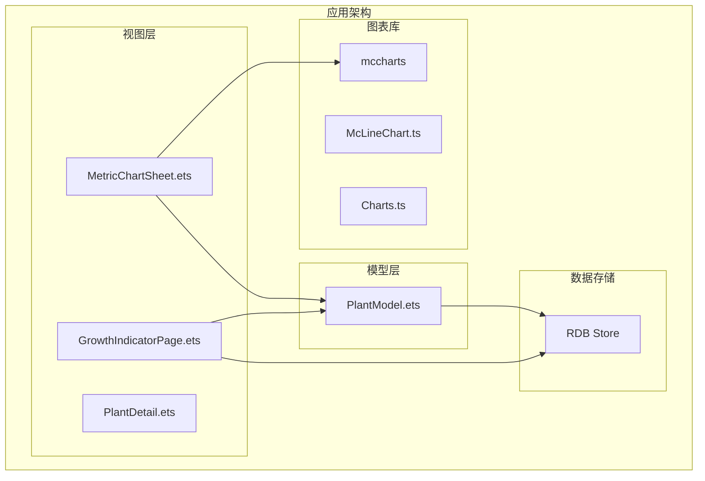
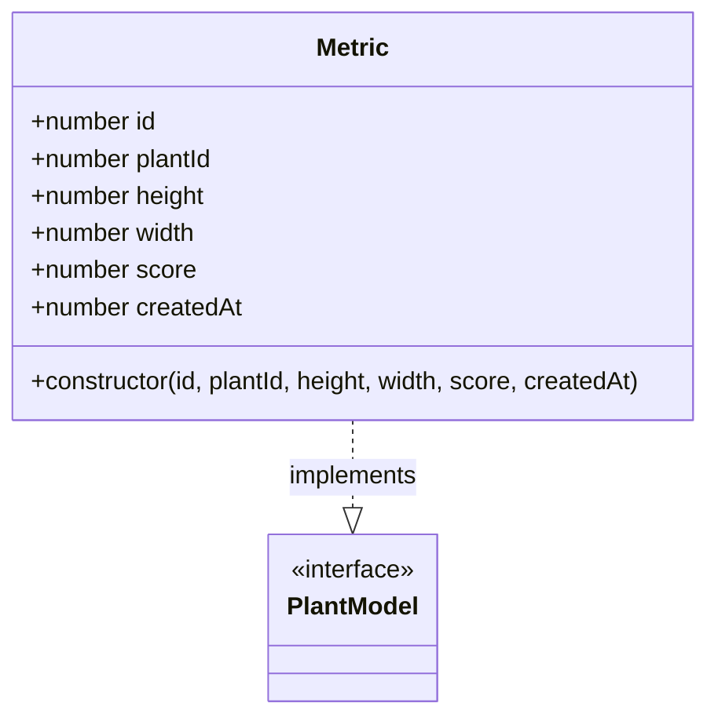
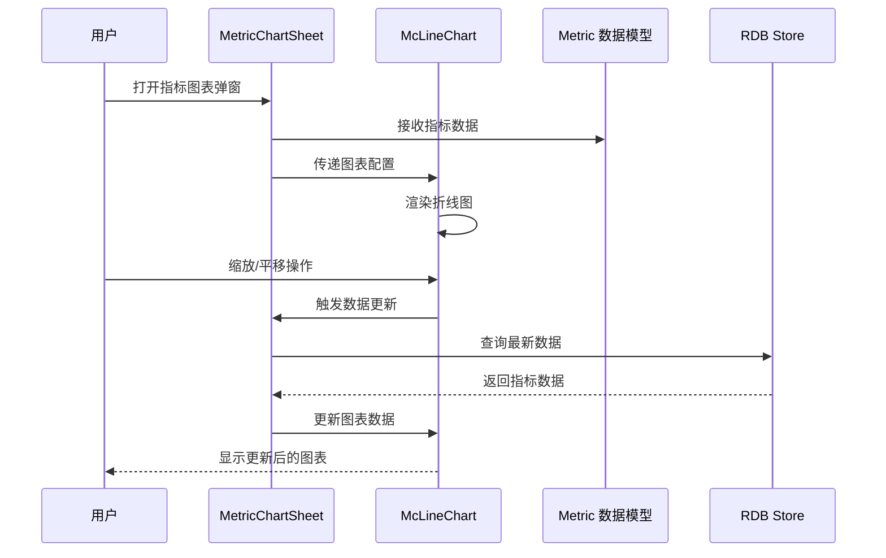
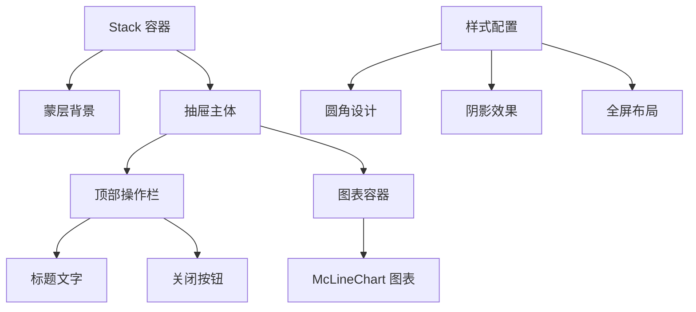
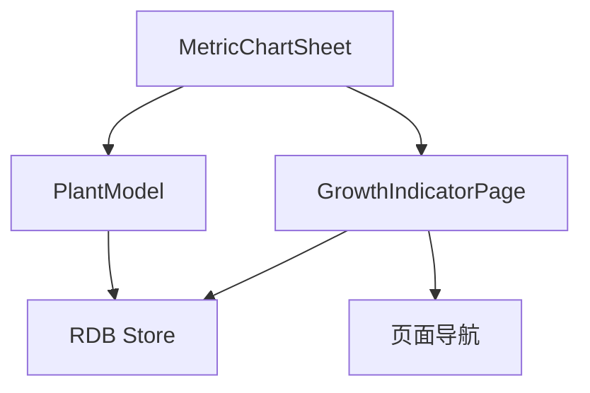

# MetricChartSheet 指标图表弹窗组件

<cite>
**本文档引用的文件**
- [MetricChartSheet.ets](file://entry/src/main/ets/view/MetricChartSheet.ets)
- [GrowthIndicatorPage.ets](file://entry/src/main/ets/pages/GrowthIndicatorPage.ets)
- [PlantModel.ets](file://entry/src/main/ets/model/PlantModel.ets)
- [McLineChart.ts](file://entry/.preview/default/cache/default/default@PreviewArkTS/esmodule/debug/oh_modules/.ohpm/@mcui+mccharts@2.8.8/oh_modules/@mcui/mccharts/src/main/ets/components/mainpage/McLineChart.ts)
- [Charts.ts](file://entry/.preview/default/cache/default/default@PreviewArkTS/esmodule/debug/oh_modules/.ohpm/@mcui+mccharts@2.8.8/oh_modules/@mcui/mccharts/src/main/ets/pageView/Charts.ts)
</cite>

## 目录
1. [简介](#简介)
2. [项目结构](#项目结构)
3. [核心组件](#核心组件)
4. [架构概览](#架构概览)
5. [详细组件分析](#详细组件分析)
6. [依赖关系分析](#依赖关系分析)
7. [性能考虑](#性能考虑)
8. [故障排除指南](#故障排除指南)
9. [结论](#结论)

## 简介

MetricChartSheet 是 PlantDiary 应用中的指标图表弹窗组件，专门用于展示植物生长指标的可视化图表。该组件基于 mccharts 图表库构建，提供了丰富的图表交互功能，包括折线图、柱状图等图表类型的实现。

该组件的核心功能包括：
- 展示植物生长指标的折线图趋势
- 支持多种图表序列（高度、宽度、健康度）
- 提供缩放和平移交互功能
- 实时数据更新和响应式设计
- 完整的植物成长追踪可视化解决方案

## 项目结构

MetricChartSheet 组件位于应用的视图层，与业务逻辑和数据模型分离，遵循了良好的架构设计原则：



**图表来源**
- [MetricChartSheet.ets:1-181](file://entry/src/main/ets/view/MetricChartSheet.ets#L1-L181)
- [GrowthIndicatorPage.ets:1-605](file://entry/src/main/ets/pages/GrowthIndicatorPage.ets#L1-L605)
- [PlantModel.ets:108-166](file://entry/src/main/ets/model/PlantModel.ets#L108-L166)

**章节来源**
- [MetricChartSheet.ets:1-181](file://entry/src/main/ets/view/MetricChartSheet.ets#L1-L181)
- [GrowthIndicatorPage.ets:1-605](file://entry/src/main/ets/pages/GrowthIndicatorPage.ets#L1-L605)

## 核心组件

### 组件属性定义

MetricChartSheet 组件提供了以下核心属性：

| 属性名称 | 类型 | 必填 | 默认值 | 描述 |
|---------|------|------|--------|------|
| plantName | string | 是 | - | 植物名称（仅用于标题展示） |
| metrics | Array<Metric> | 是 | - | 指标数据数组（某一植物的全部 Metric 列表） |
| onClose | () => void | 否 | - | 关闭事件回调函数 |

### 数据模型

组件使用标准的 Metric 数据模型，包含以下字段：



**图表来源**
- [PlantModel.ets:108-125](file://entry/src/main/ets/model/PlantModel.ets#L108-L125)

### 图表配置选项

组件内置了完整的图表配置选项，支持多种图表特性和交互功能：

| 配置项 | 类型 | 描述 |
|-------|------|------|
| title | object | 图表标题配置 |
| xAxis | object | X轴配置（时间轴） |
| yAxis | array | Y轴配置数组（多轴支持） |
| grid | object | 图表网格配置 |
| tooltip | object | 提示框配置 |
| legend | object | 图例配置 |
| dataZoom | object | 缩放配置 |
| series | array | 数据系列配置 |
| animation | boolean | 动画效果开关 |

**章节来源**
- [MetricChartSheet.ets:18-53](file://entry/src/main/ets/view/MetricChartSheet.ets#L18-L53)
- [GrowthIndicatorPage.ets:19-54](file://entry/src/main/ets/pages/GrowthIndicatorPage.ets#L19-L54)

## 架构概览

MetricChartSheet 采用模块化的架构设计，与应用的其他组件协同工作：



**图表来源**
- [MetricChartSheet.ets:55-64](file://entry/src/main/ets/view/MetricChartSheet.ets#L55-L64)
- [GrowthIndicatorPage.ets:401-420](file://entry/src/main/ets/pages/GrowthIndicatorPage.ets#L401-L420)

## 详细组件分析

### 组件结构设计

MetricChartSheet 采用了抽屉式弹窗的设计模式，提供了沉浸式的图表浏览体验：



**图表来源**
- [MetricChartSheet.ets:91-146](file://entry/src/main/ets/view/MetricChartSheet.ets#L91-L146)

### 数据处理流程

组件实现了完整的数据处理和转换流程：

```mermaid
flowchart TD
A[原始指标数据] --> B[时间轴转换]
B --> C[数据系列映射]
C --> D[图表配置更新]
D --> E[图表渲染]
B1[createdAt 时间戳] --> B2[MM-DD 格式化]
C1[高度数据] --> C2[series[0]]
C2[宽度数据] --> C3[series[1]]
C3[健康度数据] --> C4[series[2]]
```

**图表来源**
- [MetricChartSheet.ets:80-88](file://entry/src/main/ets/view/MetricChartSheet.ets#L80-L88)
- [MetricChartSheet.ets:56-63](file://entry/src/main/ets/view/MetricChartSheet.ets#L56-L63)

### 交互功能实现

组件集成了多种用户交互功能：

#### 缩放和平移功能
- 支持双指捏合缩放
- 支持拖拽平移
- 自动适应图表尺寸变化

#### 数据点交互
- 鼠标悬停显示详细信息
- 点击事件处理
- 响应式提示框显示

#### 切片选择功能
- 支持不同指标序列切换
- 支持时间范围选择
- 实时更新图表显示

**章节来源**
- [MetricChartSheet.ets:148-179](file://entry/src/main/ets/view/MetricChartSheet.ets#L148-L179)
- [Charts.ts:440-494](file://entry/.preview/default/cache/default/default@PreviewArkTS/esmodule/debug/oh_modules/.ohpm/@mcui+mccharts@2.8.8/oh_modules/@mcui/mccharts/src/main/ets/pageView/Charts.ts#L440-L494)

### 图表样式定制

组件提供了丰富的样式定制选项：

| 样式属性 | 值范围 | 描述 |
|---------|--------|------|
| 标题位置 | right: 16, top: 16 | 标题偏移量 |
| 网格边距 | left: 28, top: 48, right: 28, bottom: 28 | 图表内边距 |
| 图例间距 | itemGap: 10, itemTextGap: 5 | 图例项间距 |
| 图例尺寸 | itemWidth: 15, itemHeight: 15 | 图例标记尺寸 |
| 动画效果 | animation: true | 开启动画过渡 |

**章节来源**
- [MetricChartSheet.ets:18-53](file://entry/src/main/ets/view/MetricChartSheet.ets#L18-L53)

## 依赖关系分析

### 外部依赖

组件主要依赖于 mccharts 图表库：

```mermaid
graph LR
A[MetricChartSheet] --> B[@mcui/mccharts]
B --> C[McLineChart]
B --> D[Options 配置]
B --> E[图表渲染引擎]
```

**图表来源**
- [MetricChartSheet.ets:1](file://entry/src/main/ets/view/MetricChartSheet.ets#L1)

### 内部依赖关系

组件与其他应用组件的依赖关系：



**图表来源**
- [MetricChartSheet.ets:10](file://entry/src/main/ets/view/MetricChartSheet.ets#L10)
- [GrowthIndicatorPage.ets:10](file://entry/src/main/ets/pages/GrowthIndicatorPage.ets#L10)

**章节来源**
- [MetricChartSheet.ets:1-2](file://entry/src/main/ets/view/MetricChartSheet.ets#L1-L2)
- [GrowthIndicatorPage.ets:1-4](file://entry/src/main/ets/pages/GrowthIndicatorPage.ets#L1-L4)

## 性能考虑

### 数据优化策略

1. **懒加载机制**：图表数据仅在组件出现时加载
2. **增量更新**：支持部分数据更新而非全量重绘
3. **内存管理**：及时清理不再使用的图表实例

### 渲染优化

1. **虚拟滚动**：对于大量数据点采用虚拟滚动技术
2. **节流处理**：对频繁的用户交互进行节流处理
3. **异步渲染**：复杂图表渲染采用异步方式执行

### 存储优化

1. **数据缓存**：最近访问的数据保持在内存中
2. **索引优化**：数据库查询使用适当的索引
3. **批量操作**：支持批量数据插入和更新

## 故障排除指南

### 常见问题及解决方案

#### 图表不显示
- 检查指标数据是否为空
- 验证时间戳格式是否正确
- 确认图表配置选项完整

#### 交互功能失效
- 检查手势识别设置
- 验证事件监听器绑定
- 确认图表实例状态

#### 性能问题
- 优化数据量大小
- 减少不必要的重绘
- 使用合适的动画参数

### 调试技巧

1. **启用调试模式**：查看图表渲染状态
2. **监控内存使用**：定期检查内存泄漏
3. **性能分析**：使用开发者工具分析渲染性能

**章节来源**
- [Charts.ts:170-169](file://entry/.preview/default/cache/default/default@PreviewArkTS/esmodule/debug/oh_modules/.ohpm/@mcui+mccharts@2.8.8/oh_modules/@mcui/mccharts/src/main/ets/pageView/Charts.ts#L170-L169)

## 结论

MetricChartSheet 指标图表弹窗组件是一个功能完整、设计精良的可视化解决方案。它成功地将复杂的植物生长数据转化为直观易懂的图表形式，为用户提供了优秀的数据分析体验。

### 主要优势

1. **用户体验优秀**：沉浸式的抽屉式设计，提供专注的图表浏览体验
2. **功能丰富**：支持多种图表类型和交互功能
3. **性能优化**：采用多种优化策略确保流畅的用户体验
4. **扩展性强**：模块化设计便于功能扩展和维护

### 应用场景

该组件特别适用于以下场景：
- 植物成长追踪和监测
- 生长指标趋势分析
- 健康状况评估
- 养护计划制定和调整

通过提供直观的可视化界面，MetricChartSheet 有效提升了 PlantDiary 应用在植物养护领域的专业性和用户体验。