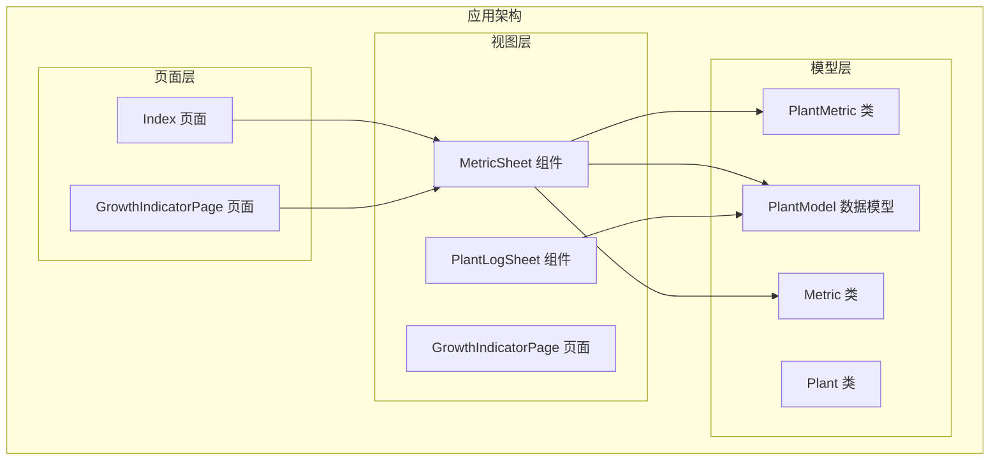
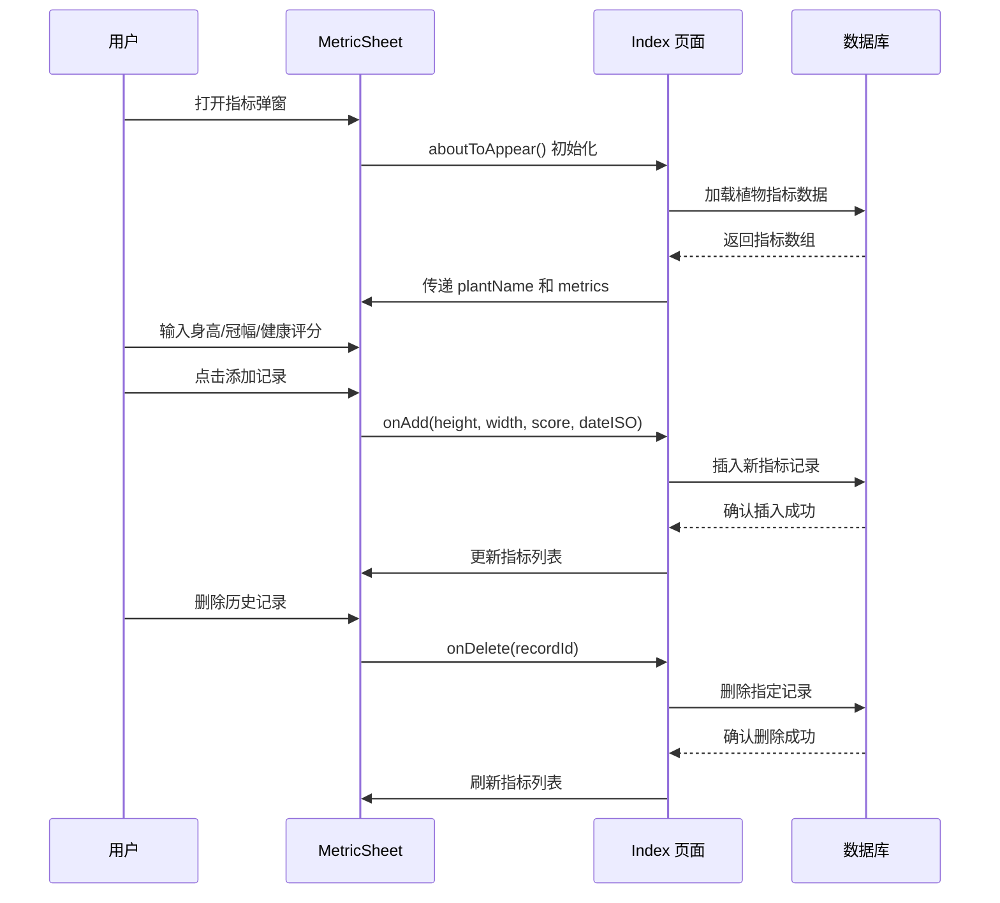
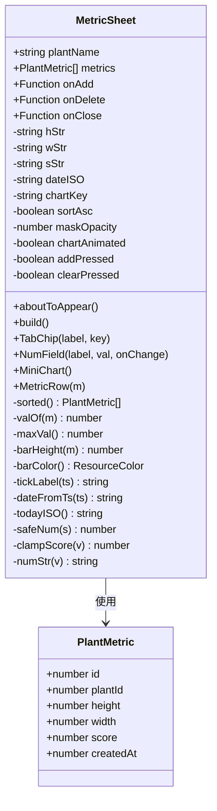
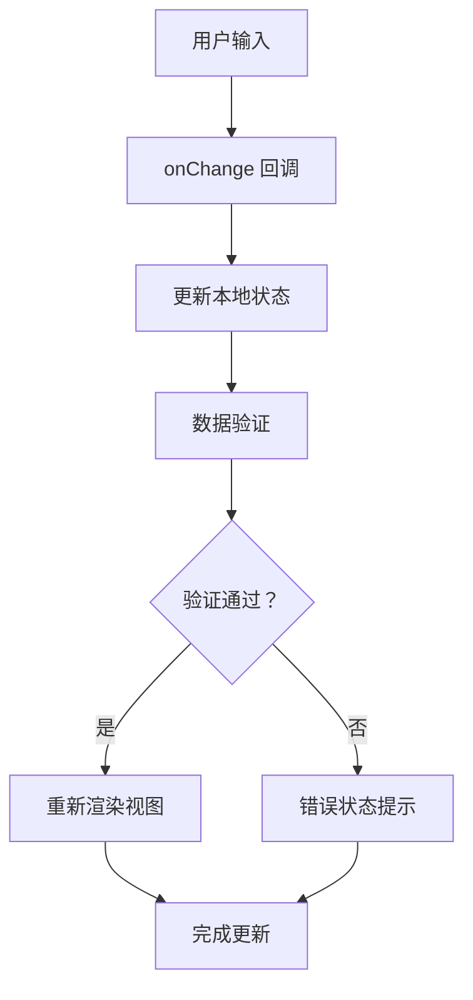
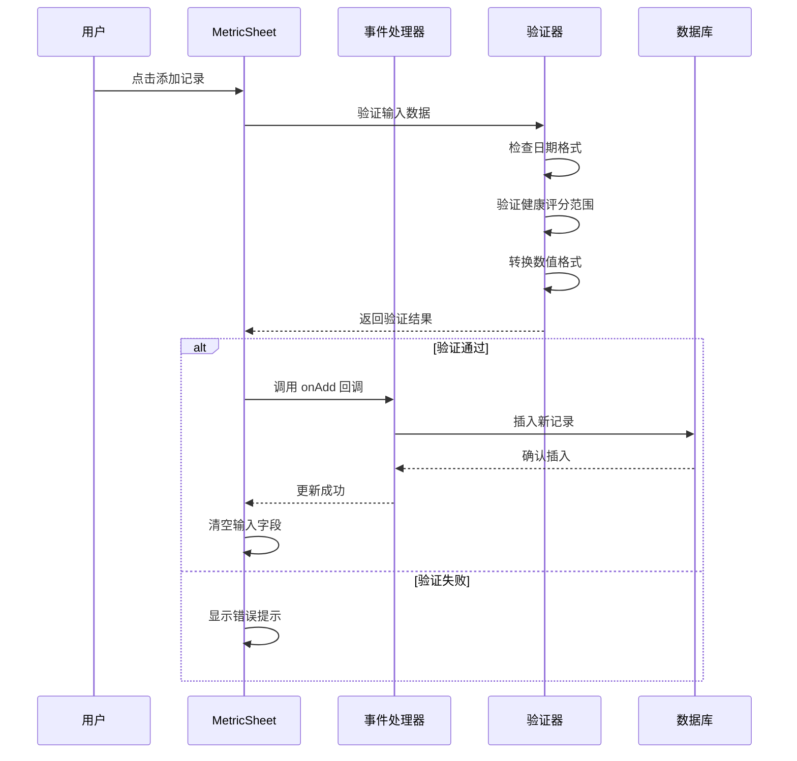
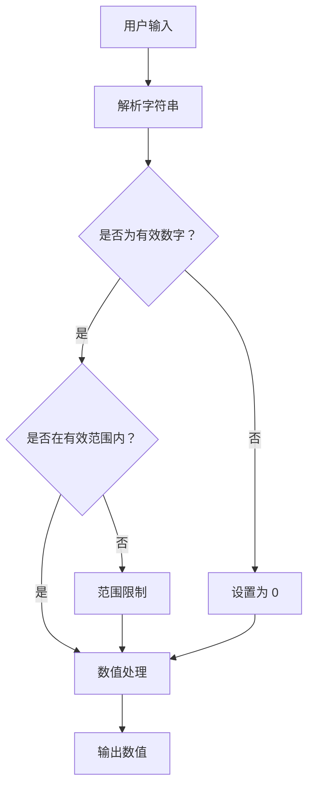
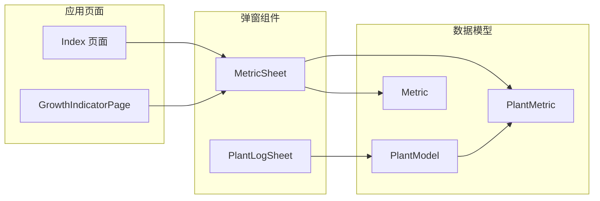
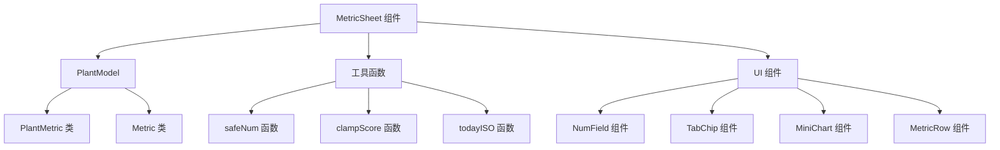

# MetricSheet 指标弹窗组件

<cite>
**本文档引用的文件**
- [MetricSheet.ets](file://entry/src/main/ets/view/MetricSheet.ets)
- [PlantModel.ets](file://entry/src/main/ets/model/PlantModel.ets)
- [Index.ets](file://entry/src/main/ets/pages/Index.ets)
- [GrowthIndicatorPage.ets](file://entry/src/main/ets/pages/GrowthIndicatorPage.ets)
</cite>

## 目录
1. [简介](#简介)
2. [项目结构](#项目结构)
3. [核心组件](#核心组件)
4. [架构概览](#架构概览)
5. [详细组件分析](#详细组件分析)
6. [依赖关系分析](#依赖关系分析)
7. [性能考虑](#性能考虑)
8. [故障排除指南](#故障排除指南)
9. [结论](#结论)

## 简介

MetricSheet 是 PlantDiary 应用中的一个轻量级指标弹窗组件，专门用于植物生长指标的快速录入和编辑。该组件提供了直观的用户界面，支持身高、冠幅、健康评分等关键指标的输入，并集成了迷你趋势图表和历史记录管理功能。

该组件采用 ArkTS 框架开发，具有以下核心特性：
- 快速指标录入界面
- 实时趋势图表展示
- 历史记录管理和删除
- 健康评分范围验证
- 多种排序和筛选选项

## 项目结构

MetricSheet 组件位于应用的视图层，与数据模型和页面控制器协同工作：

**图表来源**
- [MetricSheet.ets:1-491](file://entry/src/main/ets/view/MetricSheet.ets#L1-L491)
- [PlantModel.ets:108-147](file://entry/src/main/ets/model/PlantModel.ets#L108-L147)

**章节来源**
- [MetricSheet.ets:1-491](file://entry/src/main/ets/view/MetricSheet.ets#L1-L491)
- [PlantModel.ets:1-166](file://entry/src/main/ets/model/PlantModel.ets#L1-L166)

## 核心组件

MetricSheet 组件的核心功能包括：

### 主要属性
- `plantName`: 植物名称（必需）
- `metrics`: 指标数据数组（必需）
- `onAdd`: 添加指标回调函数
- `onDelete`: 删除指标回调函数
- `onClose`: 关闭弹窗回调函数

### 数据模型
组件使用 PlantMetric 类型来表示指标数据，包含以下字段：
- `id`: 指标记录 ID
- `plantId`: 植物 ID
- `height`: 身高（厘米）
- `width`: 冠幅（厘米）
- `score`: 健康评分（0-100）
- `createdAt`: 创建时间戳

### 状态管理
组件维护以下本地状态：
- 输入字段状态：身高、冠幅、健康评分
- 日期选择器：YYYY-MM-DD 格式
- 图表维度：健康分、身高、冠幅
- 排序状态：升序/降序
- 动画状态：背景遮罩、图表动画

**章节来源**
- [MetricSheet.ets:6-11](file://entry/src/main/ets/view/MetricSheet.ets#L6-L11)
- [MetricSheet.ets:13-26](file://entry/src/main/ets/view/MetricSheet.ets#L13-L26)
- [PlantModel.ets:129-147](file://entry/src/main/ets/model/PlantModel.ets#L129-L147)

## 架构概览

MetricSheet 组件采用组件化架构设计，与应用其他模块形成清晰的职责分离：

**图表来源**
- [Index.ets:1039-1053](file://entry/src/main/ets/pages/Index.ets#L1039-L1053)
- [MetricSheet.ets:149-159](file://entry/src/main/ets/view/MetricSheet.ets#L149-L159)

## 详细组件分析

### 组件结构分析

MetricSheet 采用结构化组件设计，包含以下主要部分：

**图表来源**
- [MetricSheet.ets:5-491](file://entry/src/main/ets/view/MetricSheet.ets#L5-L491)
- [PlantModel.ets:129-147](file://entry/src/main/ets/model/PlantModel.ets#L129-L147)

### 数据绑定机制

组件实现了双向数据绑定机制，确保用户输入与组件状态的同步：

#### 输入字段绑定
- 身高输入框：`hStr` 字符串绑定到身高输入
- 冠幅输入框：`wStr` 字符串绑定到冠幅输入  
- 健康评分输入框：`sStr` 字符串绑定到健康评分输入

#### 状态同步流程

**图表来源**
- [MetricSheet.ets:106-114](file://entry/src/main/ets/view/MetricSheet.ets#L106-L114)
- [MetricSheet.ets:267-283](file://entry/src/main/ets/view/MetricSheet.ets#L267-L283)

### 验证规则

组件实现了多层次的数据验证机制：

#### 健康评分验证
- 范围限制：0-100 分
- 小数处理：自动向下取整
- 默认值：8 分

#### 数值格式验证
- 类型检查：确保输入为有效数字
- 无限值处理：NaN 和 Infinity 转换为 0
- 空值处理：空字符串转换为 0

#### 日期格式验证
- ISO 格式：YYYY-MM-DD
- 长度检查：必须为 10 个字符
- 有效性检查：确保日期格式正确

**章节来源**
- [MetricSheet.ets:476-484](file://entry/src/main/ets/view/MetricSheet.ets#L476-L484)
- [MetricSheet.ets:468-474](file://entry/src/main/ets/view/MetricSheet.ets#L468-L474)
- [MetricSheet.ets:153-155](file://entry/src/main/ets/view/MetricSheet.ets#L153-L155)

### 提交处理逻辑

指标数据的提交采用事件驱动模式：

**图表来源**
- [MetricSheet.ets:149-159](file://entry/src/main/ets/view/MetricSheet.ets#L149-L159)
- [Index.ets:245-260](file://entry/src/main/ets/pages/Index.ets#L245-L260)

### 指标值输入格式

组件支持多种输入格式和单位：

#### 输入格式规范
- **身高**：厘米（cm），正整数
- **冠幅**：厘米（cm），正整数  
- **健康评分**：0-100 的整数或小数，自动向下取整

#### 输入验证流程

**图表来源**
- [MetricSheet.ets:468-484](file://entry/src/main/ets/view/MetricSheet.ets#L468-L484)

### 单位转换机制

组件内置了智能的单位处理机制：

#### 数值转换函数
- `safeNum(s)`: 安全数值转换，处理 NaN 和 Infinity
- `clampScore(v)`: 健康评分范围限制（0-100）
- `numStr(v)`: 数值字符串化，去除小数部分

#### 动画和视觉反馈
- **背景遮罩动画**：淡入效果，增强用户体验
- **图表动画**：柱状图逐个出现，突出趋势变化
- **按钮状态**：点击时的缩放动画反馈

**章节来源**
- [MetricSheet.ets:31-39](file://entry/src/main/ets/view/MetricSheet.ets#L31-L39)
- [MetricSheet.ets:321-324](file://entry/src/main/ets/view/MetricSheet.ets#L321-L324)
- [MetricSheet.ets:162-168](file://entry/src/main/ets/view/MetricSheet.ets#L162-L168)

### 组件与 PlantLogSheet 的集成

虽然 MetricSheet 和 PlantLogSheet 是两个独立的组件，但它们在应用架构中有明确的协作关系：

**图表来源**
- [Index.ets:1039-1053](file://entry/src/main/ets/pages/Index.ets#L1039-L1053)
- [GrowthIndicatorPage.ets:10-10](file://entry/src/main/ets/pages/GrowthIndicatorPage.ets#L10-L10)

## 依赖关系分析

### 外部依赖

MetricSheet 组件依赖以下外部模块：

#### 核心依赖
- **@Param/@Require**: 参数装饰器，用于声明必需属性
- **@Event**: 事件装饰器，用于声明回调函数
- **@Local**: 本地状态装饰器，用于声明组件状态
- **animateTo**: 动画控制函数
- **setTimeout**: 异步定时器

#### 内置类型依赖
- **PlantMetric**: 指标数据模型
- **ResourceColor**: 颜色资源类型
- **TouchEvent**: 触摸事件类型
- **Curve**: 动画曲线枚举

### 内部依赖关系

**图表来源**
- [MetricSheet.ets:1-1](file://entry/src/main/ets/view/MetricSheet.ets#L1-L1)
- [PlantModel.ets:129-147](file://entry/src/main/ets/model/PlantModel.ets#L129-L147)

**章节来源**
- [MetricSheet.ets:1-1](file://entry/src/main/ets/view/MetricSheet.ets#L1-L1)
- [PlantModel.ets:108-147](file://entry/src/main/ets/model/PlantModel.ets#L108-L147)

## 性能考虑

### 渲染优化

MetricSheet 组件采用了多项性能优化策略：

#### 虚拟滚动
- 列表组件使用虚拟滚动技术，仅渲染可见项
- 支持大量历史记录的高效展示

#### 动画优化
- 图表动画使用硬件加速
- 背景遮罩动画采用 CSS 过渡效果
- 按钮状态切换使用缓动函数

#### 内存管理
- 使用 @Local 装饰器管理本地状态
- 及时清理动画定时器
- 避免不必要的状态更新

### 数据处理优化

#### 排序算法
- 使用原地排序算法，减少内存分配
- 支持升序/降序两种排序模式
- 缓存排序结果，避免重复计算

#### 图表渲染
- 迷你图使用固定高度和宽度
- 动态计算柱状图高度
- 优化颜色渲染性能

## 故障排除指南

### 常见问题及解决方案

#### 指标数据不显示
**症状**：历史记录列表为空
**可能原因**：
- 数据库连接失败
- 植物 ID 不匹配
- 查询条件错误

**解决步骤**：
1. 检查数据库连接状态
2. 验证植物 ID 是否正确
3. 确认查询 SQL 语法

#### 输入验证错误
**症状**：添加记录时出现错误提示
**可能原因**：
- 健康评分超出范围
- 日期格式不正确
- 数值格式无效

**解决步骤**：
1. 检查健康评分是否在 0-100 范围内
2. 验证日期格式为 YYYY-MM-DD
3. 确认输入为有效数字

#### 动画异常
**症状**：组件动画不流畅
**可能原因**：
- 设备性能不足
- 动画配置不当
- 内存泄漏

**解决步骤**：
1. 检查设备性能指标
2. 调整动画持续时间和缓动函数
3. 监控内存使用情况

**章节来源**
- [Index.ets:274-284](file://entry/src/main/ets/pages/Index.ets#L274-L284)
- [MetricSheet.ets:476-484](file://entry/src/main/ets/view/MetricSheet.ets#L476-L484)

## 结论

MetricSheet 指标弹窗组件是一个功能完善、设计合理的植物生长指标管理工具。它通过简洁的界面设计和强大的数据处理能力，为用户提供了高效的植物指标录入体验。

### 主要优势

1. **用户友好**：直观的输入界面和即时反馈
2. **数据安全**：多重验证机制确保数据完整性
3. **性能优秀**：优化的渲染和动画效果
4. **扩展性强**：清晰的架构便于功能扩展

### 改进建议

1. **国际化支持**：添加多语言界面支持
2. **无障碍访问**：增强屏幕阅读器支持
3. **数据备份**：添加本地数据备份功能
4. **统计分析**：集成更多数据分析功能

该组件为 PlantDiary 应用提供了坚实的指标管理基础，是植物养护管理的重要组成部分。