# PlantLogSheet 植物日志弹窗组件

<cite>
**本文档引用的文件**
- [PlantLogSheet.ets](file://entry/src/main/ets/view/PlantLogSheet.ets)
- [PlantLogModel.ets](file://entry/src/main/ets/model/PlantLogModel.ets)
- [LogRowItem.ets](file://entry/src/main/ets/view/LogRowItem.ets)
- [AddImageFileViewModel.ets](file://entry/src/main/ets/viewmodel/AddImageFileViewModel.ets)
- [PhotoAttachBar.ets](file://entry/src/main/ets/view/PhotoAttachBar.ets)
- [PhotoPreviewSheet.ets](file://entry/src/main/ets/view/PhotoPreviewSheet.ets)
- [RdbManager.ets](file://entry/src/main/ets/viewmodel/RdbManager.ets)
- [PlantDetail.ets](file://entry/src/main/ets/pages/PlantDetail.ets)
</cite>

## 目录
1. [简介](#简介)
2. [项目结构](#项目结构)
3. [核心组件](#核心组件)
4. [架构概览](#架构概览)
5. [详细组件分析](#详细组件分析)
6. [依赖关系分析](#依赖关系分析)
7. [性能考虑](#性能考虑)
8. [故障排除指南](#故障排除指南)
9. [结论](#结论)
10. [附录](#附录)

## 简介

PlantLogSheet 是一个专为植物日记应用设计的弹窗式日志管理组件。该组件提供了完整的植物日志生命周期管理功能，包括日志的创建、编辑、删除、附件管理和照片预览等功能。

该组件采用ArkTS框架开发，基于响应式编程模型，通过ObservedV2装饰器实现数据绑定，确保UI与数据的实时同步。组件支持多选删除、关键字高亮、时间排序等高级功能，为用户提供直观便捷的日志管理体验。

## 项目结构

PlantLogSheet组件在项目中的位置和组织结构如下：

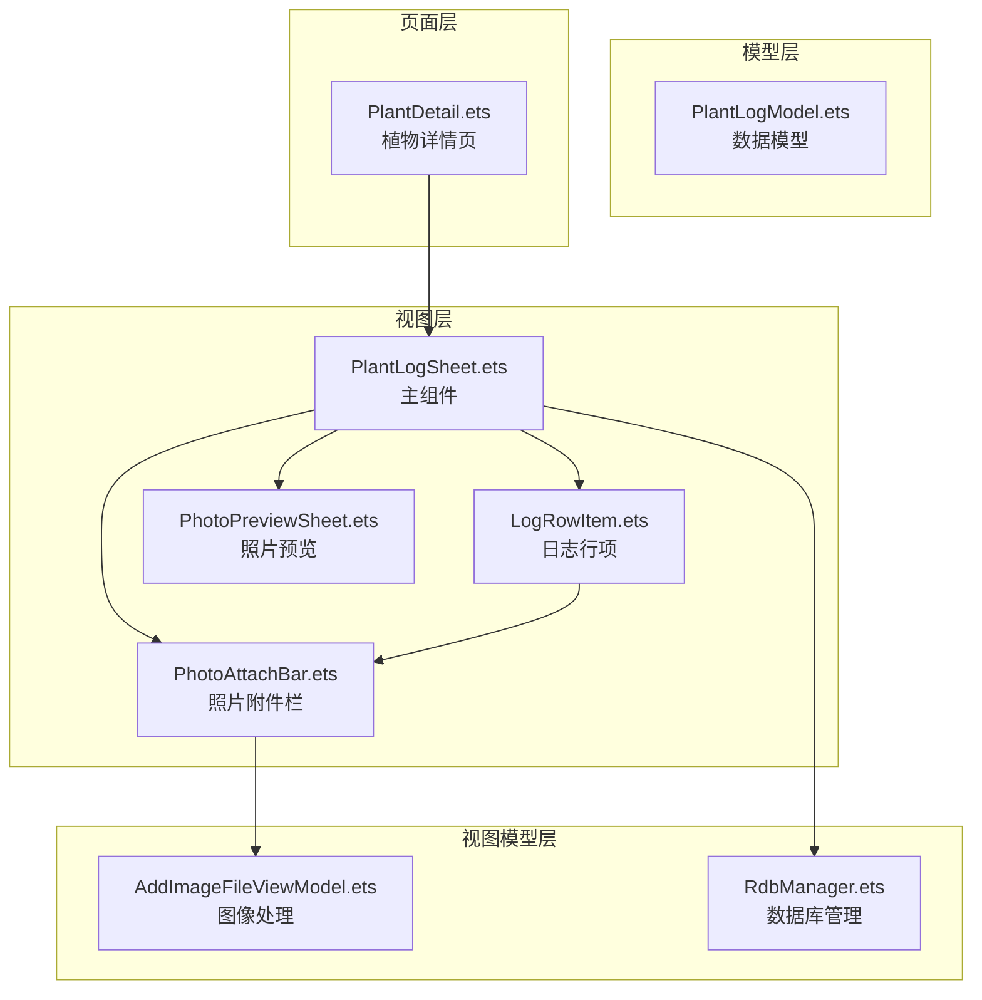

**图表来源**
- [PlantLogSheet.ets:1-384](file://entry/src/main/ets/view/PlantLogSheet.ets#L1-L384)
- [PlantLogModel.ets:1-58](file://entry/src/main/ets/model/PlantLogModel.ets#L1-L58)
- [AddImageFileViewModel.ets:1-146](file://entry/src/main/ets/viewmodel/AddImageFileViewModel.ets#L1-L146)

**章节来源**
- [PlantLogSheet.ets:1-384](file://entry/src/main/ets/view/PlantLogSheet.ets#L1-L384)
- [PlantLogModel.ets:1-58](file://entry/src/main/ets/model/PlantLogModel.ets#L1-L58)

## 核心组件

### 数据模型

PlantLogSheet组件定义了两个核心数据模型：

#### PlantLog 日志模型
- **id**: 日志唯一标识符
- **plantId**: 关联的植物ID
- **note**: 日志内容/备注
- **createdAt**: 创建时间戳

#### LogPhoto 照片模型
- **id**: 照片唯一标识符
- **logId**: 关联的日志ID
- **path**: 原图路径（filesDir下）
- **thumbPath**: 缩略图路径
- **createdAt**: 创建时间戳

### 组件属性

| 属性名 | 类型 | 必填 | 默认值 | 描述 |
|--------|------|------|--------|------|
| plantName | string | 是 | - | 植物名称 |
| logs | Array<PlantLog> | 是 | - | 日志数组 |
| photos | Array<LogPhoto> | 是 | - | 照片数组 |
| keyword | string | 否 | '' | 关键字高亮 |
| onAddLog | Function | 是 | - | 添加日志事件 |
| onDeleteLog | Function | 是 | - | 删除单个日志事件 |
| onBatchDeleteLogs | Function | 是 | - | 批量删除日志事件 |
| onPickPhotos | Function | 是 | - | 选择照片事件 |
| onCapturePhoto | Function | 是 | - | 拍照事件 |
| onDeletePhoto | Function | 是 | - | 删除照片事件 |
| onPreviewPhoto | Function | 是 | - | 预览照片事件 |
| onClose | Function | 是 | - | 关闭弹窗事件 |

**章节来源**
- [PlantLogSheet.ets:3-50](file://entry/src/main/ets/view/PlantLogSheet.ets#L3-L50)
- [PlantLogModel.ets:8-57](file://entry/src/main/ets/model/PlantLogModel.ets#L8-L57)

## 架构概览

PlantLogSheet组件采用分层架构设计，各层职责明确：

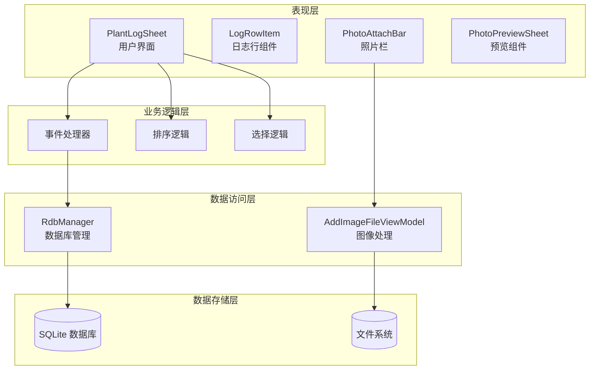

**图表来源**
- [PlantLogSheet.ets:35-367](file://entry/src/main/ets/view/PlantLogSheet.ets#L35-L367)
- [RdbManager.ets:4-296](file://entry/src/main/ets/viewmodel/RdbManager.ets#L4-L296)
- [AddImageFileViewModel.ets:14-146](file://entry/src/main/ets/viewmodel/AddImageFileViewModel.ets#L14-L146)

## 详细组件分析

### PlantLogSheet 主组件

#### 组件结构
PlantLogSheet是一个结构化组件（struct），具有以下特点：

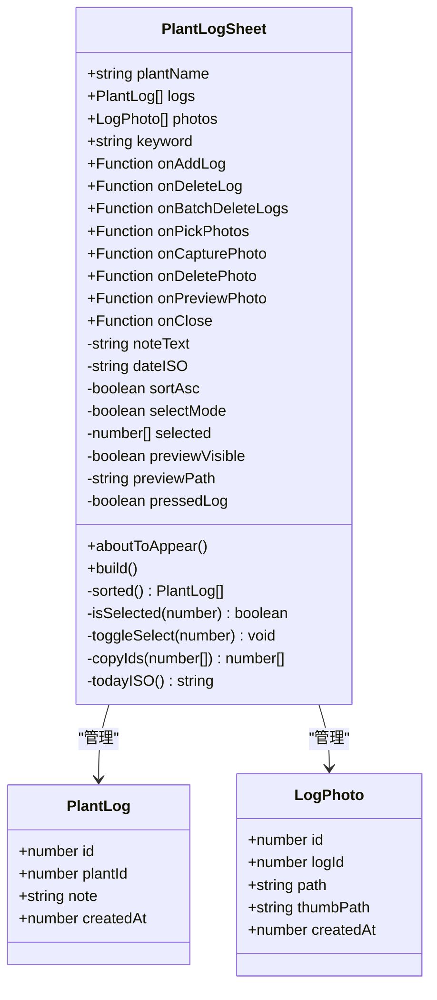

**图表来源**
- [PlantLogSheet.ets:35-367](file://entry/src/main/ets/view/PlantLogSheet.ets#L35-L367)
- [PlantLogModel.ets:8-57](file://entry/src/main/ets/model/PlantLogModel.ets#L8-L57)

#### 核心功能实现

##### 日志排序功能
组件支持升序和降序两种排序方式，通过sortAsc属性控制：

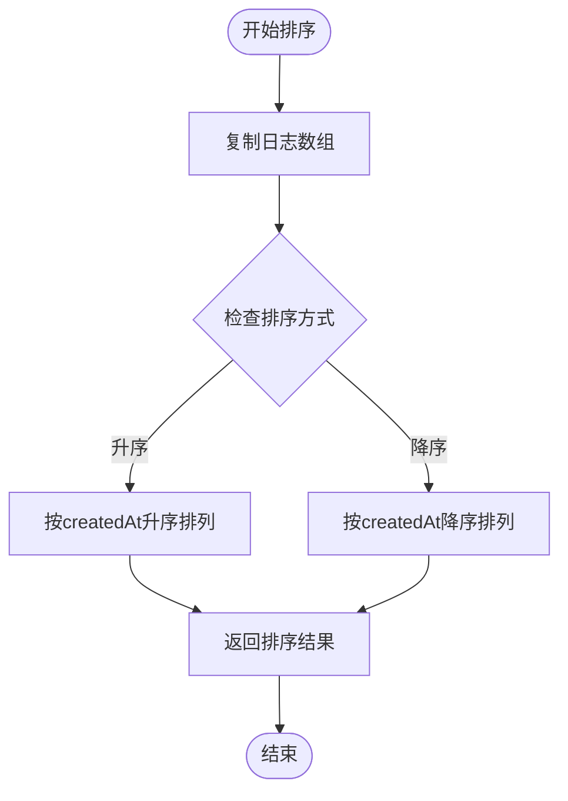

**图表来源**
- [PlantLogSheet.ets:309-319](file://entry/src/main/ets/view/PlantLogSheet.ets#L309-L319)

##### 多选删除功能
组件实现了高效的多选删除机制：

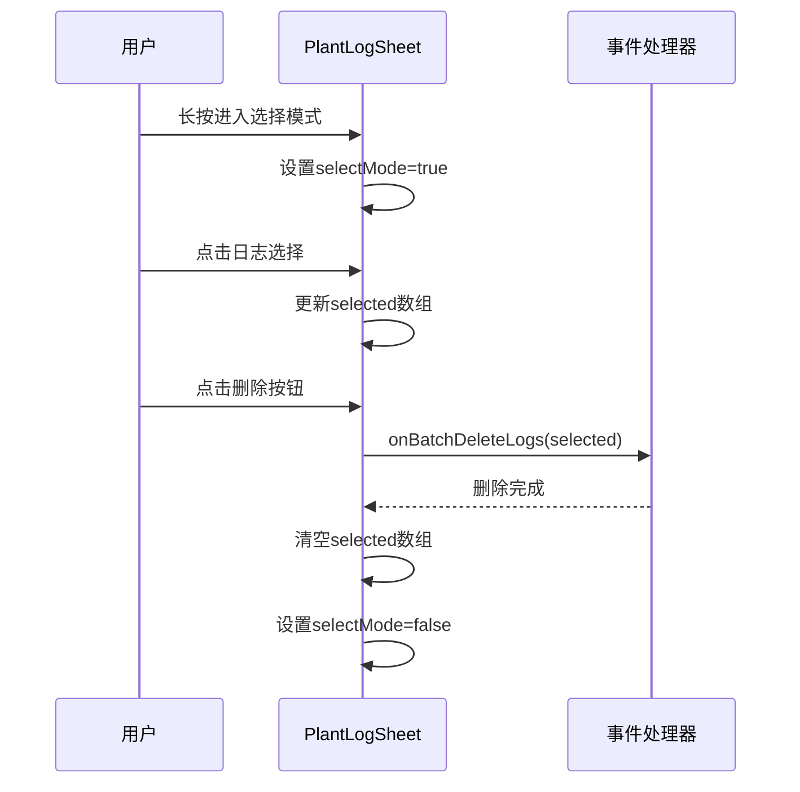

**图表来源**
- [PlantLogSheet.ets:75-94](file://entry/src/main/ets/view/PlantLogSheet.ets#L75-L94)
- [PlantLogSheet.ets:332-348](file://entry/src/main/ets/view/PlantLogSheet.ets#L332-L348)

**章节来源**
- [PlantLogSheet.ets:35-367](file://entry/src/main/ets/view/PlantLogSheet.ets#L35-L367)

### LogRowItem 日志行组件

LogRowItem负责单条日志的展示和交互，具有以下特性：

#### 照片附件管理
组件支持日志照片的网格显示和管理：

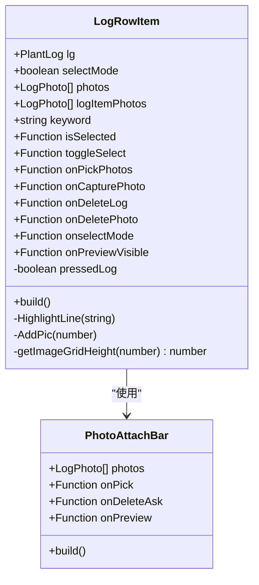

**图表来源**
- [LogRowItem.ets:3-272](file://entry/src/main/ets/view/LogRowItem.ets#L3-L272)
- [PhotoAttachBar.ets:18-99](file://entry/src/main/ets/view/PhotoAttachBar.ets#L18-L99)

#### 关键字高亮功能
组件实现了智能的关键字高亮显示：

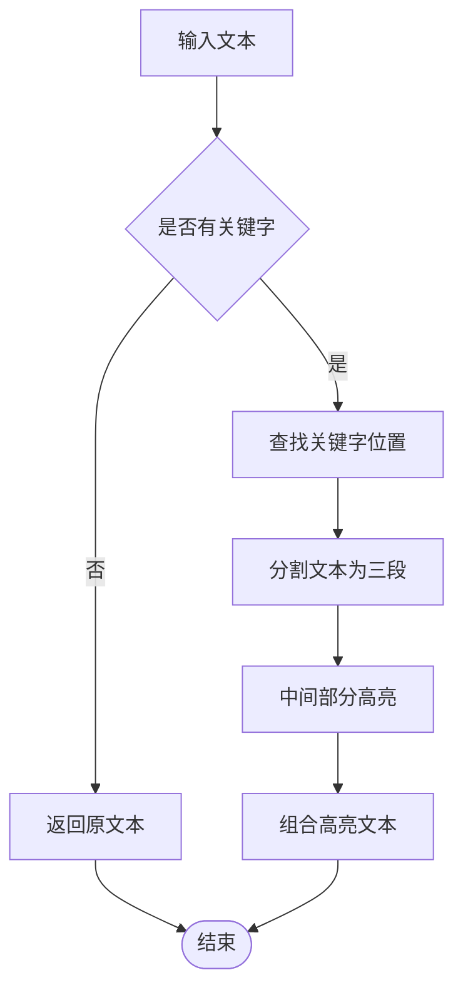

**图表来源**
- [LogRowItem.ets:29-57](file://entry/src/main/ets/view/LogRowItem.ets#L29-L57)

**章节来源**
- [LogRowItem.ets:1-272](file://entry/src/main/ets/view/LogRowItem.ets#L1-L272)

### 照片处理系统

#### AddImageFileViewModel 图像处理
该组件负责照片的选择、处理和存储：

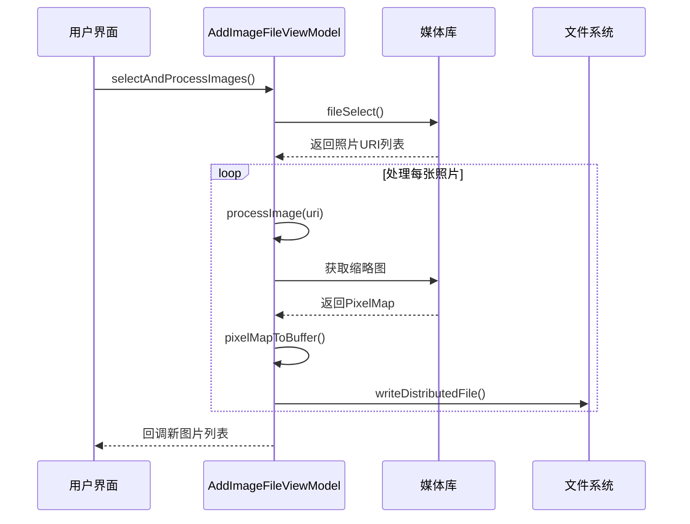

**图表来源**
- [AddImageFileViewModel.ets:34-55](file://entry/src/main/ets/viewmodel/AddImageFileViewModel.ets#L34-L55)
- [AddImageFileViewModel.ets:77-113](file://entry/src/main/ets/viewmodel/AddImageFileViewModel.ets#L77-L113)

#### 照片预览功能
PhotoPreviewSheet提供全屏照片预览功能：

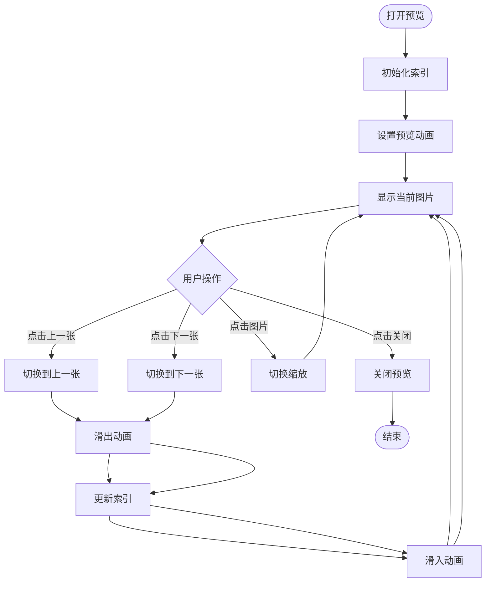

**图表来源**
- [PhotoPreviewSheet.ets:52-92](file://entry/src/main/ets/view/PhotoPreviewSheet.ets#L52-L92)
- [PhotoPreviewSheet.ets:94-100](file://entry/src/main/ets/view/PhotoPreviewSheet.ets#L94-L100)

**章节来源**
- [AddImageFileViewModel.ets:1-146](file://entry/src/main/ets/viewmodel/AddImageFileViewModel.ets#L1-L146)
- [PhotoPreviewSheet.ets:1-223](file://entry/src/main/ets/view/PhotoPreviewSheet.ets#L1-L223)

## 依赖关系分析

### 组件间依赖关系

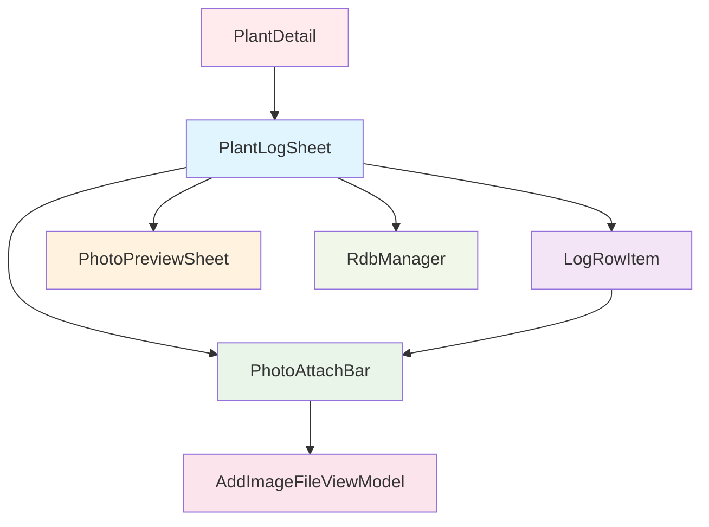

**图表来源**
- [PlantLogSheet.ets:1-2](file://entry/src/main/ets/view/PlantLogSheet.ets#L1-L2)
- [LogRowItem.ets:1](file://entry/src/main/ets/view/LogRowItem.ets#L1)

### 数据流分析

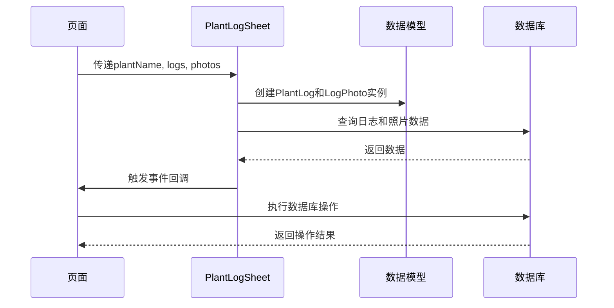

**图表来源**
- [PlantLogSheet.ets:37-49](file://entry/src/main/ets/view/PlantLogSheet.ets#L37-L49)
- [RdbManager.ets:19-296](file://entry/src/main/ets/viewmodel/RdbManager.ets#L19-L296)

**章节来源**
- [PlantLogSheet.ets:1-384](file://entry/src/main/ets/view/PlantLogSheet.ets#L1-L384)
- [RdbManager.ets:1-296](file://entry/src/main/ets/viewmodel/RdbManager.ets#L1-L296)

## 性能考虑

### 内存管理
- 使用ObservedV2装饰器实现高效的数据绑定，避免不必要的重渲染
- 图片处理采用异步方式，防止UI阻塞
- 及时释放PixelMap资源，避免内存泄漏

### 数据优化
- 数据库查询使用索引优化，提高查询性能
- 支持分页加载大量日志数据
- 图片缩略图缓存机制减少重复计算

### 用户体验优化
- 平滑的动画过渡效果
- 响应式的触摸反馈
- 实时的键盘高亮显示

## 故障排除指南

### 常见问题及解决方案

#### 日志无法显示
1. 检查数据库连接是否正常
2. 验证plantId参数是否正确传递
3. 确认数据库表结构是否完整

#### 照片上传失败
1. 检查媒体库权限是否授予
2. 验证文件路径格式是否正确
3. 确认分布式文件目录权限

#### 性能问题
1. 优化图片压缩质量
2. 实现图片懒加载
3. 减少不必要的数据绑定

**章节来源**
- [AddImageFileViewModel.ets:52-55](file://entry/src/main/ets/viewmodel/AddImageFileViewModel.ets#L52-L55)
- [RdbManager.ets:277-294](file://entry/src/main/ets/viewmodel/RdbManager.ets#L277-L294)

## 结论

PlantLogSheet植物日志弹窗组件是一个功能完整、架构清晰的日志管理系统。组件通过合理的分层设计和模块化实现，提供了优秀的用户体验和良好的扩展性。

主要优势包括：
- 完整的日志生命周期管理
- 高效的多选删除功能
- 智能的关键字高亮显示
- 流畅的动画过渡效果
- 稳定的数据库交互机制

该组件为植物日记应用提供了坚实的基础，支持进一步的功能扩展和定制开发。

## 附录

### API参考

#### PlantLogSheet 属性
- `plantName`: 植物名称（必填）
- `logs`: 日志数组（必填）
- `photos`: 照片数组（必填）
- `keyword`: 关键字高亮（可选）

#### 事件回调
- `onAddLog(note, dateISO)`: 添加日志
- `onDeleteLog(logId)`: 删除单个日志
- `onBatchDeleteLogs(logIds)`: 批量删除日志
- `onPickPhotos(logId)`: 选择照片
- `onCapturePhoto(logId)`: 拍照
- `onDeletePhoto(photoId)`: 删除照片
- `onPreviewPhoto(filePath)`: 预览照片
- `onClose()`: 关闭弹窗

#### 最佳实践
1. 合理使用多选删除功能，避免误操作
2. 为关键日志设置合适的关键词
3. 定期清理不需要的照片文件
4. 利用排序功能快速定位日志
5. 保持日志内容的简洁性和准确性