# 日志指标组件系列

<cite>
**本文档引用的文件**
- [LogRowItem.ets](file://entry/src/main/ets/view/LogRowItem.ets)
- [MetricSheet.ets](file://entry/src/main/ets/view/MetricSheet.ets)
- [MetricChartSheet.ets](file://entry/src/main/ets/view/MetricChartSheet.ets)
- [PlantLogSheet.ets](file://entry/src/main/ets/view/PlantLogSheet.ets)
- [PlantModel.ets](file://entry/src/main/ets/model/PlantModel.ets)
- [PlantLogPage.ets](file://entry/src/main/ets/pages/PlantLogPage.ets)
- [GrowthIndicatorPage.ets](file://entry/src/main/ets/pages/GrowthIndicatorPage.ets)
- [PhotoPreviewSheet.ets](file://entry/src/main/ets/view/PhotoPreviewSheet.ets)
</cite>

## 目录
1. [简介](#简介)
2. [项目结构](#项目结构)
3. [核心组件](#核心组件)
4. [架构概览](#架构概览)
5. [详细组件分析](#详细组件分析)
6. [依赖关系分析](#依赖关系分析)
7. [性能考虑](#性能考虑)
8. [故障排除指南](#故障排除指南)
9. [结论](#结论)
10. [附录](#附录)

## 简介

日志指标组件系列是PlantDiary植物管理应用中的核心功能模块，主要包含以下四个关键组件：

- **LogRowItem**：日志行项组件，负责单条日志的显示和交互
- **MetricSheet**：指标弹窗组件，提供快速指标录入和编辑功能
- **MetricChartSheet**：指标图表弹窗组件，展示完整的生长趋势图表
- **PlantLogSheet**：植物日志弹窗组件，管理植物日志和附件

这些组件通过统一的数据模型和事件机制实现了日志和指标数据的完整生命周期管理，包括创建、编辑、删除、可视化展示等功能。

## 项目结构

日志指标组件系列位于应用的视图层，采用组件化设计模式：

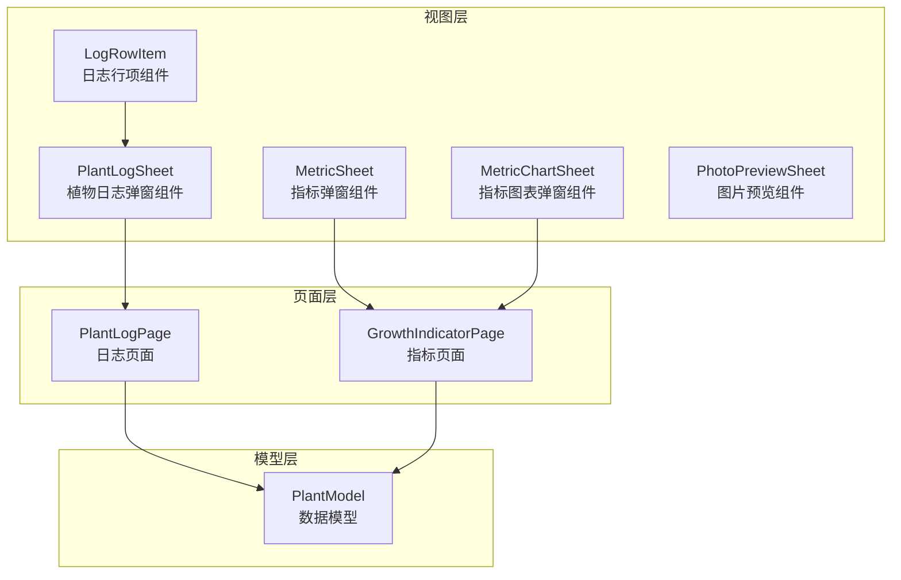

**图表来源**
- [LogRowItem.ets:1-272](file://entry/src/main/ets/view/LogRowItem.ets#L1-L272)
- [MetricSheet.ets:1-491](file://entry/src/main/ets/view/MetricSheet.ets#L1-L491)
- [MetricChartSheet.ets:1-181](file://entry/src/main/ets/view/MetricChartSheet.ets#L1-L181)
- [PlantLogSheet.ets:1-384](file://entry/src/main/ets/view/PlantLogSheet.ets#L1-L384)

**章节来源**
- [LogRowItem.ets:1-272](file://entry/src/main/ets/view/LogRowItem.ets#L1-L272)
- [MetricSheet.ets:1-491](file://entry/src/main/ets/view/MetricSheet.ets#L1-L491)
- [MetricChartSheet.ets:1-181](file://entry/src/main/ets/view/MetricChartSheet.ets#L1-L181)
- [PlantLogSheet.ets:1-384](file://entry/src/main/ets/view/PlantLogSheet.ets#L1-L384)

## 核心组件

### 数据模型

系统采用统一的数据模型来确保组件间的数据一致性：

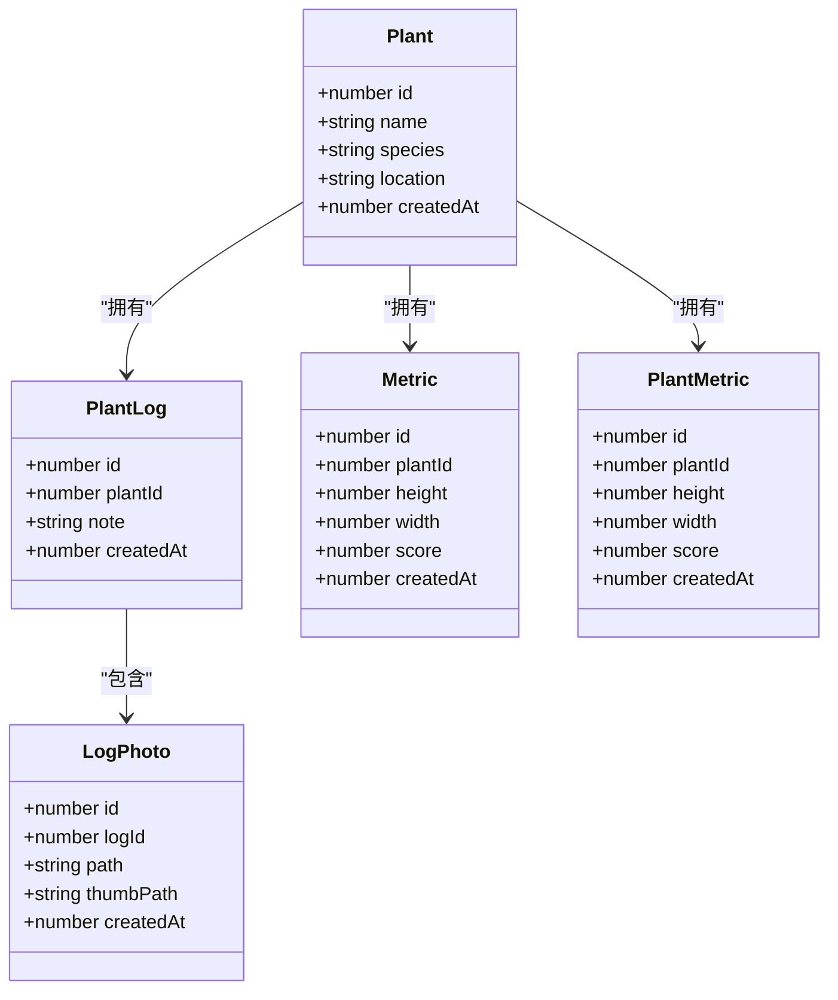

**图表来源**
- [PlantModel.ets:6-166](file://entry/src/main/ets/model/PlantModel.ets#L6-L166)

### 组件间通信机制

组件通过事件驱动的方式进行通信，实现了松耦合的设计：

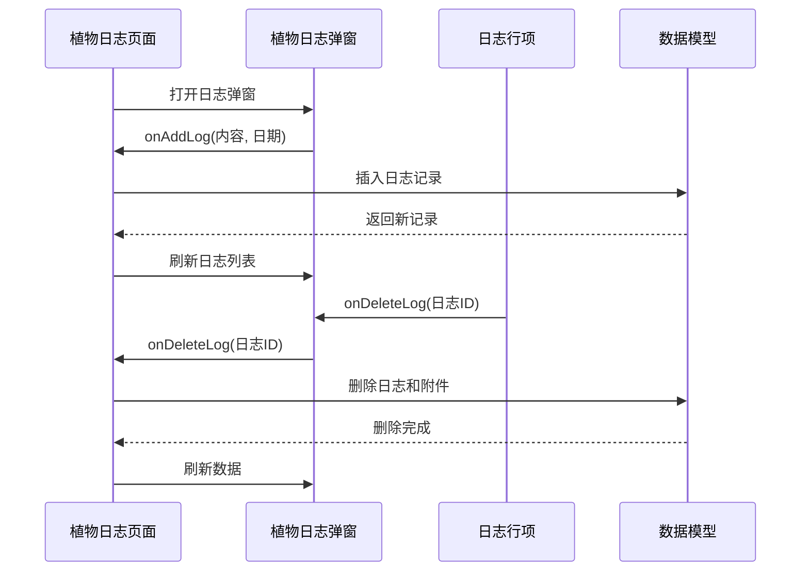

**图表来源**
- [PlantLogPage.ets:66-83](file://entry/src/main/ets/pages/PlantLogPage.ets#L66-L83)
- [PlantLogSheet.ets:41-50](file://entry/src/main/ets/view/PlantLogSheet.ets#L41-L50)

**章节来源**
- [PlantModel.ets:1-166](file://entry/src/main/ets/model/PlantModel.ets#L1-L166)
- [PlantLogPage.ets:1-1030](file://entry/src/main/ets/pages/PlantLogPage.ets#L1-L1030)

## 架构概览

日志指标组件系列采用分层架构设计，各层职责明确：

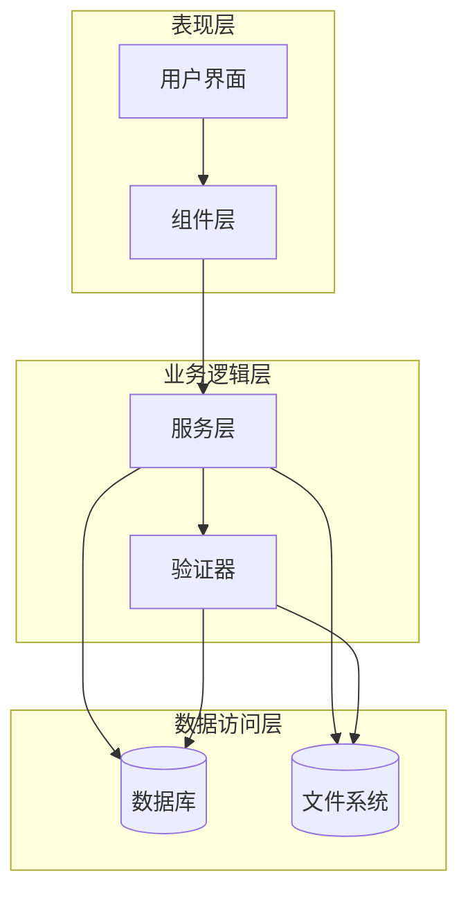

**图表来源**
- [PlantLogPage.ets:13-51](file://entry/src/main/ets/pages/PlantLogPage.ets#L13-L51)
- [GrowthIndicatorPage.ets:6-54](file://entry/src/main/ets/pages/GrowthIndicatorPage.ets#L6-L54)

## 详细组件分析

### LogRowItem 日志行项组件

LogRowItem是日志显示的核心组件，负责单条日志的渲染和交互：

#### 组件属性和事件

| 属性名称 | 类型 | 必填 | 描述 |
|---------|------|------|------|
| lg | PlantLog | 是 | 日志数据对象 |
| selectMode | boolean | 是 | 是否处于选择模式 |
| photos | Array<LogPhoto> | 是 | 所有日志照片 |
| logItemPhotos | Array<LogPhoto> | 是 | 当前日志的照片集合 |
| keyword | string | 否 | 高亮关键词 |
| isSelected | Function | 是 | 检查日志是否被选中 |
| toggleSelect | Function | 是 | 切换日志选择状态 |
| onPickPhotos | Function | 是 | 选择照片回调 |
| onCapturePhoto | Function | 是 | 拍照回调 |
| onDeleteLog | Function | 是 | 删除日志回调 |
| onDeletePhoto | Function | 是 | 删除照片回调 |
| onselectMode | Function | 是 | 切换选择模式回调 |
| onPreviewVisible | Function | 是 | 预览图片回调 |

#### 核心功能特性

1. **智能高亮显示**：支持关键词高亮显示，提升搜索体验
2. **多选模式**：长按触发选择模式，支持批量操作
3. **照片管理**：集成照片选择、拍摄、删除功能
4. **响应式交互**：提供触摸反馈和动画效果

#### 用户交互流程

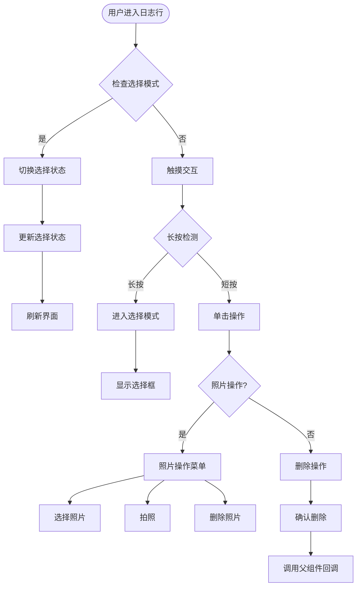

**图表来源**
- [LogRowItem.ets:72-134](file://entry/src/main/ets/view/LogRowItem.ets#L72-L134)

**章节来源**
- [LogRowItem.ets:1-272](file://entry/src/main/ets/view/LogRowItem.ets#L1-L272)

### MetricSheet 指标弹窗组件

MetricSheet提供轻量级的指标录入和管理功能：

#### 组件功能特性

1. **快速录入**：支持身高、冠幅、健康分的快速录入
2. **迷你图表**：实时显示指标趋势
3. **历史管理**：支持历史记录的查看和删除
4. **排序功能**：支持按时间升序/降序排列

#### 数据流处理

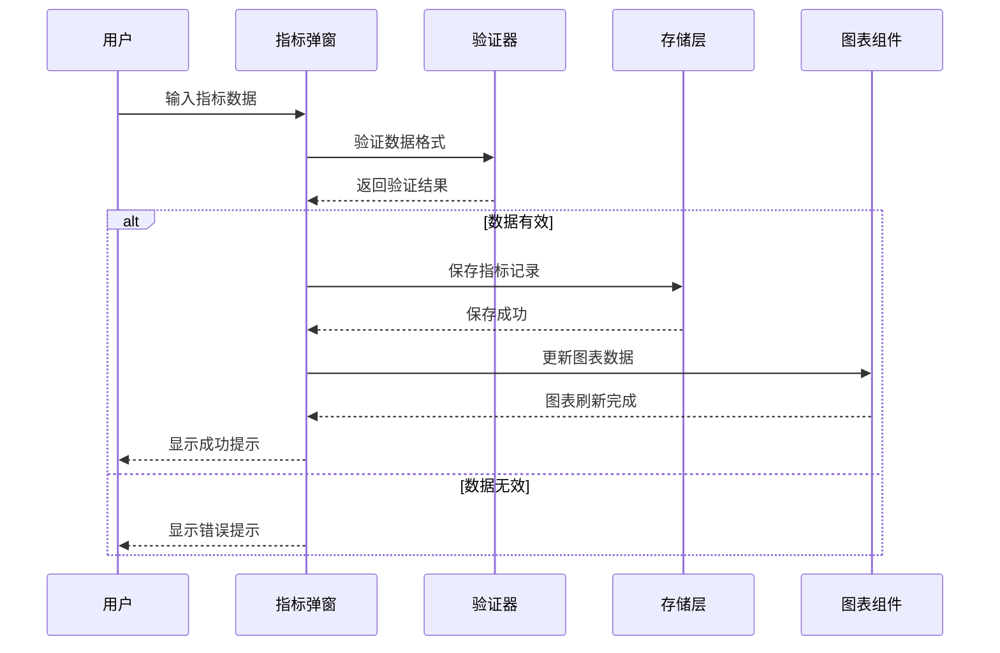

**图表来源**
- [MetricSheet.ets:104-198](file://entry/src/main/ets/view/MetricSheet.ets#L104-L198)

#### 核心算法实现

组件实现了多种数据处理算法：

1. **排序算法**：支持升序/降序两种排序方式
2. **数据验证**：健康分范围限制(0-100)
3. **图表计算**：动态计算柱状图高度比例

**章节来源**
- [MetricSheet.ets:1-491](file://entry/src/main/ets/view/MetricSheet.ets#L1-L491)

### MetricChartSheet 指标图表弹窗组件

MetricChartSheet专注于提供完整的生长趋势可视化：

#### 图表配置

组件使用McLineChart库实现专业的折线图展示：

| 配置项 | 值 | 描述 |
|-------|----|-----|
| 标题 | "生长指标" | 图表标题 |
| X轴 | 时间序列 | 显示MM-DD格式 |
| Y轴 | 三个系列 | 高度、宽度、健康度 |
| 图例 | 显示 | 支持系列切换 |
| 缩放 | 区域缩放 | 支持数据范围缩放 |
| 动画 | 开启 | 平滑过渡效果 |

#### 数据处理流程

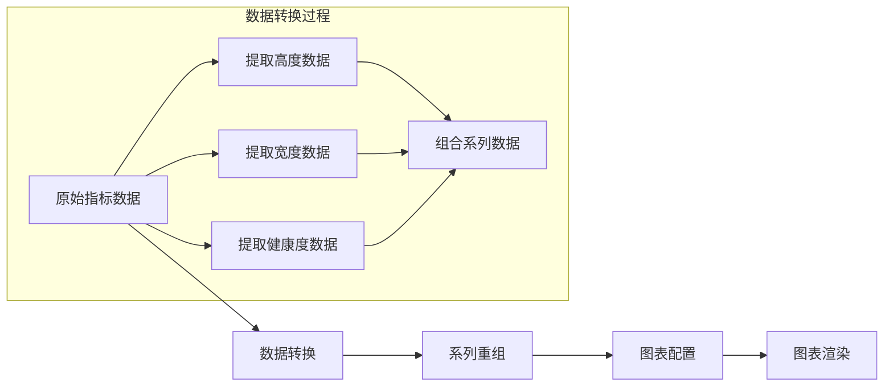

**图表来源**
- [MetricChartSheet.ets:55-64](file://entry/src/main/ets/view/MetricChartSheet.ets#L55-L64)

**章节来源**
- [MetricChartSheet.ets:1-181](file://entry/src/main/ets/view/MetricChartSheet.ets#L1-L181)

### PlantLogSheet 植物日志弹窗组件

PlantLogSheet是植物日志管理的核心组件，提供了完整的日志生命周期管理：

#### 主要功能模块

1. **日志创建**：支持文本日志的快速创建
2. **日志列表**：显示植物的所有日志记录
3. **照片管理**：集成日志照片的添加、删除、预览
4. **批量操作**：支持多选删除等批量操作

#### 状态管理模式

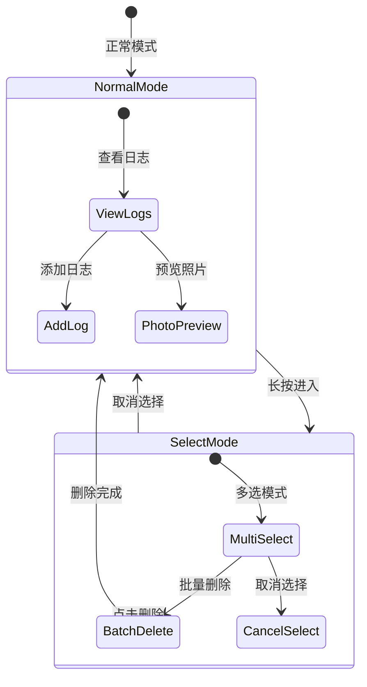

**图表来源**
- [PlantLogSheet.ets:51-59](file://entry/src/main/ets/view/PlantLogSheet.ets#L51-L59)

**章节来源**
- [PlantLogSheet.ets:1-384](file://entry/src/main/ets/view/PlantLogSheet.ets#L1-L384)

## 依赖关系分析

### 组件依赖图

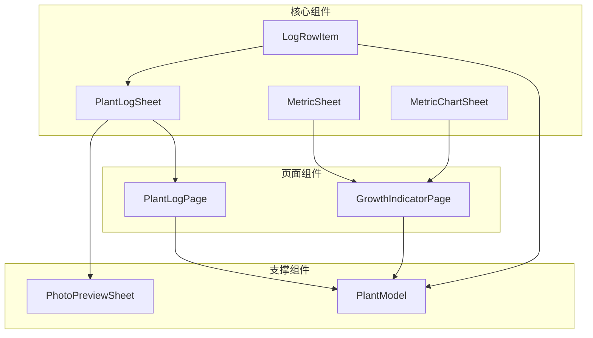

**图表来源**
- [PlantLogPage.ets:1-13](file://entry/src/main/ets/pages/PlantLogPage.ets#L1-L13)
- [GrowthIndicatorPage.ets:1-6](file://entry/src/main/ets/pages/GrowthIndicatorPage.ets#L1-L6)

### 数据依赖关系

组件间的数据流向体现了清晰的单向数据流原则：

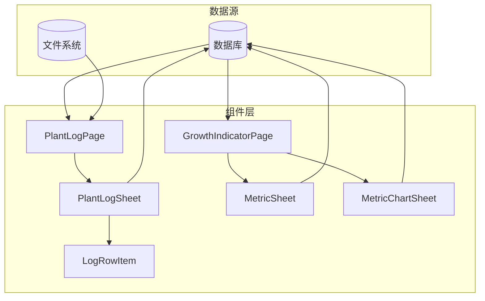

**图表来源**
- [PlantLogPage.ets:13-18](file://entry/src/main/ets/pages/PlantLogPage.ets#L13-L18)
- [GrowthIndicatorPage.ets:6-11](file://entry/src/main/ets/pages/GrowthIndicatorPage.ets#L6-L11)

**章节来源**
- [PlantLogPage.ets:1-1030](file://entry/src/main/ets/pages/PlantLogPage.ets#L1-L1030)
- [GrowthIndicatorPage.ets:1-605](file://entry/src/main/ets/pages/GrowthIndicatorPage.ets#L1-L605)

## 性能考虑

### 内存优化策略

1. **懒加载机制**：照片按需加载，避免一次性加载所有图片
2. **虚拟滚动**：长列表使用虚拟滚动减少DOM节点数量
3. **事件节流**：高频事件进行节流处理，避免过度重绘

### 数据缓存策略

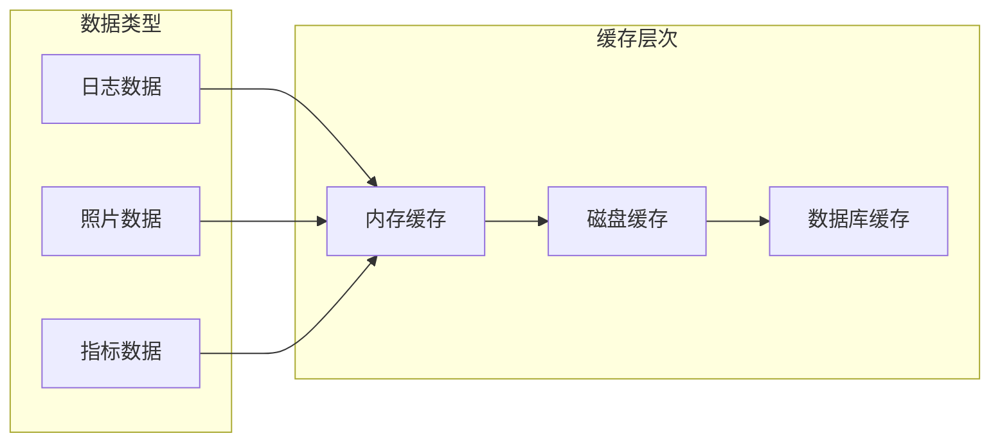

### 性能监控

组件实现了基础的性能监控机制：

1. **渲染性能**：记录组件渲染耗时
2. **数据加载**：监控数据库查询性能
3. **图片处理**：跟踪图片压缩和缓存命中率

## 故障排除指南

### 常见问题及解决方案

#### 日志删除失败

**问题现象**：删除日志时出现错误提示

**可能原因**：
1. 数据库事务失败
2. 文件删除权限不足
3. 照片文件路径无效

**解决步骤**：
1. 检查数据库连接状态
2. 验证文件系统权限
3. 确认文件路径有效性
4. 查看错误日志获取详细信息

#### 照片显示异常

**问题现象**：照片无法正常显示或显示错误

**可能原因**：
1. 文件路径格式不正确
2. 图片格式不受支持
3. 内存不足导致加载失败

**解决步骤**：
1. 确保文件URI格式正确
2. 验证图片格式兼容性
3. 检查内存使用情况
4. 清理缓存后重试

#### 图表渲染问题

**问题现象**：指标图表无法正常显示

**可能原因**：
1. 图表库初始化失败
2. 数据格式不符合要求
3. 容器尺寸计算错误

**解决步骤**：
1. 检查图表库依赖
2. 验证数据格式和类型
3. 确认容器尺寸设置
4. 查看浏览器控制台错误

**章节来源**
- [PlantLogPage.ets:87-137](file://entry/src/main/ets/pages/PlantLogPage.ets#L87-L137)
- [GrowthIndicatorPage.ets:447-455](file://entry/src/main/ets/pages/GrowthIndicatorPage.ets#L447-L455)

## 结论

日志指标组件系列展现了优秀的软件架构设计：

1. **模块化设计**：每个组件职责明确，接口清晰
2. **事件驱动**：通过事件机制实现松耦合通信
3. **数据一致性**：统一的数据模型确保各组件间的数据同步
4. **用户体验**：丰富的交互效果和流畅的动画体验
5. **扩展性**：良好的架构为后续功能扩展奠定基础

这些组件为植物管理应用提供了完整的日志和指标管理能力，是构建植物养护生态系统的重要基础设施。

## 附录

### 组件使用最佳实践

#### 日志管理最佳实践

1. **及时备份**：定期备份日志和照片数据
2. **分类管理**：合理组织日志内容，便于后续查找
3. **定期清理**：定期清理过期或重复的日志记录
4. **标签使用**：为重要日志添加标签便于检索

#### 指标录入最佳实践

1. **定时记录**：建立固定的记录时间表
2. **准确测量**：使用标准的测量工具确保数据准确性
3. **环境记录**：记录影响植物生长的环境因素
4. **趋势分析**：定期分析指标变化趋势

#### 性能优化建议

1. **图片压缩**：上传前对图片进行适当压缩
2. **增量加载**：实现分页加载减少初始渲染压力
3. **缓存策略**：合理设置缓存策略提升响应速度
4. **异步处理**：耗时操作采用异步处理避免阻塞UI