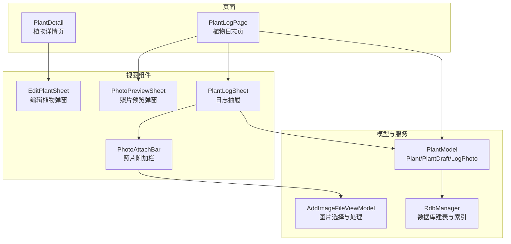
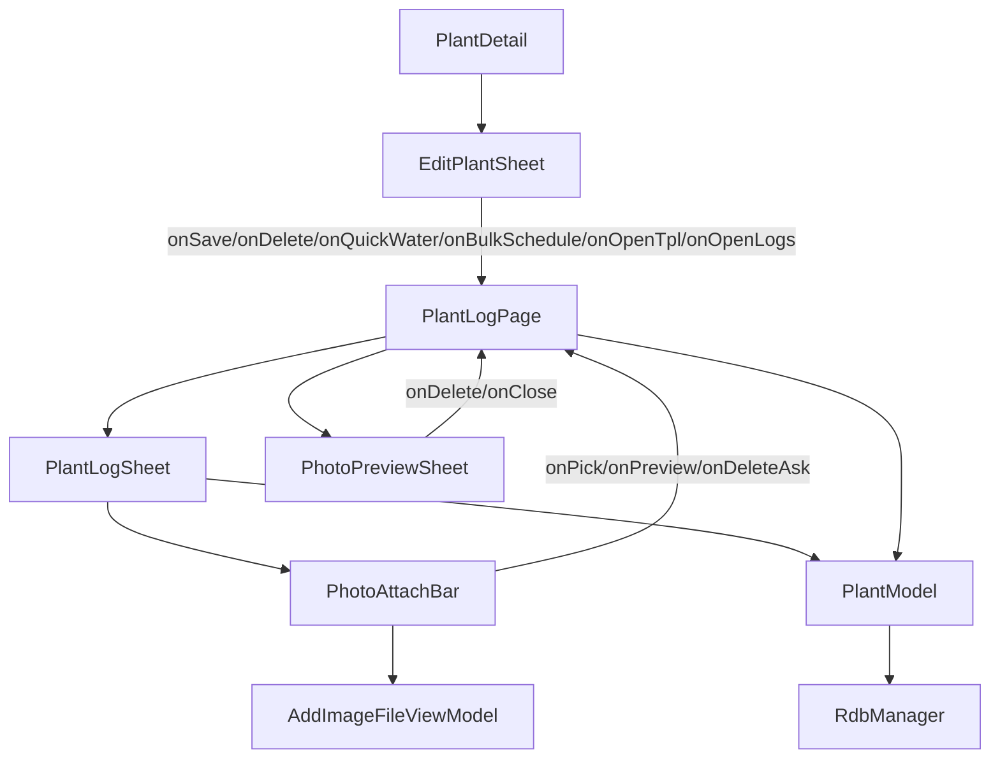
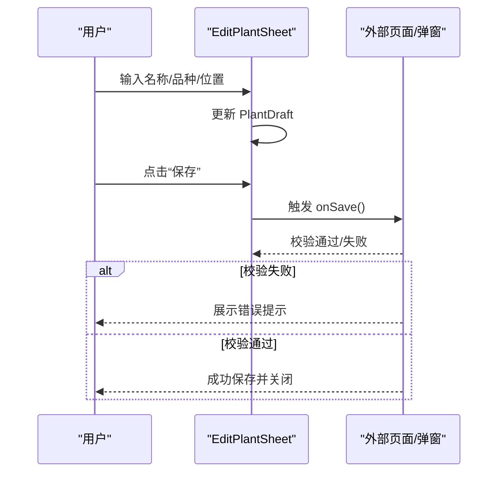
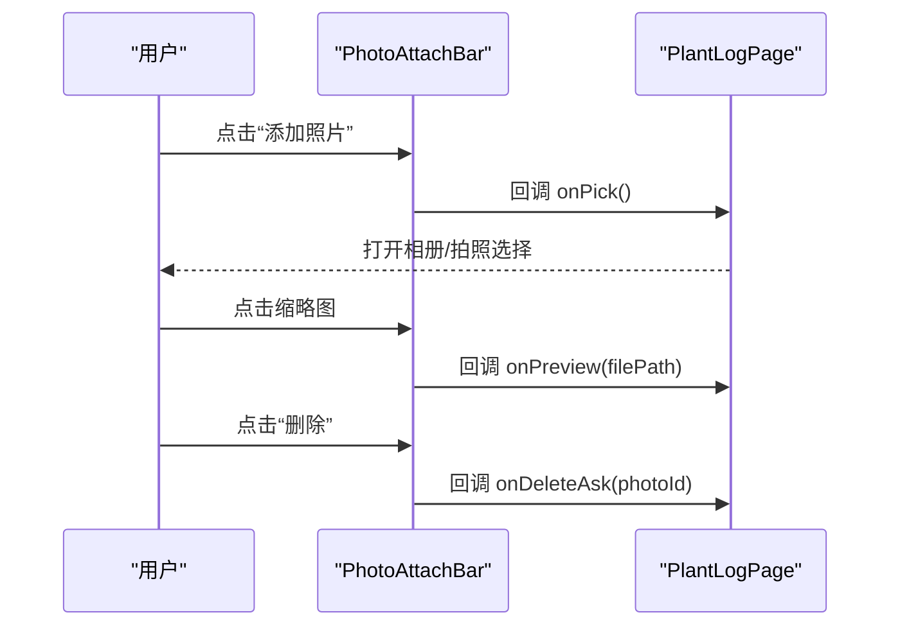
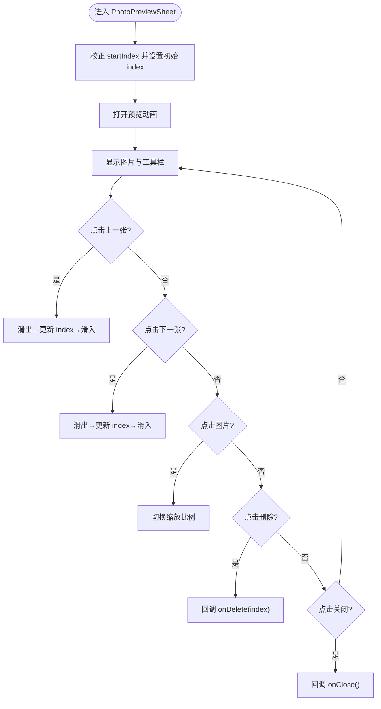
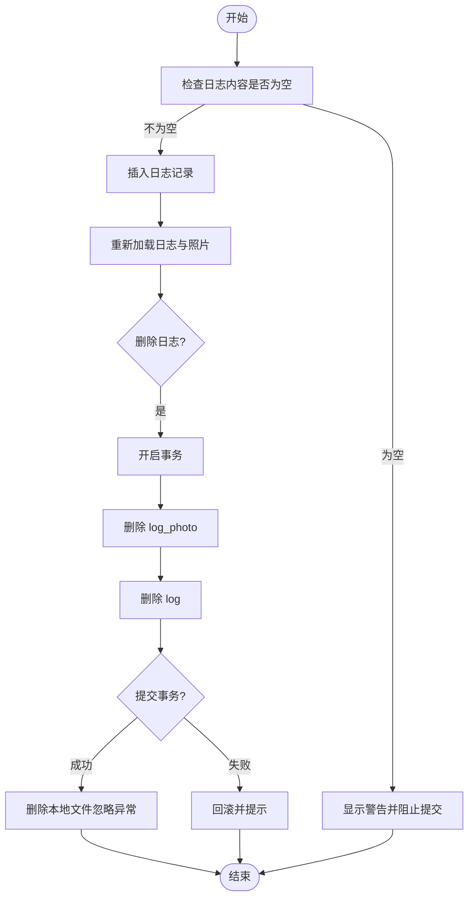
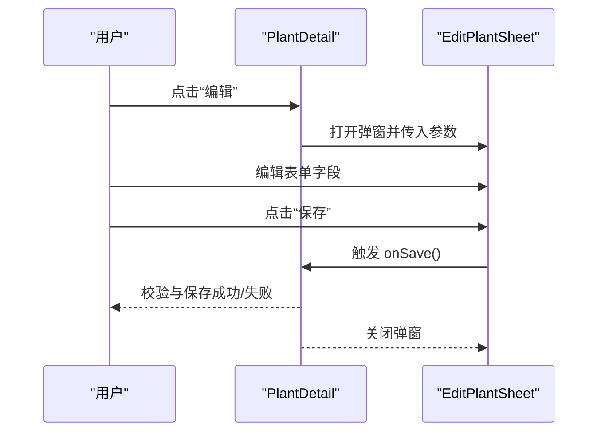
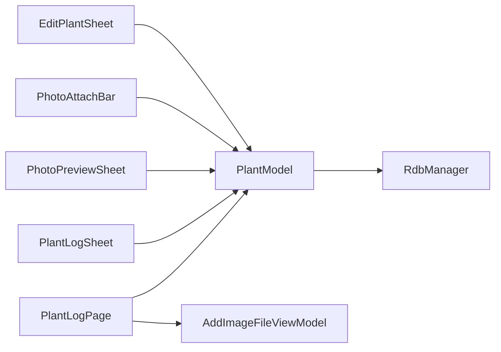

# 植物管理组件系列

<cite>
**本文档引用的文件**
- [EditPlantSheet.ets](file://entry/src/main/ets/view/EditPlantSheet.ets)
- [PhotoAttachBar.ets](file://entry/src/main/ets/view/PhotoAttachBar.ets)
- [PhotoPreviewSheet.ets](file://entry/src/main/ets/view/PhotoPreviewSheet.ets)
- [PlantDetail.ets](file://entry/src/main/ets/pages/PlantDetail.ets)
- [PlantLogPage.ets](file://entry/src/main/ets/pages/PlantLogPage.ets)
- [PlantLogSheet.ets](file://entry/src/main/ets/view/PlantLogSheet.ets)
- [PlantModel.ets](file://entry/src/main/ets/model/PlantModel.ets)
- [AddImageFileViewModel.ets](file://entry/src/main/ets/viewmodel/AddImageFileViewModel.ets)
- [RdbManager.ets](file://entry/src/main/ets/viewmodel/RdbManager.ets)
- [err.ets](file://entry/src/main/ets/viewmodel/err.ets)
</cite>

## 目录
1. [简介](#简介)
2. [项目结构](#项目结构)
3. [核心组件](#核心组件)
4. [架构总览](#架构总览)
5. [详细组件分析](#详细组件分析)
6. [依赖关系分析](#依赖关系分析)
7. [性能考虑](#性能考虑)
8. [故障排查指南](#故障排查指南)
9. [结论](#结论)
10. [附录](#附录)

## 简介
本文件面向植物管理相关组件，系统化梳理以下能力：
- EditPlantSheet：植物信息编辑与保存、删除、快速浇水、批量周期任务导入、日志入口等
- PhotoAttachBar：日志照片附加栏，支持添加、预览、删除照片
- PhotoPreviewSheet：照片全屏预览弹窗，支持左右切换、缩放、删除与关闭
- 数据验证与错误处理：日志内容非空校验、事务性删除、文件删除容错、Banner提示
- 使用示例与操作流程：在植物详情页中唤起编辑弹窗，在日志页中使用照片附加与预览

## 项目结构
围绕植物管理的组件主要分布在以下模块：
- 视图组件：EditPlantSheet、PhotoAttachBar、PhotoPreviewSheet、PlantLogSheet
- 页面：PlantDetail、PlantLogPage
- 模型：Plant、PlantDraft、LogPhoto、PlantLog 等
- 视图模型与服务：AddImageFileViewModel、RdbManager
- 错误处理与示例：err.ets

**图表来源**
- [EditPlantSheet.ets:1-264](file://entry/src/main/ets/view/EditPlantSheet.ets#L1-L264)
- [PhotoAttachBar.ets:1-100](file://entry/src/main/ets/view/PhotoAttachBar.ets#L1-L100)
- [PhotoPreviewSheet.ets:1-223](file://entry/src/main/ets/view/PhotoPreviewSheet.ets#L1-L223)
- [PlantDetail.ets:1-136](file://entry/src/main/ets/pages/PlantDetail.ets#L1-L136)
- [PlantLogPage.ets:1-1030](file://entry/src/main/ets/pages/PlantLogPage.ets#L1-L1030)
- [PlantLogSheet.ets:1-384](file://entry/src/main/ets/view/PlantLogSheet.ets#L1-L384)
- [PlantModel.ets:1-166](file://entry/src/main/ets/model/PlantModel.ets#L1-L166)
- [AddImageFileViewModel.ets:1-146](file://entry/src/main/ets/viewmodel/AddImageFileViewModel.ets#L1-L146)
- [RdbManager.ets:1-296](file://entry/src/main/ets/viewmodel/RdbManager.ets#L1-L296)

**章节来源**
- [EditPlantSheet.ets:1-264](file://entry/src/main/ets/view/EditPlantSheet.ets#L1-L264)
- [PhotoAttachBar.ets:1-100](file://entry/src/main/ets/view/PhotoAttachBar.ets#L1-L100)
- [PhotoPreviewSheet.ets:1-223](file://entry/src/main/ets/view/PhotoPreviewSheet.ets#L1-L223)
- [PlantDetail.ets:1-136](file://entry/src/main/ets/pages/PlantDetail.ets#L1-L136)
- [PlantLogPage.ets:1-1030](file://entry/src/main/ets/pages/PlantLogPage.ets#L1-L1030)
- [PlantLogSheet.ets:1-384](file://entry/src/main/ets/view/PlantLogSheet.ets#L1-L384)
- [PlantModel.ets:1-166](file://entry/src/main/ets/model/PlantModel.ets#L1-L166)
- [AddImageFileViewModel.ets:1-146](file://entry/src/main/ets/viewmodel/AddImageFileViewModel.ets#L1-L146)
- [RdbManager.ets:1-296](file://entry/src/main/ets/viewmodel/RdbManager.ets#L1-L296)

## 核心组件
- EditPlantSheet：底部抽屉式弹窗，提供植物名称、品种、位置等字段编辑，以及保存、删除、快速浇水、批量周期任务导入、日志入口等交互。
- PhotoAttachBar：横向缩略图条加“添加照片”按钮，支持点击预览与删除，回调外部事件。
- PhotoPreviewSheet：全屏照片预览，支持左右翻页、点击缩放、删除与关闭。
- PlantLogPage：植物日志页，负责日志增删改查、照片选择与存储、预览弹窗控制、Banner提示与事务性删除。

**章节来源**
- [EditPlantSheet.ets:1-264](file://entry/src/main/ets/view/EditPlantSheet.ets#L1-L264)
- [PhotoAttachBar.ets:1-100](file://entry/src/main/ets/view/PhotoAttachBar.ets#L1-L100)
- [PhotoPreviewSheet.ets:1-223](file://entry/src/main/ets/view/PhotoPreviewSheet.ets#L1-L223)
- [PlantLogPage.ets:1-1030](file://entry/src/main/ets/pages/PlantLogPage.ets#L1-L1030)

## 架构总览
植物管理组件围绕“页面-弹窗-模型-服务-数据库”展开，形成清晰的分层：
- 页面层：PlantDetail、PlantLogPage
- 弹窗层：EditPlantSheet、PhotoPreviewSheet、PlantLogSheet
- 组件层：PhotoAttachBar
- 模型层：Plant、PlantDraft、LogPhoto、PlantLog
- 服务层：AddImageFileViewModel（图片选择与落盘）、RdbManager（数据库初始化与建表）
- 错误处理：日志内容非空校验、事务性删除、文件删除容错、Banner提示

**图表来源**
- [PlantDetail.ets:1-136](file://entry/src/main/ets/pages/PlantDetail.ets#L1-L136)
- [EditPlantSheet.ets:1-264](file://entry/src/main/ets/view/EditPlantSheet.ets#L1-L264)
- [PlantLogPage.ets:1-1030](file://entry/src/main/ets/pages/PlantLogPage.ets#L1-L1030)
- [PlantLogSheet.ets:1-384](file://entry/src/main/ets/view/PlantLogSheet.ets#L1-L384)
- [PhotoAttachBar.ets:1-100](file://entry/src/main/ets/view/PhotoAttachBar.ets#L1-L100)
- [PhotoPreviewSheet.ets:1-223](file://entry/src/main/ets/view/PhotoPreviewSheet.ets#L1-L223)
- [PlantModel.ets:1-166](file://entry/src/main/ets/model/PlantModel.ets#L1-L166)
- [AddImageFileViewModel.ets:1-146](file://entry/src/main/ets/viewmodel/AddImageFileViewModel.ets#L1-L146)
- [RdbManager.ets:1-296](file://entry/src/main/ets/viewmodel/RdbManager.ets#L1-L296)

## 详细组件分析

### EditPlantSheet 组件（植物信息编辑与保存）
- 功能要点
  - 表单字段：名称、品种、位置，均通过草稿对象 PlantDraft 实时绑定
  - 交互按钮：保存（触发外部 onSave）、删除（触发 onDelete，仅在编辑模式启用）、快速浇水（触发 onQuickWater）、批量周期任务导入（触发 onBulkSchedule）
  - 周期任务快捷区：提供“每X天×Y次”的模板入口
  - 打开日志入口：预留 onOpenLogs 事件
  - 动画与键盘适配：进入时设置键盘避免模式，背景遮罩渐显
- 数据流
  - 用户在表单项输入时，直接更新 PlantDraft 的对应字段
  - 点击保存时，由外部页面/弹窗处理校验与持久化
- 错误处理
  - 组件本身不执行持久化，保存前的校验应在外部页面完成
  - 删除按钮仅在 editingId 非零时显示，避免误删

**图表来源**
- [EditPlantSheet.ets:65-106](file://entry/src/main/ets/view/EditPlantSheet.ets#L65-L106)
- [EditPlantSheet.ets:102-124](file://entry/src/main/ets/view/EditPlantSheet.ets#L102-L124)

**章节来源**
- [EditPlantSheet.ets:1-264](file://entry/src/main/ets/view/EditPlantSheet.ets#L1-L264)

### PhotoAttachBar 组件（照片附加栏）
- 功能要点
  - 展示已添加照片的缩略图，支持点击预览与删除
  - 提供“添加照片”按钮，点击回调 onPick
  - 通过 LogPhoto 数组驱动渲染，支持删除询问 onDeleteAsk
- 数据结构
  - LogPhoto：包含 id、logId、filePath、createdAt 等字段
- 交互流程
  - 点击缩略图：触发 onPreview(filePath)
  - 点击“删除”：触发 onDeleteAsk(photoId)
  - 点击“添加”：触发 onPick()

**图表来源**
- [PhotoAttachBar.ets:19-98](file://entry/src/main/ets/view/PhotoAttachBar.ets#L19-L98)

**章节来源**
- [PhotoAttachBar.ets:1-100](file://entry/src/main/ets/view/PhotoAttachBar.ets#L1-L100)

### PhotoPreviewSheet 组件（照片预览弹窗）
- 功能要点
  - 全屏显示当前索引图片，支持左右翻页与点击缩放
  - 工具栏显示当前索引/总数、删除与关闭
  - 删除时回调 onDelete(index)，关闭时回调 onClose
- 翻页与缩放算法
  - stepPrev/stepNext：先滑出再滑入，配合透明度与位移实现过渡
  - toggleZoom：在 1.0 与 1.8 间切换缩放级别
- 边界保护
  - aboutToAppear 中对 startIndex 越界进行修正

**图表来源**
- [PhotoPreviewSheet.ets:17-92](file://entry/src/main/ets/view/PhotoPreviewSheet.ets#L17-L92)
- [PhotoPreviewSheet.ets:102-221](file://entry/src/main/ets/view/PhotoPreviewSheet.ets#L102-L221)

**章节来源**
- [PhotoPreviewSheet.ets:1-223](file://entry/src/main/ets/view/PhotoPreviewSheet.ets#L1-L223)

### 植物管理组件的数据验证与错误处理机制
- 日志内容非空校验
  - 在 PlantLogPage 中，添加日志前检查 noteText 是否为空，为空则阻止提交并提示
- 事务性删除与文件删除容错
  - 删除日志与照片采用事务：先删子表（log_photo），再删主表（log）
  - 事务提交后再删除本地文件，避免数据库一致性问题
  - 文件删除失败时忽略异常，保证流程不中断
- Banner 提示
  - 通过 showBanner 统一展示操作结果（成功/警告/信息），并在一段时间后自动消失
- 图片选择与落盘
  - AddImageFileViewModel 封装选图、缩略图生成与写入分布式目录，异常时记录日志并返回空结果

**图表来源**
- [PlantLogPage.ets:66-83](file://entry/src/main/ets/pages/PlantLogPage.ets#L66-L83)
- [PlantLogPage.ets:87-137](file://entry/src/main/ets/pages/PlantLogPage.ets#L87-L137)
- [PlantLogPage.ets:1015-1023](file://entry/src/main/ets/pages/PlantLogPage.ets#L1015-L1023)
- [AddImageFileViewModel.ets:35-55](file://entry/src/main/ets/viewmodel/AddImageFileViewModel.ets#L35-L55)

**章节来源**
- [PlantLogPage.ets:1-1030](file://entry/src/main/ets/pages/PlantLogPage.ets#L1-L1030)
- [AddImageFileViewModel.ets:1-146](file://entry/src/main/ets/viewmodel/AddImageFileViewModel.ets#L1-L146)
- [err.ets:145-169](file://entry/src/main/ets/viewmodel/err.ets#L145-L169)

### 在植物详情页面中的使用示例与操作流程
- 场景目标：从植物详情页进入编辑植物信息
- 操作流程
  - 用户在 PlantDetail 中选择“编辑”
  - 页面打开 EditPlantSheet，并传入标题、草稿对象、editingId、以及 onSave/onDelete/onQuickWater/onBulkSchedule/onOpenTpl/onOpenLogs 等回调
  - 用户在弹窗中编辑名称/品种/位置，点击“保存”
  - 外部页面接收 onSave，执行校验与持久化，成功后关闭弹窗并刷新数据
- 注意事项
  - editingId 为 0 时不显示“删除”按钮，避免误删
  - 键盘避免模式在弹窗出现时自动启用，消失时恢复

**图表来源**
- [PlantDetail.ets:78-107](file://entry/src/main/ets/pages/PlantDetail.ets#L78-L107)
- [EditPlantSheet.ets:65-106](file://entry/src/main/ets/view/EditPlantSheet.ets#L65-L106)

**章节来源**
- [PlantDetail.ets:1-136](file://entry/src/main/ets/pages/PlantDetail.ets#L1-L136)
- [EditPlantSheet.ets:1-264](file://entry/src/main/ets/view/EditPlantSheet.ets#L1-L264)

## 依赖关系分析
- 组件耦合
  - EditPlantSheet 与 PlantDetail 通过回调事件解耦
  - PhotoAttachBar 与 PlantLogPage 通过事件回调解耦
  - PhotoPreviewSheet 与 PlantLogPage 通过参数 files/startIndex 解耦
- 数据模型
  - PlantDraft 用于表单编辑态，避免直接修改列表实体
  - LogPhoto 用于日志照片的展示与管理
- 服务依赖
  - AddImageFileViewModel 统一封装图片选择与落盘
  - RdbManager 负责数据库初始化、建表与索引

**图表来源**
- [EditPlantSheet.ets:1-264](file://entry/src/main/ets/view/EditPlantSheet.ets#L1-L264)
- [PhotoAttachBar.ets:1-100](file://entry/src/main/ets/view/PhotoAttachBar.ets#L1-L100)
- [PhotoPreviewSheet.ets:1-223](file://entry/src/main/ets/view/PhotoPreviewSheet.ets#L1-L223)
- [PlantLogSheet.ets:1-384](file://entry/src/main/ets/view/PlantLogSheet.ets#L1-L384)
- [PlantLogPage.ets:1-1030](file://entry/src/main/ets/pages/PlantLogPage.ets#L1-L1030)
- [PlantModel.ets:1-166](file://entry/src/main/ets/model/PlantModel.ets#L1-L166)
- [AddImageFileViewModel.ets:1-146](file://entry/src/main/ets/viewmodel/AddImageFileViewModel.ets#L1-L146)
- [RdbManager.ets:1-296](file://entry/src/main/ets/viewmodel/RdbManager.ets#L1-L296)

**章节来源**
- [PlantModel.ets:1-166](file://entry/src/main/ets/model/PlantModel.ets#L1-L166)
- [RdbManager.ets:1-296](file://entry/src/main/ets/viewmodel/RdbManager.ets#L1-L296)

## 性能考虑
- 列表渲染优化
  - PlantLogPage 中对日志列表使用 ForEach 渲染，避免不必要的重绘
- 图片处理
  - AddImageFileViewModel 将 PixelMap 转为 JPEG 并写入分布式目录，及时释放内存避免 OOM
- 动画与过渡
  - PhotoPreviewSheet 使用动画与位移实现平滑切换，提升用户体验
- 数据库访问
  - RdbManager 为常用查询建立索引，减少查询成本

**章节来源**
- [PlantLogPage.ets:547-592](file://entry/src/main/ets/pages/PlantLogPage.ets#L547-L592)
- [AddImageFileViewModel.ets:116-127](file://entry/src/main/ets/viewmodel/AddImageFileViewModel.ets#L116-L127)
- [PhotoPreviewSheet.ets:28-33](file://entry/src/main/ets/view/PhotoPreviewSheet.ets#L28-L33)
- [RdbManager.ets:134-170](file://entry/src/main/ets/viewmodel/RdbManager.ets#L134-L170)

## 故障排查指南
- 添加日志失败
  - 检查 noteText 是否为空，为空则阻止提交
  - 查看事务删除流程是否正确提交与回滚
- 删除日志与照片失败
  - 确认事务是否成功提交，文件删除异常是否被忽略
  - 检查文件路径是否存在且可访问
- 照片预览异常
  - 确认 startIndex 越界保护逻辑生效
  - 检查图片路径是否以 file:// 前缀
- 图片选择与落盘失败
  - 查看 AddImageFileViewModel 的错误日志输出
  - 确认分布式目录写入权限

**章节来源**
- [PlantLogPage.ets:522-527](file://entry/src/main/ets/pages/PlantLogPage.ets#L522-L527)
- [PlantLogPage.ets:134-136](file://entry/src/main/ets/pages/PlantLogPage.ets#L134-L136)
- [PhotoPreviewSheet.ets:18-26](file://entry/src/main/ets/view/PhotoPreviewSheet.ets#L18-L26)
- [AddImageFileViewModel.ets:52-54](file://entry/src/main/ets/viewmodel/AddImageFileViewModel.ets#L52-L54)

## 结论
植物管理组件系列通过清晰的分层设计与事件驱动的解耦方式，实现了植物信息编辑、日志与照片管理、全屏预览与删除等功能。配合事务性删除、文件落盘与索引优化，确保了数据一致性与性能表现。建议在外部页面中完善数据校验与错误提示，以进一步提升用户体验。

## 附录
- 数据模型与接口
  - Plant：植物基本信息
  - PlantDraft：编辑态草稿
  - LogPhoto：日志照片
  - PlantLog：日志条目
- 关键流程参考
  - 日志新增与刷新：[PlantLogPage.ets:66-72](file://entry/src/main/ets/pages/PlantLogPage.ets#L66-L72)
  - 事务删除日志与照片：[PlantLogPage.ets:87-137](file://entry/src/main/ets/pages/PlantLogPage.ets#L87-L137)
  - 图片选择与落盘：[AddImageFileViewModel.ets:35-55](file://entry/src/main/ets/viewmodel/AddImageFileViewModel.ets#L35-L55)
  - 数据库建表与索引：[RdbManager.ets:36-170](file://entry/src/main/ets/viewmodel/RdbManager.ets#L36-L170)