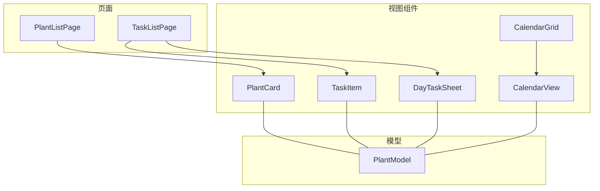
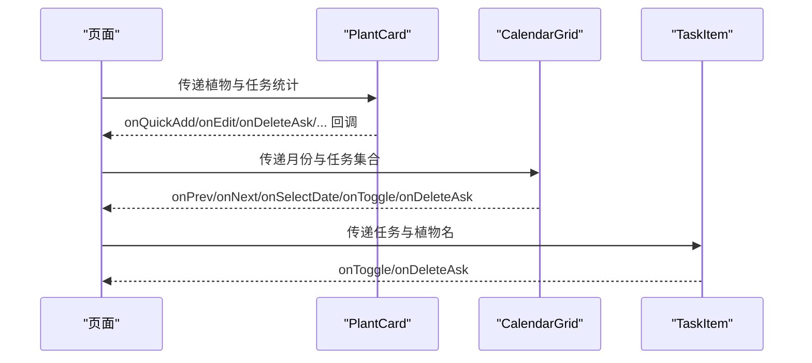
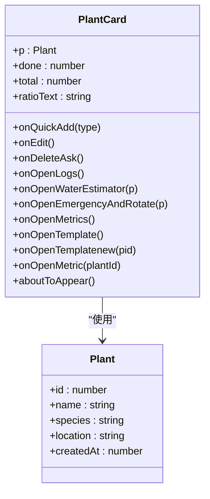
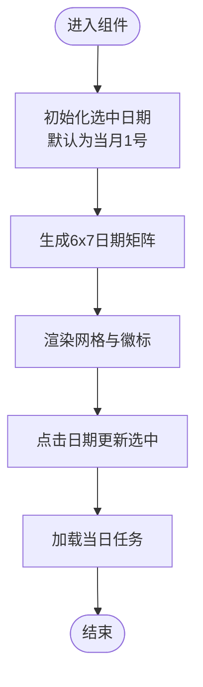
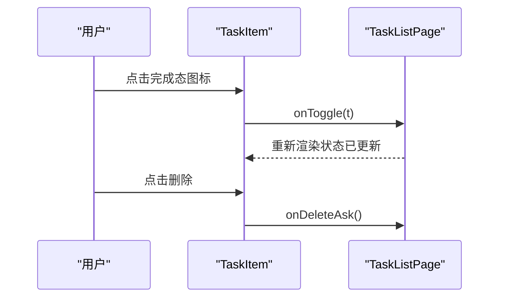
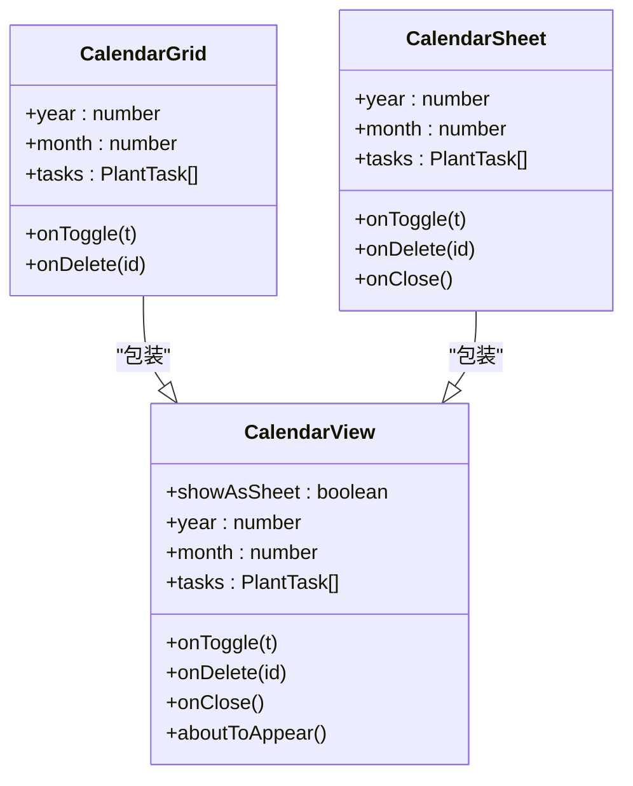
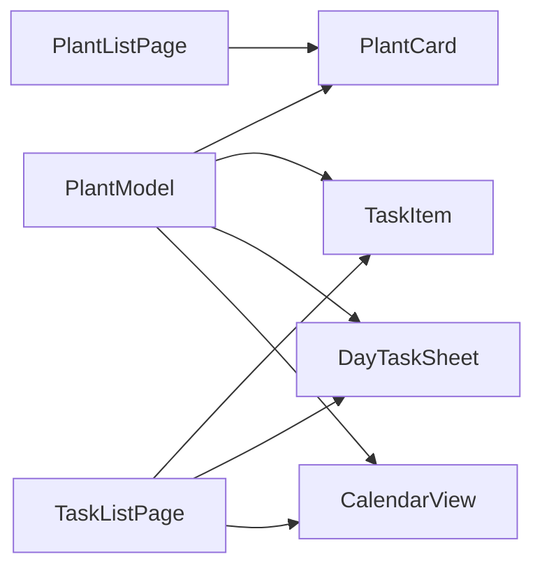

# 组件API

<cite>
**本文档引用的文件**
- [PlantCard.ets](file://entry/src/main/ets/view/PlantCard.ets)
- [CalendarGrid.ets](file://entry/src/main/ets/view/CalendarGrid.ets)
- [TaskItem.ets](file://entry/src/main/ets/view/TaskItem.ets)
- [CalendarView.ets](file://entry/src/main/ets/view/CalendarView.ets)
- [DayTaskSheet.ets](file://entry/src/main/ets/view/DayTaskSheet.ets)
- [PlantListPage.ets](file://entry/src/main/ets/pages/PlantListPage.ets)
- [TaskListPage.ets](file://entry/src/main/ets/pages/TaskListPage.ets)
- [PlantModel.ets](file://entry/src/main/ets/model/PlantModel.ets)
- [PlantLogSheet.ets](file://entry/src/main/ets/view/PlantLogSheet.ets)
- [LogRowItem.ets](file://entry/src/main/ets/view/LogRowItem.ets)
- [ConfirmDialogSheet.ets](file://entry/src/main/ets/view/ConfirmDialogSheet.ets)
- [EditPlantSheet.ets](file://entry/src/main/ets/view/EditPlantSheet.ets)
</cite>

## 目录
1. [简介](#简介)
2. [项目结构](#项目结构)
3. [核心组件](#核心组件)
4. [架构总览](#架构总览)
5. [详细组件分析](#详细组件分析)
6. [依赖关系分析](#依赖关系分析)
7. [性能考量](#性能考量)
8. [故障排查指南](#故障排查指南)
9. [结论](#结论)
10. [附录](#附录)

## 简介
本文件为“植物日记”项目UI组件API文档，聚焦于PlantCard植物卡片、CalendarGrid日历网格、TaskItem任务项等核心UI组件。文档涵盖：
- 组件属性（@Param/@Require）、事件回调（@Event）与生命周期（aboutToAppear）
- 样式定制要点与交互行为说明
- 组件嵌套与组合设计原则
- 使用示例、最佳实践与性能优化建议

## 项目结构
- 组件位于 entry/src/main/ets/view 与 entry/src/main/ets/pages
- 数据模型位于 entry/src/main/ets/model
- 页面通过组合组件实现复杂交互，组件间通过事件回调解耦

图表来源
- [PlantListPage.ets:157-178](file://entry/src/main/ets/pages/PlantListPage.ets#L157-L178)
- [TaskListPage.ets:218-227](file://entry/src/main/ets/pages/TaskListPage.ets#L218-L227)
- [CalendarGrid.ets:1-351](file://entry/src/main/ets/view/CalendarGrid.ets#L1-L351)
- [CalendarView.ets:512-565](file://entry/src/main/ets/view/CalendarView.ets#L512-L565)
- [PlantModel.ets:1-166](file://entry/src/main/ets/model/PlantModel.ets#L1-L166)

章节来源
- [PlantListPage.ets:116-197](file://entry/src/main/ets/pages/PlantListPage.ets#L116-L197)
- [TaskListPage.ets:164-337](file://entry/src/main/ets/pages/TaskListPage.ets#L164-L337)

## 核心组件
本节概述三大核心组件的职责与能力边界。

- PlantCard：植物概览卡片，聚合多项功能入口，支持进度展示、快捷任务创建、光照呼吸效果等。
- CalendarGrid：月历网格，支持任务徽标统计、选日查看当日任务、切换月份等。
- TaskItem：单条任务项，负责展示与交互回调，状态变更以父层刷新为准。

章节来源
- [PlantCard.ets:6-326](file://entry/src/main/ets/view/PlantCard.ets#L6-L326)
- [CalendarGrid.ets:3-351](file://entry/src/main/ets/view/CalendarGrid.ets#L3-L351)
- [TaskItem.ets:4-67](file://entry/src/main/ets/view/TaskItem.ets#L4-L67)

## 架构总览
组件采用“页面组合组件”的架构，页面负责筛选、排序、状态管理与事件编排，组件仅负责展示与交互回调，降低耦合度，提升可测试性与可维护性。

图表来源
- [PlantListPage.ets:157-178](file://entry/src/main/ets/pages/PlantListPage.ets#L157-L178)
- [TaskListPage.ets:218-227](file://entry/src/main/ets/pages/TaskListPage.ets#L218-L227)
- [CalendarGrid.ets:9-13](file://entry/src/main/ets/view/CalendarGrid.ets#L9-L13)

## 详细组件分析

### PlantCard 植物卡片
- 组件定位
  - 植物概览与功能入口聚合，展示封面图/首字头像、光照状态、任务进度与快捷操作。
- 关键属性（@Param/@Require）
  - p: 植物对象（Plant）
  - done: 已完成任务数
  - total: 总任务数
  - ratioText: 完成率文本
- 事件回调（@Event）
  - onQuickAdd(type: string): 快捷创建今日任务
  - onEdit(): 编辑植物
  - onDeleteAsk(): 删除植物（触发确认）
  - onOpenLogs(): 打开日志页
  - onOpenWaterEstimator(p: Plant): 打开水估器
  - onOpenEmergencyAndRotate(p: Plant): 打开应急/转盆
  - onOpenMetrics(): 打开指标页
  - onOpenTemplate(): 打开模板页
  - onOpenTemplatenew(pid: number): 打开新模板页
  - onOpenMetric(plantId: number): 打开指标详情
- 生命周期
  - aboutToAppear(): 加载日志与照片，检查光照状态并启动呼吸动画
- 样式与交互要点
  - 封面优先使用日志照片，无照片时使用首字头像
  - 光照中状态以边框、阴影与呼吸动画呈现
  - 快捷按钮与功能入口均带有按压反馈与过渡动画
- 嵌套与组合
  - 作为列表项被 PlantListPage 组合使用，父页负责计算完成率与事件转发
- 使用示例（路径参考）
  - [PlantListPage 组合 PlantCard:157-178](file://entry/src/main/ets/pages/PlantListPage.ets#L157-L178)
- 最佳实践
  - 完成率与任务统计在父页集中计算，避免子组件重复查询
  - 光照状态通过 AppStorage 广播，确保页面切换后状态一致
- 性能优化建议
  - 日志与照片查询使用一次性 SQL，避免多次 IO
  - 动画采用最小化更新，仅在光照状态变化时启动

章节来源
- [PlantCard.ets:6-326](file://entry/src/main/ets/view/PlantCard.ets#L6-L326)
- [PlantListPage.ets:27-63](file://entry/src/main/ets/pages/PlantListPage.ets#L27-L63)

#### PlantCard 类图

图表来源
- [PlantCard.ets:8-23](file://entry/src/main/ets/view/PlantCard.ets#L8-L23)
- [PlantModel.ets:6-21](file://entry/src/main/ets/model/PlantModel.ets#L6-L21)

### CalendarGrid 日历网格
- 组件定位
  - 月历网格，支持任务徽标统计、选日查看当日任务、切换月份
- 关键属性（@Param/@Require）
  - monthISO: 月份字符串（YYYY-MM）
  - tasks: 任务数组（PlantTask）
  - plants: 植物数组（Plant）
  - allItems: 用于徽标统计的全量任务
  - filterStatus: 筛选状态（0/1/2）
  - filterType: 任务类型过滤
- 事件回调（@Event）
  - onPrev()/onNext(): 切换月份
  - onToggle(t: PlantTask): 切换任务完成状态
  - onDeleteAsk(taskId: number): 删除任务（触发确认）
  - onSelectDate(iso: string): 选中日期
- 生命周期
  - aboutToAppear(): 默认高亮当月1号，保证“当日任务”区稳定选中
- 核心算法
  - 生成 6x7 日期矩阵，空白位用 0 占位
  - 徽标颜色根据“完成数/总数”映射（全未完成/全完成/部分完成）
- 使用示例（路径参考）
  - [TaskListPage 组合 CalendarGrid:249-269](file://entry/src/main/ets/pages/TaskListPage.ets#L249-L269)
- 最佳实践
  - allItems 与 filter* 参数由父页统一维护，保证统计与筛选一致性
  - 选中日期变更时同步更新“当日任务”列表
- 性能优化建议
  - 日期矩阵与徽标统计在非 @Builder 方法中计算，避免重复渲染时的计算开销

章节来源
- [CalendarGrid.ets:3-351](file://entry/src/main/ets/view/CalendarGrid.ets#L3-L351)
- [TaskListPage.ets:247-269](file://entry/src/main/ets/pages/TaskListPage.ets#L247-L269)

#### CalendarGrid 流程图

图表来源
- [CalendarGrid.ets:19-30](file://entry/src/main/ets/view/CalendarGrid.ets#L19-L30)
- [CalendarGrid.ets:88-109](file://entry/src/main/ets/view/CalendarGrid.ets#L88-L109)
- [CalendarGrid.ets:302-349](file://entry/src/main/ets/view/CalendarGrid.ets#L302-L349)

### TaskItem 任务项
- 组件定位
  - 单条任务展示与交互，状态变更以父层刷新为准
- 关键属性（@Param/@Require）
  - t: 任务对象（PlantTask）
  - plantName: 植物名称
- 事件回调（@Event）
  - onToggle(pt: PlantTask): 切换完成状态
  - onDeleteAsk(): 删除任务（触发确认）
- 生命周期
  - aboutToAppear(): 输出调试信息（性能分析）
- 交互与样式
  - 完成态带删除线与透明度变化
  - 支持按压反馈与过渡动画
- 使用示例（路径参考）
  - [TaskListPage 组合 TaskItem:218-227](file://entry/src/main/ets/pages/TaskListPage.ets#L218-L227)
- 最佳实践
  - 本地切换仅用于即时反馈，最终状态以父层重载为准
  - 任务类型与植物名由父页提供，减少子组件查询
- 性能优化建议
  - 避免在 @Builder 中进行复杂计算，保持渲染层简洁

章节来源
- [TaskItem.ets:4-67](file://entry/src/main/ets/view/TaskItem.ets#L4-L67)
- [TaskListPage.ets:215-245](file://entry/src/main/ets/pages/TaskListPage.ets#L215-L245)

#### TaskItem 交互序列图

图表来源
- [TaskItem.ets:17-65](file://entry/src/main/ets/view/TaskItem.ets#L17-L65)
- [TaskListPage.ets:218-227](file://entry/src/main/ets/pages/TaskListPage.ets#L218-L227)

### CalendarView 与 CalendarGrid/CalendarSheet
- 组件定位
  - CalendarView 提供通用日历视图（两种模式：抽屉/内嵌），CalendarGrid/CalendarSheet 是其包装
- 关键属性（@Param）
  - showAsSheet: 是否以抽屉模式展示
  - year/month: 年/月
  - tasks: 任务数组
- 事件回调（@Event）
  - onToggle(t: PlantTask)/onDelete(id: number)/onClose(): 任务切换、删除与关闭
- 生命周期
  - aboutToAppear(): 初始化年月与选中日期
- 核心能力
  - 6x7 网格构建、指示点、类型筛选、当日清单
  - 抽屉模式带蒙层与动画
- 使用示例（路径参考）
  - [CalendarGrid 包装 CalendarView:512-536](file://entry/src/main/ets/view/CalendarView.ets#L512-L536)
  - [CalendarSheet 包装 CalendarView:538-565](file://entry/src/main/ets/view/CalendarView.ets#L538-L565)

章节来源
- [CalendarView.ets:5-511](file://entry/src/main/ets/view/CalendarView.ets#L5-L511)
- [CalendarView.ets:512-565](file://entry/src/main/ets/view/CalendarView.ets#L512-L565)

#### CalendarView 类图

图表来源
- [CalendarView.ets:5-511](file://entry/src/main/ets/view/CalendarView.ets#L5-L511)
- [CalendarView.ets:512-565](file://entry/src/main/ets/view/CalendarView.ets#L512-L565)

### DayTaskSheet 当日任务抽屉
- 组件定位
  - 抽屉式展示当日任务，支持植物筛选、快捷创建任务、删除确认
- 关键属性（@Param/@Require）
  - dateISO: 日期（YYYY-MM-DD）
  - tasks: 当日任务数组
  - plants: 植物数组
- 事件回调（@Event）
  - onToggle(t: PlantTask)/onDeleteAsk(taskId: number)/onQuickAdd(plantId,type,dateISO)/onClose()
- 生命周期
  - aboutToAppear(): 默认选中当日任务的第一个植物
- 交互与样式
  - 植物选择、快捷任务（浇水/施肥/修剪）、任务列表与删除
- 使用示例（路径参考）
  - [TaskListPage 组合 DayTaskSheet:316-334](file://entry/src/main/ets/pages/TaskListPage.ets#L316-L334)

章节来源
- [DayTaskSheet.ets:3-228](file://entry/src/main/ets/view/DayTaskSheet.ets#L3-L228)
- [TaskListPage.ets:316-334](file://entry/src/main/ets/pages/TaskListPage.ets#L316-L334)

## 依赖关系分析
- 组件依赖 PlantModel（Plant/PlantTask 等）
- 页面通过事件回调与父层解耦，组件仅负责展示与交互
- 日志相关组件（PlantLogSheet、LogRowItem）与日志页配合使用

图表来源
- [PlantModel.ets:6-106](file://entry/src/main/ets/model/PlantModel.ets#L6-L106)
- [PlantListPage.ets:1-228](file://entry/src/main/ets/pages/PlantListPage.ets#L1-L228)
- [TaskListPage.ets:1-463](file://entry/src/main/ets/pages/TaskListPage.ets#L1-L463)

章节来源
- [PlantModel.ets:1-166](file://entry/src/main/ets/model/PlantModel.ets#L1-L166)
- [PlantListPage.ets:1-228](file://entry/src/main/ets/pages/PlantListPage.ets#L1-L228)
- [TaskListPage.ets:1-463](file://entry/src/main/ets/pages/TaskListPage.ets#L1-L463)

## 性能考量
- 避免在 @Builder 中执行循环与复杂计算，将计算逻辑下沉至非 @Builder 方法
- 组件间状态尽量由父层集中管理，减少重复查询与渲染
- 对高频交互（如触摸反馈、动画）采用最小化更新策略
- 日志与照片查询使用一次性 SQL，避免多次 IO

## 故障排查指南
- PlantCard 光照呼吸效果不生效
  - 检查 AppStorage 中是否存在对应 lighting_{id} 键值
  - 确认补光状态广播是否正确下发
- CalendarGrid 徽标颜色异常
  - 核对 filterStatus 与 filterType 是否与 allItems 一致
  - 确认 doneByDate 与 totalByDate 的统计逻辑
- TaskItem 本地切换无效
  - 确认父层 onToggle 回调是否正确处理并重载数据
- 日志页图片预览/删除异常
  - 检查 PlantLogSheet 与 LogRowItem 的事件回传链路
  - 确认图片路径与缩略图路径配置

章节来源
- [PlantCard.ets:42-47](file://entry/src/main/ets/view/PlantCard.ets#L42-L47)
- [CalendarGrid.ets:32-43](file://entry/src/main/ets/view/CalendarGrid.ets#L32-L43)
- [TaskItem.ets:13-15](file://entry/src/main/ets/view/TaskItem.ets#L13-L15)
- [PlantLogSheet.ets:61-63](file://entry/src/main/ets/view/PlantLogSheet.ets#L61-L63)
- [LogRowItem.ets:20-27](file://entry/src/main/ets/view/LogRowItem.ets#L20-L27)

## 结论
PlantCard、CalendarGrid、TaskItem 等组件通过清晰的属性与事件契约，配合页面的筛选与状态管理，实现了高效、可维护的UI体系。遵循“组件轻量化、页面强聚合”的设计原则，可在保证交互体验的同时获得良好的性能与扩展性。

## 附录
- 弹窗与表单组件（参考）
  - ConfirmDialogSheet：确认对话框，支持取消/确认回调与按压反馈
  - EditPlantSheet：植物编辑/新建抽屉，支持批量周期任务与快捷操作
- 日志组件（参考）
  - PlantLogSheet：日志弹窗，支持新增、排序、多选与图片预览
  - LogRowItem：单条日志展示，支持高亮与附件网格

章节来源
- [ConfirmDialogSheet.ets:1-103](file://entry/src/main/ets/view/ConfirmDialogSheet.ets#L1-L103)
- [EditPlantSheet.ets:1-264](file://entry/src/main/ets/view/EditPlantSheet.ets#L1-L264)
- [PlantLogSheet.ets:1-384](file://entry/src/main/ets/view/PlantLogSheet.ets#L1-L384)
- [LogRowItem.ets:1-272](file://entry/src/main/ets/view/LogRowItem.ets#L1-L272)