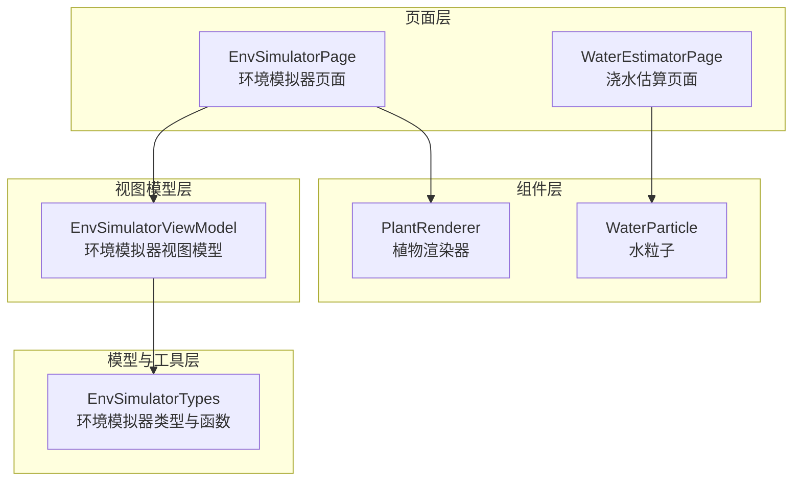
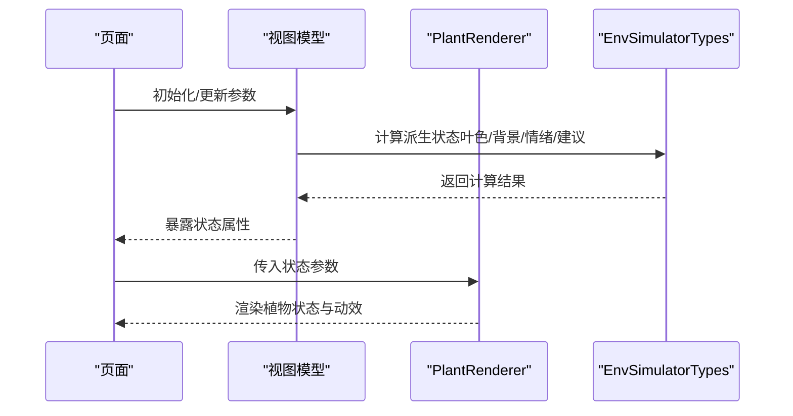
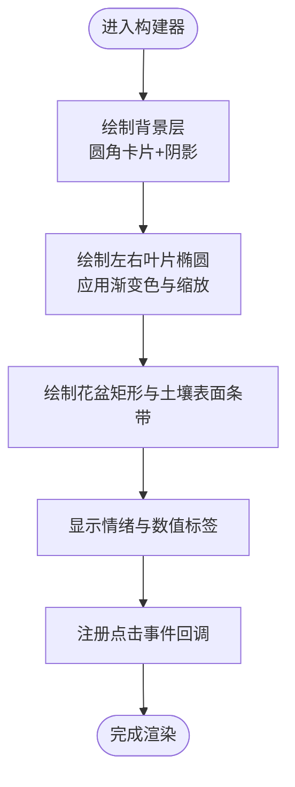
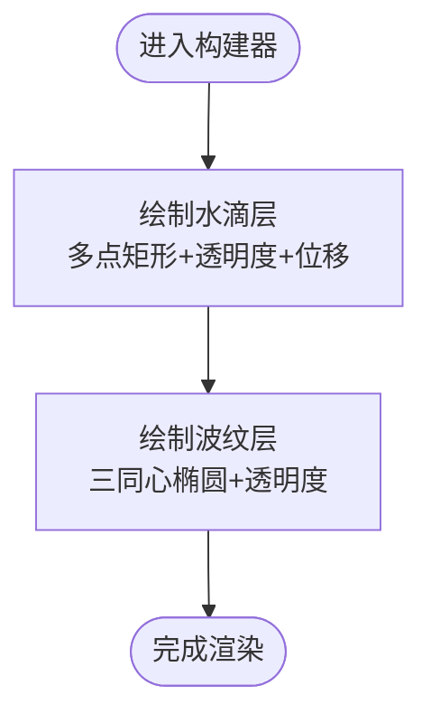
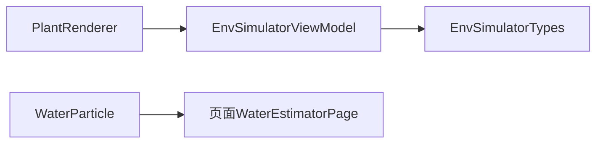

# 自定义基础组件

<cite>
**本文引用的文件**
- [PlantRenderer.ets](file://entry/src/main/ets/component/PlantRenderer.ets)
- [WaterParticle.ets](file://entry/src/main/ets/component/WaterParticle.ets)
- [EnvSimulatorPage.ets](file://entry/src/main/ets/pages/EnvSimulatorPage.ets)
- [EnvSimulatorViewModel.ets](file://entry/src/main/ets/viewmodel/EnvSimulatorViewModel.ets)
- [EnvSimulatorTypes.ets](file://entry/src/main/ets/model/EnvSimulatorTypes.ets)
- [WaterEstimatorPage.ets](file://entry/src/main/ets/pages/WaterEstimatorPage.ets)
</cite>

## 目录
1. [简介](#简介)
2. [项目结构](#项目结构)
3. [核心组件](#核心组件)
4. [架构总览](#架构总览)
5. [详细组件分析](#详细组件分析)
6. [依赖关系分析](#依赖关系分析)
7. [性能考虑](#性能考虑)
8. [故障排查指南](#故障排查指南)
9. [结论](#结论)
10. [附录](#附录)

## 简介
本文件面向自定义基础组件的API文档与使用说明，聚焦两类组件：
- PlantRenderer 植物渲染器：以ArkUI基础组件组合的方式，将光照、土壤湿度、空气湿度等环境参数转化为可视化的植物状态与简单动效，强调表现力与可交互性。
- WaterParticle 水粒子：以简单元素模拟水滴粒子与波纹扩散效果，用于浇水等交互的视觉反馈。

文档将从参数配置、生命周期方法、渲染与动画逻辑、性能优化、扩展与集成模式、以及创意应用等方面进行系统阐述，并提供在应用中的使用示例与最佳实践。

## 项目结构
本项目采用按功能域划分的组织方式，组件位于 component 目录，页面位于 pages 目录，视图模型位于 viewmodel 目录，领域模型与工具位于 model 目录。PlantRenderer 与 WaterParticle 作为基础组件，分别在 EnvSimulatorPage 与 WaterEstimatorPage 中得到应用。

图表来源
- [EnvSimulatorPage.ets:1-123](file://entry/src/main/ets/pages/EnvSimulatorPage.ets#L1-L123)
- [EnvSimulatorViewModel.ets:1-108](file://entry/src/main/ets/viewmodel/EnvSimulatorViewModel.ets#L1-L108)
- [EnvSimulatorTypes.ets:1-96](file://entry/src/main/ets/model/EnvSimulatorTypes.ets#L1-L96)
- [PlantRenderer.ets:1-169](file://entry/src/main/ets/component/PlantRenderer.ets#L1-L169)
- [WaterParticle.ets:1-61](file://entry/src/main/ets/component/WaterParticle.ets#L1-L61)

章节来源
- [EnvSimulatorPage.ets:1-123](file://entry/src/main/ets/pages/EnvSimulatorPage.ets#L1-L123)
- [EnvSimulatorViewModel.ets:1-108](file://entry/src/main/ets/viewmodel/EnvSimulatorViewModel.ets#L1-L108)
- [EnvSimulatorTypes.ets:1-96](file://entry/src/main/ets/model/EnvSimulatorTypes.ets#L1-L96)
- [PlantRenderer.ets:1-169](file://entry/src/main/ets/component/PlantRenderer.ets#L1-L169)
- [WaterParticle.ets:1-61](file://entry/src/main/ets/component/WaterParticle.ets#L1-L61)

## 核心组件
- PlantRenderer：接收光照、土壤湿度、空气湿度、叶色基调、背景基调、情绪标签、是否动画、点击回调等参数；在构建器中以堆叠层与列布局组合椭圆、矩形等基础形状，配合阴影、圆角与透明度，形成植物与花盆的矢量化呈现；通过叶色渐变与缩放比例反映土壤状况，通过背景色与表情文字反映整体状态。
- WaterParticle：接收强度（1..3）、是否动画、动画结束回调等参数；在构建器中以列布局模拟多点水滴与三同心波纹，通过透明度与尺寸随强度变化，实现不同浇水量的视觉差异；动画由页面侧统一触发，组件仅负责表现层。

章节来源
- [PlantRenderer.ets:7-101](file://entry/src/main/ets/component/PlantRenderer.ets#L7-L101)
- [WaterParticle.ets:4-41](file://entry/src/main/ets/component/WaterParticle.ets#L4-L41)

## 架构总览
PlantRenderer 与 WaterParticle 作为纯组件，遵循“数据由上层提供、表现由组件承担”的原则。在 EnvSimulatorPage 中，EnvSimulatorViewModel 负责维护环境参数与派生状态（叶色、背景、情绪、建议），PlantRenderer 仅消费这些状态并渲染；WaterParticle 则在 WaterEstimatorPage 的交互中作为视觉反馈出现。

图表来源
- [EnvSimulatorPage.ets:44-53](file://entry/src/main/ets/pages/EnvSimulatorPage.ets#L44-L53)
- [EnvSimulatorViewModel.ets:47-62](file://entry/src/main/ets/viewmodel/EnvSimulatorViewModel.ets#L47-L62)
- [EnvSimulatorTypes.ets:22-81](file://entry/src/main/ets/model/EnvSimulatorTypes.ets#L22-L81)
- [PlantRenderer.ets:23-101](file://entry/src/main/ets/component/PlantRenderer.ets#L23-L101)

## 详细组件分析

### PlantRenderer 植物渲染器
- 参数配置
  - light：光照强度（0..100），影响背景色调与植物情绪。
  - soil：土壤湿度（0..100），影响叶片缩放与土壤表面颜色。
  - humidity：空气湿度（0..100），参与背景色调计算。
  - leafTone：叶色基调（十六进制颜色字符串）。
  - backgroundTone：背景基调（颜色字符串）。
  - mood：情绪标签（文本或表情），综合光照、土壤、湿度得出。
  - isAnimating：是否处于动画阶段，用于禁用部分交互或统一动效。
  - onTap：点击回调，用于与上层交互。
- 生命周期与渲染逻辑
  - 构建器中以 Stack 作为根容器，内含背景层与植物/花盆层；植物层包含左右两片叶子椭圆、花盆矩形与土壤表面条带；底部显示情绪与数值标签。
  - 叶色渐变：左叶稍暗、右叶稍亮，通过颜色明暗调整函数实现。
  - 土壤表面颜色：随湿度升高而加深，使用工具函数转换为近似棕色的十六进制颜色。
  - 叶片缩放：根据土壤湿度阈值设置不同缩放比例，低湿度时下垂，高湿度时略微上扬。
  - 背景与阴影：背景圆角卡片带阴影，增强层次感；背景色由背景基调与光照共同决定。
- 动画与交互
  - isAnimating 由上层控制，组件不直接执行动画，但可通过参数变化驱动样式变化。
  - 点击事件通过 onTap 回调暴露，便于上层触发进一步操作。
- 性能优化要点
  - 使用基础形状与纯色填充，避免外部资源加载。
  - 颜色计算与缩放逻辑均为纯函数，避免重复计算可在上层缓存。
  - 透明度与阴影数量有限，适合高频刷新场景。

图表来源
- [PlantRenderer.ets:23-101](file://entry/src/main/ets/component/PlantRenderer.ets#L23-L101)

章节来源
- [PlantRenderer.ets:7-101](file://entry/src/main/ets/component/PlantRenderer.ets#L7-L101)
- [PlantRenderer.ets:103-153](file://entry/src/main/ets/component/PlantRenderer.ets#L103-L153)

### WaterParticle 水粒子
- 参数配置
  - intensity：强度等级（1=浅浇，2=中，3=深），影响水滴与波纹尺寸与透明度。
  - isAnimating：是否处于动画阶段，通常由页面侧统一控制。
  - onAnimationEnd：动画结束回调，用于页面侧清理或继续后续流程。
- 渲染与视觉效果
  - 水滴层：使用一组小矩形模拟水滴，通过透明度与微位移营造下落感；实际动画由页面侧整组 translate 触发。
  - 波纹层：三同心椭圆，尺寸与透明度随强度递减，模拟水波扩散。
- 动画与生命周期
  - 组件本身不持有动画状态，仅根据参数与强度函数输出静态表现；动画由上层页面通过统一的 animateTo 或过渡控制。
- 性能优化要点
  - 使用简单几何与固定透明度函数，开销极低。
  - 通过强度参数控制渲染元素数量与尺寸，避免过度绘制。

图表来源
- [WaterParticle.ets:12-41](file://entry/src/main/ets/component/WaterParticle.ets#L12-L41)

章节来源
- [WaterParticle.ets:4-41](file://entry/src/main/ets/component/WaterParticle.ets#L4-L41)
- [WaterParticle.ets:43-59](file://entry/src/main/ets/component/WaterParticle.ets#L43-L59)

## 依赖关系分析
- PlantRenderer 依赖 EnvSimulatorViewModel 提供的派生状态（叶色、背景、情绪、建议），并通过 EnvSimulatorTypes 的纯函数计算派生值。
- WaterParticle 与页面交互紧密，通常由页面侧统一触发动画与生命周期管理。
- 两者均不依赖外部图片资源，完全基于ArkUI基础组件与颜色计算实现。

图表来源
- [EnvSimulatorPage.ets:44-53](file://entry/src/main/ets/pages/EnvSimulatorPage.ets#L44-L53)
- [EnvSimulatorViewModel.ets:47-62](file://entry/src/main/ets/viewmodel/EnvSimulatorViewModel.ets#L47-L62)
- [EnvSimulatorTypes.ets:22-81](file://entry/src/main/ets/model/EnvSimulatorTypes.ets#L22-L81)
- [WaterEstimatorPage.ets:1-490](file://entry/src/main/ets/pages/WaterEstimatorPage.ets#L1-L490)

章节来源
- [EnvSimulatorPage.ets:1-123](file://entry/src/main/ets/pages/EnvSimulatorPage.ets#L1-L123)
- [EnvSimulatorViewModel.ets:1-108](file://entry/src/main/ets/viewmodel/EnvSimulatorViewModel.ets#L1-L108)
- [EnvSimulatorTypes.ets:1-96](file://entry/src/main/ets/model/EnvSimulatorTypes.ets#L1-L96)
- [WaterEstimatorPage.ets:1-490](file://entry/src/main/ets/pages/WaterEstimatorPage.ets#L1-L490)

## 性能考虑
- 使用基础形状与纯色填充，避免解码与渲染外部纹理。
- 颜色与尺寸计算为纯函数，建议在上层缓存中间结果，减少重复计算。
- 控制动画规模与频率，避免在同一帧内大量组件同时触发动画。
- 合理使用阴影与透明度，确保在低端设备上的流畅度。

## 故障排查指南
- 颜色异常或溢出：检查颜色明暗调整函数与十六进制转换函数边界处理，确保数值在合法范围内。
- 叶片缩放不符合预期：确认土壤湿度阈值与缩放比例映射逻辑，必要时在上层进行参数修正。
- 动画未生效：确认 isAnimating 与页面侧动画控制一致，且组件参数变化能正确驱动样式更新。
- 水粒子不显示：检查强度参数与透明度函数，确认页面侧动画是否正确触发。

章节来源
- [PlantRenderer.ets:137-153](file://entry/src/main/ets/component/PlantRenderer.ets#L137-L153)
- [PlantRenderer.ets:122-134](file://entry/src/main/ets/component/PlantRenderer.ets#L122-L134)
- [WaterParticle.ets:43-59](file://entry/src/main/ets/component/WaterParticle.ets#L43-L59)

## 结论
PlantRenderer 与 WaterParticle 以简洁的ArkUI组合实现了高表现力的可视化与交互反馈。PlantRenderer 将环境参数转化为直观的植物状态，WaterParticle 则提供了轻量级的水浇灌视觉效果。二者均可在不引入外部资源的前提下实现流畅渲染，并通过参数化与纯函数计算实现良好的可扩展性与可维护性。

## 附录

### 使用示例与集成模式
- 在环境模拟器页面中，EnvSimulatorViewModel 负责维护光照、土壤湿度、空气湿度等参数，并计算派生状态（叶色、背景、情绪、建议）。页面将这些状态传递给 PlantRenderer，从而实现实时渲染与交互。
- 在浇水估算页面中，WaterParticle 可作为视觉反馈组件，在用户确认浇水动作后触发动画，提升交互体验。

章节来源
- [EnvSimulatorPage.ets:44-53](file://entry/src/main/ets/pages/EnvSimulatorPage.ets#L44-L53)
- [EnvSimulatorViewModel.ets:47-62](file://entry/src/main/ets/viewmodel/EnvSimulatorViewModel.ets#L47-L62)
- [WaterEstimatorPage.ets:1-490](file://entry/src/main/ets/pages/WaterEstimatorPage.ets#L1-L490)

### 扩展与集成建议
- 可在 PlantRenderer 外围封装一个“植物状态卡”组件，统一处理点击、长按、分享等交互，并复用其渲染逻辑。
- 可为 WaterParticle 增加更多强度等级与粒子数量，结合页面侧动画库实现更丰富的水花飞溅效果。
- 可将 EnvSimulatorTypes 中的颜色与情绪函数抽取为可配置策略，便于在不同主题或场景下灵活切换。