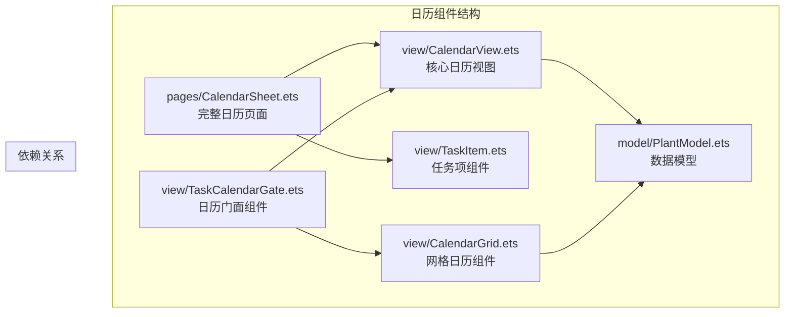
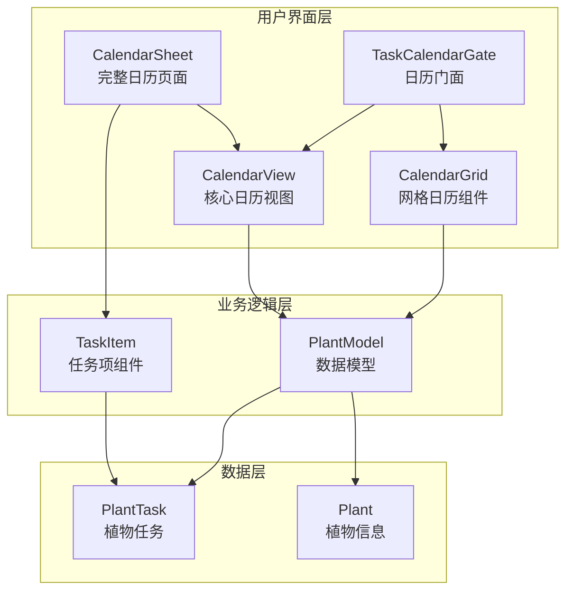
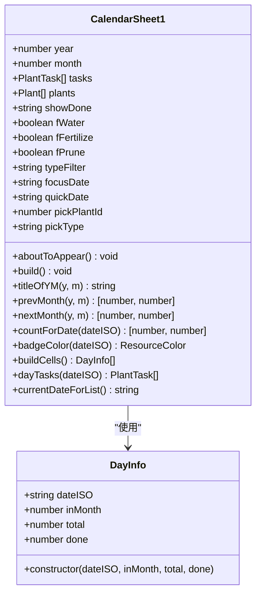
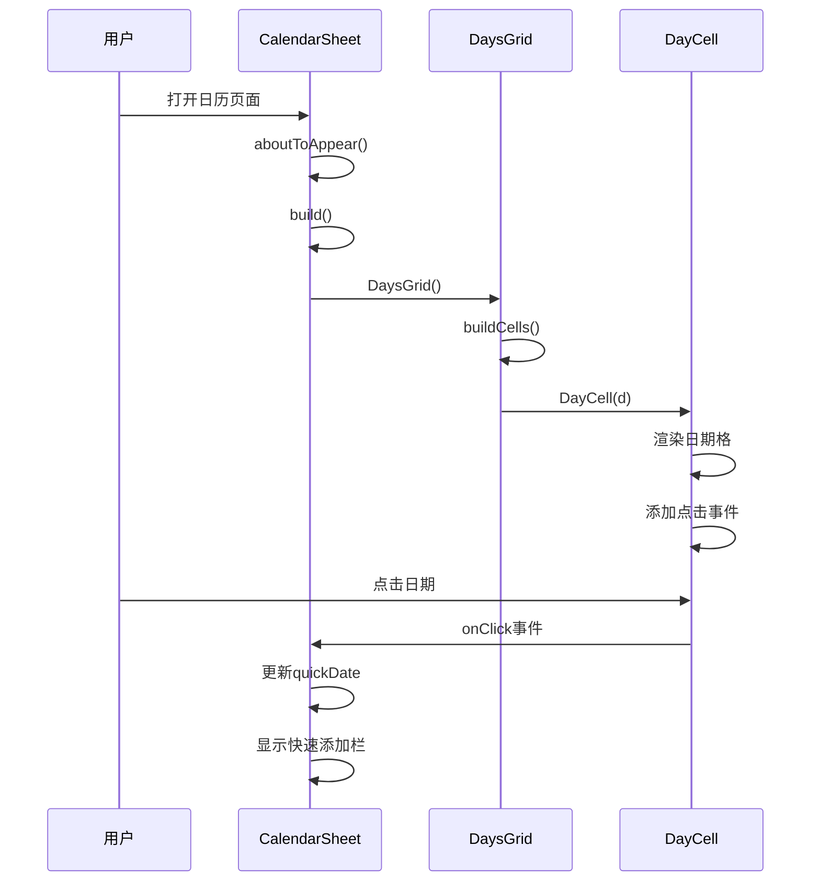
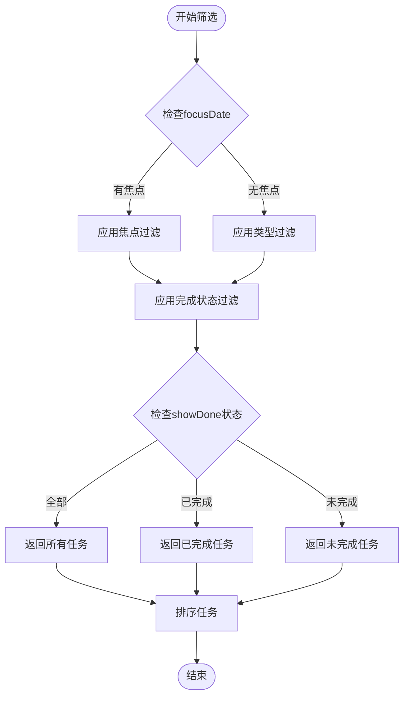
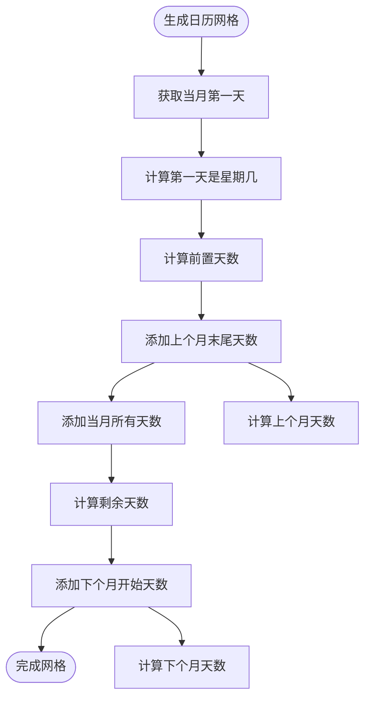
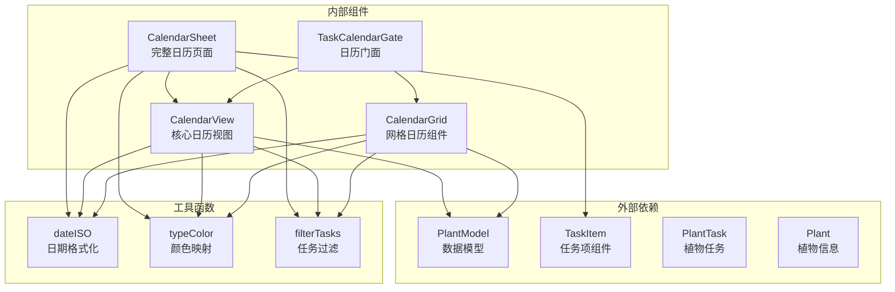

# CalendarSheet日历组件API

<cite>
**本文档引用的文件**
- [CalendarSheet.ets](file://entry/src/main/ets/pages/CalendarSheet.ets)
- [CalendarView.ets](file://entry/src/main/ets/view/CalendarView.ets)
- [CalendarGrid.ets](file://entry/src/main/ets/view/CalendarGrid.ets)
- [TaskCalendarGate.ets](file://entry/src/main/ets/view/TaskCalendarGate.ets)
- [TaskItem.ets](file://entry/src/main/ets/view/TaskItem.ets)
- [PlantModel.ets](file://entry/src/main/ets/model/PlantModel.ets)
</cite>

## 目录
1. [简介](#简介)
2. [项目结构](#项目结构)
3. [核心组件](#核心组件)
4. [架构概览](#架构概览)
5. [详细组件分析](#详细组件分析)
6. [依赖关系分析](#依赖关系分析)
7. [性能考虑](#性能考虑)
8. [故障排除指南](#故障排除指南)
9. [结论](#结论)

## 简介

CalendarSheet日历组件是PlantDiary植物养护应用中的核心日历功能模块，提供了完整的日历视图展示、日期选择、事件标注、月份切换等UI组件API。该组件采用ArkTS框架开发，支持多种日历展示模式，包括抽屉式日历（CalendarSheet）和内嵌日历（CalendarGrid），能够有效管理植物养护任务的日期选择和事件标注功能。

该组件系统包含三个主要的日历组件：
- **CalendarSheet**：抽屉式日历组件，适合在任务列表上方弹出使用
- **CalendarGrid**：内嵌日历网格组件，适合直接嵌入到页面布局中
- **CalendarView**：核心日历视图组件，提供基础的日历渲染和交互功能

## 项目结构

PlantDiary项目的日历组件位于以下目录结构中：

**图表来源**
- [CalendarSheet.ets:1-504](file://entry/src/main/ets/pages/CalendarSheet.ets#L1-L504)
- [CalendarView.ets:1-566](file://entry/src/main/ets/view/CalendarView.ets#L1-L566)
- [CalendarGrid.ets:1-351](file://entry/src/main/ets/view/CalendarGrid.ets#L1-L351)

**章节来源**
- [CalendarSheet.ets:1-504](file://entry/src/main/ets/pages/CalendarSheet.ets#L1-L504)
- [CalendarView.ets:1-566](file://entry/src/main/ets/view/CalendarView.ets#L1-L566)
- [CalendarGrid.ets:1-351](file://entry/src/main/ets/view/CalendarGrid.ets#L1-L351)

## 核心组件

### CalendarSheet - 完整日历页面组件

CalendarSheet是日历系统的主页面组件，集成了月视图概览、快速新增、当日任务列表等功能，提供完整的日历体验。

**主要特性：**
- 月视图网格展示
- 日期选择和焦点模式
- 任务快速添加功能
- 任务筛选和分类
- 当日任务列表展示

**关键参数：**
- `year: number` - 年份参数
- `month: number` - 月份参数 (1-12)
- `tasks: Array<PlantTask>` - 养护任务数组
- `plants: Array<Plant>` - 植物数组

**事件回调：**
- `onChangeMonth: (year: number, month: number) => void` - 月份变更事件
- `onQuickAdd: (plantId: number, type: string, dateISO: string) => void` - 快速添加任务事件
- `onToggle: (t: PlantTask) => void` - 任务完成状态切换事件
- `onClose: () => void` - 关闭事件
- `onDeleteAsk: (tid: number) => void` - 删除确认事件

**章节来源**
- [CalendarSheet.ets:16-504](file://entry/src/main/ets/pages/CalendarSheet.ets#L16-L504)

### CalendarView - 核心日历视图组件

CalendarView是日历系统的核心组件，提供基础的日历渲染和交互功能，支持两种展示模式。

**模式支持：**
- **抽屉模式 (showAsSheet: true)**：带蒙层的底部弹出式日历
- **内嵌模式 (showAsSheet: false)**：直接嵌入到父级布局中的日历

**核心功能：**
- 月视图网格渲染
- 日期选择和状态管理
- 任务类型筛选
- 当日任务列表展示
- 月份导航控制

**章节来源**
- [CalendarView.ets:5-510](file://entry/src/main/ets/view/CalendarView.ets#L5-L510)

### CalendarGrid - 网格日历组件

CalendarGrid是专门用于网格展示的日历组件，提供简洁的日历网格功能。

**主要用途：**
- 简化版本的日历网格
- 任务统计徽章显示
- 日期选择功能
- 当日任务列表

**关键参数：**
- `monthISO: string` - 月份标识 (YYYY-MM格式)
- `tasks: Array<PlantTask>` - 养护任务数组
- `plants: Array<Plant>` - 植物数组
- `allItems: Array<PlantTask>` - 全量任务用于统计

**章节来源**
- [CalendarGrid.ets:4-351](file://entry/src/main/ets/view/CalendarGrid.ets#L4-L351)

## 架构概览

CalendarSheet日历组件采用分层架构设计，各组件职责明确，相互协作完成完整的日历功能。

**图表来源**
- [CalendarSheet.ets:1-504](file://entry/src/main/ets/pages/CalendarSheet.ets#L1-L504)
- [CalendarView.ets:1-566](file://entry/src/main/ets/view/CalendarView.ets#L1-L566)
- [CalendarGrid.ets:1-351](file://entry/src/main/ets/view/CalendarGrid.ets#L1-L351)
- [TaskCalendarGate.ets:1-81](file://entry/src/main/ets/view/TaskCalendarGate.ets#L1-L81)

## 详细组件分析

### CalendarSheet组件详细分析

CalendarSheet组件是一个功能完整的日历页面，集成了多种日历相关的UI组件和业务逻辑。

#### 组件类结构

**图表来源**
- [CalendarSheet.ets:4-14](file://entry/src/main/ets/pages/CalendarSheet.ets#L4-L14)
- [CalendarSheet.ets:17-504](file://entry/src/main/ets/pages/CalendarSheet.ets#L17-L504)

#### 日历网格渲染流程

**图表来源**
- [CalendarSheet.ets:220-261](file://entry/src/main/ets/pages/CalendarSheet.ets#L220-L261)
- [CalendarSheet.ets:418-453](file://entry/src/main/ets/pages/CalendarSheet.ets#L418-L453)

#### 任务筛选和过滤机制

**图表来源**
- [CalendarSheet.ets:371-382](file://entry/src/main/ets/pages/CalendarSheet.ets#L371-L382)
- [CalendarSheet.ets:476-492](file://entry/src/main/ets/pages/CalendarSheet.ets#L476-L492)

**章节来源**
- [CalendarSheet.ets:17-504](file://entry/src/main/ets/pages/CalendarSheet.ets#L17-L504)

### CalendarView组件详细分析

CalendarView组件提供核心的日历视图功能，支持两种展示模式和完整的交互逻辑。

#### 组件参数和状态管理

| 参数名称 | 类型 | 默认值 | 描述 |
|---------|------|--------|------|
| showAsSheet | boolean | false | 是否以抽屉模式显示 |
| year | number | required | 年份参数 |
| month | number | required | 月份参数 (1-12) |
| tasks | Array<PlantTask> | required | 养护任务数组 |

| 状态属性 | 类型 | 默认值 | 描述 |
|---------|------|--------|------|
| y | number | 1970 | 当前显示年份 |
| m | number | 1 | 当前显示月份 |
| selectedISO | string | "" | 选中的日期ISO格式 |
| typeFilter | string | "全部" | 任务类型筛选 |
| pressedCellISO | string | "" | 按下的日期 |

**章节来源**
- [CalendarView.ets:6-24](file://entry/src/main/ets/view/CalendarView.ets#L6-L24)

#### 日历网格生成算法

**图表来源**
- [CalendarView.ets:390-409](file://entry/src/main/ets/view/CalendarView.ets#L390-L409)

**章节来源**
- [CalendarView.ets:372-409](file://entry/src/main/ets/view/CalendarView.ets#L372-L409)

### CalendarGrid组件详细分析

CalendarGrid组件专注于网格展示，提供简洁的日历网格功能和任务统计。

#### 任务统计计算

| 统计类型 | 方法 | 描述 |
|---------|------|------|
| 总任务数 | `totalByDate(iso)` | 计算指定日期的总任务数 |
| 完成任务数 | `doneByDate(iso)` | 计算指定日期的完成任务数 |
| 当日任务数 | `countTasksAt(day)` | 计算指定日期的任务数 |
| 任务列表 | `tasksOfISO(iso)` | 获取指定日期的所有任务 |

**章节来源**
- [CalendarGrid.ets:45-69](file://entry/src/main/ets/view/CalendarGrid.ets#L45-L69)
- [CalendarGrid.ets:248-270](file://entry/src/main/ets/view/CalendarGrid.ets#L248-L270)

## 依赖关系分析

日历组件系统具有清晰的依赖层次结构，各组件之间的关系如下：

**图表来源**
- [CalendarSheet.ets:1-504](file://entry/src/main/ets/pages/CalendarSheet.ets#L1-L504)
- [CalendarView.ets:1-566](file://entry/src/main/ets/view/CalendarView.ets#L1-L566)
- [CalendarGrid.ets:1-351](file://entry/src/main/ets/view/CalendarGrid.ets#L1-L351)
- [TaskCalendarGate.ets:1-81](file://entry/src/main/ets/view/TaskCalendarGate.ets#L1-L81)

**章节来源**
- [PlantModel.ets:1-166](file://entry/src/main/ets/model/PlantModel.ets#L1-L166)

## 性能考虑

### 渲染优化策略

1. **虚拟滚动优化**：CalendarSheet使用滚动容器包装内容，避免大量DOM节点同时渲染
2. **按需渲染**：日历网格采用分片渲染方式，减少单次渲染压力
3. **状态缓存**：使用`@Local`装饰器缓存组件状态，避免不必要的重新计算
4. **事件节流**：触摸事件使用防抖处理，提升交互流畅度

### 内存管理

1. **组件生命周期**：合理使用`aboutToAppear`和`aboutToDisappear`生命周期钩子
2. **数据引用**：避免在组件中创建大型临时数组，优先使用引用传递
3. **事件解绑**：确保组件卸载时正确清理事件监听器

### 渲染性能

1. **批量更新**：使用`animateTo`进行状态动画更新，避免频繁的强制重绘
2. **条件渲染**：根据状态动态显示/隐藏组件，减少不必要的渲染
3. **样式优化**：使用统一的颜色常量和样式定义，减少样式计算开销

## 故障排除指南

### 常见问题及解决方案

#### 1. 日期显示异常

**问题描述**：日历中日期显示不正确或跳转异常

**可能原因：**
- 日期格式不正确 (应为YYYY-MM-DD格式)
- 月份参数超出范围 (1-12)
- 时区设置问题

**解决方案：**
- 确保传入的日期字符串符合ISO格式
- 验证月份参数的有效性
- 检查设备时区设置

#### 2. 任务数据不显示

**问题描述**：任务列表中没有显示预期的任务

**可能原因：**
- 任务数据格式不正确
- 日期匹配失败
- 筛选条件过于严格

**解决方案：**
- 验证PlantTask对象的字段完整性
- 检查planDate字段的格式一致性
- 调整筛选条件或重置筛选状态

#### 3. 交互响应延迟

**问题描述**：点击日期或任务时响应缓慢

**可能原因：**
- 大量数据导致渲染压力
- 事件处理函数过于复杂
- 样式计算开销过大

**解决方案：**
- 实施数据分页或懒加载
- 简化事件处理逻辑
- 优化样式定义和动画效果

**章节来源**
- [CalendarSheet.ets:342-362](file://entry/src/main/ets/pages/CalendarSheet.ets#L342-L362)
- [CalendarView.ets:480-502](file://entry/src/main/ets/view/CalendarView.ets#L480-L502)

## 结论

CalendarSheet日历组件系统提供了完整的日历功能实现，具有以下特点：

**技术优势：**
- 采用ArkTS框架开发，充分利用了现代前端技术栈
- 组件化设计，职责分离明确，便于维护和扩展
- 支持多种展示模式，适应不同的使用场景
- 完善的数据绑定和事件处理机制

**功能完整性：**
- 覆盖了日历应用的核心功能需求
- 提供了丰富的用户交互体验
- 支持灵活的任务管理和筛选功能
- 具备良好的可定制性和扩展性

**最佳实践建议：**
- 在实际使用中注意数据格式的一致性
- 合理设置组件参数，确保功能正常运行
- 根据具体需求选择合适的组件模式
- 注意性能优化，特别是在处理大量数据时

该日历组件系统为PlantDiary应用提供了强大的日历功能基础，能够有效支持植物养护任务的时间管理和提醒功能。