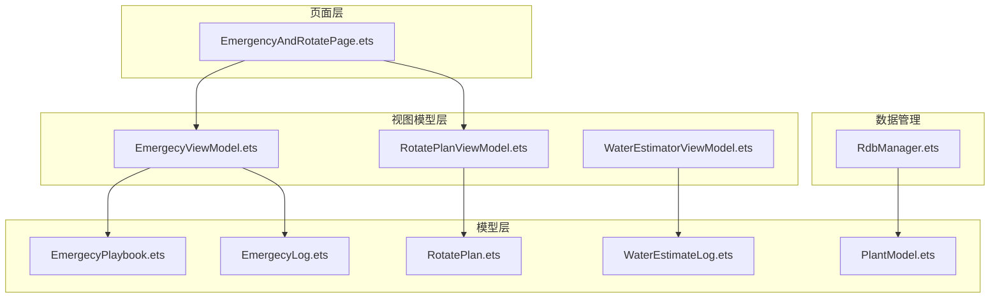
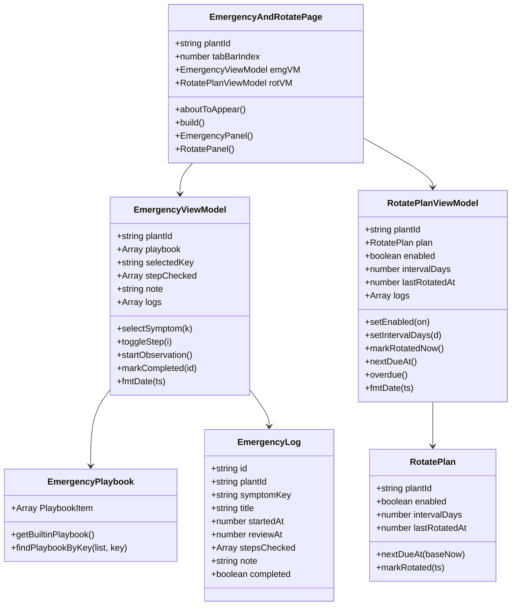
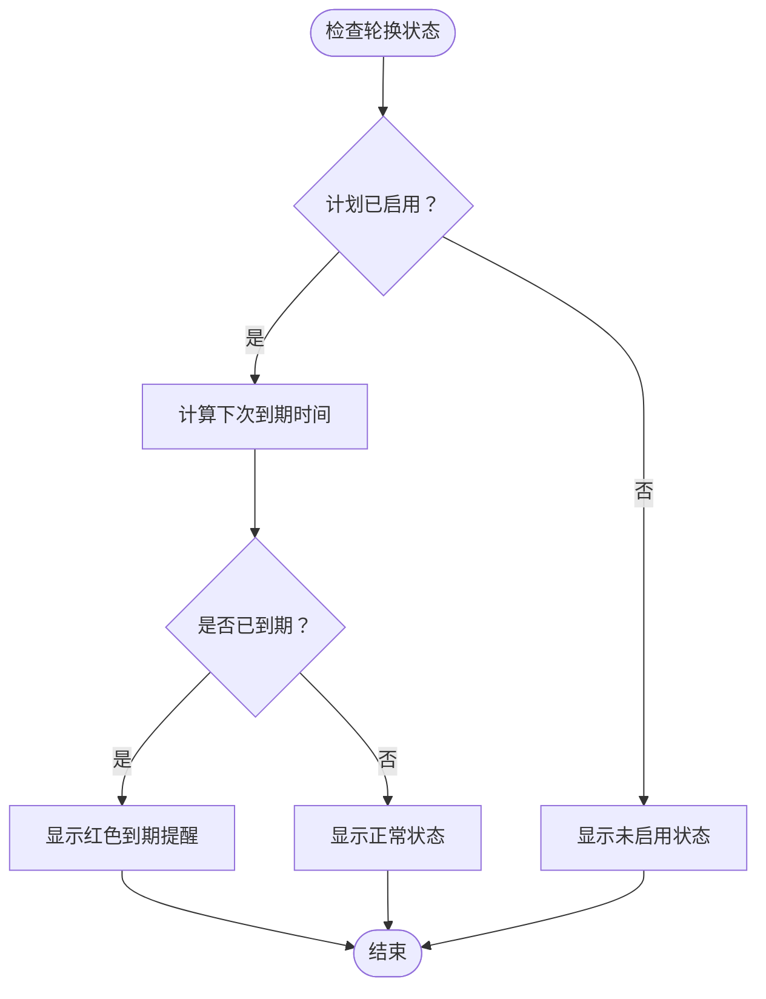
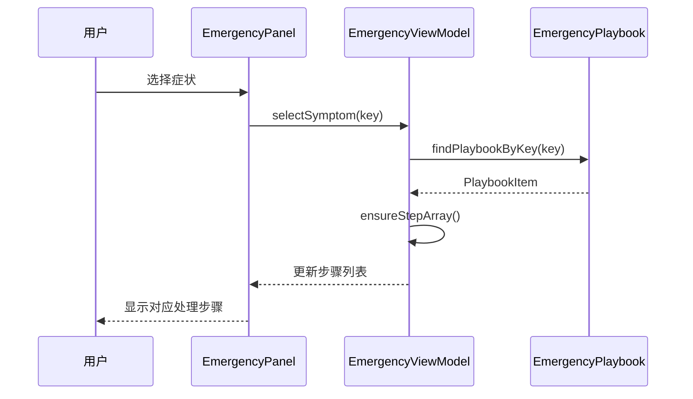
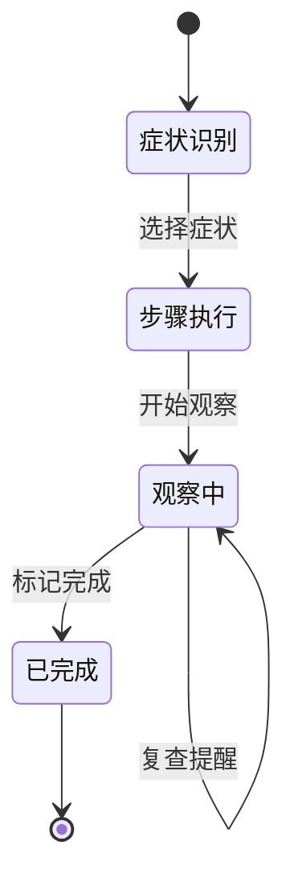
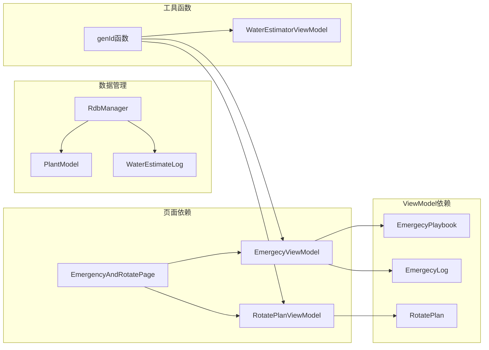

# EmergencyAndRotatePage紧急与轮换API

<cite>
**本文档引用的文件**
- [EmergencyAndRotatePage.ets](file://entry/src/main/ets/pages/EmergencyAndRotatePage.ets)
- [EmergencyViewModel.ets](file://entry/src/main/ets/viewmodel/EmergencyViewModel.ets)
- [RotatePlanViewModel.ets](file://entry/src/main/ets/viewmodel/RotatePlanViewModel.ets)
- [EmergencyPlaybook.ets](file://entry/src/main/ets/model/EmergencyPlaybook.ets)
- [EmergencyLog.ets](file://entry/src/main/ets/model/EmergencyLog.ets)
- [RotatePlan.ets](file://entry/src/main/ets/model/RotatePlan.ets)
- [RdbManager.ets](file://entry/src/main/ets/viewmodel/RdbManager.ets)
- [WaterEstimatorViewModel.ets](file://entry/src/main/ets/viewmodel/WaterEstimatorViewModel.ets)
- [WaterEstimateLog.ets](file://entry/src/main/ets/model/WaterEstimateLog.ets)
- [PlantModel.ets](file://entry/src/main/ets/model/PlantModel.ets)
</cite>

## 目录
1. [简介](#简介)
2. [项目结构](#项目结构)
3. [核心组件](#核心组件)
4. [架构概览](#架构概览)
5. [详细组件分析](#详细组件分析)
6. [依赖关系分析](#依赖关系分析)
7. [性能考虑](#性能考虑)
8. [故障排除指南](#故障排除指南)
9. [结论](#结论)

## 简介

EmergencyAndRotatePage紧急与轮换页面是一个综合性的植物养护管理界面，集成了紧急养护任务处理和植物轮换管理两大核心功能模块。该页面采用MVVM架构模式，通过ViewModel与Model层分离业务逻辑，提供直观的用户交互体验。

页面主要功能包括：
- **紧急养护任务处理**：基于内置应急手册的症状识别、急救步骤执行、观察记录管理
- **植物轮换管理**：转盆周期设置、到期提醒、历史记录追踪
- **应急响应机制**：症状分类、处理流程指导、复查提醒

## 项目结构

EmergencyAndRotatePage位于应用的页面层，采用组件化设计，主要文件组织如下：

**图表来源**
- [EmergencyAndRotatePage.ets:1-557](file://entry/src/main/ets/pages/EmergencyAndRotatePage.ets#L1-L557)
- [EmergencyViewModel.ets:1-115](file://entry/src/main/ets/viewmodel/EmergencyViewModel.ets#L1-L115)
- [RotatePlanViewModel.ets:1-88](file://entry/src/main/ets/viewmodel/RotatePlanViewModel.ets#L1-L88)

**章节来源**
- [EmergencyAndRotatePage.ets:1-557](file://entry/src/main/ets/pages/EmergencyAndRotatePage.ets#L1-L557)
- [EmergencyViewModel.ets:1-115](file://entry/src/main/ets/viewmodel/EmergencyViewModel.ets#L1-L115)
- [RotatePlanViewModel.ets:1-88](file://entry/src/main/ets/viewmodel/RotatePlanViewModel.ets#L1-L88)

## 核心组件

EmergencyAndRotatePage由两个主要功能面板组成：紧急面板和轮换面板，每个面板都有独立的ViewModel管理状态。

### 紧急面板组件

紧急面板提供完整的应急处理流程，包括症状识别、步骤执行、观察记录和历史查看。

### 轮换面板组件

轮换面板专注于植物转盆管理，提供周期设置、到期提醒和历史记录功能。

**章节来源**
- [EmergencyAndRotatePage.ets:100-358](file://entry/src/main/ets/pages/EmergencyAndRotatePage.ets#L100-L358)
- [EmergencyAndRotatePage.ets:360-555](file://entry/src/main/ets/pages/EmergencyAndRotatePage.ets#L360-L555)

## 架构概览

页面采用MVVM架构模式，实现了清晰的关注点分离：

**图表来源**
- [EmergencyAndRotatePage.ets:10-16](file://entry/src/main/ets/pages/EmergencyAndRotatePage.ets#L10-L16)
- [EmergencyViewModel.ets:14-29](file://entry/src/main/ets/viewmodel/EmergencyViewModel.ets#L14-L29)
- [RotatePlanViewModel.ets:19-31](file://entry/src/main/ets/viewmodel/RotatePlanViewModel.ets#L19-L31)
- [EmergencyPlaybook.ets:25-80](file://entry/src/main/ets/model/EmergecyPlaybook.ets#L25-L80)
- [EmergencyLog.ets:4-19](file://entry/src/main/ets/model/EmergecyLog.ets#L4-L19)
- [RotatePlan.ets:4-24](file://entry/src/main/ets/model/RotatePlan.ets#L4-L24)

## 详细组件分析

### 紧急处理组件API

#### 症状选择器组件

症状选择器提供五种常见植物病害症状的快速识别功能：

| 属性 | 类型 | 描述 | 默认值 |
|------|------|------|--------|
| plantId | string | 植物标识符 | "" |
| selectedKey | string | 当前选中的症状键值 | "SCORCH" |
| symptoms | Array | 症状列表 | ["SCORCH","WILT","YELLOW","SPOT","ROOTROT"] |

支持的症状类型：
- **SCORCH**：日灼症状
- **WILT**：萎蔫症状  
- **YELLOW**：黄化症状
- **SPOT**：斑点症状
- **ROOTROT**：烂根症状

#### 急救步骤卡片组件

步骤卡片根据选中的症状动态显示相应的处理步骤：

| 方法 | 参数 | 返回值 | 描述 |
|------|------|--------|------|
| selectSymptom(k) | string | void | 选择症状类型 |
| toggleStep(i) | number | void | 切换步骤完成状态 |
| currentItem() | void | PlaybookItem | 获取当前症状的处理方案 |
| ensureStepArray() | void | void | 确保步骤数组长度一致 |

#### 观察记录组件

观察记录组件管理紧急处理的跟踪和历史：

| 属性 | 类型 | 描述 |
|------|------|------|
| logs | Array | 急救记录列表 |
| note | string | 备注信息 |
| stepChecked | Array | 步骤完成状态数组 |

**章节来源**
- [EmergencyAndRotatePage.ets:110-136](file://entry/src/main/ets/pages/EmergencyAndRotatePage.ets#L110-L136)
- [EmergencyAndRotatePage.ets:155-188](file://entry/src/main/ets/pages/EmergencyAndRotatePage.ets#L155-L188)
- [EmergencyAndRotatePage.ets:211-261](file://entry/src/main/ets/pages/EmergencyAndRotatePage.ets#L211-L261)

### 轮换管理组件API

#### 轮换计划设置组件

轮换计划组件提供灵活的转盆周期管理：

| 属性 | 类型 | 描述 | 范围 |
|------|------|------|------|
| enabled | boolean | 是否启用轮换计划 | true/false |
| intervalDays | number | 转盆周期（天） | 3-60 |
| lastRotatedAt | number | 上次转盆时间戳 | 时间戳 |
| logs | Array | 转盆历史记录 | RotateLog[] |

| 方法 | 参数 | 返回值 | 描述 |
|------|------|--------|------|
| setEnabled(on) | boolean | void | 设置启用状态 |
| setIntervalDays(d) | number | void | 设置轮换周期 |
| markRotatedNow() | void | void | 记录当前转盆操作 |
| nextDueAt() | void | number | 计算下次到期时间 |
| overdue() | void | boolean | 检查是否到期 |

#### 到期提醒组件

到期提醒组件提供智能的时间管理功能：

**图表来源**
- [RotatePlanViewModel.ets:64-72](file://entry/src/main/ets/viewmodel/RotatePlanViewModel.ets#L64-L72)
- [EmergencyAndRotatePage.ets:455-501](file://entry/src/main/ets/pages/EmergencyAndRotatePage.ets#L455-L501)

**章节来源**
- [EmergencyAndRotatePage.ets:369-434](file://entry/src/main/ets/pages/EmergencyAndRotatePage.ets#L369-L434)
- [EmergencyAndRotatePage.ets:455-501](file://entry/src/main/ets/pages/EmergencyAndRotatePage.ets#L455-L501)
- [EmergencyAndRotatePage.ets:503-555](file://entry/src/main/ets/pages/EmergencyAndRotatePage.ets#L503-L555)

### 业务逻辑接口

#### 紧急任务识别算法

紧急任务识别基于内置的应急手册，采用症状匹配算法：

**图表来源**
- [EmergencyViewModel.ets:40-43](file://entry/src/main/ets/viewmodel/EmergencyViewModel.ets#L40-L43)
- [EmergencyPlaybook.ets:75-80](file://entry/src/main/ets/model/EmergecyPlaybook.ets#L75-L80)

#### 轮换策略实现

轮换策略基于时间计算，支持灵活的周期调整：

| 策略类型 | 计算公式 | 描述 |
|----------|----------|------|
| 基础周期 | next = last + intervalDays | 标准转盆周期计算 |
| 到期判断 | overdue = enabled && next <= now | 到期状态检查 |
| 周期验证 | 3 ≤ interval ≤ 60 | 周期范围限制 |

#### 应急响应机制

应急响应机制提供完整的处理流程跟踪：

**图表来源**
- [EmergencyViewModel.ets:58-98](file://entry/src/main/ets/viewmodel/EmergencyViewModel.ets#L58-L98)

**章节来源**
- [EmergencyPlaybook.ets:25-73](file://entry/src/main/ets/model/EmergecyPlaybook.ets#L25-L73)
- [EmergencyLog.ets:4-19](file://entry/src/main/ets/model/EmergecyLog.ets#L4-L19)
- [RotatePlan.ets:14-23](file://entry/src/main/ets/model/RotatePlan.ets#L14-L23)

## 依赖关系分析

页面组件之间的依赖关系清晰明确：

**图表来源**
- [EmergencyAndRotatePage.ets:4-8](file://entry/src/main/ets/pages/EmergencyAndRotatePage.ets#L4-L8)
- [EmergencyViewModel.ets:7-11](file://entry/src/main/ets/viewmodel/EmergecyViewModel.ets#L7-L11)
- [RotatePlanViewModel.ets:6-10](file://entry/src/main/ets/viewmodel/RotatePlanViewModel.ets#L6-L10)

**章节来源**
- [EmergencyViewModel.ets:1-115](file://entry/src/main/ets/viewmodel/EmergecyViewModel.ets#L1-L115)
- [RotatePlanViewModel.ets:1-88](file://entry/src/main/ets/viewmodel/RotatePlanViewModel.ets#L1-L88)
- [RdbManager.ets:4-296](file://entry/src/main/ets/viewmodel/RdbManager.ets#L4-L296)

## 性能考虑

### 内存管理优化

1. **对象重建策略**：通过创建新对象而非原地修改来确保UI正确响应
2. **数组操作优化**：使用高效的数据结构管理日志和状态
3. **时间格式化缓存**：避免重复的时间格式化操作

### 数据持久化策略

虽然当前版本使用内存存储，但系统已为数据库持久化预留了完整的基础设施：

- **RDB表结构设计**：支持植物、任务、日志等核心数据模型
- **索引优化**：为常用查询场景建立复合索引
- **事务支持**：提供数据一致性保障

## 故障排除指南

### 常见问题及解决方案

#### 症状识别问题
- **问题**：症状选择无效
- **原因**：playbook数据加载失败
- **解决**：检查内置应急手册数据完整性

#### 轮换计划异常
- **问题**：到期提醒不准确
- **原因**：时间戳计算错误
- **解决**：验证lastRotatedAt和intervalDays设置

#### UI状态不同步
- **问题**：步骤勾选状态异常
- **原因**：状态管理问题
- **解决**：重新初始化stepChecked数组

**章节来源**
- [EmergencyViewModel.ets:32-38](file://entry/src/main/ets/viewmodel/EmergecyViewModel.ets#L32-L38)
- [RotatePlanViewModel.ets:54-62](file://entry/src/main/ets/viewmodel/RotatePlanViewModel.ets#L54-L62)

## 结论

EmergencyAndRotatePage紧急与轮换页面提供了完整的植物养护管理解决方案。通过模块化的MVVM架构设计，实现了以下优势：

1. **清晰的功能分离**：紧急处理和轮换管理各司其职
2. **灵活的配置选项**：支持自定义轮换周期和症状处理方案
3. **完善的跟踪机制**：提供完整的处理过程记录
4. **可扩展的架构**：为数据库持久化预留了完整接口

该页面为植物养护管理提供了直观、高效的用户体验，是PlantDiary应用的重要组成部分。