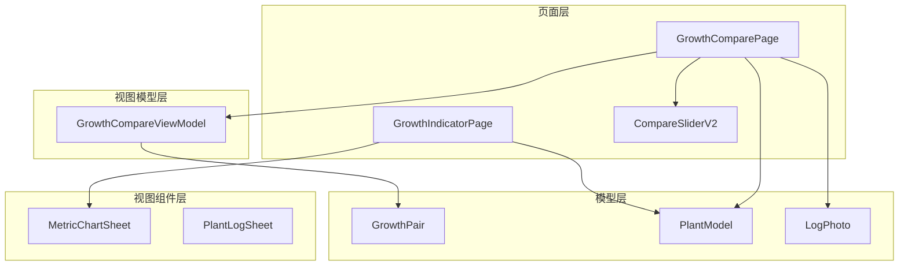
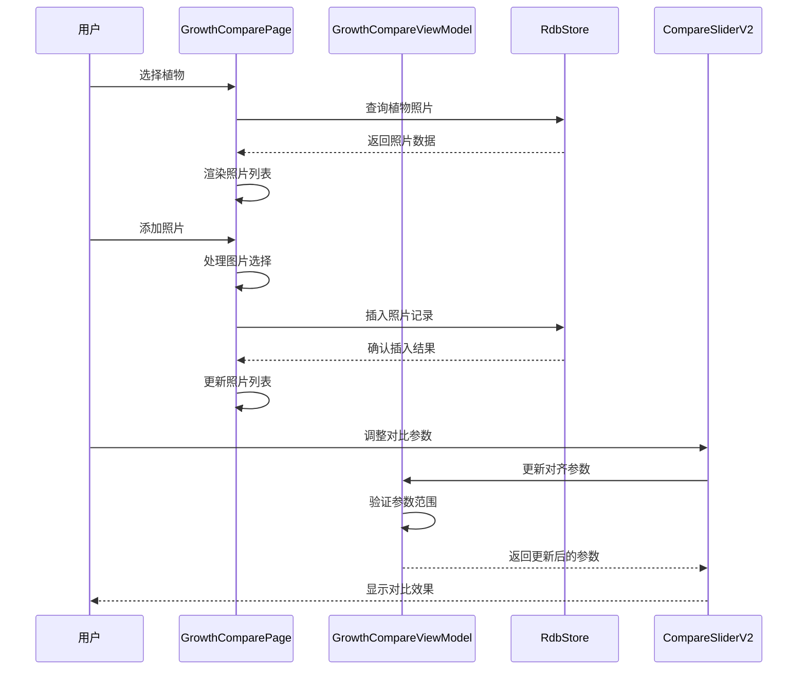
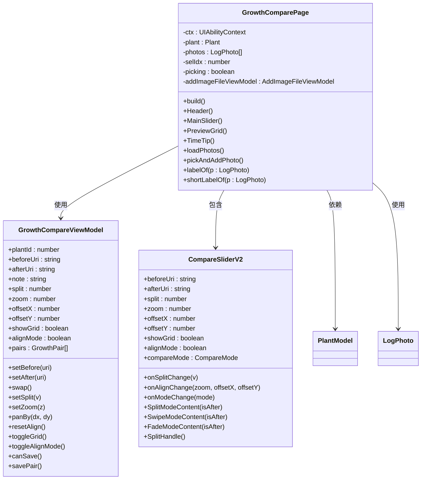
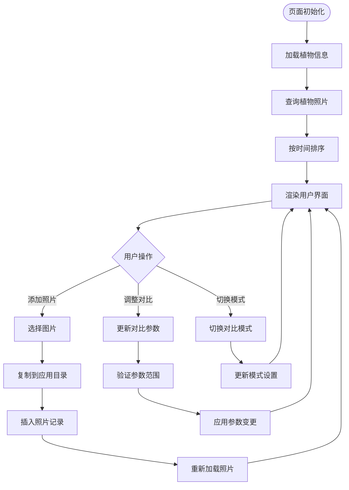
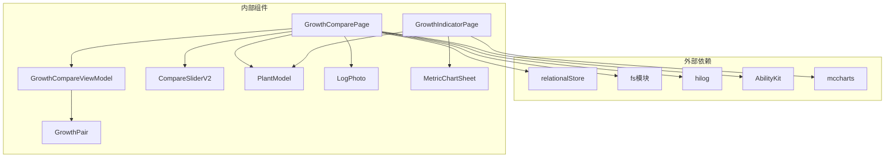
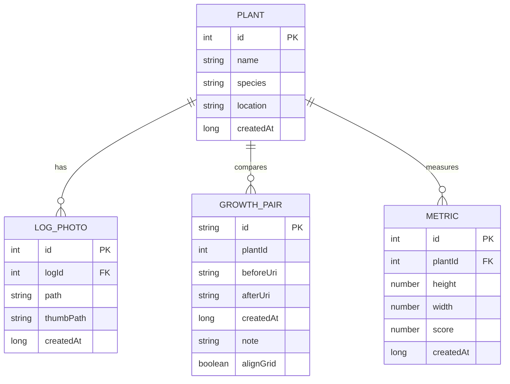

# GrowthComparePage生长对比API

<cite>
**本文档引用的文件**
- [GrowthComparePage.ets](file://entry/src/main/ets/pages/GrowthComparePage.ets)
- [GrowthCompareViewModel.ets](file://entry/src/main/ets/viewmodel/GrowthCompareViewModel.ets)
- [CompareSliderV2.ets](file://entry/src/main/ets/pages/CompareSliderV2.ets)
- [GrowthPair.ets](file://entry/src/main/ets/model/GrowthPair.ets)
- [PlantModel.ets](file://entry/src/main/ets/model/PlantModel.ets)
- [PlantLogSheet.ets](file://entry/src/main/ets/view/PlantLogSheet.ets)
- [GrowthIndicatorPage.ets](file://entry/src/main/ets/pages/GrowthIndicatorPage.ets)
- [MetricChartSheet.ets](file://entry/src/main/ets/view/MetricChartSheet.ets)
</cite>

## 目录
1. [简介](#简介)
2. [项目结构](#项目结构)
3. [核心组件](#核心组件)
4. [架构概览](#架构概览)
5. [详细组件分析](#详细组件分析)
6. [依赖分析](#依赖分析)
7. [性能考虑](#性能考虑)
8. [故障排除指南](#故障排除指南)
9. [结论](#结论)

## 简介

GrowthComparePage是一个专门用于植物生长对比的页面组件，提供了直观的照片对比功能和丰富的交互体验。该页面支持多植物对比配置、指标选择、图表展示等功能，是PlantDiary植物护理应用中的重要组成部分。

该页面主要功能包括：
- 植物成长时间线照片浏览
- 前后照片对比滑块
- 多种对比模式（分割、滑动、淡入淡出）
- 照片添加和管理
- 生长指标趋势分析
- 用户友好的交互界面

## 项目结构

基于代码分析，GrowthComparePage相关的项目结构如下：

**图表来源**
- [GrowthComparePage.ets:1-477](file://entry/src/main/ets/pages/GrowthComparePage.ets#L1-L477)
- [GrowthCompareViewModel.ets:1-109](file://entry/src/main/ets/viewmodel/GrowthCompareViewModel.ets#L1-L109)
- [CompareSliderV2.ets:1-448](file://entry/src/main/ets/pages/CompareSliderV2.ets#L1-L448)

**章节来源**
- [GrowthComparePage.ets:1-477](file://entry/src/main/ets/pages/GrowthComparePage.ets#L1-L477)
- [GrowthCompareViewModel.ets:1-109](file://entry/src/main/ets/viewmodel/GrowthCompareViewModel.ets#L1-L109)

## 核心组件

### GrowthComparePage 页面组件

GrowthComparePage是主页面组件，负责整个生长对比功能的展示和交互。

**主要特性：**
- 成长对比页的核心设计专注于同一植物的时间序列照片浏览
- 支持照片的滑动对比和预览网格
- 提供时间跨度显示功能
- 集成照片添加和管理功能

**关键属性：**
- `plant`: 当前选择的植物对象
- `photos`: 植物照片数组
- `selIdx`: 当前选中的照片索引
- `picking`: 照片选择状态标志

**章节来源**
- [GrowthComparePage.ets:10-60](file://entry/src/main/ets/pages/GrowthComparePage.ets#L10-L60)

### GrowthCompareViewModel 视图模型

GrowthCompareViewModel管理前后对比的工作区状态和对齐参数。

**核心功能：**
- 管理before/after图片状态
- 控制对比参数（分割线、缩放、平移）
- 网格显示和对齐模式控制
- 对比卡片的保存和管理

**关键属性：**
- `beforeUri/afterUri`: 前后图片URI
- `split`: 分割比例（0.02-0.98）
- `zoom`: 缩放级别（0.5-4.0）
- `offsetX/offsetY`: 平移偏移量
- `showGrid`: 网格显示开关
- `alignMode`: 对齐模式开关

**章节来源**
- [GrowthCompareViewModel.ets:12-31](file://entry/src/main/ets/viewmodel/GrowthCompareViewModel.ets#L12-L31)

### CompareSliderV2 对比滑块组件

CompareSliderV2是一个功能强大的图片对比组件，支持多种对比模式。

**支持的对比模式：**
- SPLIT: 分割模式 - 通过垂直分割线分隔两张图片
- SWIPE: 滑动模式 - 通过左右滑动切换图片
- FADE: 淡入淡出模式 - 通过透明度渐变过渡

**手势支持：**
- 拖杆拖动调整分割线位置
- 双指缩放控制图片大小
- 长按预览仅前图模式
- 对齐模式下的平移操作

**章节来源**
- [CompareSliderV2.ets:50-125](file://entry/src/main/ets/pages/CompareSliderV2.ets#L50-L125)

## 架构概览

GrowthComparePage采用MVVM架构模式，实现了清晰的职责分离：

**图表来源**
- [GrowthComparePage.ets:354-400](file://entry/src/main/ets/pages/GrowthComparePage.ets#L354-L400)
- [GrowthCompareViewModel.ets:33-87](file://entry/src/main/ets/viewmodel/GrowthCompareViewModel.ets#L33-L87)
- [CompareSliderV2.ets:215-255](file://entry/src/main/ets/pages/CompareSliderV2.ets#L215-L255)

## 详细组件分析

### GrowthComparePage 组件架构

**图表来源**
- [GrowthComparePage.ets:10-60](file://entry/src/main/ets/pages/GrowthComparePage.ets#L10-L60)
- [GrowthCompareViewModel.ets:12-31](file://entry/src/main/ets/viewmodel/GrowthCompareViewModel.ets#L12-L31)
- [CompareSliderV2.ets:50-74](file://entry/src/main/ets/pages/CompareSliderV2.ets#L50-L74)

### 数据流分析

GrowthComparePage的数据流遵循以下模式：

**图表来源**
- [GrowthComparePage.ets:354-400](file://entry/src/main/ets/pages/GrowthComparePage.ets#L354-L400)
- [GrowthCompareViewModel.ets:54-87](file://entry/src/main/ets/viewmodel/GrowthCompareViewModel.ets#L54-L87)

**章节来源**
- [GrowthComparePage.ets:354-477](file://entry/src/main/ets/pages/GrowthComparePage.ets#L354-L477)

### API 接口定义

#### GrowthComparePage API

| 方法 | 参数 | 返回值 | 描述 |
|------|------|--------|------|
| `build()` | 无 | `void` | 页面构建入口，初始化UI结构 |
| `Header()` | 无 | `void` | 渲染页面头部区域 |
| `MainSlider()` | 无 | `void` | 主要对比滑块组件 |
| `PreviewGrid()` | 无 | `void` | 照片预览网格 |
| `TimeTip()` | 无 | `void` | 时间跨度提示 |
| `loadPhotos()` | 无 | `Promise<void>` | 异步加载植物照片 |
| `pickAndAddPhoto()` | 无 | `Promise<void>` | 选择并添加新照片 |
| `labelOf(p)` | `LogPhoto` | `string` | 格式化完整日期标签 |
| `shortLabelOf(p)` | `LogPhoto` | `string` | 格式化简短日期标签 |

#### GrowthCompareViewModel API

| 方法 | 参数 | 返回值 | 描述 |
|------|------|--------|------|
| `constructor(plantId)` | `number` | `void` | 构造函数，初始化植物ID |
| `setBefore(uri)` | `string` | `void` | 设置前图URI |
| `setAfter(uri)` | `string` | `void` | 设置后图URI |
| `swap()` | 无 | `void` | 交换前后图片 |
| `setSplit(v)` | `number` | `void` | 设置分割比例（0.02-0.98） |
| `setZoom(z)` | `number` | `void` | 设置缩放级别（0.5-4.0） |
| `panBy(dx, dy)` | `number, number` | `void` | 平移图片（±600px限制） |
| `resetAlign()` | 无 | `void` | 重置对齐参数 |
| `toggleGrid()` | 无 | `void` | 切换网格显示 |
| `toggleAlignMode()` | 无 | `void` | 切换对齐模式 |
| `canSave()` | 无 | `boolean` | 检查是否可以保存 |
| `savePair()` | 无 | `GrowthPair` | 保存对比对 |

#### CompareSliderV2 API

| 方法 | 参数 | 返回值 | 描述 |
|------|------|--------|------|
| `SplitModeContent(isAfter)` | `boolean` | `void` | 分割模式内容渲染 |
| `SwipeModeContent(isAfter)` | `boolean` | `void` | 滑动模式内容渲染 |
| `FadeModeContent(isAfter)` | `boolean` | `void` | 淡入淡出模式内容渲染 |
| `SplitHandle()` | 无 | `void` | 分割拖杆渲染 |
| `GridOverlay()` | 无 | `void` | 网格覆盖层渲染 |

**章节来源**
- [GrowthComparePage.ets:343-477](file://entry/src/main/ets/pages/GrowthComparePage.ets#L343-L477)
- [GrowthCompareViewModel.ets:29-109](file://entry/src/main/ets/viewmodel/GrowthCompareViewModel.ets#L29-L109)
- [CompareSliderV2.ets:215-447](file://entry/src/main/ets/pages/CompareSliderV2.ets#L215-L447)

## 依赖分析

### 组件依赖关系

**图表来源**
- [GrowthComparePage.ets:1-9](file://entry/src/main/ets/pages/GrowthComparePage.ets#L1-L9)
- [GrowthIndicatorPage.ets:1-5](file://entry/src/main/ets/pages/GrowthIndicatorPage.ets#L1-L5)

### 数据模型关系

**图表来源**
- [PlantModel.ets:6-21](file://entry/src/main/ets/model/PlantModel.ets#L6-L21)
- [GrowthPair.ets:4-21](file://entry/src/main/ets/model/GrowthPair.ets#L4-L21)

**章节来源**
- [PlantModel.ets:1-166](file://entry/src/main/ets/model/PlantModel.ets#L1-L166)
- [GrowthPair.ets:1-22](file://entry/src/main/ets/model/GrowthPair.ets#L1-L22)

## 性能考虑

### 图片处理优化

1. **异步加载**: 照片查询采用异步方式，避免阻塞主线程
2. **内存管理**: 使用对象池模式管理图片资源
3. **缓存策略**: 通过文件系统缓存减少重复读取

### 用户界面优化

1. **懒加载**: 照片列表采用懒加载机制
2. **动画优化**: 使用硬件加速的动画效果
3. **响应式设计**: 支持不同屏幕尺寸的自适应布局

### 数据库操作优化

1. **批量操作**: 支持批量插入和查询操作
2. **索引优化**: 关键字段建立适当的索引
3. **事务处理**: 复杂操作使用事务保证数据一致性

## 故障排除指南

### 常见问题及解决方案

**问题1: 照片无法显示**
- 检查文件权限和路径有效性
- 验证图片格式是否受支持
- 确认应用存储空间充足

**问题2: 对比功能异常**
- 检查手势识别是否正常
- 验证参数范围设置
- 确认网络连接状态

**问题3: 数据同步问题**
- 检查数据库连接状态
- 验证数据完整性约束
- 查看错误日志信息

**章节来源**
- [GrowthComparePage.ets:377-400](file://entry/src/main/ets/pages/GrowthComparePage.ets#L377-L400)
- [GrowthCompareViewModel.ets:75-87](file://entry/src/main/ets/viewmodel/GrowthCompareViewModel.ets#L75-L87)

## 结论

GrowthComparePage生长对比页面是一个功能完善、架构清晰的植物生长管理组件。通过MVVM模式的有效应用，实现了良好的用户体验和代码可维护性。

**主要优势：**
- 直观的照片对比界面设计
- 多种对比模式满足不同需求
- 完善的数据管理和持久化机制
- 良好的性能优化和用户体验

**技术特点：**
- 模块化设计，职责分离明确
- 异步数据处理，避免界面阻塞
- 丰富的交互手势支持
- 可扩展的组件架构

该组件为PlantDiary应用提供了强大的植物生长跟踪和对比功能，是植物护理管理的重要工具。