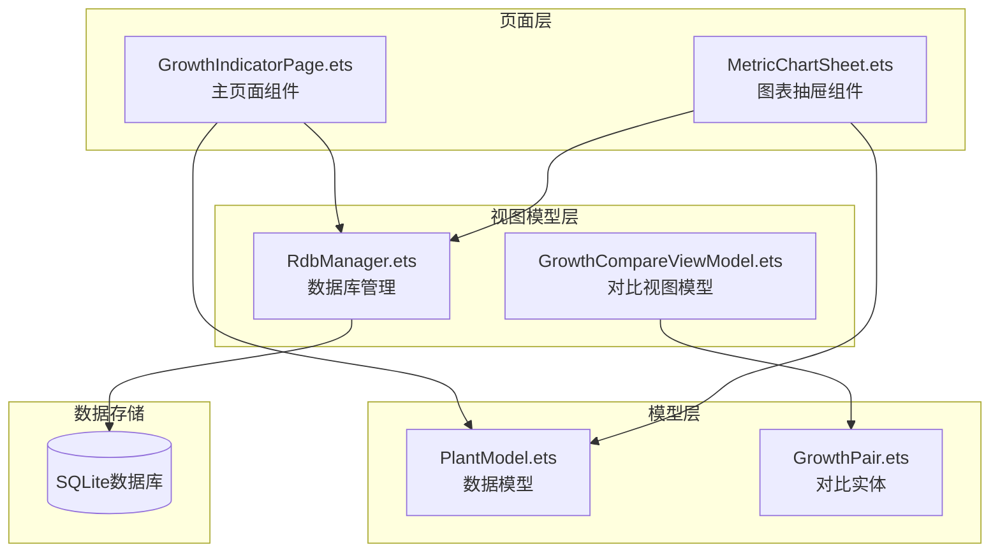
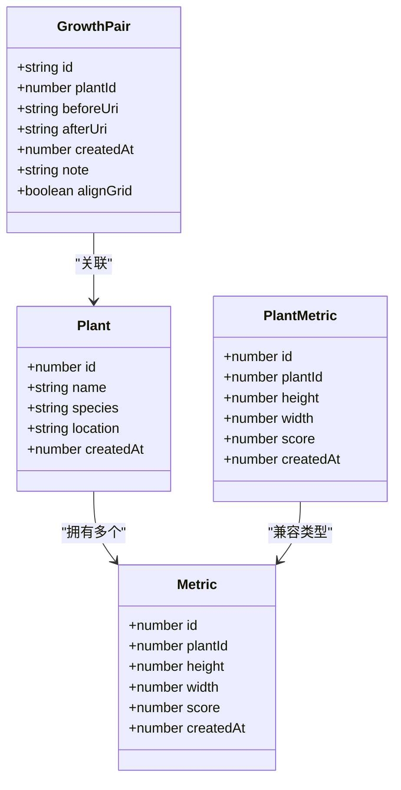
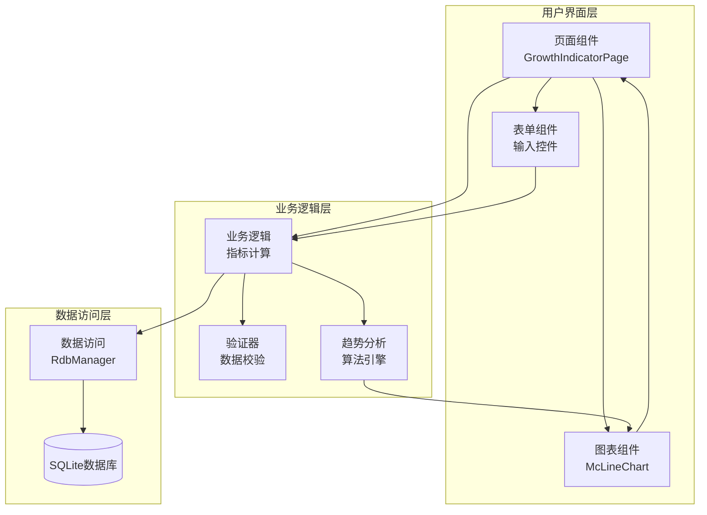
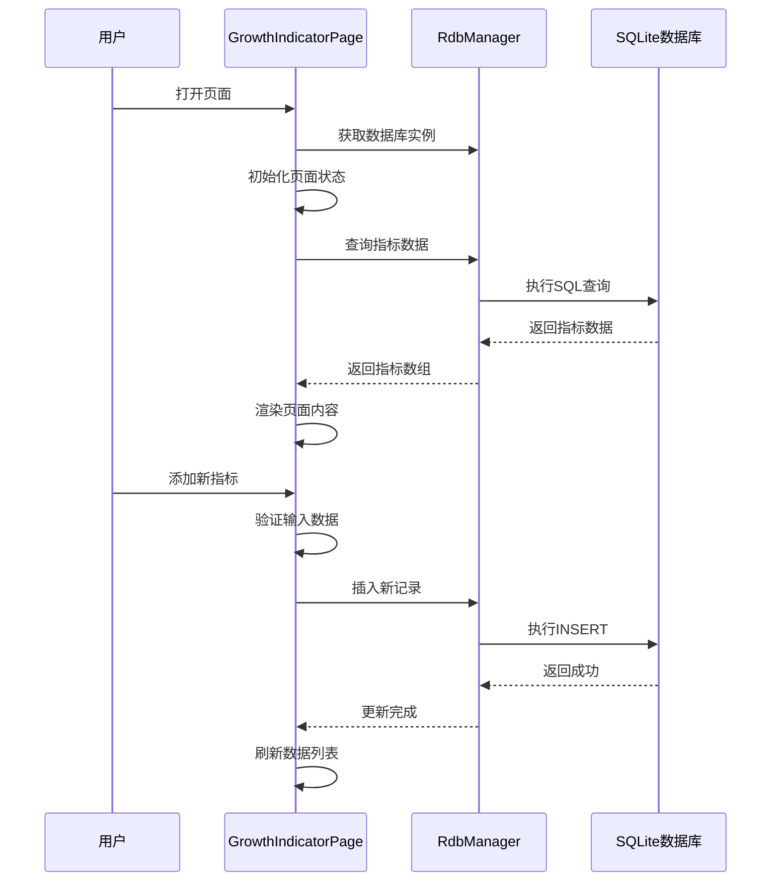
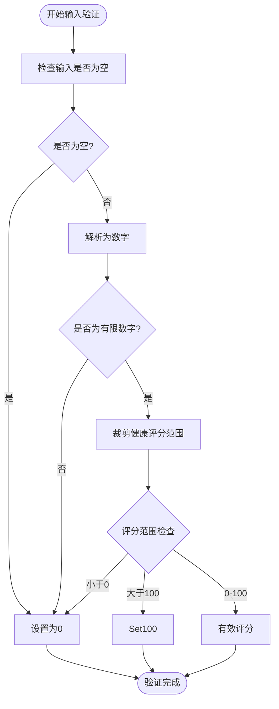
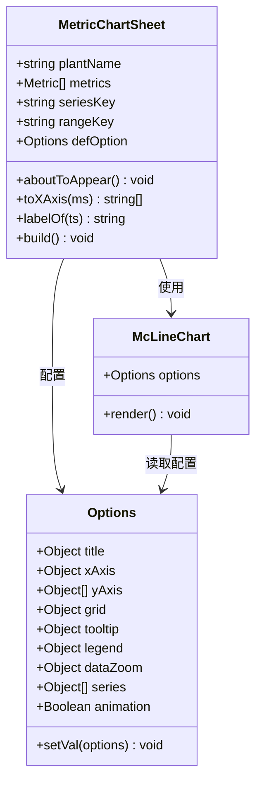
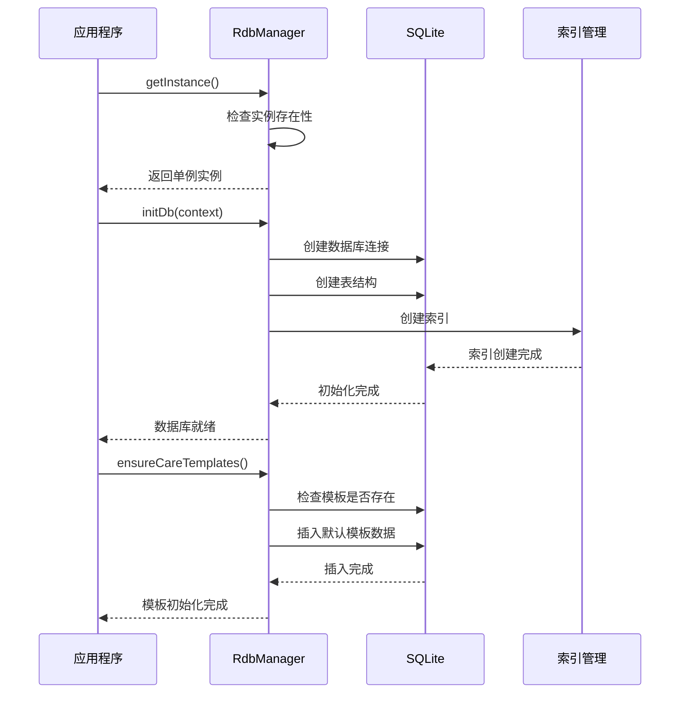

# GrowthIndicatorPage生长指标API

<cite>
**本文档引用的文件**
- [GrowthIndicatorPage.ets](file://entry/src/main/ets/pages/GrowthIndicatorPage.ets)
- [PlantModel.ets](file://entry/src/main/ets/model/PlantModel.ets)
- [RdbManager.ets](file://entry/src/main/ets/viewmodel/RdbManager.ets)
- [MetricChartSheet.ets](file://entry/src/main/ets/view/MetricChartSheet.ets)
- [GrowthCompareViewModel.ets](file://entry/src/main/ets/viewmodel/GrowthCompareViewModel.ets)
- [GrowthPair.ets](file://entry/src/main/ets/model/GrowthPair.ets)
</cite>

## 目录
1. [简介](#简介)
2. [项目结构](#项目结构)
3. [核心组件](#核心组件)
4. [架构概览](#架构概览)
5. [详细组件分析](#详细组件分析)
6. [依赖关系分析](#依赖关系分析)
7. [性能考虑](#性能考虑)
8. [故障排除指南](#故障排除指南)
9. [结论](#结论)

## 简介

GrowthIndicatorPage是PlantDiary植物日记应用中的核心生长指标管理页面。该页面提供了完整的植物生长数据管理功能，包括指标记录、趋势分析、健康评估等核心业务逻辑。系统采用ArkTS框架开发，使用关系型数据库存储植物生长数据，并通过图表组件展示可视化趋势。

该页面支持双模式操作：列表模式用于日常指标录入和历史记录查看，图表模式用于详细的趋势分析。数据存储采用本地SQLite数据库，确保离线可用性和数据安全性。

## 项目结构

基于代码分析，GrowthIndicatorPage相关的核心文件组织如下：



**图表来源**
- [GrowthIndicatorPage.ets:1-605](file://entry/src/main/ets/pages/GrowthIndicatorPage.ets#L1-L605)
- [RdbManager.ets:1-296](file://entry/src/main/ets/viewmodel/RdbManager.ets#L1-L296)

**章节来源**
- [GrowthIndicatorPage.ets:1-605](file://entry/src/main/ets/pages/GrowthIndicatorPage.ets#L1-L605)
- [PlantModel.ets:1-166](file://entry/src/main/ets/model/PlantModel.ets#L1-L166)
- [RdbManager.ets:1-296](file://entry/src/main/ets/viewmodel/RdbManager.ets#L1-L296)

## 核心组件

### 主要数据模型

系统采用轻量级数据模型设计，主要包含以下核心实体：



**图表来源**
- [PlantModel.ets:109-147](file://entry/src/main/ets/model/PlantModel.ets#L109-L147)
- [GrowthPair.ets:4-21](file://entry/src/main/ets/model/GrowthPair.ets#L4-L21)

### 数据库架构

系统使用RdbManager统一管理数据库连接和表结构：

| 表名 | 字段 | 类型 | 约束 | 描述 |
|------|------|------|------|------|
| plant | id | INTEGER | PRIMARY KEY AUTOINCREMENT | 植物基本信息 |
| metric | id | INTEGER | PRIMARY KEY AUTOINCREMENT | 生长指标记录 |
| metric | plantId | INTEGER | NOT NULL | 关联植物ID |
| metric | height | REAL | DEFAULT 0 | 身高(cm) |
| metric | width | REAL | DEFAULT 0 | 冠幅(cm) |
| metric | score | INTEGER | DEFAULT 0 | 健康评分(0-100) |
| metric | createdAt | INTEGER | NOT NULL | 创建时间戳 |

**章节来源**
- [RdbManager.ets:71-78](file://entry/src/main/ets/viewmodel/RdbManager.ets#L71-L78)
- [RdbManager.ets:163-169](file://entry/src/main/ets/viewmodel/RdbManager.ets#L163-L169)

## 架构概览

GrowthIndicatorPage采用MVVM架构模式，实现了清晰的职责分离：



**图表来源**
- [GrowthIndicatorPage.ets:400-484](file://entry/src/main/ets/pages/GrowthIndicatorPage.ets#L400-L484)
- [RdbManager.ets:27-170](file://entry/src/main/ets/viewmodel/RdbManager.ets#L27-L170)

### 核心API接口

#### 指标数据操作API

| 接口名称 | 方法签名 | 功能描述 | 参数 | 返回值 |
|----------|----------|----------|------|--------|
| 加载指标 | `loadMetrics()` | 异步加载植物指标数据 | 无 | `Promise<void>` |
| 添加指标 | `addMetric()` | 添加新的生长指标记录 | 无 | `Promise<void>` |
| 删除指标 | `deleteMetric(id: number)` | 删除指定指标记录 | `id: number` | `Promise<void>` |
| 更新图表 | `updateChartData()` | 更新图表数据选项 | 无 | `void` |
| 排序数据 | `sorted()` | 获取排序后的指标列表 | 无 | `Array<Metric>` |

#### UI组件API

| 组件名称 | 属性 | 事件 | 描述 |
|----------|------|------|------|
| 指标表单 | `hStr: string` | `onChange` | 身高输入框 |
| 指标表单 | `wStr: string` | `onChange` | 冠幅输入框 |
| 指标表单 | `sStr: string` | `onChange` | 健康评分输入框 |
| 切换按钮 | `showChart: boolean` | `onClick` | 切换图表/列表模式 |
| 排序按钮 | `sortAsc: boolean` | `onClick` | 切换排序方式 |

**章节来源**
- [GrowthIndicatorPage.ets:400-455](file://entry/src/main/ets/pages/GrowthIndicatorPage.ets#L400-L455)
- [GrowthIndicatorPage.ets:247-303](file://entry/src/main/ets/pages/GrowthIndicatorPage.ets#L247-L303)

## 详细组件分析

### 主页面组件分析

GrowthIndicatorPage是整个生长指标功能的核心组件，采用了响应式设计和组件化架构：



**图表来源**
- [GrowthIndicatorPage.ets:56-101](file://entry/src/main/ets/pages/GrowthIndicatorPage.ets#L56-L101)
- [GrowthIndicatorPage.ets:400-445](file://entry/src/main/ets/pages/GrowthIndicatorPage.ets#L400-L445)

#### 数据验证机制

系统实现了多层次的数据验证机制：



**图表来源**
- [GrowthIndicatorPage.ets:552-568](file://entry/src/main/ets/pages/GrowthIndicatorPage.ets#L552-L568)

#### 趋势分析算法

系统提供了多种趋势分析维度：

| 分析维度 | 计算方法 | 显示方式 | 用途 |
|----------|----------|----------|------|
| 健康趋势 | 直接显示score值 | 折线图/柱状图 | 健康状况监控 |
| 身高趋势 | height值变化 | 折线图 | 生长速度分析 |
| 冠幅趋势 | width值变化 | 折线图 | 生长幅度分析 |
| 综合评估 | 多维度加权计算 | 仪表盘 | 整体健康评分 |

**章节来源**
- [GrowthIndicatorPage.ets:458-484](file://entry/src/main/ets/pages/GrowthIndicatorPage.ets#L458-L484)
- [GrowthIndicatorPage.ets:486-530](file://entry/src/main/ets/pages/GrowthIndicatorPage.ets#L486-L530)

### 图表组件分析

MetricChartSheet提供了独立的图表展示功能：



**图表来源**
- [MetricChartSheet.ets:5-88](file://entry/src/main/ets/view/MetricChartSheet.ets#L5-L88)

#### 图表配置选项

图表组件支持丰富的配置选项：

| 配置项 | 类型 | 默认值 | 描述 |
|--------|------|--------|------|
| title | Object | 包含text属性 | 图表标题配置 |
| xAxis | Object | data: [] | X轴配置，包含数据数组 |
| yAxis | Array | 三个坐标轴 | Y轴配置，支持多系列 |
| grid | Object | 边距设置 | 图表区域边距 |
| tooltip | Object | show: true | 提示框配置 |
| legend | Object | show: true | 图例配置 |
| dataZoom | Object | show: true | 区域缩放配置 |
| series | Array | 三个数据系列 | 高度、宽度、健康度系列 |

**章节来源**
- [MetricChartSheet.ets:18-53](file://entry/src/main/ets/view/MetricChartSheet.ets#L18-L53)

### 数据库管理分析

RdbManager提供了统一的数据库管理服务：



**图表来源**
- [RdbManager.ets:19-24](file://entry/src/main/ets/viewmodel/RdbManager.ets#L19-L24)
- [RdbManager.ets:27-170](file://entry/src/main/ets/viewmodel/RdbManager.ets#L27-L170)

#### 数据库初始化流程

系统在启动时自动执行数据库初始化：

1. **数据库连接建立**：创建安全级别的SQLite连接
2. **表结构创建**：按顺序创建所有必需的数据表
3. **索引优化**：为常用查询字段创建索引
4. **默认数据**：初始化养护模板和规则数据

**章节来源**
- [RdbManager.ets:27-170](file://entry/src/main/ets/viewmodel/RdbManager.ets#L27-L170)

## 依赖关系分析

系统采用模块化设计，各组件间的依赖关系清晰明确：

```mermaid
graph TB
subgraph "外部依赖"
ARK[ArkTS框架]
MCUI[@mcui/mccharts]
RELATIONAL[@ohos.data.relationalStore]
end
subgraph "内部模块"
GIP[GrowthIndicatorPage]
MCS[MetricChartSheet]
PM[PlantModel]
RM[RdbManager]
GCV[GrowthCompareViewModel]
GP[GrowthPair]
end
ARK --> GIP
ARK --> MCS
MCUI --> MCS
RELATIONAL --> RM
GIP --> PM
GIP --> RM
MCS --> PM
MCS --> RM
GCV --> GP
RM --> RELATIONAL
GIP -.-> MCUI
MCS -.-> MCUI
```

**图表来源**
- [GrowthIndicatorPage.ets:1-4](file://entry/src/main/ets/pages/GrowthIndicatorPage.ets#L1-L4)
- [MetricChartSheet.ets:1](file://entry/src/main/ets/view/MetricChartSheet.ets#L1)

### 组件耦合度分析

系统设计遵循低耦合高内聚原则：

- **页面组件与业务逻辑分离**：GrowthIndicatorPage专注于UI交互，业务逻辑封装在方法中
- **数据访问层抽象**：通过RdbManager统一对数据库操作
- **组件间通信**：通过参数传递和事件回调实现松耦合
- **第三方库集成**：通过适配器模式集成图表库

**章节来源**
- [GrowthIndicatorPage.ets:62-101](file://entry/src/main/ets/pages/GrowthIndicatorPage.ets#L62-L101)
- [RdbManager.ets:4-24](file://entry/src/main/ets/viewmodel/RdbManager.ets#L4-L24)

## 性能考虑

### 数据库性能优化

系统采用多项数据库性能优化策略：

1. **索引优化**：为`metric`表的`(plantId, createdAt)`字段创建复合索引，支持高效的范围查询
2. **查询优化**：使用参数化查询防止SQL注入，减少数据库解析开销
3. **连接池管理**：通过单例模式管理数据库连接，避免重复创建连接的开销
4. **批量操作**：支持批量插入和查询操作，减少数据库往返次数

### 内存管理

页面组件实现了合理的内存管理策略：

- **懒加载**：图表数据仅在需要时构建和更新
- **数据缓存**：查询结果在页面生命周期内缓存，避免重复查询
- **异步操作**：数据库操作采用异步模式，不阻塞UI线程
- **资源清理**：组件销毁时自动清理事件监听和定时器

### 图表渲染优化

McLineChart组件提供了多种性能优化选项：

- **动画控制**：可配置动画开关，减少复杂场景下的渲染开销
- **数据压缩**：大量数据时自动进行数据采样和压缩
- **增量更新**：支持部分数据更新，避免全量重新渲染
- **虚拟滚动**：列表组件支持虚拟滚动，提升大数据量下的滚动性能

## 故障排除指南

### 常见问题及解决方案

#### 数据库连接失败

**问题症状**：页面无法加载指标数据，出现连接错误

**可能原因**：
1. 数据库文件损坏
2. 权限不足
3. 存储空间不足

**解决步骤**：
1. 检查数据库文件是否存在
2. 验证应用存储权限
3. 清理应用缓存数据
4. 重启应用后重试

#### 图表数据异常

**问题症状**：图表显示空白或数据不正确

**可能原因**：
1. 数据格式转换错误
2. 时间戳格式不匹配
3. 数据库查询条件错误

**解决步骤**：
1. 检查数据类型转换逻辑
2. 验证时间戳格式一致性
3. 确认SQL查询条件正确性
4. 重新加载页面数据

#### 输入验证失败

**问题症状**：指标录入时提示数据无效

**可能原因**：
1. 输入格式不符合要求
2. 数值超出有效范围
3. 日期格式错误

**解决步骤**：
1. 检查输入字段的验证规则
2. 确认数值范围限制
3. 验证日期格式转换
4. 查看具体的错误提示信息

**章节来源**
- [GrowthIndicatorPage.ets:552-568](file://entry/src/main/ets/pages/GrowthIndicatorPage.ets#L552-L568)
- [RdbManager.ets:27-170](file://entry/src/main/ets/viewmodel/RdbManager.ets#L27-L170)

### 调试技巧

1. **日志输出**：在关键方法中添加日志输出，跟踪数据流向
2. **断点调试**：使用IDE断点调试，观察变量状态变化
3. **数据验证**：在数据处理前后添加验证逻辑，及时发现异常
4. **性能监控**：使用性能分析工具监控内存和CPU使用情况

## 结论

GrowthIndicatorPage生长指标页面是一个设计精良的植物生长数据管理解决方案。系统采用现代化的MVVM架构，实现了清晰的职责分离和良好的扩展性。

### 主要优势

1. **架构清晰**：采用MVVM模式，组件职责明确
2. **数据安全**：使用本地SQLite数据库，确保数据隐私
3. **用户体验**：提供直观的图表展示和便捷的指标录入
4. **性能优化**：通过索引优化和异步操作提升响应速度
5. **可维护性**：模块化设计便于功能扩展和bug修复

### 技术亮点

- **响应式设计**：页面状态自动更新，无需手动刷新
- **数据验证**：多层次输入验证确保数据质量
- **图表集成**：专业图表库提供丰富的可视化能力
- **异步处理**：数据库操作不阻塞UI线程

### 改进建议

1. **错误处理**：增强异常处理机制，提供更友好的错误提示
2. **数据备份**：考虑添加数据导出和导入功能
3. **离线同步**：支持多设备间的数据同步
4. **性能监控**：添加性能指标监控，持续优化用户体验

该页面为植物爱好者提供了完整的生长指标管理工具，通过科学的数据管理和直观的可视化展示，帮助用户更好地了解和照顾自己的植物。