# Index主页面API

<cite>
**本文档引用的文件**
- [Index.ets](file://entry/src/main/ets/pages/Index.ets)
- [RdbManager.ets](file://entry/src/main/ets/viewmodel/RdbManager.ets)
- [PlantModel.ets](file://entry/src/main/ets/model/PlantModel.ets)
- [PlantLogModel.ets](file://entry/src/main/ets/model/PlantLogModel.ets)
- [CalendarSheet.ets](file://entry/src/main/ets/pages/CalendarSheet.ets)
- [EditPlantSheet.ets](file://entry/src/main/ets/view/EditPlantSheet.ets)
- [MetricSheet.ets](file://entry/src/main/ets/view/MetricSheet.ets)
- [CareTemplateSheet.ets](file://entry/src/main/ets/view/CareTemplateSheet.ets)
</cite>

## 目录
1. [简介](#简介)
2. [项目结构](#项目结构)
3. [核心组件](#核心组件)
4. [架构概览](#架构概览)
5. [详细组件分析](#详细组件分析)
6. [依赖关系分析](#依赖关系分析)
7. [性能考虑](#性能考虑)
8. [故障排除指南](#故障排除指南)
9. [结论](#结论)

## 简介

Index主页面是PlantDiary应用的核心入口页面，承担着应用状态中枢的重要角色。该页面实现了完整的植物养护管理系统，包括植物和任务数据管理、模板系统、指标抽屉、日历功能等核心功能。作为应用的单一真相来源，Index页面负责初始化数据库、管理全局状态、协调页面间导航和处理用户交互。

## 项目结构

Index主页面位于应用的页面层，采用组件化的架构设计，通过Provider模式实现状态共享和数据持久化。

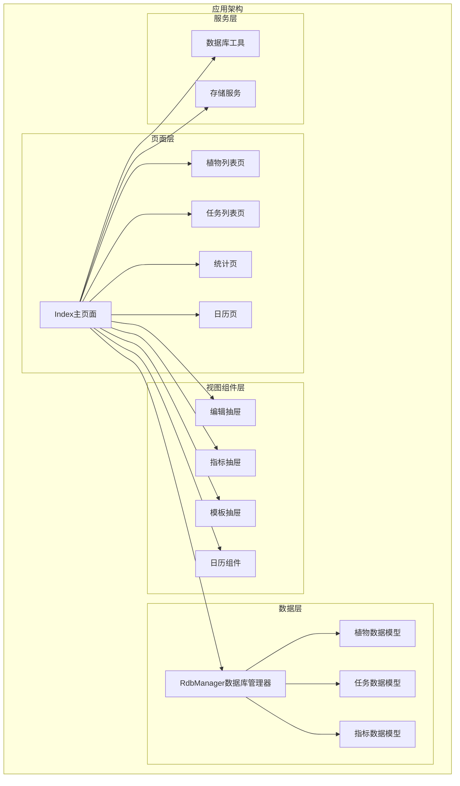
```mermaid
graph TB
subgraph "应用架构"
subgraph "页面层"
Index[Index主页面]
PlantList[植物列表页]
TaskList[任务列表页]
Stats[统计页]
Calendar[日历页]
end
subgraph "视图组件层"
EditSheet[编辑抽屉]
MetricSheet[指标抽屉]
TemplateSheet[模板抽屉]
CalendarSheet[日历组件]
end
subgraph "数据层"
RdbManager[RdbManager数据库管理器]
PlantModel[植物数据模型]
TaskModel[任务数据模型]
MetricModel[指标数据模型]
end
subgraph "服务层"
DbUtils[数据库工具]
Storage[存储服务]
end
end
Index --> PlantList
Index --> TaskList
Index --> Stats
Index --> Calendar
Index --> EditSheet
Index --> MetricSheet
Index --> TemplateSheet
Index --> CalendarSheet
Index --> RdbManager
RdbManager --> PlantModel
RdbManager --> TaskModel
RdbManager --> MetricModel
Index --> DbUtils
Index --> Storage
```

**图表来源**
- [Index.ets:1-50](file://entry/src/main/ets/pages/Index.ets#L1-L50)
- [RdbManager.ets:1-50](file://entry/src/main/ets/viewmodel/RdbManager.ets#L1-L50)

## 核心组件

### 页面状态管理

Index页面维护了丰富的状态管理机制，确保应用数据的一致性和响应性：

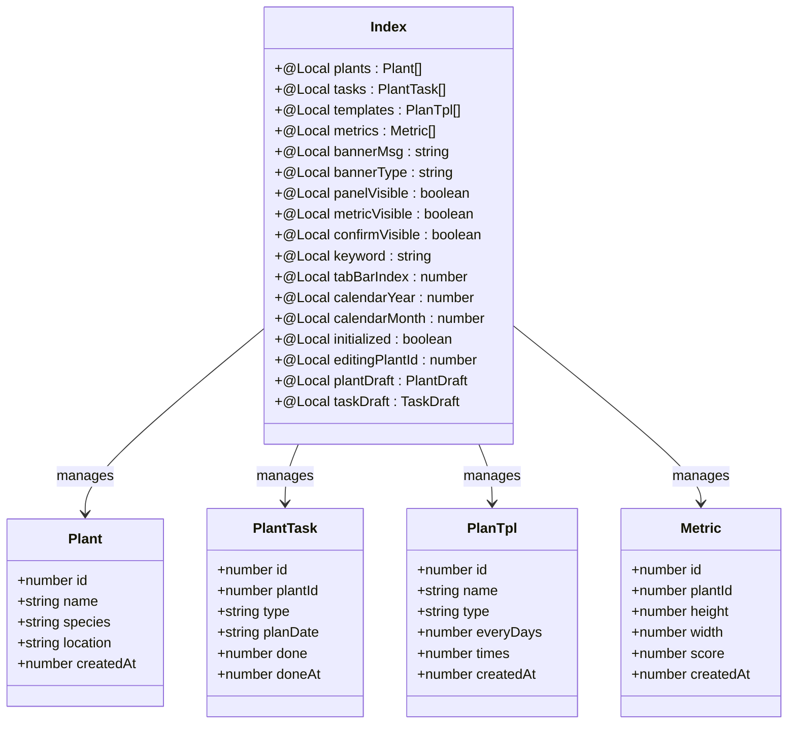
```mermaid
classDiagram
class Index {
+@Local plants : Plant[]
+@Local tasks : PlantTask[]
+@Local templates : PlanTpl[]
+@Local metrics : Metric[]
+@Local bannerMsg : string
+@Local bannerType : string
+@Local panelVisible : boolean
+@Local metricVisible : boolean
+@Local confirmVisible : boolean
+@Local keyword : string
+@Local tabBarIndex : number
+@Local calendarYear : number
+@Local calendarMonth : number
+@Local initialized : boolean
+@Local editingPlantId : number
+@Local plantDraft : PlantDraft
+@Local taskDraft : TaskDraft
}
class Plant {
+number id
+string name
+string species
+string location
+number createdAt
}
class PlantTask {
+number id
+number plantId
+string type
+string planDate
+number done
+number doneAt
}
class PlanTpl {
+number id
+string name
+string type
+number everyDays
+number times
+number createdAt
}
class Metric {
+number id
+number plantId
+number height
+number width
+number score
+number createdAt
}
Index --> Plant : manages
Index --> PlantTask : manages
Index --> PlanTpl : manages
Index --> Metric : manages
```

**图表来源**
- [Index.ets:41-112](file://entry/src/main/ets/pages/Index.ets#L41-L112)
- [PlantModel.ets:6-125](file://entry/src/main/ets/model/PlantModel.ets#L6-L125)

### 生命周期钩子

Index页面实现了完整的生命周期管理，确保应用启动时的正确初始化：

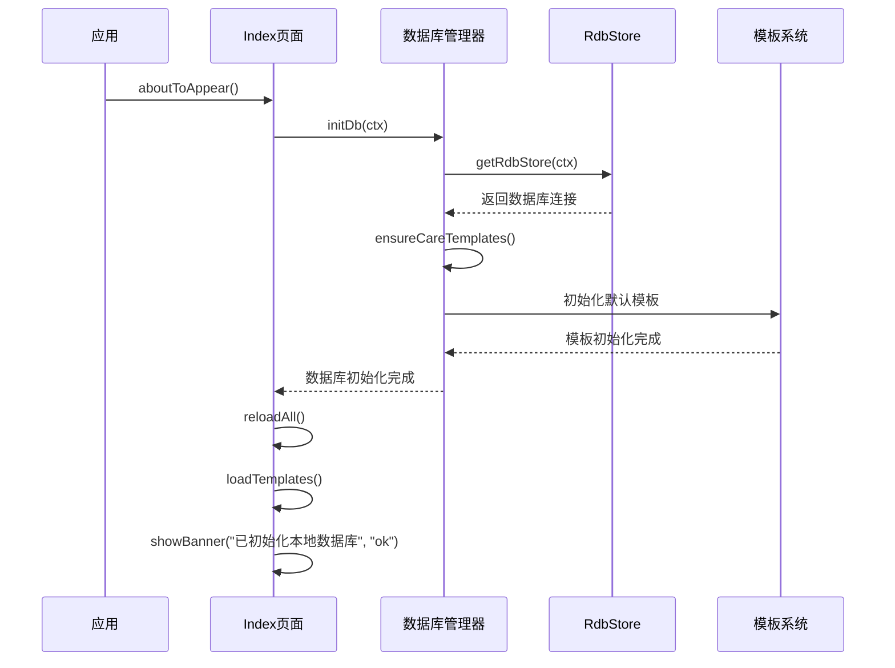
```mermaid
sequenceDiagram
participant App as 应用
participant Index as Index页面
participant RdbManager as 数据库管理器
participant Store as RdbStore
participant Templates as 模板系统
App->>Index : aboutToAppear()
Index->>RdbManager : initDb(ctx)
RdbManager->>Store : getRdbStore(ctx)
Store-->>RdbManager : 返回数据库连接
RdbManager->>RdbManager : ensureCareTemplates()
RdbManager->>Templates : 初始化默认模板
Templates-->>RdbManager : 模板初始化完成
RdbManager-->>Index : 数据库初始化完成
Index->>Index : reloadAll()
Index->>Index : loadTemplates()
Index->>Index : showBanner("已初始化本地数据库", "ok")
```

**图表来源**
- [Index.ets:115-135](file://entry/src/main/ets/pages/Index.ets#L115-L135)
- [RdbManager.ets:27-170](file://entry/src/main/ets/viewmodel/RdbManager.ets#L27-L170)

**章节来源**
- [Index.ets:115-135](file://entry/src/main/ets/pages/Index.ets#L115-L135)
- [Index.ets:41-112](file://entry/src/main/ets/pages/Index.ets#L41-L112)

## 架构概览

Index主页面采用了MVVM架构模式，通过Provider模式实现状态共享，通过事件驱动的方式处理用户交互。

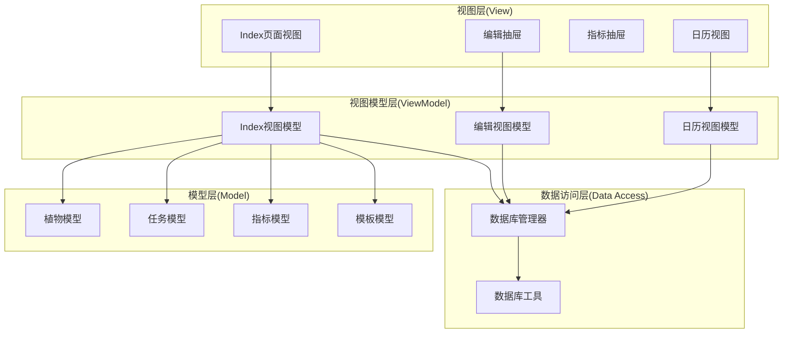
```mermaid
graph TB
subgraph "视图层(View)"
IndexView[Index页面视图]
EditSheet[编辑抽屉]
MetricSheet[指标抽屉]
CalendarView[日历视图]
end
subgraph "视图模型层(ViewModel)"
IndexVM[Index视图模型]
CalendarVM[日历视图模型]
EditVM[编辑视图模型]
end
subgraph "模型层(Model)"
PlantModel[植物模型]
TaskModel[任务模型]
MetricModel[指标模型]
TemplateModel[模板模型]
end
subgraph "数据访问层(Data Access)"
RdbManager[数据库管理器]
DbUtils[数据库工具]
end
IndexView --> IndexVM
EditSheet --> EditVM
CalendarView --> CalendarVM
IndexVM --> PlantModel
IndexVM --> TaskModel
IndexVM --> MetricModel
IndexVM --> TemplateModel
IndexVM --> RdbManager
EditVM --> RdbManager
CalendarVM --> RdbManager
RdbManager --> DbUtils
```

**图表来源**
- [Index.ets:855-1198](file://entry/src/main/ets/pages/Index.ets#L855-L1198)
- [RdbManager.ets:4-296](file://entry/src/main/ets/viewmodel/RdbManager.ets#L4-L296)

## 详细组件分析

### 数据库管理器

RdbManager是Index页面的核心数据管理组件，负责数据库的初始化、表结构管理和数据访问。

#### 数据库初始化

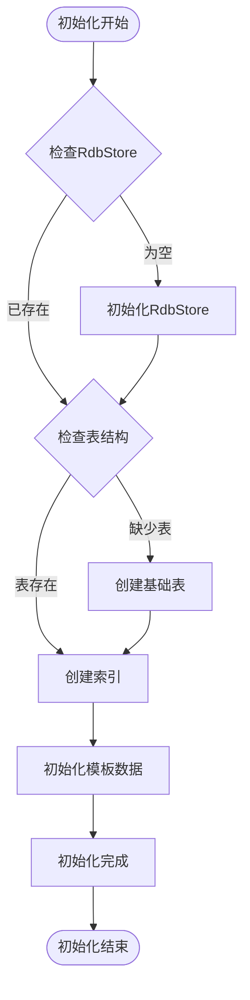
```mermaid
flowchart TD
Start([初始化开始]) --> CheckStore{检查RdbStore}
CheckStore --> |为空| InitStore[初始化RdbStore]
CheckStore --> |已存在| CheckTables{检查表结构}
InitStore --> CheckTables
CheckTables --> |缺少表| CreateTables[创建基础表]
CheckTables --> |表存在| CreateIndexes[创建索引]
CreateTables --> CreateIndexes
CreateIndexes --> SeedTemplates[初始化模板数据]
SeedTemplates --> Complete[初始化完成]
Complete --> End([初始化结束])
```

**图表来源**
- [RdbManager.ets:27-170](file://entry/src/main/ets/viewmodel/RdbManager.ets#L27-L170)

#### 数据库表结构

Index页面使用了以下核心数据表：

| 表名 | 描述 | 主要字段 |
|------|------|----------|
| plant | 植物信息表 | id, name, species, location, createdAt |
| task | 养护任务表 | id, plantId, type, planDate, done, doneAt |
| tpl | 周期模板表 | id, name, type, everyDays, times, createdAt |
| log | 日志表 | id, plantId, note, createdAt |
| metric | 指标表 | id, plantId, height, width, score, createdAt |
| log_photo | 日志照片表 | id, logId, path, thumbPath, createdAt |
| care_template | 养护模板表 | id, name, desc |
| care_rule | 养护规则表 | id, templateId, type, intervalDays, horizonDays |

**章节来源**
- [RdbManager.ets:36-129](file://entry/src/main/ets/viewmodel/RdbManager.ets#L36-L129)

### 植物管理API

Index页面提供了完整的植物CRUD操作接口：

#### 植物创建

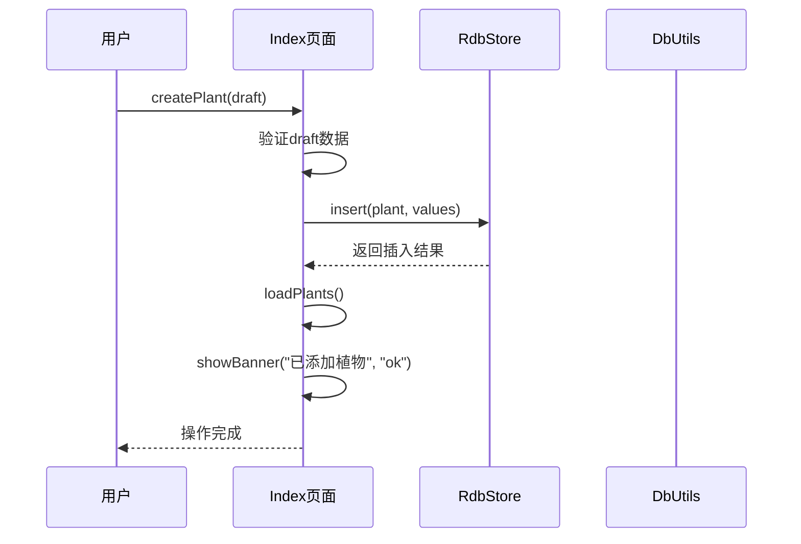
```mermaid
sequenceDiagram
participant User as 用户
participant Index as Index页面
participant Store as RdbStore
participant Utils as DbUtils
User->>Index : createPlant(draft)
Index->>Index : 验证draft数据
Index->>Store : insert(plant, values)
Store-->>Index : 返回插入结果
Index->>Index : loadPlants()
Index->>Index : showBanner("已添加植物", "ok")
Index-->>User : 操作完成
```

**图表来源**
- [Index.ets:287-302](file://entry/src/main/ets/pages/Index.ets#L287-L302)

#### 植物删除

植物删除操作采用了复杂的事务处理，确保数据一致性：

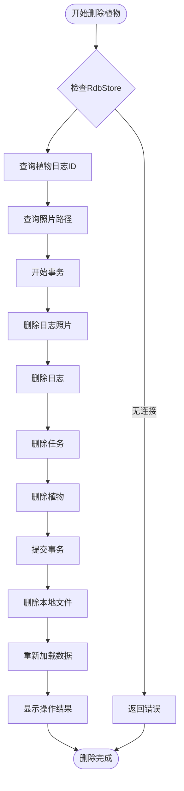
```mermaid
flowchart TD
Start([开始删除植物]) --> CheckStore{检查RdbStore}
CheckStore --> |无连接| Return[返回错误]
CheckStore --> GetLogIds[查询植物日志ID]
GetLogIds --> GetPhotoPaths[查询照片路径]
GetPhotoPaths --> BeginTx[开始事务]
BeginTx --> DeletePhotos[删除日志照片]
DeletePhotos --> DeleteLogs[删除日志]
DeleteLogs --> DeleteTasks[删除任务]
DeleteTasks --> DeletePlants[删除植物]
DeletePlants --> CommitTx[提交事务]
CommitTx --> DeleteFiles[删除本地文件]
DeleteFiles --> ReloadData[重新加载数据]
ReloadData --> ShowBanner[显示操作结果]
ShowBanner --> End([删除完成])
Return --> End
```

**图表来源**
- [Index.ets:319-402](file://entry/src/main/ets/pages/Index.ets#L319-L402)

**章节来源**
- [Index.ets:287-402](file://entry/src/main/ets/pages/Index.ets#L287-L402)

### 任务管理API

Index页面实现了灵活的任务管理系统，支持多种任务类型和批量操作。

#### 任务创建

任务创建遵循唯一性约束，避免重复任务：

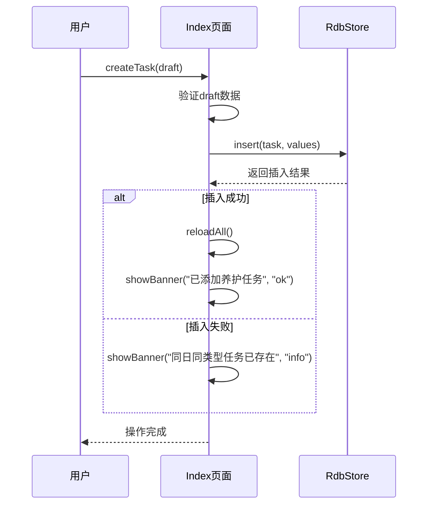
```mermaid
sequenceDiagram
participant User as 用户
participant Index as Index页面
participant Store as RdbStore
User->>Index : createTask(draft)
Index->>Index : 验证draft数据
Index->>Store : insert(task, values)
Store-->>Index : 返回插入结果
alt 插入成功
Index->>Index : reloadAll()
Index->>Index : showBanner("已添加养护任务", "ok")
else 插入失败
Index->>Index : showBanner("同日同类型任务已存在", "info")
end
Index-->>User : 操作完成
```

**图表来源**
- [Index.ets:405-425](file://entry/src/main/ets/pages/Index.ets#L405-L425)

#### 任务状态切换

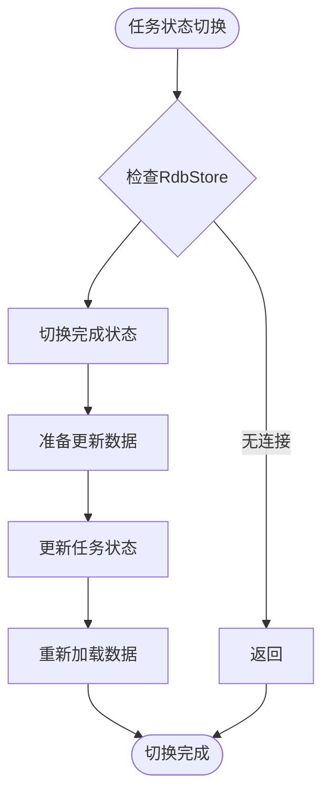
```mermaid
flowchart TD
Start([任务状态切换]) --> CheckStore{检查RdbStore}
CheckStore --> |无连接| Return[返回]
CheckStore --> ToggleState[切换完成状态]
ToggleState --> UpdateValues[准备更新数据]
UpdateValues --> UpdateTask[更新任务状态]
UpdateTask --> ReloadData[重新加载数据]
ReloadData --> End([切换完成])
Return --> End
```

**图表来源**
- [Index.ets:427-437](file://entry/src/main/ets/pages/Index.ets#L427-L437)

**章节来源**
- [Index.ets:405-437](file://entry/src/main/ets/pages/Index.ets#L405-L437)

### 模板系统API

Index页面提供了两套模板系统：传统周期模板和新的养护模板系统。

#### 周期模板管理

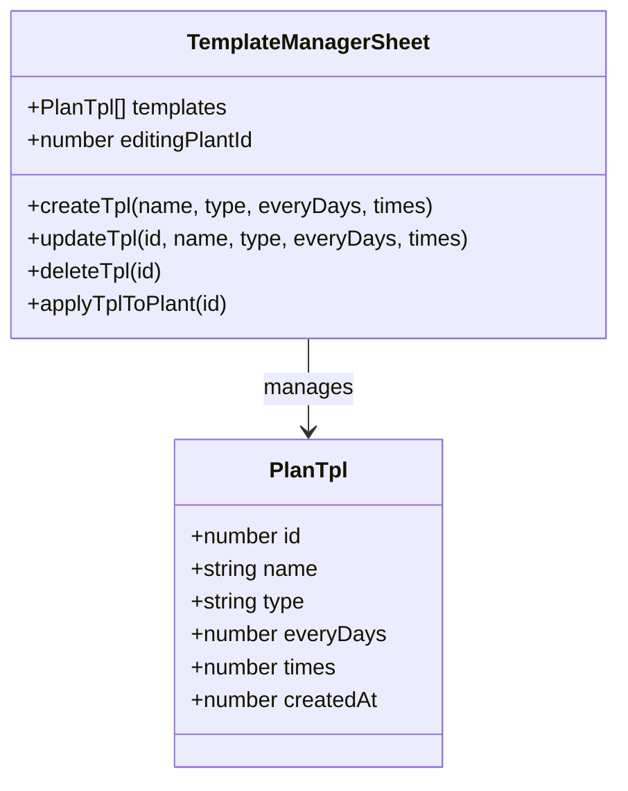
```mermaid
classDiagram
class PlanTpl {
+number id
+string name
+string type
+number everyDays
+number times
+number createdAt
}
class TemplateManagerSheet {
+PlanTpl[] templates
+number editingPlantId
+createTpl(name, type, everyDays, times)
+updateTpl(id, name, type, everyDays, times)
+deleteTpl(id)
+applyTplToPlant(id)
}
TemplateManagerSheet --> PlanTpl : manages
```

**图表来源**
- [Index.ets:579-646](file://entry/src/main/ets/pages/Index.ets#L579-L646)
- [PlantModel.ets:24-40](file://entry/src/main/ets/model/PlantModel.ets#L24-L40)

#### 养护模板系统

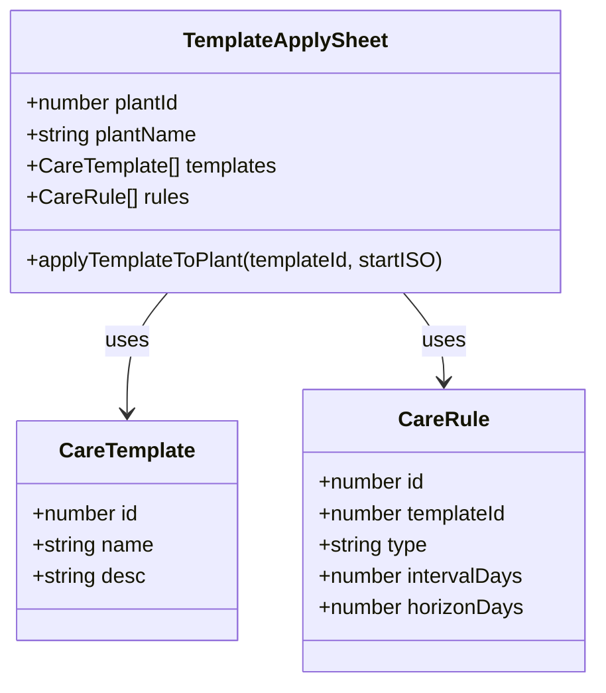
```mermaid
classDiagram
class CareTemplate {
+number id
+string name
+string desc
}
class CareRule {
+number id
+number templateId
+string type
+number intervalDays
+number horizonDays
}
class TemplateApplySheet {
+number plantId
+string plantName
+CareTemplate[] templates
+CareRule[] rules
+applyTemplateToPlant(templateId, startISO)
}
TemplateApplySheet --> CareTemplate : uses
TemplateApplySheet --> CareRule : uses
```

**图表来源**
- [Index.ets:776-852](file://entry/src/main/ets/pages/Index.ets#L776-L852)
- [PlantModel.ets:150-163](file://entry/src/main/ets/model/PlantModel.ets#L150-L163)

**章节来源**
- [Index.ets:579-852](file://entry/src/main/ets/pages/Index.ets#L579-L852)

### 指标抽屉API

Index页面集成了完整的植物指标管理系统，提供便捷的指标录入和查看功能。

#### 指标数据管理

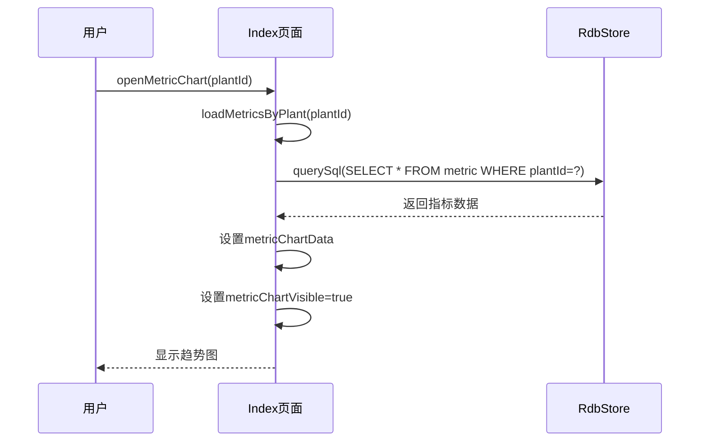
```mermaid
sequenceDiagram
participant User as 用户
participant Index as Index页面
participant Store as RdbStore
User->>Index : openMetricChart(plantId)
Index->>Index : loadMetricsByPlant(plantId)
Index->>Store : querySql(SELECT * FROM metric WHERE plantId=?)
Store-->>Index : 返回指标数据
Index->>Index : 设置metricChartData
Index->>Index : 设置metricChartVisible=true
Index-->>User : 显示趋势图
```

**图表来源**
- [Index.ets:198-204](file://entry/src/main/ets/pages/Index.ets#L198-L204)

#### 指标CRUD操作

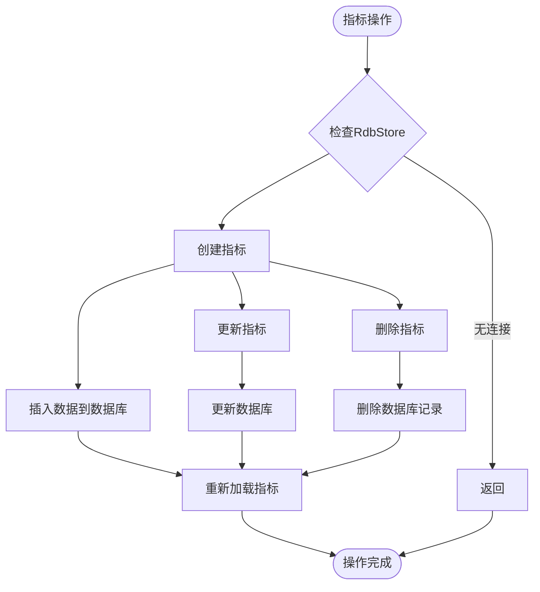
```mermaid
flowchart TD
Start([指标操作]) --> CheckStore{检查RdbStore}
CheckStore --> |无连接| Return[返回]
CheckStore --> CreateMetric[创建指标]
CreateMetric --> InsertData[插入数据到数据库]
InsertData --> LoadMetrics[重新加载指标]
LoadMetrics --> End([操作完成])
Return --> End
CreateMetric --> UpdateMetric[更新指标]
UpdateMetric --> UpdateData[更新数据库]
UpdateData --> LoadMetrics
CreateMetric --> DeleteMetric[删除指标]
DeleteMetric --> DeleteData[删除数据库记录]
DeleteData --> LoadMetrics
```

**图表来源**
- [Index.ets:224-284](file://entry/src/main/ets/pages/Index.ets#L224-L284)

**章节来源**
- [Index.ets:198-284](file://entry/src/main/ets/pages/Index.ets#L198-L284)

### 日历功能API

Index页面集成了强大的日历功能，提供月视图、任务筛选和快速添加等特性。

#### 日历组件架构

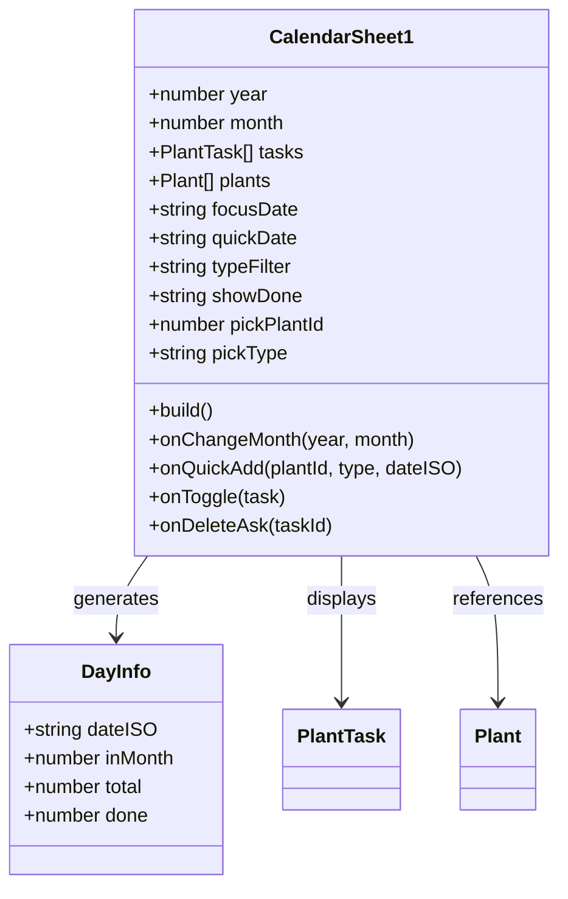
```mermaid
classDiagram
class CalendarSheet1 {
+number year
+number month
+PlantTask[] tasks
+Plant[] plants
+string focusDate
+string quickDate
+string typeFilter
+string showDone
+number pickPlantId
+string pickType
+build()
+onChangeMonth(year, month)
+onQuickAdd(plantId, type, dateISO)
+onToggle(task)
+onDeleteAsk(taskId)
}
class DayInfo {
+string dateISO
+number inMonth
+number total
+number done
}
CalendarSheet1 --> DayInfo : generates
CalendarSheet1 --> PlantTask : displays
CalendarSheet1 --> Plant : references
```

**图表来源**
- [CalendarSheet.ets:17-48](file://entry/src/main/ets/pages/CalendarSheet.ets#L17-L48)

#### 日历渲染流程

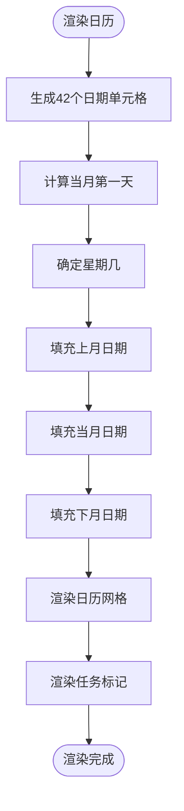
```mermaid
flowchart TD
Start([渲染日历]) --> BuildCells[生成42个日期单元格]
BuildCells --> FirstDay[计算当月第一天]
FirstDay --> Weekday[确定星期几]
Weekday --> PreviousMonth[填充上月日期]
PreviousMonth --> CurrentMonth[填充当月日期]
CurrentMonth --> NextMonth[填充下月日期]
NextMonth --> RenderGrid[渲染日历网格]
RenderGrid --> RenderTasks[渲染任务标记]
RenderTasks --> End([渲染完成])
```

**图表来源**
- [CalendarSheet.ets:418-453](file://entry/src/main/ets/pages/CalendarSheet.ets#L418-L453)

**章节来源**
- [CalendarSheet.ets:17-504](file://entry/src/main/ets/pages/CalendarSheet.ets#L17-L504)

### 用户界面组件API

Index页面集成了多个自定义组件，提供丰富的用户体验。

#### 编辑抽屉组件

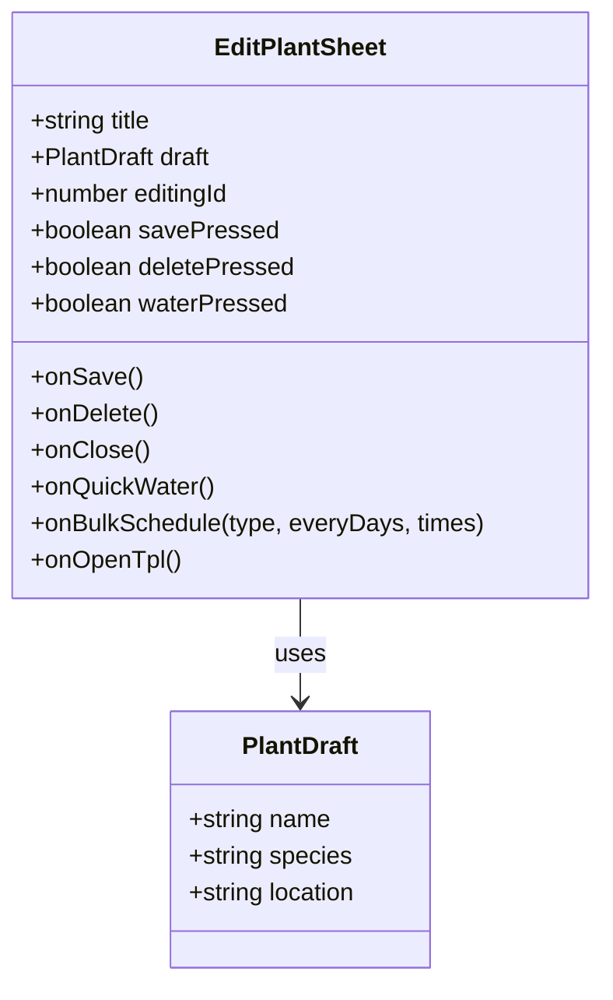
```mermaid
classDiagram
class EditPlantSheet {
+string title
+PlantDraft draft
+number editingId
+boolean savePressed
+boolean deletePressed
+boolean waterPressed
+onSave()
+onDelete()
+onClose()
+onQuickWater()
+onBulkSchedule(type, everyDays, times)
+onOpenTpl()
}
class PlantDraft {
+string name
+string species
+string location
}
EditPlantSheet --> PlantDraft : uses
```

**图表来源**
- [EditPlantSheet.ets:5-16](file://entry/src/main/ets/view/EditPlantSheet.ets#L5-L16)

#### 指标抽屉组件

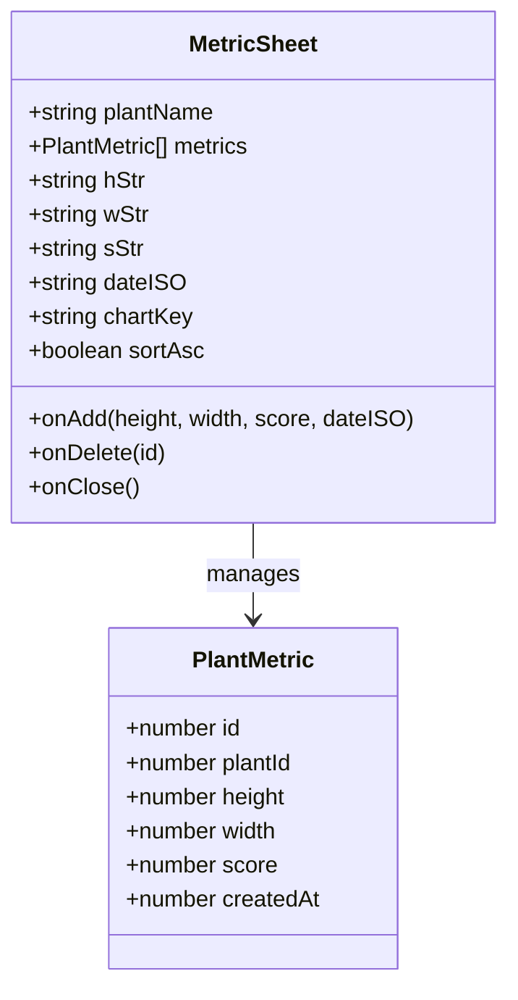
```mermaid
classDiagram
class MetricSheet {
+string plantName
+PlantMetric[] metrics
+string hStr
+string wStr
+string sStr
+string dateISO
+string chartKey
+boolean sortAsc
+onAdd(height, width, score, dateISO)
+onDelete(id)
+onClose()
}
class PlantMetric {
+number id
+number plantId
+number height
+number width
+number score
+number createdAt
}
MetricSheet --> PlantMetric : manages
```

**图表来源**
- [MetricSheet.ets:5-11](file://entry/src/main/ets/view/MetricSheet.ets#L5-L11)

**章节来源**
- [EditPlantSheet.ets:5-264](file://entry/src/main/ets/view/EditPlantSheet.ets#L5-L264)
- [MetricSheet.ets:5-491](file://entry/src/main/ets/view/MetricSheet.ets#L5-L491)

## 依赖关系分析

Index主页面的依赖关系体现了清晰的分层架构：

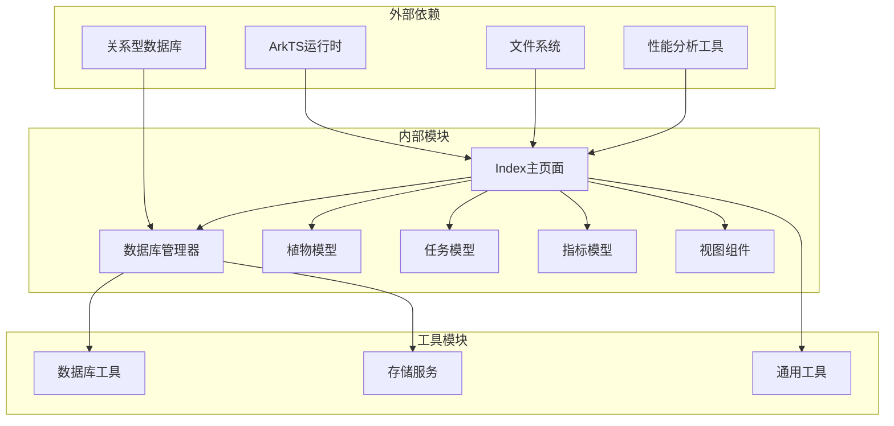
```mermaid
graph TB
subgraph "外部依赖"
ArkTS[ArkTS运行时]
RelationalStore[关系型数据库]
FileSystem[文件系统]
PerformanceAnalysisKit[性能分析工具]
end
subgraph "内部模块"
Index[Index主页面]
RdbManager[数据库管理器]
PlantModel[植物模型]
TaskModel[任务模型]
MetricModel[指标模型]
ViewComponents[视图组件]
end
subgraph "工具模块"
DbUtils[数据库工具]
Storage[存储服务]
Utils[通用工具]
end
ArkTS --> Index
RelationalStore --> RdbManager
FileSystem --> Index
PerformanceAnalysisKit --> Index
Index --> RdbManager
Index --> PlantModel
Index --> TaskModel
Index --> MetricModel
Index --> ViewComponents
RdbManager --> DbUtils
RdbManager --> Storage
Index --> Utils
```

**图表来源**
- [Index.ets:1-35](file://entry/src/main/ets/pages/Index.ets#L1-L35)
- [RdbManager.ets:1-3](file://entry/src/main/ets/viewmodel/RdbManager.ets#L1-L3)

### 数据流分析

Index页面实现了双向数据绑定和状态同步机制：

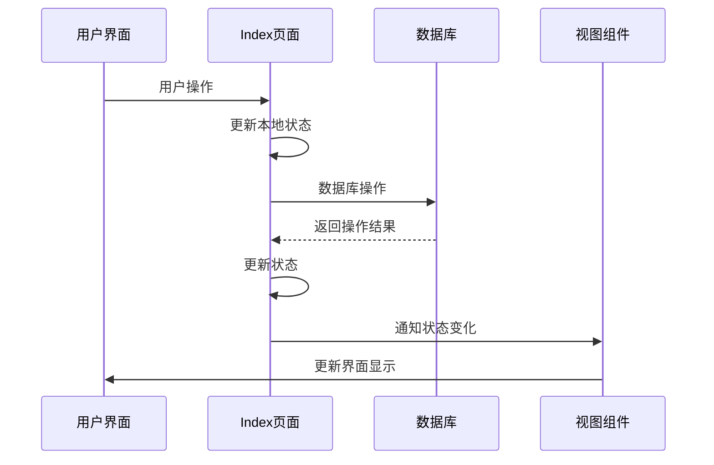
```mermaid
sequenceDiagram
participant UI as 用户界面
participant Index as Index页面
participant Store as 数据库
participant Components as 视图组件
UI->>Index : 用户操作
Index->>Index : 更新本地状态
Index->>Store : 数据库操作
Store-->>Index : 返回操作结果
Index->>Index : 更新状态
Index->>Components : 通知状态变化
Components->>UI : 更新界面显示
```

**图表来源**
- [Index.ets:855-1198](file://entry/src/main/ets/pages/Index.ets#L855-L1198)

**章节来源**
- [Index.ets:1-35](file://entry/src/main/ets/pages/Index.ets#L1-L35)
- [Index.ets:855-1198](file://entry/src/main/ets/pages/Index.ets#L855-L1198)

## 性能考虑

### 数据库优化

Index页面采用了多项数据库优化策略：

1. **索引优化**：为常用查询字段建立复合索引
2. **事务处理**：使用事务确保数据一致性
3. **批量操作**：支持批量插入和更新操作
4. **内存管理**：合理控制数据加载数量

### 界面性能

1. **懒加载**：组件按需加载
2. **状态缓存**：避免重复计算
3. **动画优化**：使用硬件加速
4. **内存回收**：及时释放不需要的对象

### 网络和存储

1. **文件系统操作**：异步处理文件删除
2. **数据库连接池**：复用数据库连接
3. **数据压缩**：存储时进行数据压缩

## 故障排除指南

### 常见问题及解决方案

#### 数据库初始化失败

**症状**：应用启动时显示数据库初始化失败

**原因**：
1. 数据库文件损坏
2. 权限不足
3. 存储空间不足

**解决方案**：
1. 检查数据库文件完整性
2. 确认应用具有文件访问权限
3. 清理存储空间

#### 数据同步问题

**症状**：植物列表和任务列表显示不一致

**原因**：
1. 状态更新延迟
2. 数据库连接异常
3. 网络同步失败

**解决方案**：
1. 调用`reloadAll()`方法强制刷新
2. 检查网络连接状态
3. 重启应用

#### 性能问题

**症状**：界面响应缓慢

**原因**：
1. 数据量过大
2. 组件渲染过多
3. 内存泄漏

**解决方案**：
1. 实施数据分页
2. 优化组件渲染
3. 检查内存使用情况

**章节来源**
- [Index.ets:116-125](file://entry/src/main/ets/pages/Index.ets#L116-L125)

## 结论

Index主页面作为PlantDiary应用的核心入口，展现了优秀的架构设计和实现质量。通过采用MVVM模式、Provider状态管理和组件化开发，实现了数据的一致性、界面的响应性和系统的可维护性。

该页面的主要优势包括：

1. **完整的功能覆盖**：涵盖了植物管理、任务调度、指标跟踪、日历视图等核心功能
2. **良好的架构设计**：清晰的分层结构和依赖关系
3. **完善的错误处理**：健壮的异常处理和恢复机制
4. **优秀的用户体验**：流畅的动画效果和直观的操作界面
5. **高效的性能表现**：合理的数据缓存和优化策略

通过持续的代码审查和性能优化，Index页面为PlantDiary应用提供了稳定可靠的基础平台，为用户提供了优质的植物养护管理体验。