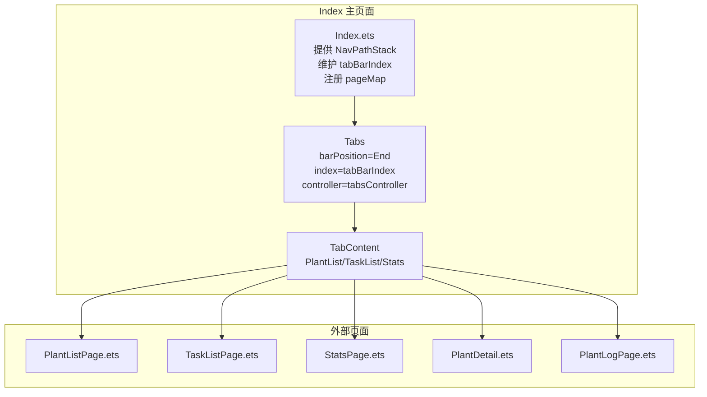
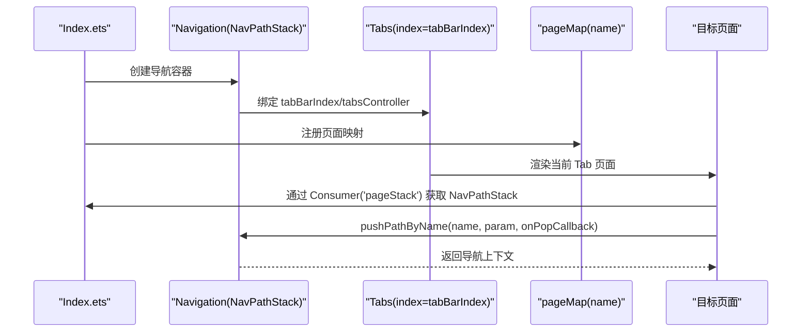
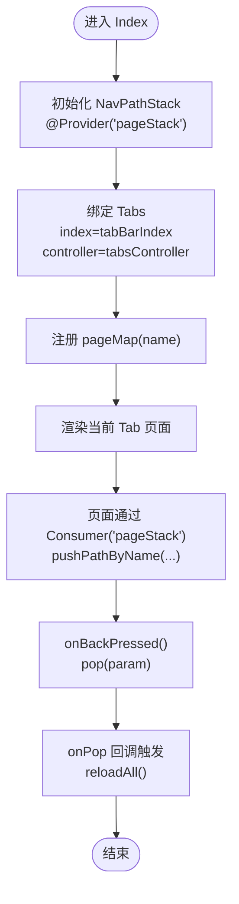
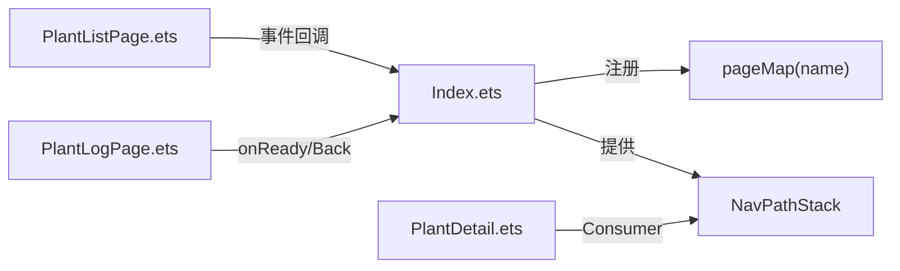

# 导航API

<cite>
**本文档引用的文件**
- [Index.ets](file://entry/src/main/ets/pages/Index.ets)
- [PlantListPage.ets](file://entry/src/main/ets/pages/PlantListPage.ets)
- [StatsPage.ets](file://entry/src/main/ets/pages/StatsPage.ets)
- [TaskListPage.ets](file://entry/src/main/ets/pages/TaskListPage.ets)
- [PlantDetail.ets](file://entry/src/main/ets/pages/PlantDetail.ets)
- [PlantLogPage.ets](file://entry/src/main/ets/pages/PlantLogPage.ets)
- [CalendarSheet.ets](file://entry/src/main/ets/pages/CalendarSheet.ets)
- [PlantCard.ets](file://entry/src/main/ets/view/PlantCard.ets)
- [PlantModel.ets](file://entry/src/main/ets/model/PlantModel.ets)
</cite>

## 目录
1. [简介](#简介)
2. [项目结构](#项目结构)
3. [核心组件](#核心组件)
4. [架构总览](#架构总览)
5. [详细组件分析](#详细组件分析)
6. [依赖关系分析](#依赖关系分析)
7. [性能考虑](#性能考虑)
8. [故障排查指南](#故障排查指南)
9. [结论](#结论)
10. [附录](#附录)

## 简介
本文件系统性梳理 Index 主页面的导航 API，涵盖：
- Tab 切换控制（tabBarIndex）
- 页面栈管理（NavPathStack）
- 外部页面访问（PlantListPage、StatsPage、TaskListPage 等）
- 导航参数传递与页面栈生命周期
- 最佳实践、性能优化与用户体验建议
- 导航方法说明、参数类型与实际使用示例

## 项目结构
Index 主页面作为导航容器，承载以下职责：
- 提供全局页面栈 NavPathStack
- 维护 Tab 切换控制器与索引
- 统一注册页面映射，屏蔽具体页面实例化细节
- 作为共享数据 Provider，向下传递全局状态与事件

**图表来源**
- [Index.ets:855-1198](file://entry/src/main/ets/pages/Index.ets#L855-L1198)
- [Index.ets:1200-1220](file://entry/src/main/ets/pages/Index.ets#L1200-L1220)

**章节来源**
- [Index.ets:40-47](file://entry/src/main/ets/pages/Index.ets#L40-L47)
- [Index.ets:855-1198](file://entry/src/main/ets/pages/Index.ets#L855-L1198)
- [Index.ets:1200-1220](file://entry/src/main/ets/pages/Index.ets#L1200-L1220)

## 核心组件
- 导航容器与页面栈
  - Index 提供 @Provider('pageStack') NavPathStack 实例，供全应用消费
  - 通过 Navigation(this.pageStack) 构建导航栈，支持 push/pop 与页面映射
- Tab 控制
  - @Local tabBarIndex 控制当前 Tab
  - @Local tabsController 控制 Tabs 切换
- 页面映射
  - pageMap(name: string) 统一注册页面名称到组件的映射，避免子页面自行实例化

**章节来源**
- [Index.ets:40-47](file://entry/src/main/ets/pages/Index.ets#L40-L47)
- [Index.ets:855-1198](file://entry/src/main/ets/pages/Index.ets#L855-L1198)
- [Index.ets:1200-1220](file://entry/src/main/ets/pages/Index.ets#L1200-L1220)

## 架构总览
Index 作为导航中枢，向上承载 Tabs 与页面栈，向下连接多个业务页面。外部页面通过 NavDestination 包裹，使用 Consumer('pageStack') 获取页面栈实例，实现 push/pop。

**图表来源**
- [Index.ets:855-1198](file://entry/src/main/ets/pages/Index.ets#L855-L1198)
- [Index.ets:1200-1220](file://entry/src/main/ets/pages/Index.ets#L1200-L1220)

## 详细组件分析

### Index 主页面导航
- 导航容器与页面栈
  - 使用 Navigation(this.pageStack) 构建导航栈，设置 mode(NavigationMode.Stack)
  - 通过 navDestination(this.pageMap) 注册页面映射
- Tab 切换
  - tabBarIndex 控制当前 Tab
  - tabsController.changeIndex(idx) 同步 Tabs 索引
- 页面映射
  - pageMap(name) 统一注册 PlantLogPage、EmergencyAndRotatePage、LightExposurePage、GrowthComparePage、GrowthIndicatorPage、PlantDetail、MixPlannerPage、WaterEstimatorPage 等

**图表来源**
- [Index.ets:855-1198](file://entry/src/main/ets/pages/Index.ets#L855-L1198)
- [Index.ets:1200-1220](file://entry/src/main/ets/pages/Index.ets#L1200-L1220)

**章节来源**
- [Index.ets:855-1198](file://entry/src/main/ets/pages/Index.ets#L855-L1198)
- [Index.ets:1200-1220](file://entry/src/main/ets/pages/Index.ets#L1200-L1220)

### PlantListPage 列表页导航
- 参数与事件
  - @Param @Require plants: Array<Plant>
  - @Param @Require allTasks: Array<PlantTask>
  - @Event onOpenDetail: (p: Plant) => void
  - @Event onOpenLogs: (p: Plant) => void
  - @Event onOpenMetrics: (p: Plant) => void
  - @Event onOpenEmergencyAndRotate: (p: Plant) => void
  - @Event onOpenWaterEstimator: (p: Plant) => void
  - @Event onOpenTemplate: (p: Plant) => void
  - @Event onOpenTemplatenew: (pid: number) => void
  - @Event onOpenMetric: (plantId: number) => void
- 导航行为
  - PlantCard 通过事件回调触发 Index 的页面栈操作，实现跳转至 PlantDetail、PlantLogPage、指标页等

**章节来源**
- [PlantListPage.ets:5-20](file://entry/src/main/ets/pages/PlantListPage.ets#L5-L20)
- [PlantCard.ets:13-22](file://entry/src/main/ets/view/PlantCard.ets#L13-L22)

### StatsPage 统计页导航
- 参数与事件
  - @Param @Require plants: Array<Plant>
  - @Param @Require tasks: Array<PlantTask>
  - @Event onReloadAll: () => void
  - @Event onOpenMixPlanner: (p: Plant) => void
  - @Consumer('pageStack') pageStack: NavPathStack
- 导航行为
  - 通过 pageStack.pushPathByName('PlantDetail', ...) 实现跳转
  - 刷新入口回调 onReloadAll，触发首页重载

**章节来源**
- [StatsPage.ets:5-11](file://entry/src/main/ets/pages/StatsPage.ets#L5-L11)

### TaskListPage 任务页导航
- 参数与事件
  - @Param @Require tasks: Array<PlantTask>
  - @Param @Require plants: Array<Plant>
  - @Event onToggle: (pt: PlantTask) => void
  - @Event onDeleteAsk: (taskId: number) => void
  - @Event onCreateTask: (plantId: number, type: string, dateISO: string) => void
- 导航行为
  - 任务页内部维护视图模式与筛选状态，通过事件回调与 Index 共享状态联动

**章节来源**
- [TaskListPage.ets:6-30](file://entry/src/main/ets/pages/TaskListPage.ets#L6-L30)

### PlantDetail 详情页导航
- 参数与事件
  - @Param @Require pageStack: NavPathStack
  - @Param @Require plant: Plant
- 导航行为
  - 通过 pageStack.pushPathByName('PlantLogPage', plantId, ...) 跳转至日志页
  - 通过 pageStack.pushPathByName('LightExposurePage', plant, ...) 跳转至光照页
  - 通过 pageStack.pushPathByName('GrowthIndicatorPage', plant, ...) 跳转至指标页
  - 通过 pageStack.pushPathByName('GrowthComparePage', plant, ...) 跳转至对比页
  - 通过 pageStack.pushPathByName('WaterEstimatorPage', plantId, ...) 跳转至估算器页
  - 通过 pageStack.pushPathByName('EmergencyAndRotatePage', plantId, ...) 跳转至应急与轮换页

**章节来源**
- [PlantDetail.ets:5-106](file://entry/src/main/ets/pages/PlantDetail.ets#L5-L106)

### PlantLogPage 日志页导航
- 参数与事件
  - @Consumer('pageStack') pageStack: NavPathStack
  - @Consumer('RdbManager') RdbManager: RdbManager
  - @Consumer('store') store: relationalStore.RdbStore
- 导航行为
  - 通过 pageStack.pop(plantId) 实现返回
  - onReady 中读取 pathInfo.param 作为 plantId，加载日志与照片

**章节来源**
- [PlantLogPage.ets:14-660](file://entry/src/main/ets/pages/PlantLogPage.ets#L14-L660)

### CalendarSheet 日历面板导航
- 参数与事件
  - @Param @Require year: number
  - @Param @Require month: number
  - @Param @Require tasks: Array<PlantTask>
  - @Param @Require plants: Array<Plant>
  - @Event onChangeMonth: (year: number, month: number) => void
  - @Event onQuickAdd: (plantId: number, type: string, dateISO: string) => void
  - @Event onToggle: (t: PlantTask) => void
  - @Event onClose: () => void
  - @Event onDeleteAsk: (tid: number) => void
- 导航行为
  - 通过事件回调 onQuickAdd/onToggle 等与 Index 共享状态联动
  - 支持快速添加任务并跳转到相应页面

**章节来源**
- [CalendarSheet.ets:17-504](file://entry/src/main/ets/pages/CalendarSheet.ets#L17-L504)

## 依赖关系分析
- Index 对外部页面的依赖
  - 通过 pageMap(name) 统一注册，避免直接依赖具体页面实例
  - 通过 NavPathStack 实现页面间解耦
- 页面间通信
  - PlantListPage 通过事件回调触发 Index 的页面栈操作
  - PlantDetail 通过 Consumer('pageStack') 直接调用 pushPathByName
  - PlantLogPage 通过 onReady 读取参数，通过 onBackPressed pop 返回

**图表来源**
- [Index.ets:1200-1220](file://entry/src/main/ets/pages/Index.ets#L1200-L1220)
- [PlantListPage.ets:13-178](file://entry/src/main/ets/pages/PlantListPage.ets#L13-L178)
- [PlantDetail.ets:5-106](file://entry/src/main/ets/pages/PlantDetail.ets#L5-L106)
- [PlantLogPage.ets:638-660](file://entry/src/main/ets/pages/PlantLogPage.ets#L638-L660)

**章节来源**
- [Index.ets:1200-1220](file://entry/src/main/ets/pages/Index.ets#L1200-L1220)
- [PlantListPage.ets:13-178](file://entry/src/main/ets/pages/PlantListPage.ets#L13-L178)
- [PlantDetail.ets:5-106](file://entry/src/main/ets/pages/PlantDetail.ets#L5-L106)
- [PlantLogPage.ets:638-660](file://entry/src/main/ets/pages/PlantLogPage.ets#L638-L660)

## 性能考虑
- 页面栈管理
  - 使用 NavPathStack 统一管理页面栈，避免手动维护复杂状态
  - 在 onPop 回调中触发 reloadAll，确保数据一致性
- 渲染优化
  - PlantListPage/TaskListPage 内部维护筛选与排序状态，减少重复计算
  - 使用动画与过渡提升交互体验
- 数据一致性
  - Index 在页面返回时统一重载植物与任务数据，避免跨页面状态不一致

[本节为通用指导，无需特定文件引用]

## 故障排查指南
- 页面无法返回
  - 检查 PlantLogPage.onBackPressed 是否正确调用 pageStack.pop(param)
- 参数传递异常
  - 确认 PlantDetail.onReady 中正确读取 pathInfo.param
  - 确认 PlantListPage 事件回调中传递的参数类型与目标页面期望一致
- Tab 切换无效
  - 检查 Index.tabBarIndex 与 tabsController.changeIndex(idx) 是否同步更新
- 页面映射未生效
  - 确认 pageMap(name) 中是否包含目标页面名称

**章节来源**
- [PlantLogPage.ets:638-660](file://entry/src/main/ets/pages/PlantLogPage.ets#L638-L660)
- [PlantDetail.ets:32-35](file://entry/src/main/ets/pages/PlantDetail.ets#L32-L35)
- [Index.ets:1300-1308](file://entry/src/main/ets/pages/Index.ets#L1300-L1308)
- [Index.ets:1200-1220](file://entry/src/main/ets/pages/Index.ets#L1200-L1220)

## 结论
Index 主页面通过统一的导航容器、页面栈与页面映射，实现了清晰的页面间导航与参数传递机制。配合事件驱动的页面间通信与生命周期回调，既保证了用户体验，又提升了代码的可维护性与扩展性。

[本节为总结性内容，无需特定文件引用]

## 附录

### 导航方法与参数说明
- pushPathByName(name, param?, onPop?)
  - 用途：向页面栈推送新页面
  - 参数：
    - name: 目标页面名称（字符串）
    - param: 传递给目标页面的参数（可选）
    - onPop: 页面返回时的回调（可选）
- pop(param?)
  - 用途：从页面栈弹出当前页面
  - 参数：
    - param: 返回时携带的参数（可选）

**章节来源**
- [PlantDetail.ets:78-106](file://entry/src/main/ets/pages/PlantDetail.ets#L78-L106)
- [PlantLogPage.ets:645-648](file://entry/src/main/ets/pages/PlantLogPage.ets#L645-L648)

### 导航最佳实践
- 使用统一的 pageMap(name) 注册页面，避免硬编码页面实例
- 在 Index 中集中管理页面栈与 Tab 状态，降低页面间耦合
- 通过事件回调与 Consumer('pageStack') 实现页面间通信
- 在页面返回时使用 onPop 回调触发数据重载，确保状态一致

**章节来源**
- [Index.ets:1200-1220](file://entry/src/main/ets/pages/Index.ets#L1200-L1220)
- [PlantListPage.ets:13-178](file://entry/src/main/ets/pages/PlantListPage.ets#L13-L178)
- [PlantDetail.ets:5-106](file://entry/src/main/ets/pages/PlantDetail.ets#L5-L106)