# 任务数据管理

<cite>
**本文引用的文件**
- [Index.ets](file://entry/src/main/ets/pages/Index.ets)
- [TaskListPage.ets](file://entry/src/main/ets/pages/TaskListPage.ets)
- [PlantModel.ets](file://entry/src/main/ets/model/PlantModel.ets)
- [RdbManager.ets](file://entry/src/main/ets/viewmodel/RdbManager.ets)
- [DbUtils.ets](file://entry/src/main/ets/model/DbUtils.ets)
- [TaskItem.ets](file://entry/src/main/ets/view/TaskItem.ets)
- [DayTaskSheet.ets](file://entry/src/main/ets/view/DayTaskSheet.ets)
- [err.ets](file://entry/src/main/ets/viewmodel/err.ets)
</cite>

## 目录
1. [简介](#简介)
2. [项目结构](#项目结构)
3. [核心组件](#核心组件)
4. [架构总览](#架构总览)
5. [详细组件分析](#详细组件分析)
6. [依赖关系分析](#依赖关系分析)
7. [性能考量](#性能考量)
8. [故障排查指南](#故障排查指南)
9. [结论](#结论)
10. [附录](#附录)

## 简介
本文件面向任务数据管理API，系统化梳理任务的CRUD能力与相关机制，包括：
- 任务列表查询：loadTasks
- 任务创建：createTask
- 任务完成状态切换：toggleTaskDone
- 任务删除：deleteTask
- 批量生成周期任务：bulkCreateRecurringTasks
- 数据模型映射：PlantTask、TaskDraft
- 唯一性约束与冲突处理
- 任务状态管理：done/doneAt 字段
- 任务筛选与排序机制
- 参数说明、异常处理与使用示例
- 任务去重逻辑与批量操作优化

## 项目结构
围绕任务管理的关键模块与职责如下：
- 页面与视图：Index（应用中枢）、TaskListPage（任务列表）、TaskItem（单项任务）、DayTaskSheet（日任务抽屉）
- 数据模型：PlantTask（任务实体）、TaskDraft（任务草稿）
- 数据库管理：RdbManager（建表、索引、唯一约束）
- 事务工具：DbUtils（统一事务封装）
- 错误与批量操作参考：err.ets（批量切换/删除的事务实现思路）

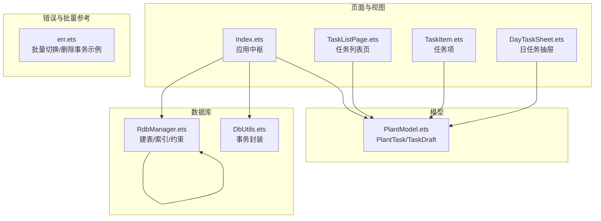

**图表来源**
- [Index.ets:1-120](file://entry/src/main/ets/pages/Index.ets#L1-L120)
- [TaskListPage.ets:1-60](file://entry/src/main/ets/pages/TaskListPage.ets#L1-L60)
- [PlantModel.ets:42-76](file://entry/src/main/ets/model/PlantModel.ets#L42-L76)
- [RdbManager.ets:45-170](file://entry/src/main/ets/viewmodel/RdbManager.ets#L45-L170)
- [DbUtils.ets:12-21](file://entry/src/main/ets/model/DbUtils.ets#L12-L21)
- [err.ets:8-28](file://entry/src/main/ets/viewmodel/err.ets#L8-L28)

**章节来源**
- [Index.ets:128-184](file://entry/src/main/ets/pages/Index.ets#L128-L184)
- [RdbManager.ets:45-170](file://entry/src/main/ets/viewmodel/RdbManager.ets#L45-L170)

## 核心组件
- 数据模型 PlantTask
  - 字段：id、plantId、type、planDate、done、doneAt
  - 用途：任务实体，用于列表渲染、状态切换、排序
- 数据模型 TaskDraft
  - 字段：plantId、type、planDate
  - 用途：新建任务前的草稿，集中校验与落库
- 数据库表 task
  - 主键：id
  - 唯一索引：(plantId, type, planDate)
  - 索引：planDate、plantId
  - 字段：id、plantId、type、planDate、done、doneAt
- 事务工具 runInTransaction
  - 作用：确保批量写入要么全部成功、要么全部回滚
- 页面 Index
  - 提供任务CRUD与批量生成周期任务的实现
- 页面 TaskListPage
  - 提供任务筛选、排序与UI渲染

**章节来源**
- [PlantModel.ets:42-76](file://entry/src/main/ets/model/PlantModel.ets#L42-L76)
- [RdbManager.ets:45-170](file://entry/src/main/ets/viewmodel/RdbManager.ets#L45-L170)
- [DbUtils.ets:12-21](file://entry/src/main/ets/model/DbUtils.ets#L12-L21)
- [TaskListPage.ets:95-162](file://entry/src/main/ets/pages/TaskListPage.ets#L95-L162)

## 架构总览
任务数据管理的端到端流程如下：
- 页面层调用 Index 的任务CRUD方法
- Index 通过 RdbManager 的 RdbStore 执行 SQL
- PlantTask/TaskDraft 作为数据模型在页面与数据库间传递
- 事务工具 DbUtils 保障批量操作一致性
- TaskListPage 提供筛选与排序的前端逻辑

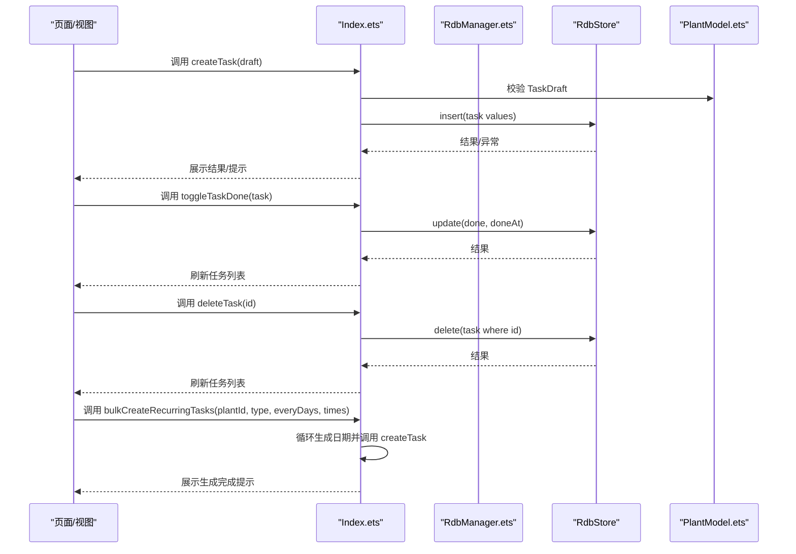

**图表来源**
- [Index.ets:405-576](file://entry/src/main/ets/pages/Index.ets#L405-L576)
- [RdbManager.ets:45-170](file://entry/src/main/ets/viewmodel/RdbManager.ets#L45-L170)
- [PlantModel.ets:42-76](file://entry/src/main/ets/model/PlantModel.ets#L42-L76)

## 详细组件分析

### 数据模型 PlantTask 与 TaskDraft
- PlantTask
  - 字段：id、plantId、type、planDate、done、doneAt
  - 用途：任务实体，用于列表渲染、状态切换、排序
- TaskDraft
  - 字段：plantId、type、planDate
  - 用途：新建任务前的草稿，集中校验与落库

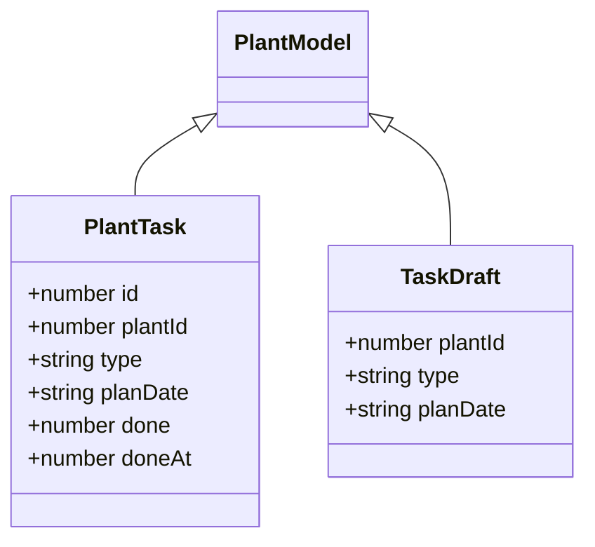

**图表来源**
- [PlantModel.ets:42-76](file://entry/src/main/ets/model/PlantModel.ets#L42-L76)

**章节来源**
- [PlantModel.ets:42-76](file://entry/src/main/ets/model/PlantModel.ets#L42-L76)

### 数据库建表与唯一性约束
- 表 task
  - 主键：id
  - 唯一索引：(plantId, type, planDate)
  - 索引：planDate、plantId
- 唯一性约束的作用
  - 同一植物、同一类型、同一计划日期的任务不可重复
  - 批量生成周期任务时可采用“尝试插入，冲突即跳过”的策略

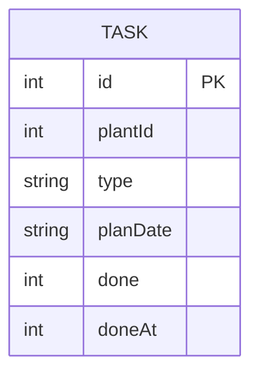

**图表来源**
- [RdbManager.ets:45-170](file://entry/src/main/ets/viewmodel/RdbManager.ets#L45-L170)

**章节来源**
- [RdbManager.ets:45-170](file://entry/src/main/ets/viewmodel/RdbManager.ets#L45-L170)

### 任务列表查询 loadTasks
- 实现位置：Index.loadTasks
- 查询逻辑
  - 使用原生 SQL 查询 task 表
  - 按 planDate 降序、id 降序排序
- 返回值：PlantTask 数组

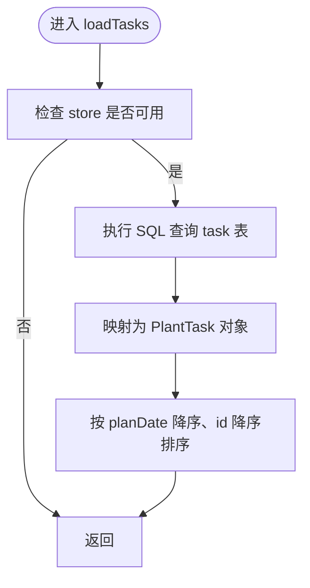

**图表来源**
- [Index.ets:170-184](file://entry/src/main/ets/pages/Index.ets#L170-L184)

**章节来源**
- [Index.ets:170-184](file://entry/src/main/ets/pages/Index.ets#L170-L184)

### 任务创建 createTask
- 实现位置：Index.createTask
- 参数
  - draft: TaskDraft
    - plantId: number
    - type: string
    - planDate: string
- 流程
  - 构造 ValuesBucket，设置 done=0、doneAt=0
  - 调用 store.insert 插入 task
  - 异常捕获：当唯一约束冲突时，提示“同日同类型任务已存在”
  - 成功后刷新全局数据

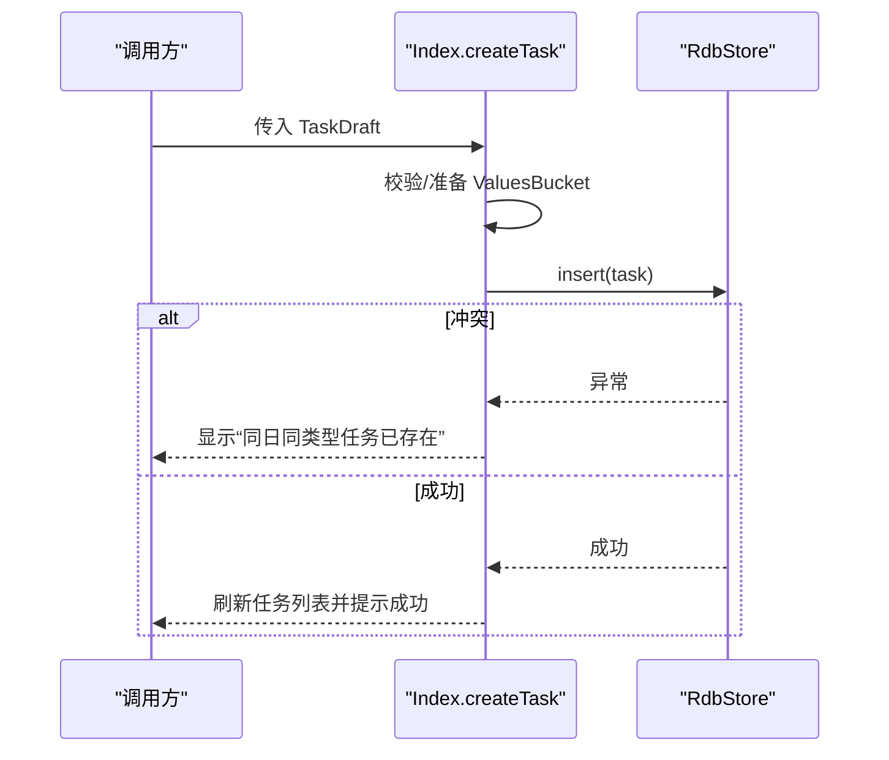

**图表来源**
- [Index.ets:405-425](file://entry/src/main/ets/pages/Index.ets#L405-L425)
- [RdbManager.ets:133-137](file://entry/src/main/ets/viewmodel/RdbManager.ets#L133-L137)

**章节来源**
- [Index.ets:405-425](file://entry/src/main/ets/pages/Index.ets#L405-L425)
- [RdbManager.ets:133-137](file://entry/src/main/ets/viewmodel/RdbManager.ets#L133-L137)

### 任务完成状态切换 toggleTaskDone
- 实现位置：Index.toggleTaskDone
- 流程
  - 计算新的 done 值（0/1互换）
  - 设置 doneAt：完成时为当前时间戳，取消完成时为0
  - 更新 task 记录
  - 刷新全局数据

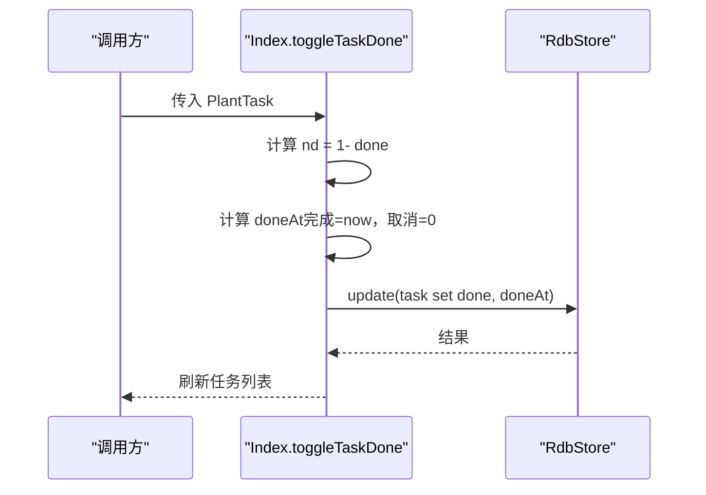

**图表来源**
- [Index.ets:427-437](file://entry/src/main/ets/pages/Index.ets#L427-L437)

**章节来源**
- [Index.ets:427-437](file://entry/src/main/ets/pages/Index.ets#L427-L437)

### 任务删除 deleteTask
- 实现位置：Index.deleteTask
- 流程
  - 构造 RdbPredicates 按 id 删除
  - 刷新全局数据

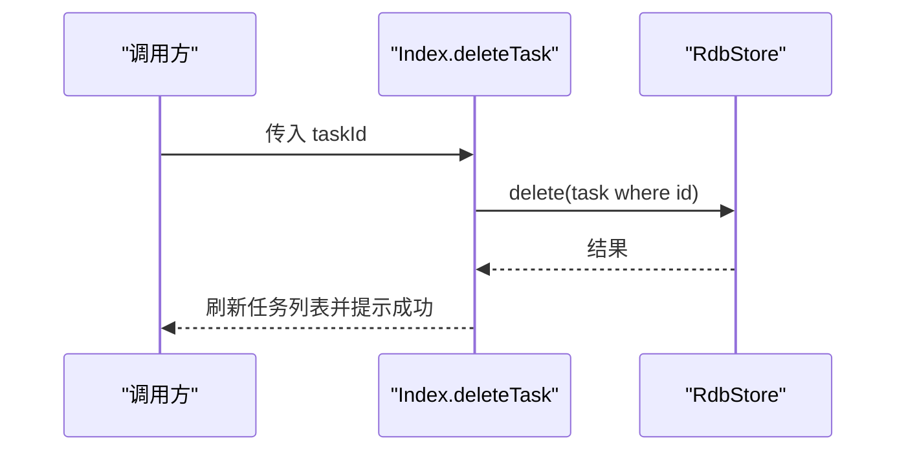

**图表来源**
- [Index.ets:548-557](file://entry/src/main/ets/pages/Index.ets#L548-L557)

**章节来源**
- [Index.ets:548-557](file://entry/src/main/ets/pages/Index.ets#L548-L557)

### 批量生成周期任务 bulkCreateRecurringTasks
- 实现位置：Index.bulkCreateRecurringTasks
- 参数
  - plantId: number
  - type: string
  - everyDays: number
  - times: number
- 流程
  - 循环 times 次，每次计算日期：today + everyDays*i
  - 生成 TaskDraft 并调用 createTask
  - 成功后提示“已生成周期任务”

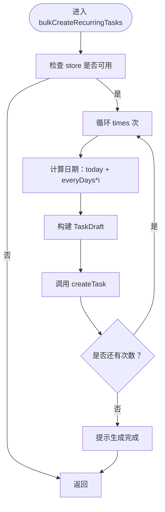

**图表来源**
- [Index.ets:559-576](file://entry/src/main/ets/pages/Index.ets#L559-L576)

**章节来源**
- [Index.ets:559-576](file://entry/src/main/ets/pages/Index.ets#L559-L576)

### 任务状态管理 done/doneAt 字段
- done：0/1，表示未完成/已完成
- doneAt：完成时记录时间戳，取消完成时清零
- 在 toggleTaskDone 中统一更新

**章节来源**
- [Index.ets:427-437](file://entry/src/main/ets/pages/Index.ets#L427-L437)
- [PlantModel.ets:42-59](file://entry/src/main/ets/model/PlantModel.ets#L42-L59)

### 任务筛选与排序机制
- 筛选维度（TaskListPage）
  - Tab：全部/今天/将来/已完成
  - 类型：按任务类型聚合的筛选
  - 关键字：匹配“任务类型/植物名”
- 排序规则
  - 先按 planDate 降序
  - 再按 id 降序
- 与 Index.loadTasks 的排序差异
  - Index.loadTasks 按 planDate 降序、id 降序
  - TaskListPage.filteredTasks 也遵循相同规则，保证前后一致

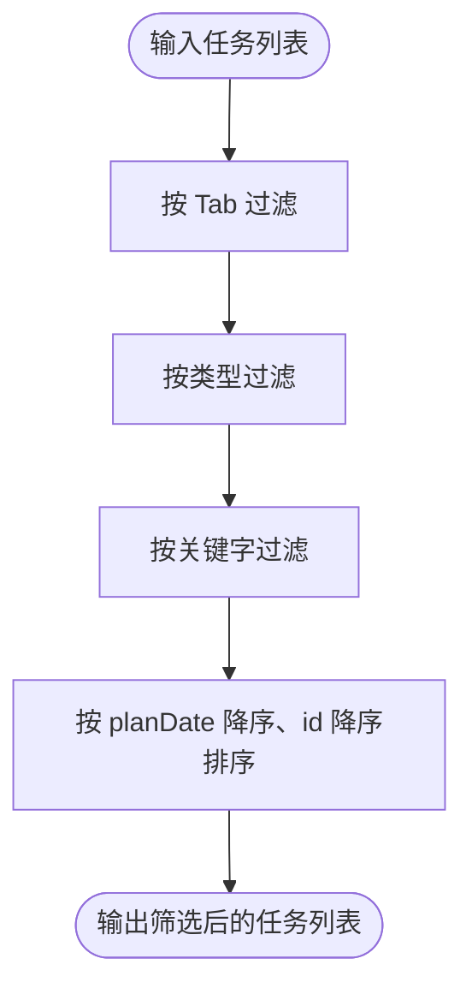

**图表来源**
- [TaskListPage.ets:95-162](file://entry/src/main/ets/pages/TaskListPage.ets#L95-L162)
- [Index.ets:170-184](file://entry/src/main/ets/pages/Index.ets#L170-L184)

**章节来源**
- [TaskListPage.ets:95-162](file://entry/src/main/ets/pages/TaskListPage.ets#L95-L162)
- [Index.ets:170-184](file://entry/src/main/ets/pages/Index.ets#L170-L184)

### 去重逻辑与冲突处理
- 唯一性约束
  - 唯一索引：(plantId, type, planDate)
- 冲突处理
  - createTask 在插入时可能触发唯一约束冲突
  - 捕获异常并提示“同日同类型任务已存在”
- 批量生成策略
  - 由于唯一约束，批量生成时采用“尝试插入，冲突即跳过”的策略

**章节来源**
- [RdbManager.ets:133-137](file://entry/src/main/ets/viewmodel/RdbManager.ets#L133-L137)
- [Index.ets:416-424](file://entry/src/main/ets/pages/Index.ets#L416-L424)

### 批量操作优化与事务
- 事务封装
  - DbUtils.runInTransaction 提供统一事务封装
  - 确保批量写入要么全部成功、要么全部回滚
- 批量切换/删除参考
  - err.ets 中提供了批量切换完成状态与批量删除的事务实现思路

**章节来源**
- [DbUtils.ets:12-21](file://entry/src/main/ets/model/DbUtils.ets#L12-L21)
- [err.ets:8-28](file://entry/src/main/ets/viewmodel/err.ets#L8-L28)

## 依赖关系分析
- Index 依赖 RdbManager 获取 RdbStore，执行 SQL
- PlantTask/TaskDraft 作为数据模型在页面与数据库间传递
- DbUtils 为批量操作提供事务保障
- TaskListPage 依赖 PlantTask 进行筛选与排序

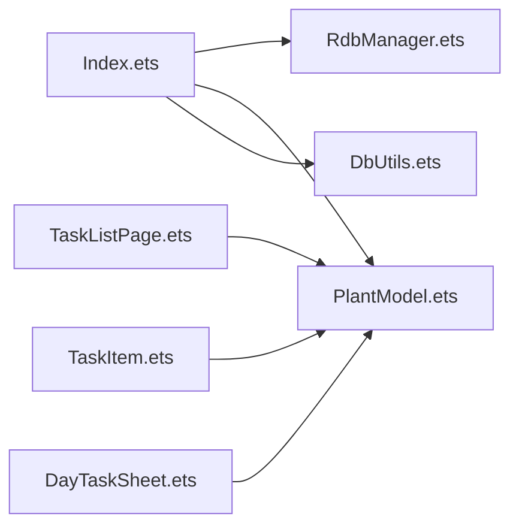

**图表来源**
- [Index.ets:128-184](file://entry/src/main/ets/pages/Index.ets#L128-L184)
- [TaskListPage.ets:1-30](file://entry/src/main/ets/pages/TaskListPage.ets#L1-L30)
- [PlantModel.ets:42-76](file://entry/src/main/ets/model/PlantModel.ets#L42-L76)
- [DbUtils.ets:12-21](file://entry/src/main/ets/model/DbUtils.ets#L12-L21)

**章节来源**
- [Index.ets:128-184](file://entry/src/main/ets/pages/Index.ets#L128-L184)
- [TaskListPage.ets:1-30](file://entry/src/main/ets/pages/TaskListPage.ets#L1-L30)

## 性能考量
- 查询排序
  - task 表已建立 planDate、plantId 索引，支持高效排序与过滤
- 唯一索引
  - 唯一索引避免重复任务，减少无效写入
- 批量生成
  - 采用循环+try-insert策略，冲突即跳过，避免重复插入
- 事务
  - 批量操作建议使用事务封装，确保原子性与一致性

[本节为通用性能讨论，无需特定文件引用]

## 故障排查指南
- 创建任务提示“同日同类型任务已存在”
  - 可能原因：唯一索引冲突
  - 解决方案：调整计划日期或任务类型
  - 参考实现：Index.createTask 的异常捕获与提示
- 切换/删除任务后界面未刷新
  - 可能原因：未调用刷新逻辑
  - 解决方案：确保调用 reloadAll 或对应刷新函数
  - 参考实现：Index.toggleTaskDone、Index.deleteTask 的刷新调用
- 批量生成周期任务未生效
  - 可能原因：参数非法或 store 不可用
  - 解决方案：检查 plantId、everyDays、times 参数合法性，确认 store 初始化
  - 参考实现：Index.bulkCreateRecurringTasks 的参数校验与循环生成

**章节来源**
- [Index.ets:416-424](file://entry/src/main/ets/pages/Index.ets#L416-L424)
- [Index.ets:427-437](file://entry/src/main/ets/pages/Index.ets#L427-L437)
- [Index.ets:548-557](file://entry/src/main/ets/pages/Index.ets#L548-L557)
- [Index.ets:559-576](file://entry/src/main/ets/pages/Index.ets#L559-L576)

## 结论
本任务数据管理API以简洁的模型与明确的约束实现了高效的CRUD与周期任务生成能力：
- PlantTask/TaskDraft 提供清晰的数据边界
- 唯一索引与异常处理确保数据一致性
- Index 提供完整的CRUD与批量生成实现
- TaskListPage 提供灵活的筛选与排序
- DbUtils 为批量操作提供事务保障

[本节为总结性内容，无需特定文件引用]

## 附录

### API 方法一览与参数说明
- loadTasks
  - 用途：查询任务列表
  - 返回：PlantTask[]
  - 排序：planDate 降序、id 降序
  - 参考实现：Index.loadTasks
- createTask
  - 用途：创建任务
  - 参数：TaskDraft（plantId、type、planDate）
  - 冲突处理：唯一约束冲突时提示“同日同类型任务已存在”
  - 参考实现：Index.createTask
- toggleTaskDone
  - 用途：切换任务完成状态
  - 参数：PlantTask
  - 状态：done 互换，doneAt 更新
  - 参考实现：Index.toggleTaskDone
- deleteTask
  - 用途：删除任务
  - 参数：id
  - 参考实现：Index.deleteTask
- bulkCreateRecurringTasks
  - 用途：批量生成周期任务
  - 参数：plantId、type、everyDays、times
  - 参考实现：Index.bulkCreateRecurringTasks

**章节来源**
- [Index.ets:170-184](file://entry/src/main/ets/pages/Index.ets#L170-L184)
- [Index.ets:405-425](file://entry/src/main/ets/pages/Index.ets#L405-L425)
- [Index.ets:427-437](file://entry/src/main/ets/pages/Index.ets#L427-L437)
- [Index.ets:548-557](file://entry/src/main/ets/pages/Index.ets#L548-L557)
- [Index.ets:559-576](file://entry/src/main/ets/pages/Index.ets#L559-L576)

### 数据模型与约束
- PlantTask
  - 字段：id、plantId、type、planDate、done、doneAt
  - 参考：PlantModel.ets
- TaskDraft
  - 字段：plantId、type、planDate
  - 参考：PlantModel.ets
- 唯一性约束
  - (plantId, type, planDate)
  - 参考：RdbManager.ets

**章节来源**
- [PlantModel.ets:42-76](file://entry/src/main/ets/model/PlantModel.ets#L42-L76)
- [RdbManager.ets:133-137](file://entry/src/main/ets/viewmodel/RdbManager.ets#L133-L137)

### 使用示例（步骤说明）
- 创建任务
  - 准备 TaskDraft（plantId、type、planDate）
  - 调用 Index.createTask(draft)
  - 查看提示与任务列表刷新
- 切换完成状态
  - 调用 Index.toggleTaskDone(task)
  - 查看任务列表更新
- 删除任务
  - 调用 Index.deleteTask(id)
  - 查看任务列表更新
- 批量生成周期任务
  - 调用 Index.bulkCreateRecurringTasks(plantId, type, everyDays, times)
  - 查看生成提示与任务列表更新

**章节来源**
- [Index.ets:405-425](file://entry/src/main/ets/pages/Index.ets#L405-L425)
- [Index.ets:427-437](file://entry/src/main/ets/pages/Index.ets#L427-L437)
- [Index.ets:548-557](file://entry/src/main/ets/pages/Index.ets#L548-L557)
- [Index.ets:559-576](file://entry/src/main/ets/pages/Index.ets#L559-L576)