# 指标数据管理

<cite>
**本文引用的文件**
- [PlantModel.ets](file://entry/src/main/ets/model/PlantModel.ets)
- [RdbManager.ets](file://entry/src/main/ets/viewmodel/RdbManager.ets)
- [Index.ets](file://entry/src/main/ets/pages/Index.ets)
- [GrowthIndicatorPage.ets](file://entry/src/main/ets/pages/GrowthIndicatorPage.ets)
- [MetricSheet.ets](file://entry/src/main/ets/view/MetricSheet.ets)
- [MetricChartSheet.ets](file://entry/src/main/ets/view/MetricChartSheet.ets)
- [PlantCard.ets](file://entry/src/main/ets/view/PlantCard.ets)
</cite>

## 目录
1. [简介](#简介)
2. [项目结构](#项目结构)
3. [核心组件](#核心组件)
4. [架构总览](#架构总览)
5. [详细组件分析](#详细组件分析)
6. [依赖关系分析](#依赖关系分析)
7. [性能考量](#性能考量)
8. [故障排查指南](#故障排查指南)
9. [结论](#结论)
10. [附录](#附录)

## 简介
本文件面向指标数据管理API，聚焦“生长指标”的CRUD能力，包括：
- 按植物查询指标：loadMetricsByPlant
- 创建指标：createMetric
- 删除指标：deleteMetric

文档同时记录SQL查询语句、数据模型映射（Metric）、时间戳转换函数（isoToTs）与数据格式处理，涵盖时间序列查询、升序排序与图表数据准备，并提供参数说明、数据验证规则与使用示例，解释指标数据与植物卡片的关联关系及趋势分析支持。

## 项目结构
指标数据管理涉及以下模块：
- 数据模型：PlantModel.ets 定义 Metric/PlantMetric 数据结构
- 数据库：RdbManager.ets 负责建表、索引与数据库访问
- 页面与视图：Index.ets、GrowthIndicatorPage.ets 提供CRUD入口与交互
- 视图组件：MetricSheet.ets、MetricChartSheet.ets 支持指标录入、列表与图表
- 植物卡片：PlantCard.ets 展示植物概览并触发指标查看

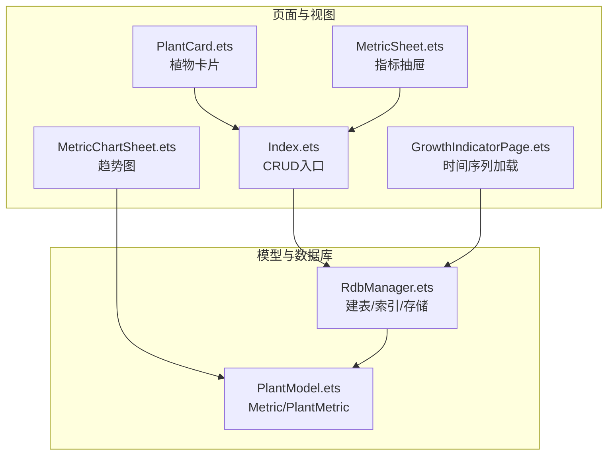

**图表来源**
- [Index.ets:224-284](file://entry/src/main/ets/pages/Index.ets#L224-L284)
- [GrowthIndicatorPage.ets:400-445](file://entry/src/main/ets/pages/GrowthIndicatorPage.ets#L400-L445)
- [MetricSheet.ets:1-491](file://entry/src/main/ets/view/MetricSheet.ets#L1-L491)
- [MetricChartSheet.ets:1-181](file://entry/src/main/ets/view/MetricChartSheet.ets#L1-L181)
- [PlantCard.ets:1-326](file://entry/src/main/ets/view/PlantCard.ets#L1-L326)
- [PlantModel.ets:108-147](file://entry/src/main/ets/model/PlantModel.ets#L108-L147)
- [RdbManager.ets:71-169](file://entry/src/main/ets/viewmodel/RdbManager.ets#L71-L169)

**章节来源**
- [Index.ets:224-284](file://entry/src/main/ets/pages/Index.ets#L224-L284)
- [RdbManager.ets:71-169](file://entry/src/main/ets/viewmodel/RdbManager.ets#L71-L169)

## 核心组件
- 数据模型：Metric/PlantMetric
  - 字段：id、plantId、height、width、score、createdAt
  - 类型：height/width为数值（cm），score为整数（0~100），createdAt为时间戳（毫秒）
- 数据库表：metric
  - 主键：id（自增）
  - 索引：idx_metric_plant_created(plantId, createdAt) 以支持按植物+时间查询
- API方法：
  - loadMetricsByPlant：按植物查询并升序排序
  - createMetric：创建指标并统一转换日期
  - deleteMetric：按id删除指标

**章节来源**
- [PlantModel.ets:108-147](file://entry/src/main/ets/model/PlantModel.ets#L108-L147)
- [RdbManager.ets:71-169](file://entry/src/main/ets/viewmodel/RdbManager.ets#L71-L169)
- [Index.ets:224-284](file://entry/src/main/ets/pages/Index.ets#L224-L284)

## 架构总览
指标数据管理采用“页面/视图层 + 数据模型 + 数据库管理层”的分层设计：
- 页面/视图层：Index.ets、GrowthIndicatorPage.ets、MetricSheet.ets、MetricChartSheet.ets
- 数据模型层：PlantModel.ets 的 Metric/PlantMetric
- 数据库管理层：RdbManager.ets 的建表、索引与存储接口

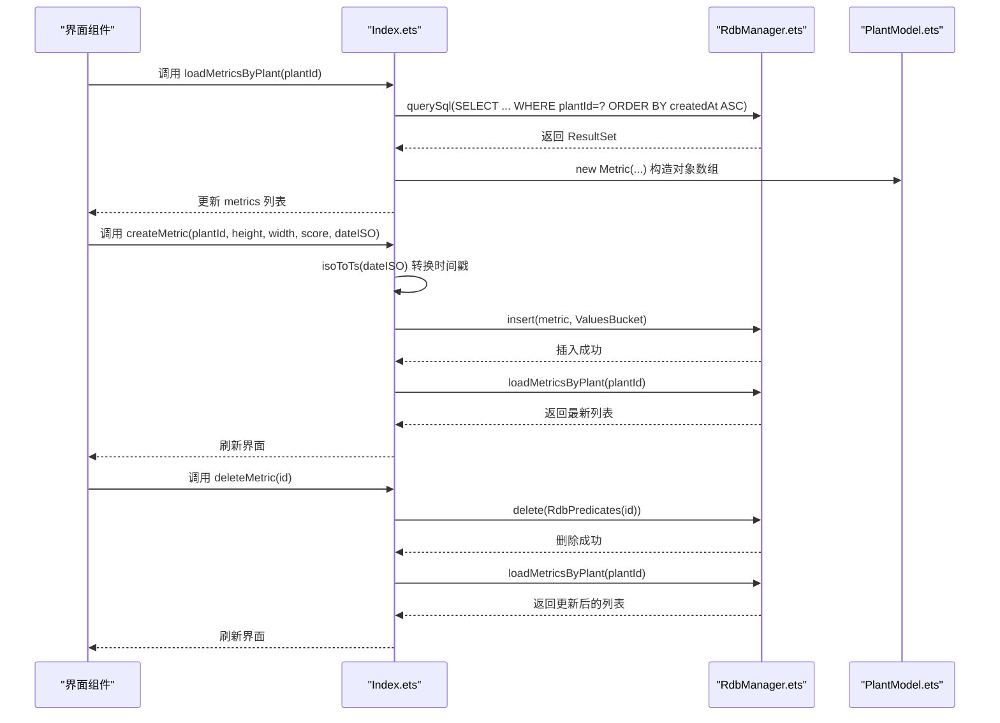

**图表来源**
- [Index.ets:224-284](file://entry/src/main/ets/pages/Index.ets#L224-L284)
- [RdbManager.ets:71-169](file://entry/src/main/ets/viewmodel/RdbManager.ets#L71-L169)
- [PlantModel.ets:108-147](file://entry/src/main/ets/model/PlantModel.ets#L108-L147)

## 详细组件分析

### 数据模型：Metric 与 PlantMetric
- 字段与类型
  - id：整数，主键
  - plantId：整数，外键关联植物
  - height：数值（cm）
  - width：数值（cm）
  - score：整数（0~100）
  - createdAt：时间戳（毫秒）
- 使用场景
  - 数据库查询结果映射到 Metric
  - 指标抽屉与图表组件消费 PlantMetric

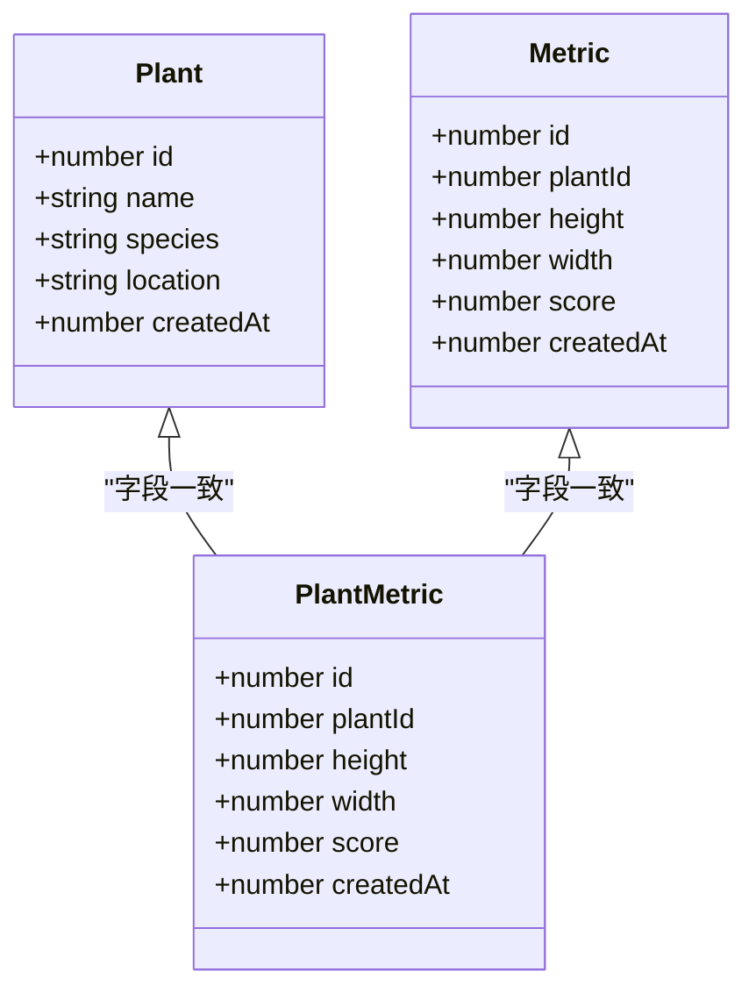

**图表来源**
- [PlantModel.ets:108-147](file://entry/src/main/ets/model/PlantModel.ets#L108-L147)

**章节来源**
- [PlantModel.ets:108-147](file://entry/src/main/ets/model/PlantModel.ets#L108-L147)

### 数据库：metric 表与索引
- 表结构要点
  - 主键：id（自增）
  - 默认值：height/width 默认0，score 默认0
  - 约束：createdAt 非空
- 索引
  - idx_metric_plant_created(plantId, createdAt)：支持按植物+时间查询与排序
- 初始化流程
  - RdbManager.initDb 在首次启动时创建表与索引

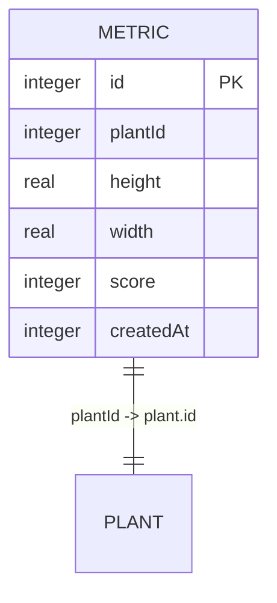

**图表来源**
- [RdbManager.ets:71-169](file://entry/src/main/ets/viewmodel/RdbManager.ets#L71-L169)

**章节来源**
- [RdbManager.ets:71-169](file://entry/src/main/ets/viewmodel/RdbManager.ets#L71-L169)

### API：loadMetricsByPlant（按植物查询指标）
- 功能
  - 查询指定植物的所有指标记录
  - 按 createdAt 升序排列，便于图表直接按采集时间展开
- SQL 查询
  - SELECT id, plantId, height, width, score, createdAt
  - FROM metric
  - WHERE plantId = ?
  - ORDER BY createdAt ASC
- 结果映射
  - 将 ResultSet 行映射为 Metric 对象数组
- 适用场景
  - 成长指标页与图表页的数据源

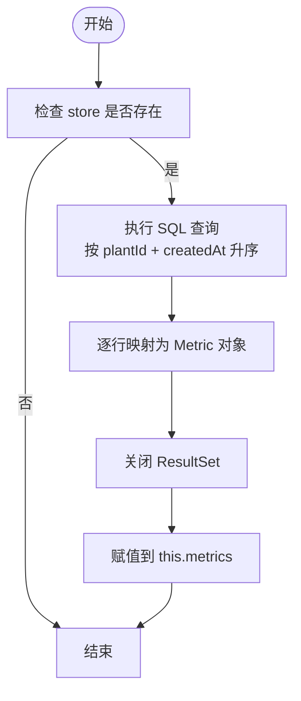

**图表来源**
- [Index.ets:224-243](file://entry/src/main/ets/pages/Index.ets#L224-L243)
- [GrowthIndicatorPage.ets:400-420](file://entry/src/main/ets/pages/GrowthIndicatorPage.ets#L400-L420)

**章节来源**
- [Index.ets:224-243](file://entry/src/main/ets/pages/Index.ets#L224-L243)
- [GrowthIndicatorPage.ets:400-420](file://entry/src/main/ets/pages/GrowthIndicatorPage.ets#L400-L420)

### API：createMetric（指标创建）
- 功能
  - 新增指标记录，统一进行输入兜底与分数裁剪
  - 将 ISO 日期（YYYY-MM-DD）转换为本地时间 00:00:00 的时间戳
- 参数
  - plantId：植物ID
  - height：身高（cm）
  - width：冠幅（cm）
  - score：健康分（0~100）
  - dateISO：日期字符串（YYYY-MM-DD）
- 数据验证与处理
  - 输入兜底：安全解析数字，非法值归零
  - 分数裁剪：小于0取0，大于100取100，小数向下取整
  - 日期校验：长度必须为10，否则回退到当前时间
  - 时间戳转换：isoToTs 将 YYYY-MM-DD 解析为本地 00:00:00 的毫秒时间戳
- SQL 插入
  - INSERT INTO metric (plantId, height, width, score, createdAt)
  - VALUES (?, ?, ?, ?, ?)
- 后续动作
  - 插入成功后重新加载该植物的指标列表

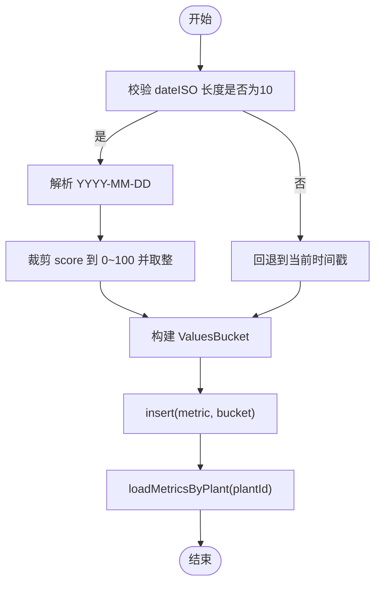

**图表来源**
- [Index.ets:245-260](file://entry/src/main/ets/pages/Index.ets#L245-L260)
- [Index.ets:262-272](file://entry/src/main/ets/pages/Index.ets#L262-L272)
- [GrowthIndicatorPage.ets:422-445](file://entry/src/main/ets/pages/GrowthIndicatorPage.ets#L422-L445)
- [GrowthIndicatorPage.ets:552-580](file://entry/src/main/ets/pages/GrowthIndicatorPage.ets#L552-L580)

**章节来源**
- [Index.ets:245-260](file://entry/src/main/ets/pages/Index.ets#L245-L260)
- [Index.ets:262-272](file://entry/src/main/ets/pages/Index.ets#L262-L272)
- [GrowthIndicatorPage.ets:422-445](file://entry/src/main/ets/pages/GrowthIndicatorPage.ets#L422-L445)
- [GrowthIndicatorPage.ets:552-580](file://entry/src/main/ets/pages/GrowthIndicatorPage.ets#L552-L580)

### API：deleteMetric（指标删除）
- 功能
  - 根据指标ID删除记录
  - 删除后可选地重新加载该植物的指标列表
- SQL 删除
  - DELETE FROM metric WHERE id = ?
- 适用场景
  - 指标抽屉中的删除按钮触发

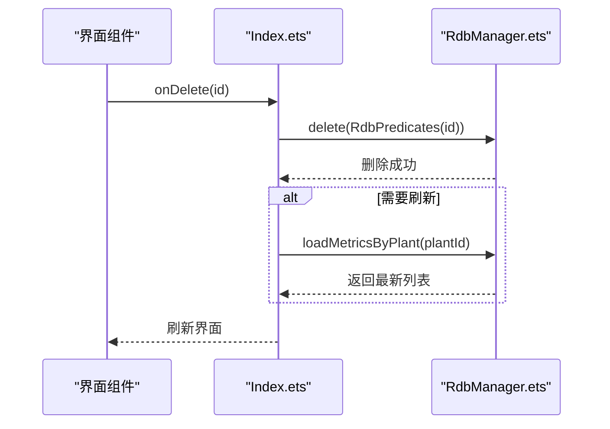

**图表来源**
- [Index.ets:274-284](file://entry/src/main/ets/pages/Index.ets#L274-L284)

**章节来源**
- [Index.ets:274-284](file://entry/src/main/ets/pages/Index.ets#L274-L284)

### 时间戳转换函数：isoToTs
- 功能
  - 将 ISO 日期字符串（YYYY-MM-DD）转换为本地时间 00:00:00 的毫秒时间戳
- 输入校验
  - 长度必须为10，否则回退到当前时间
- 输出
  - 数值型时间戳（毫秒）

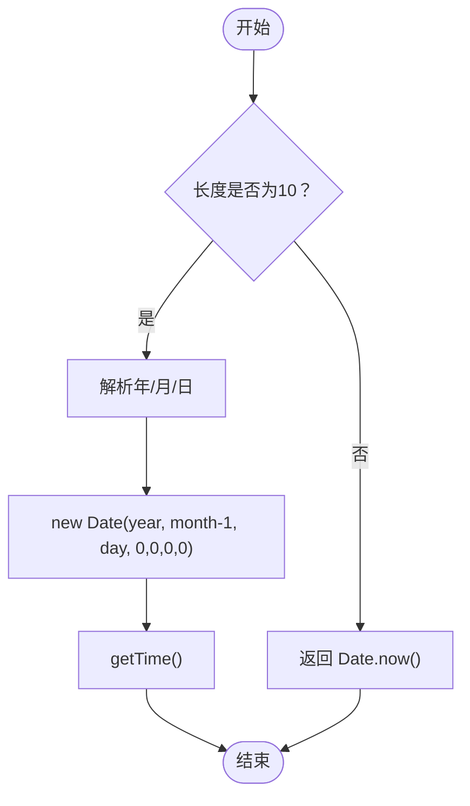

**图表来源**
- [Index.ets:262-272](file://entry/src/main/ets/pages/Index.ets#L262-L272)
- [GrowthIndicatorPage.ets:570-580](file://entry/src/main/ets/pages/GrowthIndicatorPage.ets#L570-L580)

**章节来源**
- [Index.ets:262-272](file://entry/src/main/ets/pages/Index.ets#L262-L272)
- [GrowthIndicatorPage.ets:570-580](file://entry/src/main/ets/pages/GrowthIndicatorPage.ets#L570-L580)

### 时间序列查询、升序排序与图表数据准备
- 时间序列查询
  - 通过 loadMetricsByPlant 获取按 createdAt 升序排列的指标列表
- 升序排序
  - SQL 层 ORDER BY createdAt ASC
  - 抽屉组件也提供 sortAsc 控制，确保列表与迷你图一致
- 图表数据准备
  - 指标抽屉：MiniChart 使用 sorted() 的结果绘制柱状迷你图
  - 趋势图：MetricChartSheet 将 metrics 映射为高度/宽度/健康度三条系列，并生成 X 轴标签（MM-DD）

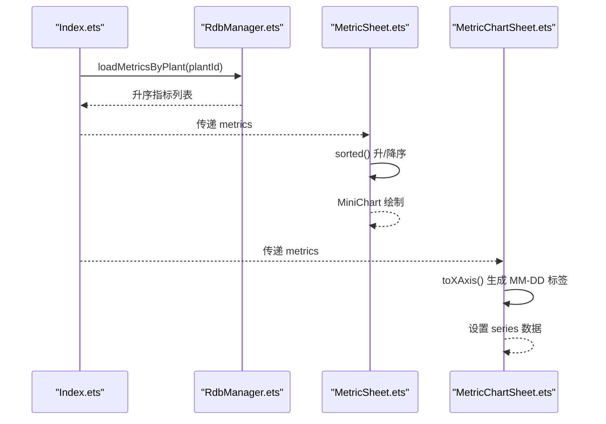

**图表来源**
- [Index.ets:224-243](file://entry/src/main/ets/pages/Index.ets#L224-L243)
- [MetricSheet.ets:384-398](file://entry/src/main/ets/view/MetricSheet.ets#L384-L398)
- [MetricChartSheet.ets:80-88](file://entry/src/main/ets/view/MetricChartSheet.ets#L80-L88)

**章节来源**
- [Index.ets:224-243](file://entry/src/main/ets/pages/Index.ets#L224-L243)
- [MetricSheet.ets:384-398](file://entry/src/main/ets/view/MetricSheet.ets#L384-L398)
- [MetricChartSheet.ets:80-88](file://entry/src/main/ets/view/MetricChartSheet.ets#L80-L88)

### 指标数据与植物卡片的关联关系
- 植物卡片点击“指标”按钮，触发打开指标抽屉或指标页
- 指标抽屉接收 plantName 与 metrics，支持快速录入、排序与删除
- 指标趋势图支持按植物名称展示，便于对比分析

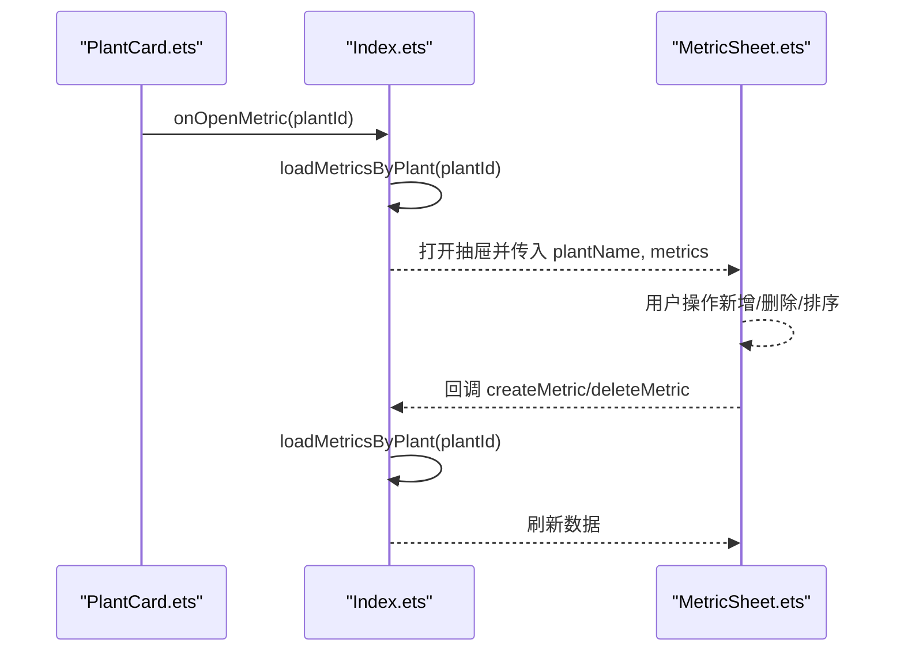

**图表来源**
- [PlantCard.ets:159-161](file://entry/src/main/ets/view/PlantCard.ets#L159-L161)
- [Index.ets:1373-1384](file://entry/src/main/ets/pages/Index.ets#L1373-L1384)
- [MetricSheet.ets:9-11](file://entry/src/main/ets/view/MetricSheet.ets#L9-L11)

**章节来源**
- [PlantCard.ets:159-161](file://entry/src/main/ets/view/PlantCard.ets#L159-L161)
- [Index.ets:1373-1384](file://entry/src/main/ets/pages/Index.ets#L1373-L1384)
- [MetricSheet.ets:9-11](file://entry/src/main/ets/view/MetricSheet.ets#L9-L11)

## 依赖关系分析
- 页面/视图层依赖数据库管理层
  - Index.ets、GrowthIndicatorPage.ets 通过 RdbManager 执行 SQL
- 数据模型作为中间层
  - RdbManager 返回的 ResultSet 映射到 PlantModel.ets 的 Metric/PlantMetric
- 视图组件消费数据模型
  - MetricSheet.ets、MetricChartSheet.ets 使用 PlantMetric/Metric 进行渲染

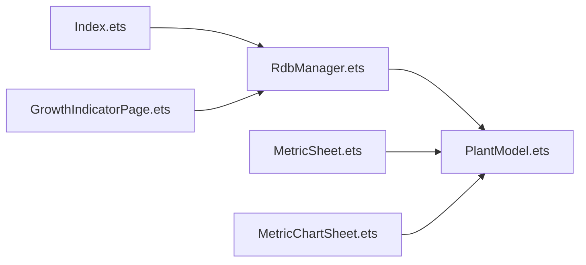

**图表来源**
- [Index.ets:224-284](file://entry/src/main/ets/pages/Index.ets#L224-L284)
- [GrowthIndicatorPage.ets:400-445](file://entry/src/main/ets/pages/GrowthIndicatorPage.ets#L400-L445)
- [RdbManager.ets:71-169](file://entry/src/main/ets/viewmodel/RdbManager.ets#L71-L169)
- [PlantModel.ets:108-147](file://entry/src/main/ets/model/PlantModel.ets#L108-L147)
- [MetricSheet.ets:1-491](file://entry/src/main/ets/view/MetricSheet.ets#L1-L491)
- [MetricChartSheet.ets:1-181](file://entry/src/main/ets/view/MetricChartSheet.ets#L1-L181)

**章节来源**
- [Index.ets:224-284](file://entry/src/main/ets/pages/Index.ets#L224-L284)
- [RdbManager.ets:71-169](file://entry/src/main/ets/viewmodel/RdbManager.ets#L71-L169)
- [PlantModel.ets:108-147](file://entry/src/main/ets/model/PlantModel.ets#L108-L147)
- [MetricSheet.ets:1-491](file://entry/src/main/ets/view/MetricSheet.ets#L1-L491)
- [MetricChartSheet.ets:1-181](file://entry/src/main/ets/view/MetricChartSheet.ets#L1-L181)

## 性能考量
- 索引优化
  - idx_metric_plant_created(plantId, createdAt) 支持按植物+时间范围查询与排序
- 查询策略
  - 按植物过滤 + 升序排序，适合时间序列展示
- 图表渲染
  - 抽屉迷你图仅绘制必要元素，减少重绘开销
- 数据量控制
  - 建议在趋势图中按时间窗口（如近30/90天）筛选，避免过多点影响性能

[本节为通用建议，无需特定文件来源]

## 故障排查指南
- 无法查询指标
  - 检查 store 是否初始化成功
  - 确认 plantId 是否有效
  - 查看 SQL 是否正确执行（WHERE + ORDER BY）
- 创建指标失败
  - 检查 dateISO 格式是否为 YYYY-MM-DD
  - 检查 height/width/score 是否为合法数字
  - 确认 score 是否在 0~100 范围内
- 删除指标无效
  - 确认 id 是否存在
  - 检查删除后是否调用了重新加载

**章节来源**
- [Index.ets:224-284](file://entry/src/main/ets/pages/Index.ets#L224-L284)
- [GrowthIndicatorPage.ets:422-445](file://entry/src/main/ets/pages/GrowthIndicatorPage.ets#L422-L445)

## 结论
指标数据管理API围绕“按植物查询、创建、删除”三大核心能力，结合数据库索引与视图组件，实现了高效的时间序列数据管理与可视化。通过统一的时间戳转换、输入验证与排序策略，系统在保证数据一致性的同时，提供了良好的用户体验与扩展性。

[本节为总结，无需特定文件来源]

## 附录

### API 方法一览
- loadMetricsByPlant(plantId)
  - 功能：按植物查询指标并升序排序
  - SQL：SELECT ... FROM metric WHERE plantId=? ORDER BY createdAt ASC
  - 返回：Metric 数组
- createMetric(plantId, height, width, score, dateISO)
  - 功能：创建指标并统一转换日期
  - 输入验证：分数裁剪、数字兜底、日期校验
  - SQL：INSERT INTO metric(...)
- deleteMetric(id)
  - 功能：按ID删除指标
  - SQL：DELETE FROM metric WHERE id=?

**章节来源**
- [Index.ets:224-284](file://entry/src/main/ets/pages/Index.ets#L224-L284)
- [GrowthIndicatorPage.ets:400-445](file://entry/src/main/ets/pages/GrowthIndicatorPage.ets#L400-L445)

### 数据模型字段说明
- Metric/PlantMetric
  - id：整数，主键
  - plantId：整数，关联植物
  - height：数值（cm）
  - width：数值（cm）
  - score：整数（0~100）
  - createdAt：时间戳（毫秒）

**章节来源**
- [PlantModel.ets:108-147](file://entry/src/main/ets/model/PlantModel.ets#L108-L147)

### 时间戳转换函数
- isoToTs(iso)
  - 输入：YYYY-MM-DD
  - 输出：本地 00:00:00 的毫秒时间戳
  - 校验：长度为10，否则回退到当前时间

**章节来源**
- [Index.ets:262-272](file://entry/src/main/ets/pages/Index.ets#L262-L272)
- [GrowthIndicatorPage.ets:570-580](file://entry/src/main/ets/pages/GrowthIndicatorPage.ets#L570-L580)