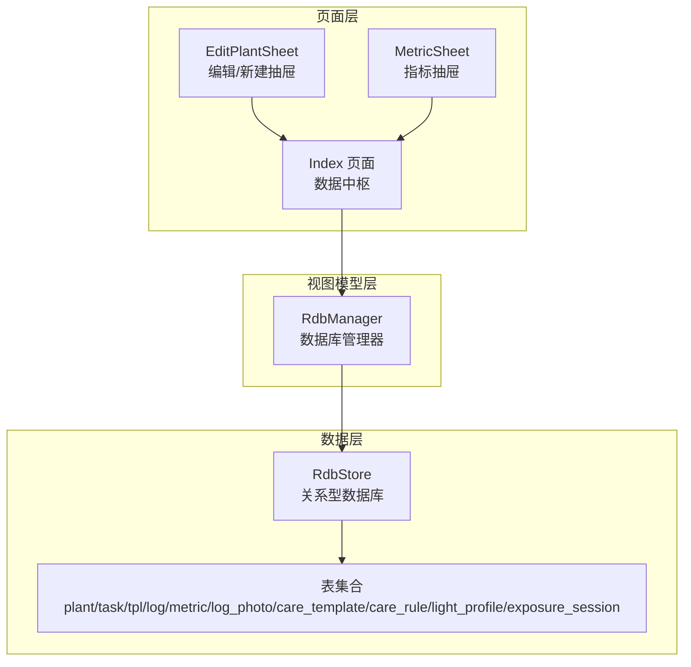
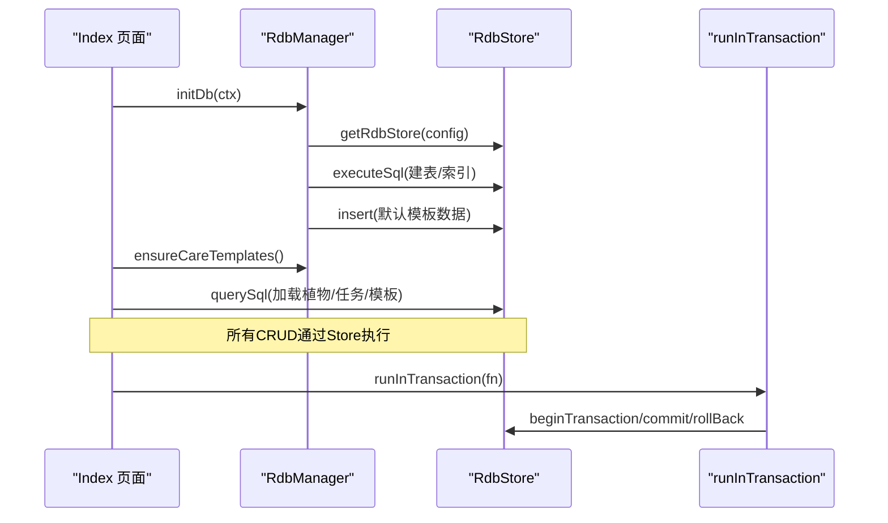
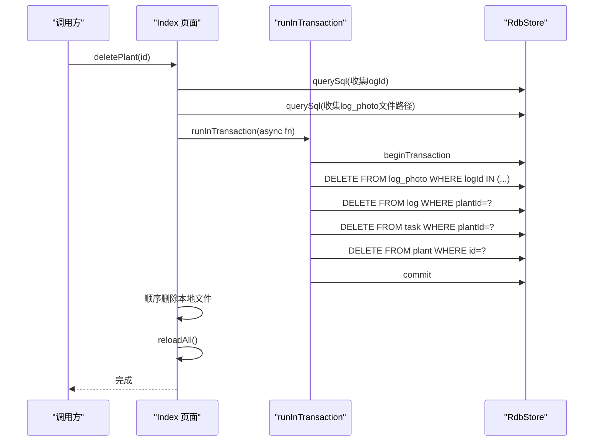
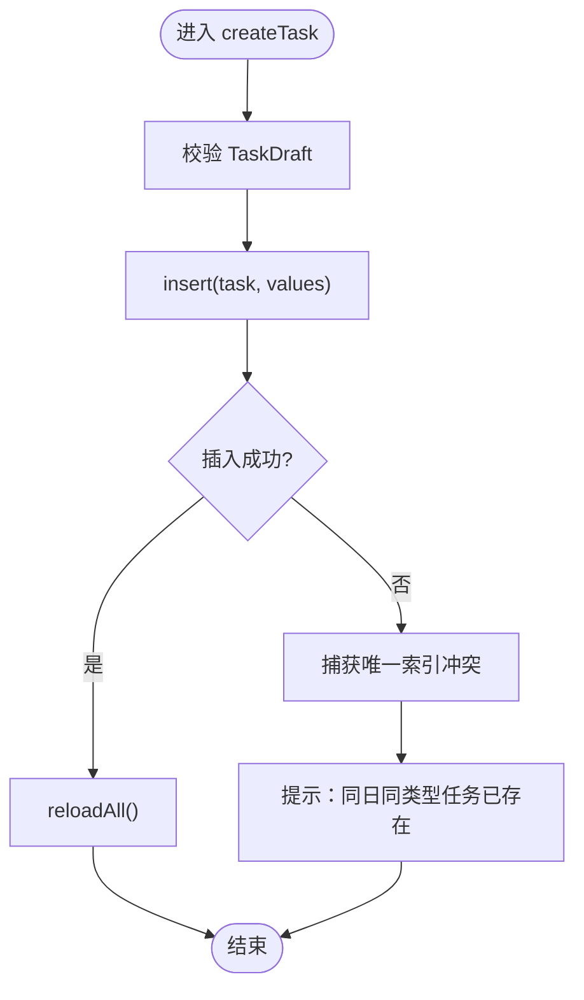
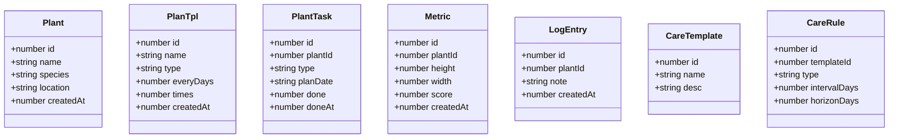
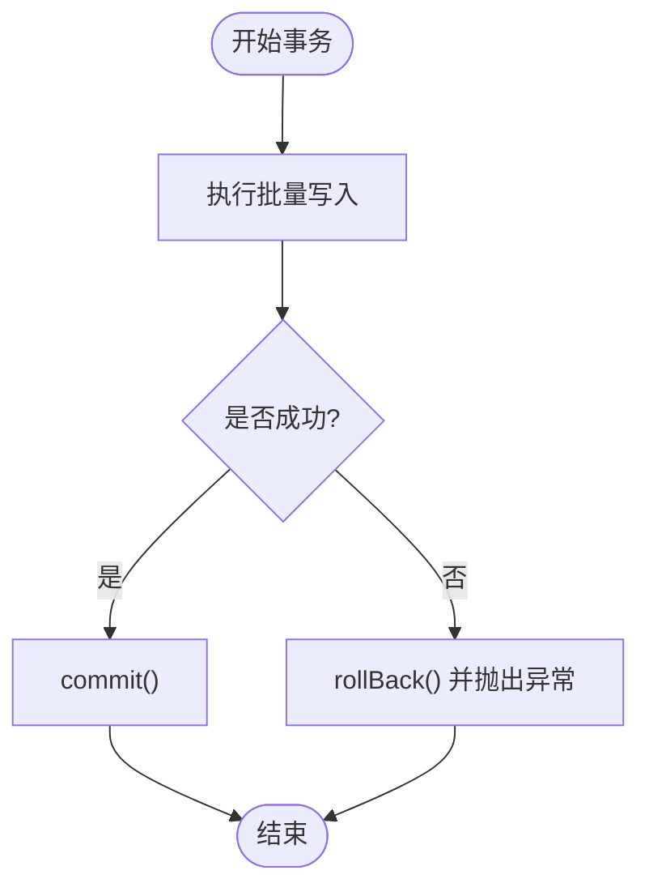
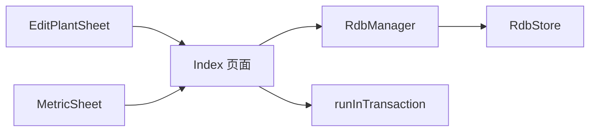

```mermaid
sequenceDiagram
participant UI as "MetricSheet"
participant Index as "Index 页面"
participant Store as "RdbStore"
UI->>Index : createMetric(plantId, h, w, s, dateISO)
Index->>Index : isoToTs(dateISO)
Index->>Store : insert(metric, values)
Index->>Index : loadMetricsByPlant(plantId)
Index-->>UI : 更新指标列表
UI->>Index : deleteMetric(id)
Index->>Store : delete(metric WHERE id=?)
Index->>Index : 若当前植物匹配则loadMetricsByPlant(plantId)
Index-->>UI : 刷新完成
```

# 数据管理API

<cite>
**本文档引用的文件**
- [Index.ets](file://entry/src/main/ets/pages/Index.ets)
- [RdbManager.ets](file://entry/src/main/ets/viewmodel/RdbManager.ets)
- [PlantModel.ets](file://entry/src/main/ets/model/PlantModel.ets)
- [DbUtils.ets](file://entry/src/main/ets/model/DbUtils.ets)
- [EditPlantSheet.ets](file://entry/src/main/ets/view/EditPlantSheet.ets)
- [MetricSheet.ets](file://entry/src/main/ets/view/MetricSheet.ets)
</cite>

## 目录
1. [简介](#简介)
2. [项目结构](#项目结构)
3. [核心组件](#核心组件)
4. [架构总览](#架构总览)
5. [详细组件分析](#详细组件分析)
6. [依赖关系分析](#依赖关系分析)
7. [性能考虑](#性能考虑)
8. [故障排除指南](#故障排除指南)
9. [结论](#结论)
10. [附录](#附录)

## 简介
本文件面向Index主页面的数据管理API，系统性梳理植物数据管理（loadPlants、createPlant、updatePlant、deletePlant）、任务数据管理（loadTasks、createTask、toggleTaskDone、deleteTask）、指标数据管理（loadMetricsByPlant、createMetric、deleteMetric）等核心数据操作方法。内容涵盖：
- 数据查询SQL语句与索引设计
- 数据模型映射关系
- 事务处理机制与数据一致性保障
- 最佳实践、性能优化建议与错误处理策略
- 参数说明、返回值类型与使用示例

## 项目结构
Index主页面通过RdbManager统一管理数据库连接与建表，Index页面作为数据中枢负责加载与刷新植物、任务、模板等全局数据，并提供各类CRUD操作。

**图表来源**
- [Index.ets:115-141](file://entry/src/main/ets/pages/Index.ets#L115-L141)
- [RdbManager.ets:27-170](file://entry/src/main/ets/viewmodel/RdbManager.ets#L27-L170)

**章节来源**
- [Index.ets:115-141](file://entry/src/main/ets/pages/Index.ets#L115-L141)
- [RdbManager.ets:27-170](file://entry/src/main/ets/viewmodel/RdbManager.ets#L27-L170)

## 核心组件
- 数据模型：Plant、PlanTpl、PlantTask、PlantDraft、TaskDraft、LogEntry、Metric、PlantMetric、CareTemplate、CareRule
- 数据库管理：RdbManager（建表、索引、默认数据、活跃光照会话查询）
- 事务工具：runInTransaction（统一事务封装）
- 页面中枢：Index（加载与刷新植物/任务/模板，执行CRUD）

**章节来源**
- [PlantModel.ets:6-166](file://entry/src/main/ets/model/PlantModel.ets#L6-L166)
- [RdbManager.ets:4-296](file://entry/src/main/ets/viewmodel/RdbManager.ets#L4-L296)
- [DbUtils.ets:12-22](file://entry/src/main/ets/model/DbUtils.ets#L12-L22)
- [Index.ets:143-402](file://entry/src/main/ets/pages/Index.ets#L143-L402)

## 架构总览
Index页面在aboutToAppear阶段初始化数据库，随后一次性加载植物、任务与模板，并在需要时刷新指标数据。所有数据库操作均通过RdbStore执行，事务通过DbUtils封装，确保批量写入的一致性。

**图表来源**
- [Index.ets:116-135](file://entry/src/main/ets/pages/Index.ets#L116-L135)
- [RdbManager.ets:27-170](file://entry/src/main/ets/viewmodel/RdbManager.ets#L27-L170)
- [DbUtils.ets:12-22](file://entry/src/main/ets/model/DbUtils.ets#L12-L22)

## 详细组件分析

### 植物数据管理API
- loadPlants
  - 功能：按创建时间倒序加载植物列表
  - SQL：SELECT id,name,species,location,createdAt FROM plant ORDER BY createdAt DESC
  - 返回：Plant数组
  - 使用场景：首页植物卡片展示
  - 关联：刷新光照状态（基于活跃曝光会话）
  - 参考路径：[Index.ets:143-159](file://entry/src/main/ets/pages/Index.ets#L143-L159)

- createPlant
  - 功能：创建新植物
  - 输入：PlantDraft（名称、品种、位置）
  - 逻辑：插入plant表，随后reloadAll刷新植物与任务
  - 错误处理：无store时直接返回
  - 参考路径：[Index.ets:287-302](file://entry/src/main/ets/pages/Index.ets#L287-L302)

- updatePlant
  - 功能：更新植物信息
  - 输入：id + PlantDraft
  - 逻辑：按id更新plant表，随后reloadAll
  - 参考路径：[Index.ets:304-316](file://entry/src/main/ets/pages/Index.ets#L304-L316)

- deletePlant
  - 功能：删除植物及其关联日志、任务、照片
  - 事务：runInTransaction包裹，先删log_photo、log、task，最后删plant
  - 文件清理：事务成功后统一删除本地图片文件
  - 错误处理：部分文件删除失败时提示数量
  - 参考路径：[Index.ets:319-402](file://entry/src/main/ets/pages/Index.ets#L319-L402)

**图表来源**
- [Index.ets:319-402](file://entry/src/main/ets/pages/Index.ets#L319-L402)
- [DbUtils.ets:12-22](file://entry/src/main/ets/model/DbUtils.ets#L12-L22)

**章节来源**
- [Index.ets:143-159](file://entry/src/main/ets/pages/Index.ets#L143-L159)
- [Index.ets:287-316](file://entry/src/main/ets/pages/Index.ets#L287-L316)
- [Index.ets:319-402](file://entry/src/main/ets/pages/Index.ets#L319-L402)

### 任务数据管理API
- loadTasks
  - 功能：按计划日期倒序加载任务列表
  - SQL：SELECT id,plantId,type,planDate,done,doneAt FROM task ORDER BY planDate DESC,id DESC
  - 返回：PlantTask数组
  - 参考路径：[Index.ets:170-184](file://entry/src/main/ets/pages/Index.ets#L170-L184)

- createTask
  - 功能：创建新任务
  - 输入：TaskDraft（plantId、type、planDate）
  - 逻辑：插入task表，reloadAll；若唯一索引冲突则提示“同日同类型任务已存在”
  - 唯一索引：idx_task_unique(plantId, type, planDate)
  - 参考路径：[Index.ets:405-425](file://entry/src/main/ets/pages/Index.ets#L405-L425)

- toggleTaskDone
  - 功能：切换任务完成状态
  - 输入：PlantTask
  - 逻辑：更新done与doneAt，reloadAll
  - 参考路径：[Index.ets:427-437](file://entry/src/main/ets/pages/Index.ets#L427-L437)

- deleteTask
  - 功能：删除单个任务
  - 逻辑：按id删除task表，reloadAll
  - 参考路径：[Index.ets:548-557](file://entry/src/main/ets/pages/Index.ets#L548-L557)

**图表来源**
- [Index.ets:405-425](file://entry/src/main/ets/pages/Index.ets#L405-L425)
- [RdbManager.ets:134-137](file://entry/src/main/ets/viewmodel/RdbManager.ets#L134-L137)

**章节来源**
- [Index.ets:170-184](file://entry/src/main/ets/pages/Index.ets#L170-L184)
- [Index.ets:405-437](file://entry/src/main/ets/pages/Index.ets#L405-L437)
- [Index.ets:548-557](file://entry/src/main/ets/pages/Index.ets#L548-L557)
- [RdbManager.ets:134-137](file://entry/src/main/ets/viewmodel/RdbManager.ets#L134-L137)

### 指标数据管理API
- loadMetricsByPlant
  - 功能：按植物加载指标记录（按时间升序）
  - SQL：SELECT id, plantId, height, width, score, createdAt FROM metric WHERE plantId = ? ORDER BY createdAt ASC
  - 返回：Metric数组
  - 参考路径：[Index.ets:224-243](file://entry/src/main/ets/pages/Index.ets#L224-L243)

- createMetric
  - 功能：新增指标记录
  - 输入：plantId、height、width、score、dateISO
  - 逻辑：将ISO日期转换为本地0点时间戳，插入metric表，随后按plantId刷新指标
  - 参考路径：[Index.ets:245-260](file://entry/src/main/ets/pages/Index.ets#L245-L260)

- deleteMetric
  - 功能：删除指标记录
  - 逻辑：按id删除metric表，若当前显示植物匹配则刷新指标
  - 参考路径：[Index.ets:274-284](file://entry/src/main/ets/pages/Index.ets#L274-L284)

**图表来源**
- [Index.ets:224-284](file://entry/src/main/ets/pages/Index.ets#L224-L284)

**章节来源**
- [Index.ets:224-284](file://entry/src/main/ets/pages/Index.ets#L224-L284)

### 数据模型与映射
- Plant：id、name、species、location、createdAt
- PlanTpl：id、name、type、everyDays、times、createdAt
- PlantTask：id、plantId、type、planDate、done、doneAt
- Metric：id、plantId、height、width、score、createdAt
- LogEntry：id、plantId、note、createdAt
- CareTemplate：id、name、desc
- CareRule：id、templateId、type、intervalDays、horizonDays

**图表来源**
- [PlantModel.ets:6-166](file://entry/src/main/ets/model/PlantModel.ets#L6-L166)

**章节来源**
- [PlantModel.ets:6-166](file://entry/src/main/ets/model/PlantModel.ets#L6-L166)

### 事务处理机制与数据一致性
- 统一事务封装：runInTransaction(fn)在异常时自动回滚，确保批量写入原子性
- deletePlant：在单个事务中删除log_photo、log、task、plant，保证外键与文件删除的一致性
- createTask：利用唯一索引避免重复任务，冲突时跳过并提示

**图表来源**
- [DbUtils.ets:12-22](file://entry/src/main/ets/model/DbUtils.ets#L12-L22)
- [Index.ets:358-382](file://entry/src/main/ets/pages/Index.ets#L358-L382)

**章节来源**
- [DbUtils.ets:12-22](file://entry/src/main/ets/model/DbUtils.ets#L12-L22)
- [Index.ets:358-382](file://entry/src/main/ets/pages/Index.ets#L358-L382)

## 依赖关系分析
- Index依赖RdbManager获取RdbStore并执行查询/插入/更新/删除
- Index通过DbUtils封装事务，确保批量写入一致性
- EditPlantSheet与MetricSheet作为UI组件触发Index的CRUD方法

**图表来源**
- [EditPlantSheet.ets:1-200](file://entry/src/main/ets/view/EditPlantSheet.ets#L1-L200)
- [MetricSheet.ets:1-200](file://entry/src/main/ets/view/MetricSheet.ets#L1-L200)
- [Index.ets:116-135](file://entry/src/main/ets/pages/Index.ets#L116-L135)
- [DbUtils.ets:12-22](file://entry/src/main/ets/model/DbUtils.ets#L12-L22)

**章节来源**
- [EditPlantSheet.ets:1-200](file://entry/src/main/ets/view/EditPlantSheet.ets#L1-L200)
- [MetricSheet.ets:1-200](file://entry/src/main/ets/view/MetricSheet.ets#L1-L200)
- [Index.ets:116-135](file://entry/src/main/ets/pages/Index.ets#L116-L135)
- [DbUtils.ets:12-22](file://entry/src/main/ets/model/DbUtils.ets#L12-L22)

## 性能考虑
- 索引设计
  - 任务表：唯一索引(idx_task_unique)避免重复任务；常用查询(planDate、plantId)建立索引
  - 日志表：(plantId, createdAt)复合索引满足按植物检索与时间排序
  - 指标表：(plantId, createdAt)复合索引满足按植物与时间范围查询
- SQL优化
  - 使用参数化查询防止注入，减少字符串拼接
  - 批量删除使用IN子句配合占位符，避免循环逐条删除
- 事务优化
  - 将多步写入放入runInTransaction，减少提交次数
  - 对大范围删除采用IN占位符一次性执行
- I/O优化
  - 删除植物后统一清理文件，避免分散IO造成性能抖动

**章节来源**
- [RdbManager.ets:134-169](file://entry/src/main/ets/viewmodel/RdbManager.ets#L134-L169)
- [Index.ets:339-366](file://entry/src/main/ets/pages/Index.ets#L339-L366)

## 故障排除指南
- 数据库初始化失败
  - 现象：aboutToAppear中初始化失败，弹出警告横幅
  - 处理：检查RdbStore获取与建表执行是否成功
  - 参考路径：[Index.ets:116-125](file://entry/src/main/ets/pages/Index.ets#L116-L125)

- 创建任务冲突
  - 现象：唯一索引冲突时提示“同日同类型任务已存在”
  - 处理：调整planDate或任务类型，或使用批量生成模板
  - 参考路径：[Index.ets:416-424](file://entry/src/main/ets/pages/Index.ets#L416-L424)

- 删除植物部分文件失败
  - 现象：事务成功但部分图片删除失败，提示失败数量
  - 处理：检查文件权限与路径有效性，手动清理残留文件
  - 参考路径：[Index.ets:396-399](file://entry/src/main/ets/pages/Index.ets#L396-L399)

- 活跃光照会话状态不同步
  - 现象：首页卡片未显示“正在补光”状态
  - 处理：refreshActiveSessions基于RdbManager.getActiveLightSessions同步
  - 参考路径：[Index.ets:162-168](file://entry/src/main/ets/pages/Index.ets#L162-L168)

**章节来源**
- [Index.ets:116-125](file://entry/src/main/ets/pages/Index.ets#L116-L125)
- [Index.ets:416-424](file://entry/src/main/ets/pages/Index.ets#L416-L424)
- [Index.ets:396-399](file://entry/src/main/ets/pages/Index.ets#L396-L399)
- [Index.ets:162-168](file://entry/src/main/ets/pages/Index.ets#L162-L168)

## 结论
Index主页面的数据管理API围绕RdbManager与DbUtils构建，通过明确的SQL与索引设计、统一的事务封装与严格的错误处理，实现了植物、任务、指标等核心数据的可靠管理。遵循本文最佳实践与性能建议，可在保证数据一致性的同时获得良好的用户体验。

## 附录

### API清单与签名说明
- 植物
  - loadPlants(): Promise<void>
    - 说明：加载植物列表
    - 返回：无（更新Index内部状态）
    - 参考路径：[Index.ets:143-159](file://entry/src/main/ets/pages/Index.ets#L143-L159)
  - createPlant(draft: PlantDraft): Promise<void>
    - 说明：创建植物
    - 参数：draft（名称、品种、位置）
    - 返回：无
    - 参考路径：[Index.ets:287-302](file://entry/src/main/ets/pages/Index.ets#L287-L302)
  - updatePlant(id: number, draft: PlantDraft): Promise<void>
    - 说明：更新植物
    - 参数：id + draft
    - 返回：无
    - 参考路径：[Index.ets:304-316](file://entry/src/main/ets/pages/Index.ets#L304-L316)
  - deletePlant(id: number): Promise<void>
    - 说明：删除植物及关联数据
    - 参数：id
    - 返回：无
    - 参考路径：[Index.ets:319-402](file://entry/src/main/ets/pages/Index.ets#L319-L402)

- 任务
  - loadTasks(): Promise<void>
    - 说明：加载任务列表
    - 返回：无
    - 参考路径：[Index.ets:170-184](file://entry/src/main/ets/pages/Index.ets#L170-L184)
  - createTask(draft: TaskDraft): Promise<void>
    - 说明：创建任务
    - 参数：draft（plantId、type、planDate）
    - 返回：无
    - 参考路径：[Index.ets:405-425](file://entry/src/main/ets/pages/Index.ets#L405-L425)
  - toggleTaskDone(task: PlantTask): Promise<void>
    - 说明：切换任务完成状态
    - 参数：task
    - 返回：无
    - 参考路径：[Index.ets:427-437](file://entry/src/main/ets/pages/Index.ets#L427-L437)
  - deleteTask(id: number): Promise<void>
    - 说明：删除任务
    - 参数：id
    - 返回：无
    - 参考路径：[Index.ets:548-557](file://entry/src/main/ets/pages/Index.ets#L548-L557)

- 指标
  - loadMetricsByPlant(plantId: number): Promise<void>
    - 说明：按植物加载指标
    - 参数：plantId
    - 返回：无
    - 参考路径：[Index.ets:224-243](file://entry/src/main/ets/pages/Index.ets#L224-L243)
  - createMetric(plantId: number, height: number, width: number, score: number, dateISO: string): Promise<void>
    - 说明：新增指标
    - 参数：plantId、height、width、score、dateISO
    - 返回：无
    - 参考路径：[Index.ets:245-260](file://entry/src/main/ets/pages/Index.ets#L245-L260)
  - deleteMetric(id: number): Promise<void>
    - 说明：删除指标
    - 参数：id
    - 返回：无
    - 参考路径：[Index.ets:274-284](file://entry/src/main/ets/pages/Index.ets#L274-L284)

### 使用示例（步骤说明）
- 在Index页面中调用：
  - 初始化数据库并加载数据：initDb(ctx) -> reloadAll()
  - 添加植物：createPlant(draft)
  - 更新植物：updatePlant(id, draft)
  - 删除植物：deletePlant(id)
  - 新增任务：createTask(draft)
  - 切换任务完成状态：toggleTaskDone(task)
  - 删除任务：deleteTask(id)
  - 新增指标：createMetric(plantId, height, width, score, dateISO)
  - 删除指标：deleteMetric(id)

**章节来源**
- [Index.ets:116-141](file://entry/src/main/ets/pages/Index.ets#L116-L141)
- [Index.ets:287-402](file://entry/src/main/ets/pages/Index.ets#L287-L402)
- [Index.ets:405-557](file://entry/src/main/ets/pages/Index.ets#L405-L557)
- [Index.ets:224-284](file://entry/src/main/ets/pages/Index.ets#L224-L284)